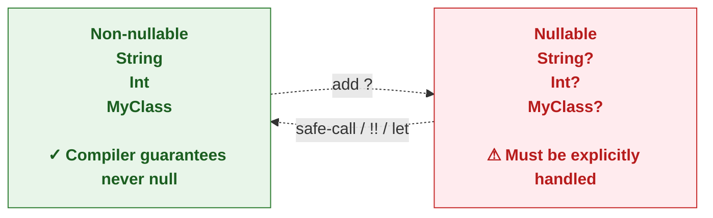
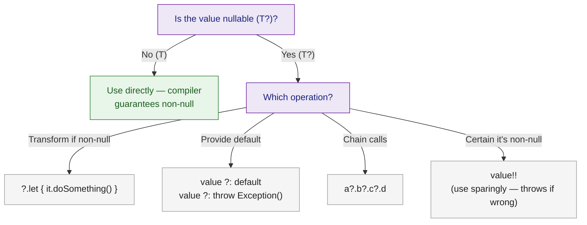

# 🟣 Kotlin Null Safety

> [!abstract] TL;DR
> Kotlin eliminates the billion-dollar mistake by encoding nullability in the type system: `String` is guaranteed non-null; `String?` can be null and must be explicitly handled. The safe-call operator `?.`, Elvis operator `?:`, and `!!` (non-null assertion) give precise control. Scope functions `let`/`run`/`apply`/`also`/`with` transform and inspect nullable and non-nullable values idiomatically. `requireNotNull`/`checkNotNull` provide fail-fast precondition checks.

---

## Intuition

Tony Hoare, who invented the null reference in 1965, called it his "billion-dollar mistake." Every Java reference is potentially null, but the compiler never forces you to check — so `NullPointerException` becomes the most common Java runtime error. Kotlin's fix: make non-null the default, nullable an explicit opt-in (`T?`), and make the compiler refuse to compile unchecked nullable access.

---

## How It Works

### The Type System Distinction



### Core Null-Handling Operators

```kotlin
// ─── SETUP ────────────────────────────────────────────────────────────────────
data class User(val name: String, val address: Address?)
data class Address(val city: String?, val zip: String)

val user: User? = fetchUser()   // might return null

// ─── Safe call (?.) ───────────────────────────────────────────────────────────
// Returns null instead of throwing NPE if receiver is null
val city: String? = user?.address?.city    // null if user or address or city is null

// ─── Elvis operator (?:) ──────────────────────────────────────────────────────
// Provide a default when the left side is null
val cityName: String = user?.address?.city ?: "Unknown City"
val userId: Long = user?.id ?: throw IllegalStateException("User ID required")

// ─── Non-null assertion (!!) ──────────────────────────────────────────────────
// Asserts non-null — throws KotlinNullPointerException if wrong
// USE ONLY when you have external proof it's non-null (e.g., post-DB constraint check)
val forcedCity: String = user!!.address!!.city!!  // dangerous chain — avoid

// ─── Smart cast after null check ──────────────────────────────────────────────
if (user != null) {
    println(user.name)  // user: User (not User?) inside this block — smart cast
}
// Also works with && short-circuit:
if (user != null && user.address != null) {
    println(user.address.city)  // both smart-cast to non-null
}
```

### Scope Functions — The Five Patterns

```kotlin
// ── let — transform nullable value; `it` refers to the receiver ──────────────
val upper: String? = user?.name?.let { it.uppercase() }

// Typical idiom: "if non-null, do something with it"
user?.let {
    println("Hello, ${it.name}")
    sendWelcomeEmail(it)
}  // nothing happens if user is null

// ── run — transform with `this` as receiver; returns lambda result ────────────
val greeting = user?.run {
    "Dear $name, your city is ${address?.city ?: "unknown"}"
}

// ── apply — configure an object; returns the receiver ─────────────────────────
val req = HttpRequest().apply {
    url = "https://api.example.com"
    method = "POST"
    headers["Content-Type"] = "application/json"
}  // returns the HttpRequest itself — good for builder-style setup

// ── also — side-effect (logging, validation); returns the receiver ─────────────
val config = loadConfig()
    .also { println("Loaded config: $it") }   // log it
    .also { require(it.isValid()) }            // validate it
// config still refers to the Config object

// ── with — call multiple methods on a non-null object (not extension) ─────────
with(user) {
    println(name)
    println(address?.city)
}
```

### Scope Function Cheat Sheet

| Function | Receiver as | Returns | Use For |
|----------|------------|---------|---------|
| `let` | `it` | Lambda result | Transform nullable value |
| `run` | `this` | Lambda result | Transform object, compute result |
| `apply` | `this` | Receiver itself | Configure/build an object |
| `also` | `it` | Receiver itself | Side-effects (log, validate) |
| `with` | `this` | Lambda result | Multiple operations, non-extension |

### `requireNotNull`, `checkNotNull`, `require`, `check`

```kotlin
// requireNotNull — throws IllegalArgumentException if null (bad input)
fun processOrder(orderId: String?) {
    val id = requireNotNull(orderId) { "orderId must not be null" }
    // id: String (non-null) from here
}

// checkNotNull — throws IllegalStateException if null (bad state)
fun getActiveUser(): User {
    return checkNotNull(currentUser) { "No user is currently logged in" }
}

// require — throws IAE if condition false (validate arguments)
fun setAge(age: Int) {
    require(age in 0..150) { "Invalid age: $age" }
}

// check — throws ISE if condition false (validate state)
fun sendMessage(msg: String) {
    check(isConnected) { "Cannot send message: not connected" }
}
```

### Handling Java Platform Types

```kotlin
// Java methods return "platform types" — Kotlin can't know if they're nullable
// Java: public String getName() { ... }  — could return null
val javaName: String = javaObject.name  // assumes non-null — risky!
val safeName: String? = javaObject.name  // treat as nullable — safe

// Best practice: annotate Java APIs with @NotNull / @Nullable
// Then Kotlin treats them as String / String? respectively
```

## Null Safety Decision Tree



## Common Pitfalls

| # | Pitfall | Fix |
|---|---------|-----|
| 1 | Overusing `!!` — converts null safety into runtime NPE | Replace with `?.let {}`, `?: default`, or `requireNotNull` |
| 2 | Using `?.` in a chain but ignoring the result type becomes `T?` | Handle the nullable result at the end of the chain with `?: fallback` |
| 3 | Confusion between `let`/`run`/`apply`/`also` | Learn the 2-axis model: `it` vs `this`, returns-lambda vs returns-receiver |
| 4 | Platform types from Java used as non-null without checking | Wrap Java calls in `?.let` or annotate the Java source |
| 5 | `if (x != null) x.doThing()` but `x` is a `var` — smart cast fails | Smart cast fails on `var` (could be modified between check and use); use `val local = x` first |

## Review Questions

1. What is a platform type and why does it weaken Kotlin's null safety guarantee?
2. Explain the difference between `apply` and `also`. When would you choose each?
3. Why does the smart cast fail when `x` is `var`? How do you fix it?
4. `requireNotNull` vs `checkNotNull` — which exception does each throw, and when should you prefer one over the other?

---

Related: [[Kotlin_Types_and_Variables]] | [[Kotlin_Functions]] | [[Kotlin_Lambda_and_Higher_Order]] | [[Kotlin_Control_Flow]]

#Kotlin
