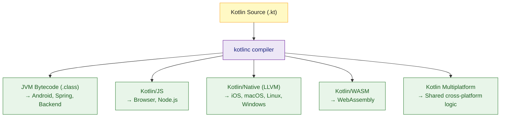

# 🟣 Kotlin Overview

> [!abstract] TL;DR
> Kotlin is a statically typed, null-safe JVM language by JetBrains (stable v1.0 in 2016). It compiles to JVM bytecode, JavaScript, and native binaries; is 100% Java-interoperable; and eliminates boilerplate through data classes, extension functions, smart casts, and first-class null safety. Google made it the preferred Android language in 2019.

---

## Intuition

Think of Kotlin as **Java with all the ceremony stripped out**. Where Java forces you to write getters, setters, `equals`, `hashCode`, `toString`, null checks, and type casts explicitly, Kotlin either auto-generates them (data classes) or bakes them into the type system (nullable types, smart casts). The result: 40–60% less code for the same logic, zero runtime overhead.

---

## How It Works

### Kotlin Compilation Targets



### Kotlin vs Java: Side-by-Side

```kotlin
// ── Java POJO — 40+ lines of boilerplate ──────────────────────────────────
// public class Person { private String name; private int age;
//   public Person(String name, int age) { this.name = name; this.age = age; }
//   public String getName() { return name; }
//   public int getAge() { return age; }
//   // equals(), hashCode(), toString(), copy()...
// }

// ── Kotlin data class — 1 line replaces all the above ─────────────────────
data class Person(val name: String, val age: Int)
// Auto-generated: equals, hashCode, toString, copy(), component1(), component2()

val alice = Person("Alice", 30)
val olderAlice = alice.copy(age = 31)         // non-destructive update
val (name, age) = alice                        // destructuring

// Extension function — add methods to existing classes without subclassing
fun String.isPalindrome(): Boolean = this == this.reversed()
println("racecar".isPalindrome())              // true — on String itself

// String templates — replace String concatenation
val greeting = "Hello, ${alice.name}! You are ${alice.age} years old."

// Smart cast — no explicit (String) cast after is-check
fun describe(obj: Any) {
    if (obj is String) {
        println(obj.uppercase())  // compiler knows obj: String here
    }
}
```

### Java Interoperability

Kotlin is 100% bidirectionally interoperable with Java. Every Java library works from Kotlin. Every Kotlin class/function is callable from Java.

```kotlin
// Calling Java from Kotlin — completely transparent
import java.util.ArrayList
val list = ArrayList<String>()
list.add("Kotlin")                             // Java method, works directly

// @JvmStatic / @JvmField — tune how Kotlin looks from Java
class Config {
    companion object {
        @JvmStatic val VERSION = "2.0"         // Java: Config.getVERSION()
        @JvmField  val TIMEOUT = 30            // Java: Config.TIMEOUT (plain field)
    }
}

// Top-level functions — compiled into a Kt-suffix class in Java
// Kotlin file "Utils.kt": fun greet(name: String) = "Hello, $name"
// Java: UtilsKt.greet("World");
// Override with: @file:JvmName("Utils") at top of file
```

### Build with Gradle Kotlin DSL

```kotlin
// build.gradle.kts — type-safe, IDE-autocompleted (vs Groovy's stringly-typed DSL)
plugins {
    kotlin("jvm") version "2.0.0"
    application
}

dependencies {
    implementation(kotlin("stdlib"))
    testImplementation("org.junit.jupiter:junit-jupiter:5.10.2")
    testRuntimeOnly("org.junit.platform:junit-platform-launcher")
}

application { mainClass.set("com.example.MainKt") }
tasks.test { useJUnitPlatform() }
```

## Kotlin Targets and Use Cases

| Target | Use Case | Key Frameworks |
|--------|----------|----------------|
| JVM | Backend services, Android | Spring Boot, Ktor, Android SDK |
| Kotlin/JS | Frontend, Node.js | React wrappers, KotlinJS |
| Kotlin/Native | iOS, desktop binaries | KMP, SKIE, Compose Desktop |
| Kotlin/WASM | Browser WebAssembly | Compose for Web |

## Key Advantages Over Java

- **Null safety** — `NullPointerException` becomes a compile-time error, not a runtime surprise (see [[Kotlin_Null_Safety]])
- **Data classes** — replace 50+ lines of Java POJO boilerplate with one line
- **Extension functions** — add methods to third-party classes without inheritance
- **Coroutines** — structured concurrency as a library; cleaner than Java threads (see [[Kotlin_Coroutines_Intro]])
- **Smart casts** — type checks double as casts; no `(String) obj` casting noise
- **When expression** — exhaustive, typed alternative to Java's `switch`
- **Default/named parameters** — eliminates Java's builder pattern for optional arguments

## Common Pitfalls

| # | Pitfall | Fix |
|---|---------|-----|
| 1 | Top-level Kotlin functions appear as `FileKt` in Java | Use `@file:JvmName("MyApi")` at the top of the file |
| 2 | Kotlin `==` calls `equals()`; Java `==` is reference identity | Use `===` for reference equality in Kotlin |
| 3 | Platform types (`String!`) from Java bypass null safety | Annotate Java APIs with `@NotNull`/`@Nullable` or use Kotlin wrappers |
| 4 | `companion object` is not `static` — needs `@JvmStatic` for Java interop | Add `@JvmStatic` to companion members accessed from Java |
| 5 | Kotlin `Int` compiles to primitive `int` on JVM — but `Int?` boxes to `Integer` | Avoid nullable primitives in hot loops; prefer non-null primitives |

## Review Questions

1. What are the four Kotlin compilation targets and a key use case for each?
2. How does Kotlin's `==` differ from Java's `==`? What operator gives Java-style reference equality?
3. A top-level Kotlin function `fun greet()` in `Utils.kt` — how does a Java caller invoke it, and how can you rename the generated class?

---

Related: [[Kotlin_Types_and_Variables]] | [[Kotlin_Null_Safety]] | [[Kotlin_Classes_and_OOP]] | [[Kotlin_Multiplatform]]

#Kotlin
