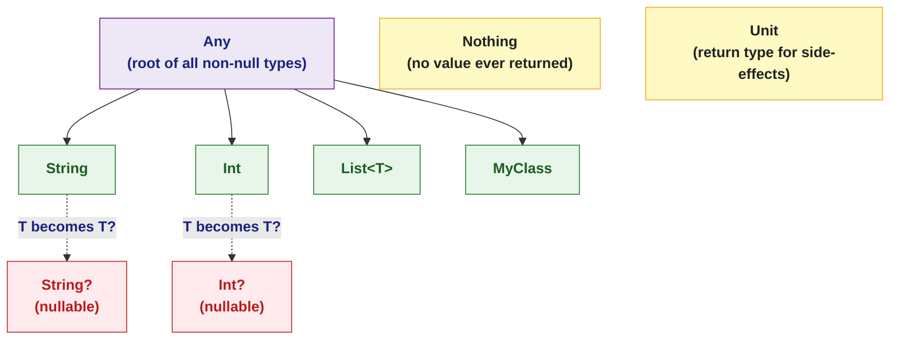

# 🟣 Kotlin Types and Variables

> [!abstract] TL;DR
> Kotlin's type system distinguishes `val` (immutable reference) from `var` (mutable), infers types from initializers, and treats nullability as a first-class type property: `String` can never be null, but `String?` can. The Elvis operator `?:`, safe call `?.`, and smart casts make null-handling explicit and safe at compile time. `Nothing` represents a computation that never returns; `Unit` replaces Java's `void`.

---

## Intuition

In Java, every reference type can be `null` — a ticking time-bomb the compiler never warns about. Kotlin bakes nullability into the type itself: `String` is a **promise** it will never be null, while `String?` acknowledges the possibility. The compiler enforces the difference, turning runtime `NullPointerException`s into compile-time errors.

`val` is like a Java `final` variable: the reference is locked after assignment. `var` is mutable. Prefer `val` by default — immutability is a design virtue, not a restriction.

---

## How It Works

### Type System Overview



### `val` vs `var`

```kotlin
val name: String = "Alice"        // immutable reference — cannot reassign
// name = "Bob"                   // compile error: Val cannot be reassigned

var counter: Int = 0              // mutable reference — reassignable
counter++                         // fine

// Type inference — compiler deduces the type from the initializer
val inferred = "Hello"            // inferred as String
val number   = 42                 // inferred as Int
val pi       = 3.14               // inferred as Double
val flag     = true               // inferred as Boolean

// val does NOT mean immutable object — only immutable reference
val list = mutableListOf(1, 2, 3)
list.add(4)                       // fine — list content changed, reference is same
```

### Nullable Types and the Safe Operators

```kotlin
// Non-nullable — compiler guarantees no null
val city: String = "London"
// city = null                    // compile error

// Nullable — must be handled explicitly
val nickname: String? = null

// Safe call operator (?.) — returns null if receiver is null
val length: Int? = nickname?.length     // null (not NPE)

// Elvis operator (?:) — provide a default when left side is null
val displayName = nickname ?: "Anonymous"   // "Anonymous"

// Non-null assertion (!!) — throw NPE if null; use only when you are certain
val forced: String = nickname!!             // throws KotlinNullPointerException

// Chaining safe calls
data class User(val address: Address?)
data class Address(val city: String?)

val user: User? = getUser()
val city: String? = user?.address?.city    // null if any link is null
val cityName = user?.address?.city ?: "Unknown"
```

### Smart Casts

```kotlin
// After an is-check, Kotlin automatically casts within the branch
fun processInput(input: Any) {
    if (input is String) {
        println(input.length)       // input: String — no explicit cast needed
        println(input.uppercase())
    }
    if (input is Int && input > 0) {
        println("Positive int: $input")
    }
}

// Smart cast also works for nullable after null-check
fun printLength(s: String?) {
    if (s != null) {
        println(s.length)           // s: String inside this block (smart cast)
    }
}

// as — unsafe cast (throws ClassCastException)
val str = input as String

// as? — safe cast, returns null instead of throwing
val str2: String? = input as? String
```

### Type Aliases

```kotlin
// Make complex types readable and refactorable in one place
typealias UserId       = Long
typealias JsonString   = String
typealias EventHandler = (String, Int) -> Unit

fun handleEvent(id: UserId, handler: EventHandler) { /* ... */ }
```

### `Nothing` and `Unit`

```kotlin
// Unit — analogous to Java void; returned implicitly when nothing meaningful
fun logMessage(msg: String): Unit {
    println(msg)
    // implicit return Unit
}

// Nothing — a function that never returns normally (throws or loops forever)
fun fail(msg: String): Nothing = throw IllegalArgumentException(msg)

// The compiler uses Nothing for exhaustive when-expressions:
val result: String = when (flag) {
    true  -> "yes"
    false -> "no"
    // No else needed — Boolean is exhaustive
}

// Useful for null coalescing with throw:
val value = map["key"] ?: fail("Missing required key")
// value: String (Nothing broadens to String in else branch)
```

## Primitive Types Under the Hood

In Kotlin `Int`, `Long`, `Double`, `Boolean`, etc. compile to JVM primitives (`int`, `long`, `double`, `boolean`) when non-nullable — zero boxing overhead. The nullable counterpart `Int?` compiles to `Integer` (boxed). Avoid nullable primitives in performance-sensitive code.

| Kotlin Type | JVM non-null | JVM nullable |
|-------------|-------------|--------------|
| `Int` | `int` | `Integer` |
| `Long` | `long` | `Long` |
| `Double` | `double` | `Double` |
| `Boolean` | `boolean` | `Boolean` |
| `Char` | `char` | `Character` |

## Common Pitfalls

| # | Pitfall | Fix |
|---|---------|-----|
| 1 | Overusing `!!` (non-null assertion) | Redesign to avoid null, or use `?.let { }` / `?: default` |
| 2 | `val` confused with deep immutability | `val list` can still mutate its contents; use `listOf()` for read-only |
| 3 | Platform types from Java (`String!`) bypass null checks | Always annotate Java APIs or handle explicitly on Kotlin side |
| 4 | `Int?` in hot loops causes boxing | Use non-nullable `Int` wherever possible |
| 5 | Forgetting `as?` and using `as` blindly | Use `as?` when you don't know the type; check for null before use |

## Review Questions

1. What is the difference between `val` and `var`? Does `val` guarantee deep immutability?
2. How do `?.` (safe call) and `?:` (Elvis) work together? Give an example of chaining three nullable calls.
3. When does Kotlin box an `Int` into `Integer` on the JVM? Why does this matter for performance?
4. What is the `Nothing` type, and how does the compiler use it when inferring the type of a `when` expression?

---

Related: [[Kotlin_Overview]] | [[Kotlin_Null_Safety]] | [[Kotlin_Control_Flow]] | [[Kotlin_Generics]]

#Kotlin
