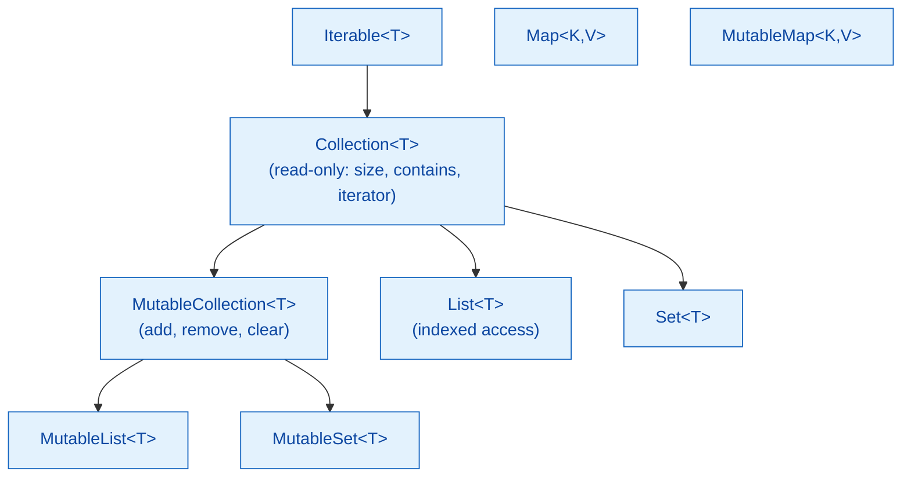

# 🟣 Kotlin Collections

> [!abstract] TL;DR
> Kotlin's collection hierarchy separates **read-only views** (`List`, `Set`, `Map`) from **mutable** variants (`MutableList`, `MutableSet`, `MutableMap`). The stdlib ships 60+ extension operators: `map`, `filter`, `flatMap`, `fold`/`reduce`, `groupBy`, `associateBy`, `partition`, `any`/`all`/`none`, and `sortedBy`. **Sequences** add lazy evaluation — deferring operations until `toList()` or `first()` is called, avoiding intermediate collection allocation for large or chained pipelines.

---

## Intuition

Kotlin's read-only collections are like Java's `Collections.unmodifiableList()` — but baked into the type system from the start, not bolted on. You pass a `List<T>` and callers can't mutate it; if you need mutation, you pass a `MutableList<T>`. On top of this, the stdlib's functional operators make data transformations pipeline-style, reading left to right like a sentence.

---

## How It Works

### Collection Hierarchy



### Creating Collections

```kotlin
// Read-only (backed by ArrayList, LinkedHashSet, LinkedHashMap under the hood)
val nums     = listOf(1, 2, 3, 4, 5)
val evens    = setOf(2, 4, 6)
val capitals = mapOf("UK" to "London", "FR" to "Paris", "DE" to "Berlin")

// Mutable
val mNums = mutableListOf(1, 2, 3)
mNums.add(4)
mNums.removeAt(0)

val mMap = mutableMapOf<String, Int>()
mMap["alice"] = 30
mMap.getOrPut("bob") { 25 }    // insert if absent, return value

// Building with buildList / buildMap (safe mutable builder → immutable result)
val squares = buildList {
    for (i in 1..5) add(i * i)
}  // squares: List<Int> = [1, 4, 9, 16, 25]
```

### Essential Collection Operators

```kotlin
val people = listOf(
    Person("Alice", 30), Person("Bob", 25),
    Person("Carol", 35), Person("Dave", 25)
)

// map — transform each element
val names = people.map { it.name }                    // [Alice, Bob, Carol, Dave]

// filter — keep matching elements
val over30 = people.filter { it.age >= 30 }           // [Alice, Carol]

// flatMap — map then flatten
val teams = listOf(listOf("Alice","Bob"), listOf("Carol","Dave"))
val allMembers = teams.flatMap { it }                 // [Alice, Bob, Carol, Dave]

// fold / reduce — accumulate
val sumOfAges = people.fold(0) { acc, p -> acc + p.age }  // 115
val totalAge  = people.map { it.age }.reduce { a, b -> a + b }

// groupBy — partition into a Map<K, List<V>>
val byAge = people.groupBy { it.age }
// {30=[Alice], 25=[Bob, Dave], 35=[Carol]}

// associateBy — build Map<K, V> (last wins on duplicate keys)
val byName = people.associateBy { it.name }
// {Alice=Person(...), Bob=Person(...), ...}

// partition — split into (matching, non-matching) Pair
val (adults, others) = people.partition { it.age >= 30 }

// any / all / none
val anyOver40 = people.any { it.age > 40 }           // false
val allAdults = people.all { it.age >= 18 }           // true

// sortedBy / sortedWith
val sorted = people.sortedBy { it.age }               // ascending by age
val sortedDesc = people.sortedByDescending { it.name }

// first / last / find / firstOrNull
val youngest = people.minByOrNull { it.age }          // Bob or Dave (tie)
val found    = people.firstOrNull { it.name == "Carol" }

// distinct / distinctBy
val uniqueAges = people.map { it.age }.distinct()     // [30, 25, 35]
val uniqueByAge = people.distinctBy { it.age }        // one person per age
```

### Sequences — Lazy Evaluation

```kotlin
// Eager (normal collections): builds intermediate list after every operation
val result = (1..1_000_000)
    .filter { it % 2 == 0 }    // creates List of 500,000 elements
    .map { it * it }            // creates another List of 500,000 elements
    .take(5)                    // finally takes 5
    .toList()

// Lazy (sequences): operations fused — processes one element at a time
val resultLazy = (1..1_000_000).asSequence()
    .filter { it % 2 == 0 }   // no list created — lazy predicate
    .map { it * it }           // no list created — lazy transform
    .take(5)                   // stops after finding 5 — no further processing
    .toList()                  // terminal: materializes result [4, 16, 36, 64, 100]

// Use sequences when:
// - Pipeline has 3+ chained operations
// - Collection has > ~1000 elements
// - Only need the first N results
// - Operations involve heavy computation

// generateSequence — infinite sequences
val fibs = generateSequence(Pair(0L, 1L)) { (a, b) -> Pair(b, a + b) }
    .map { it.first }
    .take(10)
    .toList()   // [0, 1, 1, 2, 3, 5, 8, 13, 21, 34]
```

### Collection Utility Functions

```kotlin
// zip — pair two collections
val keys = listOf("a", "b", "c")
val vals = listOf(1, 2, 3)
val pairs = keys.zip(vals)           // [(a,1), (b,2), (c,3)]
val (ks, vs) = pairs.unzip()        // back to two lists

// chunked / windowed
listOf(1..9).flatMap { listOf(it) }.chunked(3)     // [[1,2,3],[4,5,6],[7,8,9]]
(1..5).toList().windowed(3, step = 1)               // [[1,2,3],[2,3,4],[3,4,5]]

// flatten
listOf(listOf(1,2), listOf(3,4)).flatten()          // [1,2,3,4]

// joinToString
listOf("a","b","c").joinToString(", ", "[", "]")    // "[a, b, c]"
```

## Eager vs Lazy Comparison

| Aspect | Eager (`List`) | Lazy (`Sequence`) |
|--------|---------------|-------------------|
| Intermediate collections | Yes — one per operation | No — fused pipeline |
| Order of operations | All `filter`, then all `map` | `filter`+`map` per element |
| Short-circuit (`take`, `first`) | Processes full list then takes | Stops after condition met |
| Best for | Small collections, single op | Large data, chained ops, infinite streams |

## Common Pitfalls

| # | Pitfall | Fix |
|---|---------|-----|
| 1 | Modifying a read-only `List` — it's a compile error | Use `MutableList` when mutation is needed |
| 2 | Using eager operations on large datasets in a chain | Switch to `asSequence()` before the chain |
| 3 | `associateBy` silently overwrites on duplicate keys | Use `groupBy` if multiple values per key are expected |
| 4 | Forgetting terminal operation on sequence — no result | Always end a Sequence pipeline with `toList()`, `first()`, `count()`, etc. |
| 5 | `listOf(array)` creates `List<Array<T>>` not `List<T>` | Use `array.toList()` or spread: `listOf(*array)` |

## Review Questions

1. What is the difference between `List<T>` and `MutableList<T>` in Kotlin's type system? How does this differ from Java's `Collections.unmodifiableList()`?
2. When should you prefer a `Sequence` over a `List` for collection operations? Give a concrete example.
3. What does `groupBy` return? How does it differ from `associateBy`?

---

Related: [[Kotlin_Lambda_and_Higher_Order]] | [[Kotlin_Generics]] | [[Kotlin_Coroutines_Intro]] | [[Kotlin_Flow]] | [[Stream_Pipeline_and_Collectors]]

#Kotlin
