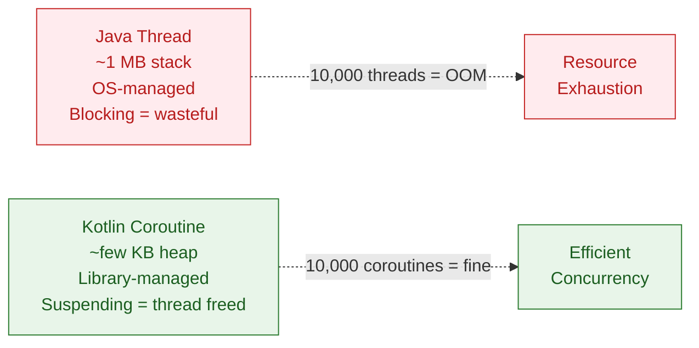

# 🟣 Kotlin Coroutines Introduction

> [!abstract] TL;DR
> Coroutines are **lightweight threads** implemented as a library (`kotlinx.coroutines`). A `suspend` function can pause execution without blocking a thread — the thread is freed for other work while waiting. `runBlocking` bridges sync and async worlds; `launch` fires a fire-and-forget coroutine; `async`/`await` returns a result. Dispatchers route coroutines to thread pools. `GlobalScope` is an antipattern — always use structured concurrency with a proper scope.

---

## Intuition

Java threads are expensive OS resources — a blocked thread holds ~1 MB of stack and can't do other work while waiting. A coroutine is a **suspendable computation**: when it hits a `suspend` call (like a network request), it pauses, frees the thread, and resumes later — potentially on a different thread. 10,000 coroutines can run on a handful of threads. This is the same idea as JavaScript's `async`/`await` or Python's `asyncio`, but integrated into the JVM.

---

## How It Works

### Coroutine vs Thread



### `suspend` Functions

```kotlin
import kotlinx.coroutines.*

// suspend — marks a function that can pause without blocking a thread
suspend fun fetchUser(id: Long): User {
    delay(100)              // suspend for 100ms — frees the thread (not Thread.sleep)
    return userService.getUser(id)
}

// suspend functions can only be called from other suspend functions or coroutines
suspend fun loadDashboard(): Dashboard {
    val user    = fetchUser(1L)    // suspends here while fetching
    val profile = fetchProfile(user)
    return Dashboard(user, profile)
}
```

### `runBlocking` — Bridge for Main/Tests

```kotlin
// runBlocking — blocks the current thread until all coroutines inside finish
// Used ONLY in main() and tests — never in production coroutine code
fun main() = runBlocking {
    println("Start")
    delay(1000)          // coroutine suspended — but main thread is blocked
    println("Done after 1s")
}

// In unit tests:
@Test
fun testFetch() = runBlocking {
    val user = fetchUser(1L)
    assertEquals("Alice", user.name)
}
```

### `launch` vs `async`/`await`

```kotlin
fun main() = runBlocking {
    // launch — fire and forget; returns a Job
    val job = launch {
        delay(500)
        println("Coroutine 1 done")
    }

    // async — returns Deferred<T>; call .await() to get the result
    val deferred: Deferred<Int> = async {
        delay(300)
        42
    }

    println("Launched both")
    job.join()               // wait for job to complete
    val result = deferred.await()  // suspend until deferred resolves
    println("Result: $result")     // 42
}

// Parallel decomposition with async
suspend fun loadParallel(): Pair<User, Orders> = coroutineScope {
    val userDeferred   = async { fetchUser(1L) }
    val ordersDeferred = async { fetchOrders(1L) }
    // Both network calls run in parallel
    Pair(userDeferred.await(), ordersDeferred.await())
}
```

### Dispatchers

```kotlin
// Dispatchers.Default — CPU-bound work (shared thread pool, #CPUs threads)
// Dispatchers.IO     — blocking I/O (elastically sized pool, up to 64 threads)
// Dispatchers.Main   — Android/JavaFX UI thread (only available in Android/Swing)
// Dispatchers.Unconfined — starts in caller thread, resumes in whatever thread

launch(Dispatchers.IO) {
    val data = File("big.csv").readText()   // blocking I/O — use IO dispatcher
}

launch(Dispatchers.Default) {
    val sorted = bigList.sortedBy { it.value }  // CPU-heavy — use Default
}

// withContext — switch dispatcher within a coroutine
suspend fun processFile(path: String): List<Row> = withContext(Dispatchers.IO) {
    val text = File(path).readText()         // runs on IO thread pool
    withContext(Dispatchers.Default) {
        parseAndTransform(text)              // CPU work on Default thread pool
    }
}
```

### `GlobalScope` — The Antipattern

```kotlin
// GlobalScope — lives as long as the entire application; not tied to any lifecycle
// Antipattern because: leaks, uncaught exceptions silently disappear, not testable
GlobalScope.launch { /* AVOID — lifecycle nightmare */ }

// Instead — use a scoped coroutine (cancelled when scope is cancelled)
class MyViewModel : ViewModel() {
    fun loadData() {
        viewModelScope.launch {   // cancelled when ViewModel is cleared
            val data = fetchData()
            _uiState.value = data
        }
    }
}
```

### `coroutineScope` — Structured Concurrency

```kotlin
// coroutineScope — creates a child scope; suspends until ALL children complete
// If any child throws, all siblings are cancelled
suspend fun fetchAll(): List<Item> = coroutineScope {
    val a = async { fetchPartA() }
    val b = async { fetchPartB() }
    listOf(a.await(), b.await())
    // If fetchPartA() throws, fetchPartB() is cancelled too
}
```

## Coroutine Builders at a Glance

| Builder | Returns | Use Case | Cancels on exception? |
|---------|---------|----------|----------------------|
| `launch` | `Job` | Fire-and-forget side effects | Propagates to parent |
| `async` | `Deferred<T>` | Parallel tasks returning a value | Propagates to parent |
| `runBlocking` | `T` | Main/tests bridge to suspend world | Blocks calling thread |
| `coroutineScope` | `T` | Parallel sub-tasks, structured | Cancels all children |
| `supervisorScope` | `T` | Independent sub-tasks | Children isolated |

## Common Pitfalls

| # | Pitfall | Fix |
|---|---------|-----|
| 1 | `Thread.sleep()` inside a coroutine — blocks the dispatcher thread | Use `delay()` which suspends without blocking |
| 2 | Using `GlobalScope` in production code | Use `viewModelScope`, `lifecycleScope`, or a scoped `CoroutineScope` |
| 3 | Calling `async` but forgetting `.await()` — exceptions are silently swallowed | Always `await()` a Deferred or use `launch` if you don't need the result |
| 4 | `runBlocking` on the Android main thread — ANR | Never use `runBlocking` on UI threads; use `lifecycleScope.launch` |
| 5 | Sequential `await` calls losing parallelism | Call `async` first for both, then `await` both — don't interleave |

## Review Questions

1. What is the difference between `delay(100)` and `Thread.sleep(100)` in a coroutine context?
2. How does `async`/`await` differ from `launch`/`join`? When would you choose each?
3. Why is `GlobalScope` considered an antipattern for Android development?

---

Related: [[Coroutine_Builders_and_Scope]] | [[Coroutine_Dispatchers_and_Context]] | [[Kotlin_Flow]] | [[Structured_Concurrency]] | [[Threads_and_Synchronization]]

#Kotlin
