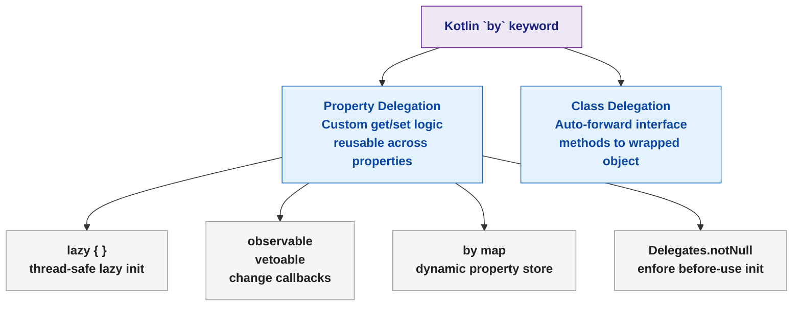

# 🟣 Kotlin Delegation

> [!abstract] TL;DR
> Kotlin's `by` keyword implements both **property delegation** (custom get/set logic reused across properties) and **class delegation** (automatic interface forwarding to a wrapped object, replacing boilerplate delegation code). Built-in property delegates include `lazy` (thread-safe lazy initialization), `observable`/`vetoable` (change listeners), `by map` (dynamic backing store from a map), and `Delegates.notNull` (enforce assignment before use).

---

## Intuition

Every time you write a class that wraps another to add logging or monitoring, you write the same boilerplate: delegate every interface method to the wrapped object. Kotlin's class delegation writes that boilerplate for you. Similarly, `lazy { }` is the standard double-checked locking singleton pattern — except you write one line instead of fifteen.

---

## How It Works

### Property Delegation Mechanics

```kotlin
// A property delegate implements getValue (and optionally setValue)
class Delegate {
    operator fun getValue(thisRef: Any?, property: KProperty<*>): String {
        return "${property.name} read from $thisRef"
    }
    operator fun setValue(thisRef: Any?, property: KProperty<*>, value: String) {
        println("${property.name} = '$value' set on $thisRef")
    }
}

class Example {
    var text: String by Delegate()
}

val e = Example()
println(e.text)     // "text read from Example@..."
e.text = "hello"    // "text = 'hello' set on Example@..."
```

### `lazy` — Thread-Safe Lazy Initialization

```kotlin
// Computed once on first access; subsequent accesses return cached value
class HeavyService {
    val databaseConnection: DatabaseConnection by lazy {
        println("Connecting to DB…")   // only called the first time
        DatabaseConnection.connect()
    }

    val config: Config by lazy { Config.load() }
}

val svc = HeavyService()
// No DB connection yet
println(svc.databaseConnection)   // "Connecting to DB…" then uses it
println(svc.databaseConnection)   // uses cached — no "Connecting…" again

// Thread safety modes
val default   by lazy { /* SYNCHRONIZED — safe for multi-threaded, slight overhead */ }
val lockFree  by lazy(LazyThreadSafetyMode.PUBLICATION) { /* CAS-based */ }
val unsafe    by lazy(LazyThreadSafetyMode.NONE) { /* No sync — single-thread only */ }
```

### `observable` and `vetoable`

```kotlin
import kotlin.properties.Delegates

// observable — callback fired AFTER value changes
class User {
    var name: String by Delegates.observable("<no name>") { prop, old, new ->
        println("${prop.name}: '$old' → '$new'")
    }
}

val u = User()
u.name = "Alice"    // name: '<no name>' → 'Alice'
u.name = "Bob"      // name: 'Alice' → 'Bob'

// vetoable — callback fired BEFORE change; return false to reject
class Config {
    var timeout: Int by Delegates.vetoable(30) { _, old, new ->
        println("Trying to change timeout $old → $new")
        new in 1..300    // only allow values 1–300
    }
}

val cfg = Config()
cfg.timeout = 60     // accepted → 60
cfg.timeout = 0      // rejected → stays 60
println(cfg.timeout) // 60
```

### `by map` — Dynamic Properties from a Map

```kotlin
// Properties backed by a mutable map — useful for JSON deserialization or DI containers
class DynamicConfig(private val props: MutableMap<String, Any?>) {
    var host: String     by props
    var port: Int        by props
    var timeout: Int     by props
}

val props = mutableMapOf<String, Any?>("host" to "localhost", "port" to 5432, "timeout" to 30)
val cfg = DynamicConfig(props)
println(cfg.host)    // "localhost"
cfg.port = 5433
println(props["port"])  // 5433 — map is mutated
```

### `Delegates.notNull` — Enforce Assignment Before Use

```kotlin
// Like lateinit but works for nullable types and non-class properties
class Fragment {
    var listener: ClickListener by Delegates.notNull()
    // var listener: ClickListener by notNull()  — throws IllegalStateException if read before set
}

// Note: lateinit works only on var properties of non-primitive reference types
class Activity {
    lateinit var binding: ActivityMainBinding

    fun onCreate() {
        binding = ActivityMainBinding.inflate(layoutInflater)
        println(binding.root)  // safe — initialized
    }
}
// if (::binding.isInitialized) { ... }  — check before access
```

### Class Delegation — Forwarding Without Boilerplate

```kotlin
// Without class delegation — write every method manually
class LoggingList<T>(private val wrapped: MutableList<T>) : MutableList<T> {
    override fun add(element: T): Boolean {
        println("Adding $element")
        return wrapped.add(element)    // boilerplate for every method
    }
    // ... 15+ more methods to delegate ...
}

// With class delegation — compiler generates all forwarding methods
class LoggingList2<T>(private val wrapped: MutableList<T>) : MutableList<T> by wrapped {
    override fun add(element: T): Boolean {       // only override what you need
        println("Adding $element")
        return wrapped.add(element)
    }
    // All other MutableList methods auto-delegated to wrapped
}

val log = LoggingList2(mutableListOf<Int>())
log.add(1)        // "Adding 1"
log.add(2)        // "Adding 2"
log.size          // 2 — delegated to wrapped

// Practical: adding caching to an existing service
interface UserRepository { fun findById(id: Long): User? }

class CachingUserRepository(
    private val delegate: UserRepository,
    private val cache: MutableMap<Long, User> = HashMap()
) : UserRepository by delegate {
    override fun findById(id: Long): User? =
        cache.getOrPut(id) { delegate.findById(id) ?: return null }
}
```

## Delegation Patterns Summary



## Common Pitfalls

| # | Pitfall | Fix |
|---|---------|-----|
| 1 | `lazy` in a multi-threaded context with `NONE` mode | Use default `SYNCHRONIZED` mode unless single-threaded access is guaranteed |
| 2 | `by map` requires exact property name as key | Map key must match property name exactly (case-sensitive) |
| 3 | Class delegation captures the initial delegate object — can't swap it | Store a mutable reference; or override methods that need to re-dispatch |
| 4 | `lateinit` on primitive type — compile error | Use `Delegates.notNull()` for primitives needing deferred initialization |
| 5 | `vetoable` veto logic has side-effects — veto still logs | Separate veto logic from side-effects; vetoable runs the lambda regardless of decision |

## Review Questions

1. How does `lazy` implement thread safety under the hood? What are the three `LazyThreadSafetyMode` options?
2. How does class delegation (`by`) differ from manually writing delegation methods? What is the key limitation?
3. When would you use `Delegates.notNull()` instead of `lateinit var`?

---

Related: [[Kotlin_Classes_and_OOP]] | [[Kotlin_Generics]] | [[Kotlin_Lambda_and_Higher_Order]] | [[Kotlin_Android_Basics]]

#Kotlin
