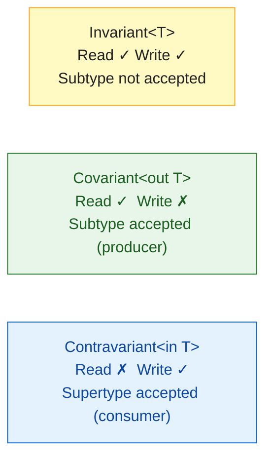

# 🟣 Kotlin Generics

> [!abstract] TL;DR
> Kotlin generics add **declaration-site variance** (`out` for covariance, `in` for contravariance) to Java's use-site `? extends`/`? super` wildcards, resulting in cleaner API signatures. Star projection (`*`) is a safe wildcard for unknown types. Upper bounds via `where T : Comparable<T>` constrain type parameters. `inline` + `reified` breaks through JVM type erasure, enabling `is T` checks and `T::class.java` without reflection.

---

## Intuition

Java wildcards (`? extends T`, `? super T`) are notoriously confusing — they're a use-site mechanism meaning every method signature that uses a collection must repeat the variance intent. Kotlin moves variance to the **declaration site**: you say once that `List<out T>` is covariant (producer), and every usage of `List` inherits that variance automatically. "out = produces, in = consumes" — think of it as PECS (Producer Extends, Consumer Super) expressed in the type declaration itself.

---

## How It Works

### Invariant vs Covariant vs Contravariant



### Invariant Generics (default)

```kotlin
// MutableList<T> is invariant — you can read AND write
val mutableStrings: MutableList<String> = mutableListOf("a", "b")
// val mutableAny: MutableList<Any> = mutableStrings  // COMPILE ERROR — invariant!
// If allowed: mutableAny.add(42)  ← would corrupt a List<String>
```

### Covariant — `out` (Declaration-Site)

```kotlin
// List<out T> declared in stdlib — covariant, read-only
// "out T" means: this class only produces T, never consumes it
val strings: List<String> = listOf("a", "b", "c")
val anys: List<Any> = strings          // OK! List<String> is a subtype of List<Any>
println(anys[0])                        // safe — you can only read

// Your own covariant class
class Box<out T>(val value: T) {       // out: T only appears in "out" position
    fun get(): T = value               // returns T — producer
    // fun set(v: T) { ... }           // COMPILE ERROR — T in "in" position
}

val strBox: Box<String> = Box("hello")
val anyBox: Box<Any> = strBox          // OK — Box<String> is-a Box<Any>
```

### Contravariant — `in` (Declaration-Site)

```kotlin
// Contravariant: accepts T and supertypes — consumer
interface Printer<in T> {              // in: T only appears in "in" position
    fun print(value: T)                // consumes T
    // fun current(): T { ... }        // COMPILE ERROR — T in "out" position
}

val anyPrinter: Printer<Any> = object : Printer<Any> {
    override fun print(value: Any) = println(value)
}
val stringPrinter: Printer<String> = anyPrinter  // OK — Printer<Any> is-a Printer<String>
stringPrinter.print("hello")                      // Printer<Any> can handle String

// Comparable in stdlib uses `in`:
// interface Comparable<in T> { fun compareTo(other: T): Int }
```

### Use-Site Variance (Projection)

```kotlin
// When you can't change the declaration, use projection at the call site
fun copyTo(from: MutableList<out Any>, to: MutableList<Any>) {
    to.addAll(from)   // from is projected to read-only here
}

fun fill(list: MutableList<in Int>, value: Int) {
    list.add(value)   // list accepts Int (and Any)
}
```

### Star Projection

```kotlin
// * — when you don't know or care about the type parameter
fun printAll(list: List<*>) {
    for (item in list) println(item)  // item: Any?
}

// Useful for runtime type checks
fun isList(obj: Any) = obj is List<*>  // can't write is List<String> — erased
```

### Upper Bounds and Multiple Constraints

```kotlin
// Single upper bound
fun <T : Comparable<T>> max(a: T, b: T): T = if (a > b) a else b

// Multiple upper bounds — use where clause
fun <T> copyIfBigEnough(list: List<T>, dest: MutableList<T>)
    where T : Comparable<T>, T : Cloneable {
    list.filter { it > 0 as T }.forEach { dest.add(it) }
}

// Nullable upper bound (default is Any?)
fun <T> nullOrElse(value: T?, default: T): T = value ?: default
```

### Reified Type Parameters

```kotlin
// JVM erases generic types at runtime: List<String> becomes List at bytecode level
// Normal generics can't do: if (obj is T) — T is unknown at runtime

// inline + reified: compiler substitutes the actual type at each call site
inline fun <reified T : Any> Any.isType(): Boolean = this is T

println("hello".isType<String>())    // true — compiled as: "hello" is String
println(42.isType<String>())         // false — compiled as: 42 is String

// Get Class<T> without passing it as a parameter
inline fun <reified T> createInstance(): T = T::class.java.getDeclaredConstructor().newInstance()
val str: String = createInstance()   // new String() at bytecode — awkward example, but valid

// Real-world: Jackson deserialization without Class<T> parameter
inline fun <reified T> String.fromJson(): T = jacksonObjectMapper().readValue(this, T::class.java)
val user: User = """{"name":"Alice","age":30}""".fromJson()
```

## Variance Summary

| Modifier | Produced/Consumed | Subtype relationship | Java equivalent |
|----------|-------------------|---------------------|-----------------|
| (none) invariant | Both | `MutableList<String>` ≠ `MutableList<Any>` | Raw or `? exact T` |
| `out` covariant | Produced only | `List<String>` is `List<Any>` | `? extends T` |
| `in` contravariant | Consumed only | `Printer<Any>` is `Printer<String>` | `? super T` |
| `*` star | Unknown | `List<*>` — read as `Any?`, write blocked | `?` wildcard |

## Common Pitfalls

| # | Pitfall | Fix |
|---|---------|-----|
| 1 | Trying to add to a `List<out T>` — compiler refuses | Use `MutableList<T>` (invariant) for read-write access |
| 2 | Using `is List<String>` at runtime — always warns | Use `is List<*>` for safe runtime check; type parameter is erased |
| 3 | Confusing declaration-site vs use-site variance | Prefer declaration-site (`out`/`in` in the class); use projection only at call site |
| 4 | `reified` without `inline` | Compiler error — reified requires inline |
| 5 | Star projection `List<*>` elements are `Any?` — requires cast | Check type before casting; use `filterIsInstance<T>()` instead |

## Review Questions

1. Explain the difference between `List<out T>` and `MutableList<T>`. Why is `MutableList` invariant?
2. What is the PECS principle and how do Kotlin's `out`/`in` keywords express it at declaration-site?
3. Why does `inline fun <reified T>` work where a normal `fun <T>` cannot? What does the compiler do differently?

---

Related: [[Kotlin_Collections]] | [[Kotlin_Lambda_and_Higher_Order]] | [[Kotlin_Delegation]] | [[Kotlin_Classes_and_OOP]]

#Kotlin
