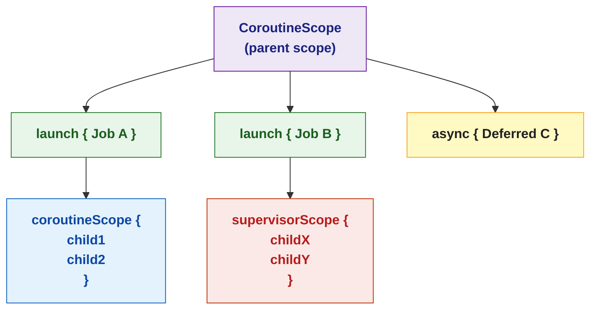

# 🟣 Coroutine Builders and Scope

> [!abstract] TL;DR
> `CoroutineScope` is the container that defines the lifecycle of coroutines. `launch` creates fire-and-forget `Job`s; `async` creates `Deferred<T>` tasks for parallel work. `withContext` switches the coroutine dispatcher. `coroutineScope` groups children — if any fails, all are cancelled. `supervisorScope` isolates failures — children fail independently. In Android `ViewModel`, `viewModelScope` ties all coroutines to the ViewModel lifecycle.

---

## Intuition

Think of `CoroutineScope` as a project manager: it tracks all running coroutines (workers) and can cancel them all at once when the project ends. `coroutineScope` is a strict manager — if one worker fails, the whole team stops. `supervisorScope` is a lenient manager — individual worker failures don't affect the others. You always work within a scope, never freely launching coroutines into the void.

---

## How It Works

### CoroutineScope Hierarchy



### `launch` — Fire and Forget

```kotlin
import kotlinx.coroutines.*

val scope = CoroutineScope(Dispatchers.Default)

val job: Job = scope.launch {
    println("Doing background work")
    delay(1000)
    println("Work complete")
}

// Job operations
job.join()      // suspend until job completes
job.cancel()    // cancel the coroutine
println("Job active: ${job.isActive}")
println("Job complete: ${job.isCompleted}")

// launch with error handling
val job2 = scope.launch {
    try {
        riskyOperation()
    } catch (e: Exception) {
        println("Error: ${e.message}")
    }
}
```

### `async` — Parallel Tasks with Results

```kotlin
suspend fun loadUserDashboard(userId: Long): Dashboard = coroutineScope {
    // Start both network calls in parallel
    val userDeferred    = async(Dispatchers.IO) { fetchUser(userId) }
    val settingsDeferred = async(Dispatchers.IO) { fetchSettings(userId) }
    val notifDeferred   = async(Dispatchers.IO) { fetchNotifications(userId) }

    // Await all — Dashboard constructed when all three complete
    Dashboard(
        user          = userDeferred.await(),
        settings      = settingsDeferred.await(),
        notifications = notifDeferred.await()
    )
    // Total time ≈ max(fetch times), not sum — true parallelism
}

// Deferred.await() can also be called lazily
val deferred = async(start = CoroutineStart.LAZY) { expensiveCompute() }
// Computation starts only when await() is called:
val result = deferred.await()
```

### `withContext` — Context Switching

```kotlin
// withContext is the idiomatic way to switch dispatcher within a coroutine
suspend fun processData(rawData: String): Result {
    // Switch to IO to read the file (blocking)
    val fileContent = withContext(Dispatchers.IO) {
        File("data.json").readText()    // runs on IO thread pool
    }
    // Back to original dispatcher after withContext block
    // Switch to Default for CPU-intensive parsing
    val parsed = withContext(Dispatchers.Default) {
        heavyJsonParsing(fileContent)
    }
    return parsed
}

// withContext suspends (doesn't block) — the current coroutine is suspended,
// thread is freed, work happens on target dispatcher, then resume
```

### `coroutineScope` vs `supervisorScope`

```kotlin
// ── coroutineScope — one failure cancels all siblings ────────────────────────
suspend fun strictLoad(): Pair<A, B> = coroutineScope {
    val a = async { fetchA() }   // if fetchA throws...
    val b = async { fetchB() }   // ...fetchB is cancelled too
    Pair(a.await(), b.await())   // exception propagates to caller
}

// ── supervisorScope — siblings fail independently ─────────────────────────────
suspend fun lenientLoad(): Results = supervisorScope {
    val a = async { fetchA() }   // if fetchA throws...
    val b = async { fetchB() }   // ...fetchB continues independently

    Results(
        aResult = try { a.await() } catch (e: Exception) { null },
        bResult = try { b.await() } catch (e: Exception) { null }
    )
}

// Typical use: loading a list where some items may fail
suspend fun loadProducts(ids: List<Long>): List<Product?> = supervisorScope {
    ids.map { id -> async { fetchProduct(id) } }
       .map { deferred ->
           try { deferred.await() }
           catch (e: Exception) { null }    // one failure doesn't kill the rest
       }
}
```

### ViewModel Lifecycle in Android

```kotlin
class UserViewModel : ViewModel() {
    private val _uiState = MutableStateFlow<UiState>(UiState.Loading)
    val uiState: StateFlow<UiState> = _uiState.asStateFlow()

    fun loadUser(userId: Long) {
        viewModelScope.launch {           // tied to ViewModel lifecycle
            _uiState.value = UiState.Loading
            try {
                val user = withContext(Dispatchers.IO) { repo.getUser(userId) }
                _uiState.value = UiState.Success(user)
            } catch (e: Exception) {
                _uiState.value = UiState.Error(e.message ?: "Unknown error")
            }
        }
        // Automatically cancelled when ViewModel is cleared (e.g., screen closed)
    }
}
// viewModelScope uses SupervisorJob — failed coroutines don't cancel the scope
```

### Custom CoroutineScope

```kotlin
// For non-Android classes, create and manage your own scope
class DataSyncService : AutoCloseable {
    private val scope = CoroutineScope(SupervisorJob() + Dispatchers.Default)

    fun startSync() {
        scope.launch {
            while (isActive) {
                syncData()
                delay(5_000)
            }
        }
    }

    override fun close() {
        scope.cancel()   // cancel all running coroutines on cleanup
    }
}
```

## Builder Decision Guide

| Need | Use |
|------|-----|
| Background task, no result | `launch` |
| Parallel tasks, need result | `async` + `await` |
| All-or-nothing parallel work | `coroutineScope` + multiple `async` |
| Independent parallel work (partial success OK) | `supervisorScope` + multiple `async` |
| Switch thread pool for one block | `withContext(Dispatcher)` |
| Bridge sync → async (main/test only) | `runBlocking` |

## Common Pitfalls

| # | Pitfall | Fix |
|---|---------|-----|
| 1 | `async` result ignored — exception silently swallowed | Always `await()` or add `invokeOnCompletion` on every Deferred |
| 2 | Sequential `async`/`await` — no parallelism gained | Separate all `async` calls before any `await` call |
| 3 | `coroutineScope` when you want isolated failures | Use `supervisorScope` if partial results are acceptable |
| 4 | Forgetting to cancel custom scopes — resource leak | Implement `AutoCloseable` and cancel in `close()` / lifecycle hooks |
| 5 | `withContext` inside a tight loop — unnecessary context switch overhead | Batch the context switch once outside the loop |

## Review Questions

1. What is the structural difference between `coroutineScope` and `supervisorScope` when a child coroutine throws?
2. Why does `viewModelScope` use `SupervisorJob` instead of a regular `Job`?
3. When `async` is called with `CoroutineStart.LAZY`, when does execution actually begin?

---

Related: [[Kotlin_Coroutines_Intro]] | [[Coroutine_Dispatchers_and_Context]] | [[Structured_Concurrency]] | [[Kotlin_Android_Basics]]

#Kotlin
