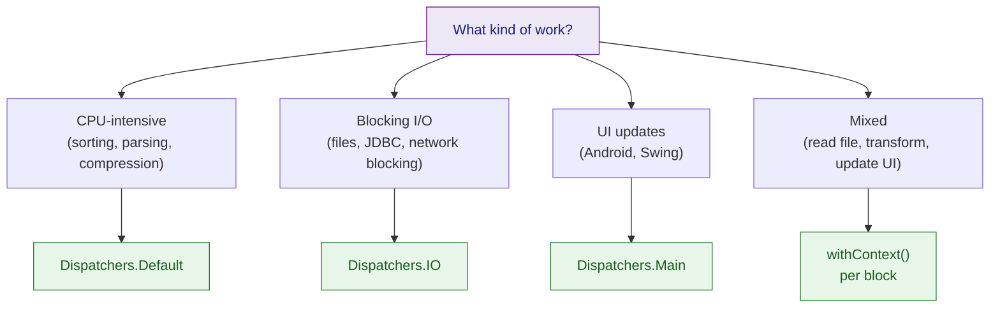

# 🟣 Coroutine Dispatchers and Context

> [!abstract] TL;DR
> `CoroutineContext` is an immutable key-value map that carries the `Job`, `Dispatcher`, `CoroutineName`, and `CoroutineExceptionHandler` for every coroutine. Dispatchers route execution to thread pools: `Default` (CPU), `IO` (blocking I/O), `Main` (UI), `Unconfined` (caller's thread). `Job` tracks the coroutine lifecycle and forms a parent-child tree. Cancellation is cooperative: `isActive`, `ensureActive()`, and `yield()` are the checkpoints.

---

## Intuition

Every coroutine has a "passport" — its `CoroutineContext` — that tells the runtime which thread pool to use, who the parent is, and what to call it. When you cancel a parent `Job`, all its children receive a `CancellationException`. But coroutines don't check for cancellation automatically — they must cooperate by periodically calling suspension points (`delay`, `yield`, `ensureActive`). A coroutine that never suspends can't be cancelled.

---

## How It Works

### CoroutineContext Anatomy

```kotlin
// CoroutineContext is a set of Element, each keyed by its type
// You compose contexts with + operator
val context: CoroutineContext =
    Dispatchers.Default +          // which thread pool
    Job() +                        // lifecycle handle
    CoroutineName("worker") +      // debugging label
    CoroutineExceptionHandler { _, throwable ->
        println("Uncaught: $throwable")
    }

val scope = CoroutineScope(context)

// Inspect from inside a coroutine
scope.launch {
    println(coroutineContext[CoroutineName])    // CoroutineName(worker)
    println(coroutineContext[Job])              // JobImpl{Active}
}
```

### The Four Main Dispatchers

```kotlin
// Dispatchers.Default — CPU-bound work
// Thread pool sized to #CPU cores (minimum 2); shared across all Default coroutines
launch(Dispatchers.Default) {
    val sorted = (1..1_000_000).sortedDescending()   // CPU work
}

// Dispatchers.IO — Blocking I/O
// Elastic pool, max 64 threads (or system property); designed for blocking calls
launch(Dispatchers.IO) {
    val response = URL("https://api.example.com/data").readText()  // blocking HTTP
    val rows     = File("/data/huge.csv").readLines()               // blocking file IO
}

// Dispatchers.Main — UI thread (Android / Swing / JavaFX)
// Must be on Android or add kotlinx-coroutines-swing/javafx dependency
launch(Dispatchers.Main) {
    textView.text = "Loaded!"   // update UI on main thread
}

// Dispatchers.Unconfined — resumes in whatever thread calls resume
// Dangerous in production; useful for unit tests needing immediate execution
launch(Dispatchers.Unconfined) {
    println("Started on: ${Thread.currentThread().name}")
    delay(100)
    println("Resumed on: ${Thread.currentThread().name}")  // different thread!
}

// Custom thread pool — for special workloads
val dbDispatcher = newFixedThreadPoolContext(10, "DB-Pool")
launch(dbDispatcher) { jdbcOperation() }
```

### `Job` and `SupervisorJob`

```kotlin
// Job — represents a cancellable unit of work
val job = Job()
val scope = CoroutineScope(job + Dispatchers.Default)

scope.launch { delay(Long.MAX_VALUE) }   // runs "forever"
scope.launch { delay(Long.MAX_VALUE) }   // both in scope

job.cancel()   // cancels both coroutines and the scope itself

// Parent-child relationship
val parent = CoroutineScope(Dispatchers.Default)
parent.launch {
    launch { delay(1000); println("Child 1") }  // child of parent coroutine
    launch { delay(2000); println("Child 2") }  // child of parent coroutine
    // Parent waits for all children before completing
}

// SupervisorJob — children fail independently (no propagation upward)
val supervisorScope = CoroutineScope(SupervisorJob() + Dispatchers.Default)
supervisorScope.launch {
    throw RuntimeException("Child failed")   // only THIS coroutine fails
}
supervisorScope.launch {
    delay(1000); println("I still run!")     // unaffected by sibling failure
}
```

### Cooperative Cancellation

```kotlin
// CancellationException is thrown at the next suspension point
// A coroutine that never suspends can't be cancelled
suspend fun longRunningWork() {
    var i = 0
    while (true) {
        // Without a check, this loop runs forever even after cancel()
        if (!isActive) return   // check isActive — cooperative cancel

        heavyComputation(i++)
        yield()                 // also checks cancellation; yields to other coroutines
    }
}

// ensureActive() — throws CancellationException if cancelled (cleaner than if-check)
suspend fun processItems(items: List<Item>) {
    for (item in items) {
        ensureActive()          // throws CancellationException if scope cancelled
        process(item)
    }
}

// CancellationException is normal — not an error
suspend fun safeCancel() {
    try {
        delay(Long.MAX_VALUE)
    } catch (e: CancellationException) {
        println("Cancelled cleanly")
        throw e                 // IMPORTANT: always rethrow CancellationException!
    } finally {
        withContext(NonCancellable) {
            cleanup()           // cleanup in finally — withContext(NonCancellable) allows suspension here
        }
    }
}
```

### withTimeout

```kotlin
// Cancel coroutine after a time limit
val result: String? = withTimeoutOrNull(5_000) {
    fetchFromSlowApi()          // cancelled if not done within 5 seconds
}                               // returns null on timeout

// withTimeout throws TimeoutCancellationException (subclass of CancellationException)
try {
    withTimeout(3_000) {
        verySlowWork()
    }
} catch (e: TimeoutCancellationException) {
    println("Timed out!")
}
```

## Context + Dispatcher Decision Guide



## Common Pitfalls

| # | Pitfall | Fix |
|---|---------|-----|
| 1 | Catching `CancellationException` and not rethrowing | Always rethrow — it's the signal that lets structured concurrency work |
| 2 | Infinite loop without `isActive`/`yield` — uncancellable | Add `ensureActive()` or `yield()` inside long computation loops |
| 3 | Blocking call on `Dispatchers.Default` — starves CPU threads | Move blocking calls to `Dispatchers.IO` or wrap with `withContext(Dispatchers.IO)` |
| 4 | `cleanup()` in `finally` that suspends — fails because scope is cancelled | Wrap the suspending cleanup in `withContext(NonCancellable)` |
| 5 | Using `Dispatchers.Unconfined` in production — unpredictable thread | Only use for tests; use proper dispatcher in production |

## Review Questions

1. What are the four built-in Dispatchers? Which one would you use for JDBC queries and why?
2. What is the difference between `Job` and `SupervisorJob` in terms of failure propagation?
3. Why must you always rethrow `CancellationException`? What happens to structured concurrency if you swallow it?

---

Related: [[Coroutine_Builders_and_Scope]] | [[Kotlin_Coroutines_Intro]] | [[Structured_Concurrency]] | [[Kotlin_Flow]]

#Kotlin
