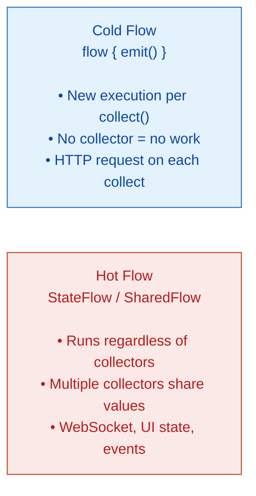

# 🟣 Kotlin Flow

> [!abstract] TL;DR
> `Flow<T>` is Kotlin's coroutine-based reactive stream — a cold, asynchronous sequence that emits values lazily when collected. Unlike `Sequence` (synchronous) or `Channel` (hot), a Flow starts fresh for each collector. Operators (`map`, `filter`, `onEach`, `catch`, `retry`) build a pipeline. `StateFlow` and `SharedFlow` are **hot** flows that broadcast to multiple collectors — `StateFlow` models UI state, `SharedFlow` models events. `callbackFlow` bridges callback-based APIs.

---

## Intuition

If a `Sequence<T>` is a synchronous lazy list, `Flow<T>` is the asynchronous equivalent — each value can be produced by a suspending call. Where RxJava/Reactor requires learning a whole new library with dozens of operators and marble diagrams, `Flow` uses familiar coroutine concepts and Kotlin's existing operator syntax. Hot flows (`StateFlow`, `SharedFlow`) fill the role of BehaviorSubject/PublishSubject from RxJava.

---

## How It Works

### Cold vs Hot Flows



### Creating a Flow

```kotlin
import kotlinx.coroutines.flow.*
import kotlinx.coroutines.*

// flow { } builder — cold, suspendable emitter
fun countUp(from: Int, to: Int): Flow<Int> = flow {
    for (i in from..to) {
        delay(100)              // suspending — doesn't block thread
        emit(i)                 // emit value to collector
    }
}

// Collection starts the flow — each collect() is independent
fun main() = runBlocking {
    countUp(1, 5).collect { value ->
        println(value)          // 1 2 3 4 5 (with 100ms delays)
    }
}

// Convenience builders
val ticker = (1..Int.MAX_VALUE).asFlow()         // from Iterable
val immediates = flowOf(1, 2, 3)                 // fixed values
```

### Flow Operators

```kotlin
val numbers = (1..10).asFlow()

// Intermediate operators — lazy, applied per element
val result = numbers
    .filter { it % 2 == 0 }                      // keep evens: 2,4,6,8,10
    .map { it * it }                             // square: 4,16,36,64,100
    .onEach { println("Processing $it") }        // side-effect logging
    .take(3)                                     // stop after 3 values: 4,16,36

// Terminal operators — trigger collection
result.collect { println(it) }                   // 4, 16, 36

// More terminal operators
val sum      = numbers.filter { it % 2 == 0 }.fold(0) { acc, v -> acc + v }
val asList   = numbers.take(3).toList()          // [1, 2, 3]
val firstEven = numbers.first { it % 2 == 0 }   // 2

// flatMapLatest — cancel previous when new value arrives (search-as-you-type)
fun searchFlow(query: StateFlow<String>): Flow<List<Result>> = query
    .flatMapLatest { q ->
        flow { emit(search(q)) }   // previous search cancelled when query changes
    }
```

### Error Handling

```kotlin
// catch — handle upstream exceptions; can emit fallback values
val safeFlow = apiCallFlow()
    .catch { e ->
        println("Error: ${e.message}")
        emit(emptyList())              // fallback value
    }
    .retry(3) { cause ->             // retry up to 3 times on any exception
        cause is IOException
    }

// onCompletion — always called when flow completes (success or failure)
apiCallFlow()
    .onCompletion { cause ->
        if (cause != null) println("Failed: $cause")
        else println("Success!")
    }
    .collect { /* ... */ }
```

### `StateFlow` — Hot State Holder

```kotlin
// StateFlow — always has a value; replaces LiveData for ViewModel state in Android
class SearchViewModel : ViewModel() {
    private val _query = MutableStateFlow("")       // initial value required
    val query: StateFlow<String> = _query.asStateFlow()

    private val _results = MutableStateFlow<List<Item>>(emptyList())
    val results: StateFlow<List<Item>> = _results.asStateFlow()

    fun onQueryChanged(newQuery: String) {
        _query.value = newQuery    // thread-safe; set from any thread
        viewModelScope.launch {
            _results.value = fetchResults(newQuery)
        }
    }
}

// In Fragment/Composable — collect with lifecycle awareness
lifecycleScope.launch {
    repeatOnLifecycle(Lifecycle.State.STARTED) {  // collect only when started
        viewModel.results.collect { items ->
            adapter.submitList(items)
        }
    }
}

// StateFlow vs LiveData:
// StateFlow: Kotlin-idiomatic, works in non-Android, replays latest to new collectors
// LiveData: Android lifecycle-aware, Java-friendly, legacy
```

### `SharedFlow` — Hot Event Bus

```kotlin
// SharedFlow — multiple collectors; configurable replay and buffer
class EventBus {
    private val _events = MutableSharedFlow<AppEvent>(replay = 0, extraBufferCapacity = 10)
    val events: SharedFlow<AppEvent> = _events.asSharedFlow()

    suspend fun post(event: AppEvent) = _events.emit(event)
}

// Collectors receive events only after they start collecting (replay=0)
// With replay=1: new collectors get the last event immediately
```

### `callbackFlow` — Bridging Callbacks

```kotlin
// Wrap a callback-based API as a Flow
fun locationUpdates(client: FusedLocationProviderClient): Flow<Location> = callbackFlow {
    val callback = object : LocationCallback() {
        override fun onLocationResult(result: LocationResult) {
            result.lastLocation?.let { trySend(it) }  // emit to flow
        }
    }

    client.requestLocationUpdates(LocationRequest.DEFAULT, callback, Looper.getMainLooper())

    awaitClose {
        client.removeLocationUpdates(callback)   // cleanup when collector cancels
    }
}
```

## Flow vs Sequence vs Channel

| | `Sequence<T>` | `Flow<T>` | `Channel<T>` |
|--|---------------|-----------|--------------|
| Execution | Synchronous | Asynchronous | Asynchronous |
| Blocking | Blocks caller | Suspends | Suspends |
| Temperature | Cold | Cold (default) | Hot |
| Multiple collectors | Each gets own run | Each gets own run | Shared (one receiver per element) |
| Backpressure | N/A (sync) | Natural (suspend) | Buffered/rendezvous |

## Common Pitfalls

| # | Pitfall | Fix |
|---|---------|-----|
| 1 | Collecting Flow in `lifecycleScope.launch` — continues in background | Use `repeatOnLifecycle(STARTED)` so collection stops when UI is hidden |
| 2 | `MutableStateFlow` updated from background — `_state.value =` is thread-safe but assignments don't merge | Use `update { }` for read-modify-write: `_count.update { it + 1 }` |
| 3 | Exceptions escaping the flow without `catch` — crash at collector | Always add `catch` to flows crossing API boundaries |
| 4 | Using `SharedFlow` for UI state that must always have a value | Use `StateFlow` for state (has initial value, replays 1) |
| 5 | Forgetting `awaitClose` in `callbackFlow` — resource leak | Always unregister the callback in `awaitClose { }` |

## Review Questions

1. What makes a `Flow` "cold"? How does it differ from `StateFlow`?
2. Explain `flatMapLatest` — what problem does it solve for search-as-you-type UI?
3. When would you use `SharedFlow` instead of `StateFlow`? Give a concrete example.

---

Related: [[Kotlin_Channels]] | [[Coroutine_Builders_and_Scope]] | [[Structured_Concurrency]] | [[Kotlin_Android_Basics]] | [[Kotlin_Coroutines_Intro]]

#Kotlin
