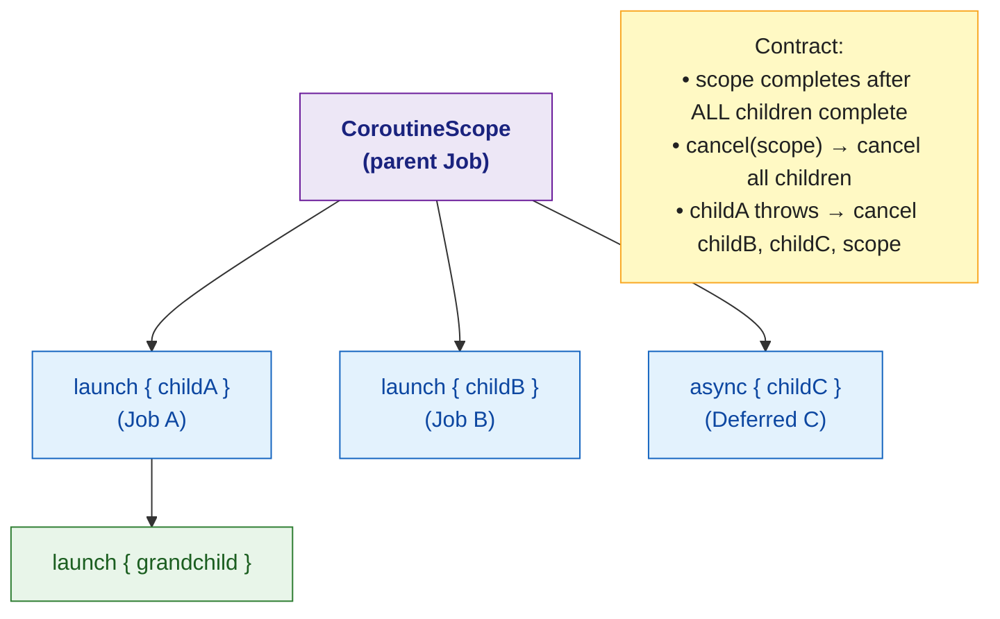

# 🟣 Structured Concurrency

> [!abstract] TL;DR
> Structured concurrency is the contract that **a coroutine scope outlives all its children**. Scopes form a tree: cancelling a parent cancels the entire subtree; child exceptions propagate upward (unless using `SupervisorJob`). `CoroutineExceptionHandler` catches unhandled exceptions from `launch` (not `async`). The key invariant: no coroutine can outlive the scope that launched it — eliminating the "fire and forget" leaks of raw threads.

---

## Intuition

Unstructured concurrency (raw threads, `GlobalScope`) is like hiring contractors who disappear after starting work — you can't track them, can't cancel them, and exceptions vanish silently. Structured concurrency is like a project with a clear scope: every worker is registered, the project ends only when all workers finish, and any worker failure escalates to the project manager.

---

## How It Works

### The Structured Concurrency Contract



### Exception Propagation with `coroutineScope`

```kotlin
import kotlinx.coroutines.*

// coroutineScope — strict exception propagation
suspend fun strictOperation(): String = coroutineScope {
    val a = async {
        delay(100)
        "result A"
    }
    val b = async {
        delay(50)
        throw RuntimeException("B failed")  // this propagates
    }

    // When b fails:
    // 1. b's exception propagates to coroutineScope
    // 2. coroutineScope cancels a (even if a is still running)
    // 3. exception propagates to the caller of strictOperation()
    "${a.await()} and ${b.await()}"   // throws RuntimeException
}

// Handling:
try {
    val result = strictOperation()
} catch (e: RuntimeException) {
    println("Caught: ${e.message}")   // "B failed"
}
```

### Exception Isolation with `supervisorScope`

```kotlin
// supervisorScope — children fail independently
suspend fun lenientOperation(): Results = supervisorScope {
    val a = async { delay(100); "result A" }
    val b = async { delay(50); throw IOException("network error") }
    val c = async { delay(200); "result C" }

    // b fails — a and c continue unaffected
    Results(
        a = runCatching { a.await() }.getOrNull(),
        b = runCatching { b.await() }.getOrNull(),   // null — b failed
        c = runCatching { c.await() }.getOrNull()
    )
}
```

### `CoroutineExceptionHandler`

```kotlin
// Handles unhandled exceptions from launch (NOT async — those must be caught at await())
val handler = CoroutineExceptionHandler { context, exception ->
    println("Unhandled exception in ${context[CoroutineName]}: $exception")
    // Log to crash reporting service (e.g., Firebase Crashlytics)
    crashlytics.recordException(exception)
}

val scope = CoroutineScope(SupervisorJob() + Dispatchers.Default + handler)

scope.launch(CoroutineName("worker1")) {
    delay(100)
    throw IllegalStateException("Worker 1 failed")
    // Caught by handler — other coroutines in scope unaffected (SupervisorJob)
}

scope.launch(CoroutineName("worker2")) {
    delay(500)
    println("Worker 2 still running!")   // This still runs
}

// IMPORTANT: CoroutineExceptionHandler only handles exceptions in root coroutines
// (launched directly in the scope) — not in child coroutines
```

### Android Lifecycle Best Practices

```kotlin
// ─── ViewModel: viewModelScope ────────────────────────────────────────────────
class OrderViewModel(private val repo: OrderRepository) : ViewModel() {
    private val _orders = MutableStateFlow<List<Order>>(emptyList())
    val orders: StateFlow<List<Order>> = _orders

    init {
        loadOrders()
    }

    private fun loadOrders() {
        viewModelScope.launch {                // SupervisorJob + Main dispatcher
            try {
                _orders.value = withContext(Dispatchers.IO) { repo.getOrders() }
            } catch (e: IOException) {
                // Handle gracefully — viewModelScope isolates this failure
                _orders.value = emptyList()
            }
        }
    }

    // viewModelScope automatically cancelled in onCleared() — no leaks
}

// ─── Fragment: lifecycleScope with repeatOnLifecycle ──────────────────────────
class OrderFragment : Fragment() {
    private val viewModel: OrderViewModel by viewModels()

    override fun onViewCreated(view: View, savedInstanceState: Bundle?) {
        super.onViewCreated(view, savedInstanceState)

        // repeatOnLifecycle — starts/stops collection with the lifecycle
        viewLifecycleOwner.lifecycleScope.launch {
            viewLifecycleOwner.repeatOnLifecycle(Lifecycle.State.STARTED) {
                viewModel.orders.collect { orders ->
                    adapter.submitList(orders)
                }
            }
        }
        // Collection stops when Fragment stops, resumes when it starts again
        // Prevents UI updates to a hidden Fragment
    }
}
```

### Backend Structured Concurrency (Ktor/Spring)

```kotlin
// Backend service with clean lifecycle management
class DataSyncService(private val repos: List<Repository>) : AutoCloseable {
    private val scope = CoroutineScope(
        SupervisorJob() +
        Dispatchers.IO +
        CoroutineExceptionHandler { _, e -> logger.error("Sync error", e) }
    )

    fun startAll() {
        repos.forEach { repo ->
            scope.launch(CoroutineName("sync-${repo.name}")) {
                while (isActive) {
                    repo.sync()
                    delay(30_000)   // sync every 30 seconds
                }
            }
        }
    }

    override fun close() {
        scope.cancel()   // cleanly shuts down all sync coroutines
        logger.info("DataSyncService stopped")
    }
}
```

## Structured Concurrency Properties

| Property | Behaviour | Why It Matters |
|----------|-----------|----------------|
| Scope outlives children | `coroutineScope {}` suspends until all children complete | No "fire and forget" leaks |
| Cancellation propagates downward | Cancel parent → cancel all children | Clean teardown of entire work tree |
| Exceptions propagate upward | Child failure → parent failure (unless SupervisorJob) | No silent failures |
| CancellationException is normal | Not reported as error by default | Clean cancellation without noise |

## Common Pitfalls

| # | Pitfall | Fix |
|---|---------|-----|
| 1 | `GlobalScope.launch` — scope never cancelled, leaks forever | Replace with `viewModelScope`, `lifecycleScope`, or a manually managed scope |
| 2 | `CoroutineExceptionHandler` on `async` — handler never called | Exceptions from `async` are delivered at `await()`; wrap `await()` in try-catch |
| 3 | Forgetting `repeatOnLifecycle` — Flow collected in background | Always collect UI flows inside `repeatOnLifecycle(STARTED)` |
| 4 | `scope.cancel()` not called in cleanup — goroutine-style leak | Implement `AutoCloseable` or hook into lifecycle `onDestroy()`/`onCleared()` |
| 5 | `supervisorScope` inside `coroutineScope` — outer still cancels on supervisor's failure | Supervisor only protects children from each other, not from the outer scope |

## Review Questions

1. What is the "structured concurrency contract"? How does it prevent the resource leaks common with raw threads?
2. When a child coroutine throws inside `coroutineScope`, what happens to its siblings? How does `supervisorScope` change this?
3. Why does `CoroutineExceptionHandler` not work for exceptions from `async`? How should you handle them instead?

---

Related: [[Coroutine_Builders_and_Scope]] | [[Coroutine_Dispatchers_and_Context]] | [[Kotlin_Flow]] | [[Kotlin_Android_Basics]]

#Kotlin
