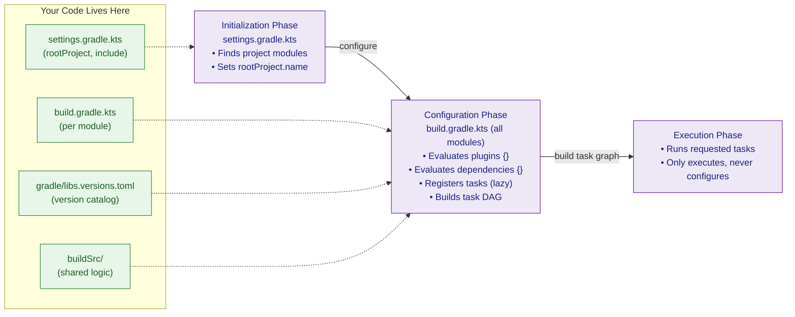

# 🟣 Gradle Kotlin DSL

> [!abstract] TL;DR
> The Gradle Kotlin DSL replaces Groovy build scripts (`build.gradle`) with type-safe Kotlin scripts (`build.gradle.kts`). You gain IDE autocomplete, compile-time error detection, and safe refactoring — at the cost of slightly more verbose syntax in a few places. Version catalogs (`libs.versions.toml`) centralize dependency versions across all modules. `buildSrc` or composite builds share build logic as reusable convention plugins. Lazy task configuration (`tasks.named`) avoids eager evaluation of all tasks during the configuration phase.

---

## Intuition

Switching from Groovy build scripts to Kotlin DSL is like switching from a dynamically typed scripting language to a statically typed one for your build — you gain IDE autocomplete, compile-time error checking, and refactoring support, at the cost of slightly more verbose syntax in some places.

With Groovy, your IDE can only guess what `dependencies` or `repositories` means at any given point — it's all just method calls on `Object`. With Kotlin DSL, the build script is real Kotlin code compiled by the Kotlin compiler: every method call is type-checked, every property is discoverable via Ctrl+Space, and renaming a task or plugin ID is a safe refactor rather than a text search.

The Gradle build lifecycle itself does not change — only the language you use to express it. The three phases (Initialization → Configuration → Execution) remain identical.

---

## How It Works

### Gradle Build Lifecycle



### File Naming

| Groovy | Kotlin DSL |
|--------|-----------|
| `settings.gradle` | `settings.gradle.kts` |
| `build.gradle` | `build.gradle.kts` |
| `gradle.properties` | `gradle.properties` (unchanged) |

### settings.gradle.kts

```kotlin
// settings.gradle.kts — Initialization phase entry point
rootProject.name = "my-app"

// Multi-module project: include subprojects
include(":app")
include(":core:domain")
include(":core:data")
include(":feature:auth")
include(":feature:tasks")

// Central repository for dependency resolution (Gradle 7+)
dependencyResolutionManagement {
    repositoriesMode.set(RepositoriesMode.FAIL_ON_PROJECT_REPOS)
    repositories {
        mavenCentral()
        google()
        maven("https://jitpack.io")
    }
}

// Enable version catalog
enableFeaturePreview("TYPESAFE_PROJECT_ACCESSORS")

// Plugin repositories (separate from dependency repositories)
pluginManagement {
    repositories {
        gradlePluginPortal()
        google()
        mavenCentral()
    }
}
```

### The `plugins {}` Block

```kotlin
// build.gradle.kts — Type-safe plugin accessors
plugins {
    // Kotlin JVM shorthand (uses kotlin() helper)
    kotlin("jvm") version "2.0.0"

    // Equivalent long form
    id("org.jetbrains.kotlin.jvm") version "2.0.0"

    // Spring Boot and dependency management
    id("org.springframework.boot") version "3.3.0"
    id("io.spring.dependency-management") version "1.1.5"

    // Kotlin compiler plugins (version inherited from kotlin("jvm") above)
    kotlin("plugin.spring")
    kotlin("plugin.serialization")

    // Built-in Gradle plugins (no version needed)
    application
    `java-library`

    // A convention plugin from buildSrc (no version or id() wrapper)
    id("my-company.kotlin-conventions")
}
```

> [!tip] Plugin versions in multi-module builds
> Declare plugin versions only in the root `build.gradle.kts` or in `settings.gradle.kts` via `pluginManagement`. Submodule scripts apply the plugin without a version: `kotlin("jvm")` — no version string.

### Dependencies Block

```kotlin
dependencies {
    // Standard scopes
    implementation("org.jetbrains.kotlin:kotlin-stdlib")          // included by kotlin("jvm") automatically
    api("com.example:shared-model:1.0.0")                         // leaked to consumers (use sparingly)
    compileOnly("javax.servlet:javax.servlet-api:4.0.1")          // compile only, not runtime
    runtimeOnly("org.postgresql:postgresql:42.7.3")               // runtime only, not compile classpath
    testImplementation("org.junit.jupiter:junit-jupiter:5.10.2")
    testRuntimeOnly("org.junit.platform:junit-platform-launcher")

    // Platform / BOM — aligns all Spring Boot dependency versions
    implementation(platform("org.springframework.boot:spring-boot-dependencies:3.3.0"))

    // After BOM, no version needed for managed dependencies
    implementation("org.springframework.boot:spring-boot-starter-web")
    implementation("org.springframework.boot:spring-boot-starter-data-jpa")

    // Project dependency (multi-module)
    implementation(project(":core:domain"))

    // File dependency (uncommon, last resort)
    implementation(files("libs/custom-sdk.jar"))
}
```

### Version Catalogs

Version catalogs (`libs.versions.toml`) centralize all dependency coordinates in one file, enabling type-safe accessors in all build scripts.

```toml
# gradle/libs.versions.toml

[versions]
kotlin            = "2.0.0"
spring-boot       = "3.3.0"
spring-dm         = "1.1.5"
exposed           = "0.51.1"
kotlinx-coroutines = "1.8.1"
kotlinx-serialization = "1.7.1"
ktor              = "2.3.7"
junit             = "5.10.2"
h2                = "2.2.224"
jackson-kotlin    = "2.17.1"

[libraries]
# Group:artifact:version — accessed as libs.spring.boot.starter.web
spring-boot-starter-web    = { module = "org.springframework.boot:spring-boot-starter-web", version.ref = "spring-boot" }
spring-boot-starter-webflux= { module = "org.springframework.boot:spring-boot-starter-webflux", version.ref = "spring-boot" }
spring-boot-starter-test   = { module = "org.springframework.boot:spring-boot-starter-test", version.ref = "spring-boot" }

kotlinx-coroutines-core    = { module = "org.jetbrains.kotlinx:kotlinx-coroutines-core", version.ref = "kotlinx-coroutines" }
kotlinx-coroutines-reactor = { module = "org.jetbrains.kotlinx:kotlinx-coroutines-reactor", version.ref = "kotlinx-coroutines" }
kotlinx-serialization-json = { module = "org.jetbrains.kotlinx:kotlinx-serialization-json", version.ref = "kotlinx-serialization" }

exposed-core    = { module = "org.jetbrains.exposed:exposed-core",    version.ref = "exposed" }
exposed-dao     = { module = "org.jetbrains.exposed:exposed-dao",     version.ref = "exposed" }
exposed-jdbc    = { module = "org.jetbrains.exposed:exposed-jdbc",    version.ref = "exposed" }

jackson-kotlin  = { module = "com.fasterxml.jackson.module:jackson-module-kotlin", version.ref = "jackson-kotlin" }
h2              = { module = "com.h2database:h2", version.ref = "h2" }
junit-jupiter   = { module = "org.junit.jupiter:junit-jupiter", version.ref = "junit" }

[bundles]
# Bundles group multiple libs under one accessor — libs.bundles.exposed
exposed = ["exposed-core", "exposed-dao", "exposed-jdbc"]
kotlinx-coroutines = ["kotlinx-coroutines-core", "kotlinx-coroutines-reactor"]

[plugins]
kotlin-jvm          = { id = "org.jetbrains.kotlin.jvm",            version.ref = "kotlin" }
kotlin-spring       = { id = "org.jetbrains.kotlin.plugin.spring",  version.ref = "kotlin" }
kotlin-serialization= { id = "org.jetbrains.kotlin.plugin.serialization", version.ref = "kotlin" }
spring-boot         = { id = "org.springframework.boot",            version.ref = "spring-boot" }
spring-dm           = { id = "io.spring.dependency-management",     version.ref = "spring-dm" }
```

Accessing version catalog entries in `build.gradle.kts`:

```kotlin
plugins {
    alias(libs.plugins.kotlin.jvm)             // from [plugins] section
    alias(libs.plugins.spring.boot)
    alias(libs.plugins.kotlin.spring)
}

dependencies {
    implementation(libs.spring.boot.starter.web)   // from [libraries]
    implementation(libs.jackson.kotlin)
    implementation(libs.bundles.exposed)           // from [bundles] — all 3 Exposed artifacts
    implementation(libs.bundles.kotlinx.coroutines)

    testImplementation(libs.junit.jupiter)
    runtimeOnly(libs.h2)
}
```

### Task Configuration

```kotlin
// Lazy task configuration — preferred
// tasks.named does NOT trigger task creation until the task is actually needed
tasks.named<Test>("test") {
    useJUnitPlatform()
    maxParallelForks = Runtime.getRuntime().availableProcessors()
    testLogging {
        events("passed", "failed", "skipped")
    }
}

// Configure all tasks of a type — also lazy
tasks.withType<org.jetbrains.kotlin.gradle.tasks.KotlinCompile> {
    kotlinOptions {
        jvmTarget = "17"
        freeCompilerArgs = listOf("-Xjsr305=strict", "-opt-in=kotlin.RequiresOptIn")
    }
}

// Create a custom task
tasks.register<Exec>("generateOpenApi") {
    group = "documentation"
    description = "Generates OpenAPI spec from running app"
    commandLine("curl", "-s", "http://localhost:8080/v3/api-docs", "-o", "openapi.json")
}

// Create a task that depends on another
tasks.register("fullBuild") {
    group = "build"
    dependsOn("build", "generateOpenApi")
    doLast {
        println("Full build complete.")
    }
}

// Eager configuration — AVOID in large projects (evaluates immediately)
// tasks.getByName<Test>("test") { ... }   ← triggers configuration of ALL tasks
```

### Kotlin-Specific Configuration

```kotlin
kotlin {
    jvmToolchain(17)                          // sets Java toolchain for compilation and test JVM
}

// Alternative: configure via kotlinOptions on compileKotlin task
tasks.withType<org.jetbrains.kotlin.gradle.tasks.KotlinJvmCompile> {
    compilerOptions {
        jvmTarget.set(JvmTarget.JVM_17)
        apiVersion.set(KotlinVersion.KOTLIN_2_0)
        languageVersion.set(KotlinVersion.KOTLIN_2_0)
        freeCompilerArgs.addAll(
            "-Xjsr305=strict",               // treat platform types as strict null-checked
            "-opt-in=kotlin.RequiresOptIn"   // enable experimental APIs opt-in
        )
    }
}
```

### `buildSrc` — Shared Build Logic

`buildSrc` is a special Gradle directory that is compiled before the main build. Use it to write **convention plugins** — reusable build logic shared across modules.

```
my-app/
├── buildSrc/
│   ├── build.gradle.kts          ← buildSrc's own build file
│   └── src/main/kotlin/
│       └── my-company.kotlin-conventions.gradle.kts  ← convention plugin
├── app/
│   └── build.gradle.kts
├── core/
│   └── build.gradle.kts
└── settings.gradle.kts
```

```kotlin
// buildSrc/build.gradle.kts
plugins {
    `kotlin-dsl`                              // enables writing .gradle.kts convention plugins
}

repositories { mavenCentral() }

dependencies {
    // Add dependencies needed by your convention plugins
    implementation("org.jetbrains.kotlin:kotlin-gradle-plugin:2.0.0")
    implementation("org.springframework.boot:spring-boot-gradle-plugin:3.3.0")
}
```

```kotlin
// buildSrc/src/main/kotlin/my-company.kotlin-conventions.gradle.kts
// Applied with: id("my-company.kotlin-conventions") — no version needed

plugins {
    kotlin("jvm")
}

repositories {
    mavenCentral()
}

kotlin {
    jvmToolchain(17)
}

tasks.withType<Test> {
    useJUnitPlatform()
}

// Shared dependencies every Kotlin module needs
dependencies {
    testImplementation("org.junit.jupiter:junit-jupiter:5.10.2")
    testRuntimeOnly("org.junit.platform:junit-platform-launcher")
}
```

Now every submodule applies this convention plugin in one line:

```kotlin
// app/build.gradle.kts — only module-specific config needed
plugins {
    id("my-company.kotlin-conventions")        // inherits all shared configuration
    id("org.springframework.boot") version "3.3.0"
}

dependencies {
    implementation(libs.spring.boot.starter.web)
}
```

### Complete Spring Boot `build.gradle.kts` Example

```kotlin
// build.gradle.kts — complete Spring Boot Kotlin project with version catalog
import org.jetbrains.kotlin.gradle.tasks.KotlinCompile

plugins {
    alias(libs.plugins.kotlin.jvm)
    alias(libs.plugins.kotlin.spring)
    alias(libs.plugins.kotlin.serialization)
    alias(libs.plugins.spring.boot)
    alias(libs.plugins.spring.dm)
}

group   = "com.example"
version = "0.0.1-SNAPSHOT"

kotlin {
    jvmToolchain(17)
}

repositories {
    mavenCentral()
}

dependencies {
    // Spring Boot starters
    implementation(libs.spring.boot.starter.web)
    implementation(libs.spring.boot.starter.webflux)
    implementation(libs.jackson.kotlin)

    // Kotlin coroutines
    implementation(libs.bundles.kotlinx.coroutines)

    // Exposed ORM
    implementation(libs.bundles.exposed)

    // kotlinx.serialization
    implementation(libs.kotlinx.serialization.json)

    // Database
    runtimeOnly(libs.h2)

    // Testing
    testImplementation(libs.spring.boot.starter.test)
    testImplementation(libs.junit.jupiter)
}

tasks.withType<KotlinCompile> {
    compilerOptions {
        jvmTarget.set(org.jetbrains.kotlin.gradle.dsl.JvmTarget.JVM_17)
        freeCompilerArgs.addAll("-Xjsr305=strict", "-opt-in=kotlin.RequiresOptIn")
    }
}

tasks.named<Test>("test") {
    useJUnitPlatform()
}

// Ensure the bootJar is correctly named
tasks.named<org.springframework.boot.gradle.tasks.bundling.BootJar>("bootJar") {
    archiveFileName.set("app.jar")
}
```

### Groovy → Kotlin DSL Migration Cheat Sheet

```groovy
// ── Groovy ────────────────────────────────────────────────────────────────
apply plugin: 'java'
group = 'com.example'
sourceCompatibility = '17'
repositories { mavenCentral() }
dependencies {
    implementation 'org.springframework.boot:spring-boot-starter-web:3.3.0'
}
test { useJUnitPlatform() }
```

```kotlin
// ── Kotlin DSL equivalent ─────────────────────────────────────────────────
plugins { java }
group = "com.example"                          // double quotes required in Kotlin
java { sourceCompatibility = JavaVersion.VERSION_17 }
repositories { mavenCentral() }
dependencies {
    implementation("org.springframework.boot:spring-boot-starter-web:3.3.0")  // parens required
}
tasks.test { useJUnitPlatform() }             // tasks accessor is typed
```

Key syntax differences:

| Groovy | Kotlin DSL |
|--------|-----------|
| `'single quotes'` for strings | `"double quotes"` required |
| `implementation 'group:artifact'` | `implementation("group:artifact")` — parens required |
| `group = 'com.example'` | `group = "com.example"` |
| `sourceCompatibility = '17'` | `java { sourceCompatibility = JavaVersion.VERSION_17 }` |
| `test { useJUnitPlatform() }` | `tasks.test { useJUnitPlatform() }` |
| `ext.myVersion = '1.0'` | `val myVersion by extra("1.0")` |

---

## Trade-offs Table

| Aspect | Kotlin DSL (`build.gradle.kts`) | Groovy DSL (`build.gradle`) |
|--------|--------------------------------|-----------------------------|
| IDE autocomplete | Full — Kotlin type inference | Limited — dynamic typing |
| Compile-time errors | Yes — caught before running Gradle | No — fail at execution |
| Refactoring support | Safe — rename/find usages work | Manual text search |
| Script compilation | Slower first time (compiled Kotlin) | Faster (interpreted Groovy) |
| Syntax verbosity | Slightly more verbose in places | More concise for simple scripts |
| Learning curve | Kotlin knowledge helps | Groovy knowledge needed |
| Configuration cache compat. | Full support | Full support |
| Official recommendation | Yes (Gradle 8+ recommends) | Legacy, still supported |

---

## Common Pitfalls

| # | Pitfall | Fix |
|---|---------|-----|
| 1 | Eager task lookup with `tasks.getByName()` forces configuration of all tasks — slows build | Use `tasks.named()` for lazy lookup; only registers an action when the task is actually needed |
| 2 | `buildSrc` changes invalidate the entire build cache — slow in CI | For large shared logic, prefer **composite builds** (`includeBuild("build-logic")`) over `buildSrc` |
| 3 | Version catalog `libs` accessor not available in `buildSrc` | Copy the version catalog path into buildSrc, or use composite builds which support version catalogs properly |
| 4 | Configuration cache incompatibility from using `project.ext` or dynamic properties | Store extra properties in `gradle.properties` or typed extra delegation (`val myProp by extra(...)`) |
| 5 | Forgetting parentheses on dependency declarations — `implementation 'x'` is Groovy syntax | Kotlin requires function call syntax: `implementation("x")` |
| 6 | Plugin applied with `apply(plugin = "...")` instead of `plugins {}` block — loses type-safe accessors | Always prefer the `plugins {}` block; `apply(plugin = ...)` is the old imperative style |
| 7 | `tasks.withType<KotlinCompile>()` applies eagerly in some Gradle versions | Prefer `tasks.withType<KotlinCompile>().configureEach { ... }` for lazy configuration |

---

## Review Questions

1. What are the three Gradle build lifecycle phases? What happens in each one, and where does `build.gradle.kts` fit?
2. What is a version catalog (`libs.versions.toml`)? Explain the purpose of `[versions]`, `[libraries]`, `[bundles]`, and `[plugins]` sections.
3. Explain the difference between `tasks.named<Test>("test")` and `tasks.getByName<Test>("test")`. Why does the latter hurt build performance in large projects?
4. What is the difference between `buildSrc` and a composite build (`includeBuild`)? When would you prefer one over the other?
5. Why does `kotlin("plugin.spring")` need to be in the `plugins {}` block of a Spring Boot project, and what exactly does it do to Kotlin classes?

---

Related: [[Kotlin_Overview]] | [[Kotlin_Spring_Boot]] | [[Kotlin_Serialization]] | [[Kotlin_Multiplatform]]

#Kotlin #Gradle #Build #DSL #VersionCatalog #buildSrc
