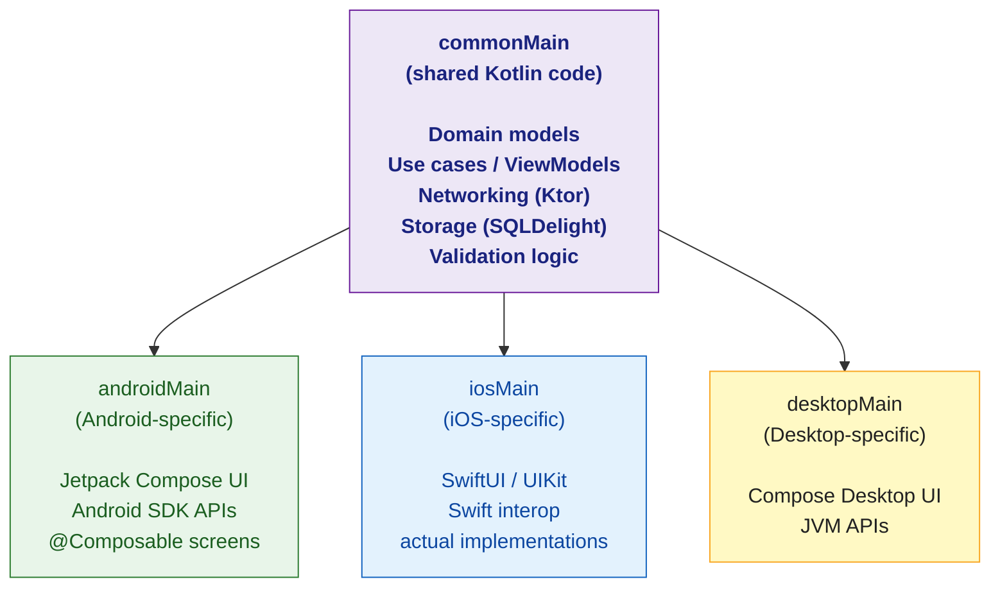

# 🟣 Kotlin Multiplatform

> [!abstract] TL;DR
> Kotlin Multiplatform (KMP) lets you share Kotlin code (business logic, networking, storage) across Android, iOS, Desktop, and Web by writing it once. Platform-specific code uses `expect`/`actual` declarations: `expect` declares an API contract in shared code; `actual` provides the platform-specific implementation. Ktor handles multiplatform HTTP; SQLDelight handles multiplatform databases; Compose Multiplatform extends the shared layer to UI. KMP is production-stable as of Kotlin 2.0.

---

## Intuition

Traditional cross-platform tries to abstract the entire app (React Native, Flutter). KMP takes a different approach: share the business logic layer (networking, parsing, storage, domain models) while letting each platform own its UI. Android gets Jetpack Compose or XML; iOS gets SwiftUI or UIKit. Each platform's UI feels native — only the logic is shared. This makes KMP a "shared business logic" strategy, not a "write once, run anywhere UI" strategy.

---

## How It Works

### KMP Architecture



### `expect` / `actual` Declarations

```kotlin
// ─── commonMain — declare the contract ────────────────────────────────────────
expect class Platform {
    val name: String
}

expect fun randomUUID(): String          // different impl per platform

expect fun getCurrentTimestampMs(): Long // Date/time handling varies by platform

// ─── androidMain — Android implementation ─────────────────────────────────────
actual class Platform actual constructor() {
    actual val name: String = "Android ${android.os.Build.VERSION.SDK_INT}"
}

actual fun randomUUID(): String = java.util.UUID.randomUUID().toString()

actual fun getCurrentTimestampMs(): Long = System.currentTimeMillis()

// ─── iosMain — iOS implementation ─────────────────────────────────────────────
actual class Platform actual constructor() {
    actual val name: String = UIDevice.currentDevice.systemName() + " " +
                               UIDevice.currentDevice.systemVersion()
}

actual fun randomUUID(): String = NSUUID().UUIDString()

actual fun getCurrentTimestampMs(): Long =
    (NSDate().timeIntervalSince1970 * 1000).toLong()
```

### Shared ViewModel with Ktor Networking

```kotlin
// ─── commonMain/networking/ApiClient.kt ───────────────────────────────────────
import io.ktor.client.*
import io.ktor.client.plugins.contentnegotiation.*
import io.ktor.serialization.kotlinx.json.*

expect fun createHttpClient(): HttpClient   // platform provides engine

// ─── androidMain ──────────────────────────────────────────────────────────────
actual fun createHttpClient() = HttpClient(OkHttp) {
    install(ContentNegotiation) { json() }
}
// ─── iosMain ──────────────────────────────────────────────────────────────────
actual fun createHttpClient() = HttpClient(Darwin) {
    install(ContentNegotiation) { json() }
}

// ─── commonMain/repository/UserRepository.kt ─────────────────────────────────
class UserRepository(private val client: HttpClient = createHttpClient()) {
    suspend fun getUsers(): List<User> = client.get("https://api.example.com/users").body()
}

// ─── commonMain/viewmodel/UserViewModel.kt ────────────────────────────────────
// Shared ViewModel — works on all platforms
class UserViewModel(private val repo: UserRepository = UserRepository()) {
    private val _state = MutableStateFlow<UserState>(UserState.Loading)
    val state: StateFlow<UserState> = _state

    fun load() {
        // Use kotlinx.coroutines; on iOS use Kotlin's coroutines support for Swift
        CoroutineScope(Dispatchers.Default).launch {
            _state.value = try {
                UserState.Success(repo.getUsers())
            } catch (e: Exception) {
                UserState.Error(e.message ?: "Unknown error")
            }
        }
    }
}
```

### SQLDelight — Shared Database

```kotlin
// ─── Define schema in .sq file (commonMain/sqldelight/User.sq) ────────────────
// CREATE TABLE User (
//     id INTEGER PRIMARY KEY,
//     name TEXT NOT NULL,
//     email TEXT NOT NULL
// );
// selectAll:
// SELECT * FROM User;
// insert:
// INSERT INTO User(id, name, email) VALUES (?, ?, ?);

// ─── commonMain — use generated code ──────────────────────────────────────────
expect fun createDatabase(): AppDatabase  // platform provides driver

class UserStorage(db: AppDatabase = createDatabase()) {
    private val queries = db.userQueries

    fun getAll(): List<User> = queries.selectAll().executeAsList()
    fun save(user: User) = queries.insert(user.id, user.name, user.email)
}

// ─── androidMain ──────────────────────────────────────────────────────────────
actual fun createDatabase(): AppDatabase {
    val driver = AndroidSqliteDriver(AppDatabase.Schema, context, "app.db")
    return AppDatabase(driver)
}

// ─── iosMain ──────────────────────────────────────────────────────────────────
actual fun createDatabase(): AppDatabase {
    val driver = NativeSqliteDriver(AppDatabase.Schema, "app.db")
    return AppDatabase(driver)
}
```

### Compose Multiplatform

```kotlin
// @Composable UI can be shared across Android, iOS (via Compose Multiplatform), and Desktop
@Composable
fun UserListScreen(viewModel: UserViewModel = remember { UserViewModel() }) {
    val state by viewModel.state.collectAsState()

    when (state) {
        is UserState.Loading -> CircularProgressIndicator()
        is UserState.Success -> LazyColumn {
            items((state as UserState.Success).users) { user ->
                UserRow(user)
            }
        }
        is UserState.Error -> Text("Error: ${(state as UserState.Error).message}")
    }
}
// This exact composable can run on Android, iOS (Compose Multiplatform), and Desktop JVM
```

## KMP vs Alternatives

| | KMP | React Native | Flutter | Xamarin |
|-|-----|--------------|---------|---------|
| Language | Kotlin | JavaScript | Dart | C# |
| UI approach | Native per platform | JS bridge | Custom renderer | Native wrappers |
| Business logic | ✅ Shared | ✅ Shared | ✅ Shared | ✅ Shared |
| Native UI feel | ✅ Native | Partially | Custom (not native) | Partially |
| Kotlin-first | ✅ | No | No | No |
| iOS integration | Swift/ObjC interop | Bridge | Method channel | N/A |

## Common Pitfalls

| # | Pitfall | Fix |
|---|---------|-----|
| 1 | Using JVM-only APIs (`java.util.*`) in commonMain | Use `kotlinx-datetime`, `kotlinx-io`, or `expect/actual` for platform-specific APIs |
| 2 | Kotlin coroutines on iOS — default `CoroutineScope` has no main thread support | Use `MainScope()` from `kotlinx-coroutines-core` or `SKIE` for Swift async integration |
| 3 | `expect` class vs `expect fun` — classes need constructors declared too | Declare `expect class Foo()` with the constructor signature matching all `actual` implementations |
| 4 | SQLDelight schema migrations out of sync between platforms | Keep schema version in sync; test migrations on both platforms |
| 5 | Overusing `actual` for every API — defeats the purpose | Minimize `actual` declarations; prefer multiplatform libraries (Ktor, SQLDelight, kotlinx-*) |

## Review Questions

1. What is the role of `expect`/`actual` in Kotlin Multiplatform? When should you use them vs a multiplatform library?
2. How does KMP's approach to cross-platform differ from Flutter's? What does KMP share and what does it leave to each platform?
3. What does SQLDelight provide that makes it suitable for KMP database access?

---

Related: [[Kotlin_Overview]] | [[Kotlin_Coroutines_Intro]] | [[Ktor_Server]] | [[Kotlin_Android_Basics]]

#Kotlin
