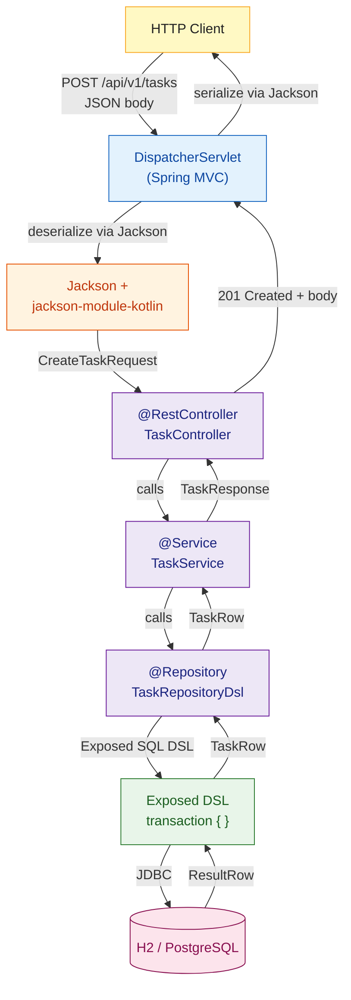

# 🟣 Kotlin with Spring Boot

> [!abstract] TL;DR
> Spring Boot with Kotlin lets you build production-grade backend services using Spring's mature ecosystem (DI, Security, Data, WebFlux) while eliminating Java boilerplate via data classes, extension functions, and coroutines. Two Gradle plugins — `kotlin("plugin.spring")` and `kotlin("plugin.jpa")` — are mandatory to make Spring's proxy-based mechanisms work with Kotlin's default-final classes. For the database layer, the Kotlin-native Exposed ORM by JetBrains offers a type-safe SQL DSL as an alternative to Spring Data JPA.

---

## Intuition

Spring Boot with Kotlin is like driving an automatic car (Spring) in a city that was built for it — all the infrastructure is there, but Kotlin removes the manual gear-shifting (boilerplate Java) and gives you cruise control (coroutines, extension functions, data classes). The city's roads (Spring's DI container, AOP, transaction management) remain exactly the same; you just get to drive them without grinding gears.

Java Spring Boot forces you to write verbose POJOs, `@Autowired` field injection with mutable state, and long `ResponseEntity<?>` chains. Kotlin collapses all of that: a `data class` replaces a 60-line Java DTO, constructor injection works naturally with `val` fields, and coroutine-aware Spring WebFlux eliminates callback hell for reactive endpoints.

---

## How It Works

### Project Setup

```kotlin
// build.gradle.kts — Spring Boot Kotlin starter configuration
plugins {
    kotlin("jvm") version "2.0.0"
    kotlin("plugin.spring") version "2.0.0"     // Makes Spring proxies work (opens classes)
    kotlin("plugin.jpa") version "2.0.0"         // Generates no-arg constructors for JPA entities
    id("org.springframework.boot") version "3.3.0"
    id("io.spring.dependency-management") version "1.1.5"
}

dependencies {
    // Web
    implementation("org.springframework.boot:spring-boot-starter-web")
    implementation("org.springframework.boot:spring-boot-starter-webflux")      // for WebFlux/coroutines
    implementation("com.fasterxml.jackson.module:jackson-module-kotlin")         // required for Kotlin data classes

    // Kotlin coroutines for reactive Spring
    implementation("org.jetbrains.kotlinx:kotlinx-coroutines-core:1.8.1")
    implementation("org.jetbrains.kotlinx:kotlinx-coroutines-reactor:1.8.1")     // Bridge coroutines ↔ Reactor

    // Exposed ORM (Kotlin-native SQL framework by JetBrains)
    implementation("org.jetbrains.exposed:exposed-core:0.51.1")
    implementation("org.jetbrains.exposed:exposed-dao:0.51.1")
    implementation("org.jetbrains.exposed:exposed-jdbc:0.51.1")
    implementation("org.jetbrains.exposed:exposed-java-time:0.51.1")

    // Database driver + connection pool
    implementation("com.h2database:h2")                                          // swap for postgres in prod
    implementation("com.zaxxer:HikariCP")

    // Validation
    implementation("org.springframework.boot:spring-boot-starter-validation")

    // Testing
    testImplementation("org.springframework.boot:spring-boot-starter-test")
}
```

```toml
# src/main/resources/application.yml (shown as .toml equivalent for illustration)
# Actual file is YAML — see below
```

```yaml
# src/main/resources/application.yml
spring:
  application:
    name: tasks-api
  datasource:
    url: jdbc:h2:mem:testdb
    driver-class-name: org.h2.Driver
  jackson:
    default-property-inclusion: non_null

server:
  port: 8080
```

### Data Classes as DTOs

Kotlin data classes are the ideal Spring DTO — immutable, auto-generating `equals`/`hashCode`/`toString`, and directly serializable by Jackson (with `jackson-module-kotlin`).

```kotlin
import com.fasterxml.jackson.annotation.JsonProperty
import jakarta.validation.constraints.NotBlank
import jakarta.validation.constraints.Size

// Request body — validation annotations need @field: prefix on data class properties
data class CreateTaskRequest(
    @field:NotBlank(message = "Title must not be blank")
    @field:Size(max = 255, message = "Title must be ≤ 255 chars")
    val title: String,

    val description: String? = null,

    @JsonProperty("is_done")                      // map JSON "is_done" → Kotlin "isDone"
    val isDone: Boolean = false
)

// Response body — idiomatic Kotlin DTO
data class TaskResponse(
    val id: Long,
    val title: String,
    val description: String?,

    @JsonProperty("is_done")
    val isDone: Boolean,

    val createdAt: String
)

// Paginated response wrapper — generic, reusable
data class Page<T>(
    val items: List<T>,
    val total: Long,
    val page: Int,
    val size: Int
)
```

### REST Controller

```kotlin
import org.springframework.http.ResponseEntity
import org.springframework.validation.annotation.Validated
import org.springframework.web.bind.annotation.*
import jakarta.validation.Valid
import java.net.URI

@RestController
@RequestMapping("/api/v1/tasks")
@Validated
class TaskController(
    private val taskService: TaskService                 // constructor injection — idiomatic Kotlin
) {

    @GetMapping
    fun getAllTasks(
        @RequestParam(defaultValue = "0") page: Int,
        @RequestParam(defaultValue = "20") size: Int
    ): ResponseEntity<Page<TaskResponse>> =
        ResponseEntity.ok(taskService.getPage(page, size))

    @GetMapping("/{id}")
    fun getTask(@PathVariable id: Long): ResponseEntity<TaskResponse> {
        val task = taskService.getById(id) ?: return ResponseEntity.notFound().build()
        return ResponseEntity.ok(task)
    }

    @PostMapping
    fun createTask(@Valid @RequestBody request: CreateTaskRequest): ResponseEntity<TaskResponse> {
        val created = taskService.create(request)
        return ResponseEntity
            .created(URI.create("/api/v1/tasks/${created.id}"))
            .body(created)
    }

    @PatchMapping("/{id}/complete")
    fun completeTask(@PathVariable id: Long): ResponseEntity<TaskResponse> {
        val task = taskService.markDone(id) ?: return ResponseEntity.notFound().build()
        return ResponseEntity.ok(task)
    }

    @DeleteMapping("/{id}")
    fun deleteTask(@PathVariable id: Long): ResponseEntity<Void> {
        taskService.delete(id)
        return ResponseEntity.noContent().build()
    }
}

// Extension function on ResponseEntity.BodyBuilder for cleaner syntax
fun <T> ResponseEntity.BodyBuilder.bodyOrNotFound(value: T?): ResponseEntity<T> =
    if (value != null) body(value) else ResponseEntity.notFound().build<T>()
```

### Spring WebFlux + Coroutines

Spring 5.2+ supports `suspend` functions in `@RestController` methods out of the box when `spring-boot-starter-webflux` and `kotlinx-coroutines-reactor` are on the classpath. The bridge converts coroutines to Reactor `Mono`/`Flux` transparently.

```kotlin
import kotlinx.coroutines.flow.Flow
import org.springframework.web.bind.annotation.*

// Coroutine-aware WebFlux controller — no Mono<>/Flux<> in sight
@RestController
@RequestMapping("/api/v1/stream")
class StreamController(private val taskService: TaskService) {

    // suspend fun → Spring converts to Mono<TaskResponse>
    @GetMapping("/{id}")
    suspend fun getTask(@PathVariable id: Long): TaskResponse =
        taskService.getByIdSuspend(id) ?: throw ResponseStatusException(HttpStatus.NOT_FOUND)

    // Flow<T> → Spring converts to Flux<T> for streaming
    @GetMapping("/all", produces = [MediaType.APPLICATION_NDJSON_VALUE])
    fun streamAllTasks(): Flow<TaskResponse> = taskService.streamAll()
}

// Functional routing DSL with coRouter (coroutine router)
import org.springframework.web.reactive.function.server.coRouter

@Configuration
class RouterConfig(private val taskHandler: TaskHandler) {

    @Bean
    fun routes() = coRouter {
        "/api/v2".nest {
            GET("/tasks", taskHandler::getAllTasks)
            POST("/tasks", taskHandler::createTask)
            GET("/tasks/{id}", taskHandler::getTask)
        }
    }
}

// Handler for coRouter
@Component
class TaskHandler(private val taskService: TaskService) {
    suspend fun getAllTasks(request: ServerRequest): ServerResponse =
        ServerResponse.ok().bodyValueAndAwait(taskService.getAll())

    suspend fun createTask(request: ServerRequest): ServerResponse {
        val body = request.awaitBody<CreateTaskRequest>()
        val created = taskService.create(body)
        return ServerResponse.created(URI.create("/api/v2/tasks/${created.id}"))
            .bodyValueAndAwait(created)
    }

    suspend fun getTask(request: ServerRequest): ServerResponse {
        val id = request.pathVariable("id").toLongOrNull()
            ?: return ServerResponse.badRequest().buildAndAwait()
        val task = taskService.getByIdSuspend(id)
            ?: return ServerResponse.notFound().buildAndAwait()
        return ServerResponse.ok().bodyValueAndAwait(task)
    }
}
```

### Exposed ORM — Kotlin-Native SQL Framework

Exposed by JetBrains is the idiomatic Kotlin alternative to Hibernate/Spring Data JPA. It offers two APIs: a **SQL DSL** (composable, type-safe queries) and a **DAO API** (ActiveRecord-style entities).

```kotlin
import org.jetbrains.exposed.dao.LongEntity
import org.jetbrains.exposed.dao.LongEntityClass
import org.jetbrains.exposed.dao.id.EntityID
import org.jetbrains.exposed.dao.id.LongIdTable
import org.jetbrains.exposed.sql.*
import org.jetbrains.exposed.sql.transactions.transaction
import org.jetbrains.exposed.sql.javatime.datetime
import java.time.LocalDateTime

// ── Table definition (both DSL and DAO share this) ──────────────────────────
object TasksTable : LongIdTable("tasks") {
    val title       = varchar("title", 255)
    val description = text("description").nullable()
    val isDone      = bool("is_done").default(false)
    val createdAt   = datetime("created_at").default(LocalDateTime.now())
}

// ── DAO Entity ───────────────────────────────────────────────────────────────
class TaskEntity(id: EntityID<Long>) : LongEntity(id) {
    companion object : LongEntityClass<TaskEntity>(TasksTable)

    var title       by TasksTable.title
    var description by TasksTable.description
    var isDone      by TasksTable.isDone
    var createdAt   by TasksTable.createdAt
}

// ── Schema setup (typically in @PostConstruct or Flyway migration) ───────────
@Configuration
class DatabaseConfig(private val dataSource: DataSource) {

    @PostConstruct
    fun init() {
        Database.connect(dataSource)
        transaction {
            SchemaUtils.create(TasksTable)
        }
    }
}

// ── Repository using DSL API ─────────────────────────────────────────────────
@Repository
class TaskRepositoryDsl {

    fun findAll(): List<TaskRow> = transaction {
        TasksTable.selectAll()
            .orderBy(TasksTable.createdAt, SortOrder.DESC)
            .map { row -> row.toTaskRow() }
    }

    fun findById(id: Long): TaskRow? = transaction {
        TasksTable.selectAll()
            .where { TasksTable.id eq id }
            .singleOrNull()
            ?.toTaskRow()
    }

    fun insert(title: String, description: String?): TaskRow = transaction {
        val insertedId = TasksTable.insertAndGetId {
            it[TasksTable.title]       = title
            it[TasksTable.description] = description
            it[TasksTable.isDone]      = false
            it[TasksTable.createdAt]   = LocalDateTime.now()
        }
        findById(insertedId.value)!!
    }

    fun markDone(id: Long): Int = transaction {
        TasksTable.update({ TasksTable.id eq id }) {
            it[isDone] = true
        }
    }

    fun delete(id: Long): Int = transaction {
        TasksTable.deleteWhere { TasksTable.id eq id }
    }

    fun countAll(): Long = transaction {
        TasksTable.selectAll().count()
    }

    // Extension function on ResultRow — keeps mapping logic local
    private fun ResultRow.toTaskRow() = TaskRow(
        id          = this[TasksTable.id].value,
        title       = this[TasksTable.title],
        description = this[TasksTable.description],
        isDone      = this[TasksTable.isDone],
        createdAt   = this[TasksTable.createdAt].toString()
    )
}

// ── Repository using DAO API ─────────────────────────────────────────────────
@Repository
class TaskRepositoryDao {

    fun findAll(): List<TaskEntity> = transaction { TaskEntity.all().toList() }

    fun findById(id: Long): TaskEntity? = transaction { TaskEntity.findById(id) }

    fun create(title: String, description: String?): TaskEntity = transaction {
        TaskEntity.new {
            this.title       = title
            this.description = description
            this.isDone      = false
        }
    }
}

data class TaskRow(
    val id: Long,
    val title: String,
    val description: String?,
    val isDone: Boolean,
    val createdAt: String
)
```

### Service Layer

```kotlin
@Service
@Transactional                                          // Spring transaction management
class TaskService(
    private val taskRepository: TaskRepositoryDsl       // val — immutable injected dependency
) {

    fun getPage(page: Int, size: Int): Page<TaskResponse> {
        val total = taskRepository.countAll()
        val items = taskRepository.findAll()
            .drop(page * size)
            .take(size)
            .map { it.toResponse() }
        return Page(items, total, page, size)
    }

    fun getById(id: Long): TaskResponse? =
        taskRepository.findById(id)?.toResponse()

    fun create(request: CreateTaskRequest): TaskResponse =
        taskRepository.insert(request.title, request.description).toResponse()

    fun markDone(id: Long): TaskResponse? {
        val updated = taskRepository.markDone(id)
        if (updated == 0) return null
        return taskRepository.findById(id)?.toResponse()
    }

    fun delete(id: Long) = taskRepository.delete(id)

    // Suspend variant for WebFlux / coroutine controllers
    suspend fun getByIdSuspend(id: Long): TaskResponse? =
        withContext(Dispatchers.IO) { getById(id) }

    fun streamAll(): Flow<TaskResponse> = flow {
        taskRepository.findAll().forEach { emit(it.toResponse()) }
    }.flowOn(Dispatchers.IO)

    private fun TaskRow.toResponse() = TaskResponse(
        id          = id,
        title       = title,
        description = description,
        isDone      = isDone,
        createdAt   = createdAt
    )
}
```

### Configuration Binding

```kotlin
// Bind entire YAML blocks to a Kotlin data class
@ConfigurationProperties(prefix = "tasks")
data class TasksProperties(
    val maxPerPage: Int = 100,
    val allowAnonymous: Boolean = false,
    val cache: CacheProperties = CacheProperties()
) {
    data class CacheProperties(
        val ttlSeconds: Long = 300,
        val maxSize: Int = 1000
    )
}

// Enable the binding
@SpringBootApplication
@EnableConfigurationProperties(TasksProperties::class)
class TasksApplication

fun main(args: Array<String>) {
    runApplication<TasksApplication>(*args)
}
```

### Request Flow Diagram



---

## ORM Comparison Table

| ORM / Library | Language | API Style | Compile-time Safety | Kotlin Idiomatic | Spring Integration | Best For |
|---------------|----------|-----------|--------------------|-----------------|--------------------|----------|
| **Exposed DSL** | Kotlin | Fluent DSL + DAO | Full | Native | Manual `transaction {}` | Kotlin-first projects, type-safe queries |
| **Spring Data JPA** | Java/Kotlin | Repository interfaces | Partial (JPQL strings) | Partial | Auto (via `@Repository`) | Enterprise apps, existing Spring teams |
| **ktorm** | Kotlin | DSL | Full | Native | Manual | Small-to-mid projects, SQL control |
| **Jdbi** | Java/Kotlin | SQL + annotations | Partial | Partial | Manual | Direct SQL control, complex queries |

## Spring Boot vs Ktor Comparison

| Aspect | Spring Boot + Kotlin | Ktor |
|--------|---------------------|------|
| Philosophy | Convention-over-configuration, opinionated | Explicit, composable, minimal |
| Startup time | 1–3 seconds | ~100 ms |
| Memory footprint | ~300 MB+ | ~100 MB |
| Ecosystem maturity | Massive (Security, Data, Cloud, Batch) | Growing |
| DI container | Spring IoC (automatic) | Manual / Koin |
| Coroutine support | Via reactor bridge (`kotlinx-coroutines-reactor`) | Native first-class |
| ORM options | Spring Data JPA, Exposed, Jdbi | Exposed, Ktorm, Jdbi |
| Best for | Enterprise, complex business logic | Microservices, KMP backends, lighter APIs |

---

## Common Pitfalls

| # | Pitfall | Fix |
|---|---------|-----|
| 1 | `final` classes break Spring AOP / JPA proxies | `kotlin("plugin.spring")` auto-adds `open` to Spring-annotated classes; use it always |
| 2 | Jackson fails to deserialize Kotlin data classes | Add `jackson-module-kotlin` dependency and register `KotlinModule` (auto-detected with Spring Boot autoconfigure) |
| 3 | Bean Validation annotations silently ignored on data class properties | Use `@field:NotBlank` not `@NotBlank` — Kotlin needs the `field:` use-site target |
| 4 | JPA entity with no no-arg constructor fails at startup | `kotlin("plugin.jpa")` generates synthetic no-arg constructors; without it, JPA reflection breaks |
| 5 | Blocking Exposed `transaction {}` called from a WebFlux coroutine on the event-loop thread | Wrap in `withContext(Dispatchers.IO)` — Exposed is blocking JDBC |
| 6 | `@Transactional` not working on `suspend fun` | Spring's proxy-based `@Transactional` does not wrap coroutine suspension correctly; use `transaction {}` blocks from Exposed or Exposed-Spring transaction manager |
| 7 | `runApplication<App>(*args)` spreads an array — easy to forget the `*` | Always use `runApplication<MyApp>(*args)` not `runApplication<MyApp>(args)` |

---

## Review Questions

1. Why do you need both `kotlin("plugin.spring")` and `kotlin("plugin.jpa")` in a Spring Boot Kotlin project, and what does each one do?
2. Why does `@field:NotBlank` work but `@NotBlank` does not when validating a Kotlin data class property used as a `@RequestBody`?
3. How does Spring WebFlux support `suspend` controller methods without requiring you to return `Mono<T>`, and what dependency enables this bridge?
4. What is the difference between Exposed's DSL API and its DAO API? When would you choose one over the other?
5. Explain why calling a blocking Exposed `transaction {}` block directly inside a coroutine WebFlux handler is a problem, and how to fix it.

---

Related: [[Ktor_Server]] | [[Kotlin_Coroutines_Intro]] | [[Kotlin_Serialization]] | [[Gradle_Kotlin_DSL]] | [[Structured_Concurrency]]

#Kotlin #SpringBoot #REST #Exposed #ORM #Coroutines #Backend
