# 🟣 Kotlin — Master Map of Content

> **20 notes across 4 sections** covering Kotlin from first principles through coroutines, Android/Ktor development, and Kotlin Multiplatform. Kotlin is a statically typed, null-safe JVM language by JetBrains — the preferred language for Android and a strong choice for server-side development.

---

## Knowledge Map

```mermaid
graph LR
    KO["Kotlin Overview\nJVM/JS/Native targets\nJava interop"]:::entry

    KO --> TYPES["Types & Variables\nval/var, nullability\nT vs T?, smart cast"]:::fund
    KO --> CF["Control Flow\nif/when expression\nfor, labels"]:::fund
    TYPES --> NS["Null Safety\n?. Elvis !! let\nscope functions"]:::fund
    KO --> FN["Functions\ndefault/named params\nextension, infix, tailrec"]:::fund
    FN --> CL["Classes & OOP\ndata class, sealed\nobject, companion"]:::fund

    CL --> LAM["Lambda & HOF\ninline, reified\nSAM, typealias"]:::func
    FN --> LAM
    LAM --> COL["Collections\nList/Set/Map\n60+ operators, Sequences"]:::func
    COL --> GEN["Generics\nout/in variance\nreified, star projection"]:::func
    GEN --> DEL["Delegation\nlazy, observable\nclass delegation"]:::func
    DEL --> COR["Coroutines Intro\nsuspend, launch\nasync/await, dispatchers"]:::coro

    COR --> BUILD["Coroutine Builders\ncoroutineScope\nsupervisorScope"]:::coro
    BUILD --> DISP["Dispatchers & Context\nMain/IO/Default\nJob, cancellation"]:::coro
    DISP --> FLOW["Flow\ncold vs hot\nStateFlow, SharedFlow"]:::coro
    FLOW --> CHAN["Channels\nproducer-consumer\nselect expression"]:::coro
    BUILD --> SC["Structured Concurrency\nexception propagation\nlifecycle management"]:::coro

    SC --> ANDROID["Android Basics\nviewModelScope\nHilt, KTX, StateFlow"]:::eco
    FLOW --> ANDROID
    COR --> KMP["Kotlin Multiplatform\nexpect/actual\nKtor, SQLDelight"]:::eco
    SC --> KTOR["Ktor Server\nrouting DSL, plugins\nWebSockets, testApplication"]:::eco
    ANDROID --> TEST["Kotlin Testing\nMockK, Kotest\nrunTest, Turbine"]:::eco
    KTOR --> TEST

    classDef entry fill:#EDE7F6,stroke:#6A1B9A,color:#1A237E,font-weight:bold
    classDef fund fill:#E8F5E9,stroke:#2E7D32,color:#1B5E20
    classDef func fill:#E3F2FD,stroke:#1565C0,color:#0D47A1
    classDef coro fill:#FFF9C4,stroke:#F9A825,color:#212121
    classDef eco fill:#FBE9E7,stroke:#BF360C,color:#B71C1C
```



---

## Section Index

### 01 — Fundamentals
*Kotlin syntax, types, and OOP basics. Start here if new to Kotlin.*

| Note | What You'll Learn | Difficulty |
|------|-------------------|-----------|
| [[Kotlin_Overview]] | Kotlin vs Java, targets (JVM/JS/Native), interop, Gradle Kotlin DSL | Beginner |
| [[Kotlin_Types_and_Variables]] | `val`/`var`, type inference, nullable `T?`, smart casts, `Nothing`/`Unit` | Beginner |
| [[Kotlin_Control_Flow]] | `if`/`when` as expressions, ranges, for/while, labels for nested loops | Beginner |
| [[Kotlin_Functions]] | Default/named params, extension functions, infix, operator overloading, `tailrec` | Beginner |
| [[Kotlin_Classes_and_OOP]] | Data classes, sealed classes, enums, `object` singleton, companion objects | Intermediate |
| [[Kotlin_Null_Safety]] | `?.` `?:` `!!`, scope functions (`let`/`run`/`apply`/`also`/`with`), `requireNotNull` | Intermediate |

### 02 — Functional Programming and Collections
*Lambdas, higher-order functions, collections, and Kotlin's delegation system.*

| Note | What You'll Learn | Difficulty |
|------|-------------------|-----------|
| [[Kotlin_Lambda_and_Higher_Order]] | Lambda syntax, `it`, function references `::`, SAM conversions, `inline`, `reified` | Intermediate |
| [[Kotlin_Collections]] | `List`/`Set`/`Map` (mutable vs read-only), 60+ operators, lazy `Sequence` | Intermediate |
| [[Kotlin_Generics]] | Declaration-site variance (`out`/`in`), star projection, upper bounds, `reified` | Intermediate |
| [[Kotlin_Delegation]] | `lazy`, `observable`/`vetoable`, `by map`, class delegation, `Delegates.notNull` | Intermediate |
| [[Kotlin_Coroutines_Intro]] | `suspend` functions, `launch`/`async`, dispatchers, `GlobalScope` antipattern | Intermediate |

### 03 — Coroutines and Async
*Deep dive into Kotlin's structured concurrency model.*

| Note | What You'll Learn | Difficulty |
|------|-------------------|-----------|
| [[Coroutine_Builders_and_Scope]] | `CoroutineScope`, `launch`, `async`/`Deferred`, `withContext`, `supervisorScope` | Advanced |
| [[Coroutine_Dispatchers_and_Context]] | `Dispatchers.IO/Default/Main`, `Job`, `SupervisorJob`, cooperative cancellation | Advanced |
| [[Kotlin_Flow]] | Cold vs hot flows, operators, `StateFlow`, `SharedFlow`, `callbackFlow` | Advanced |
| [[Kotlin_Channels]] | `Channel<T>` types, `produce`, fan-out/fan-in, `select` expression | Advanced |
| [[Structured_Concurrency]] | Scope-outlives-children contract, exception propagation, `CoroutineExceptionHandler` | Advanced |

### 04 — Android and Ecosystem
*Applying Kotlin to real-world platforms and frameworks.*

| Note | What You'll Learn | Difficulty |
|------|-------------------|-----------|
| [[Kotlin_Android_Basics]] | `viewModelScope`, `lifecycleScope`, `StateFlow`, Android KTX, View Binding, Hilt | Intermediate |
| [[Kotlin_Multiplatform]] | `expect`/`actual`, shared business logic, Ktor HTTP, SQLDelight, Compose Multiplatform | Advanced |
| [[Ktor_Server]] | Routing DSL, plugins, auth, WebSockets, `testApplication`, Ktor vs Spring Boot | Advanced |
| [[Kotlin_Testing]] | MockK (`coEvery`/`coVerify`), Kotest assertions, `runTest` virtual time, Turbine for Flow | Intermediate |

---

## Learning Paths

### Path A — Android Developer
*Goal: Build production Android apps with Kotlin, Jetpack, and Compose.*

```
Kotlin_Overview
  → Kotlin_Types_and_Variables
  → Kotlin_Null_Safety
  → Kotlin_Control_Flow
  → Kotlin_Functions
  → Kotlin_Classes_and_OOP
  → Kotlin_Lambda_and_Higher_Order
  → Kotlin_Collections
  → Kotlin_Coroutines_Intro
  → Coroutine_Builders_and_Scope
  → Kotlin_Flow
  → Structured_Concurrency
  → Kotlin_Android_Basics
  → Kotlin_Testing
```

### Path B — Backend Developer (Ktor / Spring Boot)
*Goal: Build Kotlin backend services with Ktor or Spring Boot.*

```
Kotlin_Overview
  → Kotlin_Types_and_Variables
  → Kotlin_Functions
  → Kotlin_Classes_and_OOP
  → Kotlin_Null_Safety
  → Kotlin_Generics
  → Kotlin_Lambda_and_Higher_Order
  → Kotlin_Collections
  → Kotlin_Coroutines_Intro
  → Coroutine_Dispatchers_and_Context
  → Coroutine_Builders_and_Scope
  → Structured_Concurrency
  → Ktor_Server
  → Kotlin_Testing
```

### Path C — Kotlin Multiplatform Developer
*Goal: Share code between Android, iOS, and Web with KMP.*

```
Kotlin_Overview
  → Kotlin_Types_and_Variables
  → Kotlin_Classes_and_OOP
  → Kotlin_Null_Safety
  → Kotlin_Generics
  → Kotlin_Delegation
  → Kotlin_Coroutines_Intro
  → Kotlin_Flow
  → Coroutine_Builders_and_Scope
  → Kotlin_Multiplatform
  → Ktor_Server
  → Kotlin_Testing
```

---

## Java Cross-Reference

Kotlin is adjacent to Java — every Java developer will recognise these connections:

| Java Concept | Kotlin Equivalent | Note |
|--------------|------------------|------|
| `null` anywhere | `T?` explicit | [[Kotlin_Null_Safety]] |
| POJO + Lombok | `data class` | [[Kotlin_Classes_and_OOP]] |
| `static` members | `companion object` | [[Kotlin_Classes_and_OOP]] |
| Anonymous class | object expression / lambda | [[Kotlin_Lambda_and_Higher_Order]] |
| `? extends T` wildcard | `out T` covariance | [[Kotlin_Generics]] |
| `? super T` wildcard | `in T` contravariance | [[Kotlin_Generics]] |
| `Thread` / `ExecutorService` | `Coroutine` / `Dispatcher` | [[Kotlin_Coroutines_Intro]] |
| `CompletableFuture<T>` | `Deferred<T>` / `async` | [[Coroutine_Builders_and_Scope]] |
| `Stream<T>` | `Sequence<T>` / `Flow<T>` | [[Kotlin_Collections]] / [[Kotlin_Flow]] |
| `synchronized` blocks | `Mutex` / `StateFlow` | [[Coroutine_Dispatchers_and_Context]] |
| Java `record` (Java 16) | `data class` | [[Kotlin_Classes_and_OOP]] |
| `sealed interface` (Java 17) | `sealed class` | [[Kotlin_Classes_and_OOP]] |
| JUnit 5 + Mockito | JUnit 5 + MockK + Kotest | [[Kotlin_Testing]] |

---

Related Java vault: [[_MOC_Java_Master]] | [[HashMap_and_Concurrent_Collections]] | [[Stream_Pipeline_and_Collectors]] | [[Spring_IoC_Container]]

#Kotlin
