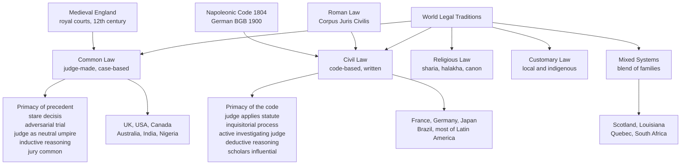

# ⚖️ Common Law vs Civil Law

> [!abstract] TL;DR
> The world's two dominant legal traditions answer one question differently: **where does the law actually live?** In **common law** (born in medieval England, now used in the UK, US, Canada, Australia, and India), law lives in the accumulated **decisions of judges** — each case builds on the last through binding **precedent (stare decisis)**, and disputes are fought out **adversarially** before a neutral judge and often a jury. In **civil law** (descended from Roman law and crystallized in the **Napoleonic Code** and the German **BGB**, now used across continental Europe, Latin America, and much of Asia and Africa), law lives in a comprehensive written **code**; the judge's job is to **apply** the code, not make law, and the procedure is more **inquisitorial** with an active investigating judge. Around these two giants sit **religious**, **customary**, **socialist**, and **mixed** systems — and in a globalizing world the two families increasingly borrow from each other.

## Intuition

**Analogy — two ways to run a kitchen.**

Imagine two restaurants that both must produce consistent, fair meals every night.

The **civil law** kitchen hands every cook a single **master cookbook** written by expert chefs before anyone starts cooking. It tries to anticipate every dish in advance and spell out the exact recipe. A cook's job is to **find the right recipe and follow it**. If a strange new ingredient shows up, the cook reasons *down* from the general rules in the book. The authority is the **book**; the cook is its faithful executor.

The **common law** kitchen has **no master cookbook**. Instead it keeps a meticulous logbook of **every meal ever cooked** and how it turned out. When a new order comes in, the cook looks up the **most similar past meals** and cooks *like those*, adjusting for the differences. Over decades, the logbook itself *becomes* the law of the kitchen — written not in advance by theorists, but case by case by the cooks themselves. The authority is **accumulated experience**; today's cook both follows past cooks and adds a new entry that will bind tomorrow's.

Neither kitchen is lawless and neither is chaos. They simply locate authority in **opposite places** — a code written top-down versus a body of decisions grown bottom-up — and almost every other difference (how judges behave, how trials run, how lawyers argue) flows from that single choice.

---

## How It Works

### Core Mechanics

**Common law — reasoning from cases, upward.** A common-law court deciding a dispute is bound by the principle (`ratio decidendi`) of relevant **earlier decisions** from higher courts in the same hierarchy. This is **stare decisis** ("to stand by things decided"). The judge:

1. Identifies the material facts of the current case.
2. Finds prior cases with similar facts (**precedents**).
3. Extracts the binding rule from those cases and **analogizes** — arguing this case is (or is not) sufficiently *like* them.
4. Applies the rule, and in doing so **creates new precedent** that binds future courts.

Reasoning is **inductive and analogical**: the law emerges from the pattern of concrete decisions rather than being deduced from a first principle. Statutes exist and are supreme where they apply, but vast areas (contract, tort, much of property) were historically judge-built, and even statutes are given meaning through the cases that interpret them.

**Civil law — reasoning from the code, downward.** A civil-law court starts from a **comprehensive written code** — a systematically organized statement of the whole field of law, meant to be gapless and internally coherent. The judge:

1. Identifies the legal category of the dispute.
2. Locates the governing article of the code.
3. **Deduces** the outcome by applying the general rule to the specific facts (syllogistic reasoning).

Prior decisions are **persuasive, not binding** — a consistent line of cases (`jurisprudence constante`) carries weight, but in theory each judge answers only to the code. Legal **scholars and commentators** (doctrine) are highly influential, since interpreting and systematizing the code is an academic enterprise.

**Procedure follows source.** Because common law grew through party-driven litigation, its trial is **adversarial**: two sides marshal evidence and argument, and the judge is a **neutral umpire** who rules on what the parties put before them, often with a **lay jury** as fact-finder. Civil law's **inquisitorial** tradition gives the judge (or an investigating magistrate) an **active role** in gathering evidence and directing the inquiry toward the truth, with juries historically rarer.

### Flow / Architecture



---

## Key Concepts

### Secondary — the core distinction

- **Common law = judge-made law.** It began in **medieval England** after the Norman Conquest, when royal judges traveling the country built a body of law "common" to the whole realm out of their decisions. The law is found primarily in **reported cases**.
- **Civil law = code law.** It descends from **Roman law** and was reborn in the great modern **codes**, above all Napoleon's **Civil Code of 1804** (see [[Napoleon_and_His_Wars]]). The law is found primarily in a **written code** enacted by the legislature.
- **Where each is used.** Common law: the UK (except Scotland), the US, Canada, Australia, India, and much of the former British Empire. Civil law: nearly all of continental Europe, all of Latin America, and much of Asia and Africa. Civil law covers **more countries**; common law covers a very large **share of the world's economy and population**.

### Undergraduate — the machinery

- **Stare decisis and ratio decidendi.** In common law, only the **ratio decidendi** (the essential legal reason for a decision) binds later courts; **obiter dicta** (asides) are merely persuasive. Courts are bound by superior courts in their own hierarchy — this is *vertical* precedent — and often by their own past decisions (*horizontal*).
- **Binding vs persuasive authority.** Common-law precedent from a higher court is **binding**. Civil-law prior decisions are at most **persuasive**; the code is the authority. This is the single sharpest doctrinal contrast between the families.
- **Inductive vs deductive reasoning.** Common lawyers reason **inductively/analogically** from many decided cases to a rule; civil lawyers reason **deductively** from the general article of the code down to the case.
- **Adversarial vs inquisitorial procedure.** Adversarial (common law): party-controlled contest, passive umpire-judge, prominent **jury**, strong rules of evidence and cross-examination. Inquisitorial (civil law): court-controlled inquiry, **active judge** who investigates, a written dossier, less emphasis on live courtroom combat.
- **The two great codifications of civil law.** The **French Napoleonic Code (1804)** — accessible, aimed at the ordinary citizen, exported by conquest and colonization. The **German Civil Code / BGB (1900)** — abstract, systematic, the product of 19th-century academic **Pandectist** scholarship on Roman law; hugely influential in Japan, Korea, Greece, and beyond.
- **The role of the professor.** In civil law, university **jurists** who write treatises shape the law's meaning. In common law, the **judge** is the central creative figure; academics historically mattered less (though this is converging).

### Graduate — families, transplants, and convergence

- **Classifying legal systems.** Comparatists group the world's ~200 systems into **legal families**. The influential scheme of **Zweigert & Kötz** and the earlier work of **René David** use style, sources, ideology, and history. The **JuriGlobe** project (University of Ottawa) maps every jurisdiction as civil, common, customary, Muslim, or **mixed** — and most jurisdictions turn out to be mixed to some degree.
- **Other traditions.**
  - **Religious law** — Islamic **sharia** (derived from Qur'an, Sunnah, and juristic reasoning), Jewish **halakha**, and Christian **canon law**. Sometimes a full legal system (as in some Gulf states), often applied to personal-status matters within a secular system.
  - **Customary / indigenous law** — unwritten community norms, still central in parts of Africa, the Pacific, and among indigenous peoples.
  - **Socialist law** — a 20th-century offshoot of civil law (USSR, Maoist China) subordinating law to Party and plan; its legacy persists in the structures of China, Vietnam, and Cuba even after market reform.
- **Mixed jurisdictions.** Some systems deliberately blend families: **Scotland** and **South Africa** (Roman-Dutch civil law + English common law), **Louisiana** and **Quebec** (French civil codes inside common-law federations), the **Philippines**, **Sri Lanka**, and **Israel**. These "laboratories" reveal how the families can coexist.
- **Legal transplants and convergence.** Alan Watson showed law spreads by **transplant** (borrowing rules across systems). Modern pressures push the families together: common-law jurisdictions **codify** ever more (US uniform codes, statutory tort reform), while civil-law jurisdictions give **de facto precedential weight** to constitutional and apex-court rulings. **EU harmonization**, international commercial law, and human-rights courts accelerate the blending. The families remain distinct in *style and mindset* even as their outputs converge.

---

## Python Demo

```python
# Two-panel comparison of the world's legal traditions using only numpy + matplotlib.
# Panel 1: bar chart of legal families by approximate number of jurisdictions.
# Panel 2: heatmap contrasting common vs civil law across key dimensions.
# Jurisdiction counts are approximate, based on the JuriGlobe world legal-systems survey
# (University of Ottawa); many real jurisdictions are mixed, so figures are indicative.

import numpy as np
import matplotlib.pyplot as plt

# ---- Panel 1 data: legal families ----
families = ["Civil\nlaw", "Common\nlaw", "Mixed\nsystems", "Customary\nlaw", "Religious\nlaw"]
counts = np.array([88, 61, 39, 6, 3])           # approx. number of jurisdictions per family
colors = ["#2563eb", "#dc2626", "#7c3aed", "#059669", "#d97706"]

# ---- Panel 2 data: contrast matrix (0 = weak/absent, 1 = strong/central) ----
dimensions = [
    "Role of binding precedent",
    "Role of comprehensive codes",
    "Judge as active investigator",
    "Adversarial procedure",
    "Inductive / analogical reasoning",
    "Use of lay jury",
    "Influence of legal scholars",
]
# columns: [Common law, Civil law]
matrix = np.array([
    [1.0, 0.3],   # binding precedent: central in common law
    [0.3, 1.0],   # comprehensive codes: central in civil law
    [0.2, 0.8],   # active investigating judge: civil law
    [0.9, 0.3],   # adversarial procedure: common law
    [0.9, 0.2],   # inductive reasoning: common law (civil = deductive)
    [0.8, 0.2],   # lay jury: common law
    [0.4, 0.9],   # scholarly doctrine: civil law
])

fig, (ax1, ax2) = plt.subplots(1, 2, figsize=(14, 6))

# ----- Panel 1: bar chart -----
xpos = np.arange(len(families))
bars = ax1.bar(xpos, counts, color=colors, edgecolor="black", linewidth=0.6)
ax1.set_xticks(xpos)
ax1.set_xticklabels(families, fontsize=9)
ax1.set_ylabel("Approx. number of jurisdictions")
ax1.set_title("World Legal Traditions by Family (indicative)")
for bar, c in zip(bars, counts):
    ax1.text(bar.get_x() + bar.get_width() / 2, c + 1, str(c),
             ha="center", va="bottom", fontsize=9, fontweight="bold")
ax1.set_ylim(0, max(counts) + 12)

# ----- Panel 2: contrast heatmap -----
im = ax2.imshow(matrix, cmap="coolwarm", aspect="auto", vmin=0, vmax=1)
ax2.set_xticks([0, 1])
ax2.set_xticklabels(["Common law", "Civil law"], fontsize=10, fontweight="bold")
ax2.set_yticks(np.arange(len(dimensions)))
ax2.set_yticklabels(dimensions, fontsize=9)
ax2.set_title("Common vs Civil Law: emphasis by dimension")
# annotate each cell with its score
for i in range(matrix.shape[0]):
    for j in range(matrix.shape[1]):
        ax2.text(j, i, f"{matrix[i, j]:.1f}", ha="center", va="center",
                 color="white", fontsize=10, fontweight="bold")
cbar = fig.colorbar(im, ax=ax2, fraction=0.046, pad=0.04)
cbar.set_label("emphasis  (0 = weak, 1 = central)")

fig.tight_layout()
plt.show()

# Quick numeric summary: which family covers the most jurisdictions?
order = np.argsort(counts)[::-1]
print("Legal families ranked by jurisdiction count:")
for k in order:
    label = families[k].replace("\n", " ")
    print(f"  {label:<14} ~{counts[k]:>3} jurisdictions")
```

Running this prints a ranking (civil law widest by country count, common law second) and shows two panels: the family bar chart and a red/blue contrast heatmap where common-law rows (precedent, adversarial, jury, induction) glow on one side and civil-law rows (codes, active judge, doctrine) glow on the other — a one-glance picture of the whole distinction.

---

## Real-World Applications

- **Cross-border contracts and choice of law.** International commercial contracts routinely specify a **governing law** — parties often choose **English (common) law** or **New York law** for their deep, predictable case law, or **Swiss/French (civil) law** for neutrality. Understanding the family determines how a clause will be read: literally against a code, or against decades of precedent.
- **Doing business in a mixed jurisdiction.** A company operating in **Louisiana, Quebec, Scotland, or South Africa** must navigate a hybrid where civil codes and common-law procedure coexist. Contracts, property, and succession may follow civil-law logic while litigation runs on adversarial lines.
- **International criminal and human-rights courts.** Tribunals like the **ICC** deliberately blend adversarial and inquisitorial procedure so that lawyers trained in either tradition can participate — a live experiment in convergence, connected to [[Human_Rights_and_International_Law]].
- **Codification movements inside common law.** The US **Uniform Commercial Code**, restatements, and statutory reforms show common-law systems adopting civil-law-style codification for clarity and uniformity across states.
- **Legal-system reform and development.** When post-Soviet and developing states rebuild their legal systems, aid agencies effectively export a **family** — a transplanted German-style civil code or a common-law commercial framework — shaping the country's legal culture for generations.

---

## Common Pitfalls

- **"Civil law" the family vs "civil law" the subject.** *Civil law* as a **legal tradition** (opposed to common law) is different from *civil law* as a **field** (private disputes, opposed to criminal law). Both terms exist inside a common-law country too. Always check which sense is meant.
- **Assuming common law has no statutes and civil law has no cases.** Both are false. Common-law legislatures pass vast statutes; civil-law apex courts issue influential rulings. The difference is where **primary authority** sits and how reasoning flows — not whether the other source exists at all.
- **Treating precedent as absolutely rigid.** Even under stare decisis, courts **distinguish** unfavorable precedents on their facts, and the highest courts can **overrule** their own past decisions. Precedent constrains; it does not freeze.
- **Equating inquisitorial with unfair or authoritarian.** The inquisitorial model is not "guilty until proven innocent." It is a different, judge-led method of finding truth, with its own robust protections. Adversarial is not inherently fairer — it can favor the better-resourced party.
- **Forgetting the mixed and religious majority.** Framing the world as a clean common-vs-civil binary ignores that most jurisdictions are **mixed**, and that **religious** and **customary** law still govern personal status for billions of people.
- **Confusing origin with modern practice.** The US "inherited" English common law but diverged sharply (a written constitution, judicial review, jury reforms). Shared family does not mean identical rules.

---

## Related Concepts

- [[The_Roman_Republic]] — the **Twelve Tables** and early Roman law are the taproot of the entire civil-law tradition through the later *Corpus Juris Civilis*.
- [[The_Roman_Empire]] — imperial jurists and Justinian's codification produced the Roman-law corpus that medieval Europe rediscovered and civil law is built on.
- [[Feudalism_and_Early_Medieval_Europe]] — the decentralized post-Roman world in which English royal courts began forging a "common" law of the realm.
- [[The_High_Middle_Ages]] — the era of the rediscovery of Roman law in the Italian universities (Bologna) and the maturing of the English common-law courts.
- [[Napoleon_and_His_Wars]] — the **Napoleonic Code of 1804** is the model modern civil code, exported across Europe and the Americas by conquest and admiration.
- [[The_French_Revolution]] — its drive to sweep away feudal, judge-made law and replace it with rational written codes shaped the civil-law ideal of the code as supreme.
- [[Rise_of_Islam_and_the_Caliphates]] — the origins of **sharia**, the leading example of the religious-law tradition that sits alongside common and civil law.
- [[Political_Institutions_and_Constitutions]] — how a country's legal family interacts with its constitutional design, courts, and separation of powers.
- [[Social_Contract_Theory]] — the Enlightenment political thought underlying both codification and the rule of law.
- [[Human_Rights_and_International_Law]] — international courts blend the two procedural traditions and increasingly harmonize them.
- [[Regulatory_Politics_and_Administrative_Law]] — administrative law, where civil-law and common-law states developed strikingly different structures for controlling state power.

---

## Review Questions

1. **Foundational.** In one sentence each, state where "the law" primarily resides in the common-law and civil-law traditions, and name the historical origin of each family.
2. **Applied / scenario.** A software company in Germany signs a supply contract with a firm in India, and the contract is silent on which law governs a later dispute. Explain how the *reasoning method* and the *weight of prior decisions* would differ if the dispute were decided under German (civil) law versus Indian (common) law — and why parties often specify a governing law in advance.
3. **Trade-off / synthesis.** Common law is often praised for **flexibility and responsiveness** and criticized for **unpredictability and slow accretion**, while civil law is praised for **clarity and accessibility** and criticized for **rigidity and gaps**. Argue which set of trade-offs is better suited to a fast-changing field like technology regulation, and explain how convergence (codification in common law, de-facto precedent in civil law) complicates your answer.

---

## Sources

- Zweigert, K. & Kötz, H. (1998). *An Introduction to Comparative Law* (3rd ed., trans. Weir). Oxford University Press.
- David, R. & Brierley, J. (1985). *Major Legal Systems in the World Today* (3rd ed.). Stevens & Sons.
- Merryman, J. H. & Pérez-Perdomo, R. (2018). *The Civil Law Tradition: An Introduction to the Legal Systems of Europe and Latin America* (4th ed.). Stanford University Press.
- Glenn, H. P. (2014). *Legal Traditions of the World* (5th ed.). Oxford University Press.
- JuriGlobe — World Legal Systems Research Group, University of Ottawa. [World Legal Systems](https://www.juriglobe.ca/eng/).

---

#law #common-law #civil-law #legal-traditions #comparative-law
