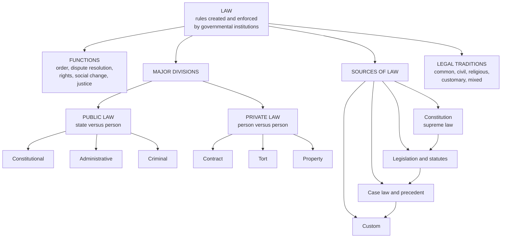

# ⚖️ Law and Legal Systems Overview

> [!abstract] TL;DR
> **Law** is a system of rules created and enforced by social and governmental institutions to regulate behaviour. It keeps order, resolves disputes, protects rights, channels social change, and expresses a society's idea of justice. Every legal system organises its rules along the same axes — **public versus private**, **criminal versus civil**, **substantive versus procedural**, **domestic versus international** — and draws them from the same handful of **sources** (constitution, legislation, case law, custom). The world's legal orders cluster into a few great **traditions** — common law, civil law, religious law, customary law, and mixed systems — which differ mostly in *where* they locate authority and *how* they reason. This is the entry note for the Law vault.

---

## Intuition

**Analogy — the rules of a stadium.** Imagine a packed football stadium with no rules at all: no lanes to the seats, no referee, no ticketing, no rule against shoving. Even peaceful people would collide, fights would settle disputes, and the strongest would take the best seats. Now add three things: a **rulebook** everyone can read in advance, **referees and stewards** empowered to enforce it, and a **procedure** for appealing a bad call. Suddenly a crowd of strangers can coordinate, trust each other, and get on with the game. Law is the rulebook, the referee, and the appeals procedure for an entire society at once.

Two features of the stadium carry the whole concept. First, the rules are **public and general** — they apply to everyone, are knowable in advance, and are not invented on the spot for one person. Second, they are **backed by enforcement** — a rule nobody will apply is just advice. Law is what you get when a community writes down rules of this kind, appoints institutions to apply them, and agrees to settle conflicts by the rulebook rather than by force. Everything else — constitutions, courts, contracts, crimes — is detail hanging off that skeleton.

---

## How It Works

### What law is

A working definition: **law is a set of institutionalised, generally applicable, coercively enforceable rules that regulate conduct within a community.** Four ideas do the work:

- **Rules, not commands to individuals.** Law speaks in general standards ("drivers must stop at red") rather than one-off orders, so people can plan around it.
- **Institutions.** Law is *made* (legislatures, framers), *applied* (courts, agencies, police), and *interpreted* (judges) by recognised bodies, not by whoever is strongest that day.
- **Coercion.** Behind the rule stands the organised force of the state — the power to fine, imprison, or seize property. This is what separates law from etiquette or morality, which rely only on conscience and social pressure.
- **Legitimacy.** A stable legal order also claims a *right* to be obeyed, not merely the power to punish — the difference between a state and a well-armed gang (see [[The_State_and_Political_Authority]]).

### The functions of law

Law is judged by what it does. Five functions recur across every tradition:

1. **Order and predictability** — coordinating millions of strangers so they can transact, travel, and live together safely.
2. **Dispute resolution** — supplying neutral forums (courts, tribunals, arbitration) so conflicts end in judgments rather than feuds.
3. **Protecting rights and liberty** — shielding persons, property, and freedoms from both private aggression and the state itself (see [[Liberty_and_Rights]]).
4. **Enabling social change** — abolishing slavery, extending the franchise, regulating pollution: law is a lever for deliberate reform.
5. **Doing justice** — allocating benefits, burdens, and punishments according to a society's conception of what is fair (see [[Justice_and_Rawls]]).

### The major divisions of law

Lawyers cut the same body of rules along several independent axes. The most important:

- **Public law vs private law.** *Public law* governs the relationship between the individual and the state — **constitutional** law (the structure and limits of government), **administrative** law (how agencies exercise power), and **criminal** law (offences against the public order). *Private law* governs relations *between persons* — **contract**, **tort** (civil wrongs), and **property**.
- **Criminal vs civil.** *Criminal* cases are brought by the state to punish public wrongs; the standard of proof is high ("beyond reasonable doubt") and the outcome is punishment. *Civil* cases are brought by private parties seeking a remedy (usually compensation); the standard is lower ("balance of probabilities") and the outcome is a judgment for damages or an order.
- **Substantive vs procedural.** *Substantive* law defines rights and duties (what counts as theft, what a valid contract requires). *Procedural* law defines the process for enforcing them (how a trial runs, what evidence is admissible). Procedure is where due process lives.
- **Domestic vs international.** *Domestic* law operates within one state; *international* law governs relations between states and, increasingly, individuals — see [[The_State_System_and_Sovereignty]] and [[Human_Rights_and_International_Law]].

### The sources of law (preview)

Where do the rules actually come from? Four classic sources, roughly in order of authority:

1. **Constitution** — the supreme, foundational law that constitutes the government and constrains all lower law.
2. **Legislation / statutes** — rules enacted by a legislature, the primary source in modern states.
3. **Case law / precedent** — rules articulated by courts when deciding disputes; binding in common-law systems under *stare decisis*, persuasive elsewhere.
4. **Custom** — long-established practice accepted as legally binding, dominant in customary systems and still important in international law.

A dedicated companion note, **Sources_of_Law**, unpacks each and their interaction; the ranking among them is the subject of the hierarchy shown in the Python demo below.

### The world's legal traditions

Zoom out from any one country and legal systems cluster into a few **families** or **traditions**, which share deep assumptions about authority and legal reasoning:

- **Civil law** (Continental Europe, Latin America, much of Asia and Africa) — built on comprehensive written **codes**; judges apply the code rather than make law; descended from Roman law.
- **Common law** (UK, US, India, most of the Commonwealth) — built on **judge-made precedent** accumulating case by case; statutes sit atop a body of decided cases. See the companion note **Common_Law_vs_Civil_Law**.
- **Religious law** (Islamic *sharia*, Jewish *halakha*, canon law) — derives authority from sacred texts and religious jurisprudence.
- **Customary law** — grounded in long-standing community practice, often unwritten, common in indigenous and pluralistic orders.
- **Mixed / pluralistic systems** — combine two or more of the above (e.g., South Africa, Scotland, Louisiana, Quebec).

### Law, justice, morality, and the state

Law is *related to* but not *identical with* morality or justice. A rule can be legally valid yet morally wrong (an unjust statute), and moral duties (keeping a promise to a friend) may carry no legal force. The long debate between **natural law** (there is a necessary connection between law and morality) and **legal positivism** (legal validity depends on social facts, not moral merit) turns on exactly this gap — see [[What_Is_Ethics]] for the moral background. Law is also inseparable from the **state**: it presupposes an authority with the recognised right to make and enforce rules, which is why the theory of law leans on the theory of political authority (see [[The_Social_Contract]] and [[Social_Contract_Theory]]).



### This vault at a glance

The Law vault is organised into **six sections**:

1. **01 Foundations of Law** — what law is, sources of law, legal systems, the rule of law *(this note lives here)*.
2. **02 Constitutional and Public Law** — constitutions, separation of powers, judicial review, administrative and regulatory law.
3. **03 Private Law** — contract, tort, property, and the law of obligations.
4. **04 Criminal Law and Justice** — offences, liability, defences, punishment, and criminal procedure.
5. **05 International and Comparative Law** — public and private international law, human rights, and comparison across traditions.
6. **06 Jurisprudence and Legal Theory** — natural law, legal positivism, legal realism, and the relationship of law to morality and justice.

---

## Key Concepts

### Secondary (foundations)

- **Rule of law** — the principle that everyone, including the government, is subject to and accountable under law applied equally, rather than to the arbitrary will of rulers.
- **Rights and duties** — every legal relationship pairs a right held by one party with a corresponding duty owed by another.
- **Crime vs civil wrong** — a *crime* offends the public and is prosecuted by the state; a *civil wrong* injures a private party who then sues for a remedy.
- **Legislation vs precedent** — statutes are rules written by parliaments; precedents are rules laid down by judges when deciding cases.

### Undergraduate (structure and reasoning)

- **Public/private, criminal/civil, substantive/procedural, domestic/international** — the four cross-cutting divisions used to classify any legal rule.
- **Stare decisis** — the common-law doctrine that courts follow prior decisions of higher courts on similar facts, giving precedent binding force.
- **Codification** — the civil-law method of gathering rules into a systematic, comprehensive written code from which judges deduce answers.
- **Hierarchy of norms** — the ranking of legal sources (constitution over statute over regulation), so that a lower norm conflicting with a higher one is invalid; central to *Kelsen's* pure theory of law.
- **Due process / natural justice** — procedural guarantees (notice, a fair hearing, an unbiased judge) that must accompany any deprivation of life, liberty, or property.

### Graduate (theory and comparison)

- **Natural law vs legal positivism** — whether legal validity necessarily depends on moral merit (*Aquinas*, *Finnis*) or only on social facts about what was enacted and recognised (*Bentham*, *Austin*, *Hart*).
- **Hart's rule of recognition** — the master social rule by which officials identify what counts as valid law in a system; the foundation of modern positivism.
- **Legal realism and critical theory** — the claim that formal rules underdetermine outcomes, so what judges actually do (and the interests they serve) is where law really lives.
- **Legal families and convergence** — comparative-law debate over how sharply common and civil law still differ, and whether globalisation and human-rights regimes are driving convergence (*Zweigert & Kötz*, *Glenn*).
- **Legal pluralism** — the recognition that multiple legal orders (state, religious, customary, transnational) can operate over the same population simultaneously.

---

## Python Demo

```python
# Visualises the STRUCTURE of a legal system, using only numpy + matplotlib:
#   (1) the hierarchy of legal authority (constitution -> statutes -> regulations -> case law)
#   (2) the branches of law (public vs private; criminal vs civil sub-branches)
#   (3) a bar chart comparing the world's major legal traditions by rough share of countries
import numpy as np
import matplotlib.pyplot as plt
from matplotlib.patches import FancyBboxPatch
from matplotlib.gridspec import GridSpec


def box(ax, x, y, w, h, text, fc, fs=9):
    """Draw a rounded, centred label box in axis coordinates."""
    ax.add_patch(FancyBboxPatch(
        (x - w / 2, y - h / 2), w, h,
        boxstyle="round,pad=0.02,rounding_size=0.04",
        linewidth=1.2, edgecolor="#333333", facecolor=fc))
    ax.text(x, y, text, ha="center", va="center", fontsize=fs, color="white")


fig = plt.figure(figsize=(12, 9))
gs = GridSpec(2, 2, height_ratios=[1.05, 1.0], figure=fig)

# --- (1) Hierarchy of legal authority ---------------------------------------
ax1 = fig.add_subplot(gs[0, 0])
ax1.set_title("Hierarchy of Legal Authority", fontsize=11, fontweight="bold")
levels = [
    ("Constitution\n(supreme law)", "#c62828"),
    ("Statutes / Legislation\n(the legislature)", "#ef6c00"),
    ("Regulations\n(agency rules)", "#f9a825"),
    ("Case Law / Precedent\n(court decisions)", "#2e7d32"),
]
ys = np.linspace(0.85, 0.15, len(levels))
widths = np.linspace(0.5, 0.92, len(levels))
for i, ((label, color), y, w) in enumerate(zip(levels, ys, widths)):
    box(ax1, 0.5, y, w, 0.15, label, color)
    if i < len(levels) - 1:
        ax1.annotate("", xy=(0.5, ys[i + 1] + 0.075), xytext=(0.5, y - 0.075),
                     arrowprops=dict(arrowstyle="-|>", color="#555555", lw=1.4))
ax1.text(0.5, 0.99, "higher law overrides lower law", ha="center",
         fontsize=8, style="italic")
ax1.set_xlim(0, 1); ax1.set_ylim(0, 1.03); ax1.axis("off")

# --- (2) Branches of law -----------------------------------------------------
ax2 = fig.add_subplot(gs[0, 1])
ax2.set_title("Branches of Law", fontsize=11, fontweight="bold")
box(ax2, 0.5, 0.9, 0.28, 0.12, "LAW", "#37474f", fs=11)
box(ax2, 0.27, 0.62, 0.36, 0.13, "Public Law\n(state vs person)", "#1565c0")
box(ax2, 0.73, 0.62, 0.36, 0.13, "Private Law\n(person vs person)", "#6a1b9a")
children = {0.27: (["Constitutional", "Administrative", "Criminal"], "#64b5f6"),
            0.73: (["Contract", "Tort", "Property"], "#ba68c8")}
child_y = np.linspace(0.37, 0.07, 3)
for parent_x, (labels, col) in children.items():
    ax2.annotate("", xy=(parent_x, 0.685), xytext=(0.5, 0.845),
                 arrowprops=dict(arrowstyle="-|>", color="#555555", lw=1.3))
    for lab, y in zip(labels, child_y):
        ax2.plot([parent_x, parent_x], [0.555, y + 0.045],
                 color="#aaaaaa", lw=0.8, zorder=0)
        box(ax2, parent_x, y, 0.32, 0.09, lab, col, fs=8)
ax2.set_xlim(0, 1); ax2.set_ylim(0, 1.03); ax2.axis("off")

# --- (3) Major legal traditions by rough share of countries ------------------
ax3 = fig.add_subplot(gs[1, :])
traditions = ["Civil law", "Common law", "Mixed /\npluralistic",
              "Religious\n(e.g. Islamic)", "Customary"]
share = np.array([50, 27, 15, 5, 3])            # rough % of ~200 countries
colors = ["#1565c0", "#2e7d32", "#6a1b9a", "#ef6c00", "#795548"]
bars = ax3.bar(traditions, share, color=colors, edgecolor="black")
for b, s in zip(bars, share):
    ax3.text(b.get_x() + b.get_width() / 2, s + 0.8, f"{s}%",
             ha="center", fontsize=9)
ax3.set_ylabel("Approx. share of countries (%)")
ax3.set_title("World's Major Legal Traditions (rough share of countries)",
              fontsize=11, fontweight="bold")
ax3.set_ylim(0, 60)
ax3.grid(axis="y", alpha=0.3)

fig.suptitle("Structure of a Legal System", fontsize=13, fontweight="bold")
plt.tight_layout(rect=[0, 0, 1, 0.97])
plt.savefig("legal_systems_overview.png", dpi=120, bbox_inches="tight")
plt.show()
```

Running this produces three panels: the **pyramid of authority** (why a regulation that contradicts the constitution is void), the **branching tree** (public/private and their criminal/civil sub-fields), and a **bar chart** showing that most of the world lives under civil-law systems, followed by common law, with religious and customary traditions surviving largely inside mixed systems.

---

## Real-World Applications

> **Example 1 — A car crash that is both a crime and a tort.** A drunk driver who injures a pedestrian faces two independent proceedings: the *state* prosecutes **drunk driving** (criminal law, punishment, "beyond reasonable doubt"), while the *victim* separately sues in **negligence** for medical costs (private tort law, damages, "balance of probabilities"). Same facts, two divisions of law, two standards of proof — the clearest illustration of the criminal/civil split.

> **Example 2 — Judicial review striking down a statute.** When a court invalidates a law for violating the constitution (e.g., the US Supreme Court in *Brown v. Board of Education*, or the Indian Supreme Court under the basic-structure doctrine), it is enforcing the **hierarchy of norms**: the constitution outranks ordinary legislation, so a conflicting statute is void. This is constitutional (public) law in action.

> **Example 3 — Cross-border commerce and choice of law.** A software contract between a German and a US company must decide *which* legal system governs it — a civil-law code or common-law precedent. Firms routinely insert **governing-law and arbitration clauses**, a practical consequence of the domestic/international divide and of the deep differences between legal traditions.

> **Example 4 — Legal pluralism in family law.** In countries like India or Nigeria, marriage and inheritance may be governed by **religious or customary** law running alongside the state's civil code, so the applicable rules depend on the parties' community — a live case of legal pluralism.

> **Example 5 — Regulations translating statutes into detail.** A parliament passes a broad clean-air *statute*; an environmental *agency* then issues detailed emissions *regulations* under authority delegated by that statute. The regulation is valid only so far as it stays within the statute, which in turn must respect the constitution — the hierarchy at work every day.

---

## Common Pitfalls

- **Confusing law with morality.** A statute can be legally valid yet morally objectionable, and many moral duties carry no legal sanction. Legal validity and moral rightness are distinct questions — the whole natural-law-versus-positivism debate exists because they can come apart.
- **Confusing law with justice.** Law *aspires* to justice but often falls short; "it is the law" answers whether a rule is binding, not whether it is fair. Keep the descriptive question ("what is the law?") separate from the evaluative one ("what should the law be?").
- **Treating criminal and civil as the same track.** They differ in who sues, the standard of proof, and the remedy. The same act can trigger both, and an acquittal in a criminal court does not bar a civil claim.
- **Assuming every country works like your own.** Common-law readers over-weight judges and precedent; civil-law readers over-weight codes. Neither is "the" legal system — they are different traditions with different logics.
- **Ignoring procedure.** Beginners fixate on substantive rights and forget that a right you cannot *enforce* through valid procedure is worthless; due process is not a technicality but half of the rule of law.
- **Reading "sources of law" as a flat list.** The sources are *ranked*: a regulation cannot override a statute, nor a statute the constitution. Missing the hierarchy leads to nonsense conclusions about which rule wins.

---

## Related Concepts

- [[The_State_and_Political_Authority]] — the state's monopoly on legitimate force is what gives law its coercive backing and distinguishes law from a gang's threats.
- [[The_Social_Contract]] — the classic philosophical account of *why* legal and political authority binds us at all.
- [[Social_Contract_Theory]] — the political-science treatment of consent and legitimate authority underlying any legal order.
- [[Justice_and_Rawls]] — law's aspiration to justice; Rawls on the duty to support just legal institutions.
- [[Liberty_and_Rights]] — where legal coercion must stop; the harm principle marks the limit of the criminal law.
- [[What_Is_Ethics]] — the moral background to the law-versus-morality distinction and the natural-law debate.
- [[The_State_System_and_Sovereignty]] — sovereignty is the foundation on which both domestic and international law rest.
- [[Human_Rights_and_International_Law]] — the international legal order and rights regimes that increasingly constrain domestic law.
- [[Political_Institutions_and_Constitutions]] — constitutions as the highest-ranking source in the hierarchy of legal norms.
- [[Regulatory_Politics_and_Administrative_Law]] — how agencies exercise delegated legal power in practice.

---

## Review Questions

**Secondary.** In your own words, what is law, and how does it differ from a rule of etiquette or a moral rule? Give one example of each and explain what makes the legal rule *legal*.

**Undergraduate.** A shopkeeper is assaulted by a customer who also smashes the till. Identify which *divisions* of law are engaged (public/private, criminal/civil), who brings each proceeding, what standard of proof applies, and what remedy or outcome each seeks.

**Graduate.** "An unjust law is still a law." Evaluate this claim by contrasting **legal positivism** with **natural law**. What does each theory say about the validity of a wicked statute, and why does the answer matter for a judge deciding whether to apply it?

---

## Sources

- Hart, H. L. A. (1961). *The Concept of Law*. Oxford University Press.
- Raz, J. (1979). *The Authority of Law: Essays on Law and Morality*. Oxford University Press.
- Zweigert, K., & Kötz, H. (1998). *An Introduction to Comparative Law* (3rd ed.). Oxford University Press.
- Glenn, H. P. (2014). *Legal Traditions of the World* (5th ed.). Oxford University Press.
- Waldron, J. (2023). "The Rule of Law," in *The Stanford Encyclopedia of Philosophy* (ed. E. N. Zalta). Stanford University.

---

#law #legal-systems #jurisprudence #legal-foundations
