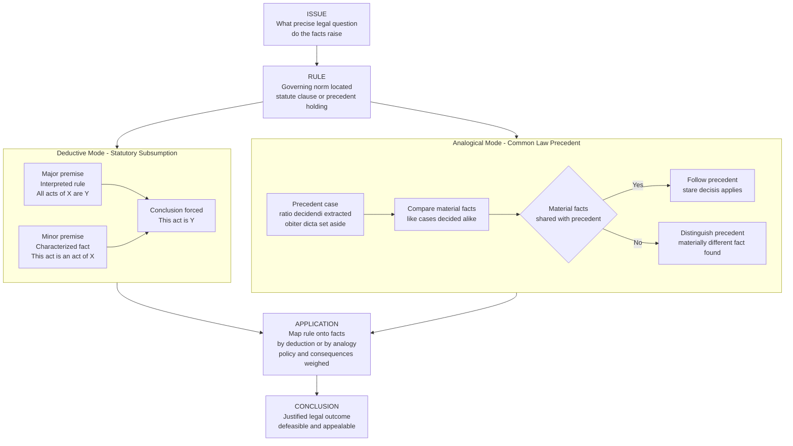

# Legal Reasoning and Interpretation

> [!abstract] TL;DR
> Legal reasoning is the disciplined method by which lawyers and judges move from facts and legal materials to justified legal conclusions. It runs on two engines — **deduction** (subsuming facts under a rule, the syllogistic form captured by IRAC) and **analogy** (deciding a new case like a materially similar precedent, the engine of the common law) — supplemented by **interpretation** of statutes and constitutions. Its distinctive feature is that it is *authority-based and defeasible*: unlike a logical proof it can be right today and overruled tomorrow, and unlike moral reasoning it asks what the law *is*, not what it *ought* to be.

---

## Intuition

**Analogy:** Think of a football referee with two very different tools. Sometimes the rulebook is explicit — "a deliberate handball inside the penalty area is a penalty kick." The referee simply checks whether the facts match the words and applies the rule mechanically; the outcome is *forced* once the facts are settled. That is **deductive** legal reasoning. But many incidents are not squarely in the rulebook. Then the referee reaches for memory: "how was a near-identical incident handled last season?" and decides this one the same way — **unless** there is a genuinely relevant difference. That is **analogical** reasoning from precedent. And when the referee says "last time the ball struck the arm deliberately, but here it ricocheted off the player's own thigh first, which is materially different, so the earlier call does not govern," that move is **distinguishing** a precedent on its facts.

Transposed into law: the rulebook is a **statute** and its plain words; the remembered incidents are **precedent cases** with binding holdings; and the whole apparatus of interpretation exists because the fit between words, past cases, and new facts is never perfectly tight. Legal reasoning is the craft of making — and *justifying* — that fit.

---

## How It Works

### The IRAC Skeleton and the Legal Syllogism

Every well-formed legal argument, from a first-year exam answer to a Supreme Court opinion, can be reconstructed as **IRAC**:

1. **Issue** — the precise legal question the facts raise ("Did the defendant owe a duty of care?").
2. **Rule** — the governing legal norm, drawn from a statute, a constitutional clause, or a precedent's holding.
3. **Application** — the rule mapped onto the concrete facts; this is where the real reasoning happens.
4. **Conclusion** — the legal outcome for the parties.

The Application step, in its cleanest form, is a **deductive syllogism** (a legal *subsumption* argument):

> **Major premise (rule):** All acts of intentional deception for financial gain are fraud.
> **Minor premise (fact):** The defendant's conduct was an act of intentional deception for financial gain.
> **Conclusion:** The defendant's conduct is fraud.

This is Aristotle's *Barbara* wearing a wig and gown. The catch — and the reason legal reasoning is a discipline rather than a lookup — is that the certainty of the syllogism is an illusion borrowed from its premises. The genuinely contested work happens *before* the syllogism runs: deciding what the rule *means* (interpretation) and whether the facts *count as* an instance of the rule's terms (characterization). Once "deception" and "financial gain" are defined and the facts characterized, the conclusion is trivial; getting there is not.

### Reasoning with Precedent in the Common Law

Where no statute governs, common-law judges reason **analogically** from decided cases under the doctrine of **stare decisis** ("stand by things decided"): like cases should be decided alike. The mechanics:

- **Ratio decidendi** — the binding rule, the *holding*: the legal principle necessary to the decision given the material facts. Only the ratio binds later courts.
- **Obiter dicta** — "things said in passing": observations not necessary to the outcome. Persuasive at best, never binding.
- **Distinguishing** — a later court confronted with an inconvenient precedent identifies a **materially different fact**, showing the precedent's ratio does not reach the new case. This is analogy's escape hatch: the precedent stands, but does not govern *here*.
- **Overruling** — a court of sufficient authority declares a precedent *wrong* and abolishes it prospectively and retrospectively. Distinguishing narrows; overruling kills.

Extracting the ratio is itself an interpretive act — a precedent can be read *broadly* (many later cases fall under it) or *narrowly* (tied tightly to its facts), and the width of the ratio is contested by the very parties it will bind. In cognitive-science and AI terms this is **case-based reasoning**: retrieve the most similar prior case, reuse its outcome, revise for differences, retain the new decision as future precedent.

### Statutory Interpretation

When the law is a statute, the court must extract meaning from the enacted text. The main rival approaches:

- **Textualism / plain-meaning rule** — start (and often stop) with the ordinary meaning of the words in context. If the text is clear, apply it even if the result seems unwise; policy is the legislature's job.
- **The golden rule** — apply the plain meaning *unless* it produces an absurdity or repugnance, in which case depart from it just enough to avoid the absurd result.
- **The mischief rule** (Heydon's Case, 1584) — ask what defect in the prior law ("the mischief") the statute was enacted to cure, and read the words to suppress that mischief and advance the remedy.
- **Purposivism** — interpret the words to serve the statute's evident purpose and the reasonable intent of the legislature, using text as evidence of purpose rather than as an endpoint.

These approaches are sharpened by **canons of construction** — presumptive interpretive rules:

- **Ejusdem generis** ("of the same kind") — a general term following a list of specific ones is read as limited to items of the same class. "Cars, trucks, motorcycles, and other vehicles" probably excludes airplanes.
- **Expressio unius est exclusio alterius** — the express mention of one thing implies the exclusion of others not mentioned.
- **Noscitur a sociis** ("known by its companions") — an ambiguous word takes color from the words around it.

**Legislative history** — committee reports, floor debates, prior drafts — is used by purposivists as evidence of intent and distrusted by textualists as unenacted, manipulable, and constitutionally suspect (only the text passed both chambers and was signed).

### Constitutional Interpretation

Constitutional reasoning intensifies the same fault line:

- **Originalism** — the constitution means what it meant to those who ratified it; its *semantic content* is fixed at enactment even if its *applications* evolve. Change should come by amendment, not reinterpretation.
- **Living constitutionalism** — the constitution's broad clauses ("cruel and unusual," "equal protection," "due process") were written to be applied to unforeseen circumstances, so their meaning legitimately evolves with societal understanding.

### Policy, Consequences, and the Realist Critique

Judges also reason from **policy and consequences** — which reading produces workable, fair, systemically coherent results. This openly consequentialist strand sits uneasily beside the formal picture. **Legal realists** (Holmes, Llewellyn, Frank) pressed the point into a critique: legal reasoning is substantially **indeterminate**, and the syllogistic/precedential apparatus often *rationalizes* a choice the judge reached on other grounds rather than *compelling* it. Karl Llewellyn showed that the canons come in contradictory pairs ("thrust and parry") — for almost any canon supporting one reading, an opposing canon supports the other — so the canons rarely determine outcomes by themselves. The realist claim is not that law is arbitrary, but that the reasoning *displayed* in an opinion is a justification, not a transcript of the decision process.

### Legal Reasoning vs Moral and Logical Reasoning

Legal reasoning is *not* moral reasoning: it is **authority-dependent**, asking what the enacted and decided law *is*, so an unjust-but-valid rule can still be "the law" (the positivist point, contra a strong natural-law view). It is *not* pure logical reasoning either: it is **defeasible** (a rule can be validly stated yet yield to an exception or be overruled) and its premises are supplied by contestable interpretation rather than given. Deduction guarantees the step from premises to conclusion; it guarantees nothing about the premises — which is exactly where law lives.



---

## Key Concepts

### Secondary

- **IRAC** — Issue, Rule, Application, Conclusion: the canonical skeleton for organizing any legal argument. The Application is where the reasoning lives; the rest is scaffolding.
- **Stare decisis** — "stand by decided things": the duty of a court to follow the binding rules of earlier decisions, giving law stability and predictability.
- **Ratio decidendi vs obiter dicta** — the *ratio* is the binding holding (the rule necessary to the decision on the material facts); *dicta* are non-binding remarks. Only the ratio creates precedent.
- **Distinguishing** — showing a precedent does not govern the present case because a legally material fact differs. The single most common move in common-law advocacy.
- **Plain-meaning rule** — when a statute's words are clear, apply their ordinary meaning; do not invent ambiguity to reach a preferred result.

### Undergraduate

- **The legal syllogism (subsumption)** — the deductive core of rule application: rule as major premise, fact-characterization as minor premise, legal conclusion follows. Certainty of the inference masks the contest over the premises. See [[Categorical_Logic_and_Syllogisms]] for the *Barbara* form and [[Propositional_Logic]] for rule-conditional structure.
- **The four interpretive approaches** — textualism/plain meaning, the golden rule (avoid absurdity), the mischief rule (cure the defect), and purposivism (serve legislative purpose). Real opinions blend them; the mix is where interpretive disputes are fought.
- **Canons of construction** — *ejusdem generis*, *expressio unius*, and *noscitur a sociis* are the three most tested. Treat them as defeasible presumptions, not algorithms.
- **Legislative history and intent** — extrinsic evidence of what the legislature meant; embraced by purposivists as intent-evidence, distrusted by textualists as unenacted and manipulable.
- **Overruling vs distinguishing** — distinguishing leaves a precedent standing but inapplicable here; overruling abolishes it. Overruling requires a court with authority over the precedent and usually a strong justification against the reliance interest that stare decisis protects.
- **Analogy as institutionalized reasoning** — common-law reasoning is [[Analogical_Reasoning]] made into an institution: retrieve the source case, map its material-fact structure onto the target case, transfer the outcome, and litigate over which similarities and differences are legally relevant.

### Graduate

- **Legal indeterminacy and legal realism** — Holmes, Llewellyn, and Frank argued that legal materials underdetermine outcomes in contested ("hard") cases, so reasoning often rationalizes rather than compels. Llewellyn's canon "thrust-and-parry" table showed canons come in opposing pairs, undercutting their determinacy.
- **Hart vs Dworkin** — Hart's positivism holds law is a system of rules with an "open texture," leaving judges *discretion* in penumbral cases. Dworkin denied the discretion: in *Riggs v Palmer* and *Law's Empire* he argued that legal *principles* (not just rules) generate a single right answer via "law as integrity," the interpretation that best fits and justifies the whole legal record.
- **Semantic vs expected-application originalism** — modern "original public meaning" originalism fixes the *semantic content* of the text at ratification while allowing new *applications*, distinguishing itself from cruder "original intent" or "expected applications" versions that living constitutionalists most easily attack.
- **Defeasibility of legal rules** — legal rules are not classical universals; they carry implicit "unless" clauses (exceptions, defenses, overriding principles). This is why the legal syllogism is at best *defeasible modus ponens*, and why non-monotonic logics and argumentation frameworks model law better than classical deduction. See [[Argument_Mapping_and_Diagramming]].
- **Computational models of case-based legal reasoning** — Ashley's HYPO and the later CATO systems formalize distinguishing and analogizing with *dimensions* and *factors*: a case is a point in factor-space, and argument moves are geometric operations on that space. This directly connects legal analogy to [[Analogy_and_Conceptual_Metaphor]] and [[Logic_in_AI_and_Computation]].
- **The is/ought gap in adjudication** — legal validity and moral correctness are distinct axes. Separating "what the law is" from "what the law should be" is the core positivist commitment; natural-law and Dworkinian views deny a clean separation, insisting moral principles are already part of what makes law law.

---

## Python Demo

```python
# Case-based legal reasoning: classify a NEW case by its similarity to
# PRECEDENTS. Each precedent is a vector of legally MATERIAL FACTS with a
# known holding (1 = liable, 0 = not liable). This models common-law
# reasoning ("like cases are decided alike") as nearest-precedent
# classification, and shows how DISTINGUISHING works: finding the single
# most materially different fact from the closest opposing precedent.

import numpy as np
import matplotlib.pyplot as plt

# ----- Legally material fact dimensions (each scaled 0..1) --------------
feature_names = [
    "Hazardous activity",      # f0: abnormally dangerous operation
    "Harm foreseeable",        # f1: a reasonable person would foresee it
    "Proximity to plaintiff",  # f2: closeness of relationship / neighbourhood
    "Precautions taken",       # f3: reasonable care taken (pushes to NOT liable)
    "Commercial gain",         # f4: activity undertaken for profit
]

# Feature weights encode LEGAL MATERIALITY: some facts weigh more on the
# holding than others. Distinguishing turns on a materially weighted fact.
weights = np.array([1.4, 1.3, 1.0, 1.5, 0.6])

# ----- Precedent case base (facts + known holdings) --------------------
precedent_names = [
    "Rylands-type reservoir",
    "Escaped factory chemicals",
    "Neighbour's spreading bonfire",
    "Careful blasting contractor",
    "Ordinary garden pond",
    "Well-fenced quarry",
]
P = np.array([
    # haz   fore  prox  prec  comm
    [0.95, 0.90, 0.85, 0.20, 0.80],   # liable
    [0.90, 0.85, 0.70, 0.15, 0.90],   # liable
    [0.45, 0.75, 0.90, 0.30, 0.10],   # liable
    [0.90, 0.80, 0.60, 0.85, 0.85],   # NOT liable  (precautions defeat it)
    [0.15, 0.30, 0.80, 0.60, 0.05],   # NOT liable
    [0.70, 0.55, 0.40, 0.90, 0.75],   # NOT liable
], dtype=float)
y = np.array([1, 1, 1, 0, 0, 0])       # holdings

# ----- The NEW case a court must now decide ----------------------------
new_case = np.array([0.92, 0.88, 0.75, 0.25, 0.85])
new_name = "Escaped gas from storage tank"

# ----- Weighted nearest-precedent classification -----------------------
def weighted_distance(a, b, w):
    return np.sqrt(np.sum(w * (a - b) ** 2))

dists = np.array([weighted_distance(new_case, p, weights) for p in P])
order = np.argsort(dists)
nearest = order[0]
predicted = y[nearest]

k = 3
knn_holding = int(round(y[order[:k]].mean()))   # k-nearest majority holding

print("Nearest precedent :", precedent_names[nearest],
      "| distance = %.3f" % dists[nearest],
      "| holding =", "LIABLE" if y[nearest] else "NOT LIABLE")
print("Predicted holding :", "LIABLE" if predicted else "NOT LIABLE",
      "(single nearest precedent)")
print("k=3 majority       :", "LIABLE" if knn_holding else "NOT LIABLE")

# ----- Distinguishing: which material fact differs most? ---------------
# Compare the new case to the nearest OPPOSING precedent. If the biggest
# weighted gap sits on a high-materiality feature, counsel can DISTINGUISH.
opposing = np.where(y != predicted)[0]
nearest_opposing = opposing[np.argmin(dists[opposing])]
gap = weights * np.abs(new_case - P[nearest_opposing])
distinguishing_feature = int(np.argmax(gap))

print("\nNearest OPPOSING precedent :", precedent_names[nearest_opposing],
      "(holding =", "LIABLE" if y[nearest_opposing] else "NOT LIABLE", ")")
print("Distinguished on feature    :",
      feature_names[distinguishing_feature],
      "| weighted gap = %.3f" % gap[distinguishing_feature])

# ======================================================================
# Visualisation
# ======================================================================
# Panel 1: 2D map of the "case space" via PCA (numpy SVD) of weighted facts
Pw = P * weights
new_w = new_case * weights
allw = np.vstack([Pw, new_w])
mean = allw.mean(axis=0)
U, S, Vt = np.linalg.svd(allw - mean, full_matrices=False)
coords = (allw - mean) @ Vt[:2].T
Pc, newc = coords[:-1], coords[-1]

fig, (ax1, ax2) = plt.subplots(1, 2, figsize=(15, 6))

for cls, color, label in [(1, "#b91c1c", "Liable"),
                          (0, "#1d4ed8", "Not liable")]:
    m = y == cls
    ax1.scatter(Pc[m, 0], Pc[m, 1], c=color, s=180,
                edgecolors="black", label=label, zorder=3)
for i, nm in enumerate(precedent_names):
    ax1.annotate(nm, (Pc[i, 0], Pc[i, 1]), fontsize=8,
                 xytext=(6, 6), textcoords="offset points")

ax1.scatter(newc[0], newc[1], c="gold", s=340, marker="*",
            edgecolors="black", label="New case", zorder=4)
ax1.annotate(new_name, (newc[0], newc[1]), fontsize=9, fontweight="bold",
             xytext=(8, -16), textcoords="offset points")

# The analogical link the court draws to its nearest precedent
ax1.plot([newc[0], Pc[nearest, 0]], [newc[1], Pc[nearest, 1]],
         "k--", lw=1.6, zorder=2)
ax1.set_title("Case space: nearest-precedent reasoning\n"
              "dashed line = the analogy the court draws",
              fontsize=11, fontweight="bold")
ax1.set_xlabel("Principal axis 1 of material facts")
ax1.set_ylabel("Principal axis 2 of material facts")
ax1.legend(loc="best")
ax1.grid(alpha=0.3)

# Panel 2: distinguishing -- per-feature weighted gap to nearest opposing case
colors = ["#9ca3af"] * len(feature_names)
colors[distinguishing_feature] = "#059669"
ax2.barh(feature_names, gap, color=colors, edgecolor="black")
ax2.set_title("Distinguishing the opposing precedent\n"
              "green bar = most material factual difference",
              fontsize=11, fontweight="bold")
ax2.set_xlabel("Weighted absolute difference vs. nearest opposing precedent")
ax2.invert_yaxis()
ax2.grid(axis="x", alpha=0.3)

plt.tight_layout()
plt.savefig("legal_case_based_reasoning.png", dpi=130, bbox_inches="tight")
plt.show()
```

**What the output shows.** The court's new case (gold star) lands deep in the "liable" cluster; its nearest precedent is an *escaped-substance* case with a liable holding, so nearest-precedent classification predicts **liable**, and the k=3 majority confirms it. Panel 2 illustrates *distinguishing*: the nearest **opposing** (not-liable) precedent is the "careful blasting contractor," and the single most material difference is **Precautions taken** — the fact that most strongly separated that defendant from liability. Counsel for the plaintiff distinguishes it by pointing exactly there: "unlike the blasting contractor, this defendant took minimal precautions, so that precedent does not govern." Distinguishing is, formally, *finding the highest-weight coordinate on which the new case diverges from the precedent that would otherwise control.*

---

## Real-World Applications

> **Donoghue v Stevenson (1932) — the neighbour principle by analogy.** With no statute governing a decomposed snail in a ginger-beer bottle, Lord Atkin reasoned analogically from scattered prior duty-of-care cases to a general "neighbour principle": you owe a duty to those so closely and directly affected by your acts that you ought reasonably to have them in contemplation. This is common-law analogical reasoning generating a broad *ratio* that later courts distinguished, extended, and narrowed for a century — the living machinery of stare decisis.

> **Heydon's Case (1584) — the mischief rule.** English courts articulated that to interpret a statute one must ask what defect in the prior law it was meant to cure and read the words to suppress that mischief. Four centuries later this purposive move remains a live interpretive tool, invoked whenever plain text and evident purpose diverge.

> **Riggs v Palmer (1889) — principles beat literal text.** A grandson who murdered his grandfather to inherit sued to collect under a will that, read literally, granted him the estate. The New York court refused, invoking the principle that no one may profit from their own wrong. Dworkin made this the centerpiece of his argument that legal reasoning deploys *principles*, not just rules, and that hard cases can still have right answers.

> **District of Columbia v Heller (2008) — originalism operationalized.** The majority opinion is a sustained exercise in original-public-meaning interpretation of the Second Amendment: parsing eighteenth-century usage of "keep and bear arms," the prefatory-versus-operative-clause structure, and founding-era sources. The dissents are equally a methodological argument about how constitutional text and history should be read — interpretation itself was the battleground.

> **HYPO and CATO — computational case-based reasoning.** Kevin Ashley's HYPO (1980s) and the later CATO system modeled trade-secret litigation by representing cases as configurations of *dimensions* and *factors*, then generating three-ply arguments: cite a precedent, distinguish it, respond with a counter-precedent. These systems formalized exactly the analogize-and-distinguish moves human lawyers make, and are direct ancestors of modern legal-analytics and argument-mining tools.

---

## Common Pitfalls

- **Treating obiter as ratio** — citing a court's *passing* remark as if it were binding. The remedy is to identify the material facts and the rule *necessary* to the actual decision; everything not load-bearing is dictum. Getting this wrong over-reads a precedent's authority.
- **Over-broad or over-narrow ratio** — reading a precedent as broadly as possible (to capture your case) or as narrowly as possible (to escape it) without justifying the chosen width. The width of the ratio is an argument to be made, not a fact to be assumed.
- **Distinguishing on an immaterial fact** — pointing to *some* difference between cases and pretending it defeats the precedent. Distinguishing only works if the difference is **legally material** — high-weight in the demo's terms — and connected to the precedent's rationale.
- **Canon cherry-picking (Llewellyn's thrust-and-parry)** — invoking whichever canon supports your reading while ignoring that an opposing canon supports the other side. Because canons come in contradictory pairs, a canon rarely settles a case by itself; it must be backed by purpose or consequence.
- **Mistaking the syllogism's certainty for a settled outcome** — the legal syllogism is airtight *given* its premises, but the premises (what the rule means, whether the facts count as an instance) are exactly what is contested. Presenting the conclusion as logically forced hides the interpretive choice that actually decided the case — the legal-realist warning.
- **Confusing legal validity with moral or logical correctness** — arguing that a rule "can't be the law" because it is unjust (a natural-law slide) or because it yields an unwelcome inference (a logic slide). Legal reasoning is authority-based and defeasible; a valid rule can be unjust, and a valid rule can still yield to an exception. Separate "what the law is" from "what it should be" before evaluating either.

---

## Related Concepts

- [[Analogical_Reasoning]] — common-law reasoning *is* institutionalized analogical inference: precedent is the source case, the new dispute is the target, and distinguishing is a disanalogy search on legally material dimensions.
- [[Categorical_Logic_and_Syllogisms]] — the deductive core of rule-application (legal subsumption) is Aristotle's *Barbara*; understanding distribution and validity clarifies when a legal syllogism actually forces its conclusion.
- [[Propositional_Logic]] — legal rules are conditionals ("if the elements are met, then liability follows"); modus ponens and its *defeasible* variants model how rules apply and when exceptions block them.
- [[Argument_Mapping_and_Diagramming]] — appellate opinions and briefs are structured arguments; claim/warrant/backing mapping (and Dung-style argumentation frameworks) formalize how legal claims support and attack one another.
- [[Analogy_and_Conceptual_Metaphor]] — the cognitive-science account of structure-mapping explains *how* judges retrieve and align precedents; case-based reasoning systems like HYPO implement it computationally.
- [[Reasoning_and_Inference]] — situates legal reasoning within human deductive, inductive, and defeasible inference, and explains why real legal cognition departs from idealized logical norms.
- [[Concepts_and_Categorization]] — characterizing facts as instances of a rule's terms ("is this a *vehicle*?") is a categorization problem; prototype and exemplar theories illuminate the "hard case" at a rule's fuzzy boundary.
- [[Logic_in_AI_and_Computation]] — non-monotonic logics, rule engines, and argumentation frameworks are the formal tools that model defeasible, authority-based legal inference better than classical deduction.

---

## Review Questions

### Secondary

1. Explain the difference between the *ratio decidendi* and *obiter dicta* of a case. Why does only the ratio bind later courts, and why is identifying the ratio itself an interpretive act rather than a mechanical one?
2. Write out a simple legal argument in IRAC form for the issue "Is riding an electric scooter on the pavement prohibited by a statute banning 'motor vehicles' on pavements?" Identify where in your argument the real dispute actually lies.

### Undergraduate

3. A statute bans "cars, vans, lorries, and other vehicles" from a park. A cyclist and a person on horseback are each fined. Using *ejusdem generis* and *noscitur a sociis*, construct the strongest textualist argument for *each* defendant, then a purposivist argument that could go the other way. What does the exercise reveal about the determinacy of the canons?
4. Contrast *distinguishing* and *overruling* a precedent. Using the Python demo's factor-space picture, explain in geometric terms what a lawyer is doing when she distinguishes a precedent, and why distinguishing on an immaterial fact fails.

### Graduate

5. Legal realists claim the syllogistic and precedential apparatus often *rationalizes* a decision reached on other grounds rather than *compelling* it. Evaluate this claim against Dworkin's "law as integrity" thesis that hard cases still have right answers. Can both be partly correct? Design a criterion that would let an observer tell, for a given opinion, whether the reasoning was genuinely determinative or post-hoc justification.
6. "Original public meaning" originalism fixes semantic content at ratification while permitting new applications. Explain how this differs from "original expected applications," and construct a constitutional example where the two originalist variants diverge in outcome. Which variant is more vulnerable to the living-constitutionalist critique, and why?

---

## Sources

- [Levi, E. H. *An Introduction to Legal Reasoning*. University of Chicago Press, 1949 (2013 ed.) — the classic account of reasoning by example and the moving classification of the common law.](https://press.uchicago.edu/ucp/books/book/chicago/I/bo15514623.html)
- [Hart, H. L. A. *The Concept of Law*. Oxford University Press, 3rd ed., 2012 — open texture, the rule of recognition, and judicial discretion in penumbral cases.](https://global.oup.com/academic/product/the-concept-of-law-9780199644704)
- [Dworkin, R. *Law's Empire*. Harvard University Press, 1986 — law as integrity and the argument that hard cases have right answers, contra Hart.](https://www.hup.harvard.edu/books/9780674518360)
- [Scalia, A., & Garner, B. A. *Reading Law: The Interpretation of Legal Texts*. Thomson/West, 2012 — the leading modern textualist treatment of the canons of construction.](https://www.thomsonreuters.com/en-us/store/products/reading-law-the-interpretation-of-legal-texts/)
- [Lamond, G. "Precedent and Analogy in Legal Reasoning." *Stanford Encyclopedia of Philosophy*, 2016 — comprehensive survey of ratio, distinguishing, and analogical argument in the common law.](https://plato.stanford.edu/entries/legal-reas-prec/)
- [Ashley, K. D. *Modeling Legal Argument: Reasoning with Cases and Hypotheticals*. MIT Press, 1990 — the HYPO system and the computational formalization of case-based legal reasoning.](https://mitpress.mit.edu/9780262510783/modeling-legal-argument/)

---

#law #legal-reasoning #precedent #statutory-interpretation #irac
