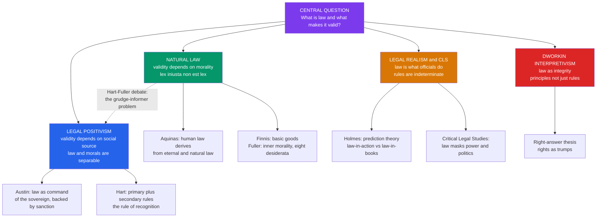

# ⚖️ Philosophy of Law (Jurisprudence)

> [!abstract] TL;DR
> **Jurisprudence** is the philosophical study of law itself — not what the law *says* in this or that statute, but what *law is*, what makes a rule legally **valid**, and how law relates to **morality** and **justice**. The field's spine is a single dispute. **Natural law** holds that law derives its authority from morality and reason: a sufficiently unjust command is not really law at all (*lex iniusta non est lex*). **Legal positivism** holds the opposite — that law's validity comes from its **social source** or **pedigree** (who enacted it, by what recognized procedure), *not* from its merits, so that even a wicked statute can be perfectly valid law. Around this axis orbit **legal realism** ("law is what officials actually do"), **Critical Legal Studies** ("law masks power"), and **Dworkin's interpretivism** ("law as integrity," where principles and the "right answer" bridge the gap). The dispute is not academic: it decides how a court should treat the "grudge informer" who used a monstrous but duly enacted Nazi statute to send a personal enemy to prison.

## Intuition

**Analogy:** Think of two ways to judge whether a **banknote is real money**.

The first inspector — the **positivist** — checks only the *pedigree*: Was this note printed by the recognized central bank, with the right serial number and watermark? If yes, it is legal tender, full stop. Whether the note buys anything worth having, whether the government that issued it is decent or vile, is beside the point. A note is money because of *where it came from*, not because of what it is worth in some deeper moral sense.

The second inspector — the **natural lawyer** — agrees pedigree matters, but adds a floor: a "banknote" from a regime so corrupt that its currency is pure extortion is, past a certain point, **not money but a mugging with paperwork**. Content can be so debased that the official stamp no longer counts. Transposed to law: a rule can be so grossly unjust that, however impeccably it was enacted, it forfeits the *authority* the word "law" is supposed to carry. That single added floor — "and it must not be monstrous" — is the entire fault line of jurisprudence.

---

## How It Works

Jurisprudence organizes itself around four **central questions**, and each major school is essentially a different answer to the second one:

1. **What is law?** A command? A system of rules? A prediction of what judges will do? A practice of interpretation?
2. **What makes a law valid?** Its moral content, or its social source and pedigree?
3. **What is the relationship of law and morality?** Necessary connection, or conceptual separation?
4. **What is justice?** (The bridge to political philosophy — see [[Justice_and_Rawls]].)

### Natural Law — validity flows from morality

The oldest tradition, running from Aristotle and the Stoics through **Thomas Aquinas** (see [[Aquinas_and_Scholasticism]]), holds that there is a higher, rational moral order that human ("positive") law must track to count as genuine law. Aquinas' hierarchy runs **eternal law → natural law → human law**, and human law is "valid only insofar as it derives from natural law" — hence the slogan *lex iniusta non est lex*, "an unjust law is no law at all." The modern revival has two great strands:

- **John Finnis** (*Natural Law and Natural Rights*, 1980) reconstructs natural law without heavy metaphysics: there are **basic goods** (life, knowledge, friendship, play, practical reasonableness) that give law its point, and a bad law is a "watered-down" or defective instance of law, not a paradigm case.
- **Lon Fuller** (*The Morality of Law*, 1964) locates morality *inside* the form of law: to govern by rules at all, a legal system must satisfy **eight desiderata** — generality, publicity, prospectivity (no retroactive laws), clarity, non-contradiction, possibility of compliance, constancy, and congruence between rules and enforcement. This **inner morality of law** means a regime that ignores them (secret, retroactive, contradictory "laws") fails not merely morally but as a *legal system*. This links directly to ethics (see [[What_Is_Ethics]], [[Metaethics]]).

### Legal Positivism — validity flows from social source

Positivism's core is the **separability thesis**: there is no *necessary* connection between law and morality. A rule can be legally valid and morally iniquitous; a rule can be morally excellent and legally void. What makes law valid is its **pedigree** — its origin in a recognized social source.

- **John Austin** (*The Province of Jurisprudence Determined*, 1832) gave the crude but clarifying **command theory**: law is the **command of a sovereign**, backed by the threat of a sanction, habitually obeyed. Its weakness: it looks like "orders backed by threats" — the gunman writ large — and cannot explain power-conferring rules (contract, marriage) or the continuity of legal authority.
- **H. L. A. Hart** (*The Concept of Law*, 1961) rebuilt positivism. Law is the **union of primary and secondary rules**. **Primary rules** impose duties (do not steal). **Secondary rules** are rules *about* rules: **rules of change** (how to enact and repeal), **rules of adjudication** (how to settle disputes), and above all the **rule of recognition** — the ultimate, socially-accepted criterion officials use to identify what counts as valid law in that system. Validity is thus a matter of social fact (what the rule of recognition certifies), not of moral merit.

### Legal Realism and Critical Legal Studies — law as it actually operates

- **Legal Realism** (Oliver Wendell Holmes Jr., Karl Llewellyn, Jerome Frank) shifts from "law in books" to **"law in action."** Holmes' **prediction theory**: "The prophecies of what the courts will do in fact... are what I mean by the law." Rules are **indeterminate** — they under-determine outcomes, so what really decides cases is what judges *do*, shaped by facts, policy, and psychology.
- **Critical Legal Studies (CLS)** pushes indeterminacy further: legal doctrine is not a neutral logic but a **mask for power and politics**, reproducing hierarchies of class, race, and gender behind a rhetoric of neutrality. It draws on critical theory and post-structuralism (see [[Marx_and_Critical_Theory]], [[Poststructuralism_and_Deconstruction]]). Its heirs include **feminist jurisprudence** (law encodes a male standpoint) and **critical race theory**.

### Dworkin's Interpretivism — the third way

**Ronald Dworkin** (*Taking Rights Seriously*, 1977; *Law's Empire*, 1986) rejects *both* camps. Against Hart, he argues law contains not just rules but **principles** (e.g. "no one may profit from his own wrong"), which have moral weight and cannot be captured by a pedigree test. Judges deciding hard cases do not exercise discretion in a legal vacuum; they seek **"law as integrity"** — the interpretation that best fits *and* justifies the community's legal practice, as a chain novelist writes the next chapter of a coherent story. His **"right answer" thesis** claims that even hard cases have a legally correct answer, and **rights function as "trumps"** over collective goals.



---

## Key Concepts

### Secondary level

- **Law vs morality.** Not everything immoral is illegal (lying to a friend), and not everything illegal is immoral (jaywalking on an empty street). Jurisprudence asks how tightly the two must be linked.
- **Validity.** A "valid" law is one the system counts as binding. The core question is *what confers* that binding force — the source that made it, or the justice of what it demands.
- **The slogan.** *Lex iniusta non est lex* — "an unjust law is no law at all." Natural lawyers embrace it; positivists reject it as a confusing way of saying "this is an unjust law that ought not be obeyed."

### Undergraduate level

- **Separability thesis (positivism).** Legal validity and moral merit are conceptually independent. Distinguish **inclusive positivism** (a rule of recognition *may* incorporate moral tests if a system chooses to) from **exclusive positivism** (Joseph Raz: legal validity must rest on social sources alone).
- **The rule of recognition (Hart).** The system's ultimate secondary rule, existing as a **social practice** among officials, that specifies the criteria of legal validity. It is not itself valid or invalid — it simply exists as a fact of official acceptance.
- **The internal point of view (Hart).** Members treat rules as **reason-giving standards** ("I must stop at the red light"), not mere predictions of sanction. This is Hart's decisive answer to Austin's gunman and to the crude realist.
- **The Hart–Fuller debate (1958).** Sparked by the postwar **grudge-informer** cases. Hart: the Nazi statute was *valid law but too iniquitous to obey*; the right cure is a candid **retroactive statute**, not pretending the old law never existed. Fuller: the Nazi "law" so violated the inner morality of law that it was not genuine law at all, so no retroactivity is needed.
- **The Hart–Devlin debate (1960s).** Should the criminal law **enforce morality as such**? Lord **Devlin**: a shared morality is society's cement, so law may punish private immorality that threatens it. **Hart** (with J. S. Mill's harm principle): law should restrain only **harm to others**, not enforce morality for its own sake.

### Graduate level

- **Fuller's eight desiderata as a threshold, not a gradient.** The claim is that a system falling far enough short on *generality, publicity, prospectivity, clarity, non-contradiction, possibility, constancy, congruence* is not a defective legal system but a **non-legal** one — collapsing the fact/value gap positivism insists on.
- **Dworkin's attack on the rule of recognition.** Principles have weight but no pedigree; if judges *must* weigh them in hard cases, then Hart's model of a master pedigree test is incomplete, and law includes moral reasoning constitutively. Hart's *Postscript* (1994) replies that principles can be accommodated within an appropriately capacious rule of recognition.
- **Raz's service conception of authority.** Law claims **legitimate authority**; authority works by giving **content-independent, exclusionary reasons** that pre-empt our own deliberation. This claim, Raz argues, only makes sense if law is identifiable by **source** without moral argument — the strongest case for **exclusive** positivism.
- **Radbruch's formula.** Gustav Radbruch, recanting his prewar positivism after 1945: positive law generally prevails, *but* where a statute's conflict with justice reaches an "intolerable degree," it "must yield to justice" and loses its legal character. A calibrated natural-law threshold — the analytical heart of the Python demo below.
- **Economic and feminist jurisprudence.** **Law and economics** (Posner, Calabresi) treats legal rules as **incentive structures** to be evaluated by efficiency (Bentham's utilitarian positivism modernized — see [[Consequentialism_and_Utilitarianism]]). **Feminist jurisprudence** exposes how ostensibly neutral doctrine (the "reasonable man," contract's autonomous bargainer) encodes gendered assumptions.

---

## Python Demo

We model the natural-law-vs-positivism disagreement geometrically. Score any candidate "law" on two axes: **pedigree** (was it enacted by the recognized social source?) and **moral goodness** (how just is its content?). Positivism classifies validity by **pedigree alone** — a vertical boundary. Natural law, in its Radbruch/threshold form, adds a **moral floor** — grossly unjust rules are not law even if properly enacted. The gap between the two boundaries is exactly the **grudge-informer / Nazi-law** zone.

```python
# Natural law vs legal positivism as two classification boundaries
# in the "validity vs morality" space. numpy + matplotlib only.
import numpy as np
import matplotlib.pyplot as plt

pedigree_min = 0.5   # both theories: must clear the social-source bar to be "law"
moral_floor  = 0.3   # natural law ONLY: content below this is "too unjust to be law"

# Grid over the validity-vs-morality space
n = 400
x = np.linspace(0, 1, n)   # pedigree: enacted by recognized source
y = np.linspace(0, 1, n)   # moral goodness: justice of content
X, Y = np.meshgrid(x, y)

# Positivism: valid iff pedigree clears the bar; morality is irrelevant
positivist_valid = X >= pedigree_min

# Natural law (Radbruch threshold): valid iff pedigree clears the bar
#   AND the content is not grossly unjust ("lex iniusta non est lex")
natural_law_valid = (X >= pedigree_min) & (Y >= moral_floor)

# Disagreement zone: properly enacted BUT grossly unjust
#   -> positivism says VALID, natural law says NOT LAW (the grudge informer)
disagreement = positivist_valid & ~natural_law_valid

fig, axes = plt.subplots(1, 2, figsize=(13, 5.5), sharex=True, sharey=True)

# ---- Left panel: the two boundaries and the disagreement zone ----
ax = axes[0]
ax.imshow(natural_law_valid, extent=[0, 1, 0, 1], origin="lower",
          cmap="Greens", alpha=0.35, aspect="auto")
ax.imshow(disagreement, extent=[0, 1, 0, 1], origin="lower",
          cmap="Reds", alpha=0.45, aspect="auto")
ax.axvline(pedigree_min, color="navy", lw=2, ls="--",
           label="Positivist boundary: pedigree bar")
ax.plot([pedigree_min, 1], [moral_floor, moral_floor], color="darkgreen",
        lw=2, label="Natural-law moral floor")
ax.text(0.75, 0.14, "GRUDGE-INFORMER ZONE\nvalid for positivism,\nNOT law for natural law",
        ha="center", va="center", fontsize=9, color="darkred", weight="bold")
ax.text(0.75, 0.66, "valid for BOTH", ha="center", va="center",
        fontsize=10, color="darkgreen", weight="bold")
ax.text(0.22, 0.5, "not law for either\n(fails pedigree)",
        ha="center", va="center", fontsize=9, color="gray")
ax.set_title("Two theories carve the same space differently")
ax.set_xlabel("Pedigree  (enacted by recognized source)")
ax.set_ylabel("Moral goodness  (justice of content)")
ax.legend(loc="lower left", fontsize=8)

# ---- Right panel: concrete example laws as points ----
ax = axes[1]
laws = {
    "Traffic code\n(just, enacted)":         (0.90, 0.85),
    "Higher tax rate\n(mildly disliked)":    (0.85, 0.50),
    "Nazi denunciation\nstatute (grudge)":   (0.92, 0.05),
    "MLK moral appeal\n(unenacted ideal)":   (0.20, 0.92),
}
for label, (px, py) in laws.items():
    if px >= pedigree_min and py >= moral_floor:
        color = "green"
    elif px >= pedigree_min:
        color = "red"
    else:
        color = "gray"
    ax.scatter(px, py, s=150, color=color, edgecolor="black", zorder=3)
    ax.annotate(label, (px, py), textcoords="offset points",
                xytext=(8, 8), fontsize=8)
ax.axvline(pedigree_min, color="navy", lw=2, ls="--")
ax.plot([pedigree_min, 1], [moral_floor, moral_floor], color="darkgreen", lw=2)
ax.set_title("Where real laws fall")
ax.set_xlabel("Pedigree  (enacted by recognized source)")

for a in axes:
    a.set_xlim(0, 1)
    a.set_ylim(0, 1)
plt.tight_layout()
plt.savefig("jurisprudence_validity.png", dpi=120)
plt.show()

# Print each verdict so the disagreement is explicit
print("Law".ljust(30), "Positivism".ljust(12), "Natural law")
for label, (px, py) in laws.items():
    pos = "VALID" if px >= pedigree_min else "not law"
    nat = "VALID" if (px >= pedigree_min and py >= moral_floor) else "not law"
    print(label.replace(chr(10), " ").ljust(30), pos.ljust(12), nat)
```

The printout makes the single point of the whole field concrete: the **Nazi denunciation statute** clears the pedigree bar, so **positivism calls it VALID**, while it sits below the moral floor, so **natural law calls it "not law."** Every other example is classified identically by both theories — the theories only diverge in that one red wedge, which is precisely why the grudge-informer case became jurisprudence's defining test.

---

## Real-World Applications

- **The grudge-informer cases (postwar Germany).** A woman denounced her husband under a 1934 Nazi statute for privately insulting Hitler; he was sentenced to death (later sent to the front). After 1945 she was prosecuted. **If the Nazi statute was valid law** (positivism), she broke no law by using it, so convicting her needs an honest **retroactive statute**. **If it was too unjust to be law** (natural law / Radbruch), she illegally deprived him of liberty under a mere pretense of law. Courts effectively adopted the Radbruch formula.
- **Nuremberg trials.** Defendants pleaded they had followed valid German law. The tribunal invoked a **higher law** — crimes against humanity binding regardless of domestic enactment — a natural-law move at the birth of modern international human rights.
- **Constitutional adjudication.** Dworkin's interpretivism describes how supreme courts decide **hard cases** by reading open-textured clauses ("due process," "equal protection," "cruel and unusual") as **principles** to be given their morally best coherent reading — not by looking up a pedigree.
- **Civil disobedience.** Martin Luther King Jr.'s *Letter from Birmingham Jail* quotes Aquinas directly — "an unjust law is no law at all" — to justify disobeying segregation statutes while accepting the penalty. Natural-law reasoning in political practice.
- **Law and economics in regulation.** Courts and agencies routinely evaluate rules by their **incentive effects and efficiency** (tort liability rules, antitrust), the operational face of economic jurisprudence.

---

## Common Pitfalls

- **Reading positivism as "law should be obeyed."** Positivism is a thesis about what *makes law valid* (its source), **not** a claim that valid law must be obeyed. Hart insisted the separation of law and morals is what *lets* us say "this is law, and it is too evil to follow." Positivism is not "might makes right."
- **Reading natural law as "all immoral laws are void."** Serious natural lawyers do not say *any* moral defect voids a law. Aquinas held unjust laws still bind in conscience where disobedience causes greater disorder; Radbruch voids only law of *intolerable* injustice. The moral floor is low, not a demand for perfect justice.
- **Confusing "is the law" with "is good law."** The realist prediction theory answers "what will the court do?"; it is a poor answer to "what *ought* the court do?" Collapsing the descriptive and the normative is the standard realist trap.
- **Treating indeterminacy as total.** From "rules are sometimes indeterminate" (true) CLS sometimes slides to "law is wholly indeterminate and just politics" (overreach). Hart's "core vs penumbra" shows most cases have settled cores; only the penumbra is genuinely open.
- **Mixing up the two Hart debates.** **Hart–Fuller** is about the *concept of law* (was the Nazi statute law?). **Hart–Devlin** is about the *proper reach of law* (may law enforce private morality?). Different questions, different opponents.
- **Thinking Dworkin is a natural lawyer.** He denies the separability thesis, but he is an **interpretivist**, not a natural lawyer: law's morality is the morality *internal to a community's own legal practice*, not a timeless higher law.

---

## Related Concepts

- [[Aquinas_and_Scholasticism]] — the classical fountainhead of natural law: the eternal → natural → human law hierarchy and *lex iniusta non est lex*.
- [[Justice_and_Rawls]] — jurisprudence's fourth central question ("what is justice?"); Rawls supplies the theory of justice that a just legal order aims to realize.
- [[Liberty_and_Rights]] — the harm principle underlying the Hart–Devlin debate, and Dworkin's "rights as trumps."
- [[The_State_and_Political_Authority]] — why (and whether) law's commands are *authoritative*; Raz's service conception of authority lives here.
- [[Metaethics]] — whether there are objective moral truths for natural law to rest on; the is/ought gap positivism polices.
- [[What_Is_Ethics]] — the law-and-morality relationship at the heart of the natural-law/positivism split.
- [[Deontology_and_Kantian_Ethics]] — the duty- and rights-based moral framework behind rights-as-trumps.
- [[Consequentialism_and_Utilitarianism]] — Bentham's and Austin's utilitarianism, the root of both classical positivism and law-and-economics.
- [[Marx_and_Critical_Theory]] — the intellectual lineage of Critical Legal Studies' claim that law masks power.
- [[Poststructuralism_and_Deconstruction]] — the indeterminacy and critique-of-neutrality tools CLS imports into legal theory.

---

## Review Questions

1. **(Conceptual)** State the **separability thesis** and explain how Hart's distinction between *primary and secondary rules* and the *rule of recognition* answers Austin's "gunman" objection while preserving positivism. Why does Hart say the *internal point of view* is essential?
2. **(Scenario)** A duly enacted statute in a repressive regime is used by an informer to have a personal enemy imprisoned. After the regime falls, the informer is prosecuted. Analyze the case as (a) Hart, (b) Fuller, and (c) via Radbruch's formula would. Which analysis best fits the "grudge-informer zone" in the demo, and what does each imply about using retroactive law?
3. **(Trade-off)** Dworkin claims hard cases have a **"right answer"** reachable through *law as integrity*, denying judicial discretion; Hart's *Postscript* insists judges legislate interstitially in the penumbra. What does each view gain and lose regarding **legitimacy, predictability, and candor** in adjudication?

---

## Sources

- Hart, H. L. A. (1961/1994). *The Concept of Law* (2nd ed., with Postscript). Oxford University Press.
- Fuller, Lon L. (1964). *The Morality of Law*. Yale University Press.
- Dworkin, Ronald (1986). *Law's Empire*. Harvard University Press.
- Finnis, John (1980/2011). *Natural Law and Natural Rights* (2nd ed.). Oxford University Press.
- Hart, H. L. A. & Fuller, Lon L. (1958). "Positivism and the Separation of Law and Morals" / "Positivism and Fidelity to Law," *Harvard Law Review* 71.

---

#law #jurisprudence #natural-law #legal-positivism #philosophy-of-law
