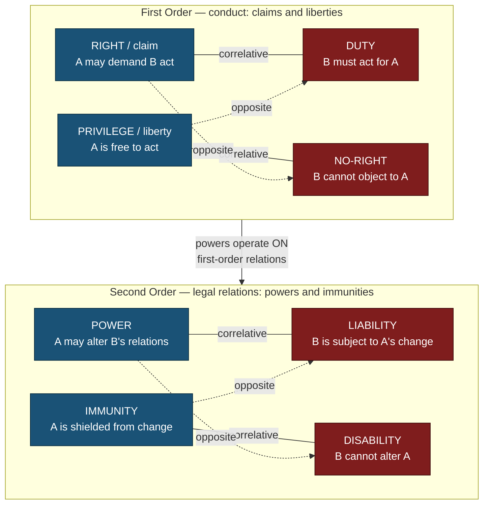

# ⚖️ Rights, Duties, and Legal Concepts

> [!abstract] TL;DR
> "A right" is one of the most overworked words in law, and Wesley **Hohfeld** (1913, 1917) showed that it secretly names *four distinct legal relations* — a **claim-right** (correlated to a duty), a **privilege/liberty** (correlated to a no-right), a **power** (correlated to a liability), and an **immunity** (correlated to a disability). Every jural relation is a two-person affair viewed from opposite ends: your claim-right *just is* another's duty. Around this analytical spine sit the other building-blocks of legal reasoning — the will (choice) vs. interest (benefit) theories of what a right is *for*; the distinctions between legal, moral, and human rights; rights *in rem* vs. *in personam*; **legal personality** (natural vs. juristic persons, and the contested frontier of rivers, animals, and AI); the layered concepts of ownership, possession, title, and interest; **legal fictions**; and the objective yardstick of the **reasonable person**. Master this vocabulary and most legal disputes resolve into a precise question about *which* relation, between *whom*, is at stake.

---

## Intuition

**Analogy — the rope and the overloaded word.**

Picture a taut rope tied between two people. If you are holding one end and calling it "my right," then someone, somewhere, must be holding the other end — and that end is labelled "duty." You cannot buy, sell, or wave your end of the rope while pretending the far end does not exist. This is Hohfeld's core insight: a legal relation is *correlative*. Every advantage one person holds is, seen from the other side, a burden on someone specific. Talk of "a right" that floats free of any correlative person is, in Hohfeld's diagnosis, muddled thinking.

Now the second half of the intuition. The English word "right" is like the word "bank" — one label stretched over several unrelated things. When a landlord says "I have a *right* to be paid rent," a hiker says "I have a *right* to walk this public path," a shop owner says "I have the *right* to raise my prices," and a diplomat says "I have a *right* not to be taxed," they are using one word for *four different ropes*. The first is a **claim** on another's conduct; the second is a **liberty** to act; the third is a **power** to change legal positions; the fourth is an **immunity** against being changed. Sorting a dispute into the correct one of these four is often 90% of the legal analysis — and confusing them is how bad arguments hide.

---

## How It Works

### The correlativity engine

Start from one commitment: **there are no one-ended legal relations.** Whenever the law recognises that A holds some legal advantage, it simultaneously imposes a correlated position on some determinate B. Hohfeld makes this precise with two orthogonal operations on the eight fundamental conceptions:

- **Correlative** — the *same* relation seen from the other party's side. A's claim-right that B pay £100 is numerically identical to B's duty to pay A £100. They are two descriptions of one thing.
- **Opposite** — the *negation* of a position for the *same* party. If A has a privilege to enter the land, A does *not* have a duty to stay off it; privilege and duty are jural opposites for A.

These generate two "squares." The **first-order** square concerns *conduct* (what one may or must physically do): **right, duty, privilege, no-right**. The **second-order** square concerns *legal power over relations themselves* (the capacity to create, alter, or extinguish first-order positions): **power, liability, immunity, disability**. A contract offer is a power; being bound when the offer is accepted is a liability; a diplomat's tax exemption is an immunity; the taxman's inability to tax him is a disability.

### Reading each of the four "rights"

1. **Claim-right ↔ Duty.** A right *in the strict sense*: A can demand that B do (or refrain from) something, and B is under a correlative duty. "You owe me the money"; "you must not hit me."
2. **Privilege / Liberty ↔ No-right.** A is *free* to act because A is under *no duty* not to. The correlative is that B has *no right* that A refrain. Two people racing for the same £20 note on the pavement each have a privilege to grab it and neither has a claim against the other. A privilege is a *permission*, not a *protected* zone — it does not, by itself, stop others competing.
3. **Power ↔ Liability.** A can *change* legal relations — accept an offer, make a will, transfer title, sue, marry. The person whose position will change is under a *liability* (here a neutral term: merely "subject to change," not "at fault").
4. **Immunity ↔ Disability.** A is *protected* from having a particular relation changed by B, because B lacks the relevant power (a *disability*). Constitutional rights often work as immunities: the legislature is *disabled* from abridging them.

### Flow / Architecture — Hohfeld's scheme of jural relations



*Solid lines are correlatives (the two ends of one relation); dashed lines are jural opposites (a position and its negation for the same person). Blue nodes are advantages; red nodes are the correlative burdens.*

---

## Key Concepts

### Secondary Level

**A right implies a duty-bearer.** The first thing to learn is that rights-talk always has a hidden second person. "I have a right to X" is incomplete until you can answer *against whom, to do what?* Your right to be repaid is a duty on your borrower; your right to free speech is (chiefly) a duty on the *state* not to censor you. If no one bears a correlated duty, you may have a *hope* or a *value*, but not yet a legal right.

**Claim-rights vs. liberties.** A **claim-right** is a shield backed by someone else's obligation (a right *that others do something*). A **liberty** (or privilege) is merely an absence of your own obligation not to act (a right *to do something*). The classic contrast: you have a *liberty* to look at your neighbour's garden, but no *claim* that they keep it beautiful; they may build a wall and block your view, and you have no remedy, because a bare liberty is unprotected.

**Legal vs. moral vs. human rights.** A **legal right** exists because positive law creates and enforces it (the right to vote at 18). A **moral right** is a justified claim grounded in ethics, which may or may not be legally recognised (a promise creates a moral right even with no contract). **Human rights** are moral rights claimed to belong to every person simply as a human, increasingly hardened into legal instruments — see [[Human_Rights_and_International_Law]]. The three can diverge: an unjust law may grant a legal right that no moral right supports, and a moral right (to asylum, say) may lack legal teeth.

**Duty, obligation, and liability.** A **duty** is what you must do or refrain from; an **obligation** is often used interchangeably but tends to name duties arising from a specific transaction (a contract, a debt). **Liability** in Hohfeld's technical sense simply means "susceptible to a change in one's legal position" — but in everyday legal usage it also means "answerable for a wrong" (tort/criminal liability). Keep the two senses apart.

**Natural persons vs. legal (juristic) persons.** The law treats a **natural person** (a human being) and a **juristic person** (a corporation, a state, a university) as *both* being "persons" capable of holding rights and owing duties. A company can own property, sue, be sued, and be taxed — without being a human at all. Personhood, legally, is a *status the law confers*, not a biological fact.

### Undergraduate Level

**The full Hohfeldian table.** Hohfeld's *Fundamental Legal Conceptions* (Yale Law Journal, 1913 and 1917) arranges the eight conceptions into correlatives and opposites:

| First-order (conduct) | Correlative | Opposite (of the left term) |
|---|---|---|
| **Right / claim** | Duty | No-right |
| **Privilege / liberty** | No-right | Duty |
| **Power** | Liability | Disability |
| **Immunity** | Disability | Liability |

Reading the table: the correlative is *your counterpart's* position; the opposite is *your own* position negated. If A has a *power*, B has a *liability* (correlative), and A does *not* have a *disability* (opposite).

**Will/choice theory vs. interest/benefit theory.** What is a right *for*?
- **Will (choice) theory** — H.L.A. Hart: a right makes the right-holder a "small-scale sovereign" over another's duty. To have a right is to have the *choice* to demand performance or waive it, to sue or forgive. Rights are essentially about *control*. Weakness: it struggles with inalienable rights (you cannot waive your right not to be enslaved) and rights of those who cannot choose (infants, the comatose, animals).
- **Interest (benefit) theory** — Bentham, later Joseph Raz and Neil MacCormick: X has a right when protecting some *interest* of X is a sufficient reason to hold others under a duty. Rights are about *well-being*, not control. It comfortably handles children's rights and third-party beneficiaries, but is charged with over-generating rights (every benefit becomes a right) and with mislabeling incidental beneficiaries as right-holders.

**Positive vs. negative rights.** A **negative right** imposes a duty of *forbearance* — a right against interference (do not kill me, do not censor me). A **positive right** imposes a duty of *provision* — a right that someone supply a good (healthcare, education, counsel). Negative rights are cheap and universalisable; positive rights require resources and a determinate provider, which is why they are politically contested (see [[Liberty_and_Rights]] and [[Equality_Marxism_and_Anarchism]]).

**Rights *in rem* vs. *in personam*.** A right **in personam** avails against a *specific person* — your contractual right binds only the party who promised. A right **in rem** avails against *the world at large* — your ownership of a bicycle is a right that *everyone* refrain from taking it. Hohfeld reframed the *in rem* right not as a relation "to a thing" but as a huge bundle of identical claims against every other person (a "multital" right), versus the single "paucital" claim of an *in personam* right. This is why property duties bind strangers who never agreed to anything, whereas contract duties bind only the counterparty.

**Ownership, possession, title, and interest.**
- **Possession** is *factual control* plus an intention to exclude others — the person holding the phone. Possession is protected even against the true owner in some cases (a thief has better possession than a later thief).
- **Ownership** is the *greatest bundle of rights* the law allows over a thing — the residual, most complete title, including the right to use, exclude, transfer, and destroy.
- **Title** is the *evidence and quality of one's claim* — how good your right is *relative* to competing claimants. Title is relative, not absolute: English law asks not "who owns it in the cosmos?" but "who has the better right as between these two parties?"
- **Interest** is a *stake* in the thing that need not be full ownership — a lease, an easement, a mortgage, a life estate. Property is thus a *bundle of sticks*: different persons can simultaneously hold different interests in one asset.

**The reasonable person.** Much of tort and criminal law measures conduct against an *objective* standard: what would the hypothetical **reasonable person** (historically the "man on the Clapham omnibus") have foreseen or done? It deliberately ignores the defendant's personal shortcomings (nervousness, inexperience) to set a public, predictable benchmark of care. It is a **legal fiction** in the service of fairness and administrability.

### Graduate Level

**Molecular vs. atomic rights.** Hohfeld's eight positions are the *atoms* of legal analysis. Real-world "rights" — ownership, citizenship, bodily integrity — are *molecules*: complex bundles containing many claims, liberties, powers, and immunities at once. Ownership of land, for instance, includes claim-rights against trespass, liberties to use, powers to sell or lease, and immunities against uncompensated seizure. This is why "the right to property" cannot be analysed as a single relation; A. M. Honoré's "incidents of ownership" (1961) enumerate eleven such standard sticks. Hohfeld's contribution is to give us a *periodic table* so we can say exactly which atoms a given right contains.

**The frontier of legal personhood.** Because personhood is *conferred*, its boundary is contested and moving:
- **Corporations** were recognised as persons for many constitutional purposes in the US via *Santa Clara County v. Southern Pacific Railroad* (1886, headnote) and, controversially, extended to political-speech rights in *Citizens United v. FEC* (2010).
- **Rivers and ecosystems** have been granted legal personality: New Zealand's **Whanganui River** (Te Awa Tupua Act, 2017) and India's Ganges and Yamuna (Uttarakhand High Court, 2017, later stayed) can, through guardians, hold rights and be represented in court.
- **Animals** remain, in most systems, *property* rather than persons, though the Nonhuman Rights Project has litigated (largely unsuccessfully) for habeas corpus for chimpanzees and elephants; some jurisdictions grant "sentient being" status short of personhood.
- **AI systems** currently hold *no* legal personhood; debates about "electronic personhood" (raised in a 2017 European Parliament resolution) concern who bears **liability** and can hold rights when an autonomous system acts. Hohfeld helps here: the real question is not "is the AI a person?" but "which claims, powers, and liabilities should attach to whom in the relation?"

**Capacity.** Legal capacity is the *ability to bear rights and duties and to exercise powers*. It is graduated, not binary: minors, persons lacking mental capacity, and intoxicated persons have limited capacity to contract, consent, or be held criminally responsible. Capacity determines whether one's *powers* (to marry, to make a will, to consent to treatment) are effective — a Hohfeldian point, since an incapacitated person may hold claim-rights while lacking the power to alter them.

**Liability vs. responsibility.** H.L.A. Hart (*Punishment and Responsibility*, 1968) untangled several senses of "responsibility": *role* responsibility (duties of an office), *causal* responsibility (X's act caused the harm), *capacity* responsibility (X could understand and control conduct), and *liability* responsibility (X is legally answerable and may be sanctioned). One can be causally responsible without being liable (an insane actor), and liable without being causally at fault (vicarious or strict liability). Precision here is the difference between blame and mere causation.

**Legal fictions.** A **legal fiction** is a proposition the law treats as true although it is known to be false, in order to reach a desired result — a corporation is a "person," an adopted child is "born to" the adopters, a ship can be a "defendant" *in rem*. Jeremy Bentham denounced fictions as pernicious mystification; Lon Fuller (*Legal Fictions*, 1930) defended them as an indispensable *heuristic* by which law extends old categories to new facts before honest doctrine catches up. Fictions are how the analytical vocabulary *stretches*.

**Critiques and afterlife of Hohfeld.** Hohfeld's scheme is descriptively powerful but *value-neutral*: it tells you the *shape* of a legal relation, not whether it is *justified*. Critical legal scholars (e.g., Duncan Kennedy) used Hohfeld to show that every entitlement is a *choice* to burden someone else — property is coercion by another name — thereby denaturalising "rights." Meanwhile the will/interest debate continues: Matthew Kramer, Nigel Simmonds, and Hillel Steiner's *A Debate Over Rights* (1998) is the modern locus. The enduring lesson is methodological: before arguing about a right, decompose it into Hohfeldian atoms and name the parties.

---

## Python Demo

```python
# Visualise Hohfeld's scheme of fundamental jural relations as a 2 x 4 grid.
# Row 0 = the ADVANTAGE a person A holds; Row 1 = the correlative BURDEN on B.
# Columns 0-1 form the first-order square (conduct: claims and liberties);
# columns 2-3 form the second-order square (powers over legal relations).
# Solid vertical lines  = CORRELATIVES (two ends of ONE relation).
# Dashed diagonal lines = OPPOSITES  (a position and its negation for the SAME person).
import numpy as np
import matplotlib.pyplot as plt
from matplotlib.patches import FancyBboxPatch

# --- 1. The eight fundamental conceptions as a 2 x 4 array -------------------
advantages = ["RIGHT",   "PRIVILEGE", "POWER",     "IMMUNITY"]    # row 0
burdens    = ["DUTY",    "NO-RIGHT",  "LIABILITY", "DISABILITY"]  # row 1
grid = np.array([advantages, burdens])

# Correlatives: same relation, opposite party  -> VERTICAL pairs (one per column)
correlatives = list(zip(advantages, burdens))

# Opposites: negation of a position for the SAME party -> DIAGONALS within a square
#   Square A (cols 0,1): RIGHT<->NO-RIGHT , PRIVILEGE<->DUTY
#   Square B (cols 2,3): POWER<->DISABILITY , IMMUNITY<->LIABILITY
opposites = [("RIGHT", "NO-RIGHT"), ("PRIVILEGE", "DUTY"),
             ("POWER", "DISABILITY"), ("IMMUNITY", "LIABILITY")]

# --- 2. Coordinate lookup ----------------------------------------------------
col = {name: c for r in range(2) for c, name in enumerate(grid[r])}
row = {name: r for r in range(2) for name in grid[r]}
def xy(name):
    return col[name] * 3.0, (2.0 if row[name] == 0 else 0.0)

# --- 3. Print the relational matrix ------------------------------------------
print("HOHFELD'S 2 x 4 SCHEME OF JURAL RELATIONS")
print("=" * 58)
print(f"{'ADVANTAGE (A holds)':<22}{'CORRELATIVE (B bears)':<22}")
print("-" * 58)
for a, b in correlatives:
    print(f"{a:<22}{b:<22}")
print("\nJural OPPOSITES (same person, negated position):")
for a, b in opposites:
    print(f"  {a:<12} is the opposite of  {b}")

# --- 4. Draw the diagram -----------------------------------------------------
fig, ax = plt.subplots(figsize=(11, 4.5))
colours = {0: "#1a5276", 1: "#7f1d1d"}   # advantages blue, burdens red

for name in col:
    x, y = xy(name)
    ax.add_patch(FancyBboxPatch((x - 1.15, y - 0.5), 2.3, 1.0,
                 boxstyle="round,pad=0.02", fc=colours[row[name]], ec="black"))
    ax.text(x, y, name, ha="center", va="center", color="white",
            fontsize=11, fontweight="bold")

for a, b in correlatives:                 # solid vertical = correlative
    (x1, y1), (x2, y2) = xy(a), xy(b)
    ax.plot([x1, x2], [y1 - 0.5, y2 + 0.5], "k-", lw=2)
    ax.text(x1 + 0.15, 1.0, "correlative", rotation=90,
            va="center", fontsize=8, color="black")

for a, b in opposites:                    # dashed diagonal = opposite
    (x1, y1), (x2, y2) = xy(a), xy(b)
    ax.plot([x1, x2], [y1, y2], "--", color="#555555", lw=1.3)

ax.axvline(4.5, color="#aaaaaa", ls=":", lw=1)
ax.text(1.5, 3.05, "FIRST ORDER  (conduct)", ha="center", fontsize=10, fontweight="bold")
ax.text(7.5, 3.05, "SECOND ORDER  (power over relations)", ha="center",
        fontsize=10, fontweight="bold")
ax.text(5.7, -1.15, "solid = correlative   |   dashed = opposite",
        ha="center", fontsize=9, style="italic")

ax.set_xlim(-1.8, 10.8); ax.set_ylim(-1.4, 3.4); ax.axis("off")
ax.set_title("Every 'right' is really one of four relations, each with a correlative",
             fontsize=12)
plt.tight_layout()
plt.savefig("hohfeld_jural_relations.png", dpi=150)
print("\nSaved figure -> hohfeld_jural_relations.png")
```

**What this shows:** the eight conceptions form a 2 x 4 grid whose *columns* are correlative pairs (the two ends of one relation — a right *is* a duty seen from the other side) and whose *diagonals within each square* are jural opposites (a right is the opposite of a no-right for the same person). The single English word "right" spans the entire top row; the demo makes visible that it is not one thing but four, and that none of them can exist without its correlative burden falling on a determinate other party.

---

## Real-World Applications

**Contract formation as powers and liabilities.** An offer is not a claim-right — it is a **power**. When A offers to sell a car, A confers on B the power to bind A by acceptance; correlatively A is under a **liability** (subject to being bound). Only *after* acceptance do first-order claim-rights and duties (pay the price, deliver the car) crystallise. Courts implicitly reason in these terms when they ask whether an offer was still "open" (power alive) or revoked (power extinguished).

**Constitutional rights as immunities.** The US Bill of Rights and comparable charters mainly operate as **immunities**: "Congress shall make no law..." *disables* the legislature from altering the citizen's position. This is why constitutional rights bind *government* rather than private parties — the correlative disability falls on the state. Understanding a free-speech guarantee as an immunity (a limit on power) rather than a claim-right (a demand for provision) explains why it does not, by itself, oblige anyone to give you a platform.

**Property disputes and relative title.** In land and goods litigation, courts rarely determine ownership "against the world"; they ask who, *as between the two litigants*, has the better right — the doctrine of relative title. A finder of a lost ring has a possessory title good against everyone except the true owner, which is exactly why *Armory v. Delamirie* (1722) let a chimney-sweep's boy recover against a jeweller who kept the jewel he had found.

**Corporate and environmental personhood in practice.** Treating a corporation as a juristic person lets thousands of shareholders act through one entity, own assets, and limit their liability — the engine of modern capitalism. Extending personhood to the **Whanganui River** gave Māori guardians standing to sue polluters *on the river's own behalf*, converting a diffuse environmental interest into an enforceable set of Hohfeldian claims — a live experiment in who can hold rights.

**Autonomous systems and the liability gap.** When a self-driving car or trading algorithm causes harm, the analytically sharp question is not "is the AI a person?" but "on whom does the *duty* and *liability* fall — manufacturer, operator, owner, or programmer?" Regulators drafting AI-liability regimes are, whether they say so or not, allocating Hohfeldian positions among humans, because the machine holds none.

---

## Common Pitfalls

- **Treating "a right" as one thing.** The single biggest error. A litigant claims "a right" to do X; the opponent hears "a claim that others assist X." Always ask: claim, liberty, power, or immunity? Most rights-talk conflates a bare *liberty* (no duty on me) with a protected *claim* (a duty on you) — the "liberty is not a claim" confusion that Hohfeld wrote to dispel.
- **Forgetting the correlative party.** Asserting a right without naming the duty-bearer produces rhetoric, not law. "I have a right to a job" is empty until you specify *who* has the correlative duty to employ you and *why*.
- **Reading "liability" as fault.** In Hohfeld's technical vocabulary, a liability is merely *susceptibility to a change of position* — a beneficiary under a will has a "liability" to have the gift revoked. Confusing this with tort/criminal liability (blame) muddles analysis.
- **Confusing *in rem* with "a right in a thing."** *In rem* does not mean the relation is with an object; it means the claim runs against *indefinitely many persons*. Property is people-to-people, not people-to-thing — misunderstanding this makes the duties of strangers inexplicable.
- **Collapsing possession into ownership.** Possession is factual control; ownership is the best right. A bailee, tenant, or even a thief possesses without owning, and possession alone can ground remedies. Assuming "whoever holds it owns it" is wrong and dangerous.
- **Assuming personhood tracks humanity.** Corporations, states, and (increasingly) rivers are persons; embryos, animals, and AI generally are not. Personhood is a status the law *grants* for practical purposes; arguing from "it is/is not human" skips the actual legal question.
- **Mistaking moral for legal rights (and back).** A strong moral claim is not automatically enforceable, and a legal right is not automatically just. Keep the normative and the positive registers distinct, especially in human-rights arguments.

---

## Related Concepts

- [[Liberty_and_Rights]] — Berlin's negative vs. positive liberty and the natural-vs-legal-rights distinction; Hohfeld's four positions are the fine-grained analytic beneath that debate, and his *privilege* is the jural form of Berlin's negative liberty.
- [[The_Social_Contract]] — where natural rights are said to originate and what "rights" the state is instituted to secure; supplies the normative backdrop that Hohfeld's value-neutral scheme deliberately brackets.
- [[Human_Rights_and_International_Law]] — human rights as the moral-rights family translated into binding legal claims, duties, and immunities; the generational (negative/positive) split maps onto Hohfeldian claim-rights vs. positive provision duties.
- [[Deontology_and_Kantian_Ethics]] — the moral foundation of duties and of rights as "trumps"; the will theory's picture of the right-holder as a sovereign echoes Kantian autonomy.
- [[Consequentialism_and_Utilitarianism]] — Bentham's utilitarian roots of the *interest/benefit* theory of rights (and his dismissal of natural rights as "nonsense upon stilts") and his hostility to legal fictions.

---

## Review Questions

### Secondary
1. Explain, using the rope analogy, why "I have a right" is an incomplete statement in law. What extra information must always be supplied?
2. Distinguish a *claim-right* from a *liberty/privilege* with one everyday example of each. Why can a bare liberty leave you without a remedy when someone frustrates it?
3. What is the difference between a *natural person* and a *juristic person*? Give two things a corporation can legally do that show it is treated as a person.

### Undergraduate
1. Set out Hohfeld's eight fundamental conceptions and organise them into correlatives and opposites. Then classify each of the following: (a) a landlord's entitlement to rent; (b) a hiker's use of a public footpath; (c) a shopkeeper's decision to change prices; (d) a diplomat's tax exemption.
2. Compare the *will/choice* and *interest/benefit* theories of rights. Which better explains the rights of infants and the inalienability of the right not to be enslaved, and what does the losing theory say in its own defence?
3. Explain the difference between rights *in rem* and *in personam* using Hohfeld's reframing (multital vs. paucital claims). Why does this distinction explain why a stranger who never signed anything can still owe you a duty not to steal your bicycle?

### Graduate
1. "Ownership is a molecule, not an atom." Using Honoré's incidents and Hohfeld's periodic table, decompose the "right to property" and show how the same asset can carry different interests held by different persons simultaneously. What does this decomposition reveal about disputes over regulatory takings?
2. The frontier of legal personhood now includes rivers and excludes AI. Argue whether Hohfeld's apparatus makes the question "should an AI be a legal person?" the *wrong* question, and reformulate it as a problem of allocating specific jural positions among human parties.
3. Critical legal scholars used Hohfeld to argue that every property right is a state-backed imposition on others — that "rights" naturalise coercion. Assess this claim. Does Hohfeld's value-neutrality make his scheme a tool of critique, of legitimation, or of neither?

---

## Sources

- [Hohfeld, W. N., "Some Fundamental Legal Conceptions as Applied in Judicial Reasoning," *Yale Law Journal* 23(1), 1913](https://www.jstor.org/stable/785533)
- [Hohfeld, W. N., "Fundamental Legal Conceptions as Applied in Judicial Reasoning," *Yale Law Journal* 26(8), 1917](https://www.jstor.org/stable/786270)
- [Hart, H. L. A., *Essays on Bentham: Studies in Jurisprudence and Political Theory*, Oxford University Press, 1982 (Ch. 7, "Legal Rights")](https://global.oup.com/academic/product/essays-on-bentham-9780198254683)
- [Kramer, M. H., Simmonds, N. E., and Steiner, H., *A Debate Over Rights: Philosophical Enquiries*, Oxford University Press, 1998](https://global.oup.com/academic/product/a-debate-over-rights-9780198298984)
- [Wenar, L., "Rights," *Stanford Encyclopedia of Philosophy* (2005, rev. 2023)](https://plato.stanford.edu/entries/rights/)
- [Honoré, A. M., "Ownership," in A. G. Guest (ed.), *Oxford Essays in Jurisprudence*, Oxford University Press, 1961](https://oxford.universitypressscholarship.com/)

---

#law #rights #duties #hohfeld #legal-concepts
