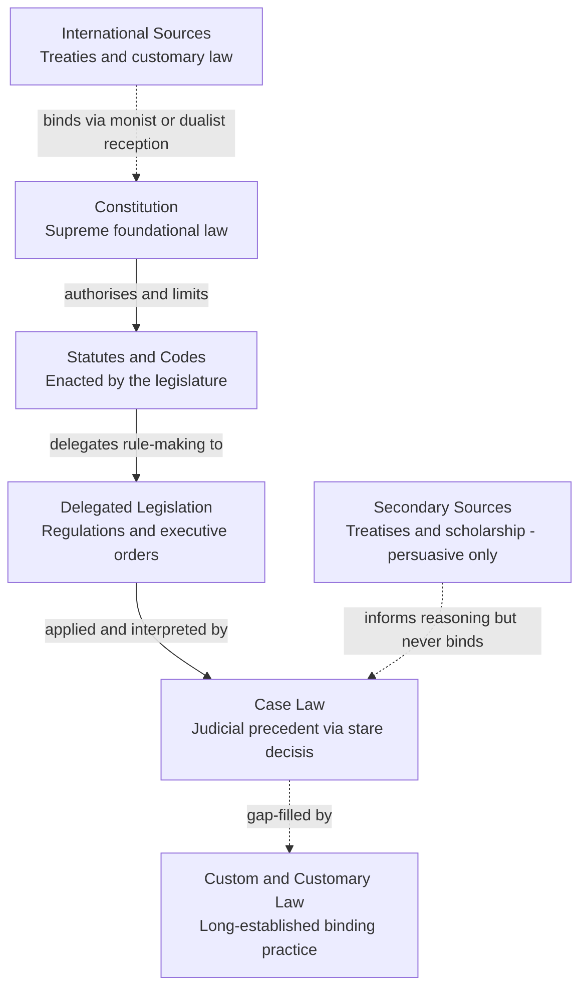

# ⚖️ Sources of Law

> [!abstract] TL;DR
> The "sources of law" are the places a legal system draws its binding rules from — constitutions, legislation, delegated regulations, judicial precedent, custom, and international instruments — arranged in a hierarchy where a higher source overrides a lower one. Understanding that hierarchy, and the three tie-breaking maxims used when rules collide (*lex superior*, *lex posterior*, *lex specialis*), is the master key to predicting which rule a court will actually apply.

---

## Intuition

**Analogy:** Think of a company's rulebook. There is the **charter or articles of incorporation** that created the company and that no memo can contradict; there are **formal board resolutions** that carry the charter's authority; there are **departmental policies** written by managers under powers the board delegated to them; there are **precedents** — "last time this happened, we handled it this way"; and there is **office custom** — "we've always done it like this." If a departmental policy contradicts a board resolution, the resolution wins, because it sits higher in the chain of authority. If two policies of equal rank clash, you ask which is newer or which is more specific to the situation.

A legal system works the same way. Every rule has a **pedigree** — where it came from determines how much force it carries. A regulation that contradicts a statute is void; a statute that contradicts the constitution is struck down. "Sources of law" is simply the doctrine of that pedigree: *what counts as law, and whose word wins when two rules disagree.*

---

## How It Works

### Core Mechanics

A **source of law** is anything a court will recognise as generating a binding legal rule. Lawyers divide them along two axes.

**Primary vs secondary.** *Primary sources* are the law itself — constitutions, statutes, regulations, cases, custom, treaties. *Secondary sources* — treatises, law-review articles, encyclopedias, and the American Law Institute's *Restatements* — merely describe and organise the law. Secondary sources are never binding; at most they are **persuasive**, cited because a judge finds the reasoning convincing, not because they command obedience.

**Binding vs persuasive authority.** *Binding* (mandatory) authority *must* be followed: a lower court is bound by the constitution, by applicable statutes, and by precedent from a higher court in the same jurisdiction. *Persuasive* authority *may* be followed: precedent from another jurisdiction, a dissenting opinion, or a scholarly treatise. The same document can be binding in one court and merely persuasive in another.

The primary sources, in typical order of supremacy:

1. **Constitution** — the supreme, foundational law that constitutes the state, distributes power, and entrenches rights. All other law must conform to it; constitutional review lets courts strike down anything inconsistent. See [[Constitutional_Law]].
2. **Legislation / statutes** — rules enacted by a legislature through a formal process, collected as *acts*, *codes*, or *statutes*. In civil-law systems the codified statute is the paradigm source of law.
3. **Delegated (subordinate) legislation** — regulations, executive orders, statutory instruments, and administrative rules made by agencies *under authority delegated by a statute*. Valid only within the scope the enabling act granted; an *ultra vires* rule is void. See [[Administrative_Law]].
4. **Case law / judicial precedent** — rules articulated by judges when deciding disputes. Under *stare decisis* ("stand by decided things"), the **ratio decidendi** (the binding legal principle necessary to the decision) binds later courts, while **obiter dicta** (remarks made "by the way") are only persuasive. Judge-made law is central in common-law systems and secondary — but growing — in civil-law ones. See [[Legal_Reasoning_and_Interpretation]].
5. **Custom / customary law** — practices so long-established and uniformly observed that the community treats them as legally obligatory. Historically the root of the common law; today it fills gaps, especially in commercial, indigenous, and international contexts.
6. **International sources** — treaties (express agreements between states) and customary international law (general state practice accepted as law), plus general principles recognised by civilised nations. Whether these bind domestically depends on whether the system is *monist* (treaties self-execute) or *dualist* (treaties need domestic legislation). See [[Public_International_Law]].

### Resolving conflicts: the three maxims

When two valid rules point to opposite outcomes (an *antinomy*), courts apply three canonical maxims, roughly in this order:

- **Lex superior derogat inferiori** — the *higher* source prevails. A statute beats a regulation; a constitution beats a statute. This is the hierarchy in action.
- **Lex posterior derogat priori** — among rules of *equal* rank, the *later* one prevails (the newer statute impliedly repeals the older).
- **Lex specialis derogat generali** — the *more specific* rule prevails over the general one, even if the general one is later, because the legislator is presumed to have intended the specific carve-out.

These are defaults, not absolutes: an express savings clause, a clear legislative intent, or a constitutional entrenchment can override them.

### Flow / Architecture



---

## Key Concepts

**Secondary / High-school level.** Law does not come from one place. Some rules are written by parliaments or congresses (statutes); some come from judges deciding cases (case law); the most important rules are in the constitution, which beats everything else. When two rules clash, the one from the "higher" source wins.

**Undergraduate level.** Master the primary/secondary and binding/persuasive distinctions, and be able to place any rule in the hierarchy. Know *stare decisis* and the ratio/obiter split as the mechanism that turns individual decisions into binding law. Learn the three Latin maxims and when each applies — especially that *lex specialis* can defeat a later general law, which trips people up because it seems to contradict *lex posterior*. Understand *ultra vires*: delegated legislation is valid only within its enabling statute.

**Graduate / professional level.** Interrogate the hierarchy's contested edges: Is customary international law automatically part of domestic law? Can a constitutional court invalidate a constitutional *amendment* (the "basic structure" doctrine in India, "eternity clauses" in Germany)? How do *soft law* instruments — guidelines, codes of practice, agency interpretive rules — acquire quasi-binding force without formal enactment? Where does the *Grundnorm* / rule of recognition (Kelsen, Hart) that validates the whole hierarchy itself come from — a jurisprudential question about why any source counts as a source at all? And how does the EU's doctrine of *supremacy of EU law* re-order the national hierarchy for member states?

---

## Python Demo

```python
# Models the hierarchy of legal sources and resolves conflicts between rules
# using the three canonical maxims: lex superior, lex specialis, lex posterior.
import numpy as np
import matplotlib.pyplot as plt

# --- The pyramid: higher rank = superior authority (lex superior) ---
HIERARCHY = {
    "Constitution": 5,
    "Statute":      4,
    "Regulation":   3,
    "Case_Law":     2,
    "Custom":       1,
}

def resolve_conflict(rule_a, rule_b):
    """Return (winning_rule, maxim_applied) for two conflicting rules.

    Each rule is a dict: {name, source, specific(bool), year}.
    Maxims are applied in priority order:
      1. lex superior  - the higher source in the hierarchy prevails
      2. lex specialis - at equal rank, the more specific rule prevails
      3. lex posterior - at equal rank and specificity, the later rule prevails
    """
    ra, rb = HIERARCHY[rule_a["source"]], HIERARCHY[rule_b["source"]]

    # 1. lex superior derogat inferiori
    if ra != rb:
        winner = rule_a if ra > rb else rule_b
        return winner, "lex superior (higher source prevails)"

    # 2. lex specialis derogat generali  (only bites at equal rank)
    if rule_a["specific"] != rule_b["specific"]:
        winner = rule_a if rule_a["specific"] else rule_b
        return winner, "lex specialis (specific over general)"

    # 3. lex posterior derogat priori
    if rule_a["year"] != rule_b["year"]:
        winner = rule_a if rule_a["year"] > rule_b["year"] else rule_b
        return winner, "lex posterior (later law prevails)"

    return None, "genuine antinomy - no maxim resolves it"


# --- Test cases exercising each maxim ---
conflicts = [
    # different ranks -> lex superior
    ({"name": "Free-speech clause", "source": "Constitution", "specific": False, "year": 1791},
     {"name": "Sedition Act",       "source": "Statute",      "specific": False, "year": 1798}),
    # same rank, different specificity -> lex specialis
    ({"name": "General Sales Act",  "source": "Statute", "specific": False, "year": 2015},
     {"name": "Firearms Sales Act", "source": "Statute", "specific": True,  "year": 2010}),
    # same rank, same specificity, different year -> lex posterior
    ({"name": "Data Rule 2010",     "source": "Regulation", "specific": False, "year": 2010},
     {"name": "Data Rule 2020",     "source": "Regulation", "specific": False, "year": 2020}),
]

print("CONFLICT RESOLUTION (which rule prevails?)")
print("=" * 62)
for a, b in conflicts:
    winner, maxim = resolve_conflict(a, b)
    print(f"{a['name']:<20} vs {b['name']:<20}")
    print(f"   -> '{winner['name']}' prevails  [{maxim}]\n")

# --- Visualise the pyramid of sources ---
levels = ["Custom", "Case_Law", "Regulation", "Statute", "Constitution"]  # bottom -> top
n = len(levels)
colors = plt.cm.viridis(np.linspace(0.15, 0.9, n))

fig, ax = plt.subplots(figsize=(8, 6))
for i, name in enumerate(levels):
    half_bottom = (n - i)     / n * 0.9   # wider at the base
    half_top    = (n - i - 1) / n * 0.9   # narrower toward the apex
    xs = [-half_bottom, half_bottom, half_top, -half_top]
    ys = [i, i, i + 1, i + 1]
    ax.fill(xs, ys, color=colors[i], edgecolor="white", linewidth=2)
    ax.text(0, i + 0.5, f"{name.replace('_', ' ')}  (rank {HIERARCHY[name]})",
            ha="center", va="center", color="white", fontsize=11, fontweight="bold")

ax.annotate("lex superior:\nhigher source wins", xy=(0.95, n - 0.5), xytext=(1.4, n - 0.5),
            va="center", fontsize=9, arrowprops=dict(arrowstyle="->"))
ax.set_xlim(-1.6, 2.4)
ax.set_ylim(0, n + 0.3)
ax.set_title("Hierarchy of the Sources of Law", fontsize=13, fontweight="bold")
ax.axis("off")
plt.tight_layout()
plt.savefig("sources_of_law_pyramid.png", dpi=120)
print("Saved pyramid visualisation -> sources_of_law_pyramid.png")
```

Running it prints, for each pair, which rule prevails and *why* — the free-speech clause beats the Sedition Act by *lex superior*, the specific Firearms Act beats the general Sales Act by *lex specialis* (note: it wins **despite being older**), and the 2020 data rule beats the 2010 one by *lex posterior* — and saves a labelled pyramid of the hierarchy.

---

## Real-World Applications

- **Judicial review of regulations.** When a US federal agency issues a rule, litigants routinely argue it is *ultra vires* — outside the authority its enabling statute granted. Courts resolve this by *lex superior*: the statute controls the regulation. This is the everyday machinery behind challenges to EPA, SEC, and FDA rules.
- **Constitutional supremacy.** *Marbury v. Madison* (1803) established that a statute repugnant to the constitution is void — the paradigm application of the hierarchy, giving courts the power to strike legislation down.
- **Codification vs precedent across traditions.** A German judge starts from the *Bürgerliches Gesetzbuch* (civil code) and treats prior decisions as persuasive; an English judge starts from binding precedent and reads statutes against that backdrop. Same sources, radically different weightings — see [[Common_Law_vs_Civil_Law]].
- **Treaty implementation.** The UK (dualist) needs an Act of Parliament to give a treaty domestic effect; the Netherlands (monist) lets ratified treaties operate directly. The same international instrument enters the domestic hierarchy through different doors.
- **Conflicts of statutes.** Legislatures constantly enact overlapping rules; drafters insert savings and "notwithstanding" clauses precisely to steer courts toward or away from *lex posterior* and *lex specialis*.

---

## Common Pitfalls

- **Confusing binding with persuasive authority.** A brilliant law-review article or a decision from a neighbouring state is *persuasive* only. Citing it as if it *must* be followed misreads the source hierarchy and weakens the argument.
- **Treating obiter dicta as the holding.** Only the *ratio decidendi* binds. Lifting a quotable but incidental remark (*obiter*) and presenting it as binding precedent is a classic student and advocate error.
- **Assuming later always beats earlier.** *Lex posterior* is defeated by *lex specialis*: a specific older statute can survive a general newer one. Blindly applying "newest wins" produces wrong answers.
- **Forgetting delegated legislation is capped by its parent.** Regulations feel authoritative, but any provision exceeding the enabling statute is void. The hierarchy is not just about ranking — it is about *derived* authority.
- **Importing common-law instincts into civil-law systems (and vice versa).** Expecting rigid *stare decisis* in France, or expecting a comprehensive code to answer everything in England, misjudges where each system actually locates its law.
- **Ignoring the reception rule for international law.** Whether a treaty binds a domestic court is not automatic; it depends on monist/dualist doctrine, which people routinely skip.

---

## Related Concepts

- [[Constitutional_Law]] — the constitution as the apex source; supplies the supremacy that makes the whole hierarchy work.
- [[Administrative_Law]] — governs delegated legislation and the *ultra vires* limits on agency rule-making.
- [[Legal_Reasoning_and_Interpretation]] — how *stare decisis*, ratio vs obiter, and statutory interpretation turn raw sources into applied rules.
- [[Public_International_Law]] — treaties and customary international law as sources, and how they enter domestic systems.
- [[Common_Law_vs_Civil_Law]] — the two great traditions weight the same sources very differently.
- [[Epistemology_and_Theories_of_Knowledge]] — a parallel question in philosophy: what counts as a legitimate *source* of knowledge, and how justification is structured.
- [[Argument_Mapping_and_Diagramming]] — the logical structure behind citing authority and building from premises to holdings.
- [[Rhetoric_and_Logic]] — persuasive vs binding force mirrors the difference between persuading and compelling.

---

## Review Questions

1. **(Recall/conceptual)** Distinguish primary from secondary sources and binding from persuasive authority. Why can a single document (say, a state supreme court opinion) be binding in one court yet only persuasive in another?
2. **(Applied/scenario)** A 2010 statute specifically regulating drone photography conflicts with a 2018 general statute on aerial surveillance. A later agency regulation, issued under the 2018 act, tries to ban drone photography entirely. Which rule governs, and which maxim(s) decide it? Walk through the hierarchy step by step.
3. **(Trade-off/critical)** Civil-law systems prize codification for predictability; common-law systems prize precedent for adaptability. What does each tradition gain and lose by ranking statute over case law or vice versa, and how might a hybrid system (e.g., modern EU law) get the best of both?

---

## Sources

- Hart, H. L. A. *The Concept of Law*, 3rd ed. (Oxford University Press, 2012) — the "rule of recognition" as the ultimate criterion for what counts as a source of law.
- Kelsen, Hans. *Pure Theory of Law* (University of California Press, 1967) — the *Grundnorm* and the hierarchical (Stufenbau) structure of legal norms.
- Cornell Legal Information Institute, ["Sources of Law"](https://www.law.cornell.edu/wex/sources_of_law) — concise reference on primary/secondary and binding/persuasive authority.
- Merryman, John Henry & Pérez-Perdomo, Rogelio. *The Civil Law Tradition*, 3rd ed. (Stanford University Press, 2007) — comparative treatment of statute vs precedent across traditions.
- Cross, Rupert & Harris, J. W. *Precedent in English Law*, 4th ed. (Oxford University Press, 1991) — ratio decidendi, obiter dicta, and stare decisis.

---

#law #sources-of-law #statutes #precedent #legislation
