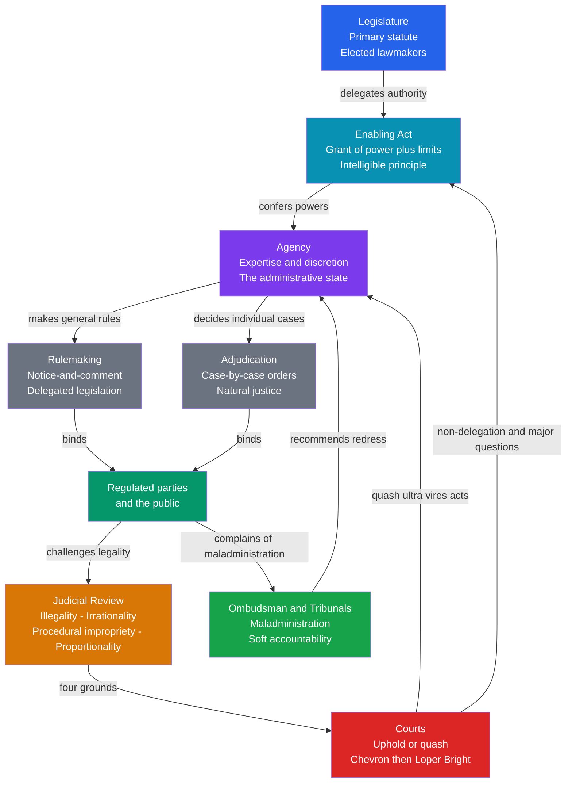

# ⚖️ Administrative Law and Regulation

> [!abstract] TL;DR
> Administrative law is the body of law that governs the powers, procedures, and accountability of the government agencies that make up the modern **regulatory state** — the agencies that write rules (delegated legislation), adjudicate disputes, and enforce standards on everything from clean air to bank capital. Its central problem is a paradox: legislatures must delegate broad power to expert agencies to govern a complex society, yet that delegated power must be kept **legal** (within statutory limits), **rational**, **fair** (natural justice), and **accountable** to courts, ombudsmen, and ultimately voters. Administrative law is the set of legal disciplines — the non-delegation doctrine, notice-and-comment rulemaking, judicial review, and due process — that hold the ring between expertise and democratic control.

---

## Intuition

**Analogy:** A city council cannot personally inspect every restaurant kitchen, so it hires a health department, hands it a mandate ("keep food safe"), and lets it write the detailed hygiene code, grade kitchens, and shut down the dangerous ones. That delegation is efficient — inspectors know more about *Salmonella* than councillors ever will. But now three questions bite. First, did the council actually give the department the power it is now using, or has it invented new powers of its own? Second, when an inspector orders your restaurant closed, do you get to hear the evidence and answer it before the padlock goes on? Third, if the inspector is corrupt, wrong, or captured by a rival chain, who can overrule them?

Administrative law is the rulebook that answers those three questions for the *entire* apparatus of government agencies. The first question is the **delegation and legality** problem (did the agency stay within the statute?). The second is **natural justice / due process** (was the procedure fair?). The third is **judicial review** (can a court correct the decision?). Everything else in this note is an elaboration of these three worries about a health inspector, scaled up to the environmental regulator, the central bank, and the immigration tribunal.

---

## How It Works

### Core Mechanics

The administrative state runs on a chain of delegated authority, and administrative law puts a legal checkpoint at each link.

1. **Primary legislation delegates power.** A legislature passes an *enabling statute* (a "parent act") that creates an agency and grants it authority — for example, to set "adequate" air-quality standards. The legislature sets the objective and the outer limits; it cannot foresee every technical detail. This is the birth of the **administrative state**: rule-making power flowing from elected lawmakers to unelected specialists.

2. **The non-delegation question.** How much lawmaking power may the legislature hand over? The **non-delegation doctrine** says the legislature cannot transfer its *core* legislative function without an "intelligible principle" to guide the agency. In the US this doctrine has been historically weak but is reviving through the **major questions doctrine** (*West Virginia v. EPA*, 2022): decisions of vast economic and political significance need *clear* congressional authorisation, not a creative reading of an old statute.

3. **Rulemaking (delegated legislation).** Agencies make binding general rules. The dominant fair-process model is **notice-and-comment rulemaking** (US Administrative Procedure Act, 1946, section 553): publish the proposed rule, invite public comment, *genuinely consider* the comments, then publish a final rule with reasons. This substitutes transparency and participation for the democratic deliberation that direct legislation would have involved.

4. **Administrative adjudication.** Agencies also decide individual cases — a benefits claim, a licence revocation, a deportation. These decisions are governed by **natural justice / due process**: the right to a fair hearing (*audi alteram partem* — "hear the other side") and the rule against bias (*nemo judex in causa sua* — "no one should be a judge in their own cause").

5. **Controlling discretion.** Statutes grant agencies **discretion** ("the Minister *may*..."). Administrative law disciplines discretion: it must be exercised for the *proper purpose*, on *relevant considerations*, without fettering (rigidly applying a policy without hearing the individual case), and reasonably.

6. **Judicial review of administrative action.** Courts review the *legality* of agency action, not (usually) its *merits*. The classic grounds, systematised in English law by Lord Diplock in *GCHQ* (1985), are **illegality** (acting *ultra vires* — beyond legal power), **irrationality** (*Wednesbury* unreasonableness — a decision so unreasonable no sensible authority could reach it), **procedural impropriety** (breach of natural justice or statutory procedure), and increasingly **proportionality** (is the interference with rights no more than necessary?).

7. **Deference and its retreat.** How much should courts defer to an agency's reading of an ambiguous statute? The US answer was **Chevron deference** (*Chevron v. NRDC*, 1984): if the statute is ambiguous and the agency's interpretation is reasonable, courts defer to agency expertise. This governed for 40 years until *Loper Bright Enterprises v. Raimondo* (2024) overruled it, restoring to courts the duty to find the single best reading of a statute — shifting power from agencies toward judges.

8. **Non-judicial accountability.** Courts are slow and expensive, so the toolkit adds **ombudsmen** (investigating "maladministration" and recommending redress), audit offices, tribunals, and mandatory cost-benefit / regulatory impact assessment before a rule is issued.

### Flow / Architecture



---

## Key Concepts

### Secondary Level

**What is administrative law?** It is the "law about the law-makers" who are not the legislature — the departments, agencies, boards, and tribunals of the executive branch. It answers: what may they do, how must they do it, and who checks them?

**Why the administrative state exists.** A modern state regulates drug safety, aviation, telecoms spectrum, water quality, and financial solvency. No parliament can write statutes at that level of technical detail or update them fast enough. So it *delegates*: it passes broad enabling statutes and lets expert agencies fill in the rules. The trade-off is the whole subject: **expertise and speed** on one side, **democratic accountability and the risk of unchecked power** on the other.

**Two Latin maxims you must know (natural justice).**
- *Audi alteram partem* — "hear the other side." Before a decision harms you, you have a right to know the case against you and to respond.
- *Nemo judex in causa sua* — "no one a judge in their own cause." The decision-maker must be unbiased, with no personal or financial interest in the outcome.

**Ultra vires** — Latin for "beyond the powers." If an agency does something its parent statute never authorised, the act is *ultra vires* and a court can strike it down. This is the bedrock of the rule of law applied to government: officials may only do what the law permits, unlike private citizens who may do anything the law does not forbid.

### Undergraduate Level

**The delegation problem in depth.** Delegation is unavoidable but dangerous. The **non-delegation doctrine** asks how far a legislature may transfer its lawmaking power. The US "intelligible principle" test (*J.W. Hampton v. United States*, 1928) is famously permissive — almost any vague standard has passed. The modern revival works indirectly through the **major questions doctrine**: on questions of "vast economic and political significance," courts will not infer sweeping agency power from ambiguous or ancillary statutory language (*West Virginia v. EPA*, 2022, on the EPA's authority to restructure the power sector).

**The grounds of judicial review** (the *GCHQ* triad plus proportionality):

| Ground | Question the court asks | Classic authority |
|--------|-------------------------|-------------------|
| **Illegality / ultra vires** | Did the agency act within its statutory powers and for the proper purpose? | *Associated Provincial Picture Houses v. Wednesbury* (1948) |
| **Irrationality** | Is the decision so unreasonable that no reasonable authority could have made it? (*Wednesbury* unreasonableness) | *GCHQ* (1985) |
| **Procedural impropriety** | Was natural justice observed and were mandatory procedures followed? | *Ridge v. Baldwin* (1964) |
| **Proportionality** | Where rights are engaged, was the interference suitable, necessary, and balanced? | *R (Daly) v. Home Secretary* (2001) |

**Rulemaking vs adjudication.** Rulemaking is *prospective and general* (like legislation — it binds everyone going forward). Adjudication is *retrospective and specific* (like a court judgment — it resolves a particular dispute). Agencies choose between them, and the choice matters for which procedural protections apply. Notice-and-comment attaches to rulemaking; a trial-type hearing attaches to formal adjudication.

**Chevron and its retreat.** *Chevron* (1984) created a two-step test: (1) if the statute is clear, follow it; (2) if it is ambiguous, defer to any *reasonable* agency interpretation. The justification was expertise and political accountability — agencies know the technical field and answer (indirectly) to the elected president. *Loper Bright* (2024) overruled step two: courts must now independently determine the best reading of the statute. Consequences: agency interpretations become more litigable, existing rules less stable, and power shifts from the executive to the judiciary.

**Regulatory toolkit — command-and-control vs market-based.**
- **Command-and-control**: the regulator dictates the standard or technology (e.g., "every plant must install scrubber X" or "emit no more than Y"). Simple to state, but rigid and often costly because it ignores which firms can abate cheaply.
- **Market-based**: the regulator sets a *price* (a Pigouvian tax) or a *quantity* (cap-and-trade with tradeable permits) and lets firms find the cheapest path. The 1990 US SO2 cap-and-trade cut emissions at roughly one-quarter of the predicted command-and-control cost.

### Graduate Level

**Cost-benefit analysis as a governing discipline.** Since President Reagan's Executive Order 12291 (1981), significant US federal rules require a **regulatory impact analysis**: quantify costs and benefits, including monetising mortality risk through the **Value of a Statistical Life (VSL)** (around USD 10-13 million in US agency practice). The socially optimal stringency is where **marginal benefit equals marginal cost** — the point the Python demo below computes. This imposes analytical discipline but is contested: VSL is ethically fraught, distributional effects are hidden inside aggregate net benefit, and catastrophic, irreversible, or deep-uncertainty risks (climate tipping points, pandemics) are poorly served by expected-value CBA. The rival framework is the **precautionary principle**, which shifts the burden of proof to the proponent of a risky activity but lacks a decision rule for *how much* precaution.

**Regulatory capture and the political economy of rules.** Stigler (1971) argued regulation is often *demanded by* and *supplied to* the industry it nominally constrains: incumbents use it to raise entry barriers and bless cartel pricing. The mechanism is Olson's asymmetry of **concentrated versus diffuse interests** — a rule worth billions to ten firms but a few dollars to each of a million consumers will be lobbied hard by the ten and ignored by the million. The **revolving door** (regulators recruited from and returning to industry) internalises industry preferences. This is why administrative law is not merely procedural housekeeping: notice-and-comment, standing rules, and impact assessments function as **fire-alarm oversight** (McCubbins-Noll-Weingast, 1987), letting affected parties trigger legislative or judicial attention when an agency drifts.

**The core tension: expertise versus democratic legitimacy.** Every design lever trades these off. A more *independent* agency (fixed terms, removal only for cause, like the US Federal Reserve) resists political and industry pressure but is less democratically accountable. A more *responsive* agency is accountable but more capturable and less credible as a long-term commitment device. Administrative procedure — reasoned decisions, published records, judicial review, ombudsman scrutiny — is the institutional attempt to legitimise unelected power *procedurally* when it cannot be legitimised *electorally*.

**Proportionality's rise.** Continental European and human-rights law increasingly displace bare *Wednesbury* irrationality with structured **proportionality** review (legitimate aim, suitability, necessity / least-restrictive-means, and fair balance). This gives courts a more intrusive, structured merits-adjacent role — deepening the same democratic-accountability tension, now between courts and agencies.

---

## Python Demo

The central analytical tool of the modern regulatory state is **cost-benefit analysis**. For a proposed rule we model the **marginal benefit** of stringency (lives saved, pollution reduced — subject to *diminishing returns*: the first cuts are cheap wins, later cuts save fewer lives) against the **marginal cost of compliance** (*rising*: each extra unit of stringency is harder and more expensive). The socially optimal stringency `s*` is where **marginal benefit equals marginal cost**. Below it we *under-regulate* (forgone net benefit); above it we *over-regulate* (compliance cost exceeds benefit — pure deadweight loss).

```python
# Cost-benefit analysis of a proposed regulation.
# Find the socially optimal stringency s* where marginal benefit = marginal cost,
# and visualise the welfare cost of under- and over-regulation.
import numpy as np
import matplotlib.pyplot as plt

# Stringency s in [0, 1]: fraction of the harm the rule forces to be abated
s = np.linspace(0.0, 1.0, 1001)

# Marginal benefit of stringency: DIMINISHING returns (early cuts save the most lives)
# MB(s) = B0 * exp(-lam * s)
B0, lam = 100.0, 2.0
MB = B0 * np.exp(-lam * s)

# Marginal cost of compliance: RISING (each extra unit of stringency costs more)
# MC(s) = C0 * exp(gam * s)
C0, gam = 10.0, 2.0
MC = C0 * np.exp(gam * s)

# Socially optimal stringency: MB = MC.
# Closed form: B0*exp(-lam*s) = C0*exp(gam*s) -> s* = ln(B0/C0) / (lam + gam)
s_star = np.log(B0 / C0) / (lam + gam)
mc_star = C0 * np.exp(gam * s_star)

# Total net social benefit N(s) = integral_0^s (MB - MC) ds', via cumulative trapezoid
net_marginal = MB - MC
N = np.concatenate([[0.0], np.cumsum((net_marginal[1:] + net_marginal[:-1]) / 2 * np.diff(s))])
opt_idx = int(np.argmax(N))

print(f"Optimal stringency  s*      = {s_star:0.3f}")
print(f"MB = MC at optimum          = {mc_star:0.2f} (benefit units per unit stringency)")
print(f"Max total net benefit N(s*) = {N[opt_idx]:0.2f}  at s = {s[opt_idx]:0.3f}")

# Illustrative policy choices: an under-regulated and an over-regulated rule
s_under, s_over = 0.30, 0.85

fig, (ax1, ax2) = plt.subplots(1, 2, figsize=(14, 5.5))

# --- Left: marginal benefit vs marginal cost, with the optimum and the two error regions
ax1.plot(s, MB, color="#059669", lw=2.5, label="Marginal benefit  (lives saved / harm avoided)")
ax1.plot(s, MC, color="#dc2626", lw=2.5, label="Marginal cost of compliance")

# Under-regulation: for s < s*, MB > MC -> shaded forgone net benefit
mask_u = s <= s_star
ax1.fill_between(s[mask_u], MC[mask_u], MB[mask_u], color="#059669", alpha=0.18)
# Over-regulation: for s > s*, MC > MB -> shaded deadweight loss
mask_o = s >= s_star
ax1.fill_between(s[mask_o], MB[mask_o], MC[mask_o], color="#dc2626", alpha=0.18)

ax1.axvline(s_star, color="#7c3aed", ls="--", lw=2)
ax1.plot(s_star, mc_star, "o", color="#7c3aed", ms=9, zorder=5)
ax1.annotate(f"Social optimum  s* = {s_star:0.2f}\nMB = MC",
             xy=(s_star, mc_star), xytext=(s_star + 0.05, mc_star + 28),
             arrowprops=dict(arrowstyle="->", color="#7c3aed"), color="#7c3aed", fontsize=10)
ax1.text(0.10, 70, "Under-regulation\nMB > MC\n(add stringency)", color="#065f46", fontsize=9)
ax1.text(0.72, 55, "Over-regulation\nMC > MB\n(deadweight loss)", color="#7f1d1d", fontsize=9)
ax1.set_xlabel("Regulatory stringency s  (0 = laissez-faire, 1 = maximal)")
ax1.set_ylabel("Marginal value (benefit units)")
ax1.set_title("Marginal Benefit vs Marginal Cost of a Rule")
ax1.legend(loc="upper center", fontsize=9)
ax1.set_ylim(0, 80)

# --- Right: total net social benefit peaks exactly at s*
ax2.plot(s, N, color="#2563eb", lw=2.5, label="Total net social benefit  N(s)")
ax2.axvline(s[opt_idx], color="#7c3aed", ls="--", lw=2, label=f"optimum s* = {s[opt_idx]:0.2f}")
for sc, name, col in [(s_under, "under-regulated", "#059669"),
                      (s_over, "over-regulated", "#dc2626")]:
    j = int(np.argmin(np.abs(s - sc)))
    ax2.plot(sc, N[j], "o", color=col, ms=9)
    ax2.annotate(f"{name}\nN = {N[j]:0.1f}", xy=(sc, N[j]),
                 xytext=(sc - 0.02, N[j] - 9), color=col, fontsize=9, ha="center")
ax2.axhline(0, color="gray", lw=0.8)
ax2.set_xlabel("Regulatory stringency s")
ax2.set_ylabel("Total net social benefit")
ax2.set_title("Welfare Peaks at the Optimum; Too Little or Too Much Both Lose")
ax2.legend(loc="lower center", fontsize=9)

plt.tight_layout()
plt.savefig("regulation_cost_benefit.png", dpi=150, bbox_inches="tight")
print("Saved regulation_cost_benefit.png")
```

**What the model shows.** The optimum sits where the marginal-benefit and marginal-cost curves cross (`s* ~= 0.58` for these parameters). To the *left*, marginal benefit still exceeds marginal cost, so a stricter rule would raise net welfare — the classic case *against* a captured or timid regulator that under-protects the public. To the *right*, marginal cost exceeds marginal benefit, so extra stringency destroys value — the classic case *against* a zealous regulator imposing gold-plated rules whose costs outrun their safety gains. The right-hand panel makes the punchline visceral: total net social benefit is a hill, and both under- and over-regulation slide down it. Cost-benefit analysis is the regulatory state's attempt to find the summit — and every fight over VSL, discount rates, and unquantified benefits is a fight over the shape of these two curves.

---

## Real-World Applications

- **US EPA and the Clean Air Act.** The EPA sets National Ambient Air Quality Standards through notice-and-comment rulemaking, backed by regulatory impact analyses that monetise avoided deaths via VSL. *West Virginia v. EPA* (2022) used the major-questions doctrine to strike down the Clean Power Plan's sector-wide emissions strategy, and *Loper Bright* (2024) removed the Chevron deference the agency had long relied on — a live illustration of the delegation and deference doctrines reshaping real regulatory power.

- **UK judicial review and natural justice.** *Ridge v. Baldwin* (1964) established that a chief constable dismissed without a hearing had been denied natural justice; *GCHQ* (1985) catalogued the modern grounds of review. British administrative law runs largely on *ultra vires* and *Wednesbury* reasonableness, increasingly supplemented by proportionality where the Human Rights Act is engaged.

- **Financial regulation.** Central banks and prudential regulators (the Federal Reserve, the Bank of England's PRA) are the archetypal *independent* agencies: fixed terms and removal-for-cause insulate monetary and solvency decisions from short-term politics, functioning as a commitment device against inflationary bias — while inviting the perennial critique of a democratic deficit.

- **Ombudsmen.** The Parliamentary and Health Service Ombudsman in the UK and the sectoral offices elsewhere investigate "maladministration" (delay, bias, error) and recommend redress, providing a cheap, non-judicial accountability channel for the millions of low-value administrative decisions that never reach a court.

- **EU market-based environmental regulation.** The EU Emissions Trading System operationalises cap-and-trade — a quantity instrument that lets the market discover the abatement price — the practical embodiment of choosing market-based over command-and-control tools discussed above.

---

## Common Pitfalls

- **Confusing judicial review with an appeal.** Judicial review polices the *legality and fairness* of a decision (did the agency have the power, follow fair procedure, and act rationally?), not whether the court would have decided differently on the *merits*. A perfectly lawful decision can still be, in the court's private opinion, unwise — and it will stand.

- **Treating a market failure as automatic grounds for regulation.** A demonstrated externality justifies *analysis*, not intervention. Government failure — capture, information gaps, compliance costs — is equally real. The cost-benefit optimum can lie well short of maximal stringency, and sometimes at zero.

- **Equating formal independence with immunity from capture.** Fixed terms and removal-for-cause block *political* interference but do nothing about the *revolving door*. An agency whose staff are drawn from and return to the industry internalises industry preferences regardless of its statutory independence.

- **Weaponising notice-and-comment.** The comment period looks like participatory democracy but is routinely flooded with technically dressed industry objections and used to build a record for litigation that delays rules for years — a concentrated-interest advantage over the diffuse public.

- **Applying the precautionary principle with no decision rule.** "Take precaution under uncertainty about serious harm" does not say *how much* precaution, at what cost, or who bears the burden. Without operationalisation it can justify blocking any innovation or any intervention, functioning as rhetoric rather than analysis.

- **Assuming Chevron still governs.** Many older analyses assume agencies win on ambiguous statutes. After *Loper Bright* (2024), US courts owe no automatic deference; the safe assumption is that a court will decide the statute's best meaning for itself.

---

## Related Concepts

- [[Regulatory_Politics_and_Administrative_Law]] — the political-science companion to this note: regulatory capture, the principal-agent structure of bureaucracy, and the deregulation debates, viewed as political economy rather than legal doctrine.
- [[Externalities_and_Pigouvian_Tax]] — the paradigm market failure that regulation corrects, and the market-based tax instrument that is the economist's alternative to command-and-control rules.
- [[Market_Failures]] — the four canonical market failures (externalities, market power, public goods, information asymmetry) supply the economic justification for the regulatory state.
- [[Public_Goods]] — safety, financial stability, and clean air have public-good characteristics, explaining why they are under-provided without mandates and why regulation steps in.
- [[Coase_Theorem]] — the rival to regulation: where transaction costs are low, well-defined property rights and private bargaining can internalise externalities without an agency at all.
- [[Political_Institutions_and_Constitutions]] — constitutional design fixes how much power a legislature may delegate, how courts may check agencies, and where the separation-of-powers limits on the administrative state lie.
- [[Policy_Analysis_and_the_Policy_Process]] — cost-benefit analysis and regulatory impact assessment are the analytical stage of the wider policy cycle in which agencies design and evaluate rules.

---

## Review Questions

### Secondary

1. In your own words, what does *ultra vires* mean, and why is it central to the idea that a government agency (unlike a private citizen) may only do what the law positively permits?
2. A benefits office cancels someone's payments without telling them why or letting them respond. Which principle of natural justice has been breached, and what is the Latin name for it?
3. Give one advantage and one disadvantage of letting an expert agency, rather than the elected legislature, write the detailed rules on food safety.

### Undergraduate

1. Distinguish the four grounds of judicial review (illegality, irrationality, procedural impropriety, proportionality). For each, state the question the court is really asking and why it stops short of substituting its own view of the merits.
2. Explain Chevron deference and why *Loper Bright* (2024) overruled it. Analyse the likely consequences for (a) the balance of power between agencies and courts, (b) the stability of existing regulations, and (c) an agency's practical capacity to regulate a highly technical field.
3. Using the marginal-benefit-equals-marginal-cost framework from the Python demo, explain precisely what "over-regulation" and "under-regulation" mean, and give a real example of each.

### Graduate

1. Administrative law is often described as an attempt to *legitimise procedurally* what cannot be legitimised *electorally*. Evaluate this claim using notice-and-comment rulemaking and judicial review. Do these procedures genuinely legitimate unelected power, or do they mainly redistribute influence toward the parties with the resources to exploit them?
2. Compare cost-benefit analysis and the precautionary principle as decision rules for a regulation governing a deeply uncertain, potentially catastrophic risk (for example, a novel AI capability or a geoengineering deployment). Is the disagreement between them ultimately empirical or irreducibly normative?
3. The revival of the non-delegation doctrine via the major-questions doctrine (*West Virginia v. EPA*) and the abolition of Chevron deference (*Loper Bright*) both shift power from agencies toward courts. Construct an argument about whether this shift strengthens or weakens the rule of law, and identify the conditions under which judicial supremacy over statutory meaning is superior to agency expertise.

---

## Sources

- *Chevron U.S.A., Inc. v. Natural Resources Defense Council*, 467 U.S. 837 (1984); *Loper Bright Enterprises v. Raimondo*, 603 U.S. 369 (2024); *West Virginia v. EPA*, 597 U.S. 697 (2022).
- *Associated Provincial Picture Houses Ltd v. Wednesbury Corporation* [1948] 1 KB 223; *Council of Civil Service Unions v. Minister for the Civil Service* (GCHQ) [1985] AC 374; *Ridge v. Baldwin* [1964] AC 40.
- Peter Cane, *Administrative Law*, 5th edn, Oxford University Press, 2011.
- Robert Baldwin, Martin Cave and Martin Lodge, *Understanding Regulation: Theory, Strategy, and Practice*, 2nd edn, Oxford University Press, 2011.
- George J. Stigler, "The Theory of Economic Regulation," *Bell Journal of Economics and Management Science* 2(1), 1971.
- Cass R. Sunstein, *The Cost-Benefit State: The Future of Regulatory Protection*, American Bar Association, 2002.

---

#law #administrative-law #regulation #agencies #judicial-review
