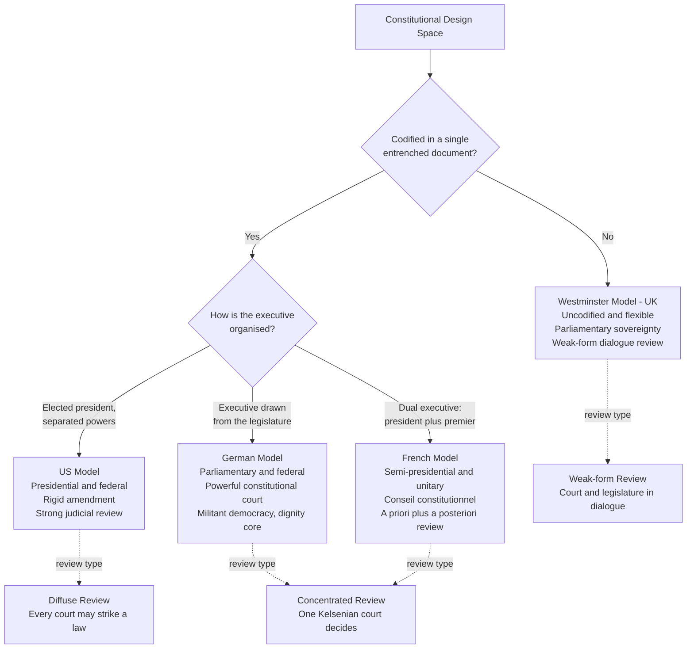

# 🏛️ Comparative Constitutionalism

> [!abstract] TL;DR
> Comparative constitutionalism studies how different countries solve the *same* two problems — organising government and protecting rights — with radically different structural choices, and asks what those differences teach us. By lining up the great models side by side (US codified-rigid-presidential-federal with strong judicial review; the UK's uncodified, flexible, parliamentary-sovereign Westminster system; Germany's dignity-centred militant democracy policed by a powerful constitutional court; France's semi-presidential hybrid) we can see which design trade-offs buy stability, which buy adaptability, and why the *average* national constitution survives only about seventeen years.

---

## Intuition

**Analogy:** Imagine a team of architects touring government buildings around the world. Every building serves the same function — housing power safely and sheltering the people inside from it — yet no two are built alike. One is a rigid steel-and-concrete tower with earthquake bracing bolted into a single master blueprint: nearly impossible to remodel, engineered to stand for centuries (the **United States**). Another is a centuries-old manor with no original blueprint at all, continuously renovated room by room as needs change, held together by tradition and the current owner's discretion (the **United Kingdom**). A third comes with a permanent, powerful building inspector who can veto *any* renovation that threatens the load-bearing core, and who will not let you install a door that could let arsonists back in (**Germany**). A fourth splits the caretaker's job between a live-in manager and an elected patron, so who really controls the building depends on which of them the tenants currently back (**France**).

Touring the buildings is the whole point. You cannot tell whether the earthquake bracing was worth it, or whether the flexible manor is a fire hazard, by studying only one. Comparative constitutionalism is that tour: by placing constitutions beside one another we learn which design choices produce durability, which produce responsiveness, and which quietly invite collapse.

---

## How It Works

### Core Mechanics

Comparative constitutionalism is both a **field of study** and a **practice of institutional design**. It works by decomposing any constitution into a handful of design dimensions, scoring each system along them, and then asking how the choices interact and what outcomes they produce.

1. **Codification.** Is there a single, entrenched, written master document (US, Germany, France, most of the world) or is the constitution *uncodified* — scattered across statutes, conventions, and case law and amendable by ordinary majority (UK, New Zealand, Israel)? Codification is the precondition for most of what follows: you cannot entrench what you have not written down.

2. **Form of government.** How is executive power organised relative to the legislature? **Presidential** systems elect a chief executive separately and fix the terms, producing separated powers and independent legitimacy (US). **Parliamentary** systems fuse the two: the executive is drawn from and survives at the pleasure of the legislature (UK, Germany, Japan, India). **Semi-presidential** systems run a *dual executive* — a popularly elected president alongside a prime minister accountable to parliament — so control can flip during "cohabitation" (France, Portugal, much of post-Soviet Europe). See [[Political_Institutions_and_Constitutions]] and [[Democracy_Types_and_Electoral_Systems]].

3. **Model of constitutional review.** Who guards the constitution, and how hard? Three archetypes: the **American diffuse (decentralised)** model, where *any* court may refuse to apply an unconstitutional law; the **European concentrated (Kelsenian)** model, where a single dedicated constitutional court monopolises the power to strike down legislation (Germany, France, Italy, Spain); and the **Commonwealth weak-form** model, where courts may *flag* a rights violation but the legislature retains the last word — a structured "dialogue" (UK Human Rights Act declarations of incompatibility, Canada's notwithstanding clause, New Zealand).

4. **Territorial structure.** **Federal** systems entrench a division of sovereign authority between national and constituent units (US, Germany, India, Brazil); **unitary** systems concentrate it centrally, even where power is delegated downward through devolution (UK, France). See [[Federalism_and_Decentralization]].

5. **Rights entrenchment.** How firmly are rights locked in? A US-style Bill of Rights entrenched behind a supermajority amendment rule and enforced by strong review sits at one extreme; a merely statutory bill of rights that Parliament can repeal tomorrow sits at the other.

6. **Rigidity.** How hard is the text to change? This is the master trade-off. High **amendment difficulty** protects the bargain from transient majorities but risks freezing the document until it snaps; high **flexibility** keeps the constitution current but weakens its power to bind. The empirical punchline from the endurance literature is counter-intuitive: constitutions that are *too* rigid to adapt tend to be *replaced* rather than amended, so extreme rigidity can shorten a constitution's life rather than extend it.

Layered on top are the harder questions: **constitution-making** at "constitutional moments" (revolutions, decolonisation, post-conflict transitions); **constitutional borrowing** and the *migration of constitutional ideas* across borders; **militant/defensive democracy** and **unamendable provisions** (eternity clauses); and each polity's **constitutional identity** — the core it treats as beyond change.

### Flow / Architecture



---

## Key Concepts

**Secondary / High-school level.** Every country needs rules for how its government is run and how citizens are protected — that is its constitution. But countries do it very differently: some elect a president who is separate from the lawmakers (the US), some have a prime minister chosen by the lawmakers (the UK, Germany), and some have both at once (France). Some write it all down in one big document that is very hard to change; others let it grow and change more easily. By comparing these choices we can ask a simple question: which designs work best, and for what?

**Undergraduate level.** Master the four archetypes and the dimensions that distinguish them: **codified vs uncodified**; **presidential vs parliamentary vs semi-presidential**; **federal vs unitary**; and the three **models of judicial review** — American diffuse, European concentrated (Kelsenian constitutional courts), and Commonwealth weak-form dialogue. Understand **parliamentary sovereignty** (in the UK no court can strike an Act of Parliament) versus **constitutional supremacy** (elsewhere the constitution outranks statute and courts enforce that). Grasp the core trade-off between **rigidity** (protects the bargain, resists capture) and **flexibility** (keeps the text current), and know that amendment difficulty is measured by things like supermajority thresholds, multiple readings, referendums, and sub-unit ratification.

**Graduate / professional level.** Interrogate the frontier. **Militant (defensive) democracy** (Loewenstein): a constitution that arms itself against enemies of the constitutional order — Germany can ban anti-constitutional parties and strip abused rights. **Eternity clauses / unamendable provisions:** German Basic Law Article 79(3) walls off human dignity, democracy, and federalism *permanently*; India's judge-made **basic structure doctrine** lets the court strike down constitutional *amendments*. **Constitutional identity:** the idea that each polity has an unamendable core, invoked by the German and Indian courts and by the EU's *Solange* jurisprudence. **The migration of constitutional ideas** and **constitutional borrowing/transplants:** the global diffusion of proportionality analysis, dignity, and bills of rights, and the risk that a transplant rejects in unfamiliar institutional soil. **Constitutional moments** (Ackerman): higher-lawmaking outside ordinary politics. The **endurance literature** (Elkins, Ginsburg & Melton): the median national constitution dies at ~17 years, and *inclusive*, *flexible*, and *specific* constitutions last longer — flexibility can substitute for entrenchment. And the perennial **counter-majoritarian difficulty**: how strong review is squared with democracy. Methodologically, wrestle with **functionalism vs contextualism** — whether institutions doing the "same job" are truly comparable across legal cultures.

---

## Python Demo

```python
# Comparative constitutionalism, quantified:
# (1) a feature matrix of four archetypal systems, drawn as a heatmap, and
# (2) a scatter of amendment difficulty vs constitutional longevity that exposes
#     the rigidity-vs-adaptability trade-off.
# Values are stylised scholarly encodings for teaching, not precise measurements.
import numpy as np
import matplotlib.pyplot as plt

# ---------------------------------------------------------------
# (1) FEATURE MATRIX
# Rows = archetypal systems, columns = design dimensions.
# Every cell is on a common 0..4 intensity scale, where higher means
# MORE of the named property.
# ---------------------------------------------------------------
systems = ["US\npresidential", "UK\nWestminster",
           "Germany\nparliamentary", "France\nsemi-presidential"]
dims = ["Codified", "Judicial\nreview strength", "Exec-Leg\nseparation",
        "Federalism", "Rights\nentrenchment", "Amendment\nrigidity"]

M = np.array([
    [4, 3, 4, 4, 4, 4],   # US:      codified, strong review, separated, federal, entrenched, rigid
    [0, 1, 0, 0, 1, 0],   # UK:      uncodified, weak-form, fused, unitary, statutory rights, flexible
    [4, 4, 0, 4, 4, 3],   # Germany: codified, very strong court, fused, federal, entrenched, rigid
    [4, 3, 2, 0, 3, 2],   # France:  codified, strong review, dual exec, unitary, entrenched, moderate
], dtype=float)

fig, ax = plt.subplots(figsize=(9, 4.5))
im = ax.imshow(M, cmap="YlOrRd", vmin=0, vmax=4, aspect="auto")
ax.set_xticks(range(len(dims)));  ax.set_xticklabels(dims, fontsize=8)
ax.set_yticks(range(len(systems))); ax.set_yticklabels(systems, fontsize=9)
for i in range(M.shape[0]):
    for j in range(M.shape[1]):
        ax.text(j, i, f"{M[i, j]:.0f}", ha="center", va="center",
                color="black", fontsize=10, fontweight="bold")
cbar = fig.colorbar(im, ax=ax, fraction=0.03, pad=0.02)
cbar.set_label("intensity (0 = low or absent, 4 = high or strong)")
ax.set_title("Feature matrix of four archetypal constitutional systems",
             fontweight="bold")
plt.tight_layout()
plt.savefig("constitutional_feature_matrix.png", dpi=120)

# ---------------------------------------------------------------
# (2) RIGIDITY vs LONGEVITY
# x = amendment difficulty index (0 = flexible, 1 = very rigid)
# y = age of the currently-in-force constitution in years (~2024)
# ---------------------------------------------------------------
labels     = ["US 1789", "Norway 1814", "Mexico 1917", "India 1950",
              "Japan 1947", "Germany 1949", "France 1958", "Brazil 1988"]
difficulty = np.array([0.95, 0.80, 0.35, 0.40, 0.90, 0.65, 0.50, 0.45])
age        = np.array([ 235,  210,   107,   74,    77,    75,    66,    36])

fig2, ax2 = plt.subplots(figsize=(8, 5.5))
ax2.scatter(difficulty, age, s=90, color="#2d6a9f", zorder=3)
for x, y, name in zip(difficulty, age, labels):
    ax2.annotate(name, (x, y), textcoords="offset points", xytext=(6, 4), fontsize=8)

# Elkins-Ginsburg-Melton: the average national constitution has lasted ~17 years.
ax2.axhline(17, color="crimson", linestyle="--", linewidth=1.5)
ax2.text(0.02, 22, "global mean lifespan ~17 yrs (Elkins-Ginsburg-Melton)",
         color="crimson", fontsize=8)

ax2.set_xlabel("amendment difficulty  (0 = flexible, 1 = very rigid)")
ax2.set_ylabel("age of current constitution (years, ~2024)")
ax2.set_title("Rigidity vs longevity: no simple monotonic law", fontweight="bold")
ax2.grid(alpha=0.3)
plt.tight_layout()
plt.savefig("constitutional_rigidity_vs_longevity.png", dpi=120)

print("Saved: constitutional_feature_matrix.png, constitutional_rigidity_vs_longevity.png")
print("\nWhat the plots show:")
print(" - The UK row is near-zero on codification and rigidity, yet the system endures:")
print("   flexibility can substitute for entrenchment.")
print(" - US and Norway are rigid AND old, but Japan is rigid and only middle-aged,")
print("   while Mexico is flexible and old -> rigidity does not straightforwardly buy longevity.")
```

The heatmap makes the archetypes legible at a glance: the US row lights up on nearly every "hard" dimension (codified, separated, federal, entrenched, rigid), the UK row is almost empty (its constitution is diffuse and flexible), Germany pairs the strongest review with a fused executive, and France sits in the middle with its dual executive. The scatter deliberately refuses a clean upward line: extreme rigidity (US, Japan) sometimes coincides with great age and sometimes does not, while flexible constitutions (Mexico, India) can be long-lived — the empirical lesson that adaptability, not sheer rigidity, tends to buy endurance.

---

## Real-World Applications

- **Drafting post-conflict and transitional constitutions.** After 1990, constitution-makers in South Africa, Eastern Europe, and post-war Iraq and Tunisia explicitly *shopped* the comparative catalogue — importing German-style constitutional courts, proportionality review, and dignity clauses. South Africa's 1996 Constitution, with its powerful Constitutional Court and certification process, is a textbook case of deliberate comparative borrowing.
- **Choosing a review model.** Countries designing a new democracy must decide whether to let every judge strike laws (diffuse) or channel review into one specialised court (concentrated). Most of continental Europe, Latin America, and Asia chose the Kelsenian concentrated model precisely to keep the ordinary judiciary out of politics — a direct comparative-design decision.
- **Militant democracy in action.** Germany's Federal Constitutional Court banned the neo-Nazi SRP (1952) and the Communist KPD (1956), and Article 79(3)'s eternity clause has been invoked to test the limits of European integration. These are constitutionalism's self-defence mechanisms operating live.
- **Weak-form review as a compromise.** The UK Human Rights Act 1998, Canada's Charter with its section 33 notwithstanding clause, and New Zealand's Bill of Rights were designed to give courts a rights role *without* abandoning parliamentary sovereignty — a "dialogue" model exported across the Commonwealth.
- **Cross-border citation.** Constitutional courts routinely cite each other. The proportionality test born in German administrative law now structures rights adjudication in Canada, Israel, South Africa, and the EU — a documented "migration of constitutional ideas."

---

## Common Pitfalls

- **Assuming the US model is the default.** Because the US wrote the first great codified constitution, students treat presidentialism, federalism, and diffuse review as "normal." In fact most democracies are *parliamentary* with *concentrated* review; the US package is comparatively unusual and, some argue, unusually prone to gridlock and crisis.
- **Confusing "uncodified" with "no constitution."** The UK absolutely has a constitution — it is simply spread across statutes, conventions, and cases rather than one document. Calling it "unwritten" (much of it *is* written) or "non-existent" misreads the whole Westminster model.
- **Equating rigidity with durability.** The intuitive assumption that harder-to-amend constitutions last longer is contradicted by the endurance data: constitutions too rigid to adapt tend to be scrapped and rewritten. Flexibility, inclusiveness, and specificity correlate with survival.
- **Transplanting institutions without their ecosystem.** Copying Germany's constitutional court into a country without an independent judiciary, professional bar, or culture of compliance produces a paper institution. Design choices interact with legal culture; a transplant can be *rejected*.
- **Treating judicial review as one thing.** Diffuse, concentrated, and weak-form review differ in who decides, when (a priori vs a posteriori), and who has the last word. Lumping them together erases the most consequential design variable in modern constitutionalism.
- **Naive functionalism.** Assuming two institutions are comparable because they "do the same job" ignores context. A German "constitutional court" and an American "supreme court" both do review, but their appointment, jurisdiction, and role in politics differ profoundly.

---

## Related Concepts

- [[Political_Institutions_and_Constitutions]] — the political-science lens on separation of powers, veto players, and how institutional design drives policy stability.
- [[Federalism_and_Decentralization]] — the territorial dimension of the feature matrix: federal vs unitary structure and its constitutional entrenchment.
- [[Democracy_Types_and_Electoral_Systems]] — presidential vs parliamentary vs semi-presidential executives and how electoral rules interact with constitutional form.
- [[Authoritarianism_and_Hybrid_Regimes]] — the shadow side: "constitutions without constitutionalism," where a text exists but constrains no one (abusive constitutionalism).
- [[State_Formation_and_Political_Development]] — where constitutions come from; constitutional moments and founding sit inside the longer arc of state-building.
- [[Sources_of_Law]] — the constitution as the apex source of law, and the eternity-clause question of whether an amendment can itself be unconstitutional.
- **Judicial and constitutional review** — the mechanism at the heart of the comparison; diffuse vs concentrated vs weak-form review is the single most consequential design axis. *(Candidate sibling note `Judicial_Review_and_the_Courts` — not yet in the vault; link once created.)*

---

## Review Questions

1. **(Recall / conceptual)** Distinguish the American diffuse, European concentrated (Kelsenian), and Commonwealth weak-form models of constitutional review. For each, say *who* may invalidate a law and *who* has the final word, and name a country that uses it.
2. **(Applied / scenario)** A newly independent, ethnically divided country is drafting its first constitution and fears both a runaway majority and future coups. Would you recommend a rigid, codified, federal design with a strong constitutional court, or a flexible parliamentary system, and which model of review? Justify the trade-off you are accepting, citing the endurance evidence on rigidity and inclusiveness.
3. **(Trade-off / critical)** Germany entrenches human dignity and democracy behind an *unamendable* eternity clause, and India lets its court strike down constitutional amendments under the basic-structure doctrine. Are unamendable provisions a safeguard of constitutional identity or an anti-democratic dead hand? Argue both sides and take a position.

---

## Sources

- Elkins, Zachary, Tom Ginsburg & James Melton. *The Endurance of National Constitutions* (Cambridge University Press, 2009) — the empirical study behind the ~17-year mean lifespan and the finding that flexibility and inclusiveness aid survival.
- Rosenfeld, Michel & András Sajó (eds.). *The Oxford Handbook of Comparative Constitutional Law* (Oxford University Press, 2012) — the standard reference on models, methods, and doctrines.
- Tushnet, Mark. *Weak Courts, Strong Rights: Judicial Review and Social Welfare Rights in Comparative Constitutional Law* (Princeton University Press, 2008) — the strong-form vs weak-form distinction and dialogue theory.
- Hirschl, Ran. *Comparative Matters: The Renaissance of Comparative Constitutional Law* (Oxford University Press, 2014) — methodology, migration of ideas, and the field's revival.
- Loewenstein, Karl. "Militant Democracy and Fundamental Rights," *American Political Science Review* 31 (1937) — the founding statement of defensive/militant democracy.

---

#law #comparative-law #constitutionalism #constitutional-design #comparative-politics
