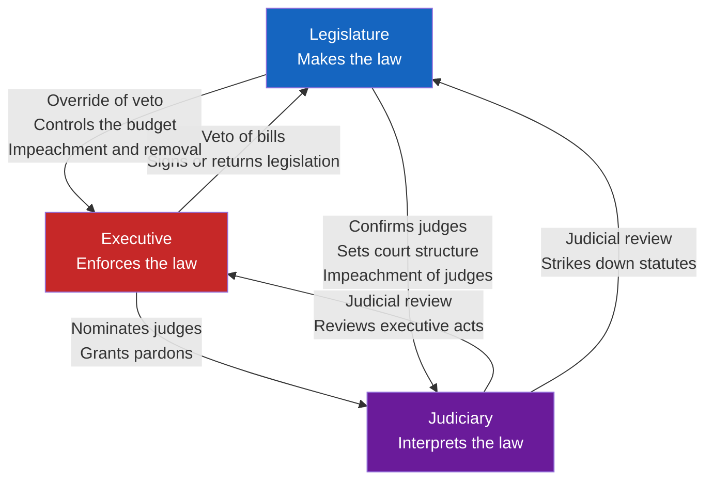

# ⚖️ Constitutional Law and Structure

> [!abstract] TL;DR
> Constitutional law is the "higher law" that **constitutes the state itself** — it creates the organs of government, allocates power among them, sets the outer limits of what any of them may do, and entrenches the fundamental rights of citizens against temporary majorities. Its two great structural devices are the **horizontal separation of powers** (legislative, executive, judicial branches checking one another) and the **vertical division of powers** (federalism versus unitary government). A constitution is simultaneously a *legal* document enforced by courts and a *political* document sustained by conventions, norms, and the willingness of powerful actors to obey it.

---

## Intuition

**Analogy:** A constitution is the **rulebook for making rules**. In any game, there are two levels of rule. There are the ordinary moves — where you place a piece, how many spaces you advance. And there is the meta-rule that says *how the ordinary rules can be changed*, *who is allowed to change them*, and *which rules can never be changed at all*. If a single player could rewrite the rulebook mid-game whenever they were losing, no one else would agree to play. The whole value of the rulebook comes from the fact that it sits **above** the players and binds even the referee.

Constitutional law is that meta-rulebook for a political community. Ordinary legislation is a move within the game. Amending the constitution is editing the rulebook — and precisely because it changes the terms on which everyone plays, it deliberately requires far more than a bare majority and a single afternoon. The branches of government are the players; the constitution is the referee that no player controls; and the "unchangeable" rules are the entrenched rights and structural guarantees that even a unanimous vote cannot erase in some systems.

---

## How It Works

Constitutional law operates on three logically distinct tasks, all performed by the same document (or, in some countries, the same *body* of dispersed rules):

1. **It constitutes.** Before a constitution, there is no "government" as a legal entity — only raw power. A constitution brings offices into legal existence: it creates the legislature, defines the executive, and establishes the courts. This is why the word is *constitute* — the document literally calls the state into being as a creature of law rather than of force.

2. **It allocates and limits power.** Every grant of authority in a constitution is simultaneously a *limit*: to say "Congress may regulate interstate commerce" is to say Congress may *not* regulate what is purely local. Power is enumerated, divided horizontally across branches and vertically across levels of government, so that no single actor holds all of it.

3. **It entrenches rights and provides legitimacy.** Fundamental rights (speech, due process, equality) are placed beyond the reach of ordinary majorities, and the whole structure derives its **legitimacy** from a founding act — a ratifying convention, a referendum, or long-accepted tradition — that lets people accept the state's authority as rightful rather than merely coerced.

### Constitutional supremacy and entrenchment

A constitution is **supreme law**: ordinary statutes that conflict with it are void. This supremacy is protected by **entrenchment** — deliberately making the constitution harder to change than an ordinary law. The US Constitution requires a two-thirds vote of both houses of Congress plus ratification by three-quarters of the states; Germany's Basic Law protects some clauses so completely they cannot be amended at all ("eternity clauses"). A **flexible** constitution, by contrast, can be altered by ordinary legislation — which is why the amendment procedure, not whether the text is codified, is what determines rigidity.

### Written versus unwritten (uncodified)

The United States has a **codified** constitution: a single canonical document adopted in 1787. The United Kingdom has an **uncodified** constitution: there is no single "The Constitution" text; instead the rules are dispersed across landmark statutes (Magna Carta 1215, the Bill of Rights 1689, the Human Rights Act 1998), judicial decisions, authoritative treatises, and — crucially — **constitutional conventions** (binding but non-legal customs, such as the monarch always assenting to bills passed by Parliament). "Unwritten" is a misnomer: most of it *is* written down; it simply is not gathered into one entrenched document.

### The separation of powers and checks and balances

Montesquieu, in *The Spirit of the Laws* (1748), argued that liberty dies when the power to make law, enforce law, and judge under law is held by the same hands. The remedy is to distribute these functions across three structurally independent branches — **legislative** (makes law), **executive** (enforces law), **judicial** (interprets law) — and then arm each branch with concrete tools to **check** the others. Madison compressed the logic in *Federalist No. 51*: "Ambition must be made to counteract ambition." The diagram below shows the classic web of mutual checks.



Read the diagram as a cycle of mutual restraint: the executive can **veto**, but the legislature can **override** and hold the **power of the purse** and **impeachment**; the executive **appoints** judges, but the judiciary can **strike down** both statutes and executive acts through **judicial review**. No arrow points only one way — every branch is both checker and checked.

### Federalism versus unitary states

Where separation of powers divides authority *horizontally*, **federalism** divides it *vertically* between a national government and subnational units (states, provinces, Länder) whose authority is constitutionally guaranteed rather than granted at the centre's pleasure. Powers are sorted into three buckets:

- **Enumerated** powers — expressly given to the national government (in the US, listed in Article I, Section 8: coining money, declaring war, regulating interstate commerce).
- **Reserved** powers — retained by the states (US Tenth Amendment: powers not delegated to the nation are reserved to the states or the people).
- **Concurrent** powers — exercised by both levels simultaneously (taxation, law enforcement).

Two clauses do the heavy lifting in US federalism. The **Commerce Clause** has been read broadly to let Congress regulate a vast range of economic activity, and the **Supremacy Clause** (Article VI) makes valid federal law prevail over conflicting state law. A **unitary** state (France, Japan) reverses the default: sovereignty sits at the centre, and subnational bodies exist and act only at the centre's discretion.

### Parliamentary versus presidential systems

Constitutions also choose how to relate the executive to the legislature. In a **presidential** system (US, Brazil) the two are **separated**: the president is elected independently, serves a fixed term, and does not depend on legislative confidence — which enables checks but risks deadlock. In a **parliamentary** system (UK, Germany) the two are **fused**: the executive (prime minister and cabinet) emerges from and is accountable to the legislative majority and can be removed by a vote of no confidence — which enables decisive government but concentrates power.

---

## Key Concepts

### Secondary Level

- **Constitution.** The supreme, foundational law that creates a government, distributes its powers, limits those powers, and protects fundamental rights.
- **Higher law.** The idea that some law stands *above* ordinary legislation, so that even a validly enacted statute can be struck down for violating it.
- **Separation of powers.** Splitting government into legislative, executive, and judicial branches so no one body makes, enforces, and judges the law at once.
- **Checks and balances.** The concrete tools each branch uses to limit the others — veto, override, judicial review, impeachment, appointment, and confirmation.
- **Federalism vs. unitary.** Federalism guarantees power to subnational units in the constitution itself; a unitary state keeps sovereignty at the centre and can restructure local government by ordinary law.
- **Written vs. unwritten.** A codified constitution is one entrenched document (US); an uncodified one is dispersed across many statutes, cases, and conventions (UK).

### Undergraduate Level

- **Constitutional supremacy and entrenchment.** Supremacy means constitutional law overrides ordinary law; entrenchment is the special, harder procedure required to change it. The amendment procedure — not codification — determines whether a constitution is rigid or flexible.
- **Judicial review.** The power of courts to invalidate legislation or executive action that conflicts with the constitution, asserted for US federal courts in *Marbury v. Madison* (1803) with Marshall's reasoning that it is "emphatically the province and duty of the judicial department to say what the law is."
- **Enumerated, reserved, and concurrent powers.** The three-way sorting of authority in a federation, plus the **Supremacy Clause** and a broadly construed **Commerce Clause** that together have expanded national power in the United States.
- **Fusion vs. separation of executive and legislature.** Parliamentary systems fuse the two (executive sits in and answers to the legislature); presidential systems separate them (independent election, fixed terms, mutual vetoes).
- **Constitutional conventions.** Binding but non-legal rules of political practice — courts will not enforce them, yet actors follow them because breach carries severe political cost (e.g., the monarch never refusing royal assent).

### Graduate Level

- **Constituent vs. constituted power.** *Pouvoir constituant* is the extraordinary authority to make or remake a constitution (revolution, founding convention, referendum); *pouvoir constitué* is the ordinary authority the constitution creates and confines. Constitutional crises often arise when a constituted actor (a parliament, a president) tries to seize constituent power by ordinary means.
- **Self-enforcing constitutions.** A constitution is only as strong as the actors willing to defend it; formally, it must be a *self-enforcing equilibrium* in which every powerful actor prefers compliance to defection. The Weimar constitution was excellent on paper and collapsed within months once key elites stopped defending it.
- **Parliamentary sovereignty vs. constitutional supremacy.** In the classic Diceyan UK model, Parliament is legally omnipotent and no court may strike down a statute — the polar opposite of the US model where a codified higher law binds even the legislature. Modern UK practice (devolution, the Human Rights Act, membership-era EU law) has complicated pure parliamentary sovereignty.
- **Unamendable provisions and militant democracy.** Some constitutions place structural essentials (federalism, human dignity, the republican form) beyond amendment entirely, deliberately narrowing constituent power to guard against a democratic self-coup.
- **The dual nature of a constitution.** It is at once a *legal* text (justiciable, enforced by courts) and a *political* charter (sustained by conventions, norms, and public legitimacy). Reading only the legal text without the surrounding political practice — as in comparing formal constitutional rules to real power distributions in authoritarian regimes — produces systematically misleading analysis.

---

## Python Demo

The demo models **checks and balances as a control system**. First it builds a matrix of *who can check whom* — veto/override, judicial review, appointment, impeachment — and visualizes it as a heatmap-style directed influence map. Then it simulates a "power grab": the executive tries to accumulate power each period, and the other branches push back in proportion to the strength of their constitutional checks. With checks active the grab is **bounded and stable**; strip the checks away and power runs away without limit.

```python
"""
Checks and Balances as a Control System
---------------------------------------
1. Build a matrix of who can check whom (rows = branch exercising a check,
   cols = branch being checked) and render it as an annotated heatmap.
2. Simulate an executive "power grab" and show how the other branches'
   checks act as a restoring force that stabilizes the system, versus a
   no-checks scenario where power grows without bound.

Requires: numpy, matplotlib   ->   python checks_and_balances.py
"""
import numpy as np
import matplotlib.pyplot as plt

branches = ["Legislature", "Executive", "Judiciary"]

# Check matrix C[i, j] = strength (0..1) of branch i's constitutional
# check OVER branch j. Diagonal is zero (a branch does not check itself).
C = np.array([
    [0.0, 0.8, 0.5],   # Legislature -> Executive (impeach + purse), Judiciary (impeach + court structure)
    [0.5, 0.0, 0.6],   # Executive   -> Legislature (veto), Judiciary (appoint + pardon)
    [0.7, 0.7, 0.0],   # Judiciary   -> Legislature (strike laws), Executive (review acts)
])

# Human-readable mechanism behind each nonzero check
mechanism = [
    ["", "impeach + purse", "court structure"],
    ["veto", "", "appoint + pardon"],
    ["strike laws", "review acts", ""],
]

# ----------------------------------------------------------------------
# Power-grab dynamics for the executive
#   p_{t+1} = (p_t + ambition) - k * max(0, (p_t + ambition) - baseline)
# where k = responsiveness * (total check strength aimed at the executive).
# ----------------------------------------------------------------------
BASELINE = 1.0        # balanced share of power
AMBITION = 0.18       # power the executive tries to seize each period
RESPONSIVENESS = 0.4  # how fast a check can be mobilized per period
STEPS = 30
EXEC = branches.index("Executive")


def simulate(total_check_on_exec):
    k = RESPONSIVENESS * total_check_on_exec
    p = BASELINE
    history = [p]
    for _ in range(STEPS):
        p += AMBITION                       # the grab
        overreach = max(0.0, p - BASELINE)  # how far past its lane it went
        p -= k * overreach                  # branches push back
        history.append(p)
    return np.array(history)


full_checks = C[:, EXEC].sum()            # every other branch checks the executive
partial_checks = C[branches.index("Judiciary"), EXEC]  # only the courts left standing
no_checks = 0.0

t_full = simulate(full_checks)
t_partial = simulate(partial_checks)
t_none = simulate(no_checks)

# ----------------------------------------------------------------------
# Plot 1: the check matrix as an influence heatmap
# ----------------------------------------------------------------------
fig, (ax0, ax1) = plt.subplots(1, 2, figsize=(15, 6))

im = ax0.imshow(C, cmap="YlOrRd", vmin=0, vmax=1)
ax0.set_xticks(range(3)); ax0.set_xticklabels(branches)
ax0.set_yticks(range(3)); ax0.set_yticklabels(branches)
ax0.set_xlabel("Branch being CHECKED")
ax0.set_ylabel("Branch exercising the CHECK")
ax0.set_title("Who Can Check Whom (strength + mechanism)")
for i in range(3):
    for j in range(3):
        if C[i, j] > 0:
            ax0.text(j, i, f"{C[i, j]:.1f}\n{mechanism[i][j]}",
                     ha="center", va="center", fontsize=9,
                     color="black" if C[i, j] < 0.6 else "white")
fig.colorbar(im, ax=ax0, fraction=0.046, pad=0.04, label="Check strength")

# ----------------------------------------------------------------------
# Plot 2: the power-grab simulation
# ----------------------------------------------------------------------
steps_axis = np.arange(STEPS + 1)
ax1.plot(steps_axis, t_full, "-o", ms=3, color="#1565c0",
         label=f"Full checks (k={RESPONSIVENESS*full_checks:.2f}) -> stable")
ax1.plot(steps_axis, t_partial, "-s", ms=3, color="#e65100",
         label=f"Only courts (k={RESPONSIVENESS*partial_checks:.2f}) -> higher but bounded")
ax1.plot(steps_axis, t_none, "-^", ms=3, color="#c62828",
         label="No checks (k=0.00) -> runaway grab")
ax1.axhline(BASELINE, ls="--", color="gray", lw=1, label="Balanced baseline")
ax1.set_xlabel("Time step")
ax1.set_ylabel("Executive power")
ax1.set_title("Executive Power Grab: Checks Provide Stability")
ax1.legend(fontsize=9)
ax1.grid(True, alpha=0.3)

plt.tight_layout()
plt.savefig("checks_and_balances.png", dpi=120, bbox_inches="tight")
plt.show()

# ----------------------------------------------------------------------
# Numeric summary
# ----------------------------------------------------------------------
print("Executive power after", STEPS, "steps of attempted power grab")
print("-" * 58)
print(f"Full checks (all branches):   {t_full[-1]:.2f}   (bounded near baseline)")
print(f"Partial checks (courts only): {t_partial[-1]:.2f}   (settles higher, still bounded)")
print(f"No checks:                    {t_none[-1]:.2f}   (unbounded -> capture)")
```

**Expected output (approximate):**

```
Executive power after 30 steps of attempted power grab
----------------------------------------------------------
Full checks (all branches):   1.12   (bounded near baseline)
Partial checks (courts only): 1.46   (settles higher, still bounded)
No checks:                    6.40   (unbounded -> capture)
```

The lesson mirrors the constitutional theory: a single check (courts only) still bounds the grab but lets the executive settle at a higher concentration of power; the *full* web of mutual checks pulls the system back toward balance; and with **no** checks, ambition compounds without limit until one branch captures the state.

---

## Real-World Applications

**United States — codified supremacy and dense checks.** The 1787 Constitution is the archetypal codified, entrenched, supreme higher law. Judicial review (*Marbury v. Madison*, 1803) lets the Supreme Court void statutes; the Commerce and Supremacy Clauses structure the federal-state balance; and the veto/override, advice-and-consent, impeachment, and appointment powers form the checks web modeled above. The system is deliberately high-friction: major legislation must clear the House, the Senate (often a 60-vote filibuster threshold), the President, and potential judicial review.

**United Kingdom — an uncodified constitution held together by convention.** There is no single document. Parliamentary sovereignty means courts cannot strike down an Act of Parliament, yet the constitution is stabilized by conventions (the monarch always grants assent; a government that loses the confidence of the Commons resigns). Landmark statutes — Magna Carta, the Bill of Rights 1689, the Human Rights Act 1998, and the devolution acts — supply much of the "written but dispersed" content, showing that entrenchment and codification are separable from constitutional force.

**Germany — militant, entrenched federalism.** The Basic Law (1949) was engineered against the Weimar collapse: the Federal Constitutional Court actively strikes down laws, the Bundesrat gives the Länder a genuine federal veto, and Article 79(3) "eternity clauses" place federalism and human dignity beyond any amendment. It is the clearest working example of unamendable constitutional cores narrowing constituent power on purpose.

**France — a unitary state and ex-ante review.** The Fifth Republic (1958) is a strongly unitary, semi-presidential system. Its Constitutional Council historically performed *ex ante* review — checking bills *before* promulgation — rather than the US and German model of striking laws after litigation, illustrating that "judicial review" itself comes in structurally different flavors.

---

## Common Pitfalls

- **Confusing "written" with "rigid."** Codification and entrenchment are independent. India's constitution is written yet has been amended more than a hundred times; the UK's is uncodified yet extraordinarily stable. Rigidity comes from the amendment procedure, not from whether the text sits in one document.
- **Treating a constitution as self-enforcing.** Parchment does not defend itself. A constitution survives only as a self-enforcing equilibrium in which powerful actors prefer to obey it; when elites defect (Weimar 1933), even a superb text collapses.
- **Equating formal rules with real power.** Many authoritarian constitutions formally guarantee independent courts, federalism, and legislative oversight while the executive captures all three in practice. Studying the text without asking whether it is enforced yields systematically wrong conclusions — this is *rule by law* masquerading as *rule of law*.
- **Assuming more checks are always better.** More veto points raise policy stability, which is neither good nor bad in itself: the same friction that blocks an authoritarian power grab can also block a needed reform. The value of a check depends entirely on whether the status quo it protects is worth protecting.
- **Ignoring constitutional conventions.** Focusing only on justiciable legal rules misses the conventions that actually make systems run (assent, confidence, caretaker governments). Breaching a convention is legal yet can trigger a constitutional crisis, which is exactly why actors obey them.
- **Collapsing separation of powers into federalism.** They are orthogonal axes. Separation of powers is *horizontal* (branches at one level); federalism is *vertical* (levels of government). A unitary state can have strict separation of powers; a federation can fuse executive and legislature within each level.

---

## Related Concepts

- [[Political_Institutions_and_Constitutions]] — the comparative-politics companion: veto-player theory, credible-commitment analysis, and the economics of why constitutional constraints lower a sovereign's borrowing costs.
- [[Federalism_and_Decentralization]] — deep dive on the vertical axis: enumerated vs. reserved vs. concurrent powers, fiscal federalism, and the Tiebout "voting with your feet" mechanism.
- [[The_State_and_Political_Authority]] — the philosophical prior: why the state's claim to a *right to rule* needs justification at all, which is what a constitution supplies with legal form and legitimacy.
- [[Social_Contract_Theory]] — the founding-legitimacy idea (Hobbes, Locke, Rousseau) that a constitution operationalizes: government by consent, exercised through a ratifying act.
- [[Democracy_Types_and_Electoral_Systems]] — how the presidential-versus-parliamentary and electoral-formula choices interact with constitutional structure to shape governance.

---

## Review Questions

### Secondary
1. In your own words, explain why a constitution is called the "rulebook for making rules," and give one reason it is deliberately made harder to change than an ordinary law.
2. Name the three branches of government and give one concrete way each branch can *check* one of the others.

### Undergraduate
1. A country has a single codified constitution, but any provision can be amended by a simple majority of the legislature next week. Is this constitution "rigid" or "flexible," and what does the case teach about the relationship between codification and entrenchment?
2. Explain the difference between *enumerated*, *reserved*, and *concurrent* powers in a federal system, and describe how the Supremacy Clause resolves a conflict between a valid national law and a state law.
3. Compare judicial review in a presidential system with the doctrine of parliamentary sovereignty. In which system can a court strike down primary legislation, and what stabilizes the constitution in the system where it cannot?

### Graduate
1. Distinguish *constituent power* from *constituted power*, and use the distinction to analyze a self-coup in which a sitting legislature attempts to abolish judicial independence by ordinary statute. Why is this a constitutional crisis rather than a mere policy change?
2. "A constitution is only as strong as the actors willing to defend it." Model a constitutional order as a repeated game among branches and argue what conditions make compliance a self-enforcing equilibrium — and what shocks push the system toward a defection equilibrium.
3. Germany places federalism and human dignity beyond amendment through "eternity clauses." Argue for and against the democratic legitimacy of making any part of a constitution permanently unamendable, drawing on the tension between constituent power and militant democracy.

---

## Sources

- [Montesquieu (1748) — *The Spirit of the Laws* (De l'esprit des lois)](https://en.wikipedia.org/wiki/The_Spirit_of_the_Laws)
- [Madison, J. (1788) — *Federalist No. 51* (checks and balances; "ambition must be made to counteract ambition")](https://avalon.law.yale.edu/18th_century/fed51.asp)
- [*Marbury v. Madison*, 5 U.S. 137 (1803) — establishing federal judicial review](https://www.oyez.org/cases/1789-1850/5us137)
- [A.V. Dicey (1885) — *Introduction to the Study of the Law of the Constitution* (parliamentary sovereignty, rule of law, conventions)](https://oll.libertyfund.org/title/dicey-introduction-to-the-study-of-the-law-of-the-constitution)
- [Institute for Government — "What is the UK constitution?" (codified vs. uncodified, conventions)](https://www.instituteforgovernment.org.uk/explainer/what-uk-constitution)
- [U.S. National Archives — The Constitution of the United States](https://www.archives.gov/founding-docs/constitution)

---

#law #constitutional-law #separation-of-powers #federalism #checks-and-balances
