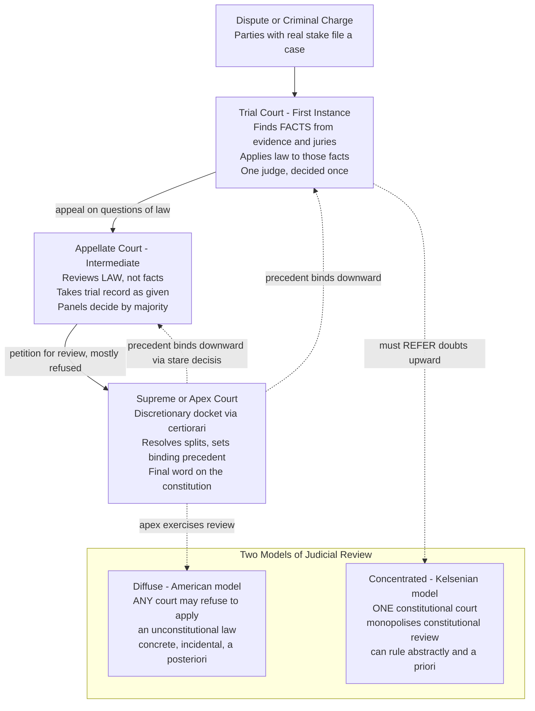

# ⚖️ Judicial Review and the Courts

> [!abstract] TL;DR
> Courts are the branch that resolves disputes by applying law to facts, arranged in a hierarchy that runs from **fact-finding trial courts**, through **law-reviewing appellate courts**, to an **apex court** whose rulings bind everyone. *Judicial review* is the extraordinary power of that apex — or, in the American "diffuse" model, of any court — to **strike down legislation and executive acts that violate the constitution**, established for the US in *Marbury v. Madison* (1803). This power creates the **countermajoritarian difficulty**: how can unelected judges legitimately overrule an elected legislature? The answer hinges on **judicial independence** (secure tenure, protected salary) and on a set of self-imposed limits — standing, justiciability, and the political-question doctrine — that keep the referee off the field.

---

## Intuition

**Analogy:** A court is the **referee** of the constitutional game. The players — the legislature and the executive — make moves (pass statutes, issue orders). The referee does not score goals and does not draft the rulebook; the referee's only job is to **blow the whistle when a move breaks the rules and declare it void**. Crucially, in a well-designed league the referee cannot be fired by the players mid-match for making a call they dislike — that protected status is exactly *judicial independence*, and it is what makes the whistle mean something. The referee also refuses to blow the whistle on plays that have not actually happened, or on questions the rulebook deliberately leaves to the players' own judgment — that self-restraint is *justiciability* and the *political-question doctrine*.

Now stack the referees. A **trial court** referee stands on the field and decides *what happened* — who fouled whom, which evidence to believe. An **appellate** referee never re-watches the live play; sitting above, they only decide *whether the field referee applied the rules correctly*. At the very top, the **apex court** referee's interpretation of the rulebook becomes the rulebook for every referee below. Judicial review is the moment a referee looks not at a player's move but at **a rule the rule-makers themselves wrote** and says: this rule contradicts the constitution, so it does not count.

---

## How It Works

### Core Mechanics

**1. The court system's role.** Courts perform three functions a legislature and executive cannot do for themselves: they **adjudicate** concrete disputes between named parties, they **interpret** ambiguous law authoritatively, and — where the power exists — they **police the constitutional boundaries** of the other branches. Courts are *reactive*: they act only when a party with a genuine grievance brings a live "case or controversy." They do not issue advisory opinions on hypothetical questions.

**2. Trial courts vs appellate courts — the fact/law divide.** This is the single most important structural distinction.

- **Trial courts** (courts of *first instance*) find **facts**. They hear witnesses, admit evidence, empanel juries, and apply the law to the facts they find. There is normally *one* judge and, in some systems, a jury. What happened is decided here, and it is decided *once*.
- **Appellate courts** review **law**, not facts. They take the trial record as given — they do not re-hear witnesses or admit new evidence — and ask a narrower question: *did the court below apply the correct legal rule correctly?* They sit in **panels** (three, five, or more judges) and decide by majority. Appellate courts give strong deference to the trial court's factual findings (reviewing them only for "clear error") but review pure questions of law afresh (*de novo*).

**3. The appeals process.** A losing party may appeal a question of law upward. Intermediate appellate courts usually must hear appeals brought as of right; the **apex court** (US Supreme Court, UK Supreme Court, India's Supreme Court) typically has a **discretionary docket** — it *chooses* which cases to hear (in the US, by granting a writ of *certiorari*), taking a few dozen of thousands of petitions to resolve the questions that most need settling, especially where lower courts disagree (a "circuit split"). Its ruling then binds every court beneath it through **stare decisis** (precedent).

**4. Judicial review.** The apex power. When a statute or executive act conflicts with the constitution, a court can declare it **void**. Chief Justice John Marshall's logic in *Marbury v. Madison* (1803) was syllogistic: the constitution is the *supreme* law; an ordinary statute repugnant to it is not law; and "it is emphatically the province and duty of the judicial department to say what the law is" — so a court faced with the conflict *must* apply the constitution and disregard the statute. Note that *Marbury* invented nothing textual: the US Constitution never mentions judicial review. Marshall *inferred* it from constitutional supremacy plus the judicial role.

**5. Two models of review — diffuse vs concentrated.**

- **American (diffuse / decentralized) model.** *Any* court, from a traffic court up, may decline to apply an unconstitutional law, but only *incidentally* — in the course of deciding a real case between parties. The ruling formally binds only the parties; its wider force comes through precedent. Review is *concrete* and *a posteriori* (after the law is in force).
- **European / Kelsenian (concentrated) model.** A *single* specialized **constitutional court** (Austria 1920, Germany's *Bundesverfassungsgericht* 1951, France's *Conseil constitutionnel*) holds a *monopoly* on constitutional review. Ordinary courts cannot strike down laws; they must **refer** constitutional doubts to it. Such courts can rule in the **abstract** — testing a law's validity directly, sometimes *before* it takes effect (a priori), on the application of politicians rather than litigants. Hans Kelsen designed this deliberately, seeing the constitutional court as a "negative legislator."

### Flow / Architecture



---

## Key Concepts

### Secondary Level

**Why do we need courts at all?** If two people disagree about who owns a field, or the state accuses someone of a crime, somebody neutral must decide — otherwise disputes are settled by force. Courts are that neutral decider. They come in a stack. The **lowest** court hears the witnesses and decides *what actually happened*. If you think that court got the *law* wrong, you can **appeal** to a higher court — but the higher court will not call the witnesses back; it only checks whether the rules were applied properly. At the very top sits the **supreme court**, whose decisions everybody else has to follow.

**Judicial review in one sentence:** the supreme court can look at a law passed by parliament, decide it breaks the constitution, and **cancel it**. The famous case that started this in America was *Marbury v. Madison* in 1803.

**Judicial independence:** so that judges can rule against the government without fear, they are given a **secure job** (often for life or until a fixed retirement age) and a **salary that cannot be cut**. A judge who could be fired or starved for an unpopular ruling would not really be neutral.

### Undergraduate Level

**The fact/law distinction, precisely.** An appellate court reviews questions of *law* de novo but reviews a trial judge's findings of *fact* only for clear error, and a jury's factual verdict is almost untouchable. This division of labor is why you cannot "re-try" a case on appeal — appeals are not a second bite at the factual apple.

**Standing and justiciability.** Judicial review is powerful precisely because courts hold it back. Doctrines of *justiciability* decide whether a court may hear a claim at all:

- **Standing** — the plaintiff must have suffered a concrete, particularized injury caused by the defendant and redressable by the court. A general grievance shared by all citizens is usually not enough.
- **Ripeness / mootness** — the dispute must be neither premature nor already resolved.
- **Political-question doctrine** — some issues are *textually committed* to the elected branches (conduct of foreign policy, impeachment procedures) and are deemed unfit for judicial resolution. The court declines not because the plaintiff loses but because it is *not the court's question*.

**Precedent and the apex court.** Under *stare decisis*, the apex court's holding binds all lower courts and, presumptively, itself. This gives the legal system predictability, but the apex court can *overrule* its own precedent (e.g., *Brown v. Board* overruling *Plessy v. Ferguson*), which is why apex appointments are so consequential — a single justice can shift settled doctrine.

**Judicial activism vs restraint.** *Restraint* counsels deference: strike a law only when its unconstitutionality is clear, respect precedent, and decide cases narrowly. *Activism* is the willingness to invalidate the acts of elected branches and to read the constitution expansively. Neither label is inherently liberal or conservative — the terms describe *how eagerly* a court intervenes, not *which side* it favors.

**The countermajoritarian difficulty.** Coined by Alexander Bickel (*The Least Dangerous Branch*, 1962): when an unelected court overturns a statute passed by an elected legislature, it "thwarts the will of the representatives of the actual people of the here and now." Why is that legitimate in a democracy? Standard answers: (a) the constitution itself, ratified by a supermajority, *authorizes* limits on ordinary majorities; (b) courts protect **discrete and insular minorities** whom majorities may trample (the famous *Carolene Products* footnote four); (c) judicial review upholds the pre-conditions of democracy itself — free speech, fair elections. The tension never fully dissolves; it is the central puzzle of constitutional theory.

### Graduate Level

**Models of judicial behavior.** Political scientists model *how* justices actually decide, and the models bear directly on judicial review:

- **Legal model** — justices decide by the law: text, precedent, original meaning. Predicts little variation across judges facing the same law.
- **Attitudinal model** (Segal & Spaeth) — justices, especially on an apex court with a discretionary docket and no fear of removal or promotion, vote their **sincere policy preferences**. A justice's ideal point on an ideological spectrum predicts their votes remarkably well. This reframes the court as a *voting body*, which invites the **median voter theorem**: on a one-dimensional issue, the **median justice** is pivotal and controls the outcome (see the demo below and [[Democracy_Types_and_Electoral_Systems]]).
- **Strategic (rational-choice) model** (Epstein & Knight, *The Choices Justices Make*) — justices are *sophisticated*, not sincere. They anticipate the reactions of colleagues, the other branches, and lower courts. A lower-court judge who dislikes reversal decides as the apex court *would*, which is precisely a **backward-induction** argument (see [[Backward_Induction]]): reason from the final ruling back to today's decision.

**The median justice as the pivotal voter.** Because the court decides by majority on a largely one-dimensional space, the outcome tracks the **median** member — exactly the "swing" or pivotal voter that voting-power indices formalize (see [[Power_Indices]]). This is why the retirement or replacement of *one* median justice (Powell, O'Connor, Kennedy on the modern US Court) can swing an entire line of doctrine, while replacing a justice already at the extreme changes almost nothing. **Composition determines outcomes** even when every justice's individual views are fixed.

**The global spread and the design of review.** Judicial review has diffused worldwide since 1945, especially after democratic transitions (Germany and Italy post-war, Spain and Portugal post-dictatorship, post-communist Central Europe, South Africa 1996, and a robust Indian model built on the "basic structure" doctrine that lets courts strike even constitutional *amendments*). Tom Ginsburg's "insurance theory" explains *why* politicians create strong courts that can overrule them: parties uncertain of staying in power entrench a court as **insurance** against a future majority. Judicial independence is thus partly an equilibrium of self-interested elites, not merely a normative ideal.

**Independence vs accountability — the core tension.** Independence is protected structurally: **secure tenure** (life or a long fixed term), a **salary that cannot be diminished**, and an **appointment process** insulated from day-to-day politics. But total independence risks an unaccountable oligarchy. Systems balance this with **appointment politics** (who nominates and confirms), **impeachment for misconduct** (not for unpopular rulings), **jurisdiction-stripping**, and the ultimate check — **constitutional amendment** to overturn a decision. The legitimacy of a high court rests on this fragile equilibrium: independent enough to rule against power, constrained enough to remain answerable to the constitutional order.

---

## Python Demo

```python
"""
The Median Justice is Decisive: the Median Voter Theorem applied to a court.

A multi-member appellate/supreme court decides each case by majority vote.
Model each justice as an ideal point on a one-dimensional ideological
spectrum (left = -1 ... right = +1), analogous to Martin-Quinn scores.

A case is summarised by a 'cutpoint' c on the same spectrum: the ideological
location that divides the two possible dispositions. A justice votes for the
'right-of-cutpoint' disposition when their ideal point lies to the right of c.
Under majority rule with single-peaked preferences on one dimension
(Black's median voter theorem), the MEDIAN justice is pivotal: the court's
outcome flips exactly when the case cutpoint crosses the median justice.

Requires: numpy, matplotlib
"""
import numpy as np
import matplotlib.pyplot as plt

# --- Three hypothetical nine-member benches (ideal points, left -1 .. right +1) ---
benches = {
    "Balanced bench":       np.array([-0.8, -0.6, -0.3, -0.1, 0.0, 0.2, 0.4, 0.6, 0.8]),
    "Conservative-leaning": np.array([-0.5, -0.2,  0.1,  0.3, 0.4, 0.5, 0.6, 0.7, 0.9]),
    "Liberal-leaning":      np.array([-0.9, -0.7, -0.6, -0.4, -0.3, -0.1, 0.1, 0.3, 0.6]),
}
colors = {"Balanced bench": "#7f8c8d",
          "Conservative-leaning": "#c0392b",
          "Liberal-leaning": "#2980b9"}


def court_outcome(ideal_points, cutpoint):
    """Return +1 if the court decides for the right-of-cutpoint disposition,
    else -1. A justice votes +1 when their ideal point lies right of the cutpoint."""
    n = len(ideal_points)
    votes_right = np.sum(ideal_points > cutpoint)
    return 1 if votes_right > n / 2 else -1


# --- Verify the median justice is decisive across every bench ---
cutpoints = np.linspace(-1, 1, 4001)
print("Is the outcome controlled by the median justice?")
print("=" * 62)
for name, bench in benches.items():
    med = np.median(bench)
    outcomes = np.array([court_outcome(bench, c) for c in cutpoints])
    flip_idx = np.argmax(np.diff(outcomes) != 0)     # first place the outcome flips
    flip_c = cutpoints[flip_idx]
    print(f"{name:<22} median justice = {med:+.2f}   "
          f"outcome flips at cutpoint approx {flip_c:+.2f}")

# --- Figure: composition on the left, decisiveness on the right ---
fig, (ax1, ax2) = plt.subplots(1, 2, figsize=(15, 6))

# (a) Ideological map of each bench, median highlighted
for i, (name, bench) in enumerate(benches.items()):
    ax1.scatter(bench, np.full_like(bench, i), s=110,
                color=colors[name], zorder=3, label=name)
    med = np.median(bench)
    ax1.scatter([med], [i], s=340, facecolors="none",
                edgecolors="black", linewidths=2.2, zorder=4)
    ax1.annotate("median\njustice", (med, i), xytext=(0, 28),
                 textcoords="offset points", ha="center", fontsize=8)
ax1.axvline(0, color="gray", ls=":", lw=1)
ax1.set_yticks(range(len(benches)))
ax1.set_yticklabels(list(benches.keys()))
ax1.set_xlabel("Ideological position   liberal  -1  ...  +1  conservative")
ax1.set_title("Composition of the bench and its median justice", fontweight="bold")
ax1.set_xlim(-1.15, 1.15)
ax1.set_ylim(-0.6, len(benches) - 0.2)
ax1.grid(True, axis="x", alpha=0.3)

# (b) Votes for the right-of-cutpoint disposition vs the case cutpoint
for name, bench in benches.items():
    votes = np.array([np.sum(bench > c) for c in cutpoints])
    ax2.plot(cutpoints, votes, color=colors[name], lw=2, label=name)
    ax2.axvline(np.median(bench), color=colors[name], ls="--", lw=1, alpha=0.7)
ax2.axhline(4.5, color="black", ls=":", lw=1.5)
ax2.text(-1.02, 4.65, "majority threshold  5 of 9", fontsize=9)
ax2.set_xlabel("Case cutpoint c on the ideological spectrum")
ax2.set_ylabel("Justices voting for the right-of-cutpoint disposition")
ax2.set_title("Outcome flips exactly at the median justice", fontweight="bold")
ax2.legend(loc="upper right", fontsize=9)
ax2.grid(True, alpha=0.3)

plt.tight_layout()
plt.savefig("median_justice_decisive.png", dpi=120, bbox_inches="tight")
print("\nSaved figure -> median_justice_decisive.png")
```

**What it shows.** For each nine-member bench, the point where the court's decision flips from one disposition to the other lands *exactly on the median justice's ideal point* — the eight non-median justices are, for the pivotal case, irrelevant. Shifting the bench's composition (left panel) slides the median, and with it the whole set of case outcomes the court will produce (right panel). This is the median voter theorem, and it is why replacing a *single* swing justice can redirect constitutional doctrine while replacing an already-extreme justice barely moves the needle.

---

## Real-World Applications

**United States — diffuse review and the swing justice.** Any US federal judge can hold a statute unconstitutional, but the Supreme Court has the last word. For decades the identity of the *median* justice (Lewis Powell, then Sandra Day O'Connor, then Anthony Kennedy) determined the outcome of the closest 5-4 cases on abortion, affirmative action, and gay rights — a live demonstration of the median-justice model. The 2016-2020 replacement of the median seat visibly shifted doctrine without any sitting justice changing their mind.

**Germany — the concentrated Kelsenian court.** The *Bundesverfassungsgericht* holds a monopoly on constitutional review: ordinary courts must refer constitutional doubts to it, and it can rule *abstractly* on a law's validity at the request of the federal government, a state government, or one-quarter of the Bundestag — before any litigant is ever harmed. It has struck down mass-surveillance laws and even reviewed European integration treaties, and is widely regarded as the world's most institutionally powerful constitutional court.

**United Kingdom — the limits of review.** Under parliamentary sovereignty, UK courts *cannot* strike down an Act of Parliament. The Human Rights Act 1998 gave them only a "declaration of incompatibility" — they flag a conflict but leave repeal to Parliament. This is a deliberately weaker, dialogic form of review that sidesteps the countermajoritarian difficulty by keeping the last word with the elected legislature.

**India — reviewing amendments themselves.** In *Kesavananda Bharati* (1973) the Supreme Court held that Parliament cannot amend the "basic structure" of the Constitution — the most muscular form of judicial review anywhere, letting the court invalidate not just statutes but *constitutional amendments*.

**Marbury as the template.** Every one of these systems traces its logic to Marshall's move in *Marbury*: constitutional supremacy plus the judicial duty to "say what the law is" equals the power to void repugnant law. Even where the text is silent, courts have inferred review from supremacy — see how this builds on constitutional supremacy in [[Sources_of_Law]] and separation of powers in [[Political_Institutions_and_Constitutions]].

---

## Common Pitfalls

- **Confusing appeal with retrial.** An appellate court does *not* re-hear witnesses or weigh new evidence. It reviews the *law*. Arguing "the jury believed the wrong witness" almost never wins on appeal, because factual findings get deference; only legal error is reviewed de novo.
- **Thinking the apex court reviews every case.** The US Supreme Court grants *certiorari* to roughly 1% of petitions. Most losing parties have no right to be heard there at all; the discretionary docket exists to settle broad legal questions, not to correct individual errors.
- **Equating judicial review with striking things down.** Most of the time review *upholds* the challenged act. Review is the *power* to invalidate; restraint means using it sparingly. Counting a court "activist" merely because it hears constitutional cases misreads the concept.
- **Treating "activism" as a synonym for a political side.** Activism vs restraint describes *how readily* a court overrides the elected branches, not whether it reaches liberal or conservative results. Both wings can be activist or restrained depending on the issue.
- **Assuming standing is a technicality.** Standing, ripeness, mootness, and the political-question doctrine are the load-bearing limits that make review compatible with democracy. A court that ignored them would become a roving super-legislature. Dismissals "on justiciability grounds" are substantive, not evasive.
- **Ignoring the median.** Reading a 5-4 decision as "the Court believes X" obscures that the *median justice* believed X and the other four in the majority may have reasoned entirely differently. Predicting a court means locating its median, not averaging its members.
- **Mistaking independence for unaccountability.** Secure tenure and protected salary shield rulings from retaliation, not judges from *misconduct* discipline. Independence protects the *decision*, not the *person* who breaks the law.

---

## Related Concepts

- [[Constitutional_Law_and_Structure]] — the constitution that judicial review enforces; separation of powers and constitutional supremacy are the premises of Marshall's argument in *Marbury*.
- [[Rule_of_Law_and_Due_Process]] — judicial independence and access to a neutral court are core rule-of-law guarantees; due process is one of the most-litigated grounds on which courts strike executive acts.
- [[Legal_Reasoning_and_Interpretation]] — how courts reason from constitutional text and precedent (stare decisis, ratio vs obiter) to the holdings that judicial review turns into binding law.
- [[Comparative_Constitutionalism]] — extends the diffuse-vs-concentrated distinction across jurisdictions, showing how different countries design and constrain their high courts.
- [[Administrative_Law_and_Regulation]] — the doctrinal home of standing, justiciability, and review of agency action, where the review power operates at highest volume.
- [[Sources_of_Law]] — judicial review is constitutional *supremacy* in action: a statute repugnant to the higher source (the constitution) is void by *lex superior*, and precedent is itself a source of law.
- [[Political_Institutions_and_Constitutions]] — the political-science treatment of separation of powers, checks and balances, and the court as a *veto player*; complements this note's legal framing of the same institutions.
- [[Power_Indices]] — the median/swing justice is precisely the **pivotal voter** that Shapley-Shubik and Banzhaf indices formalize; explains why one seat can hold outsized decisional power.
- [[Democracy_Types_and_Electoral_Systems]] — home of the **median voter theorem** (Black, Downs) that the demo applies to courts, plus McKelvey's chaos theorem showing why the median vanishes in multidimensional cases.
- [[Backward_Induction]] — the strategic model of judging: lower courts and sophisticated justices reason *backward* from the apex court's anticipated ruling to their present decision.
- [[Democratic_Backsliding_and_Polarization]] — court-packing, jurisdiction-stripping, and the capture of constitutional courts are central mechanisms by which independent judiciaries are hollowed out.
- [[Voting_Behavior_and_Electoral_Psychology]] — the attitudinal model treats justices as ideological voters, paralleling how ideology structures ordinary electoral choice.
- [[Regulatory_Politics_and_Administrative_Law]] — judicial review of *executive and agency* action (ultra vires, standing, the political-question line) is the everyday, high-volume face of the review power.

---

## Review Questions

### Secondary
1. A trial court and an appellate court both hear "the same case." What does each one actually decide, and why can you not simply ask the appellate court to call the witnesses back?
2. In *Marbury v. Madison*, what power did the Supreme Court claim for itself, and why do we say the Court "created" this power even though the Constitution never mentions it?

### Undergraduate
1. Explain the countermajoritarian difficulty. Give two distinct justifications for why an unelected court striking down a statute can nonetheless be democratically legitimate, and identify the strongest objection to each.
2. Compare the American diffuse model of judicial review with the European concentrated (Kelsenian) model along three axes: *who* may exercise review, *when* (a priori vs a posteriori), and whether review is *abstract* or *concrete*. Give a real country for each model.
3. A legislature dislikes a line of Supreme Court rulings. Enumerate the constitutional tools available to check the court *without* violating judicial independence, and explain which of them the doctrine of independence specifically forbids.

### Graduate
1. The attitudinal and strategic models make different predictions about judicial behavior. Design an empirical test that would distinguish them: what observable pattern of votes would favor the strategic (backward-induction) account over the sincere-voting attitudinal account, and why?
2. Using the median voter theorem, explain why the replacement of a court's median justice reshapes doctrine while the replacement of an extreme justice does not. Then state two realistic conditions under which the theorem *fails* to predict a court's behavior, and what replaces it.
3. Ginsburg's "insurance theory" holds that self-interested politicians create strong, independent courts as insurance against losing power. Model this as a strategic choice among rival parties uncertain of future control. Under what conditions does the insurance equilibrium collapse into court-capture instead — and how does this connect judicial independence to democratic backsliding?

---

## Sources

- *Marbury v. Madison*, 5 U.S. (1 Cranch) 137 (1803) — [Cornell Legal Information Institute](https://www.law.cornell.edu/supremecourt/text/5/137) — the foundational American judicial-review decision.
- Bickel, Alexander M. *The Least Dangerous Branch: The Supreme Court at the Bar of Politics* (Yale University Press, 1962) — origin of the "countermajoritarian difficulty."
- Kelsen, Hans. ["Judicial Review of Legislation: A Comparative Study of the Austrian and the American Constitution,"](https://www.jstor.org/stable/2125770) *The Journal of Politics*, Vol. 4, No. 2 (1942) — the concentrated constitutional-court model.
- Segal, Jeffrey A. & Spaeth, Harold J. *The Supreme Court and the Attitudinal Model Revisited* (Cambridge University Press, 2002) — justices as ideological voters and the pivotal median.
- Epstein, Lee & Knight, Jack. *The Choices Justices Make* (CQ Press, 1998) — the strategic (rational-choice) model of judicial decision-making.
- Ginsburg, Tom. *Judicial Review in New Democracies: Constitutional Courts in Asian Cases* (Cambridge University Press, 2003) — the global spread of review and the "insurance" theory.

---

#law #judicial-review #courts #supreme-court #marbury
