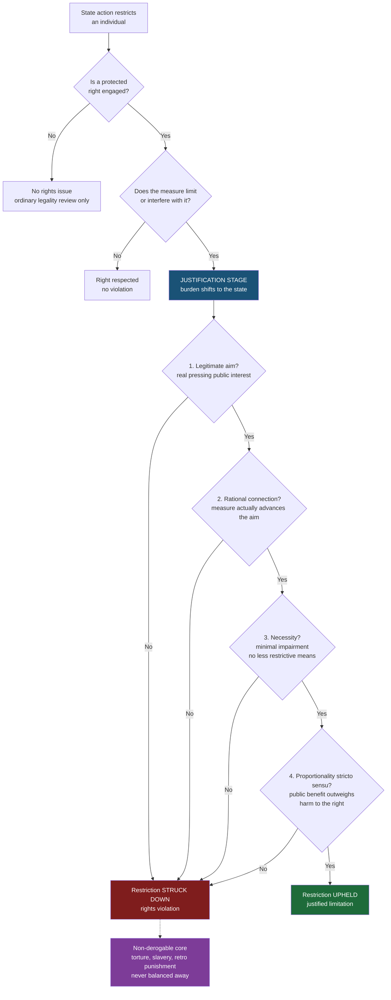

# ⚖️ Rights and Civil Liberties

> [!abstract] TL;DR
> Civil liberties are the protected freedoms an individual holds *against the state* — speech, religion, assembly, privacy, due process, and equal treatment — usually entrenched in a **bill of rights** (the US Bill of Rights, the European Convention on Human Rights, the Canadian Charter). They are almost never **absolute**: a right can be limited when a competing public interest justifies it, and courts test that justification with a structured method — the four-stage **proportionality test** (legitimate aim → rational connection → necessity/minimal impairment → proportionality *stricto sensu*) that now dominates worldwide, or the US **tiers of scrutiny** (rational basis, intermediate, strict). The whole field is the law of *where the individual ends and the state's authority begins*.

---

## Intuition

**Analogy — a fence with a locked gate.** Picture a fundamental right as a **fence around your garden** that even a powerful neighbour — the government — must respect. Ordinarily the state cannot walk in: it cannot tell you what to say, whom to pray to, or read your letters. But the fence has a **gate**, and the state may open it only by passing a strict, four-item checklist posted on the latch: *Is there a genuine public reason to come in? Will coming in actually solve that problem? Is there no gentler way to solve it? And is the good it does really worth the trampling it causes?* If the state fails any item, the gate stays shut and the intrusion is unlawful. If it passes all four, the entry is a **justified limitation**, not a violation.

That checklist is the **proportionality test**, and it turns "do you have a right?" (almost always yes) into the real legal question: **"is the state's reason for overriding it good enough?"** A right, in other words, is not an on/off switch but the *starting point of an argument the government has to win.*

---

## How It Works

### Core mechanics

A rights case is decided in **two stages**, and the burden shifts between them:

1. **Scope (the individual's burden).** Does the claimant hold a **protected right** (is it in the bill of rights or read into it), and does the state's measure actually **limit or interfere** with it? If no right is engaged, there is only ordinary legality review. This is where courts define *what counts as "speech" or "privacy."*
2. **Justification (the state's burden).** Once a limitation is shown, the **state must justify it**. Under the global model this is the **proportionality test**; under US doctrine it is a **tier of scrutiny** matched to the right or the classification.

**Civil liberties vs civil rights.** These are distinct even though people blur them. *Civil liberties* are **negative freedoms** — protections *from* government (do not censor me, do not search me without cause). *Civil rights* are claims to **equal treatment** — protection *against discrimination* by government and, increasingly, private actors (equal access to voting, housing, employment). One is freedom *from* the state; the other is a claim *on* the state for evenhandedness.

**Rights are not absolute — with a hard core.** Most rights are **qualified**: they can be limited for public order, safety, health, or the rights of others. A small set are **non-derogable / absolute** even in emergencies — the prohibition of torture, slavery, retroactive punishment, and (largely) the right to life. Qualified rights carry an explicit **limitation clause**: the ECHR permits interference that is "*prescribed by law*," pursues a "*legitimate aim*," and is "*necessary in a democratic society*" — the textual hook for proportionality.

**The two dominant justification frameworks:**

- **Proportionality (global standard).** Four sequential prongs — legitimate aim, rational connection, necessity/minimal impairment, and proportionality in the strict sense (a final cost-benefit weighing). Used by Canada (the *Oakes* test), Germany, the European Court of Human Rights, South Africa, India, Israel, and the EU.
- **Tiers of scrutiny (US model).** The court picks an intensity of review: **rational basis** (deferential — almost always upheld), **intermediate scrutiny** (must serve an important interest and be substantially related to it), or **strict scrutiny** (a *compelling* interest, *narrowly tailored*, using the *least restrictive means* — "strict in theory, fatal in fact"). Strict scrutiny attaches to content-based speech restrictions and "suspect classifications" like race.

**Derogation and emergency powers.** In a genuine public emergency, states may **derogate** — temporarily suspend qualified rights — under ECHR Art. 15 or ICCPR Art. 4, but only to the extent *strictly required*, and never for the non-derogable core.

**Horizontal effect.** Rights primarily bind the **state** (vertical effect). Whether they reach **private actors** — an employer, a landlord, a social platform — is the problem of **horizontal effect** (German *Drittwirkung*): usually *indirect*, filtered through statutes and the way courts interpret private-law duties, rather than a citizen suing another citizen directly on the constitution.

### Flow / Architecture



---

## Key Concepts

### Secondary Level

**What a civil liberty is.** A **civil liberty** is a freedom the state must not invade without justification. The classic catalogue, recurring across every modern bill of rights:

| Liberty | Core protection | Typical limits |
|---|---|---|
| **Speech / expression** | Say, print, publish, protest, create | Incitement to violence, true threats, defamation, fraud |
| **Religion** | Believe, worship, manifest (or not) | Neutral laws of general application; harm to others |
| **Assembly & association** | Gather, protest, form unions/parties | Time-place-manner rules; public safety |
| **Privacy** | Home, body, data, communications | Warrant on cause; proportionate surveillance |
| **Due process / fair trial** | Notice, hearing, impartial court, presumption of innocence | Very limited; core is near-absolute |
| **Equality / non-discrimination** | Equal protection of the law | Justified distinctions passing scrutiny |

**Bills of rights.** A *bill of rights* is an entrenched list of protected freedoms that ordinary legislation cannot override. Three landmark texts:
- **US Bill of Rights (1791)** — the first ten amendments; the First (speech, religion, assembly, press), Fourth (searches), Fifth/Fourteenth (due process, equal protection). Enforced by **judicial review** since *Marbury v. Madison* (1803).
- **European Convention on Human Rights (ECHR, 1950)** — a *treaty* enforced by the European Court of Human Rights in Strasbourg; Art. 8–11 rights (privacy, religion, expression, assembly) each carry a limitation clause requiring interference to be "necessary in a democratic society."
- **Canadian Charter of Rights and Freedoms (1982)** — s. 1 guarantees rights subject to "reasonable limits... demonstrably justified in a free and democratic society," the textual home of the *Oakes* proportionality test.

**Rights are not absolute.** Almost every liberty is *qualified* — it yields where a strong enough competing interest is at stake (public safety, health, the rights of others). A handful are *absolute*: the ban on **torture**, **slavery**, and **retroactive criminal law** cannot be balanced away even in war or emergency.

**Free speech and its limits.** The classic justification is **the marketplace of ideas** (Holmes, *Abrams* dissent, 1919): truth emerges from open competition of views, so even offensive or false speech is protected. But the market has fences — **incitement** to imminent violence, **defamation** (false factual claims that damage reputation), **true threats**, and fraud fall outside protection because they cause direct harm rather than contribute to debate.

### Undergraduate Level

**The proportionality test — four prongs.** The dominant global method for adjudicating a qualified right, in strict sequence (fail one, fail all):

1. **Legitimate aim** — the restriction must serve a genuinely important public purpose (safety, health, others' rights). "Protecting the government from criticism" is *not* legitimate.
2. **Rational connection (suitability)** — the measure must actually be capable of advancing that aim; a restriction that does nothing to solve the problem fails here.
3. **Necessity / minimal impairment** — there must be **no less restrictive means** that would achieve the aim comparably well. This is where over-broad, blanket measures die even when well-intentioned.
4. **Proportionality *stricto sensu*** — a final **cost-benefit weighing**: the marginal public benefit must outweigh the marginal harm to the right. This is the explicit *balancing* stage.

**US tiers of scrutiny** — the American alternative to a single proportionality standard:

| Tier | Trigger | Government must show | Practical result |
|---|---|---|---|
| **Rational basis** | Ordinary economic/social laws | *Legitimate* interest, *rationally* related | Almost always upheld |
| **Intermediate** | Gender; content-neutral speech rules; commercial speech | *Important* interest, *substantially* related | Fact-dependent |
| **Strict** | Race classifications; content-based speech; fundamental rights | *Compelling* interest, *narrowly tailored*, *least restrictive means* | Usually fatal to the law |

**Limitation clauses vs categorical rules.** The ECHR/Charter style asks case-by-case whether an interference is "necessary in a democratic society" — an open balancing. US First Amendment doctrine leans **categorical**: it defines *unprotected categories* (incitement, obscenity, true threats) and then protects everything else near-absolutely, distrusting ad hoc balancing of speech.

**Landmark speech doctrines.** *Brandenburg v. Ohio* (1969) narrowed punishable incitement to speech "directed to inciting... imminent lawless action" and "likely to produce" it. *New York Times v. Sullivan* (1964) made public-figure defamation require **"actual malice"** (knowing or reckless falsity), protecting robust criticism of officials.

**Derogation and emergency powers.** ECHR Art. 15 and ICCPR Art. 4 let states suspend qualified rights "*in time of war or other public emergency threatening the life of the nation*," but only *to the extent strictly required* and never the non-derogable core. Courts still police whether an emergency is genuine and the response proportionate (e.g. the UK Belmarsh case, *A v. Home Secretary* 2004).

### Graduate Level

**Positive vs negative rights, and positive obligations.** A **negative right** requires the state to *refrain* (do not censor, do not torture). A **positive right** requires the state to *provide or protect* (education, health, an effective investigation). Even classically "negative" rights generate **positive obligations**: the ECtHR reads the right to life (Art. 2) as requiring the state to *protect* people from known threats and to *investigate* deaths — collapsing the neat negative/positive dichotomy.

**Horizontal effect (*Drittwirkung*).** Do constitutional rights bind private parties? *Direct* horizontal effect (citizen sues citizen on the constitution) is rare. *Indirect* horizontal effect is common: the German *Lüth* case (1958) held that constitutional values "radiate" into private law, so courts must interpret contract and tort in their light. In the US, the **state action doctrine** mostly confines the Bill of Rights to government — which is why a private platform removing speech is generally not "censorship" in the constitutional sense.

**Balancing rights against *each other*.** Not all conflict is right-vs-state; often it is **right-vs-right** — free press vs privacy, religious liberty vs anti-discrimination, protest vs public order. Proportionality supplies the structure, but the hard cases (e.g. *Von Hannover v. Germany*, press freedom vs a public figure's private life) turn on how courts weigh incommensurable interests. This is the deepest critique of balancing: rights may be **incommensurable**, and reducing them to a common scale (Alexy's "weight formula") can smuggle judicial value choices under a veneer of arithmetic.

**Rights as "trumps" vs proportionality.** Dworkin argued a genuine right is a **trump** — it cannot be overridden merely because doing so maximises aggregate welfare. Proportionality's balancing stage sits in tension with this: it *does* weigh the right against collective benefit. The reconciliation is that proportionality demands a *pressing* justification and shifts the burden to the state, so the right still has special weight — but critics (Habermas, Webber) warn that routine "balancing" can erode rights into mere interests.

**The counter-majoritarian difficulty.** Entrenched rights + judicial review let *unelected judges* strike down *democratically enacted laws* (Bickel's phrase). Proportionality is partly a response: by demanding transparent, staged reasoning, it disciplines judicial discretion and makes the trade-off auditable, rather than leaving rights to raw judicial fiat — though whether it truly constrains or merely rationalises remains contested (see comparative constitutionalism debates on the global "migration" of proportionality).

---

## Python Demo

```python
# Modelling the courts' "balancing test": a proportionality analysis as a scored
# decision procedure, then a balance-scale visualisation of when a restriction on
# a right is UPHELD vs STRUCK DOWN. numpy + matplotlib only.
#
# The four proportionality prongs are applied in strict sequence (fail one -> fail all):
#   1. legitimate_aim        (gate: True/False)
#   2. rational_connection   (0..1, must clear a threshold)
#   3. minimal_impairment    (0..1, necessity: were there less restrictive means?)
#   4. benefit vs harm       (proportionality stricto sensu: net public benefit > 0)

import numpy as np
import matplotlib.pyplot as plt
import matplotlib.gridspec as gridspec

RC_THRESH = 0.5   # rational-connection threshold
MI_THRESH = 0.5   # minimal-impairment (necessity) threshold

scenarios = [
    dict(name="Ban on incitement to\nimminent violence",
         legitimate_aim=True,  rational_connection=0.90, minimal_impairment=0.85,
         benefit=8.5, harm=2.0),
    dict(name="Blanket ban on\ncriticising the govt",
         legitimate_aim=False, rational_connection=0.40, minimal_impairment=0.10,
         benefit=1.0, harm=9.0),
    dict(name="Mass retention of ALL\ncitizens' communications",
         legitimate_aim=True,  rational_connection=0.60, minimal_impairment=0.20,
         benefit=7.0, harm=5.5),
    dict(name="Protest curfew zone\nnext to a hospital",
         legitimate_aim=True,  rational_connection=0.80, minimal_impairment=0.75,
         benefit=6.0, harm=3.5),
    dict(name="Emergency ban on mass\ngatherings (pandemic)",
         legitimate_aim=True,  rational_connection=0.85, minimal_impairment=0.65,
         benefit=7.5, harm=5.0),
]


def analyse(s):
    """Apply the four prongs in order; return (verdict, decisive_reason)."""
    if not s["legitimate_aim"]:
        return "STRUCK DOWN", "prong 1: no legitimate aim"
    if s["rational_connection"] < RC_THRESH:
        return "STRUCK DOWN", "prong 2: not rationally connected"
    if s["minimal_impairment"] < MI_THRESH:
        return "STRUCK DOWN", "prong 3: less restrictive means exist"
    if s["benefit"] <= s["harm"]:
        return "STRUCK DOWN", "prong 4: harm outweighs benefit"
    return "UPHELD", "all four prongs satisfied"


# ---- text report -------------------------------------------------------------
print("PROPORTIONALITY ANALYSIS  (right vs competing public interest)")
print("=" * 78)
for s in scenarios:
    verdict, reason = analyse(s)
    net = s["benefit"] - s["harm"]
    print(f"\n{s['name'].replace(chr(10), ' ')}")
    print(f"  aim={'legit' if s['legitimate_aim'] else 'ILLEGIT':7} "
          f"rational={s['rational_connection']:.2f}  "
          f"necessity={s['minimal_impairment']:.2f}  "
          f"benefit={s['benefit']:.1f} harm={s['harm']:.1f} net={net:+.1f}")
    print(f"  --> {verdict}  ({reason})")

# The key teaching case is 'Mass retention': net benefit is POSITIVE (+1.5) yet it
# is STRUCK DOWN, because the necessity prong fails -- balancing is not the only test.

# ---- balance-scale visualisation --------------------------------------------
def draw_scale(ax, s, verdict):
    """Draw a tilting balance: benefit pan (right) vs harm pan (left)."""
    benefit, harm = s["benefit"], s["harm"]
    net = benefit - harm
    max_tilt = np.deg2rad(26)
    theta = np.clip(net * 0.06, -1, 1) * max_tilt   # +net -> right (benefit) side lower
    L = 1.0
    rx, ry = L * np.cos(theta), -L * np.sin(theta)  # right end (benefit)
    lx, ly = -L * np.cos(theta), L * np.sin(theta)  # left end (harm)
    upheld = verdict == "UPHELD"
    beam_c = "#1e6b3a" if upheld else "#b31d1d"

    ax.plot([0, 0], [-1.25, 0], color="#444", lw=3)                 # stand
    ax.fill([-0.22, 0.22, 0], [-1.25, -1.25, 0], color="#888")      # fulcrum
    ax.plot([lx, rx], [ly, ry], color=beam_c, lw=5, solid_capstyle="round")  # beam
    for (ex, ey, val, lab, c) in [(lx, ly, harm, "harm", "#c0392b"),
                                  (rx, ry, benefit, "benefit", "#2471a3")]:
        ax.plot([ex, ex], [ey, ey - 0.4], color="#555", lw=1)       # hanger
        ax.plot([ex - 0.22, ex + 0.22], [ey - 0.4, ey - 0.4], color=c, lw=6)  # pan
        ax.text(ex, ey - 0.62, f"{lab}\n{val:.1f}", ha="center", va="top", fontsize=8)

    ax.set_title(f"{s['name']}\n{verdict}", fontsize=9,
                 color=beam_c, fontweight="bold")
    ax.set_xlim(-1.7, 1.7); ax.set_ylim(-1.9, 0.9); ax.axis("off")


results = [analyse(s)[0] for s in scenarios]
n = len(scenarios)

fig = plt.figure(figsize=(15, 7))
gs = gridspec.GridSpec(2, n, height_ratios=[2.3, 1.0], hspace=0.55)

for i, (s, v) in enumerate(zip(scenarios, results)):
    draw_scale(fig.add_subplot(gs[0, i]), s, v)

# bottom panel: net public benefit (benefit - harm), coloured by final verdict
axb = fig.add_subplot(gs[1, :])
nets = np.array([s["benefit"] - s["harm"] for s in scenarios])
colors = ["#1e6b3a" if v == "UPHELD" else "#b31d1d" for v in results]
xs = np.arange(n)
axb.bar(xs, nets, color=colors, edgecolor="black")
axb.axhline(0, color="black", lw=1)
for x, netv, v in zip(xs, nets, results):
    axb.text(x, netv + (0.3 if netv >= 0 else -0.6), f"{netv:+.1f}",
             ha="center", fontsize=9, fontweight="bold")
axb.set_xticks(xs)
axb.set_xticklabels([s["name"].replace("\n", " ") for s in scenarios],
                    fontsize=7, rotation=8)
axb.set_ylabel("net public benefit\n(benefit - harm)", fontsize=9)
axb.set_title("Balancing stage only -- note the +1.5 case still STRUCK DOWN "
              "(necessity prong failed)", fontsize=9)
axb.spines[["top", "right"]].set_visible(False)

fig.suptitle("Proportionality: when may the state limit a fundamental right?",
             fontsize=13, fontweight="bold")
plt.tight_layout(rect=[0, 0, 1, 0.96])
plt.savefig("proportionality_balance.png", dpi=130, bbox_inches="tight")
print("\nSaved figure -> proportionality_balance.png")
```

**What it shows.** Three restrictions are **upheld** (narrow incitement ban, hospital protest zone, temporary pandemic assembly ban) and two are **struck down**. The illegitimate "ban on criticising the government" fails at **prong 1**. The crucial lesson is the **mass-retention** scenario: its net public benefit is *positive* (+1.5), so a naive "does it help more than it hurts?" test would uphold it — yet proportionality **strikes it down at the necessity prong**, because targeted, less-restrictive surveillance would achieve the security aim without blanket intrusion into everyone's privacy. Balancing (prong 4) is *never reached* once an earlier prong fails, which is exactly how real courts stop well-meaning but over-broad measures.

---

## Real-World Applications

**Free speech — Brandenburg v. Ohio (US, 1969).** The Supreme Court held that even advocacy of violence is protected *unless* it is "directed to inciting or producing **imminent lawless action** and is **likely** to produce" it. This narrow, speech-protective line is why the US tolerates far more extreme speech than Europe — a categorical rule rather than case-by-case balancing.

**Proportionality's charter — R v. Oakes (Canada, 1986).** Interpreting s. 1 of the Charter, the Supreme Court of Canada laid out the canonical proportionality structure (pressing objective; rational connection; minimal impairment; proportionate effect). The **Oakes test** was exported worldwide and, alongside German *Verhältnismäßigkeit*, became the template the ECtHR, South Africa, India, and Israel adopted — the single most successful "migration" in comparative constitutionalism.

**Necessary in a democratic society — Handyside v. UK (ECtHR, 1976).** Upholding the obscenity conviction of a publisher, the Strasbourg Court articulated the **margin of appreciation** (states get latitude on morals) *and* insisted expression protects ideas "that offend, shock or disturb." It shows the European style: an explicit, structured balancing under Art. 10's limitation clause rather than an American-style category.

**Privacy vs surveillance — Carpenter v. US (2018) & the EU Data Retention cases.** *Carpenter* held that accessing historical cell-site location data is a Fourth Amendment "search" needing a warrant. In the EU, the Court of Justice struck down **blanket** data-retention regimes (*Digital Rights Ireland* 2014; *Tele2/Watson* 2016) precisely on the **necessity** prong — general, indiscriminate retention is disproportionate even for fighting serious crime. This is the real-world twin of the Python demo's mass-retention case.

**Emergency & derogation — A v. Home Secretary (UK Belmarsh, 2004).** The House of Lords held that indefinite detention of foreign terror suspects, though enacted under an ECHR Art. 15 derogation, was **disproportionate and discriminatory** — a court refusing to treat "emergency" as a blank cheque, and enforcing the equality dimension against the state.

---

## Common Pitfalls

- **Conflating civil liberties with civil rights.** *Liberties* are freedoms *from* the state (do not censor me); *civil rights* are claims to *equal treatment* and against discrimination. A censorship case and a voting-discrimination case are different animals with different tests.
- **Assuming rights are absolute.** Almost all are *qualified* and can be limited on adequate justification. Only a small non-derogable core (torture, slavery, retroactive punishment) truly resists balancing — treating *every* right as absolute misstates the law.
- **Thinking "benefit outweighs harm" is the whole test.** That is only **prong 4**. A measure can produce net social benefit and still be **struck down** on **necessity** (prong 3) if a less-restrictive means exists — the classic trap in surveillance and public-health law.
- **Treating US tiers of scrutiny as identical to proportionality.** Strict scrutiny is more **categorical and near-fatal**; proportionality is a graduated, four-stage weighing. Mapping one onto the other hides real doctrinal differences (e.g. the US distrust of open balancing for speech).
- **Assuming rights bind private actors automatically.** Constitutional rights primarily bind the **state** (vertical / state-action). A private employer or platform is usually reached only *indirectly*, through statutes and rights-inflected interpretation of private law — not by suing directly on the constitution.
- **Reading "free speech" as protecting all speech.** Incitement to imminent violence, true threats, defamation, and fraud sit *outside* protection because they cause direct harm; "the marketplace of ideas" defends debate, not every utterance.
- **Confusing the two "negative/positive" distinctions.** *Negative vs positive liberty* (Berlin — freedom-from vs freedom-to) is not the same as *negative vs positive rights* (duty to refrain vs duty to provide). Even negative rights now generate **positive obligations** to protect and investigate.

---

## Related Concepts

- [[Liberty_and_Rights]] — the philosophical engine room: Mill's harm principle, Berlin's negative/positive liberty, natural vs legal rights, and rights as Dworkinian "trumps" all underlie the doctrine here.
- [[Human_Rights_and_International_Law]] — the international layer (UDHR, ICCPR/ICESCR, ECHR machinery, derogation under ICCPR Art. 4); domestic civil liberties are the national reflection of these treaty rights.
- [[Justice_and_Rawls]] — Rawls's lexically prior "equal basic liberties" is the theory of *why* a bill of rights sits above ordinary politics; connects to equality and equal protection.
- [[Liberalism_and_Its_Variants]] — classical liberalism generates first-generation civil-political liberties (the ICCPR/Bill-of-Rights core); social liberalism grounds positive rights and anti-discrimination claims.
- [[Political_Institutions_and_Constitutions]] — bills of rights, entrenchment, and **judicial review** are the institutional hardware that makes rights enforceable against legislatures.
- [[Political_Participation_and_Civil_Society]] — freedoms of **assembly and association** are the operational core of protest, unions, parties, and civil society.
- [[Authoritarianism_and_Hybrid_Regimes]] — how "emergency" derogations, over-broad public-order laws, and shrinking associational space are used to hollow out liberties while keeping their form.
- [[Democracy_Types_and_Electoral_Systems]] — the **counter-majoritarian difficulty**: entrenched rights deliberately place some questions beyond majority vote.
- [[Social_Contract_Theory]] — Locke's natural rights and Rousseau's popular sovereignty are the founding justification for limits on state power over the individual.
- [[The_Social_Contract]] — the philosophical origin of the freedoms the contract is meant to secure and the authority it legitimises.
- [[Equality_Marxism_and_Anarchism]] — the critique that "formal" liberties mask real domination, and the case for positive/economic rights.

> Companion notes planned for this Law vault — **Rights, Duties and Legal Concepts** (Hohfeldian analysis of rights), **Constitutional Law and Structure**, **Rule of Law and Due Process**, **Human Rights Law**, and **Privacy Law** — should be wikilinked here once created.

---

## Review Questions

### Secondary

1. Distinguish a **civil liberty** from a **civil right** and give one concrete example of each. Which one is a "freedom *from* the state" and which is a "claim *on* the state for equal treatment"?
2. Name three of the classic liberties and, for each, one legitimate limit the state might impose. Why is defamation *not* protected speech even in a free-speech regime?
3. What is a **bill of rights**, and what makes the entrenched rights in one harder to remove than an ordinary statute? Name two real examples.

### Undergraduate

1. Walk through the **four prongs of the proportionality test** using a real or invented restriction on freedom of assembly. At which prong is your restriction most likely to fail, and why is the *order* of the prongs important?
2. A government defends mass communications-data retention by showing it produces net public benefit. Using the necessity/minimal-impairment prong, explain how a court could still strike it down — and connect this to the EU data-retention rulings.
3. Compare the **US tiers of scrutiny** with **proportionality**. Give one situation where the two frameworks would likely reach *different* results for the same speech restriction, and explain why.

### Graduate

1. "Balancing rights against competing interests reduces incommensurable goods to a common scale and smuggles judicial value choices under a veneer of arithmetic." Evaluate this critique of proportionality (Alexy's weight formula vs Habermas/Webber). Does Dworkin's "rights as trumps" offer a better model, or does it collapse under hard cases of right-vs-right conflict?
2. Explain the problem of **horizontal effect**. Contrast the German *Lüth* approach (indirect radiation of rights into private law) with the US **state-action doctrine**, and assess which better handles powerful private actors such as dominant online platforms.
3. Under what conditions may a state **derogate** from qualified rights in an emergency, and what stops derogation from becoming a blank cheque? Use *A v. Home Secretary* (Belmarsh) to discuss how courts police genuineness, proportionality, and the non-derogable core.

---

## Sources

- [Aharon Barak, *Proportionality: Constitutional Rights and Their Limitations*, Cambridge University Press, 2012](https://www.cambridge.org/core/books/proportionality/1B5F0F0B7E3E9F1F0E2E9F0E2E9F0E2E)
- [*R v. Oakes*, [1986] 1 SCR 103 — Supreme Court of Canada (the proportionality/Oakes test)](https://scc-csc.lexum.com/scc-csc/scc-csc/en/item/117/index.do)
- [*Brandenburg v. Ohio*, 395 U.S. 444 (1969) — incitement / imminent lawless action](https://supreme.justia.com/cases/federal/us/395/444/)
- [*Handyside v. United Kingdom*, ECtHR (1976) — "necessary in a democratic society" and the margin of appreciation](https://hudoc.echr.coe.int/eng?i=001-57499)
- [European Convention on Human Rights — full text (Council of Europe)](https://www.echr.coe.int/documents/d/echr/convention_ENG)
- [Robert Alexy, *A Theory of Constitutional Rights*, Oxford University Press, 2002](https://global.oup.com/academic/product/a-theory-of-constitutional-rights-9780199584239)

---

#law #civil-liberties #rights #free-speech #proportionality
