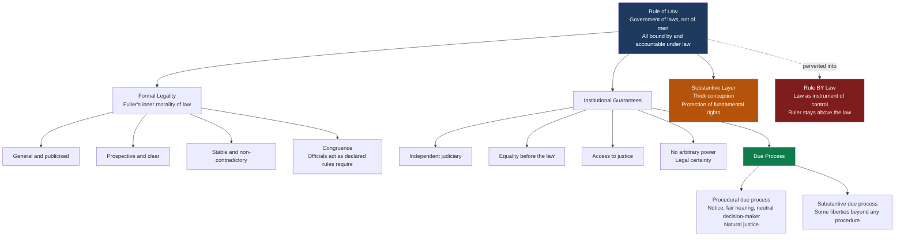

# ⚖️ Rule of Law and Due Process

> [!abstract] TL;DR
> The **rule of law** is the principle that everyone — private citizen and president alike — is subject to and accountable under general laws that are public, prospective, stable, and applied equally by an independent judiciary: "a government of laws, not of men." **Due process** is its procedural engine: before the state deprives you of life, liberty, or property, you are entitled to fair notice, a genuine hearing, and a neutral decision-maker. The deepest fault line in the field is whether the rule of law demands only *formal legality* (thin) or also *just outcomes and human rights* (thick).

---

## Intuition

**Analogy:** Picture a **serious game — say a championship football match**. Three things make it a real game rather than a brawl. First, the **rules are written down and known before kickoff**; the referee cannot invent a new offence at halftime and apply it to a goal already scored. Second, the **rules bind everyone equally** — the star striker and the substitute are penalised by the same offside line, and crucially *the referee is also bound by the rulebook*, not free to award goals on a whim. Third, disputes are settled by a **neutral official** who did not bet on either team and gains nothing from the outcome. Remove any one of these and the "game" becomes a rigged spectacle: if the powerful player is exempt, if the rules change retroactively, or if the referee is on one team's payroll, the players stop trusting the field and either quit or start cheating themselves.

That is exactly what the rule of law does for a society. The laws are the rulebook — knowable in advance, applied to governors and governed alike; the independent court is the neutral referee; and **due process** is the guarantee that before you are sent off, someone will actually tell you the charge and let you state your case. A government that can rewrite the rules mid-play, exempt itself, or appoint a captive referee is not governed *by* law even if it is drowning in statutes — it merely rules *by* law, using legality as a weapon rather than a constraint.

---

## How It Works

### Core Mechanics

The rule of law is not a single rule but a **bundle of constraints on power**, assembled from three overlapping traditions.

1. **Dicey's constitutional formulation (1885).** A.V. Dicey gave the phrase its modern anglophone shape with three propositions: (a) **supremacy of regular law** — no one may be punished except for a distinct breach of law established in the ordinary courts, which rules out arbitrary or discretionary power; (b) **equality before the law** — every official, from constable to prime minister, is subject to the same ordinary law and the same ordinary courts as the citizen; (c) the constitution is the **result** of the ordinary law — rights emerge from concrete court decisions rather than from an abstract charter.

2. **Fuller's inner morality of law (1964).** Lon Fuller argued that legality has an internal *morality* — eight procedural virtues a system must broadly satisfy to count as law at all. Rules must be **general** (not ad hoc commands), **publicised** (you can find out what they are), **prospective** (not retroactive), **clear**, **non-contradictory**, **possible to comply with**, **stable** over time, and **congruent** — the rules the officials actually enforce must match the rules they declared. A "system" failing all eight is not bad law; it is no legal system at all.

3. **Institutional guarantees.** On top of these formal virtues sit the load-bearing institutions: an **independent judiciary** that can rule against the government, **legal certainty** and **non-retroactivity** so people can plan, **access to justice** so rights are real not theoretical, and the absence of **arbitrary power** — every exercise of state coercion must trace back to a legal authorisation. See [[Political_Institutions_and_Constitutions]] for how separation of powers operationalises this.

**Thin vs thick.** The formal (thin) conception — associated with **Joseph Raz** — holds that the rule of law is a distinct *virtue of a legal system*, like the sharpness of a knife: it makes law effective and predictable but is **morally neutral about content**. On this view a legal system can conform excellently to the rule of law and still be wicked, and — Raz's famous provocation — the rule of law is "just one of the virtues a legal system may possess," not a charter of the good society. The substantive (thick) conception — associated with **Tom Bingham**, Ronald Dworkin, and most human-rights lawyers — insists the rule of law also requires that the law *protect fundamental rights* and deliver just outcomes; a regime of clear, stable, equally-applied apartheid statutes does not, on this view, satisfy the rule of law.

**Due process** is where the rule of law meets the individual. **Procedural due process** asks *how* the state may act: it guarantees **notice** of the case against you, an opportunity to be **heard** before an impartial tribunal, and a **neutral decision-maker** — the common-law tradition calls this **natural justice** (*audi alteram partem*, "hear the other side," and *nemo iudex in causa sua*, "no one a judge in their own cause"). **Substantive due process** asks *whether* the state may act at all — placing certain liberties beyond the reach of any procedure, however fair.

**Rule of law vs rule by law.** The critical inversion: authoritarian systems are often *saturated* with law. **Rule by law** uses statutes and courts as instruments to control the population and legitimise the ruler, while the ruler remains **above** the law. The rule of law requires the opposite — that the sovereign is **bound** by it. See [[Authoritarianism_and_Hybrid_Regimes]].

### Flow / Architecture



---

## Key Concepts

**Secondary / High-school level.** The big idea is *nobody is above the law* — not the king, not the president, not the police. The same rules apply to everybody, they are written down in advance so you know them, and if the government wants to punish you it first has to tell you what you did wrong and let you explain your side in front of a fair judge. That fairness guarantee is called **due process**. A country can have thousands of laws and still fail this test if the rulers can ignore the laws whenever they want — that is called **rule *by* law**, and it is the opposite of the **rule *of* law**.

**Undergraduate level.** Learn the three canonical framings and how they differ. **Dicey**: supremacy of regular law, equality before the law, constitution as the product of ordinary case law. **Fuller**: the eight principles of legality (generality, publicity, prospectivity, clarity, non-contradiction, possibility of compliance, stability, congruence) as the *inner morality of law*. **Raz**: the rule of law as a formal, content-neutral virtue — a sharp knife can carve or kill. Master the **thin/formal vs thick/substantive** debate: does the rule of law require human rights and just outcomes, or only well-made rules fairly applied? Then map **due process**: distinguish **procedural** (notice, hearing, neutral arbiter — the machinery of *natural justice*) from **substantive** (limits on the *content* of what law may do). Finally, be able to explain why an independent judiciary, legal certainty, and non-retroactivity are not optional extras but structural preconditions.

**Graduate / professional level.** Interrogate the contested seams. (1) **Is the thin conception stable?** Raz concedes the rule of law can coexist with grave injustice; critics reply that congruence and equality already smuggle in substantive commitments, collapsing the thin/thick line. (2) **The measurement problem.** The **World Justice Project (WJP)** operationalises the rule of law across eight factors — constraints on government powers, absence of corruption, open government, fundamental rights, order and security, regulatory enforcement, civil justice, and criminal justice — treating it as a *multidimensional continuum*, not a binary. What are the validity risks of collapsing a normative concept into an index built from expert coding and household surveys? (3) **Development and causation.** North, Weingast, and later Acemoglu and Robinson argue rule of law and secure property rights *cause* long-run growth by solving the sovereign's commitment problem — but is the arrow reversed, with wealth buying better institutions? See [[Development_Economics]]. (4) **Emergency and derogation.** How do states of emergency, executive orders, and anti-terror powers test congruence and non-arbitrariness — and when does *rule by law* masquerade as emergency rule of law? (5) **Substantive due process** as a jurisprudential minefield: from economic-liberty overreach to modern privacy and autonomy rights, unelected judges reading unenumerated rights into a due-process clause raises acute counter-majoritarian questions — connect to [[Justice_and_Rawls]] and [[Liberty_and_Rights]].

---

## Python Demo

```python
# Operationalises the rule of law as a MULTIDIMENSIONAL index (not a binary),
# scoring four archetypal jurisdictions across the eight World Justice Project
# factors, then comparing them with a radar plot and an overall-index bar chart.
# The point: a regime can score HIGH on "order and security" while scoring near
# zero on "constraints on government powers" -- that jagged profile is the
# signature of "rule BY law," which a single yes/no label would completely hide.
import numpy as np
import matplotlib.pyplot as plt

# --- The eight WJP rule-of-law factors ---
factors = [
    "Constraints on\nGovt Powers",
    "Absence of\nCorruption",
    "Open\nGovernment",
    "Fundamental\nRights",
    "Order and\nSecurity",
    "Regulatory\nEnforcement",
    "Civil\nJustice",
    "Criminal\nJustice",
]

# Schematic scores in [0, 1] for four archetypes. NOT real WJP data -- stylised
# profiles chosen to show the SHAPE of each regime type.
jurisdictions = {
    "Consolidated Democracy":       [0.86, 0.82, 0.84, 0.88, 0.82, 0.80, 0.83, 0.81],
    "Flawed Democracy":             [0.62, 0.54, 0.60, 0.63, 0.67, 0.58, 0.56, 0.55],
    "Hybrid Regime":                [0.40, 0.32, 0.37, 0.42, 0.61, 0.45, 0.40, 0.36],
    "Authoritarian 'Rule by Law'":  [0.14, 0.22, 0.17, 0.15, 0.79, 0.56, 0.30, 0.27],
}
colors = ["#2ecc71", "#3498db", "#e67e22", "#c0392b"]

# --- Overall index = simple mean of the eight factors (as WJP aggregates) ---
overall = {name: float(np.mean(scores)) for name, scores in jurisdictions.items()}

print("RULE OF LAW AS A MULTIDIMENSIONAL INDEX")
print("=" * 64)
print(f"{'Jurisdiction':<30}{'Order/Security':>14}{'Constraints':>12}{'Overall':>9}")
for name, scores in jurisdictions.items():
    print(f"{name:<30}{scores[4]:>14.2f}{scores[0]:>12.2f}{overall[name]:>9.2f}")
print("-" * 64)
print("Note: the authoritarian regime's Order/Security rivals the democracy's,")
print("yet its Constraints-on-Government score collapses -- rule BY law, not OF law.")

# --- Figure: radar (left) + overall-index bar chart (right) ---
N = len(factors)
angles = np.linspace(0, 2 * np.pi, N, endpoint=False)
angles = np.concatenate([angles, angles[:1]])  # close the polygon

fig = plt.figure(figsize=(15, 7))

# Radar
ax1 = fig.add_subplot(1, 2, 1, polar=True)
ax1.set_theta_offset(np.pi / 2)
ax1.set_theta_direction(-1)
ax1.set_xticks(angles[:-1])
ax1.set_xticklabels(factors, fontsize=8)
ax1.set_ylim(0, 1)
ax1.set_yticks([0.2, 0.4, 0.6, 0.8, 1.0])
ax1.set_yticklabels(["0.2", "0.4", "0.6", "0.8", "1.0"], fontsize=7, color="gray")
ax1.set_title("Rule of Law is Multidimensional\n(WJP factor profiles)",
              fontsize=12, fontweight="bold", pad=20)

for (name, scores), color in zip(jurisdictions.items(), colors):
    vals = np.array(scores + scores[:1])  # close the loop
    ax1.plot(angles, vals, color=color, linewidth=2, label=name)
    ax1.fill(angles, vals, color=color, alpha=0.10)
ax1.legend(loc="upper right", bbox_to_anchor=(1.35, 1.12), fontsize=8)

# Overall-index bar chart
ax2 = fig.add_subplot(1, 2, 2)
names = list(overall.keys())
vals = [overall[n] for n in names]
bars = ax2.barh(range(len(names)), vals, color=colors, edgecolor="white")
ax2.set_yticks(range(len(names)))
ax2.set_yticklabels(names, fontsize=9)
ax2.invert_yaxis()
ax2.set_xlim(0, 1)
ax2.set_xlabel("Overall Rule-of-Law Index (0 = none, 1 = full)", fontsize=9)
ax2.set_title("A Continuum, Not a Binary", fontsize=12, fontweight="bold")
for bar, v in zip(bars, vals):
    ax2.text(v + 0.01, bar.get_y() + bar.get_height() / 2, f"{v:.2f}",
             va="center", fontsize=9, fontweight="bold")
ax2.grid(axis="x", alpha=0.25)

plt.tight_layout()
plt.savefig("rule_of_law_index.png", dpi=120, bbox_inches="tight")
print("\nSaved -> rule_of_law_index.png")
```

The radar chart is the payoff: the **democracy** traces a large, *balanced* octagon; the **authoritarian "rule by law"** regime traces a spike — bulging toward *Order and Security* and *Regulatory Enforcement* while caving in on *Constraints on Government Powers* and *Fundamental Rights*. A single "has rule of law: yes/no" flag would erase exactly the information that distinguishes a free society from a well-administered autocracy. Expected overall indices are roughly 0.83, 0.59, 0.42, and 0.32 — a continuum, precisely as the WJP intends.

---

## Real-World Applications

- **The WJP Rule of Law Index.** The World Justice Project publishes an annual index scoring 140+ countries across the eight factors above, built from tens of thousands of household and expert surveys. Governments, investors, and NGOs use it as a benchmark; its explicit design choice — a *multidimensional continuum* — is a direct rebuke to binary "free vs unfree" labels and is what the Python demo models.
- **Procedural due process in the United States.** The Fourteenth Amendment's guarantee that no state shall deprive any person of "life, liberty, or property, without due process of law" generated a body of doctrine — canonically *Mathews v. Eldridge* (1976) — that balances the private interest, the risk of erroneous deprivation, and the government's burden to decide *how much* process (notice, hearing, counsel) a given deprivation requires before benefits can be cut or a licence revoked.
- **Natural justice in the Commonwealth.** English and Commonwealth administrative law voids official decisions that breach *audi alteram partem* or *nemo iudex in causa sua* — a planning permit granted without hearing objectors, or a disciplinary ruling by a decision-maker with a personal stake, is quashed on judicial review regardless of whether the outcome was "correct."
- **Independent judiciary as the linchpin.** When the European Union sanctioned Poland and Hungary over judicial-reform packages that let the executive pack or discipline judges, the legal theory was precisely that a captured judiciary destroys the "no arbitrary power" and "equality before the law" components — converting rule of law into rule by law even while every step was formally legislated.
- **Rule of law and development finance.** The World Bank's governance indicators and IMF conditionality treat rule of law and control of corruption as preconditions for lending, on the North–Weingast logic that credible, court-enforced constraints on the sovereign are what let investors trust that contracts and property will survive a change of government. See [[Development_Economics]].
- **Emergency powers as the stress test.** Post-9/11 detention regimes, pandemic lockdown orders, and states of emergency repeatedly forced courts to ask whether extraordinary executive action still traced back to legal authorisation and remained reviewable — the boundary where the rule of law either holds or quietly becomes rule by decree.

---

## Common Pitfalls

- **Equating "lots of laws" with the rule of law.** Authoritarian states are frequently *legalistic* — dense statutes, functioning courts, meticulous paperwork. What they lack is a sovereign *bound* by the law. Counting statutes measures rule *by* law; measuring whether the government can be made to lose in its own courts measures rule *of* law.
- **Collapsing procedural into substantive due process.** *Procedural* due process regulates the *how* (was there notice and a fair hearing?); *substantive* due process regulates the *what* (may the state prohibit this at all?). A perfectly fair procedure can still enforce a substantively tyrannical rule, and vice versa. Conflating them muddles most exam and interview answers.
- **Assuming the rule of law guarantees justice.** On Raz's thin view it does not — a legal system can score highly on clarity, stability, and equality while enforcing wicked laws. Treating "rule of law" as a synonym for "good government" begs the entire thin/thick debate.
- **Treating retroactive or secret law as merely "unfair."** Retroactivity and non-publication are not just harsh; on Fuller's account they are *failures of legality itself* — a "rule" you could not have known or complied with is not functioning as law, which is why non-retroactivity is a structural, not merely humane, requirement.
- **Ignoring that courts must be able to rule against the government.** Judicial *independence* is meaningless without judicial *review* with teeth. A judiciary that is formally independent but never actually invalidates executive action is decorative — congruence between declared and enforced rules is broken in practice even if it looks intact on paper. See [[Political_Institutions_and_Constitutions]].
- **Reading the WJP index as a single verdict.** The overall score is an *average* of eight distinct dimensions. Two countries with identical overall scores can have opposite profiles — one weak on corruption but strong on rights, the other the reverse. Using only the headline number discards the multidimensionality that is the whole point.

---

## Related Concepts

- [[Sources_of_Law]] — the hierarchy of sources supplies the "regular law" whose supremacy Dicey demands; the rule of law is what makes that hierarchy binding on the state itself.
- [[Political_Institutions_and_Constitutions]] — separation of powers, judicial review, and checks and balances are the institutional machinery that operationalises "no arbitrary power" and the independent judiciary.
- [[Authoritarianism_and_Hybrid_Regimes]] — the empirical home of *rule by law*: regimes that deploy legality as an instrument of control while keeping the ruler above it.
- [[Justice_and_Rawls]] — the substantive (thick) conception's philosophical backbone; Rawls's principles supply the "just outcomes" that thick theorists demand the rule of law protect.
- [[Liberty_and_Rights]] — substantive due process places certain liberties beyond any procedure, linking the rule of law to the theory of fundamental rights.
- [[Development_Economics]] — rule of law and secure property rights as credible-commitment devices underpinning long-run growth (North–Weingast, Acemoglu–Robinson).
- [[Human_Rights_and_International_Law]] — the international-law arena where the thick conception is codified as enforceable rights obligations.
- [[Democratic_Backsliding_and_Polarization]] — how executive overreach, court-packing, and emergency powers erode the rule of law from within nominally democratic systems.
- [[Social_Contract_Theory]] — the deeper justification for why the sovereign should be bound at all: legitimate authority is conditional and law-constrained, not absolute.

---

## Review Questions

1. **(Recall / conceptual)** State Dicey's three propositions and Fuller's eight principles of legality. Then explain, using one example, how a legal system could satisfy *all eight* of Fuller's principles and still be deeply unjust — and which conception of the rule of law (thin or thick) that example is designed to challenge.
2. **(Applied / scenario)** A government facing a security emergency issues a decree that (a) is published, (b) applies to everyone, and (c) is enforced by regular courts — but it also (d) authorises detention without a hearing and (e) exempts the head of state from its provisions. Score this regime against the components of the rule of law and the requirements of due process. Is it rule *of* law, rule *by* law, or a mixture? Which specific components fail, and why does the exemption in (e) matter more than the harshness in (d)?
3. **(Trade-off / critical)** The World Justice Project measures the rule of law as a continuum across eight dimensions rather than a binary. Argue both sides: what does treating the rule of law as a measurable, multidimensional index *gain* for cross-country comparison and policy, and what does it *risk losing* by reducing a contested normative ideal to expert-coded numbers? Would Raz and Bingham score the same country differently, and on which dimensions would they most disagree?

---

## Sources

- Dicey, A. V. *Introduction to the Study of the Law of the Constitution* (1885; 8th ed., Liberty Fund reprint) — the classic three-part formulation: supremacy of law, equality before the law, constitution as ordinary law. [Online text](https://oll.libertyfund.org/title/dicey-introduction-to-the-study-of-the-law-of-the-constitution-lf-ed)
- Fuller, Lon L. *The Morality of Law*, rev. ed. (Yale University Press, 1969) — the eight principles of legality and the "inner morality of law."
- Raz, Joseph. "The Rule of Law and Its Virtue," in *The Authority of Law* (Oxford University Press, 1979) — the canonical statement of the thin, formal, content-neutral conception.
- Bingham, Tom. *The Rule of Law* (Allen Lane, 2010) — the leading modern thick-conception account, incorporating human rights and access to justice.
- World Justice Project, *Rule of Law Index* — the eight-factor multidimensional measurement framework used in the Python demo. [worldjusticeproject.org/rule-of-law-index](https://worldjusticeproject.org/rule-of-law-index/)
- Cornell Legal Information Institute, ["Due Process"](https://www.law.cornell.edu/wex/due_process) — concise reference on procedural vs substantive due process.

---

#law #rule-of-law #due-process #procedural-justice #accountability
