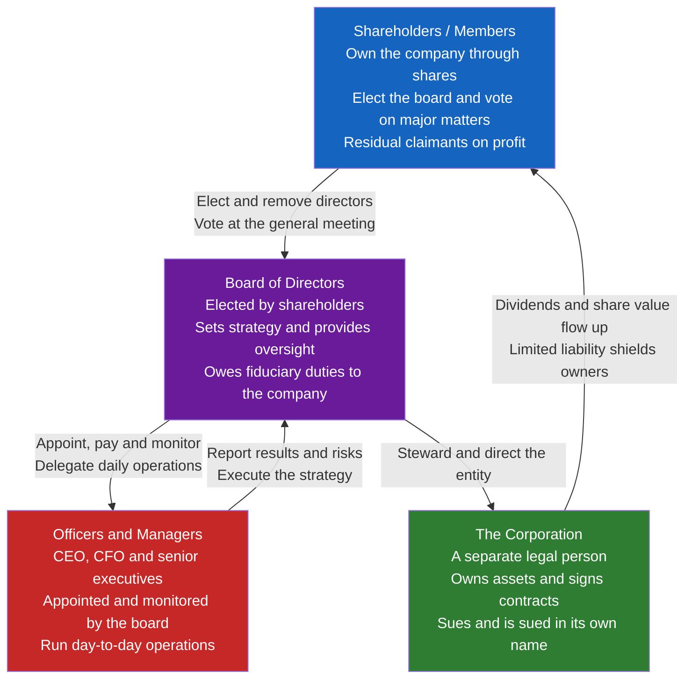

# 🏛️ Commercial and Corporate Law

> [!abstract] TL;DR
> Commercial and corporate law is the branch of **private law** that governs how businesses are organized and how commerce is conducted. Its crown jewel is the **corporation** — a legal fiction treated as a *person* separate from its owners, able to own assets, sign contracts, and be sued in its own name, with its investors shielded by **limited liability**. That very separation of ownership from control creates the field's central problem — the **agency problem**: dispersed shareholders own the firm, but salaried managers run it, and their interests do not automatically align. Corporate law is, at bottom, the machinery — fiduciary duties, board structure, voting rights, disclosure, and the takeover market — built to keep the agents working for the principals.

---

## Intuition

**Analogy:** Imagine you and a hundred strangers each chip in money to open a chain of coffee shops. You will never meet most of the others, none of you wants to personally sign every lease and supplier invoice, and none of you is willing to bet your house on it. So the law lets you create a **new artificial person** — call it "Beans Inc." — that exists on paper. Beans Inc. signs the leases, hires the staff, borrows the money, and if a customer slips and sues, they sue *Beans Inc.*, not you. The company can outlive any of its founders, and your shares can be sold to someone else the way you might sell a car. You are an **owner** of this artificial person, but you are not the person itself, and its debts are not your debts.

That fictional legal "person" is the corporation, and almost every feature of corporate law flows from taking the fiction seriously: because the company is a person distinct from its owners, it — not they — bears its own liabilities; because the owners are many and passive, they must hand control to a small board and a management team; and because those managers spend other people's money, the law must police the gap between what managers want and what owners want.

---

## How It Works

### The menu of business forms

Before the corporation, understand what it competes against. Choosing a business form is a trade-off across three axes: **liability** (are the owners personally on the hook for business debts?), **taxation** (is the entity taxed separately, or does income "pass through" to owners?), and **governance and continuity** (how is control organized, and does the business survive owner turnover?).

- **Sole proprietorship** — one owner, no separate legal entity. Simplest and cheapest to form, but the owner *is* the business: **unlimited personal liability** for every debt, and the business dies with the owner.
- **General partnership** — two or more co-owners sharing profits. Still no meaningful separation: partners have **unlimited, joint-and-several liability**, meaning any one partner can be pursued for the *entire* firm debt, and each partner is an agent who can bind the others.
- **Limited liability partnership (LLP) / limited partnership (LP)** — hybrids that graft limited liability onto the partnership. An LLP shields partners from the malpractice and debts caused by *other* partners (popular for law and accounting firms); an LP has general partners (unlimited liability, control) plus limited partners (liability capped at their investment, no management role — the classic private-equity and venture-fund structure).
- **Corporation / company** — a fully separate legal person owned by shareholders, run by a board, with **limited liability** for all owners. Costlier to form and run, subject to more formality and (often) double taxation, but it is the only form that scales to thousands of anonymous, passive investors.

### The five defining features of the corporation

The corporation is not one idea but a **bundle of five** legal characteristics that reinforce each other:

1. **Separate legal personality.** The company is a legal "person" distinct from its shareholders. It owns its own property, incurs its own debts, and sues and is sued in its own name. The foundation case is *Salomon v A Salomon & Co Ltd* (1897), where the House of Lords held that a company is a wholly distinct entity even when a single person owns nearly all its shares — so the company's creditors could not reach Mr. Salomon personally.
2. **Limited liability.** A shareholder's downside is capped at what they paid for their shares. If the company goes bankrupt owing millions, shareholders lose their investment but not their homes. (Note the precise wording: it is the *shareholders'* liability that is limited — the company itself is fully liable for its own debts.)
3. **Transferable shares.** Ownership is divided into shares that can be bought and sold — publicly on a stock exchange or privately — without disrupting the company's operations or contracts. Liquidity for owners; continuity for the firm.
4. **Centralized management under a board.** Owners do not manage. They elect a **board of directors**, which sets strategy and appoints the officers (CEO, CFO) who run day-to-day operations. This delegated, hierarchical control is what lets thousands of passive investors coexist with coherent decision-making.
5. **Perpetual succession.** The company continues to exist regardless of the death, bankruptcy, or exit of any shareholder, director, or employee. It has, in principle, an unlimited life.

### The structure: who controls whom



Read the diagram top to bottom as a **chain of delegation** and bottom to top as a **chain of accountability**. Shareholders delegate control to a board; the board delegates operations to management; and value plus (imperfect) accountability flow back up. Every link in that chain is a point where the agent might serve themselves instead of the principal — which is exactly where corporate law intervenes.

### Piercing the corporate veil

Separate personality is the general rule, but it is not absolute. In rare cases courts will **pierce the corporate veil** — set aside limited liability and hold shareholders or a parent company personally liable. This typically requires something egregious: using the company as a mere **sham or alter ego** (no real separation between owner and firm), **undercapitalizing** it to dump risk on creditors, commingling personal and corporate funds, or using the corporate form to **perpetrate a fraud or evade an existing legal obligation**. Piercing is deliberately exceptional; routine business failure is *not* a ground, because the whole economic point of limited liability is to let honest ventures fail without ruining their investors.

### The agency problem and corporate governance

Berle and Means, in *The Modern Corporation and Private Property* (1932), named the defining condition of the modern public company: the **separation of ownership and control**. Ownership is fragmented across thousands of shareholders too small and dispersed to monitor anyone, while control sits with professional managers who own little of the firm. This is a textbook **principal-agent problem** (see [[Moral_Hazard]]): the agent (manager) has different incentives from the principal (shareholder), superior information, and actions that are hard to observe. Managers may shirk, empire-build, over-consume perks, entrench themselves, or chase size over profit.

The costs of this misalignment — monitoring costs, bonding costs, and the residual loss from imperfect alignment — are what Jensen and Meckling (1976) called **agency costs**. The entire apparatus of corporate governance exists to shrink them: **fiduciary duties** enforced by courts, **independent boards** and audit committees, **shareholder voting** and derivative suits, **mandatory disclosure** to reduce information asymmetry, **performance-based pay** to tie the agent's wealth to the principal's, and — as a last-resort external check — the **market for corporate control**, where underperforming managers risk a hostile takeover that fires them.

### Directors' fiduciary duties

Because directors control assets belonging to others, the law imposes **fiduciary duties** — the highest standard of loyalty and care the law knows:

- **Duty of care** — act with the diligence a reasonably prudent person would use: stay informed, attend to the business, deliberate before deciding.
- **Duty of loyalty** — put the company's interests above your own; no self-dealing, no usurping corporate opportunities, no conflicts of interest without disclosure and approval.
- **The business judgment rule** — the crucial shield: courts will *not* second-guess an honest, informed, good-faith business decision merely because it turned out badly. The rule protects the *process*, not the *outcome*, and it applies only when there is no breach of loyalty. It exists so that directors take reasonable risks without fear of being sued for every loss.

**To whom are the duties owed?** This is the live debate. Under **shareholder primacy** (classically *Dodge v Ford*, 1919, and championed by Milton Friedman) the corporation should be run to maximize shareholder wealth. Under **stakeholder theory** (revived by ESG debates and the 2019 Business Roundtable statement) directors should balance the interests of employees, customers, communities, and the environment alongside shareholders. Most legal systems formally require duties to be owed to *the company*, but disagree sharply on whether "the company" means its shareholders alone or a broader constituency.

### Financing, restructuring, and commercial law

- **Financing: equity vs debt.** A company raises capital by selling **equity** (shares — ownership, residual claims, upside and voting) or by taking on **debt** (loans and bonds — fixed claims, priority in bankruptcy, no ownership). The mix is its **capital structure** (see [[Capital_Structure]]).
- **Mergers, acquisitions, and takeovers.** Companies combine by merger, acquisition of assets, or purchase of shares; a **hostile takeover** bypasses management and appeals directly to shareholders, functioning as the ultimate discipline on bad managers (see [[Mergers_and_Acquisitions]]).
- **Commercial law basics.** Beyond corporate structure sits the law of everyday commerce: **sale of goods** (warranties, passing of title and risk), **negotiable instruments** (cheques, promissory notes), **secured transactions** (a creditor takes a security interest in collateral to jump the repayment queue), and **agency** (when one party legally binds another).
- **Insolvency and bankruptcy.** When a company cannot pay its debts, the law sets a strict **priority of claims**: secured creditors first, then unsecured creditors, and **shareholders last** (the absolute priority rule). The choice is between **reorganization** (restructure the debts and keep operating, e.g. US Chapter 11) and **liquidation** (sell the assets and wind up, e.g. Chapter 7).
- **Securities regulation and disclosure.** Public companies must make **mandatory, standardized disclosures** so investors can price shares and detect fraud — the regulatory answer to the information asymmetry between insiders and the market.

---

## Key Concepts

### Secondary Level

- **Corporation / company.** An artificial legal "person," separate from its owners, that can own property, make contracts, and sue and be sued in its own name.
- **Shareholder.** An owner of a company who holds shares, votes to elect directors, and shares in profits through dividends and rising share value.
- **Limited liability.** The rule that a shareholder can lose only what they invested — the company's debts are not the owner's personal debts.
- **Board of directors.** The group elected by shareholders to steer the company and to hire and oversee its managers.
- **Business forms.** The menu of ways to organize a business — sole proprietorship, partnership, and corporation — trading off simplicity against liability protection and the ability to raise money.
- **Sole proprietorship vs corporation.** A sole proprietor *is* the business with unlimited personal liability; a corporation is a separate person that shields its owners.

### Undergraduate Level

- **Separate legal personality.** Established in *Salomon v Salomon* (1897): the company is a distinct legal entity even when almost wholly owned by one person, so its creditors cannot reach the owner personally.
- **The five corporate features.** Separate personality, limited liability, transferable shares, centralized (board) management, and perpetual succession — a mutually reinforcing bundle that lets firms pool capital from many passive investors.
- **Piercing the corporate veil.** The rare judicial override of limited liability where the company is a sham, fraud, or alter ego, or is deliberately undercapitalized to defraud creditors. Business failure alone is never a ground.
- **The agency problem.** The conflict of interest and information between shareholders (principals) and managers (agents) arising from the separation of ownership and control; the source of **agency costs** (monitoring, bonding, and residual loss).
- **Fiduciary duties.** The duty of **care** (be diligent and informed) and the duty of **loyalty** (no self-dealing), enforced by courts and buffered by the **business judgment rule**, which protects honest, informed decisions from hindsight liability.
- **Equity vs debt.** Shares confer ownership, votes, and residual upside but rank last in bankruptcy; bonds and loans confer fixed claims with priority but no control. The mix is the firm's capital structure.
- **Insolvency priority.** In a wind-up, secured creditors are paid first, unsecured creditors next, and shareholders last — the residual-claimant position that is the price of the residual upside.

### Graduate Level

- **Berle and Means: separation of ownership and control.** In the dispersed-shareholder public company, ownership is fragmented and control is concentrated in managers — the structural precondition for managerial agency costs and the object of governance reform.
- **Jensen and Meckling: agency-cost theory of the firm.** Formalizes agency costs and the manager's incentive to divert value; predicts that giving managers equity, using debt as a disciplining device, and tightening monitoring reduce the wedge between manager and owner objectives.
- **Nexus-of-contracts theory.** The corporation viewed not as a "thing" but as a web of voluntary contracts among shareholders, creditors, managers, employees, and suppliers — reframing corporate law as default terms parties would have bargained for (contrast with concession and real-entity theories). Connects to Coase's theory of the firm ([[Coase_Theorem]]).
- **Shareholder primacy vs stakeholder theory.** *Dodge v Ford* and Friedman on one side; team-production theory (Blair and Stout) and ESG on the other. The debate is over the corporate objective function and to whom fiduciary duties ultimately run.
- **The market for corporate control (Manne).** Hostile takeovers as an external governance mechanism: a low share price invites a bidder to buy control and replace bad managers, so the mere *threat* disciplines incumbents — set against management defenses (poison pills, staggered boards) and the debate over whether they entrench or protect.
- **Optimal incentive contracting.** Executive pay design under moral hazard: aligning the risk-averse agent through equity, options, and performance metrics, trading off stronger incentives against imposing risk on the agent and inducing gaming, short-termism, and manipulation (links to [[Moral_Hazard]] and [[Asymmetric_Information]]).
- **The absolute priority rule and creditor bargaining.** In bankruptcy, senior claims must be paid in full before junior claims receive anything; deviations, cram-downs, and the reorganization-vs-liquidation choice are central to insolvency theory.

---

## Python Demo

This demo makes two core ideas of corporate law numerical. **Part A** shows how **limited liability caps a shareholder's downside** at the amount invested, versus the unlimited personal exposure of a sole proprietor — producing an option-like "hockey stick" payoff. **Part B** models the **principal-agent problem**: a manager privately chooses effort, which maps (with diminishing returns) to firm value. Under a flat salary the manager shirks; an **incentive contract** that pays a share of firm value pulls the manager's chosen effort up toward the shareholder-optimal level.

```python
"""
Limited Liability and the Agency Problem
----------------------------------------
Part A: limited vs unlimited liability payoff curves.
Part B: principal-agent effort choice and how incentive pay shifts it
        toward the shareholder (first-best) optimum.

Requires: numpy, matplotlib   ->   python corporate_law_demo.py
"""
import numpy as np
import matplotlib.pyplot as plt

# ======================================================================
# PART A: Limited liability caps the downside
# ======================================================================
INVEST = 100.0                     # capital the owner put into the firm
outcome = np.linspace(-300, 200, 500)   # firm net result (can be deeply negative)

# Unlimited liability (sole proprietor): owner absorbs the full result.
unlimited = outcome.copy()

# Limited liability (shareholder): loss is floored at the investment.
limited = np.maximum(outcome, -INVEST)

# ======================================================================
# PART B: Principal-agent effort choice
#   Firm value rises with manager effort but with diminishing returns:
#       V(e) = Vmax * (1 - exp(-k*e))
#   Manager privately bears a convex effort cost:
#       Cost(e) = c * e**2
#   The manager maximizes their OWN utility:
#       U(e) = wage(e) - Cost(e),   wage(e) = w0 + alpha * V(e)
#   alpha = 0  -> flat salary (the manager shirks)
#   alpha = 1  -> manager is full residual claimant (first-best effort)
# ======================================================================
Vmax, k, c = 200.0, 3.0, 60.0
effort = np.linspace(0.0, 1.0, 400)


def firm_value(e):
    return Vmax * (1.0 - np.exp(-k * e))


def best_effort(alpha):
    """Effort the manager chooses to maximize private utility, given pay share alpha."""
    utility = alpha * firm_value(effort) - c * effort**2
    return effort[np.argmax(utility)]


# Owner's first-best: effort that maximizes total surplus V(e) - Cost(e)
first_best = effort[np.argmax(firm_value(effort) - c * effort**2)]

alphas = np.linspace(0.0, 1.0, 101)
chosen = np.array([best_effort(a) for a in alphas])

e_shirk = best_effort(0.0)     # flat salary
e_incent = best_effort(0.5)    # moderate incentive contract

# ======================================================================
# PLOTS
# ======================================================================
fig, (ax0, ax1, ax2) = plt.subplots(1, 3, figsize=(18, 5.5))

# --- Plot A: liability payoff curves ---
ax0.plot(outcome, unlimited, color="#c62828", lw=2,
         label="Unlimited liability (sole proprietor)")
ax0.plot(outcome, limited, color="#1565c0", lw=2.5,
         label="Limited liability (shareholder)")
ax0.axhline(-INVEST, ls="--", color="gray", lw=1,
            label=f"Loss floor = -{INVEST:.0f} (investment)")
ax0.axhline(0, color="black", lw=0.8)
ax0.axvline(0, color="black", lw=0.8)
ax0.set_xlabel("Firm net outcome")
ax0.set_ylabel("Owner's personal payoff")
ax0.set_title("A. Limited Liability Caps the Downside")
ax0.legend(fontsize=8, loc="upper left")
ax0.grid(True, alpha=0.3)

# --- Plot B: firm value vs effort with chosen-effort markers ---
ax1.plot(effort, firm_value(effort), color="#2e7d32", lw=2.5, label="Firm value V(e)")
for e, col, lab in [(e_shirk, "#c62828", "Flat salary -> shirk"),
                    (e_incent, "#e65100", "Incentive pay (alpha=0.5)"),
                    (first_best, "#1565c0", "Shareholder optimum")]:
    ax1.axvline(e, color=col, ls="--", lw=1.6)
    ax1.plot(e, firm_value(e), "o", color=col, ms=9, label=f"{lab}: e={e:.2f}")
ax1.set_xlabel("Manager effort e")
ax1.set_ylabel("Firm value")
ax1.set_title("B. Effort Maps to Firm Value")
ax1.legend(fontsize=8, loc="lower right")
ax1.grid(True, alpha=0.3)

# --- Plot C: chosen effort as a function of the incentive share ---
ax2.plot(alphas, chosen, color="#6a1b9a", lw=2.5, label="Manager's chosen effort")
ax2.axhline(first_best, ls="--", color="#1565c0", lw=1.6,
            label=f"Shareholder optimum e={first_best:.2f}")
ax2.set_xlabel("Incentive share alpha (pay tied to firm value)")
ax2.set_ylabel("Manager's chosen effort")
ax2.set_title("C. Aligning Incentives Raises Effort")
ax2.legend(fontsize=8, loc="lower right")
ax2.grid(True, alpha=0.3)

plt.tight_layout()
plt.savefig("corporate_law_demo.png", dpi=120, bbox_inches="tight")
plt.show()

# ======================================================================
# Numeric summary
# ======================================================================
print("PART A - Limited liability")
print(f"  Worst-case firm outcome shown: {outcome.min():.0f}")
print(f"  Sole proprietor loss:  {unlimited.min():.0f}  (unbounded personal exposure)")
print(f"  Shareholder loss:     {limited.min():.0f}  (capped at the {INVEST:.0f} invested)")
print()
print("PART B - Agency problem")
print(f"  Flat salary (alpha=0):   manager effort = {e_shirk:.2f}  -> shirking")
print(f"  Incentive (alpha=0.5):   manager effort = {e_incent:.2f}")
print(f"  Shareholder optimum:     effort         = {first_best:.2f}")
print(f"  Value gap closed by incentive pay: "
      f"{firm_value(e_incent) - firm_value(e_shirk):.1f} of firm value")
```

**Expected output (approximate):**

```
PART A - Limited liability
  Worst-case firm outcome shown: -300
  Sole proprietor loss:  -300  (unbounded personal exposure)
  Shareholder loss:     -100  (capped at the 100 invested)

PART B - Agency problem
  Flat salary (alpha=0):   manager effort = 0.00  -> shirking
  Incentive (alpha=0.5):   manager effort = 0.44
  Shareholder optimum:     effort         = 0.55
  Value gap closed by incentive pay: 96.4 of firm value
```

The two experiments capture the field's twin engines. **Limited liability** turns the owner's payoff into a floored, option-like curve — the feature that makes passive investment safe enough to pool capital at scale. **The agency problem** shows why that pooling has a cost: a manager paid a flat salary rationally exerts *zero* effort, and only when their pay is tied to firm value (a higher `alpha`) does their chosen effort climb toward the level shareholders actually want.

---

## Real-World Applications

**Salomon v Salomon (1897) — the birth of separate personality.** Aron Salomon incorporated his boot business and held nearly all its shares. When the company failed, creditors argued it was "really" just Salomon and he should pay personally. The House of Lords refused: the company was a distinct legal person, its debts were its own, and limited liability held. Over a century later this remains the bedrock of every corporation on earth — the reason you can buy one share of Apple without risking liability for Apple's lawsuits.

**Delaware and the business judgment rule.** More than half of US public companies are incorporated in Delaware, drawn by its specialized Court of Chancery and a well-developed body of case law. Its robust **business judgment rule** lets directors take risks without hindsight liability, which is precisely why boards value the jurisdiction — a live example of legal rules shaping where the corporate form is created.

**Executive stock options — incentive alignment in practice.** The Part B model is not a toy. Paying CEOs in stock and options is the real-world attempt to raise `alpha` and align managers with shareholders. It also demonstrates the downside the model hints at: overweighting short-term share price can induce short-termism, excessive risk-taking, or accounting manipulation — incentives so strong they distort behavior.

**Enron and Lehman Brothers — governance failure.** Enron (2001) and Lehman (2008) are canonical failures of the whole apparatus: boards that failed to monitor, auditors and disclosure that failed to inform the market, and management incentives that rewarded hiding risk. Each triggered the machinery downstream — securities-fraud liability, insolvency proceedings, and, in Enron's case, the Sarbanes-Oxley Act tightening disclosure and board-independence rules.

**Hostile takeovers as external discipline.** When a public company's shares trade far below the value a better manager could extract, a raider can buy control and replace the board — the market for corporate control in action. Defenses like the "poison pill" and staggered boards, and landmark Delaware battles over them, are the ongoing negotiation between entrenchment and accountability.

---

## Common Pitfalls

- **Confusing the company with its shareholders.** The single most common error. The corporation is a *separate person*: its assets are not the shareholders' assets, and its debts are not their debts. Owning shares is not owning the company's property — it is owning a bundle of claims against the entity.
- **Saying "the company has limited liability."** Precisely wrong. The *company* has **unlimited** liability for its own debts — it can be sued to its last asset. It is the **shareholders'** liability that is limited to their investment. Getting this backwards inverts the entire structure.
- **Thinking piercing the veil is routine.** Courts pierce only in exceptional cases of fraud, sham, or alter-ego abuse. Ordinary business failure — even a company deliberately structured to isolate risk — is not enough; limited liability exists precisely so honest ventures can fail without ruining investors.
- **Assuming directors owe duties directly to shareholders.** In most systems fiduciary duties are owed to *the company itself*, not to individual shareholders. This is why a shareholder wanting to sue over managerial wrongdoing usually must bring a **derivative** action on the company's behalf, not a personal claim.
- **Reading the business judgment rule as blanket immunity.** It protects honest, informed, good-faith decisions from being second-guessed on outcome — but it evaporates when the duty of **loyalty** is breached. Self-dealing, fraud, and conflicts of interest get no protection.
- **Treating incentive pay as a clean fix for the agency problem.** Tying pay to performance raises effort but imports new distortions: risk-averse managers demand a premium for bearing risk, and strong metrics invite gaming, short-termism, and earnings manipulation. Alignment is a trade-off, not a solution.
- **Ignoring creditor priority in insolvency.** Shareholders are **residual** claimants — last in line. Equity holders often walk away with nothing while creditors are paid, which is the flip side of enjoying the residual *upside* when things go well.

---

## Related Concepts

- [[Common_Law_vs_Civil_Law]] — corporate law is shaped by legal tradition: common-law systems build it case by case (Salomon, Delaware) while civil-law systems codify it, and the two diverge on board structure and shareholder rights.
- [[Constitutional_Law_and_Structure]] — a public-law counterpart to corporate structure; both allocate power among organs, and the debate over "corporate personhood" borrows the same legal-fiction logic.
- [[Sources_of_Law]] — corporate law fuses statute (companies acts), case law (fiduciary duties), and regulation (securities rules), a good illustration of layered legal sources.
- [[Moral_Hazard]] — the economic core of the agency problem: managers take hidden actions shareholders cannot fully observe, exactly what governance is built to police.
- [[Asymmetric_Information]] — managers and insiders know more than dispersed shareholders and the market; mandatory disclosure and signaling are the responses.
- [[Coase_Theorem]] — Coase's theory of the firm and transaction costs underpins the nexus-of-contracts view of the corporation as a bundle of bargains.
- [[Capital_Structure]] — the equity-versus-debt financing decision that corporate law's shares and bonds implement.
- [[Cost_of_Capital_and_WACC]] — how the mix of equity and debt prices the capital a corporation raises.
- [[Equity_Markets]] — where transferable shares actually trade, giving owners liquidity and the market its takeover discipline.
- [[Mergers_and_Acquisitions]] — the transactional machinery of takeovers and the external market for corporate control.
- [[Signaling_Games]] — the game-theoretic model behind disclosure and incentive contracts under information asymmetry.

---

## Review Questions

### Secondary
1. In your own words, explain what it means to call a corporation a "legal person," and give one thing a corporation can do that a rock or a table cannot.
2. You and a friend start a business. Under limited liability, if the business fails owing money, what is the most you can lose — and why does that make you more willing to invest?

### Undergraduate
1. Explain the holding of *Salomon v Salomon* and why it is described as the foundation of company law. What would corporate finance look like if courts had decided the *other* way?
2. Distinguish the duty of care from the duty of loyalty, and explain how the business judgment rule interacts with each. Why does the rule protect an informed decision that lost money but not a self-dealing one?
3. A company goes bankrupt with just enough assets to pay secured creditors, some unsecured creditors, and nothing left over. Who gets paid, in what order, and where do the shareholders stand? Connect this to the idea of shareholders as "residual claimants."

### Graduate
1. Frame the modern public corporation as a principal-agent problem in the sense of Berle-Means and Jensen-Meckling. Identify the sources of agency cost and evaluate three distinct mechanisms corporate law uses to reduce them, noting the new distortions each mechanism introduces.
2. "Directors owe their duties to the company." Analyze how the shareholder-primacy and stakeholder theories each interpret that sentence, and argue which better fits a world of ESG mandates and the 2019 Business Roundtable statement. What does each view imply for how a board should decide a plant-closure that raises profit but destroys a community?
3. Under the nexus-of-contracts theory, corporate law supplies the default terms parties would have bargained for. Using this lens together with the Coase theory of the firm, argue whether limited liability is best understood as a subsidy that externalizes risk onto creditors or as an efficient default that lowers the cost of capital. Address the piercing-the-veil doctrine as the safety valve.

---

## Sources

- [*Salomon v A Salomon & Co Ltd* [1897] AC 22 — separate legal personality and limited liability](https://en.wikipedia.org/wiki/Salomon_v_A_Salomon_%26_Co_Ltd)
- [Berle, A. and Means, G. (1932) — *The Modern Corporation and Private Property* (separation of ownership and control)](https://en.wikipedia.org/wiki/The_Modern_Corporation_and_Private_Property)
- [Jensen, M. and Meckling, W. (1976) — "Theory of the Firm: Managerial Behavior, Agency Costs and Ownership Structure," Journal of Financial Economics](https://www.sciencedirect.com/science/article/pii/0304405X7690026X)
- [Cornell Legal Information Institute — Business Judgment Rule](https://www.law.cornell.edu/wex/business_judgment_rule)
- [Business Roundtable (2019) — Statement on the Purpose of a Corporation (stakeholder governance)](https://www.businessroundtable.org/business-roundtable-redefines-the-purpose-of-a-corporation-to-promote-an-economy-that-serves-all-americans)
- [Dodge v. Ford Motor Co., 204 Mich. 459 (1919) — shareholder primacy](https://en.wikipedia.org/wiki/Dodge_v._Ford_Motor_Co.)

---

#law #corporate-law #company-law #limited-liability #corporate-governance
