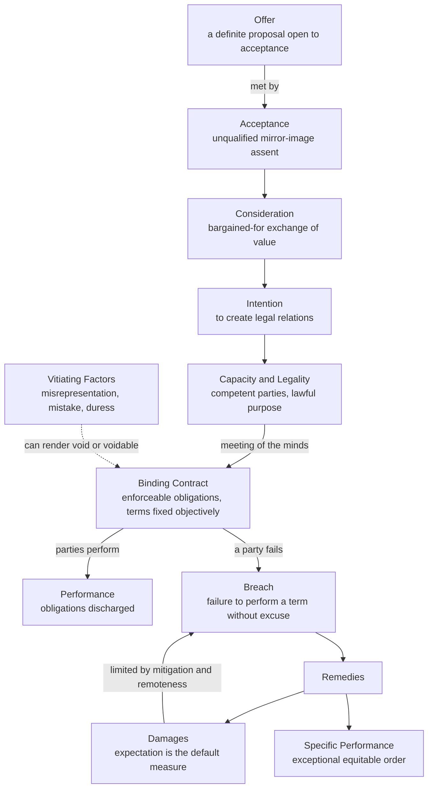

# ⚖️ Contract Law

> [!abstract] TL;DR
> **Contract law is the law of legally enforceable agreements** — the rules that decide *when a promise binds*, *what it obliges you to do*, and *what happens when you break it*. A valid contract is a private mini-law two parties write for themselves: it forms when there is an **offer**, an **acceptance**, **consideration** (a bargained-for exchange), an **intention to create legal relations**, plus **capacity** and **legality**. Courts read agreements **objectively** — by outward words and conduct, not secret intentions. When a party **breaches**, the default remedy is **expectation damages** — money that puts the victim in the position they would have occupied *had the contract been performed* — which, uniquely among remedies, both compensates the innocent party and gives the breaching party exactly the right incentive to break the deal only when doing so is economically efficient.

---

## Intuition

**Analogy — two neighbours writing their own private statute.**

Suppose you agree to buy your neighbour's lawnmower for £100 next Saturday. In that instant the two of you have written a tiny law that governs only the two of you. The state did not draft it; *you* did. But the state stands behind it: if Saturday comes and your neighbour sells the mower to someone else, you can walk into a court and have that private law **enforced** — not by forcing the mower into your hands, but by making your neighbour pay you enough money that you are **as well off as if you had got the mower**. That is the whole engine of contract law in miniature: private parties **manufacture their own obligations**, and the public legal system lends them its **coercive power** to make those obligations stick.

Two features of the analogy do real work. First, the law cares about what you **said and did**, not what you privately meant — if your words looked like a firm deal to a reasonable bystander, you are bound even if you were secretly joking (the **objective theory**). Second, the remedy is usually **money that simulates performance**, not performance itself: the law would rather compensate you and let your neighbour redeploy the mower to whoever values it most than drag the mower back by force. Contract law is therefore less about *keeping promises* and more about **allocating the cost of broken ones** — a subtle, and initially surprising, distinction.

---

## How It Works

### Core mechanics

**1. Formation — the elements of a binding contract.** A promise becomes enforceable only when a cluster of ingredients is present:

- **Offer** — a clear, definite proposal that the offeror is willing to be bound by on the stated terms, capable of acceptance. An offer is distinguished from an **invitation to treat** (a shop's price tag, an advertisement, an auctioneer's call for bids), which merely invites offers rather than making one.
- **Acceptance** — an **unqualified assent** to the exact terms of the offer. A purported acceptance that changes the terms is a **counter-offer**, which kills the original offer (the "mirror image" rule). Acceptance must generally be **communicated**; the **postal rule** is the famous exception where acceptance is effective on posting.
- **Consideration** — the price of the promise: **something of value given in exchange** ("bargained-for detriment"). Each side must give and get something. This distinguishes an enforceable bargain from a bare gift promise. Consideration need not be adequate (a peppercorn suffices) but must be **sufficient** in law and must not be **past**.
- **Intention to create legal relations** — parties must intend legal, not merely social or moral, consequences. Commercial agreements are presumed to intend them; domestic and social arrangements are presumed not to.
- **Capacity** — the parties must be legally competent (minors, the mentally incapacitated, and sometimes intoxicated persons have limited capacity).
- **Legality** — the contract's purpose must be lawful and not contrary to public policy; a contract to commit a crime is void.

Together the first four elements produce the **"meeting of the minds"** (*consensus ad idem*) — though, crucially, the "minds" are read **objectively**.

**2. The objective theory of contract.** Courts do **not** probe subjective intent. They ask: *what would a reasonable person, in the position of the other party, have understood the words and conduct to mean?* This is why a signed document binds you even if you did not read it, and why a genuine but unreasonable private meaning does not save you. The objective theory makes contracting **predictable**: parties can rely on outward manifestations rather than trying to read minds.

**3. Terms.** Once formed, the contract's content is its **terms**:

- **Express vs implied** — express terms are stated; implied terms are read in by the courts (to give business efficacy or reflect obvious intention), by statute (e.g., consumer-protection warranties), or by custom.
- **Conditions vs warranties** — a **condition** is a term so important that its breach lets the innocent party **terminate** the whole contract *and* claim damages; a **warranty** is a minor term whose breach yields **damages only**. An intermediate ("innominate") term is judged by the seriousness of the actual consequences.

**4. Vitiating factors — when a contract is void or voidable.** Even a well-formed contract can be undone by a defect in consent:

- **Misrepresentation** — a false statement of fact that induced the contract (fraudulent, negligent, or innocent).
- **Mistake** — a shared or fundamental error about a basic assumption (a narrow doctrine).
- **Duress** — illegitimate pressure (violence, or economic duress).
- **Undue influence** — abuse of a relationship of trust or dominance.
- **Unconscionability** — grossly unfair terms extracted from a weaker party; the modern check on freedom of contract.

A **void** contract never existed in law; a **voidable** one is valid until the wronged party elects to **rescind** it.

**5. Consideration's soft edge — promissory estoppel.** Because the consideration requirement can produce harsh results (a promise relied on but "unpaid for" is unenforceable), equity developed **promissory estoppel**: where one party makes a clear promise intending it to be relied on, and the other **reasonably relies** to their detriment, the promisor may be **stopped** from going back on it even without consideration. It is famously "a shield, not a sword" — traditionally a defence rather than an independent cause of action.

**6. Privity.** The **doctrine of privity** holds that only the **parties** to a contract can sue or be sued on it — a stranger who benefits cannot enforce it. Modern statutes (e.g., the UK's Contracts (Rights of Third Parties) Act 1999) have carved substantial exceptions.

**7. Performance, discharge, and breach.** A contract is **discharged** — its obligations extinguished — by **performance**, by **agreement**, by **frustration** (a supervening event makes performance impossible or radically different), or by **breach**. A **breach** is a failure to perform a term without lawful excuse. A **repudiatory** (fundamental) breach lets the innocent party terminate and sue; a minor breach yields damages while the contract survives.

**8. Remedies.** The law's toolbox for breach, in order of typical use:

- **Damages** — money, the primary remedy, measured three ways: **expectation** (the default: as if performed — the lost benefit of the bargain), **reliance** (restore the pre-contract position — refund wasted expenditure), and **restitution** (strip a benefit conferred on the breaching party). Damages are subject to three great limits: **mitigation** (the victim must take reasonable steps to reduce their loss), **remoteness** (loss must be foreseeable — *Hadley v Baxendale*), and **causation**.
- **Liquidated damages vs penalties** — parties may pre-agree a sum payable on breach; courts enforce a **genuine pre-estimate of loss** (liquidated damages) but strike down a **penalty** designed to punish or deter.
- **Specific performance** — an **exceptional equitable order** compelling actual performance, granted only when damages are inadequate (e.g., unique goods or land) and never for personal-service contracts.

### Flow / architecture



---

## Key Concepts

### Secondary — the core idea

A contract is a **promise the law will enforce**. To count, a deal usually needs an **offer**, an **acceptance**, and an **exchange** — each side must give something. The law looks at **what people said and did**, not what they secretly thought. If someone **breaks** the deal, the usual fix is **money that puts the other person where they would have been if the promise had been kept** — not forcing them to do the thing.

### Undergraduate — the machinery

Master the **six formation elements** (offer, acceptance, consideration, intention, capacity, legality) and be able to spot which is missing in a problem question. Understand the **objective theory** and why it makes markets workable. Know the **offer vs invitation to treat** and **acceptance vs counter-offer** distinctions cold, plus the **postal rule**. Distinguish **conditions from warranties** (right to terminate vs damages only) and **express from implied** terms. Learn the five **vitiating factors** and the **void/voidable** split. Grasp **consideration** and its equitable escape hatch, **promissory estoppel** (a shield, not a sword). Learn **privity** and its modern exceptions. On remedies: the **three damages measures** — expectation (default), reliance, restitution — and their limits: **mitigation**, **remoteness** (*Hadley v Baxendale*'s two limbs), and the **penalty rule**. Know that **specific performance** is exceptional and discretionary.

### Graduate — theory and contested edges

Interrogate the **basis of contractual obligation**: is it the **will** of the parties (will theory), reasonable **reliance** (Fuller & Perdue's classic taxonomy of the expectation, reliance, and restitution interests), or **efficiency**? Examine why the common law prefers the **expectation measure** over specific performance while civil-law systems treat performance as the primary right — the great **remedies** divergence between the traditions (see [[Common_Law_vs_Civil_Law]]). Engage the **economic analysis of contract**: the **efficient-breach hypothesis** (a party should breach and pay damages whenever the resource is worth more elsewhere), and how the expectation measure **internalises the victim's loss** so that self-interested breach decisions coincide with social efficiency — a Coasean insight (see [[Coase_Theorem]]). Probe the **limits of freedom of contract**: standard-form "contracts of adhesion", unequal bargaining power, information asymmetry (misrepresentation and mistake as informational failures), and the rise of **mandatory consumer-protection** rules that override party autonomy. Consider **incomplete-contract theory** (Hart, Grossman, Williamson): because parties cannot foresee every contingency, gaps are filled by **default rules**, and the choice of defaults is itself a policy instrument.

---

## Python Demo

```python
# Contract remedies and the "efficient breach" idea, using numpy + matplotlib only.
#
# Story: a BUYER contracts to buy a widget from a SELLER for a fixed PRICE.
#   - The buyer values the widget (or can resell it) for VALUE > PRICE, so this
#     is a *profitable* contract for the buyer: expected profit = VALUE - PRICE.
#   - Before delivery the buyer spends RELIANCE on preparation (wasted if breach).
#   - The seller's cost to produce the widget is COST.
#
# Part 1: contrast the three damages measures for the buyer after a seller breach.
# Part 2: show why "breach + pay expectation damages" can be Pareto-superior when
#         the seller receives a higher outside offer W -- and that the seller's
#         private incentive to breach kicks in at EXACTLY the socially efficient
#         threshold (W = buyer's VALUE), because expectation damages internalise
#         the buyer's loss.

import numpy as np
import matplotlib.pyplot as plt

# ---- Contract parameters (money units) ----
PRICE    = 100.0   # contract price buyer agreed to pay seller
VALUE    = 150.0   # widget's value to the original buyer (lost profit = VALUE - PRICE)
RELIANCE = 30.0    # buyer's wasted pre-contract preparation spending
DEPOSIT  = 20.0    # benefit already conferred on seller (basis for restitution)
COST     = 80.0    # seller's cost to produce the widget

# ---- Part 1: the three damages measures for the innocent BUYER ----
# Expectation: put buyer where they'd be IF PERFORMED -> recover the lost profit.
expectation = VALUE - PRICE           # = 50: the benefit of the bargain
# Reliance: restore buyer to PRE-CONTRACT position -> refund wasted spend.
reliance    = RELIANCE                # = 30: back to square one, no profit
# Restitution: strip the benefit the buyer conferred on the seller.
restitution = DEPOSIT                 # = 20: give back what was transferred

measures = ["Expectation\n(as if performed)",
            "Reliance\n(pre-contract position)",
            "Restitution\n(disgorge benefit)"]
values   = np.array([expectation, reliance, restitution])

print("DAMAGES FOR A PROFITABLE (winning) CONTRACT")
print("=" * 52)
print(f"  Expectation : {expectation:5.1f}  (lost profit VALUE - PRICE)")
print(f"  Reliance    : {reliance:5.1f}  (wasted RELIANCE spend)")
print(f"  Restitution : {restitution:5.1f}  (deposit returned)")
print("  -> Expectation is largest here because the deal was profitable.\n")

# ---- Part 2: efficient breach as the outside offer W varies ----
W = np.linspace(90, 220, 400)         # third party's offer / valuation for the widget

# Seller's payoff if it PERFORMS the original contract (independent of W):
seller_perform = PRICE - COST                       # = 20, constant
# Seller's payoff if it BREACHES: sell to third party for W, pay expectation damages:
damages        = expectation                        # expectation measure = 50
seller_breach  = W - COST - damages                 # = W - 130

# The buyer is ALWAYS made whole by expectation damages -> indifferent to breach:
buyer_payoff   = np.full_like(W, expectation)       # constant 50

# Social surplus = value to whoever ends up with the widget, minus production cost.
social_perform = VALUE - COST                        # = 70, widget goes to buyer
social_breach  = W - COST                            # widget goes to third party (value W)

# Efficient (and privately chosen) breach threshold: seller breaches iff W > VALUE.
W_star = damages + PRICE                              # = 150 = VALUE  (the key identity)
print(f"Seller breaches iff  W > PRICE + damages = {W_star:.0f}")
print(f"Society prefers breach iff  W > VALUE     = {VALUE:.0f}")
print("  -> The two thresholds COINCIDE: expectation damages align")
print("     private incentive with social efficiency.\n")

# ---- Plot ----
fig, (ax1, ax2) = plt.subplots(1, 2, figsize=(14, 6))

# Panel 1: the three damages measures
colors = ["#2563eb", "#059669", "#d97706"]
bars = ax1.bar(range(3), values, color=colors, edgecolor="black", linewidth=0.7)
ax1.set_xticks(range(3))
ax1.set_xticklabels(measures, fontsize=9)
ax1.set_ylabel("Damages awarded to buyer (money units)")
ax1.set_title("Three Measures of Damages\n(profitable contract: expectation is largest)")
for b, v in zip(bars, values):
    ax1.text(b.get_x() + b.get_width() / 2, v + 1, f"{v:.0f}",
             ha="center", va="bottom", fontsize=11, fontweight="bold")
ax1.set_ylim(0, expectation + 15)

# Panel 2: efficient breach
ax2.plot(W, np.full_like(W, seller_perform), "--", color="#dc2626", lw=2,
         label="Seller payoff: PERFORM")
ax2.plot(W, seller_breach, "-", color="#dc2626", lw=2.2,
         label="Seller payoff: BREACH and pay damages")
ax2.plot(W, buyer_payoff, ":", color="#2563eb", lw=2,
         label="Buyer payoff (always made whole)")
ax2.plot(W, social_perform * np.ones_like(W), "--", color="#059669", lw=1.6,
         label="Social surplus: PERFORM")
ax2.plot(W, social_breach, "-", color="#059669", lw=1.6,
         label="Social surplus: BREACH")
ax2.axvline(W_star, color="black", lw=1.4)
ax2.text(W_star + 2, 8, f"efficient breach\nthreshold  W = {W_star:.0f}\n(= buyer's VALUE)",
         fontsize=9, va="bottom")
ax2.fill_between(W, -20, 130, where=(W > W_star), color="#059669", alpha=0.07)
ax2.set_xlabel("Outside offer W  (third party's valuation)")
ax2.set_ylabel("Payoff / surplus (money units)")
ax2.set_title("Efficient Breach\nseller breaches iff W > VALUE = socially efficient")
ax2.legend(fontsize=8, loc="upper left")
ax2.set_ylim(-15, 130)

fig.tight_layout()
plt.savefig("contract_law_damages_efficient_breach.png", dpi=120)
print("Saved figure -> contract_law_damages_efficient_breach.png")
plt.show()
```

**What the demo shows.** Panel 1 makes concrete why the choice of remedy matters: for a *profitable* contract the **expectation** award (50) exceeds **reliance** (30) and **restitution** (20), because only expectation captures the **lost profit**. Panel 2 is the efficient-breach result: the seller's payoff from breaching (`W - COST - damages`) overtakes the payoff from performing exactly at `W = 150`, which is **the buyer's own valuation**. To the right of that line the widget is worth more to the third party than to the buyer, so moving it there is **socially efficient** — and because expectation damages force the seller to hand the buyer's entire lost benefit over, the seller **only** finds breach profitable precisely when it is efficient. The buyer, always made whole, is indifferent; the seller and third party are strictly better off. Breach becomes **Pareto-superior**, and the expectation measure is what makes the private and social thresholds coincide.

---

## Real-World Applications

- **Everyday commerce.** Every purchase, employment agreement, lease, insurance policy, loan, and software licence is a contract. The doctrines of offer/acceptance and terms decide, for example, whether clicking "I agree" on an app's terms of service forms a binding agreement (it generally does, under the objective theory).
- **Choice of law in cross-border deals.** International commercial parties pick a **governing law** — frequently **English** or **New York** law — precisely because their contract case law is deep and predictable, so the outcome of a dispute over terms and damages is foreseeable (connects to [[Common_Law_vs_Civil_Law]]).
- **Construction and supply chains.** **Liquidated damages** clauses (e.g., "£10,000 per day of delay") are standard in construction and manufacturing; whether a clause is an enforceable pre-estimate or an unenforceable **penalty** is heavily litigated.
- **M&A and finance.** Share-purchase agreements are dense webs of **express warranties**, **conditions precedent**, and indemnities; a breach of warranty triggers a damages claim measured on the expectation basis — the machinery of the future *Commercial and Corporate Law* note.
- **Consumer protection.** Modern statutes imply **mandatory** terms (goods must be of satisfactory quality) and strike out **unfair terms** in standard-form consumer contracts, overriding freedom of contract to protect the weaker party.
- **Efficient breach in practice.** A supplier who receives a far more lucrative order will often **deliberately breach** an existing contract, pay the (expectation) damages, and pocket the difference — the textbook doctrine playing out in real supply markets.

---

## Common Pitfalls

- **Confusing an offer with an invitation to treat.** A shop window display, an advertised price, or a website listing is usually an **invitation to treat**, not an offer — the *customer* makes the offer, which the seller can reject. Misreading this reverses who is bound.
- **Thinking any promise is enforceable.** Without **consideration** (or promissory estoppel) a bare gift promise does not bind. "But he *promised*" is not, by itself, a contract claim.
- **Reading contracts subjectively.** People assume their private intention controls. It does not — the **objective** meaning of words and conduct governs, which is why "I didn't read it" and "I didn't really mean it" rarely work.
- **Assuming breach means you can walk away.** Only breach of a **condition** (or a repudiatory breach) lets you **terminate**. Terminating for breach of a mere **warranty** is itself a wrongful repudiation that flips liability onto you.
- **Ignoring mitigation.** A claimant who sits back and lets losses pile up recovers only what **reasonable mitigation** would have left — not the full self-inflicted total.
- **Over-claiming remote losses.** Under *Hadley v Baxendale*, only losses that were **foreseeable** (arising naturally, or within the parties' contemplation) are recoverable. Exotic downstream losses the other side never knew about are cut off as **too remote**.
- **Drafting a penalty and calling it liquidated damages.** A pre-agreed sum meant to **punish or deter** rather than estimate loss is void as a **penalty**; label alone does not save it.
- **Expecting specific performance.** Courts award performance only exceptionally (unique goods, land). For ordinary goods and services the remedy is **damages**, full stop.

---

## Related Concepts

- [[Sources_of_Law]] — contract law is a blend of judge-made **common law** and overriding **statute** (consumer-protection and unfair-terms legislation); the source hierarchy decides which controls.
- [[Common_Law_vs_Civil_Law]] — the traditions diverge sharply on contract: **consideration** is a common-law peculiarity (civil law uses *cause / causa*), and civil law treats **performance** as the primary remedy while the common law prefers **damages**.
- [[Philosophy_of_Law_Jurisprudence]] — **freedom of contract** and its limits raise deep questions about autonomy, distributive justice, and the proper reach of private ordering.
- [[Law_and_Legal_Systems_Overview]] — situates contract as one of the two great pillars of **private-law obligations** (the other being tort, the future sibling note).
- [[Coase_Theorem]] — **efficient breach** is a Coasean idea: with the right default rule (expectation damages) and low transaction costs, resources flow to their highest-value user regardless of who holds the initial entitlement.
- [[Consumer_and_Producer_Surplus]] — expectation damages protect the **surplus** the contract created; the welfare analysis of breach uses exactly this surplus machinery.
- [[Nash_Equilibrium_Applications]] — contract formation and the decision to breach are strategic games; bargaining and threat-of-breach are analysed with game-theoretic tools.

> *Forthcoming sibling notes to cross-link once created: **Tort_Law** (the other pillar of civil obligations — liability imposed by law rather than agreed), **Commercial_and_Corporate_Law** (contracts as the building blocks of business), and **Law_and_Economics** (the efficient-breach and default-rules literature in full).*

---

## Review Questions

1. **(Recall / conceptual)** List the elements required to form a binding contract, and explain what the **objective theory of contract** adds to the "meeting of the minds" idea. Why can you be bound by a document you never read?
2. **(Applied / scenario)** A caterer contracts to supply a wedding for £5,000; the couple has already spent £800 on non-refundable invitations. The caterer cancels a week before. Walk through the **expectation**, **reliance**, and **restitution** measures for the couple. Then suppose the couple could easily book an equally good caterer for £5,400 — how do **mitigation** and **remoteness** shape what they can actually recover?
3. **(Trade-off / critical)** The common law makes **damages** the default and **specific performance** exceptional, while civil-law systems treat performance as the primary right. Using the **efficient-breach** analysis, argue for one approach over the other — and then identify the situations (unique goods, thin markets, undercompensatory damages) where your preferred rule breaks down.

---

## Sources

- Treitel, G. H. & Peel, E. *The Law of Contract*, 15th ed. (Sweet & Maxwell, 2020) — the standard English contract treatise.
- Fuller, L. L. & Perdue, W. R. (1936). "The Reliance Interest in Contract Damages," *Yale Law Journal* 46(1), 52–96 — the classic taxonomy of the expectation, reliance, and restitution interests.
- Posner, R. A. *Economic Analysis of Law*, 9th ed. (Wolters Kluwer, 2014) — the economic theory of contract and the efficient-breach hypothesis.
- Cornell Legal Information Institute, ["Contract"](https://www.law.cornell.edu/wex/contract) — concise reference on formation, terms, and remedies.
- *Hadley v Baxendale* (1854) 9 Exch 341 — the foundational authority on remoteness of damage.

---

#law #contract-law #private-law #damages #efficient-breach
