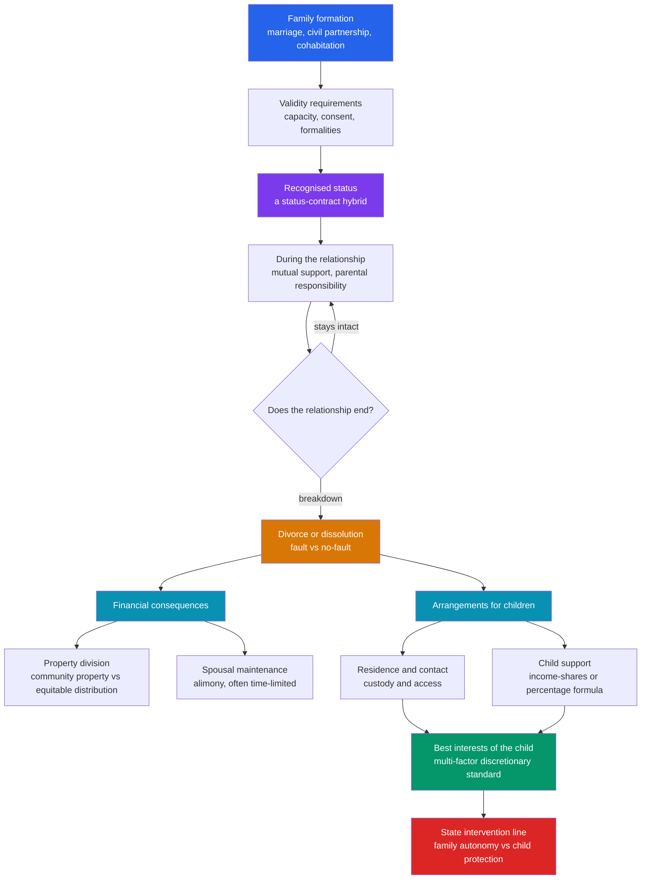

# 👨‍👩‍👧 Family Law

> [!abstract] TL;DR
> **Family law** is the branch of private law that governs **domestic relations** — how intimate partnerships are formed (marriage, civil partnership, cohabitation), the legal consequences of that status while it lasts, how it is dissolved (divorce), and how the fallout is distributed: **property division**, **spousal maintenance**, and — above all — **arrangements for children**. Two structural features make it unlike the rest of private law. First, marriage is a **status-contract hybrid**: you consent to enter it like a contract, but its core terms are fixed by the state, not by the parties, and you cannot simply agree to exit it. Second, wherever children are involved the court is not merely refereeing between two adults — it owes a duty to a **third party who did not sign anything**, and it discharges that duty through the deliberately open-ended **"best interests of the child"** standard. That standard is powerful precisely because it is **indeterminate**: it is a multi-factor discretionary test rather than a bright-line rule, which is exactly why family law is where judicial discretion, cultural pluralism, and the tension between **family autonomy** and **state intervention** collide most visibly.

## Intuition

**Analogy:** Think of a marriage as a **joint venture that comes with a permanently protected third-party beneficiary**.

Two people set up a partnership. Unlike an ordinary business deal, they cannot write their own charter — the state supplies the default terms (mutual support, shared property expectations, next-of-kin status), and it also controls the exit: you cannot dissolve the venture by simply walking away; you must go through a formal winding-up (divorce) that **divides the accumulated assets** and may require one partner to keep **supporting** the other. So far this is just partnership law with sticky defaults and a mandatory liquidation procedure.

The twist is the **child**. A child is a stakeholder who never signed the deal, cannot protect their own interests, and outlasts the venture itself. So the law inserts a **guardian of that stakeholder** — the court, acting on the "best interests of the child" — with authority to override *what the two partners want* whenever the child's welfare demands it. Two loving parents may agree on a custody split, but a judge can still refuse it if it fails the child. That single move — a protected beneficiary whose interests trump party autonomy — is why family law feels different from contract or property: the parties are never fully in control of their own arrangement.

---

## How It Works

### Core mechanics

Family law tracks a **life cycle**: formation, subsistence, dissolution, and consequences.

1. **Formation.** A valid marriage requires three things: **capacity** (both parties of legal age, unmarried, not within prohibited degrees of kinship, of sound mind), **genuine consent** (free of duress, fraud, or incapacity — a "sham" or forced marriage is voidable or void), and **formalities** (a licensed officiant, witnesses, registration — the state records the status so third parties can rely on it). Meeting these transforms two legal individuals into a single recognised **status**. Alternatives to marriage now exist: **civil partnerships** (a parallel registered status, historically created for same-sex couples before marriage equality and now often open to all), and **cohabitation**, which in most systems confers **far weaker automatic rights** than marriage — the classic "common-law marriage" is a myth in most modern jurisdictions.

2. **Subsistence.** While the relationship lasts, the law attaches consequences: mutual duties of support, shared property expectations, inheritance and pension rights, next-of-kin medical authority, tax treatment, and — for any children — **parental responsibility** (the bundle of rights and duties to make decisions about a child's upbringing, education, medical care, and residence).

3. **Dissolution.** The historic system required proving a **fault** ground — adultery, cruelty, desertion — turning divorce into an adversarial contest. The modern trend is decisive: the shift to **no-fault divorce**, where **irretrievable breakdown** of the marriage is sufficient and neither party must blame the other. No-fault reduces conflict, lowers litigation cost, and de-links the *decision to divorce* from the *financial and child outcomes* that are decided separately.

4. **Consequences.** Dissolution splits into two independent questions. **Money:** how is property divided, and is ongoing support owed? **Children:** where do they live, who has contact, and who pays for their upkeep?

### The two property regimes

- **Community property** (much of continental Europe, Latin America, several US states): assets acquired *during* the marriage are jointly owned 50/50 by operation of law, and are split equally on divorce. Property owned before, or received by gift or inheritance, is usually **separate**.
- **Equitable distribution** (most common-law jurisdictions and the majority of US states): the court divides marital property **fairly**, which is not the same as equally — it weighs contributions (including non-financial homemaking and childcare), the length of the marriage, and future needs.

On top of division sits **spousal maintenance / alimony** — ongoing payments to a lower-earning ex-spouse, increasingly time-limited and rehabilitative rather than permanent.

### Children: the paramountcy principle

For children, the governing rule is that the child's welfare is the **paramount consideration** — not merely one interest among many, but the **decisive** one. Courts allocate:

- **Residence / custody** — where and with whom the child primarily lives (sole or shared).
- **Contact / access** — the other parent's time with the child.
- **Child support** — a financial transfer sized by formula, either an **income-shares** model (estimate what the intact household would have spent on the child, split it by each parent's income share) or a **percentage-of-income** model (a flat percentage of the payer's income scaled by the number of children).

The "best interests" test is deliberately a **multi-factor, discretionary standard** (stability, each parent's caregiving history, the child's own wishes weighted by maturity, continuity of schooling and community, and the parents' ability to cooperate). Its open texture is both its strength — it fits every unique family — and its weakness — it is **indeterminate and hard to predict**, a live example of the discretion-versus-rules debate in [[Philosophy_of_Law_Jurisprudence]].



---

## Key Concepts

### Secondary level

- **Marriage as a status.** Getting married is not like signing a lease. You consent to enter, but you do not draft the terms — the state does — and you cannot leave by mutual agreement alone; you need a court to dissolve the status. This is why lawyers call marriage a **status-contract hybrid**.
- **Void vs voidable.** A **void** marriage never legally existed (e.g. bigamous or within prohibited kinship). A **voidable** marriage is valid until one party asks a court to annul it (e.g. lack of consummation or consent obtained by fraud). Both differ from **divorce**, which ends a *valid* marriage.
- **No-fault divorce.** Modern law lets couples divorce on the ground that the marriage has **irretrievably broken down**, without proving that either spouse did something wrong. This replaced the old system where you had to prove adultery, cruelty, or desertion.
- **Custody and access.** After separation, "custody" or "residence" is about where the child mainly lives; "access" or "contact" is the other parent's time with the child. The court decides both by asking what is **best for the child**, not what is fair to the parents.
- **Child support.** Whichever parent the child lives with less pays a **formula-based** amount to help cover the child's costs. It scales with the payer's income and the number of children.

### Undergraduate level

- **The transformation of marriage law.** Three historical stages: **coverture** (under English common law, a wife's legal identity was subsumed into her husband's — she could not own property, contract, or sue independently; "husband and wife are one person, and that person is the husband," Blackstone); then **formal equality** (19th–20th century Married Women's Property Acts and equal-rights reforms restored the wife's separate legal personality); then **marriage equality** (extension of marriage to same-sex couples, e.g. *Obergefell v. Hodges*, 578 U.S. 644 (2015), holding that the right to marry is a fundamental liberty the state cannot deny on the basis of the couple's sex).
- **Cohabitation's rights gap.** Long-term unmarried partners typically acquire **no automatic** claim to each other's property, no maintenance right, and no default inheritance — a trap for couples who assume "common-law marriage" protects them. Reform proposals seek to grant cohabitants limited remedies on separation.
- **Two divorce financial regimes compared.** **Community property** = mechanical 50/50 split of marital acquisitions; predictable but rigid. **Equitable distribution** = discretionary "fair" split accounting for needs and non-financial contribution; flexible but less predictable.
- **The best-interests factors.** Statutes typically enumerate factors: each parent's capacity and history of caregiving, the child's emotional ties, stability and continuity of home and school, the child's own wishes (weighted by age and maturity), any history of domestic violence, and each parent's willingness to support the child's relationship with the other. No factor is dispositive — the court **weighs** them.
- **Parenthood is not one thing.** Assisted reproduction split the once-unified idea of "parent" into distinct claims: **genetic** (the gamete providers), **gestational** (the person who carries and gives birth), and **intentional** (those who arranged and mean to raise the child). Surrogacy forces the law to choose which claim founds legal parenthood — and different jurisdictions choose differently.

### Graduate level

- **Indeterminacy of the best-interests standard.** Robert Mnookin's classic critique: the standard is so open that it functions less as a rule than as a delegation of near-unfettered **discretion** to the individual judge, making outcomes hard to predict, encouraging litigation, and inviting the smuggling-in of the decision-maker's own values. This is the family-law instance of the rules-versus-standards and judicial-discretion debates in [[Philosophy_of_Law_Jurisprudence]]. Reforms respond with structuring devices: rebuttable presumptions (e.g. of shared parenting), the "primary caretaker" tie-breaker, and the "approximation" rule (replicate the pre-separation division of caregiving time).
- **Private ordering in the shadow of the law.** Mnookin and Kornhauser argued that most divorces are settled by **bargaining**, and the legal rules matter chiefly as **endowments** — the outcome the parties would get in court sets each side's threat point. Legal reform therefore reshapes negotiations even in cases that never reach trial.
- **The autonomy / intervention frontier.** Liberal states protect **family privacy** — a presumption that parents, not officials, decide how to raise children — yet also run **child-protection** systems empowered to remove children from harm. The doctrinal question is where the threshold for coercive intervention lies (significant harm, or its likelihood), and the policy risk runs both ways: under-intervention leaves children in danger; over-intervention breaks up families along class and racial lines.
- **Comparative parenthood in surrogacy.** Civil-law jurisdictions often anchor motherhood in **gestation** (*mater semper certa est* — the birth mother is the legal mother, requiring adoption to transfer parenthood), while other systems enforce **intentional** parenthood via pre-birth orders. Cross-border surrogacy produces **limping** parent-child relationships recognised in one country but not another — a growing private-international-law problem.
- **Law, culture, and religion.** Family law is the field where the secular state most directly meets **religious and customary norms** — religious marriage and divorce (the Jewish *get*, Islamic *nikah* and *talaq*, *mahr* enforcement), the recognition or non-recognition of polygamous marriages contracted abroad, and debates over religious arbitration of family disputes. This is where legal pluralism is most contested; the anthropological backdrop is in [[Kinship_Marriage_and_Family_Systems]] and the sociological one in [[Family_Marriage_and_Kinship]].

---

## Python Demo

Two models. First, the **best interests of the child** as a multi-factor **weighted decision** — two hypothetical custody arrangements are scored across five factors, the child's stated preference is up-weighted as the child matures, and the weighted totals are compared. Second, an **income-shares child-support schedule** showing how the support owed scales with the paying parent's income and the number of children.

```python
# Family law quantified: (1) best-interests weighted decision,
# (2) income-shares child-support schedule. numpy + matplotlib only.
import numpy as np
import matplotlib.pyplot as plt

# ---------- Part 1: "best interests of the child" as a weighted score ----------
factors = [
    "Stability\nof home",
    "Caregiving\nhistory",
    "Child's stated\npreference",
    "Continuity of\nschool/community",
    "Co-parenting\ncooperation",
]

# The child's own preference is given more weight as the child matures:
# near zero for toddlers, rising and saturating through the teens.
child_age = 12
def preference_weight(age):
    return 0.30 / (1.0 + np.exp(-(age - 12) / 2.5))

base_weights = np.array([0.30, 0.30, 0.00, 0.22, 0.18])  # 4 factors + placeholder
w_pref = preference_weight(child_age)
weights = base_weights.copy()
weights[2] = w_pref
weights = weights / weights.sum()          # renormalise so the weights sum to 1

# Score each arrangement 0-10 on every factor.
# A = primary residence with Parent 1 (long-time primary carer, same school, stable)
# B = shared 50/50 residence (two homes, more logistical strain, child leans to Parent 2)
score_A = np.array([9, 8, 5, 9, 5], dtype=float)
score_B = np.array([6, 6, 7, 6, 7], dtype=float)

contrib_A = weights * score_A
contrib_B = weights * score_B
total_A, total_B = contrib_A.sum(), contrib_B.sum()

# ---------- Part 2: income-shares child-support schedule ----------
def basic_support_fraction(n):
    # marginal share of COMBINED income devoted to children; declines per extra child
    return {1: 0.17, 2: 0.25, 3: 0.29, 4: 0.31}[n]

def economy_of_scale(combined_income):
    # higher-income households spend a SMALLER fraction on the children
    return np.clip(1.0 - 1.5e-5 * combined_income, 0.60, 1.0)

other_parent_income = 3000.0                       # monthly gross of the resident parent
payor_income = np.linspace(1000, 15000, 300)       # monthly gross of the paying parent

def child_support(payor_inc, n, other_inc=other_parent_income):
    combined = payor_inc + other_inc
    bcso = combined * basic_support_fraction(n) * economy_of_scale(combined)
    payor_share = payor_inc / combined             # pay in proportion to income share
    return bcso * payor_share

# ---------- Plot ----------
fig, axes = plt.subplots(1, 2, figsize=(14, 5.5))

ax = axes[0]
x = np.arange(len(factors))
bw = 0.38
ax.bar(x - bw / 2, contrib_A, bw, label="A: primary residence, Parent 1", color="#2563eb")
ax.bar(x + bw / 2, contrib_B, bw, label="B: shared 50/50 residence",       color="#d97706")
ax.set_xticks(x); ax.set_xticklabels(factors, fontsize=8)
ax.set_ylabel("Weighted contribution to score")
ax.set_title(f"Best interests of the child (age {child_age})\n"
             f"weighted totals   A = {total_A:.2f}   B = {total_B:.2f}")
ax.legend(fontsize=8); ax.grid(axis="y", alpha=0.3, ls="--")

ax = axes[1]
for n in [1, 2, 3, 4]:
    ax.plot(payor_income, child_support(payor_income, n),
            label=f"{n} child" + ("ren" if n > 1 else ""))
ax.set_xlabel("Paying parent gross monthly income")
ax.set_ylabel("Monthly child support owed")
ax.set_title("Income-shares child-support schedule\nresident parent income fixed at 3000")
ax.legend(title="Children"); ax.grid(alpha=0.3, ls="--")

plt.tight_layout()
plt.savefig("family_law_demo.png", dpi=120, bbox_inches="tight")
plt.show()

winner = "A (primary with Parent 1)" if total_A > total_B else "B (shared 50/50)"
print(f"Preference weight at age {child_age}: {w_pref:.3f}")
print("Normalised weights:", np.round(weights, 3))
print(f"Weighted score   A = {total_A:.3f} | B = {total_B:.3f}")
print(f"Indicated arrangement: {winner}")
print("Nudge one weight or one score and the winner can flip -> "
      "this is the indeterminacy critique of the best-interests standard.")
```

**What to observe.** In Part 1, arrangement A wins on the chosen inputs, but the margin rides on **how much weight the child's preference carries** — set `child_age` to 16 and the preference weight climbs, pulling toward B, which is exactly Mnookin's point: the "same" standard yields different results depending on discretionary weightings, so outcomes are hard to predict. In Part 2, the support curves are **concave**: they rise with the payer's income but with a **declining marginal rate** (the economy-of-scale factor), and each additional child raises the schedule by **less** than the previous one — the structural signature of income-shares formulas.

---

## Real-World Applications

**1. *Obergefell v. Hodges* and marriage equality (US, 2015).** The Supreme Court held that same-sex couples have a fundamental right to marry, completing the arc from coverture through formal equality to full marriage access. The ruling illustrates marriage as a **legal status** whose bundle of consequences — tax, inheritance, next-of-kin, parental presumptions — the state cannot selectively withhold.

**2. England and Wales no-fault divorce (2022).** The Divorce, Dissolution and Separation Act 2020 abolished the requirement to prove fault or years of separation, letting a spouse (or the couple jointly) end a marriage by a simple statement of irretrievable breakdown — the culmination of the global no-fault shift, designed to reduce the acrimony that fault contests injected into arrangements for children.

**3. Cross-border surrogacy disputes.** Cases where a child is born to a surrogate in one country for intended parents in another expose the **genetic / gestational / intentional** fracture: the child may be legally parentless or stateless because the birth country assigns parenthood to the surrogate while the intended parents' country recognises only their own adoption or parental-order process. This drives ongoing reform of parental-order and private-international-law rules.

**4. Child-support enforcement agencies.** State agencies (the US Office of Child Support Enforcement, the UK Child Maintenance Service) apply **percentage-of-income** or **income-shares** formulas at population scale, using wage-withholding, tax-refund interception, and license suspension to collect. The formula in the demo is a simplified version of the tables these agencies actually run.

**5. Domestic-violence protective orders.** Restraining or protection orders — fast-track civil remedies that can exclude an abuser from the home, bar contact, and grant temporary custody — are a core family-law tool sitting exactly on the **autonomy-versus-intervention** line, letting the state override family privacy to prevent harm.

---

## Common Pitfalls

- **Believing in "common-law marriage."** In most modern jurisdictions, living together for years confers **no automatic** property, maintenance, or inheritance rights. Cohabiting partners who assume they are protected discover on separation or death that they are not — the single most common lay misconception in family law.
- **Confusing divorce, annulment, and void marriage.** Divorce ends a **valid** marriage; annulment declares a **voidable** one retroactively defective; a void marriage **never existed**. They have different grounds and different consequences for property and legitimacy.
- **Treating "best interests" as a formula.** It is a **standard**, not a rule — a multi-factor weighing with no fixed weights. Expecting it to yield a single objectively correct answer misreads its deliberately discretionary nature and underestimates how much the individual judge matters.
- **Assuming shared 50/50 residence is always "fairest" for the child.** Equal time is fairness *between parents*; the child's paramount interest may favour stability and continuity over symmetry, especially where cooperation is poor or one parent was the primary carer.
- **Equating equitable distribution with equal distribution.** "Equitable" means **fair in the circumstances**, which can be a very unequal split once non-financial contributions and future needs are weighed. Community-property 50/50 is the regime that mandates equality; equitable distribution does not.
- **Ignoring the genetic / gestational / intentional split in assisted reproduction.** Treating "the parent" as obvious collapses distinctions the law must actually resolve; who is the legal parent in surrogacy depends entirely on which of these claims the jurisdiction privileges.
- **Overlooking domestic violence in custody decisions.** A history of abuse is not a peripheral factor to be balanced away against "co-parenting cooperation"; it can independently defeat contact, and courts that treat it as one factor among equals endanger children and victims.

---

## Related Concepts

- [[Philosophy_of_Law_Jurisprudence]] — the best-interests test is family law's flagship case of **judicial discretion** and the rules-versus-standards debate; Mnookin's indeterminacy critique is the Hart/Dworkin dispute applied to custody.
- [[Family_Marriage_and_Kinship]] — the sociological counterpart: how the family institution, marriage forms, and household structures actually change, which family law both reflects and shapes.
- [[Kinship_Marriage_and_Family_Systems]] — the anthropological backdrop of descent, residence, and alliance rules; shows that the nuclear-family model family law often assumes is one configuration among many.
- [[Gender_Sex_and_Patriarchy]] — coverture, the male-breadwinner maintenance model, and the gendered division of care work are the structures family-law reform has been dismantling.
- [[Law_Deviance_and_Social_Control]] — child-protection and protective-order regimes are where family law operates as an instrument of state social control over the "private" sphere.

---

## Review Questions

### Secondary

1. Explain why lawyers call marriage a "status-contract hybrid." Name one way it behaves like a contract and one way it does not.
2. What changed when jurisdictions moved from fault-based to **no-fault** divorce, and why is that shift usually described as reducing conflict for children?
3. A child lives mainly with one parent after separation. Which parent typically pays child support, and name two things the amount depends on.

### Undergraduate

1. Compare **community property** and **equitable distribution** as regimes for dividing assets on divorce. Give one advantage and one disadvantage of each, and explain why "equitable" does not mean "equal."
2. Trace the transformation of marriage law from **coverture** through **formal equality** to **marriage equality** (*Obergefell*). At each stage, what legal capacity or right changed hands, and to whom?
3. Assisted reproduction splits parenthood into **genetic**, **gestational**, and **intentional** claims. In a surrogacy dispute, why can these three point to different people, and what problem does that create when the surrogate and intended parents are in different countries?

### Graduate

1. Evaluate Mnookin's claim that the "best interests of the child" standard is so indeterminate that it amounts to an unstructured delegation of discretion to the individual judge. What structuring devices (presumptions, primary-caretaker rules, the approximation standard) have been proposed, and what does each gain and lose in predictability versus fit?
2. "Bargaining in the shadow of the law": explain how the legal rules governing custody and property function as **endowments** that shape settlements in cases that never reach trial. What does this imply for how a reformer should evaluate a change to those rules?
3. Where should the threshold for coercive **state intervention** in the family lie, given that under-intervention leaves children in danger while over-intervention disproportionately breaks up families along class and racial lines? Frame your answer in terms of the family-autonomy-versus-child-protection tension.

---

## Sources

- Mnookin, R. H. (1975). "Child-Custody Adjudication: Judicial Functions in the Face of Indeterminacy." *Law and Contemporary Problems*, 39(3), 226–293.
- Mnookin, R. H., & Kornhauser, L. (1979). "Bargaining in the Shadow of the Law: The Case of Divorce." *Yale Law Journal*, 88(5), 950–997.
- *Obergefell v. Hodges*, 576 U.S. 644 (2015). Supreme Court of the United States.
- Cretney, S., Masson, J., Bailey-Harris, R., & Probert, R. (2015). *Cretney's Principles of Family Law* (9th ed.). Sweet & Maxwell.
- Blackstone, W. (1765). *Commentaries on the Laws of England*, Book I, ch. 15 ("Of Husband and Wife") — the classic statement of coverture.

---

#law #family-law #marriage #custody #child-welfare
