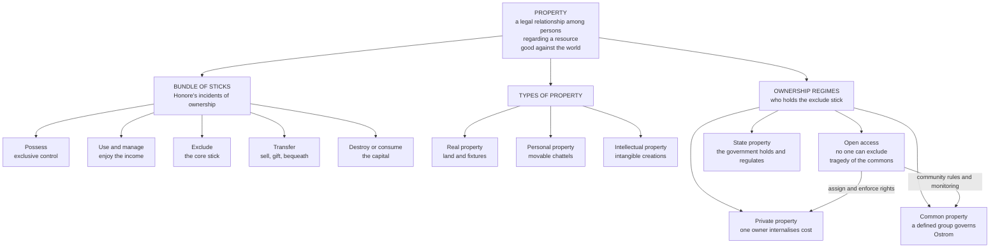

# 🏛️ Property Law

> [!abstract] TL;DR
> **Property law** governs rights *in things* — but its deep subject is not the thing at all, it is the **relationship among persons** with respect to a resource. To "own" a field is to hold a legally protected position that everyone else must respect: they may not enter, use, or take it without your leave. Modern lawyers therefore analyse ownership as a **bundle of separable sticks** — the rights to *possess, use, exclude, transfer,* and *destroy* — which can be split, sold, or reassembled independently. The single most important stick is the **right to exclude**. Property matters economically because clear, enforceable rights convert a shared, over-exploited **open-access** resource into one whose users bear the full cost of their choices — the classic cure for the **tragedy of the commons**, though not the only one.

---

## Intuition

**Analogy — a bundle of sticks.** Don't picture ownership as a single solid block you either hold or don't. Picture a **bundle of sticks tied together**, where each stick is one specific right over a resource. One stick is the right to *walk on the land*; another is the right to *farm it*; another the right to *keep everyone else off*; another the right to *sell or bequeath it*; another the right to *tear the house down*. What we loosely call "owning" a thing is just *holding the whole bundle at once*. The power of the metaphor is that the sticks come apart. A landlord sells the "occupy it now" stick to a tenant (a lease) while keeping the "get it back later" and "sell it" sticks. A bank takes the "seize it if unpaid" stick (a mortgage). A neighbour buys the "walk across it" stick (an easement). The city keeps a "regulate what you build" stick (zoning). Ownership is not one thing — it is *whoever currently holds which sticks*.

The second half of the intuition is the flip side: a stick in *your* bundle is a **duty in everyone else's**. Your right to exclude only means something because the law imposes on the whole world a duty not to trespass. This is why property is said to be a right *good against the world* — unlike a contract, which binds only the two people who signed it. When a resource has *no* owner holding the "exclude" stick — an open ocean fishery, a shared pasture, the atmosphere — nobody can be kept out, everyone races to grab their share first, and the resource is destroyed. That failure is the reason property law exists.

---

## How It Works

### Property is a relationship, not a thing

The lay idea that property is "the object you own" is precisely wrong, and untangling it is the first move in every property course. The land, the car, and the song are the *objects* of property; the property itself is the **web of legally enforced rights and duties** connecting you to *every other person* regarding that object. This is why an economist and a lawyer can both say "the fishery has no property rights" while the fish plainly exist. Property is created and destroyed by law, not by physics.

### The bundle of rights — Honoré's incidents of ownership

The most influential anatomy of full ownership is A. M. **Honoré's** list of **eleven "incidents of ownership"** (1961). The load-bearing ones:

1. **Right to possess** — exclusive physical control of the thing.
2. **Right to use** — personal enjoyment and use.
3. **Right to manage** — decide how and by whom the thing is used.
4. **Right to the income** — the fruits, rents, and profits it yields.
5. **Right to the capital** — to consume, waste, transform, or **destroy** it.
6. **Right to security** — immunity from expropriation.
7. **Power of transmissibility** — to sell, gift, or bequeath (*alienability*).
8. **Absence of term** — the interest is not time-limited.
9. Plus the **duty to prevent harm**, **liability to execution** (seizure for debt), and **residuary rights** on lapse of others' interests.

Full "liberal ownership" is holding all of them together; every lesser interest (a lease, a mortgage, a licence) is some *subset* of the bundle in someone else's hands.

### The right to exclude as the core stick

Of all the sticks, courts and theorists single out the **right to exclude** as the essential core — the "sole and despotic dominion" Blackstone famously (and misleadingly) described. Merrill argues that the right to exclude is *the* irreducible feature: strip away use, income, even transfer, and you may still have property, but remove the right to exclude and you have nothing recognisable as ownership. The US Supreme Court has repeatedly called it "one of the most treasured" strands of the bundle. Exclusion is what makes a resource *governable at all*: only if you can keep others out can you invest in, conserve, and trade the thing.

### Real vs personal vs intellectual property

The law sorts objects into three great classes, each with its own rules:

- **Real property** — *land* and things permanently attached to it (buildings, fixtures, mineral and often water rights). Governed by the elaborate machinery of **estates**, **registration**, and **servitudes** below. Historically privileged because land is permanent, immovable, and scarce.
- **Personal property (chattels)** — everything movable: goods, money, animals, vehicles. Rights are simpler, transfer is usually by delivery, and *possession* does heavy lifting.
- **Intellectual property** — intangible creations (inventions, expression, marks) protected by patent, copyright, and trademark. It stretches the bundle to non-rival goods that everyone can use at once, so the "right to exclude" must be *created* by statute rather than by physical control.

### Estates and interests in land — slicing ownership across time

Common-law systems don't just split the bundle among people; they slice it across **time** using the doctrine of **estates**. You never "own land" outright — you own an *estate in* it:

- **Fee simple absolute** — the largest estate, potentially infinite in duration, freely inheritable and transferable. The closest thing to full ownership.
- **Life estate** — the right to possess for the duration of a person's life, after which it passes to the **remainderman**.
- **Leasehold** — possession for a fixed or periodic term (the tenant's estate), with the landlord holding the **reversion**.

This produces the crucial split between **present interests** (who possesses now) and **future interests** (who is entitled later — remainders and reversions), letting ownership be carved among a tenant today, a life tenant, and a child not yet born.

### The numerus clausus principle

You cannot invent new *kinds* of property by private agreement. The **numerus clausus** ("closed number") principle holds that property forms come from a **fixed, standardised menu** — fee simple, lease, easement, mortgage, and a few others — and courts will not enforce idiosyncratic bespoke interests. Merrill and Smith explain this economically: because property binds *third parties* who never negotiated the deal, letting people mint novel property forms would impose crushing **information costs** on everyone who must investigate what rights burden a resource. Standardisation keeps those costs low. (Civil-law systems apply this principle even more strictly than the common law.)

### Possession, title, and adverse possession

**Possession** — actual physical control coupled with intent to exclude — is the raw material of property and often the best available evidence of ownership; hence the folk maxim *"possession is nine-tenths of the law."* **Title** is the legal *right* to possess, which can diverge from who is *actually* holding the thing. The two dramatically collide in **adverse possession**: someone who openly, continuously, and without permission occupies land for a long statutory period (often 10–20 years) can *acquire title* from the true owner who slept on their rights. The doctrine rewards productive use and settles long-standing possession over stale paper claims.

### Transfer and registration — deeds vs Torrens

Because property is good against the world, the world needs a way to *find out* who owns what. Two systems compete:

- **Deeds recording** — the state keeps a chronological archive of transfer documents (deeds); a buyer (or a title-insurance company) must trace the "chain of title" back through prior deeds to be sure the seller really owns it. Common in the US.
- **Torrens title registration** — the state maintains a single authoritative **register** that *is* the title. The name on the register *is* the owner; a buyer needs only to check the current entry, which the state guarantees. Invented in South Australia (1858) and now standard across Australia, New Zealand, Singapore, and much of the world. It trades a heavy up-front bureaucracy for near-zero per-transaction search costs.

### Servitudes — sticks that run with the land

**Servitudes** are property rights *one person holds in another's land*, and they "run with the land" — binding future owners, not just the original parties:

- **Easement** — a right to *use* a neighbour's land for a purpose (a right of way, a drainage or utility line).
- **Covenant** — a promise about land use (e.g., "residential only," "no fence over 2 metres") enforceable against successors.

### The commons and the tragedy of the commons

Property law's economic payoff is clearest where it is *absent*. **Garrett Hardin's** "Tragedy of the Commons" (1968) frames the problem: herders sharing an open pasture each gain the *full* benefit of adding one more animal but bear only a *fraction* of the overgrazing cost, which is spread across everyone. So every rational herder adds animals until the pasture is destroyed — a **negative externality** and an *N*-player [[Dominance_and_Rationality|Prisoner's Dilemma]]. Crucially, "the commons" hides **four different regimes**:

- **Open access** — *no one* holds the right to exclude; a free-for-all; this is the regime that collapses.
- **Common property** — a *defined community* jointly governs the resource with rules and sanctions.
- **Private property** — a single owner internalises the whole cost and benefit.
- **State property** — the government owns and regulates access.

Hardin conflated open access with common property. **Elinor Ostrom's** *Governing the Commons* (1990, Nobel 2009) is the great rebuttal: real communities — Swiss alpine pastures, Japanese forests, Spanish irrigation *huertas* — have sustainably governed **common-pool resources for centuries** without privatising or nationalising them, by evolving rules that satisfy design principles (clear boundaries, monitoring, graduated sanctions, collective choice). So the tragedy is *not* inevitable: it is a failure of *institutions*, curable by well-defined property rights **or** by robust community governance.

### The economic theory of property rights — Coase and internalisation

The commons problem is really about **externalities**, and the deepest treatment is **Ronald Coase's** *The Problem of Social Cost* (1960). The [[Coase_Theorem|Coase theorem]] states that *if property rights are clearly defined and transaction costs are zero*, private parties will bargain to the efficient allocation of resources **regardless of who initially holds the right**. The role of property law is then twofold: (1) clearly **assign** rights so that bargaining can happen, and (2) assign them to minimise the harm when transaction costs are *high* and bargaining fails. Well-defined property **internalises** the externality — it forces the decision-maker to bear the cost their choice imposes (see [[Externalities_and_Pigouvian_Tax]]).

### Takings and eminent domain

Property rights are strong but not absolute against the *state*. Governments retain the power of **eminent domain** — to compulsorily acquire private property for public use — but constitutions (e.g., the US Fifth Amendment's Takings Clause) require **"just compensation."** Harder is the **regulatory taking**: when does a *regulation* (a zoning rule, an environmental restriction) so diminish a property's value that it counts as a taking requiring compensation, versus a mere valid exercise of the state's regulatory power? US law answers with a spectrum — a total wipe-out of value is a *per se* taking (*Lucas*), while partial burdens get a multi-factor balancing test (*Penn Central*).

### Intangible and new forms of property

The bundle is straining against **new resources**: personal **data**, **digital assets** (crypto-tokens, in-game items, domain names), carbon-emission allowances, and radio spectrum. Each forces the question of whether the law will recognise a *new* thing as property (against numerus clausus pressure), and if so which sticks apply. Data is especially awkward: it is non-rival and easily copied, so a physical "right to exclude" is impossible, and regimes like the EU's GDPR grant *control* rights over personal data that look like property but are deliberately *inalienable*.



---

## Key Concepts

### Secondary (foundations)

- **Ownership** — the largest bundle of legally protected rights a person can hold in a resource.
- **Possession vs title** — *possession* is actual physical control; *title* is the legal right to possess. They usually coincide but can split apart.
- **Real vs personal property** — land and fixtures versus movable goods (chattels).
- **Right to exclude** — the power to keep others off or away from the resource; the core of property, enforced by the law of trespass.
- **Transfer / conveyance** — passing ownership to another by sale, gift, or inheritance.

### Undergraduate (structure and doctrine)

- **Bundle of rights** — ownership analysed as separable sticks (possess, use, exclude, transfer, destroy); Honoré's eleven incidents.
- **Estates in land** — fee simple, life estate, leasehold; the split between **present** and **future interests** (remainder, reversion).
- **Numerus clausus** — property comes from a *closed, standardised list* of forms; you cannot invent bespoke property by contract (Merrill & Smith's information-cost rationale).
- **Adverse possession** — long, open, hostile occupation can *convert* possession into title, extinguishing the sleeping owner's claim.
- **Servitudes** — easements (a use right) and covenants (a land-use promise) that *run with the land* and bind future owners.
- **Registration systems** — deeds recording (trace the chain of title) versus **Torrens** title registration (the register *is* the title, state-guaranteed).
- **The four commons regimes** — open access, common property, private, and state; only *open access* reliably collapses.

### Graduate (theory and frontier)

- **Coase theorem** — with clear rights and zero transaction costs, bargaining reaches efficiency regardless of the initial allocation; property law's job is to define rights and to allocate well when transaction costs are high.
- **Ostrom's design principles** — the conditions (clear boundaries, congruent rules, monitoring, graduated sanctions, conflict resolution, nested governance) under which communities sustainably self-govern common-pool resources without privatisation.
- **Regulatory takings** — the *Lucas* per-se rule (total value wipe-out) versus the *Penn Central* multi-factor balancing test for partial regulatory burdens.
- **Theories of property justification** — Locke's **labour** theory ("mixing your labour"), Hegel's **personality** theory (property as an extension of the self and freedom), Bentham's **utilitarian/security** theory, and the modern **information-cost** and **efficiency** accounts.
- **The exclusion vs governance debate** — Merrill & Smith's claim that property is fundamentally about a low-cost *right to exclude* (an *in rem*, world-binding architecture), against "bundle" theorists who see property as an infinitely divisible, policy-adjustable set of relations.
- **New property** — data, digital assets, and emission allowances stress the numerus clausus and the physical basis of the right to exclude; inalienable, control-based data "rights" that resist the classic alienability stick.

---

## Python Demo

```python
# Tragedy of the commons vs well-defined property rights.
# A shared pasture with logistic regrowth is grazed by herders.
# Open access: each herder adds animals while it is privately profitable,
#   ignoring the shared cost of overgrazing (a negative externality) ->
#   effort overshoots, the resource is driven to a tiny remnant (collapse).
# Property rights: a sole owner (or an enforced quota) internalises the full
#   cost and holds effort at the sustainable-rent optimum -> stock stays high.
# Gordon-Schaefer bioeconomic model. numpy + matplotlib only.
import numpy as np
import matplotlib.pyplot as plt

# --- Resource and economic parameters ---------------------------------------
K = 1000.0      # carrying capacity of the pasture (grass units)
r = 0.60        # intrinsic regrowth rate of the resource
q = 0.01        # "catchability": grazing pressure per animal
p = 1.0         # price / private benefit per unit grazed
c = 0.50        # private cost per animal per period
T = 120         # time steps

# Open-access bionomic equilibrium: profit per animal is zero when p*q*R = c
R_openaccess_eq = c / (p * q)                      # ~ 50  (5% of K -> collapse)

# Sole-owner optimum: choose constant effort E maximising sustainable rent.
# Sustainable stock at effort E is R*(E) = K*(1 - q*E/r); rent = p*q*E*R - c*E.
E_opt = (r / (2 * q)) * (1.0 - c / (p * q * K))     # profit-maximising effort
R_property_eq = K * (1.0 - q * E_opt / r)           # sustained healthy stock


def simulate(adaptive_effort):
    """Run the pasture forward. Returns (stock, effort) time series."""
    R = np.zeros(T)
    E = np.zeros(T)
    R[0] = 0.9 * K          # both regimes start with a near-full pasture
    E[0] = 5.0              # both start with a few animals
    for t in range(T - 1):
        growth = r * R[t] * (1.0 - R[t] / K)        # logistic regrowth
        harvest = q * E[t] * R[t]                    # total grazing this period
        harvest = min(harvest, R[t] + growth)        # cannot graze below zero
        R[t + 1] = max(R[t] + growth - harvest, 0.0)
        if adaptive_effort:
            # Myopic open access: each herder adds animals while it pays.
            # Effort grows when private margin (p*q*R - c) is positive.
            margin = p * q * R[t] - c
            E[t + 1] = max(E[t] + 0.02 * margin * E[t], 0.1)
        else:
            E[t + 1] = E_opt                         # enforced quota / sole owner
    return R, E


R_open, E_open = simulate(adaptive_effort=True)      # open access
R_prop, E_prop = simulate(adaptive_effort=False)     # property rights / quota

# --- Plot -------------------------------------------------------------------
fig, (ax1, ax2) = plt.subplots(2, 1, figsize=(10, 8), sharex=True)

ax1.plot(R_open, color="#c62828", lw=2.2, label="Open access (no exclusion)")
ax1.plot(R_prop, color="#2e7d32", lw=2.2, label="Property rights / quota")
ax1.axhline(K, color="#888888", ls=":", lw=1, label="Carrying capacity K")
ax1.axhline(R_property_eq, color="#2e7d32", ls="--", lw=1, alpha=0.6)
ax1.axhline(R_openaccess_eq, color="#c62828", ls="--", lw=1, alpha=0.6)
ax1.set_ylabel("Resource stock (grass units)")
ax1.set_title("Tragedy of the Commons vs Well-Defined Property Rights")
ax1.legend(loc="center right")
ax1.grid(alpha=0.3)

ax2.plot(E_open, color="#c62828", lw=2.2, label="Open access effort (animals)")
ax2.plot(E_prop, color="#2e7d32", lw=2.2, label="Sustainable optimum effort")
ax2.set_xlabel("Time (grazing seasons)")
ax2.set_ylabel("Total grazing effort (animals)")
ax2.set_title("Effort: open access overshoots; the owner holds the optimum")
ax2.legend(loc="upper right")
ax2.grid(alpha=0.3)

plt.tight_layout()
plt.savefig("tragedy_of_the_commons.png", dpi=120, bbox_inches="tight")
plt.show()

print(f"Open-access remnant stock  ~ {R_open[-10:].mean():6.1f}  "
      f"({100 * R_open[-10:].mean() / K:4.1f}% of K)")
print(f"Property-rights stock      ~ {R_prop[-10:].mean():6.1f}  "
      f"({100 * R_prop[-10:].mean() / K:4.1f}% of K)")
```

Running this produces two stacked panels. In the **top panel**, the green line (property rights) settles at a high, stable stock — roughly half of carrying capacity — while the red line (open access) crashes as unchecked herders pile on animals, driving the pasture down toward the near-zero *bionomic equilibrium* where all rent has been dissipated. The **bottom panel** shows the mechanism: open-access effort *overshoots* wildly because each herder ignores the cost imposed on everyone else, whereas the owner holds effort steady at the level that maximises *sustainable* yield. Same resource, same biology — the only difference is who holds the right to exclude.

---

## Real-World Applications

> **Fisheries and individual transferable quotas (ITQs).** Open-ocean fisheries are the textbook modern commons, and many have collapsed (the Atlantic cod). Iceland, New Zealand, and Alaska halted the race-to-fish by creating **ITQs** — tradable *property rights* to a share of the annual sustainable catch. Fishers who own a secure quota now have a stake in the stock's long-term health, exactly as the Python model predicts. This is Coase and Ostrom in action.

> **Torrens title and land markets.** Australia, New Zealand, and Singapore run **Torrens registration**: a single state-guaranteed register that *is* the title. It slashes the cost and risk of buying land — no chain-of-title searches, no title insurance — and underpins efficient, liquid property markets. It is one of the most successful legal exports of the 19th century.

> **Eminent domain — *Kelo v. City of New London* (2005).** The US Supreme Court held that a city could compulsorily acquire private homes and transfer them to a *private* developer for economic redevelopment, treating that as a "public use" requiring just compensation. The decision provoked a national backlash and dozens of state laws narrowing takings powers — a live demonstration that the "security" stick is strong but not absolute against the state.

> **Radio spectrum auctions.** Spectrum was once an unownable commons plagued by interference. Governments now define exclusive, tradable **spectrum licences** and auction them (the FCC since 1994), creating property rights in an intangible resource and letting it flow to its highest-value use — a direct application of the economic theory of property rights.

> **Data and digital assets.** GDPR grants individuals control-style rights over personal **data**, while crypto-tokens, domain names, and in-game items force courts to decide whether novel digital things are "property" at all. These frontier cases test the numerus clausus and the very idea of a physical right to exclude.

---

## Common Pitfalls

- **Thinking property is the *thing*.** The single most common error. Property is the *relationship among persons* regarding a resource, not the resource itself. Get this wrong and doctrines like "the fishery has no property rights" or splitting ownership across time become incomprehensible.
- **Reading "possession is nine-tenths of the law" as ownership.** Possession is powerful *evidence* of a right and a good default, but it is not title. A thief possesses; an owner with better title can still recover.
- **Believing ownership is absolute.** Blackstone's "sole and despotic dominion" is a rhetorical myth. Every real ownership is riddled with limits — zoning, easements, taxes, nuisance law, eminent domain. Full ownership is a *maximal bundle*, never an unlimited one.
- **Equating all commons with the tragedy.** Hardin conflated **open access** (no exclusion, collapses) with **common property** (a defined community governs, often sustainably). Ostrom's whole point is that community-managed commons are a *third* option between privatisation and the state, and frequently the best one.
- **Assuming privatisation is always the fix.** The Coase theorem's efficiency result depends on **low transaction costs**; where they are high (diffuse pollution, migratory fish, the atmosphere), simply "assigning rights" does not solve the problem, and Ostrom-style governance or regulation may beat privatisation.
- **Inventing bespoke property by contract.** Because of **numerus clausus**, parties cannot conjure a brand-new *kind* of property right that binds third parties. Novel arrangements must be squeezed into the standard forms (lease, easement, trust) or they fail against outsiders.
- **Ignoring future interests.** Beginners see "the owner" and forget that a life tenant, a remainderman, a mortgagee, and a lessee may all hold slices of the same land at once. Ask *which sticks* each party holds, not *who owns it*.

---

## Related Concepts

- [[Law_and_Legal_Systems_Overview]] — property is one of the three pillars of **private law** (with contract and tort); this note sits inside that map.
- [[Sources_of_Law]] — property rights arise from a mix of statute, registration systems, and judge-made precedent; the hierarchy of sources decides which rule wins.
- [[Common_Law_vs_Civil_Law]] — estates and the trust are common-law inventions, while civil-law systems apply numerus clausus even more strictly; the traditions carve ownership differently.
- [[Philosophy_of_Law_Jurisprudence]] — the deep justifications for property (Locke's labour, Hegel's personality, utilitarian security) are questions of legal and political philosophy.
- [[Coase_Theorem]] — the economic core of property: clear rights plus low transaction costs yield efficiency regardless of who holds the right.
- [[Externalities_and_Pigouvian_Tax]] — the tragedy of the commons is a negative externality; property rights *internalise* it, an alternative to Pigouvian taxation.
- [[Public_Goods]] — commons (rivalrous, non-excludable) contrast with public goods (non-rivalrous); both fail without institutions, in opposite ways.
- [[Market_Failures]] — open-access commons are a canonical market failure that property law and regulation exist to correct.
- [[Dominance_and_Rationality]] — the tragedy of the commons is an *N*-player Prisoner's Dilemma: over-exploitation is the dominant-strategy equilibrium.
- [[Price_of_Anarchy]] — quantifies exactly how far the selfish (open-access) equilibrium falls short of the social optimum.
- [[Ecological_Resilience_and_Ecosystems]] — Ostrom's polycentric commons governance and the "panacea trap": why one-size-fits-all privatise-or-nationalise rules fail.
- [[Feedback_Loops_and_Causality]] — the overgrazing collapse is a reinforcing feedback loop; property rights add the balancing loop that stabilises the stock.

---

## Review Questions

**Secondary.** Explain the "bundle of sticks" idea of ownership. When a homeowner takes out a mortgage and rents a room to a tenant, which "sticks" has she given away and which has she kept? Why does it make sense to say she still "owns" the house?

**Undergraduate.** A village pasture is shared by ten herders and is slowly being destroyed by overgrazing. Describe *why* this happens in terms of costs and benefits. Then compare three fixes — privatising the pasture, creating a state-run permit system, and letting the villagers self-govern it under Ostrom's principles — and give one advantage and one risk of each.

**Graduate.** "If property rights are clearly defined and transaction costs are zero, it does not matter who is initially given the right — the efficient outcome results anyway." State whose theorem this is, explain the reasoning, and then argue why real-world commons (e.g., ocean fisheries or the atmosphere) so often *cannot* be solved this way. What does your answer imply about when the law should assign private property versus regulate or support community governance?

---

## Sources

- Honoré, A. M. (1961). "Ownership," in A. G. Guest (ed.), *Oxford Essays in Jurisprudence*. Oxford University Press.
- Hardin, G. (1968). "The Tragedy of the Commons." *Science*, 162(3859), 1243–1248.
- Ostrom, E. (1990). *Governing the Commons: The Evolution of Institutions for Collective Action*. Cambridge University Press.
- Coase, R. H. (1960). "The Problem of Social Cost." *Journal of Law and Economics*, 3, 1–44.
- Merrill, T. W., & Smith, H. E. (2000). "Optimal Standardization in the Law of Property: The Numerus Clausus Principle." *Yale Law Journal*, 110(1), 1–70.
- Blackstone, W. (1766). *Commentaries on the Laws of England*, Book II ("Of the Rights of Things"). Clarendon Press.

---

#law #property-law #ownership #tragedy-of-the-commons #real-property
