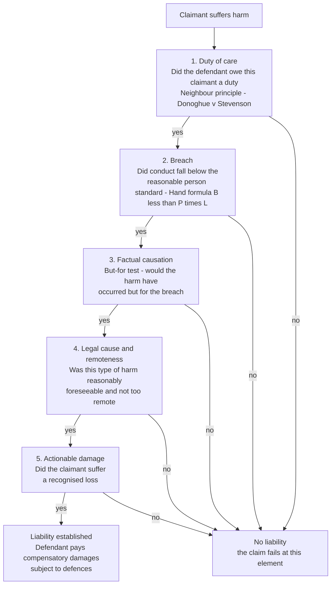

# ⚖️ Tort Law

> [!abstract] TL;DR
> **Tort law** is the law of *civil wrongs* — it decides who must pay compensation when one person's conduct injures another *outside of any contract*. Its dominant engine is **negligence**, which imposes liability only when a defendant who owed a **duty of care** *breached* the standard of the reasonable person, and that breach *caused* real *damage*. Layered on top are **intentional torts** (battery, assault, trespass), **strict liability** (fault-free liability for abnormally dangerous activities and defective products), **nuisance**, and **defamation**. The economics of the field is captured by the **Learned Hand formula**: a person is negligent when the *burden* of a precaution ($B$) is less than the *probability* of harm times its *magnitude* ($P \times L$) — a test that makes the legal standard of care track the economically efficient level of precaution.

---

## Intuition

**Analogy:** Imagine your neighbour is burning leaves, the fire jumps the fence, and your shed goes up in flames. You never signed anything with them — there is no contract to sue on. Yet you have clearly been *wronged*: their careless act destroyed your property. Tort law is the branch of the legal system that answers exactly this everyday question — **"you harmed me, even though we had no deal; who pays, and how much?"** It is the civil-law counterpart to "look what you made me do," turned into an enforceable claim for money.

Now sharpen the intuition. Not *every* harm should shift to the person who caused it — if it did, driving a car or running a factory would be impossibly risky. So tort law draws a line: you pay when you failed to take a precaution that a *reasonable person* would have taken, given how likely and how serious the harm was. That line is not moral perfectionism; it is a rough cost–benefit rule about when society wants people to be more careful. The rest of the field is variations on this theme — sometimes the line moves to *pure intent* (you meant to hit me), sometimes to *no fault at all* (you kept a tiger, so any escape is on you).

---

## How It Works

### What a tort is, and what it is for

A **tort** (from the Latin *tortum*, "twisted" or "wrong") is a *civil wrong* — a breach of a duty imposed by law, not by agreement, that gives the injured party a right to a **remedy**, usually **damages** (money). Torts pursue four often-competing **aims**:

1. **Compensation (corrective justice)** — restore the victim, so far as money can, to the position they were in before the wrong. This is the backward-looking, individual-justice rationale associated with Aristotle and modern theorists like Ernest Weinrib: the wrongdoer must *undo* the harm they wrongly caused.
2. **Deterrence (optimal precaution)** — make actors internalise the costs their conduct imposes on others, so they take efficient care. This is the forward-looking, economic rationale (see the Hand formula below).
3. **Loss-spreading** — shift losses from an individual victim, who is crushed by them, onto a party better able to absorb or distribute them (a firm, ultimately its customers, or an insurer's pool of policyholders).
4. **Vindication / accountability** — publicly mark the defendant's conduct as wrongful, especially in defamation and intentional torts.

### The dominant tort: negligence

Modern tort litigation is overwhelmingly about **negligence** — carelessly causing harm. A negligence claim succeeds only if the claimant proves **five elements**, each a potential off-ramp:

1. **Duty of care.** Did the defendant owe *this* claimant a legal duty to be careful? The foundational answer is the **neighbour principle** from *Donoghue v Stevenson* (1932): you must take reasonable care to avoid acts you can reasonably foresee would injure your "neighbours" — persons "so closely and directly affected by my act" that I ought to have them in contemplation. (Mrs Donoghue drank ginger beer containing a decomposed snail; the manufacturer owed her a duty despite no contract between them — the birth of the modern law of negligence and of product liability.)
2. **Breach of the standard of care.** Did the defendant's conduct fall below the standard of the **reasonable person** — the objective, hypothetical "ordinary prudent person" in the defendant's position? The standard is *objective*: a learner driver is judged by the standard of a competent driver. Professionals are held to the standard of a reasonable professional in their field.
3. **Factual causation.** Did the breach actually cause the harm? The classic test is **"but-for" causation**: *but for* the defendant's breach, would the harm have occurred? If the harm would have happened anyway, factual causation fails.
4. **Legal (proximate) cause and remoteness.** Even if factually caused, is the harm *too remote* — an unforeseeable, freakish consequence? The law cuts off liability for damage that is not a *reasonably foreseeable* type of consequence (*The Wagon Mound*, 1961), and a *novus actus interveniens* (an intervening act) can break the chain of causation.
5. **Actionable damage.** Did the claimant suffer a **recognised loss** — physical injury, property damage, or in limited cases pure economic or psychiatric harm? Negligence is *not actionable per se*: no damage, no claim.

### Beyond negligence: the other major torts

- **Intentional torts** — the defendant *intends* the act (and often the consequence). **Battery** (intentional harmful or offensive *contact*), **assault** (intentionally causing *apprehension* of imminent contact — the threat, not the blow), **false imprisonment** (unlawful total restraint of movement), and **trespass** (to land, goods, or the person). Many are *actionable per se* — no proof of damage required, because the wrong is the violation of a protected right itself.
- **Strict liability** — liability *without fault*. The defendant pays even if they took all reasonable care. It attaches to **abnormally dangerous activities**, to the escape of dangerous things under the rule in **Rylands v Fletcher** (1868 — bring something onto your land likely to do mischief if it escapes, and you are liable if it does), and centrally to **product liability**, where a manufacturer of a *defective* product is liable for resulting injury regardless of negligence. The rationale is loss-spreading and giving the best cost-avoider a reason to prevent harm.
- **Nuisance** — unreasonable interference with another's *use and enjoyment of land* (private nuisance: noise, smells, vibration) or with a right common to the public (public nuisance). It mediates conflicts between neighbouring land uses — the tort cousin of the economists' *externality*.
- **Defamation** — a false statement, published to a third party, that harms someone's reputation (*libel* if written/permanent, *slander* if spoken). It protects reputation and is a frequent battleground between free speech and personal dignity.

### The economic analysis: the Hand formula

In *United States v. Carroll Towing* (1947), Judge **Learned Hand** reduced the negligence standard to an inequality. A defendant is negligent — has breached the duty of care — when the **burden of taking a precaution** ($B$) is *less than* the **probability the precaution would have prevented ($P$)** multiplied by the **magnitude of the resulting loss ($L$)**:

$$\text{Liable for negligence if} \quad B < P \times L$$

Read as a *marginal* rule, this is exactly the condition for **economically optimal precaution**: keep spending on care until the last dollar of prevention just equals the expected accident cost it removes. A properly calibrated negligence rule therefore steers actors to the **cost-minimising level of care** — no more, no less — which is the deterrence rationale made precise. This is the bridge between doctrine and welfare economics, and it connects tort directly to externality theory ([[Externalities_and_Pigouvian_Tax]]) and to the bargaining/property-rights view of harm ([[Coase_Theorem]]).

### Flow / Architecture — the negligence enquiry



---

## Key Concepts

**Secondary / High-school level.** A *tort* is a wrong that lets you sue someone for money, even if you never made a deal with them — like when a careless driver dents your car. The biggest tort is *negligence*: you can be made to pay if you were careless and your carelessness hurt someone. The test is whether a "reasonable person" would have been more careful. Some wrongs are *on purpose* (hitting someone — a *battery*), and a few things are so dangerous that you pay even if you were careful (keeping wild animals, selling a broken product). This is different from a *crime*: a crime is the state punishing you; a tort is a private person asking you to compensate them.

**Undergraduate level.** Master the **five elements of negligence** (duty, breach, factual causation, remoteness/legal cause, damage) and be able to knock out a claim at any one of them. Anchor *duty* in the **neighbour principle** (*Donoghue v Stevenson*) and *breach* in the **objective reasonable-person standard**. Distinguish **but-for causation** (factual) from **proximate cause / remoteness** (legal, foreseeability-based). Learn the three families beyond negligence — **intentional torts** (battery/assault/false imprisonment/trespass, many *actionable per se*), **strict liability** (Rylands v Fletcher, product liability), and **nuisance/defamation**. Know the **defences**: **contributory negligence** (old common-law total bar) versus modern **comparative negligence** (damages apportioned by fault share), **assumption of risk / volenti non fit injuria** (a claimant who freely consented to the risk cannot recover), and consent. Understand **damages**: **compensatory** damages split into **pecuniary** (lost earnings, medical bills — measurable) and **non-pecuniary** (pain and suffering, loss of amenity), plus **punitive/exemplary** damages that punish egregious conduct. Grasp **vicarious liability**: an employer is strictly liable for torts an employee commits in the course of employment.

**Graduate / professional level.** Interrogate the field's hard edges. **The Hand formula and optimal deterrence:** derive negligence as marginal cost-minimisation and compare the incentive properties of a *negligence rule* versus a *strict-liability rule* (Shavell, Landes & Posner) — negligence gives *victims* care incentives via contributory negligence; strict liability shifts the activity-level decision to the injurer. **Causation under uncertainty:** how should courts handle *multiple sufficient causes* (two fires, either enough to burn the house), *indeterminate defendants* (*Sindell*'s market-share liability for DES), and *loss-of-chance* (a misdiagnosis that reduced a 40% survival chance)? The but-for test breaks down; courts substitute the "material contribution" or "NESS" (necessary element of a sufficient set) tests. **Insurance and loss-spreading:** liability insurance and the **moral-hazard** problem it creates ([[Moral_Hazard]]) — does insured deterrence still work? — and the drift toward *enterprise liability* and no-fault compensation schemes (New Zealand's accident scheme abolished personal-injury tort). **Corrective justice vs law-and-economics:** is tort a mechanism for *justice between the parties* (Weinrib, Coleman) or a *regulatory tool for efficient accident-cost minimisation* (Calabresi, *The Costs of Accidents*)? And how does the **Coase theorem** ([[Coase_Theorem]]) reframe a nuisance dispute: with zero transaction costs the efficient outcome is reached whoever holds the entitlement, so the interesting question is which *liability rule* minimises real-world transaction and administrative costs.

---

## Python Demo

```python
# The Learned Hand formula as an economics problem.
# Negligence rule: liable if the burden of a precaution B is less than the
# expected accident cost it prevents, P * L.  Read marginally, this makes the
# legal standard of care coincide with the cost-minimising ("efficient") level
# of precaution.  We compute and plot the three cost curves and mark x*.
import numpy as np
import matplotlib.pyplot as plt

# --- Model parameters -------------------------------------------------------
L  = 100_000.0   # loss magnitude if an accident occurs (dollars)
P0 = 0.50        # accident probability with ZERO precaution
k  = 0.50        # effectiveness of care (higher = each unit of care helps more)
b  = 2_000.0     # marginal burden: dollar cost per unit of precaution

# Precaution level x: from no care (0) up to a lot of care (15 units)
x = np.linspace(0, 15, 600)

# --- The three curves -------------------------------------------------------
cost_of_care   = b * x                         # B(x): rising with precaution
accident_prob  = P0 * np.exp(-k * x)           # P(x): falls as care rises
expected_loss  = accident_prob * L             # P(x) * L: expected accident cost
total_social   = cost_of_care + expected_loss  # T(x): what society bears in total

# --- The efficient (cost-minimising) level of care --------------------------
# Analytic optimum: dT/dx = b - k*P0*L*exp(-k*x) = 0  ->  x* = ln(k*P0*L/b)/k
x_star = np.log(k * P0 * L / b) / k
T_star = b * x_star + P0 * L * np.exp(-k * x_star)

# Marginal check: at x*, marginal burden b == marginal expected-loss reduction.
marg_burden = b
marg_loss_reduction = k * P0 * L * np.exp(-k * x_star)   # = -d(P*L)/dx at x*

print("EFFICIENT PRECAUTION VIA THE HAND FORMULA")
print("=" * 52)
print(f"Efficient level of care x*      : {x_star:6.2f} units")
print(f"Minimised total social cost T*  : ${T_star:,.0f}")
print(f"Marginal burden of care     b   : ${marg_burden:,.0f} / unit")
print(f"Marginal expected-loss saved P*L: ${marg_loss_reduction:,.0f} / unit")
print("-> at x* the two are equal: the Hand inequality B < P*L just binds.")
print("   Below x*, an untaken precaution is cost-justified => NEGLIGENT.")
print("   Above x*, extra care costs more than the harm it prevents => NOT required.")

# --- Plot -------------------------------------------------------------------
fig, ax = plt.subplots(figsize=(9, 6))
ax.plot(x, cost_of_care,  label="Cost of care  B(x)",            lw=2)
ax.plot(x, expected_loss, label="Expected accident cost  P(x)*L", lw=2)
ax.plot(x, total_social,  label="Total social cost  B(x) + P(x)*L", lw=2.6, color="black")

ax.axvline(x_star, color="red", ls="--", lw=1.5)
ax.plot([x_star], [T_star], "ro", ms=9)
ax.annotate(f"Efficient care x* = {x_star:.2f}\nmin total cost = ${T_star:,.0f}",
            xy=(x_star, T_star), xytext=(x_star + 1.5, T_star + 12_000),
            arrowprops=dict(arrowstyle="->", color="red"), fontsize=10)

# Shade the "negligent" region: too little care relative to the optimum
ax.axvspan(0, x_star, alpha=0.07, color="red")
ax.text(x_star / 2, ax.get_ylim()[1] * 0.92, "under-precaution\n= negligent",
        ha="center", va="top", fontsize=9, color="darkred")

ax.set_xlabel("Level of precaution / care  (x)")
ax.set_ylabel("Cost (dollars)")
ax.set_title("Learned Hand Formula: negligence standard tracks the efficient level of care")
ax.legend(loc="upper center")
ax.grid(True, alpha=0.3)
plt.tight_layout()
plt.savefig("hand_formula_efficient_care.png", dpi=120)
print("\nSaved figure -> hand_formula_efficient_care.png")
```

Running it prints the efficient level of care `x*`, confirms that at `x*` the marginal burden of precaution exactly equals the marginal expected loss it prevents (the Hand inequality `B < P*L` just ceasing to hold), and saves a plot in which the **total social cost curve is U-shaped**: too little care leaves cheap-but-forgone precautions on the table (the shaded *negligent* region), while too much care wastes resources on harms not worth preventing. The negligence standard, properly set, lands the defendant exactly at the bottom of that curve.

---

## Real-World Applications

- **Motor-vehicle accidents.** The archetypal negligence claim: did the driver breach the reasonable-driver standard, did the breach cause the collision, and what are the pecuniary (repairs, medical, lost wages) and non-pecuniary (pain and suffering) damages? Almost universally backed by compulsory **liability insurance**, which turns individual liability into a loss-spreading pool.
- **Product liability.** *Donoghue v Stevenson*'s manufacturer-to-consumer duty matured into **strict product liability**: a defectively designed or manufactured product (exploding batteries, faulty airbags, contaminated food) makes the maker liable *without proof of negligence*. This is loss-spreading and best-cost-avoider theory in action — the firm prices the risk into the product.
- **Medical malpractice.** Negligence judged against the standard of a *reasonable professional*, with hard causation problems (loss-of-chance from misdiagnosis) and a large role for expert evidence on breach.
- **Environmental and neighbour disputes.** **Nuisance** and *Rylands v Fletcher* govern pollution, flooding, and industrial escapes — the doctrinal mirror of economic **externalities** ([[Externalities_and_Pigouvian_Tax]]); a court choosing between an injunction and damages is effectively choosing a liability rule à la [[Coase_Theorem]].
- **Defamation and media.** Newspapers, broadcasters, and social-media users face libel claims that pit reputation against free expression — a domain where the tort/free-speech boundary is constantly relitigated.
- **Employer liability.** **Vicarious liability** makes hospitals, transport firms, and employers answer for torts their staff commit on the job, channelling claims toward solvent, insurable defendants.

---

## Common Pitfalls

- **Confusing tort with crime.** The *same act* (a punch, dangerous driving) can be *both* a crime and a tort, but they are separate systems: the **crime** is the *state* prosecuting to *punish*, proved *beyond reasonable doubt*, ending in a fine or prison; the **tort** is a *private* claimant suing to be *compensated*, proved on the *balance of probabilities*, ending in damages. O. J. Simpson was acquitted criminally yet held liable in tort on the same facts — different standard, different aim.
- **Confusing tort with contract.** Contract duties are *voluntarily assumed* between the parties and protect the *expectation* of a bargain; tort duties are *imposed by law* on the world at large and protect against *wrongful harm*. *Donoghue* mattered precisely because it granted a remedy where there was *no contract*.
- **Skipping causation after proving breach.** A careless defendant is *not* liable if the harm would have happened anyway — the **but-for test** must be satisfied. "They were negligent, therefore they pay" is the most common student error; negligence without causation is no tort.
- **Reading the Hand formula as a lump-sum rather than a margin.** `B < P*L` is a *marginal* condition on the *next increment* of precaution. Comparing *total* care spending to *total* expected loss gives wrong answers; the efficient point equalises *marginal* burden and *marginal* loss reduction.
- **Assuming more care is always better.** Beyond the efficient level, extra precaution costs more than the harm it prevents — the law does not (and economically should not) demand it. Perfect safety is not the standard; *reasonable* safety is.
- **Overlooking defences and apportionment.** A valid claim can still be reduced or defeated by **comparative/contributory negligence** or **volenti** (voluntary assumption of risk). Modern systems usually *apportion* damages by fault share rather than applying the harsh old *total bar*.
- **Treating strict liability as "automatic win."** Even strict liability requires that the *thing* be within the dangerous category, that it *caused* the harm, and it is subject to its own defences (e.g., act of a stranger, claimant's own fault).

---

## Related Concepts

- [[Sources_of_Law]] — tort law is largely *judge-made* common law: duty, breach, and remoteness were built case by case (*Donoghue*, *Wagon Mound*, *Carroll Towing*) through precedent, one of the primary sources.
- [[Common_Law_vs_Civil_Law]] — common-law "tort" and civil-law "delict" (e.g., French *responsabilité civile*, arts. 1240 ff. of the Code civil) solve the same problem via case law versus code; a key comparative contrast.
- [[Philosophy_of_Law_Jurisprudence]] — the deep debate over *what tort is for*: corrective justice (restoring the wronged party) versus instrumental/efficiency accounts (minimising accident costs).
- [[Coase_Theorem]] — reframes nuisance and accident disputes as bargaining over entitlements; with low transaction costs the efficient outcome arises whoever bears liability, so the liability rule matters mainly for transaction and administrative costs.
- [[Externalities_and_Pigouvian_Tax]] — a tort is the private-law response to a *negative externality* (harm imposed on a non-party); liability *internalises* that external cost much as a Pigouvian tax does.
- [[Moral_Hazard]] — liability insurance, essential for loss-spreading, blunts the deterrent edge of tort by insulating actors from the cost of their carelessness; deductibles and premiums are the counter-measures.

---

## Review Questions

1. **(Recall / conceptual)** List the five elements of the tort of negligence and explain, for each, how a defendant could defeat the claim at that specific element. Why is it said that "negligence is not actionable *per se*" while battery generally is?
2. **(Applied / scenario)** A factory could install a $2,000 guard rail that would reduce the annual probability of a worker falling from 5% to near zero; a fall causes on average $100,000 of harm. Using the Hand formula, is *failing* to install the rail negligent? Now suppose the guard would cost $2,000,000 — does your answer change, and what does that reveal about the relationship between the negligence standard and the *efficient* level of care?
3. **(Trade-off / critical)** Compare a **negligence rule** with a **strict-liability rule** as devices for minimising accident costs. Consider their effects on the *injurer's* level of care, on the *injurer's activity level*, on the *victim's* incentives, and on administrative and litigation costs. In what situations (e.g., abnormally dangerous activities, product defects) does strict liability dominate, and why might a corrective-justice theorist reject this cost-minimisation framing altogether?

---

## Sources

- Donoghue v Stevenson [1932] UKHL 100, [1932] AC 562 — Lord Atkin's *neighbour principle*; the foundation of the modern law of negligence and product liability.
- United States v. Carroll Towing Co., 159 F.2d 169 (2d Cir. 1947) — Judge Learned Hand's algebraic statement of the negligence standard, $B < P \times L$.
- Calabresi, Guido. *The Costs of Accidents: A Legal and Economic Analysis* (Yale University Press, 1970) — the classic economic theory of tort as accident-cost minimisation.
- Shavell, Steven. *Economic Analysis of Accident Law* (Harvard University Press, 1987) — rigorous comparison of negligence and strict-liability rules and their incentive effects.
- Cornell Legal Information Institute, ["Tort"](https://www.law.cornell.edu/wex/tort) — concise reference on the elements, categories, and remedies of tort law.
- Weinrib, Ernest J. *The Idea of Private Law* (Oxford University Press, 2012) — the leading modern statement of the corrective-justice theory of tort.

---

#law #tort-law #negligence #liability #hand-formula
