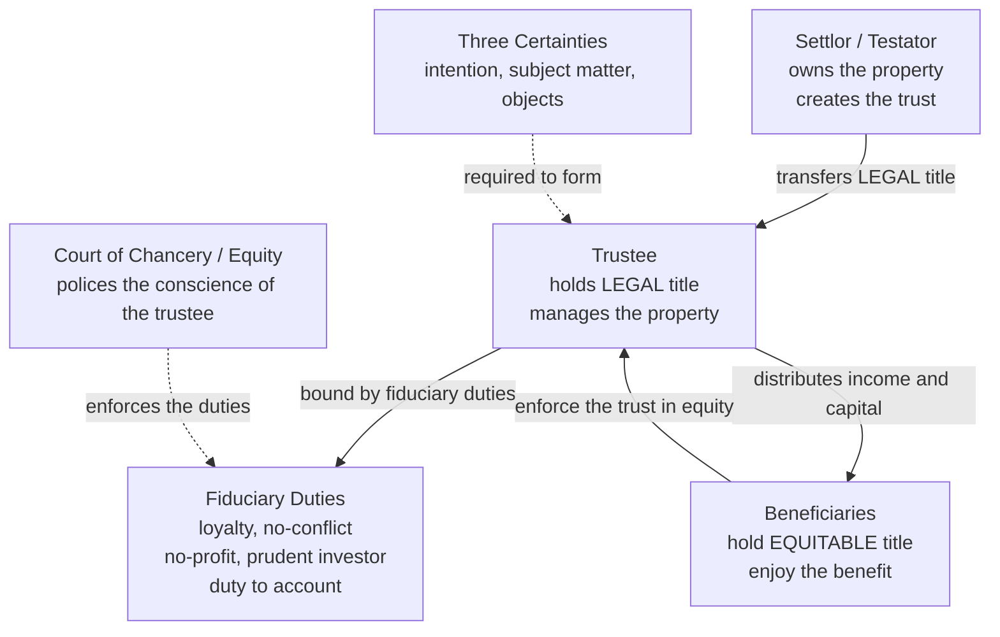

# ⚖️ Trusts, Wills and Estates

> [!abstract] TL;DR
> This is the law of **what happens to property when its owner dies** and of **how ownership can be split apart while its owner is alive**. **Succession** governs the passing of wealth at death: through a valid **will** (testate) or, failing that, through fixed **intestacy** rules; and **probate** is the court-supervised process by which a **personal representative** collects the assets, pays the debts, and distributes the rest. The **trust** — equity's single greatest invention, born in the medieval **Court of Chancery** — does something no ordinary transfer can: it splits a thing's ownership into **legal title** (held and managed by a **trustee**) and **equitable/beneficial interest** (enjoyed by a **beneficiary**). A valid express trust needs the **three certainties** (intention, subject matter, objects), and the trustee is bound by the strictest duties the law knows — **loyalty, no-conflict, no-profit, the prudent-investor rule, and a duty to account** — making the trustee the paradigm **fiduciary**. Trusts and wills together are the engine of estate planning, asset protection, pensions, charities, and investment funds.

---

## Intuition

**Analogy — the caretaker of a house they may never live in.**

Imagine you own a house, and before leaving on a long voyage you hand the **keys and the deed** to a trusted caretaker. On paper, the caretaker now *owns* the house — their name is on the title, they pay the bills, they hire the plumber, they decide when to repaint. But there is an ironclad understanding that the caretaker may **never live in the house, never sell it for their own gain, and never take a penny of the rent**. Every benefit — the roof over the head, the rental income, the value when it is finally sold — belongs to **your children**, who cannot manage the property themselves (they are too young, or too far away, or simply not to be trusted with the keys yet).

Look at what has happened: **one thing, the house, now has two owners of two different kinds.** The caretaker holds the *management* ownership — the **legal title** — with all its powers and all its burdens. Your children hold the *enjoyment* ownership — the **equitable** or **beneficial interest** — with none of the work but all of the reward. The caretaker's title is real, but it is **owned for someone else**; it is ownership drained of self-interest.

That is a **trust**. The person who set it up is the **settlor** (you), the caretaker is the **trustee**, and the children are the **beneficiaries**. Everything technical that follows — the three certainties, the fiduciary duties, the split between law and equity — is just the machinery that makes the caretaker's conscience legally enforceable, so that a trustee who *does* try to move into the house or pocket the rent can be dragged before a court and made to answer for it.

---

## How It Works

### Succession — two routes for property to pass at death

When a person (the **deceased**) dies, their **estate** — everything they owned, minus what they owed — does not vanish and does not float freely. It passes by one of exactly two routes:

1. **Testate succession** — the deceased left a valid **will** directing who gets what. The law's default here is **testamentary freedom**: in common-law systems a person can largely leave their property to whomever they like (subject to family-provision claims and forced-heirship rules that are far stronger in civil-law systems).
2. **Intestate succession** — the deceased left **no valid will**, so a statutory **intestacy** scheme decides. These rules impose a rigid order of priority (spouse/civil partner first, then children, then parents, then remoter relatives) and — a frequent shock — often give an **unmarried partner nothing at all**. Intestacy is the state's one-size-fits-all will for those who never wrote their own.

### The will and its formalities

A will is a peculiar legal instrument: it speaks only from the moment of death, is freely **revocable** until then, and to be valid must clear four hurdles.

- **Formalities.** Under statutes descended from the English Wills Act 1837 (and its US analogues), a will generally must be **in writing**, **signed** by the testator, and that signature made or acknowledged **in the presence of two witnesses** who also sign. The formalities exist for a reason: they provide **evidence** of intent, caution the testator that this is a serious act, and **protect** against fraud and forgery. A homemade will that flunks the witness requirement is simply void — the estate then passes on intestacy.
- **Capacity.** The testator must have **testamentary capacity**: broadly, they must understand that they are making a will, understand the extent of their property, and appreciate the claims of those they might be expected to provide for (the classic test from *Banks v Goodfellow*, 1870).
- **Undue influence.** A will procured by **coercion** that overpowers the testator's own volition can be set aside. Mere persuasion is allowed; overbearing the will is not.
- **Revocation.** A will can be revoked by a later will, by physical **destruction** with intent, or automatically by certain life events (in many systems, marriage revokes an earlier will).

### Probate and estate administration

Death does not automatically transfer assets. Someone must be legally authorized to act. That person is the **personal representative** — called an **executor** when named in the will, or an **administrator** when appointed under intestacy. The court's grant (**probate** for an executor, **letters of administration** otherwise) is their authority. Their job runs in a fixed sequence:

1. **Collect (get in) the assets** — take control of bank accounts, property, investments, chattels.
2. **Pay the debts and taxes** — funeral costs, creditors, and any **estate/inheritance tax** must be settled *before* beneficiaries see anything. Beneficiaries take only what is left.
3. **Distribute the residue** — pass the remaining property to the beneficiaries named in the will or entitled on intestacy, and **account** for every transaction.

### The trust — equity's split of legal and beneficial title

Ordinary law recognizes one owner per thing. **Equity** — the separate body of principle developed by the medieval **Court of Chancery** to soften the rigidity of the common law (see [[Common_Law_vs_Civil_Law]]) — recognized that a person could hold the **legal title** while their **conscience** was bound to hold it for the benefit of another. That other person's claim, unenforceable at common law, was enforced **in equity**. The result is the defining institution of the entire common-law world:

- The **trustee** holds the **legal title** — they are the owner the outside world deals with, and they carry the powers and burdens of management.
- The **beneficiary** holds the **equitable (beneficial) interest** — the right, enforceable in equity, to compel the trustee to administer the property for their benefit.

This split is what lets ownership be **layered across time and persons**: income to one person for life, capital to another afterwards; benefit to a whole class of people with a trustee choosing who gets what; property held for a purpose. None of it is possible with a single, indivisible common-law title.

### The three certainties

For a valid **express trust** to arise, *Knight v Knight* (1840) requires three certainties. Fail any one and the trust collapses:

1. **Certainty of intention** — an intention to impose a binding obligation, not merely express a hope or wish ("I trust he will look after them" is a moral wish, not a trust).
2. **Certainty of subject matter** — the trust property must be identifiable ("my shares in X" is fine; "the bulk of my estate" is fatally vague).
3. **Certainty of objects** — the beneficiaries must be identifiable (or, for a discretionary trust, it must be possible to say of any given person whether they are or are not within the class).

### Flow / Architecture



---

## Key Concepts

### Secondary — the vocabulary

- **Estate.** Everything a person owns at death, minus what they owe.
- **Will.** A revocable written document, signed and witnessed, directing who receives the estate.
- **Intestacy.** The statutory default that distributes an estate when there is no valid will — often to the surprise of unmarried partners, who may receive nothing.
- **Executor / personal representative.** The person who administers the estate: collects assets, pays debts, distributes the rest.
- **Probate.** The court's grant confirming the personal representative's authority to act.
- **Trust.** An arrangement in which a **trustee** holds and manages property for the benefit of a **beneficiary**, splitting ownership into legal and beneficial parts.
- **Settlor** and **beneficiary.** The settlor creates the trust and supplies the property; the beneficiary enjoys the benefit.

### Undergraduate — the machinery

- **The three certainties** (intention, subject matter, objects) — the formation test for an express trust from *Knight v Knight*.
- **Legal vs equitable title.** The trustee's legal ownership is what the world sees; the beneficiary's equitable interest is what equity enforces. A **bona fide purchaser of the legal estate for value without notice** takes free of the equitable interest — the great limit on trust rights against third parties.
- **Types of express trust.**
  - **Fixed trust** — each beneficiary's share is defined in advance ("equally between my three children").
  - **Discretionary trust** — the trustee **chooses** which members of a class benefit, and how much; no beneficiary has a fixed entitlement, only a hope and the right to be considered. Prized for flexibility and asset protection.
  - **Charitable trust** — for a recognized charitable purpose (relief of poverty, advancement of education or religion, other public benefit); uniquely allowed to exist for a **purpose** with no human beneficiary, and to last **forever**.
- **Fiduciary duties of the trustee.** The trustee is the **paradigm fiduciary**, held to the highest standard the law imposes:
  - **Duty of loyalty** — act solely in the beneficiaries' interest.
  - **No-conflict rule** — do not put yourself in a position where duty and self-interest collide (e.g., no **self-dealing**, buying trust property yourself).
  - **No-profit rule** — do not profit from the position, even where the beneficiaries lose nothing.
  - **Prudent-investor rule** — invest as a prudent person would, which today means **diversify** to manage risk (the modern **Uniform Prudent Investor Act** and its common-law equivalents).
  - **Duty to account** — keep records and be ready to justify every decision to the beneficiaries.
- **Capacity and undue influence** — the two great grounds for challenging a will, alongside failed formalities.

### Graduate — the deep structure

- **The beneficiary principle.** A private (non-charitable) trust generally **must have ascertainable human beneficiaries** who can enforce it — a trust with no one to hold the trustee to account is, with narrow exceptions, void. This is why non-charitable **purpose** trusts are so problematic.
- **Trusts that arise by operation of law.**
  - **Resulting trust** — the beneficial interest "results back" to the person who provided the property where a transfer fails or does not exhaust the beneficial interest (e.g., contribution to a purchase price).
  - **Constructive trust** — imposed by the court, regardless of intention, to prevent **unconscionable** retention of property (e.g., a fiduciary who takes a bribe, or a party who would otherwise be unjustly enriched). A key remedial device across the common-law world.
- ***Saunders v Vautier* (1841).** Beneficiaries who are all adult, of sound mind, and between them absolutely entitled can **collapse the trust** and demand the property outright, overriding the settlor's wishes — a striking assertion of the primacy of the beneficial owners.
- **The rule against perpetuities.** Private trusts historically could not tie property up **forever**; interests had to vest within a life in being plus 21 years. Many jurisdictions have now reformed or abolished it, enabling **dynasty trusts** lasting centuries.
- **Estate and inheritance tax planning.** Because an **irrevocable** trust removes gifted assets — **and their future appreciation** — from the settlor's taxable estate, trusts are central to minimizing **estate/inheritance tax**. The trade-off is loss of control: the settlor cannot generally take the property back.
- **The fiduciary as a general category.** The trustee's duties are the template from which the duties of **company directors**, **agents**, **partners**, and **solicitors** are drawn — the same no-conflict/no-profit logic reappears in corporate law's directors' duties.

---

## Python Demo

```python
"""
Trusts, Wills & Estates — quantitative intuition (numpy + matplotlib only).

Panel 1: The SAME assets grown at the same rate, held two ways.
         - DIRECT: they sit in the taxable estate; at death the value above the
           exemption is taxed at the marginal rate before reaching the heirs.
         - IRREVOCABLE TRUST: settled at year 0, so principal AND future growth
           sit OUTSIDE the estate and pass to the heirs free of estate tax.
         We plot net-to-heirs against the year of death.

Panel 2: How the amount passing to heirs depends on the EXEMPTION threshold
         and the MARGINAL rate (direct holding), versus the flat trust outcome.

Panel 3: The trustee's PRUDENT-INVESTOR duty to diversify, shown as a
         Markowitz risk-return cloud of random trust portfolios, with the
         minimum-variance and maximum-Sharpe portfolios marked.

Illustrative teaching models only; not tax or investment advice.
"""
import numpy as np
import matplotlib.pyplot as plt

rng = np.random.default_rng(7)

# ---- Shared assumptions (units = $ millions) ----
P0 = 10.0                      # assets settled / held at time 0
r = 0.06                       # annual real growth of the portfolio
years = np.arange(0, 31)       # horizon of up to 30 years to death
EXEMPTION = 13.0               # estate-tax exemption threshold ($M)
RATE = 0.40                    # top marginal estate-tax rate

# Identical pre-tax growth path for both structures
value = P0 * (1.0 + r) ** years

# DIRECT holding: at each possible year of death, tax the excess over exemption
taxable_direct = np.maximum(0.0, value - EXEMPTION)
net_direct = value - RATE * taxable_direct

# IRREVOCABLE TRUST: gifted at t0 (assume within the lifetime gift exemption),
# so the whole value passes free of estate tax.
net_trust = value.copy()

# ---- Panel 2: net-to-heirs vs exemption threshold, for several rates ----
V_death = value[-1]                        # estate value at the terminal year
exemptions = np.linspace(0.0, 25.0, 200)
rate_scenarios = [0.20, 0.40, 0.55]

# ---- Panel 3: prudent-investor diversification frontier ----
# Three asset classes a trustee might blend: equities, bonds, real estate.
mu = np.array([0.08, 0.03, 0.06])          # expected annual returns
sd = np.array([0.18, 0.05, 0.12])          # annual volatilities
corr = np.array([[1.00, 0.10, 0.55],
                 [0.10, 1.00, 0.20],
                 [0.55, 0.20, 1.00]])
cov = np.outer(sd, sd) * corr
rf = 0.02

n_port = 4000
W = rng.dirichlet(np.ones(3), size=n_port)             # long-only random weights
port_ret = W @ mu
port_vol = np.sqrt(np.einsum("ij,jk,ik->i", W, cov, W))
sharpe = (port_ret - rf) / port_vol
i_minvar = int(np.argmin(port_vol))
i_maxsharpe = int(np.argmax(sharpe))

# ---- Plot ----
fig, (ax1, ax2, ax3) = plt.subplots(1, 3, figsize=(18, 5.4))

# Panel 1 -------------------------------------------------------------
ax1.plot(years, value, "--", color="gray", lw=1.5, label="Gross estate value")
ax1.plot(years, net_direct, "-o", ms=3, color="#c62828",
         label="Net to heirs: DIRECT (taxed)")
ax1.plot(years, net_trust, "-s", ms=3, color="#1565c0",
         label="Net to heirs: TRUST (tax-free)")
ax1.axhline(EXEMPTION, ls=":", color="black", lw=1,
            label=f"Exemption = {EXEMPTION:.0f}")
ax1.fill_between(years, net_direct, net_trust, color="#1565c0", alpha=0.10)
ax1.set_xlabel("Years until death")
ax1.set_ylabel("Value passing to heirs ($M)")
ax1.set_title("Direct estate vs trust: what reaches the heirs")
ax1.legend(fontsize=8, loc="upper left")
ax1.grid(True, alpha=0.3)

# Panel 2 -------------------------------------------------------------
for rate in rate_scenarios:
    net = V_death - rate * np.maximum(0.0, V_death - exemptions)
    ax2.plot(exemptions, net, lw=2, label=f"Direct, marginal rate {rate:.0%}")
ax2.axhline(V_death, ls="--", color="#1565c0", lw=2,
            label="Trust (passes free)")
ax2.axvline(V_death, ls=":", color="gray", lw=1)
ax2.set_xlabel("Estate-tax exemption threshold ($M)")
ax2.set_ylabel("Value passing to heirs ($M)")
ax2.set_title(f"Sensitivity to exemption and rate\n(estate value = {V_death:.1f}M)")
ax2.legend(fontsize=8, loc="lower right")
ax2.grid(True, alpha=0.3)

# Panel 3 -------------------------------------------------------------
sc = ax3.scatter(port_vol, port_ret, c=sharpe, s=8, cmap="viridis", alpha=0.6)
ax3.scatter(port_vol[i_minvar], port_ret[i_minvar], marker="*", s=280,
            color="#c62828", edgecolor="black", zorder=5,
            label="Minimum-variance")
ax3.scatter(port_vol[i_maxsharpe], port_ret[i_maxsharpe], marker="D", s=90,
            color="#ffb300", edgecolor="black", zorder=5,
            label="Maximum-Sharpe")
# single-asset (undiversified) corner points for contrast
for k, name in enumerate(["Equities", "Bonds", "Real estate"]):
    ax3.scatter(sd[k], mu[k], marker="x", s=70, color="black", zorder=4)
    ax3.annotate(name, (sd[k], mu[k]), fontsize=8,
                 xytext=(4, 4), textcoords="offset points")
fig.colorbar(sc, ax=ax3, fraction=0.046, pad=0.04, label="Sharpe ratio")
ax3.set_xlabel("Portfolio volatility (risk)")
ax3.set_ylabel("Expected return")
ax3.set_title("Prudent-investor rule: diversify the trust portfolio")
ax3.legend(fontsize=8, loc="lower right")
ax3.grid(True, alpha=0.3)

plt.tight_layout()
plt.savefig("trusts_wills_estates.png", dpi=120, bbox_inches="tight")
plt.show()

# ---- Numeric summary ----
print("Estate value at death (year 30):        ${:.2f}M".format(V_death))
print("Net to heirs, DIRECT holding:           ${:.2f}M".format(net_direct[-1]))
print("Net to heirs, IRREVOCABLE TRUST:        ${:.2f}M".format(net_trust[-1]))
print("Estate tax saved by the trust:          ${:.2f}M".format(
      net_trust[-1] - net_direct[-1]))
print("-" * 52)
print("Min-variance portfolio:  vol={:.3f}  ret={:.3f}".format(
      port_vol[i_minvar], port_ret[i_minvar]))
print("Max-Sharpe  portfolio:   vol={:.3f}  ret={:.3f}  Sharpe={:.2f}".format(
      port_vol[i_maxsharpe], port_ret[i_maxsharpe], sharpe[i_maxsharpe]))
```

**What the output shows.** Panel 1: while the settlor lives, both structures grow identically, but at death the directly-held estate loses a slice to tax on everything above the exemption, so the trust line sits permanently above the direct line — and the gap **widens as the estate grows**, because more of it pokes above the fixed exemption. Panel 2: raising the exemption lifts the direct-holding line until, once the exemption exceeds the whole estate, it meets the tax-free trust benchmark; a **higher marginal rate steepens the penalty** on everything above the threshold. Panel 3: the diversified portfolios form a cloud whose upper-left edge is the efficient frontier — the **minimum-variance** and **maximum-Sharpe** blends sit far to the left of, and dominate, any single undiversified asset, which is exactly what the prudent-investor rule legally requires a trustee to do.

---

## Real-World Applications

- **Estate planning and generational wealth.** Credit-shelter (bypass) trusts, life-interest trusts, and multi-generation **dynasty trusts** move assets — and their future growth — out of the taxable estate while controlling how and when heirs receive them. This is the single largest practical use of the trust, connected to [[Retirement_Planning_and_FIRE]] and [[The_Power_of_Compounding]].
- **Asset protection.** A properly structured **discretionary** or **spendthrift** trust separates legal ownership from beneficial enjoyment, so that a beneficiary's creditors (or a divorcing spouse) generally cannot reach trust assets the beneficiary does not control.
- **Pensions.** Occupational and many private **pension schemes are legally trusts**: contributions are held by trustees for members, ring-fenced from the sponsoring employer's insolvency — one of the largest pools of trust wealth in the world.
- **Collective investment.** **Unit trusts**, many **mutual funds**, and real-estate investment vehicles are trust structures in which a trustee/custodian holds pooled assets for thousands of investor-beneficiaries; the prudent-investor and diversification duties map directly onto [[Portfolio_Theory_Basics]] and [[Modern_Portfolio_Theory]].
- **Charitable foundations.** Endowed universities, hospitals, and grant-making foundations are frequently **charitable trusts**, uniquely permitted to exist for a purpose, in perpetuity, with tax advantages.
- **Probate avoidance.** In the United States, the **revocable living trust** is widely used to hold assets so that, on death, they pass to beneficiaries **outside probate** — faster, private, and without court supervision.

---

## Common Pitfalls

- **Confusing revocable with irrevocable for tax.** A **revocable** living trust helps you *avoid probate* but does **nothing** to reduce estate tax — because you can still take the assets back, the tax code treats them as still yours. Only an **irrevocable** transfer removes assets (and their growth) from the estate. Mixing these up defeats the plan.
- **Failing the three certainties.** Loose language ("I would like him to look after the children") creates a moral wish, not a binding trust; vague property ("most of my shares") fails certainty of subject matter. A trust that flunks any certainty **collapses**, and the property may result back to the settlor's estate.
- **DIY wills that miss the formalities.** A will that is unsigned, or witnessed by only one person, or witnessed by a **beneficiary** (which in many systems voids that person's gift), is defective. The estate then falls into **intestacy**, producing exactly the distribution the deceased tried to avoid.
- **Trustee self-dealing and conflicts.** Because the no-conflict and no-profit rules are **strict**, a trustee who buys trust property, or profits from a related transaction, is liable to account **even if the trust suffered no loss and the trustee acted in good faith**. Good intentions are no defence.
- **Assuming a trust escapes all tax.** Trusts remove assets from the *estate*, but the trust's *income and gains* are generally still taxable — often at compressed, high rates. A trust is an estate-tax tool, not a magic income-tax shelter.
- **Ignoring intestacy's blind spots.** Intestacy rules follow blood and marriage. **Unmarried partners, stepchildren, and close friends typically inherit nothing**, no matter how long the relationship — the reason writing a will matters even for modest estates.
- **Over-concentration by trustees.** A trustee who leaves the fund in a single stock (even the settlor's beloved company shares) can breach the **prudent-investor duty to diversify** and be personally liable for the avoidable loss.

---

## Related Concepts

- [[Common_Law_vs_Civil_Law]] — the trust is the crown jewel of **equity** and of the common-law tradition; civil-law systems, lacking the historic law/equity split, struggled to receive it and use code-based alternatives instead.
- [[Feudalism_and_Early_Medieval_Europe]] — the trust's ancestor, the medieval **"use,"** grew out of feudal land tenure, letting landholders separate management from benefit to dodge feudal dues and provide for families.
- [[The_Crusades]] — a classic origin story: a knight leaving on crusade would convey his land to a friend **"to the use of"** his wife and children, trusting the friend to reconvey on return — the arrangement the Court of Chancery began enforcing.
- [[The_High_Middle_Ages]] — the era in which the **Court of Chancery** and the body of equity that polices the trustee's conscience took shape.
- [[Portfolio_Theory_Basics]] — the modern content of the **prudent-investor rule**: a trustee must manage risk through diversification, exactly the mean-variance logic of portfolio theory.
- [[Modern_Portfolio_Theory]] — the efficient-frontier mathematics underlying the trust portfolio demo and the legal duty to diversify.
- [[Risk_and_Return_Fundamentals]] — the risk/return trade-off a trustee must navigate prudently for the beneficiaries.
- [[Portfolio_Optimization]] — the quantitative construction of the diversified trust portfolio the prudent-investor rule demands.
- [[Retirement_Planning_and_FIRE]] — estate and succession planning is the terminal stage of a lifetime financial plan.
- [[The_Power_of_Compounding]] — why moving appreciating assets into an irrevocable trust **early** shelters decades of compounded growth from estate tax.

---

## Review Questions

### Secondary
1. In your own words, explain how a trust splits the ownership of a single thing between a **trustee** and a **beneficiary**, and say which one does the managing and which one enjoys the benefit.
2. What is the difference between dying **testate** and dying **intestate**, and why can dying intestate be a nasty surprise for an unmarried partner?

### Undergraduate
1. State the **three certainties** required to form an express trust and give one example of a gift that fails each. What happens to the property if a certainty is missing?
2. A trustee is offered the chance to buy a painting from the trust at its full market value, and the trust would lose nothing. Explain why the **no-conflict / no-profit** rules may still forbid this, and what remedy the beneficiaries have if the trustee proceeds.
3. Distinguish a **fixed** trust from a **discretionary** trust, and explain why the discretionary form is especially useful for **asset protection** and flexible estate planning.

### Graduate
1. A settlor places appreciating shares worth well below the exemption into an **irrevocable** trust twenty years before death; the shares then grow tenfold. Using the logic of the Python demo, explain precisely why this shelters far more from estate tax than an identical **revocable** trust would — and identify the price the settlor pays for that shelter.
2. Explain the **beneficiary principle** and why it makes most non-charitable **purpose** trusts void. Why are **charitable** trusts exempt from this principle, and what institution enforces them in place of a human beneficiary?
3. The trustee's fiduciary duties are described as the **template** for company directors' duties. Analyse the shared no-conflict/no-profit logic, and argue whether the *strictness* appropriate for a family trustee is equally appropriate for the director of a large public company making risky commercial judgments.

---

## Sources

- Penner, J. E. (2022). *The Law of Trusts* (12th ed.). Oxford University Press (Core Text Series).
- Hudson, A. (2016). *Equity and Trusts* (9th ed.). Routledge.
- American Law Institute. *Restatement (Third) of Trusts* and *Restatement (Third) of Property: Wills and Other Donative Transfers*.
- Uniform Law Commission (1994). [*Uniform Prudent Investor Act*](https://www.uniformlaws.org/committees/community-home?CommunityKey=58f87d0a-3617-4635-a2af-9a4d02d119c9) — the modern statutory statement of the trustee's duty to diversify.
- *Knight v Knight* (1840) 3 Beav 148 (the three certainties) and *Saunders v Vautier* (1841) Cr & Ph 240 (beneficiaries collapsing a trust).
- GOV.UK — [Inheritance Tax overview](https://www.gov.uk/inheritance-tax) and US IRS — [Estate Tax](https://www.irs.gov/businesses/small-businesses-self-employed/estate-tax).

---

#law #trusts #wills #estates #equity
