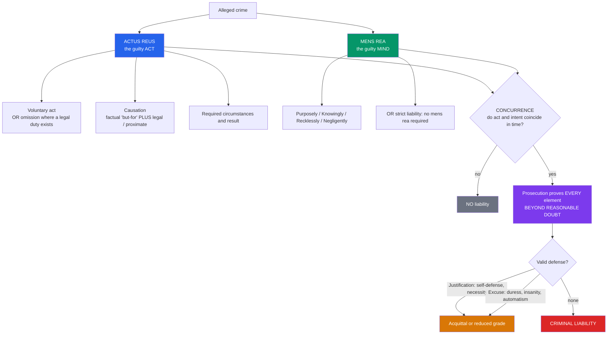

# ⚖️ Criminal Law Principles (Substantive Criminal Law)

> [!abstract] TL;DR
> **Substantive criminal law** defines *what conduct is a crime* and the *conditions of liability* for it — as opposed to criminal *procedure*, which governs how the state investigates and tries the accused. Its master rule is that a crime is normally built from **two elements that must both be present and must coincide**: the **actus reus** (the "guilty act" — a *voluntary* act, or a qualifying *omission* where a legal duty existed, together with the required **circumstances**, **result**, and **causation**) and the **mens rea** (the "guilty mind" — the required mental state, graded on the Model Penal Code ladder of **purposely → knowingly → recklessly → negligently**, with **strict-liability** offenses dispensing with mens rea altogether). Because mens rea grades the *same* physical act, one death runs from blameless **accident** through **manslaughter** to **murder** purely by the defendant's state of mind. Even where both elements are proven **beyond reasonable doubt**, liability can be defeated by a **defense** — a **justification** (self-defense, necessity: the act was *right*) or an **excuse** (duress, insanity, automatism: the actor was *not blameworthy*). Framing everything are the constitutional guarantees of the **presumption of innocence** and the **principle of legality** (*nullum crimen sine lege* — no crime, and no punishment, without a pre-existing law).

## Intuition

**Analogy:** Think of criminal liability as a **lock that needs two keys turned at the same time**.

The first key is the **deed** — someone actually did the forbidden thing (pulled the trigger, took the wallet). The second key is the **guilty mind** — they did it *on purpose*, or at least knowing or recklessly disregarding the risk, rather than by pure accident. Turn only the deed key (a sleepwalker who knocks a vase off a shelf) and the lock stays shut: an *act without a guilty mind* is a misfortune, not a crime. Turn only the mind key (you *fantasize* about robbing a bank but never move) and the lock also stays shut: the criminal law punishes **conduct, not thoughts** — *cogitationis poenam nemo patitur*, "no one suffers punishment for mere intention." Only when **both keys turn together, in the same moment**, does the lock open and liability attach. That double-key requirement — **actus reus + mens rea, coinciding** — is the spine of the whole subject, and everything else (grading, participation, inchoate crimes, defenses) is a variation on when the two keys count as turned.

---

## How It Works

Substantive criminal law asks a single structured question about any prosecution: **did the defendant commit the forbidden act, with the forbidden state of mind, at the same time, without a valid defense, proved beyond reasonable doubt?** Each clause is a distinct doctrine.

### 1. Actus reus — the external element

The "guilty act" is more than a bodily movement; it bundles several requirements:

- **A voluntary act.** The conduct must be the product of the actor's will. Movements during a **reflex, convulsion, seizure, or sleep** (states of **automatism**) are not "acts" at all — the *voluntariness* requirement, not any defense, does the work.
- **Omissions only where a duty exists.** The common law imposes **no general duty to rescue** — a stranger may watch a child drown. Liability for a *failure to act* arises only where a duty is created by **statute**, **contract** (a lifeguard), **special relationship** (parent–child), **voluntary assumption of care**, or **creation of the peril**.
- **Causation.** For **result crimes** (homicide, wounding) the act must cause the result on *two* tests: **factual causation** ("but-for" — the result would not have occurred but for the act) and **legal / proximate causation** (the result was not too remote; no *novus actus interveniens*, a free, deliberate, informed intervening act, broke the chain).
- **Attendant circumstances.** Many offenses require specified circumstances (the property "belongs to another"; the victim "did not consent").

### 2. Mens rea — the fault element and its hierarchy

The **Model Penal Code (MPC) §2.02** replaced the tangle of common-law fault terms with **four graded levels of culpability**, from most to least blameworthy:

1. **Purposely** — it is the actor's *conscious object* to cause the result (intent, *dolus directus*).
2. **Knowingly** — the actor is *practically certain* the result will follow, even if not desired (*dolus indirectus*).
3. **Recklessly** — the actor *consciously disregards* a **substantial and unjustifiable risk** (a **subjective** awareness of risk; the MPC default when a statute is silent).
4. **Negligently** — the actor *should have been aware* of a substantial and unjustifiable risk but was not (an **objective**, reasonable-person standard — the only rung not requiring actual awareness).

Below the ladder sit **strict-liability offenses**, which impose liability on the actus reus alone with **no mens rea** as to one or more elements (statutory rape, many regulatory "public-welfare" offenses). Above ordinary intent, some crimes require **specific intent** (an *ulterior* purpose beyond the act — burglary requires entry *with intent to commit a felony inside*) versus **general intent** (intent as to the act itself).

### 3. Concurrence, proof, and defeaters

- **Concurrence / coincidence.** The mens rea must **animate** the actus reus — the guilty mind and guilty act must exist *at the same time*. Forming intent to kill *after* an accidental blow, or the reverse, breaks concurrence (courts sometimes repair this with the "single transaction" or "continuing act" fictions).
- **Presumption of innocence + proof beyond reasonable doubt.** The prosecution bears the burden of proving *every element* to the criminal standard (*Woolmington v DPP*, 1935: the "golden thread"). This is the substantive-law face of the **rule of law** and due process (see [[Constitutional_Law_and_Structure]]).
- **Defenses.** Even with both elements proven, a **justification** (the act was permissible — self-defense, necessity) or an **excuse** (the actor is not blameworthy — duress, insanity, automatism) blocks liability.



---

## Key Concepts

### Secondary level

- **Crime = guilty act + guilty mind.** *Actus non facit reum nisi mens sit rea* — "an act does not make a person guilty unless the mind is also guilty." Both are normally needed; thoughts alone are never punished.
- **The mental-state ladder.** The *same* act is judged differently depending on the mind behind it: on purpose is worse than knowingly, which is worse than recklessly (aware of the risk), which is worse than negligently (should have been aware), which is worse than an honest accident.
- **Innocent until proven guilty.** The state, not the accused, must prove guilt, and to a high standard — **beyond reasonable doubt**, not merely "more likely than not."
- **Crime vs tort.** A **crime** is a public wrong prosecuted by the state and punished; a **tort** is a private wrong for which the victim sues for compensation. The *same act* (a punch) can be both a crime (assault) and a tort (battery), tried separately on different standards of proof.

### Undergraduate level

- **The five components of actus reus:** conduct, voluntariness, omission-where-a-duty-exists, causation, and attendant circumstances. Master **causation**: *factual* ("but-for") screens out irrelevant acts; *legal* ("proximate," no *novus actus interveniens*) screens out results too remote or broken off by a free intervening choice.
- **The MPC four:** purposely, knowingly, recklessly, negligently — and the crucial subjective/objective line: **recklessness requires actual awareness** of the risk; **negligence does not**. When a statute is silent, the MPC reads in **recklessness** as the default.
- **Specific vs general intent; transferred malice.** *Specific intent* crimes require an ulterior purpose; *general intent* crimes require intent only as to the act. Under **transferred intent** ("transferred malice"), intent to harm A that instead harms B still supplies mens rea for harming B.
- **Inchoate (incomplete) offenses.** Liability *before* harm occurs: **attempt** (an act beyond mere preparation, with intent to complete), **conspiracy** (an agreement between two or more to commit a crime), and **incitement / solicitation** (urging another to offend). These punish culpable steps toward harm.
- **Modes of participation.** The **principal** perpetrates the offense; an **accomplice / secondary party** who *aids, abets, counsels, or procures* is generally liable to the same extent (*accessorial* liability), provided they intended to assist and knew the essential facts. An **accessory after the fact** helps the offender escape justice.
- **Homicide as the graded paradigm.** One unlawful killing is graded by mens rea: **murder** (intent to kill or cause grievous harm; MPC purpose/knowledge, or extreme "depraved-heart" recklessness) down to **voluntary manslaughter** (an intentional killing mitigated by *provocation* / loss of control or *diminished responsibility*) and **involuntary manslaughter** (an unintended killing by gross negligence or an unlawful dangerous act).
- **Justification vs excuse.** A **justification** says the act was *not wrongful* (self-defense, necessity, lawful force) — society endorses it. An **excuse** concedes the act was wrongful but says *this actor is not to blame* (insanity, duress, infancy, involuntary intoxication).

### Graduate level

- **The M'Naghten Rules (1843) and the insanity spectrum.** Under *M'Naghten*, a defendant is legally insane if, from a "defect of reason, from disease of the mind," they did not know the **nature and quality** of the act, or did not know it was **wrong**. Reform tests broaden this: the **irresistible-impulse** test (volitional prong), the **MPC / ALI "substantial capacity"** test (lacking substantial capacity to *appreciate* criminality *or* to *conform* conduct to law), and the largely-abandoned *Durham* "product" test. Compare **automatism** (no voluntary act at all — a *denial of actus reus*, not an excuse) and **diminished responsibility** (partial excuse reducing murder to manslaughter).
- **Intoxication doctrine.** Voluntary intoxication is generally **no defense** to *general-intent* / *basic-intent* crimes (*Majewski*), but may negate the *specific intent* of a higher offense (dropping murder to manslaughter). Involuntary intoxication that negates mens rea is a full defense.
- **Mistake.** A **mistake of fact** negates mens rea if it is genuine (and, for some offenses, reasonable) — believing the umbrella you take is your own defeats the intent to steal. A **mistake of law** is generally *no* defense (*ignorantia juris non excusat*), with narrow exceptions (reliance on an official statement of law; offenses requiring knowledge of illegality).
- **The principle of legality — *nullum crimen, nulla poena sine lege*.** No conduct is criminal, and no punishment may be imposed, except under a **pre-existing, sufficiently clear** law. This yields four sub-principles: **non-retroactivity** (no *ex post facto* crimes — constitutionally entrenched, see [[Constitutional_Law_and_Structure]]), the **prohibition on vagueness** (void-for-vagueness), the **ban on crime-creation by analogy**, and **strict construction of penal statutes** (the *rule of lenity*; see [[Legal_Reasoning_and_Interpretation]]). Legality is a core demand of the rule of law and traces to the concept-of-law debates in [[Philosophy_of_Law_Jurisprudence]].
- **The harm principle and the limits of criminalization.** *What may the state criminalize at all?* J. S. Mill's **harm principle** — coercion is warranted "only to prevent harm to others" (see [[Liberty_and_Rights]]) — is the liberal ceiling, sharpened by **Feinberg** (adding a narrow "offense principle") and opposed by **legal moralism** (Devlin: law may enforce a society's shared morality). This is the **Hart–Devlin debate**, live in cases on drugs, sex work, assisted dying, and consensual harm.
- **The controversy over strict liability.** Dispensing with mens rea punishes the *faultless* and clashes with the retributive premise that liability tracks culpability. Courts tolerate it mainly for **regulatory / public-welfare** offenses (food safety, pollution, licensing; see [[Administrative_Law_and_Regulation]]) where the penalty is small and the regulatory benefit large, and presume a mens rea requirement for **"truly criminal"** offenses unless the legislature clearly excludes it (*Sweet v Parsley*; *Morissette v United States*).

---

## Python Demo

The single most distinctive feature of criminal law is that **the identical physical act — here, a death — is graded from blameless accident to first-degree murder purely by the mental state**. We model the **mens rea ladder** as an ascending staircase of culpability and show blameworthiness and typical punishment severity rising in lock-step with it. Uses only `numpy` and `matplotlib`.

```python
# The mens rea "ladder": how ONE physical act -- causing a death -- is graded
# from blameless accident to first-degree murder purely by the mental state.
import numpy as np
import matplotlib.pyplot as plt

# Rungs of the Model Penal Code culpability ladder, least -> most blameworthy.
# Rung 0 = strict liability: liability WITHOUT any proven mental state.
states = ["Strict\nliability", "Negligence", "Recklessness",
          "Knowledge", "Purpose /\nIntent"]
rung = np.arange(len(states))              # 0,1,2,3,4

# Ordinal blameworthiness the law attaches to each mental state (0-1 scaled).
blame = np.array([0.05, 0.30, 0.55, 0.80, 1.00])

# Illustrative maximum-sentence severity when the SAME act (a death) results,
# in schematic "years" -- not any real jurisdiction's code, just the ordering.
sentence = np.array([0, 6, 12, 30, 50])

# The homicide label the identical death receives at each rung.
grade = ["Accident\n(no crime)", "Negligent\nhomicide",
         "Involuntary\nmanslaughter", "Murder\n2nd deg.", "Murder\n1st deg."]

fig, (ax1, ax2) = plt.subplots(1, 2, figsize=(13, 5.5))

# ---- Left: the ladder of culpability as an ascending staircase ----
ax1.step(rung, blame, where="mid", color="#2563eb", lw=2.5)
ax1.fill_between(rung, blame, step="mid", alpha=0.15, color="#2563eb")
ax1.scatter(rung, blame, s=90, color="#2563eb", zorder=3)
for r, b, s in zip(rung, blame, states):
    ax1.annotate(s, (r, b), textcoords="offset points", xytext=(0, 12),
                 ha="center", fontsize=8, weight="bold")
ax1.axhline(0.0, color="gray", lw=0.8, ls=":")
ax1.text(0, 0.03, "  strict liability: no mens rea required",
         va="bottom", fontsize=8, color="darkred")
ax1.set_title("Ladder of culpability (Model Penal Code)")
ax1.set_xlabel("Rung of the ladder (least -> most blameworthy)")
ax1.set_ylabel("Blameworthiness the law assigns")
ax1.set_xticks(rung)
ax1.set_ylim(-0.05, 1.20)

# ---- Right: same death, graded by the guilty mind -> punishment ----
ax2.bar(rung, sentence, color="#059669", alpha=0.70, edgecolor="black")
ax2.step(rung, sentence, where="mid", color="#dc2626", lw=2, label="severity step")
for r, sv, g in zip(rung, sentence, grade):
    ax2.annotate(g, (r, sv), textcoords="offset points", xytext=(0, 6),
                 ha="center", fontsize=8)
ax2.set_title("One act, one death -- graded by the guilty mind")
ax2.set_xlabel("Mental state at the moment of the act")
ax2.set_ylabel("Typical maximum sentence (years, schematic)")
ax2.set_xticks(rung)
ax2.set_xticklabels(states, fontsize=8)
ax2.set_ylim(0, 60)
ax2.legend(loc="upper left", fontsize=8)

plt.tight_layout()
plt.savefig("mens_rea_ladder.png", dpi=120)
plt.show()

# Tabulate so the grading of the SAME death is explicit.
print("Rung  Mental state       Blame   Sentence  Homicide grade")
for r in rung:
    print(f"{r:>4}  {states[r].replace(chr(10), ' '):<16} "
          f"{blame[r]:>5.2f}   {sentence[r]:>6}   {grade[r].replace(chr(10), ' ')}")
print("\nMonotonic: as the mind grows more culpable, both blameworthiness and")
print("punishment rise -- one death runs from accident to murder without the")
print("physical act changing at all. That is what 'mens rea grades the act' means.")
```

The two panels make the doctrine visible: the left staircase is the **culpability ladder** itself (with strict liability sitting at the floor, punishing without any guilty mind), and the right chart shows the **same death** climbing from a non-criminal accident through negligent and reckless manslaughter to intentional murder. Blameworthiness and punishment move **monotonically together** — the visual signature of a system that punishes people *in proportion to fault*, which is exactly why strict liability (a flat penalty regardless of mind) is so contested.

---

## Real-World Applications

- **Charging and grading homicide.** Prosecutors decide between first-degree murder, second-degree murder, and voluntary or involuntary manslaughter almost entirely on **provable mens rea** — was the killing premeditated, intentional-but-provoked, reckless, or merely negligent? The *act* (a death) is identical; the *mind* sets the charge and the sentence.
- **Public-welfare / regulatory enforcement.** Food-safety, environmental, traffic, and licensing offenses are routinely **strict liability**: the regulator need not prove the defendant *knew* the milk was contaminated or the emission over-limit. This trades individual fault for administrable mass enforcement (see [[Administrative_Law_and_Regulation]]).
- **The insanity defense in high-profile trials.** *M'Naghten* itself arose from the 1843 killing of the Prime Minister's secretary; the *Hinckley* verdict (1982) triggered US reform narrowing the insanity test — a direct illustration of how the excuse doctrine is calibrated by public reaction.
- **Inchoate liability and counter-terrorism.** Conspiracy, attempt, and incitement let the state intervene **before** harm — foundational to prosecuting terrorism, fraud rings, and organized crime, where waiting for the completed offense is unacceptable.
- **Accomplice liability in group violence.** Getaway drivers, lookouts, and those who supply weapons are convicted as **secondary parties** on the same footing as the principal, provided the required intent to assist is shown — the doctrine that lets the law reach a whole criminal enterprise, not just the trigger-puller.
- **Decriminalization debates.** Reforms on drug possession, sex work, and assisted dying are argued in the vocabulary of the **harm principle** vs **legal moralism** — the substantive-law question of *what should be a crime at all* (see [[Liberty_and_Rights]]).

---

## Common Pitfalls

- **Collapsing "intent" into "motive."** Mens rea is the *state of mind as to the elements* (did you mean to cause the result?), **not** the *reason why* (greed, revenge, mercy). A mercy-killer intends the death and satisfies mens rea for murder; good motive goes to sentencing, not liability.
- **Ignoring concurrence.** Proving act and intent *separately* is not enough — they must **coincide in time**. Forming the intent to kill only *after* an accidental blow does not, without more, make the earlier act murder.
- **Confusing recklessness with negligence.** **Recklessness is subjective** (the actor *actually foresaw* the risk and pressed on); **negligence is objective** (a reasonable person *would* have foreseen it, but this actor did not). The line separates the reckless manslaughterer from the merely careless one.
- **Treating any defense as an "excuse."** A **justification** (self-defense) says the act was *right* and society endorses it; an **excuse** (insanity, duress) says the act was *wrong* but the actor is not blameworthy. The distinction affects third-party rights, complicity, and whether the act may be resisted.
- **Assuming a general duty to rescue.** In common-law systems there is usually **no liability for a pure omission** — a bystander may lawfully watch a stranger drown. Omission liability needs a *specific duty* (statute, contract, relationship, assumption of care, or creating the peril).
- **Forgetting that legality bars retroactive crime.** A court cannot punish conduct that was lawful when done, however blameworthy it now seems — *nullum crimen sine lege* and the ban on *ex post facto* laws forbid it (see [[Constitutional_Law_and_Structure]]).
- **Mistaking strict liability for "no defenses."** Strict-liability offenses drop the **mens rea** requirement, but the **actus reus must still be voluntary** and defenses like duress or automatism can still apply.

---

## Related Concepts

- [[Philosophy_of_Law_Jurisprudence]] — the principle of legality, the Hart–Devlin debate, and the harm principle sit inside the concept-of-law disputes; natural-law vs positivist views of what makes a penal statute valid.
- [[Rights_Duties_and_Legal_Concepts]] — the Hohfeldian structure of duties, liabilities, and powers that criminal prohibitions instantiate.
- [[Constitutional_Law_and_Structure]] — the presumption of innocence, due process, the beyond-reasonable-doubt standard, and the ban on *ex post facto* laws that constrain substantive criminal law.
- [[Legal_Reasoning_and_Interpretation]] — strict construction of penal statutes and the rule of lenity, the interpretive face of legality.
- [[Sources_of_Law]] — why crimes must rest on a legislated (or clearly recognized) legal source: *nullum crimen sine lege*.
- [[Common_Law_vs_Civil_Law]] — codified criminal codes vs common-law crimes and the differing role of judge-made offenses.
- [[Liberty_and_Rights]] — Mill's harm principle as the liberal ceiling on what may be criminalized.
- [[Deontology_and_Kantian_Ethics]] — retributivism and *desert*: the moral reason mens rea matters and why punishing the faultless (strict liability) is contested.
- [[Consequentialism_and_Utilitarianism]] — the utilitarian (deterrence, incapacitation) justification of punishment; Bentham and Mill on penal calculus.
- [[Applied_Ethics]] — criminalization and punishment debates (drugs, assisted dying, consent) treated as applied moral problems.
- [[Crime_Criminology_and_Criminal_Justice]] — the sociological study of who offends, why, and how the criminal-justice system responds to the crimes this note defines.
- [[Law_Deviance_and_Social_Control]] — crime as a socially constructed and enforced form of deviance, the social-institution view of the criminal law.

> [!note] Not yet in the vault
> This note deliberately does **not** wikilink `Criminal_Procedure`, `Evidence_and_Proof`, `Tort_Law`, `Theories_of_Punishment`, or `Rule_of_Law_and_Due_Process` because those notes do not yet exist. When created, each should link **back** to this note: procedure supplies *how* these substantive rules are proved, evidence supplies the beyond-reasonable-doubt machinery, tort marks the crime/civil-wrong line, punishment theory justifies the sentences, and rule-of-law grounds the principle of legality.

---

## Review Questions

1. **(Conceptual)** State the *actus non facit reum* maxim and explain why a sleepwalker who injures someone commits no crime. Locate the missing element precisely — is it a failed *defense*, or a failure of the *actus reus* itself? Why does the answer matter?
2. **(Scenario)** D fires a gun intending only to frighten V, who has a rare heart condition D knew nothing about; V dies of shock. Walk through actus reus (including causation), the mens rea rung D occupies, and the likely homicide grade. Now change one fact so the charge becomes (a) murder and (b) no crime at all — and say which element you changed.
3. **(Trade-off)** Strict-liability offenses punish without proof of a guilty mind. Give the strongest **utilitarian / regulatory** case for them and the strongest **retributive** case against, and explain why courts confine them mostly to "public-welfare" offenses rather than "truly criminal" ones. Where should the line fall, and why?

---

## Sources

- American Law Institute. *Model Penal Code* (1962, esp. §2.01 voluntary act, §2.02 general requirements of culpability). Official Draft.
- Ashworth, Andrew, and Jeremy Horder. *Principles of Criminal Law*. 9th ed. Oxford University Press, 2019.
- Dressler, Joshua. *Understanding Criminal Law*. 8th ed. Carolina Academic Press, 2018.
- Hart, H. L. A. *Punishment and Responsibility: Essays in the Philosophy of Law*. 2nd ed. Oxford University Press, 2008.
- Mill, John Stuart. *On Liberty*. 1859 (the harm principle and the limits of the criminal law).

---

#law #criminal-law #mens-rea #actus-reus #culpability
