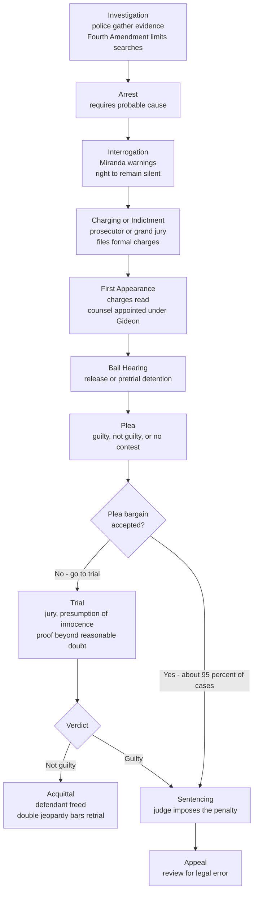

# ⚖️ Criminal Procedure

> [!abstract] TL;DR
> Criminal procedure is the body of rules that governs **how the state may investigate, accuse, try, convict, and punish** a person — the machinery running from the first knock on the door through investigation, arrest, charge, bail, plea, trial, verdict, sentencing, and appeal. Where **criminal law** defines *what* is a crime, criminal procedure defines *how the government is allowed to prove it*, and its entire point is to constrain the immense power of the state so that an individual is not crushed by it. In the **adversarial** common-law model the two sides fight and a neutral judge and jury decide; in the **inquisitorial** civil-law model the court itself investigates the truth. Around this frame sit the great procedural protections — the **presumption of innocence**, the **right to counsel** (*Gideon*), the **privilege against self-incrimination** (*Miranda*), the right to a **speedy public jury trial**, **confrontation** of witnesses, protection against **double jeopardy**, and the **Fourth Amendment** limits on search and seizure enforced by the **exclusionary rule**. Yet in practice the trial has nearly vanished: roughly **95 percent** of convictions come not from trials but from **guilty pleas**, making plea bargaining — and its "trial penalty" — the real system.

## Intuition

**Analogy — procedure is the rules of the game, and the referee protects the weaker player.**

Imagine a wrestling match between a heavyweight champion and an ordinary person. Without rules, the outcome is never in doubt: the champion simply overpowers the other. The *only* thing that makes the contest meaningful — even survivable — is a thick rulebook and a strict referee: no strikes to the throat, no continuing after the whistle, no changing the rules mid-match, and a neutral official whose job is not to help either wrestler win but to make sure the fight is **fair**.

The state, in a criminal case, is that champion. It has police, forensic labs, prosecutors, jails, and effectively unlimited resources; the accused is usually a single person, often poor, frightened, and locked up. **Criminal procedure is the rulebook, and the courts are the referee.** Its rules are written not to help the state catch criminals more efficiently — the state is already the stronger party — but to *handicap* the state: it must get a warrant, it must warn you of your rights, it must prove its case beyond reasonable doubt to twelve strangers, and if it breaks the rules the evidence it gathered may be thrown out. Every protection is a deliberate limit on the champion, because a system that lets the strong do whatever they want to the weak is not justice — it is just power wearing a robe. The presumption of innocence is the referee's starting whistle: the state begins the match already behind, and must earn the win.

---

## How It Works

### Substance versus procedure

Two different questions run through every criminal case. **Substantive criminal law** asks *"is this conduct a crime, and what are its elements?"* — murder requires a killing plus intent; theft requires taking property plus intent to deprive. **Criminal procedure** asks *"how is the state permitted to establish that, and what may the accused demand along the way?"* — how evidence may be gathered, when a lawyer must be provided, what a confession is worth, who decides guilt, and what happens if the police cheat. The same defendant can be plainly guilty under substantive law and still walk free because the *procedure* was violated, precisely because procedure protects a value larger than any one case: the discipline of state power.

### Adversarial versus inquisitorial

The world runs criminal cases on two great models, tracking the [[Common_Law_vs_Civil_Law]] divide. In the **adversarial** model (US, UK, common-law world) the truth is expected to emerge from a *contest*: prosecution and defense each build and attack evidence before a **passive, neutral judge** and often a **lay jury** who decide. In the **inquisitorial** model (France, Germany, most civil-law systems) an **investigating magistrate** and the court itself take an *active* role in gathering evidence and directing the search for truth, with a written dossier and a smaller role for combat and juries. Neither is inherently fairer — adversarial process can favor the better-resourced side, while inquisitorial process concentrates power in the judge — but the American procedural protections below are built for the adversarial contest.

### The rights that constrain the state

- **Presumption of innocence + proof beyond reasonable doubt.** The state bears the entire burden; the defendant need prove nothing. Conviction requires the highest standard of proof known to law.
- **Fourth Amendment — search and seizure.** Government searches of places where a person has a **reasonable expectation of privacy** generally require a **warrant** supported by **probable cause**. Its enforcement engine is the **exclusionary rule**: evidence obtained through an unconstitutional search is suppressed, and evidence derived from it is barred as **fruit of the poisonous tree** — a remedy designed not to reward the guilty but to *deter police misconduct* by removing its payoff.
- **Fifth Amendment — self-incrimination and double jeopardy.** No one may be compelled to be a witness against themselves; before custodial interrogation police must give **Miranda warnings**. And no one may be tried twice for the same offense by the same sovereign (**double jeopardy**).
- **Sixth Amendment — a fair trial.** The rights to **counsel** (and to a *free* lawyer if you cannot afford one, per *Gideon v. Wainwright*), to a **speedy and public** trial, to an **impartial jury**, and to **confront** and cross-examine the witnesses against you.
- **Prosecutorial discretion.** Even where a crime clearly occurred, the **prosecutor** decides whether to charge, what to charge, and what plea to offer — enormous, largely unreviewable power that shapes the whole process.

### Flow / Architecture



Read the diagram as a funnel with one dominant shortcut: most cases never reach the trial box at all. The heavy arrow from the plea-bargain decision straight to sentencing is where the real criminal justice system lives.

---

## Key Concepts

### Secondary Level

- **Criminal procedure.** The rules for *how* the government investigates and prosecutes a crime, as opposed to the rules defining *what* is a crime.
- **Presumption of innocence.** The accused is treated as innocent until the state proves guilt; the burden is entirely on the government.
- **Right to a lawyer.** Everyone accused of a serious crime has the right to a defense attorney, provided free if they cannot afford one (*Gideon v. Wainwright*, 1963).
- **The right to remain silent.** You cannot be forced to testify against yourself; police must read **Miranda warnings** before questioning someone in custody.
- **Trial by jury.** A group of ordinary citizens, not a government official, decides guilt in serious cases, and only by a **beyond-reasonable-doubt** standard.
- **The stages.** Investigation, arrest, charging, first appearance, bail, plea, trial, verdict, sentencing, appeal.

### Undergraduate Level

- **Adversarial vs. inquisitorial.** Party-driven contest before a neutral judge and jury (common law) versus a court-led investigation of the truth (civil law); see [[Common_Law_vs_Civil_Law]].
- **Fourth Amendment doctrine.** A search implicating a **reasonable expectation of privacy** (Katz v. United States) presumptively needs a **warrant** based on **probable cause**, subject to exceptions (consent, exigency, plain view, automobile, search incident to arrest).
- **The exclusionary rule and fruit of the poisonous tree.** Illegally obtained evidence is suppressed (*Mapp v. Ohio*, 1961), and derivative evidence is tainted — a **deterrence** remedy, not a reward, with major carve-outs such as the **good-faith** exception and **inevitable discovery**.
- **Miranda and confessions.** Custodial interrogation triggers the warnings; statements taken in violation are generally inadmissible, guarding against coerced and false confessions.
- **Grand jury vs. prosecutorial charging.** Serious federal charges require a **grand jury indictment**; many states allow charging by prosecutor's **information**. The grand jury is a screen, but a weak one — "indict a ham sandwich."
- **Double jeopardy.** Bars a second prosecution for the same offense by the same sovereign; does **not** bar separate federal and state prosecutions (dual sovereignty) or parallel civil suits.
- **Bail and pretrial detention.** After arrest, a judge decides whether to release the accused (on recognizance or **cash bail**) or detain them pending trial — a decision made *before* any finding of guilt.
- **Plea bargaining mechanics.** The prosecutor offers a reduced charge or sentence in exchange for a guilty plea, sparing the state a trial and giving the defendant certainty; the vast majority of convictions are resolved this way.

### Graduate Level

- **Prosecutorial discretion as the master variable.** The decision to charge, what to charge (which sets the sentencing exposure), and what to offer is largely unreviewable and unaccountable, making the prosecutor — not the judge or jury — the most powerful actor in the system. Charge-stacking creates leverage to induce pleas.
- **Bargaining "in the shadow of trial."** Plea negotiation is a decision under uncertainty: both sides estimate the probability of conviction and the likely trial sentence and settle in that shadow (modeled below and connected to [[Bargaining_Theory]] and [[Players_Strategies_and_Payoffs]]). The **trial penalty** — the sentencing gap between pleading and losing at trial — is the price of exercising a constitutional right, and critics argue it is coercive enough to induce even **innocent** defendants to plead. In *Lafler v. Cooper* (2012) the Court itself acknowledged that criminal justice "is for the most part a system of pleas, not a system of trials."
- **The cash-bail debate.** Money bail detains the poor and releases the rich regardless of dangerousness or flight risk; pretrial detention independently raises conviction and plea rates (a detained defendant is pressured to plead to get out). Reform movements (New Jersey, Illinois' SAFE-T Act) replace cash bail with **risk assessment**, raising its own fairness and algorithmic-bias questions.
- **Wrongful convictions and their causes.** DNA exonerations exposed recurring failure modes: **mistaken eyewitness identification**, **false confessions** (especially by juveniles and the vulnerable under interrogation pressure), **jailhouse informants**, **flawed or fraudulent forensic science**, **official misconduct** (including *Brady* violations — suppressing exculpatory evidence), and **inadequate defense** from underfunded public defenders. Procedure is the firewall against each.
- **Jury function and nullification.** Beyond fact-finding, the jury injects community judgment; **jury nullification** (acquitting despite the evidence) is an unreviewable power the jury holds but is not told it has, a check on unjust laws and a risk of biased ones.
- **Comparative and international procedure.** Fair-trial rights are globalized — the ICCPR (Article 14) and the European Convention (Article 6) guarantee counsel, presumption of innocence, and a fair public hearing across systems (see [[Human_Rights_and_International_Law]]).

---

## Python Demo

```python
# Plea bargaining as a DECISION UNDER UNCERTAINTY  (numpy + matplotlib only).
#
# A defendant compares a CERTAIN plea sentence against the UNCERTAIN outcome of trial.
# Model (risk-neutral core plus a mean-variance risk premium):
#     cost of TRIAL = p * S  +  0.5 * a * Var,     Var = p * (1 - p) * S**2
#     cost of PLEA  = discount * S                 (prosecutor's offer, certain)
# where  p = probability of conviction at trial,  S = trial sentence (years),
#        discount = plea offer as a fraction of the trial sentence,
#        a = risk aversion (long, uncertain sentences hurt disproportionately).
# The defendant rationally pleads guilty when the plea costs fewer EXPECTED years
# than going to trial.  Sweeping p and S maps the region where pleading is rational,
# and a population simulation shows why ~95% of cases plead out (the "trial penalty").

import numpy as np
import matplotlib.pyplot as plt

rng = np.random.default_rng(42)

DISCOUNT = 0.5    # plea offer = half the trial sentence -> going to trial DOUBLES exposure
A = 0.02          # mean-variance risk-aversion coefficient

def trial_cost(p, S, a=A):
    mean = p * S
    var = p * (1.0 - p) * S**2
    return mean + 0.5 * a * var

def plea_cost(S, d=DISCOUNT):
    return d * S

# ---------- Panel A: the rational-plea region over (p, S) ----------
p_grid = np.linspace(0.0, 1.0, 400)
S_grid = np.linspace(1.0, 25.0, 400)          # trial sentence severity, years
Pg, Sg = np.meshgrid(p_grid, S_grid)
plead_region = (plea_cost(Sg) < trial_cost(Pg, Sg)).astype(float)

# ---------- Panel B: cost curves at a representative severity ----------
S_star = 10.0
tc = trial_cost(p_grid, S_star)
pc = np.full_like(p_grid, plea_cost(S_star))
idx = int(np.argmin(np.abs(tc - pc)))         # crossover / indifference point
p_indiff = p_grid[idx]

# ---------- Population simulation: what share of defendants plead? ----------
N = 200_000
p_pop = rng.beta(6, 2, N)                      # conviction prob skewed high: weak cases get screened out
S_pop = rng.uniform(2, 20, N)                  # trial sentence severity, years
plead_pop = plea_cost(S_pop) < trial_cost(p_pop, S_pop)
plea_share = plead_pop.mean()

fig, (axA, axB) = plt.subplots(1, 2, figsize=(14, 6))

# Panel A: region map
axA.contourf(Pg, Sg, plead_region, levels=[-0.5, 0.5, 1.5],
             colors=["#c62828", "#1565c0"], alpha=0.35)
axA.contour(Pg, Sg, plead_region, levels=[0.5], colors="black", linewidths=1.5)
axA.set_xlabel("Probability of conviction at trial  p")
axA.set_ylabel("Trial sentence if convicted  S (years)")
axA.set_title("Where a defendant rationally pleads guilty")
axA.text(0.75, 20, "PLEAD\nGUILTY", ha="center", va="center",
         fontsize=13, fontweight="bold", color="#0d47a1")
axA.text(0.17, 6, "GO TO\nTRIAL", ha="center", va="center",
         fontsize=13, fontweight="bold", color="#8e0000")

# Panel B: cost comparison + trial penalty
axB.plot(p_grid, tc, color="#c62828", lw=2, label="Expected cost of TRIAL")
axB.plot(p_grid, pc, color="#1565c0", lw=2, ls="--", label="Cost of PLEA offer (certain)")
axB.fill_between(p_grid, pc, tc, where=(tc > pc), color="#1565c0", alpha=0.15)
axB.axvline(p_indiff, color="gray", ls=":", lw=1.5)
axB.annotate(f"indifference\np = {p_indiff:.2f}",
             xy=(p_indiff, plea_cost(S_star)),
             xytext=(p_indiff - 0.33, plea_cost(S_star) + 4.5),
             arrowprops=dict(arrowstyle="->"))
axB.annotate("trial penalty:\nextra years for using\nthe right to a trial",
             xy=(0.97, S_star), xytext=(0.42, S_star - 3.5),
             fontsize=9, ha="center",
             arrowprops=dict(arrowstyle="->"))
axB.set_xlabel("Probability of conviction at trial  p")
axB.set_ylabel("Expected sentence (years)")
axB.set_title(f"Cost comparison at S = {S_star:.0f} years")
axB.legend(loc="upper left", fontsize=9)

fig.suptitle(f"Plea bargaining under uncertainty  |  simulated plea rate = {plea_share*100:.1f} percent",
             fontsize=13, fontweight="bold")
fig.tight_layout()
plt.savefig("plea_bargaining.png", dpi=120, bbox_inches="tight")
plt.show()

print(f"Plea discount: plea offer = {DISCOUNT:.2f} x trial sentence")
print(f"Indifference conviction probability at S={S_star:.0f}y: p* = {p_indiff:.2f}")
print(f"Simulated share of defendants who rationally plead guilty: {plea_share*100:.1f} percent")
```

**Expected output (approximate):**

```
Plea discount: plea offer = 0.50 x trial sentence
Indifference conviction probability at S=10y: p* = 0.47
Simulated share of defendants who rationally plead guilty: 96.4 percent
```

The map shows the plea region swelling to fill almost the entire space: as soon as the conviction probability clears roughly one-half — and because prosecutors *screen out* their weak cases, the surviving cases cluster at **high** conviction probabilities — pleading dominates. The simulated plea rate lands in the mid-90s percent, closely tracking the real-world figure that about **95 percent** of criminal convictions come from guilty pleas rather than trials. The right panel makes the **trial penalty** visible as the widening blue gap between the flat plea offer and the rising trial cost: the more likely conviction is, the more the state can charge for the "luxury" of exercising a constitutional right — the exact pressure critics argue can push even innocent defendants to plead.

---

## Real-World Applications

**Everyday policing and Miranda.** The warnings you have heard in every police drama — "you have the right to remain silent" — are a direct procedural rule from *Miranda v. Arizona*. They apply specifically to **custodial interrogation**, and statements taken without them are generally inadmissible, shaping how officers question suspects millions of times a year.

**Public-defender systems and the *Gideon* gap.** *Gideon v. Wainwright* guaranteed counsel to the indigent, but funding never matched the promise: overloaded public defenders may carry hundreds of cases at once, meaning many defendants meet their lawyer minutes before pleading. This underfunding is a leading structural cause of both coerced pleas and wrongful convictions.

**Cash-bail reform.** Because pretrial detention pressures defendants to plead (plead now, go home today, versus sit in jail for months awaiting trial), jurisdictions including **New Jersey** and **Illinois** (SAFE-T Act) have largely abolished money bail in favor of **risk-based** release decisions — a live, contested experiment in reshaping the front end of criminal procedure.

**The Innocence Project and DNA exonerations.** Post-conviction DNA testing has exonerated hundreds of people, empirically revealing the recurring procedural failure modes — misidentification, false confessions, junk forensics, *Brady* violations — and driving reforms such as recorded interrogations and double-blind eyewitness lineups.

**Digital search and the Fourth Amendment.** *Carpenter v. United States* (2018) held that police generally need a **warrant** to obtain historical cell-site location data, extending the "reasonable expectation of privacy" into the smartphone era and showing how criminal procedure continually re-negotiates the state-versus-individual line as technology changes.

---

## Common Pitfalls

- **Confusing procedure with substance.** Criminal *procedure* governs *how* the state proves a crime; criminal *law* defines *what* the crime is. A guilty person can go free on a procedural violation not because the system failed but because the rule protecting everyone was enforced.
- **Thinking Miranda applies to every police encounter.** The warnings are required only before **custodial interrogation**. Voluntary statements, roadside questions, and pre-arrest conversations are generally not covered, and failing to Mirandize does not by itself dismiss a case — it only suppresses the tainted statement.
- **Believing the exclusionary rule "frees criminals on technicalities."** Its purpose is **deterring police misconduct** by removing its payoff, not rewarding defendants, and it is riddled with exceptions (good-faith, inevitable discovery, independent source). It applies only when the government itself broke a constitutional rule.
- **Misreading the presumption of innocence as a claim of factual innocence.** It is a **burden-allocation rule**: the state must prove guilt beyond reasonable doubt, and the accused need not prove anything. It says nothing about whether the person actually did it.
- **Assuming plea bargaining protects the innocent.** Because the **trial penalty** makes losing at trial far worse than pleading, a rational innocent defendant facing a strong-looking case and years of extra exposure may still plead guilty — the coercion is structural, not a matter of individual weakness.
- **Overstating double jeopardy.** It bars a *second criminal prosecution for the same offense by the same sovereign*. It does **not** bar separate state and federal prosecutions (dual sovereignty), civil suits over the same conduct, or retrial after a mistrial or a successful defense appeal.
- **Treating the trial as the norm.** The jury trial is culturally central but statistically rare. Analyzing criminal justice through the trial while ignoring the plea machinery describes a system that barely exists.

---

## Related Concepts

- [[Rule_of_Law_and_Due_Process]] — due process is the constitutional engine of every procedural protection here; criminal procedure is due process operationalized against the state's coercive power.
- [[Common_Law_vs_Civil_Law]] — the adversarial-versus-inquisitorial split that defines how criminal cases are structured in different legal families.
- [[Constitutional_Law_and_Structure]] — the Bill of Rights (Fourth, Fifth, Sixth Amendments) is the source of the search, self-incrimination, counsel, and jury protections.
- [[Rights_Duties_and_Legal_Concepts]] — the rights of the accused analyzed as legal claims, powers, and immunities held against the government.
- [[Judicial_Review_and_the_Courts]] — appellate courts enforce procedural rights and craft the doctrines (exclusionary rule, Miranda) that discipline police and prosecutors.
- [[Comparative_Constitutionalism]] — how other constitutional orders design and guarantee criminal-procedure rights differently.
- [[Human_Rights_and_International_Law]] — fair-trial guarantees globalized through the ICCPR (Article 14) and the ECHR (Article 6).
- [[Bargaining_Theory]] — plea bargaining is a bargaining game "in the shadow of trial" between prosecutor and defense.
- [[Players_Strategies_and_Payoffs]] — the expected-utility, decision-under-uncertainty framework behind the plea-versus-trial model in the demo.
- [[Dominance_and_Rationality]] — the rational-choice reasoning by which a defendant weighs a certain plea against an uncertain trial.

---

## Review Questions

### Secondary
1. In your own words, explain the difference between criminal *law* and criminal *procedure*, and why a factually guilty person might still go free because of procedure.
2. What does the "presumption of innocence" require the government to do, and who has the burden of proof in a criminal trial?

### Undergraduate
1. A police officer searches a suspect's phone without a warrant and finds incriminating messages, then uses those messages to locate a weapon. Explain how the **exclusionary rule** and the **fruit of the poisonous tree** doctrine would treat both the messages and the weapon, and name one exception that might save the evidence.
2. Compare the **adversarial** and **inquisitorial** models of criminal procedure. Who gathers the evidence and who decides guilt in each, and why is neither automatically "fairer"?
3. Explain why pretrial detention under a **cash-bail** system can pressure a defendant to plead guilty even when they have a viable defense, and how risk-based bail reform tries to address this.

### Graduate
1. Model the plea decision as a choice under uncertainty. Given a plea offer that is a fraction *d* of the trial sentence *S* and a conviction probability *p*, derive the condition under which a risk-neutral defendant pleads guilty, and use it to explain why prosecutorial case-screening drives plea rates toward 95 percent. What does the "trial penalty" do to an *innocent* defendant's calculus?
2. Prosecutorial discretion — the power to choose whether and what to charge and what to offer — is largely unreviewable. Argue whether this concentration of power is compatible with the rule of law, and propose one procedural check that would constrain it without paralyzing prosecution.
3. DNA exonerations revealed systematic causes of wrongful conviction (eyewitness error, false confessions, junk forensics, *Brady* violations, inadequate defense). For any two of these, identify the specific procedural protection meant to prevent it and explain why that protection failed in practice.

---

## Sources

- [Gideon v. Wainwright, 372 U.S. 335 (1963) — the right to appointed counsel](https://en.wikipedia.org/wiki/Gideon_v._Wainwright)
- [Miranda v. Arizona, 384 U.S. 436 (1966) — warnings before custodial interrogation](https://en.wikipedia.org/wiki/Miranda_v._Arizona)
- [Mapp v. Ohio, 367 U.S. 643 (1961) — the exclusionary rule applied to the states](https://en.wikipedia.org/wiki/Mapp_v._Ohio)
- Bibas, S. (2012). *The Machinery of Criminal Justice*. Oxford University Press. (Plea bargaining, the disappearance of the trial, and the "trial penalty.")
- [Innocence Project — Causes of Wrongful Conviction](https://innocenceproject.org/) and the [National Registry of Exonerations](https://www.law.umich.edu/special/exoneration/Pages/about.aspx)

---

#law #criminal-procedure #due-process #plea-bargaining #rights-of-the-accused
