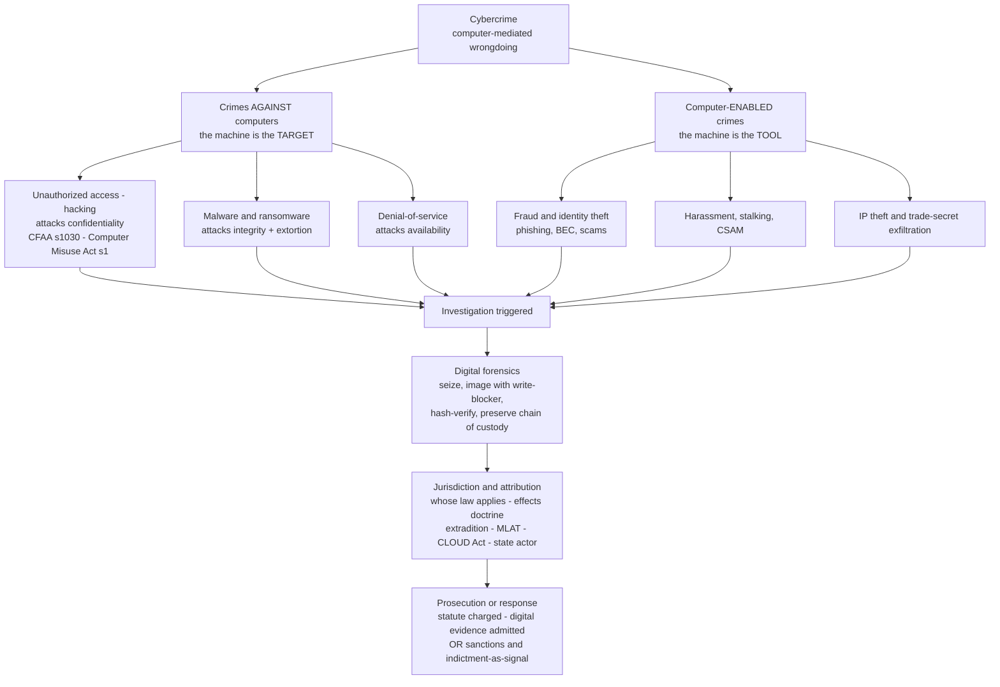

# 🖥️ Cybercrime and Digital Law

> [!abstract] TL;DR
> **Cybercrime** is the law's response to wrongdoing done *through* or *to* computers. Its central taxonomy splits into **crimes against computer systems** (unauthorized access/"hacking", malware, ransomware, denial-of-service — the machine is the *target*) and **computer-enabled crimes** (fraud, identity theft, harassment, child-exploitation, IP theft — the machine is the *tool*, and the crime is an old one committed at scale and distance). Its foundational statutes — the US **Computer Fraud and Abuse Act (CFAA, 18 U.S.C. § 1030)**, the **UK Computer Misuse Act 1990**, and the international **Budapest Convention on Cybercrime (2001)** — all pivot on the slippery concept of **"unauthorized access"**, which the Supreme Court finally narrowed in *Van Buren v. United States* (2021). The hard problems are structural: **jurisdiction and attribution** (crime is borderless but law is territorial), **digital evidence** (chain of custody, the Fourth Amendment after *Carpenter*, encryption and "going dark"), **cross-border data access** (the CLOUD Act), and the **economics of defence** — how much a rational victim should spend on security, and how a rational offender responds to the (very low) probability of being caught.

---

## Intuition

**Analogy:** A con artist who once had to sit across a table to swindle you can now run the same con on ten million strangers at once, from another continent, while asleep. A burglar who once had to physically break your window can now try a billion doors a second and never leave a fingerprint anywhere you can reach. **Cybercrime is not, for the most part, a new *kind* of wrong — it is old wrongs (fraud, theft, extortion, trespass, stalking) put through an amplifier and a teleporter.** The computer collapses two things that used to constrain crime: *scale* (one offender, millions of victims) and *distance* (the offender, the victim, the loot, and the evidence can each sit in a different legal system).

That amplifier-and-teleporter framing explains almost everything hard about the field. The *scale* is why a trivial per-victim harm becomes a billion-dollar problem and why deterrence economics matters. The *distance* is why "whose law applies?" and "who actually did this?" — jurisdiction and attribution — are the questions that make cybercrime genuinely different from a mugging, not just a mugging with a keyboard. And the fact that the "crime scene" is *data* — copyable, mutable, encrypted, and physically located on someone else's server in another country — is why a whole sub-discipline (digital forensics) and a whole constitutional fight (the Fourth Amendment in the digital age) had to be built almost from scratch.

---

## How It Works

### The taxonomy: two families of cybercrime

The single most useful distinction in the field is *what role the computer plays*:

1. **Crimes against computer systems — the computer is the TARGET.** These are genuinely *new* offences that could not exist before networked machines. They attack the classic security triad of **confidentiality, integrity, availability**:
   - **Unauthorized access / "hacking"** — breaching a system you have no right to enter (attacks *confidentiality*). This is the core CFAA and Computer Misuse Act offence.
   - **Malware** — viruses, worms, trojans, and spyware that corrupt or subvert systems (attacks *integrity*). See [[Malware_Analysis]].
   - **Ransomware** — malware that *encrypts* a victim's data and extorts payment for the key: unauthorized access + integrity attack + extortion fused into one.
   - **Denial-of-service (DoS/DDoS)** — flooding a system to make it unusable (attacks *availability*).
2. **Computer-enabled / "traditional" crimes — the computer is the TOOL.** These are old crimes wearing new clothes; the wrong is pre-digital, but the medium multiplies its reach:
   - **Fraud** — phishing, business-email-compromise, investment and romance scams. This is, by volume and dollar loss, *the overwhelming majority* of cybercrime.
   - **Identity theft** — stealing and misusing personal credentials.
   - **Online harassment, stalking, and non-consensual imagery.**
   - **Child sexual abuse material (CSAM)** — production, distribution, and possession, a heavily prioritised enforcement area.
   - **Intellectual-property theft** — piracy and trade-secret exfiltration, often state-sponsored.

The legal significance of the split: crimes *against* computers needed **new statutes** (there was no pre-1980s law against "logging into a mainframe you weren't allowed to"), whereas computer-*enabled* crimes are usually prosecuted under **existing** fraud, theft, extortion, and harassment law — the internet is treated as an aggravating instrumentality, not a new offence.

### The foundational statutes

- **US — Computer Fraud and Abuse Act (CFAA, 18 U.S.C. § 1030, enacted 1986).** The central US anti-hacking statute. It criminalises accessing a "**protected computer**" (defined so broadly — any computer touching interstate/foreign commerce — that it now means essentially *any internet-connected device*) either **"without authorization"** or in a way that **"exceeds authorized access."** That second phrase became the statute's central controversy: prosecutors read it expansively to mean *any* violation of a website's **terms of service** or an employer's computer-use policy could be a *federal crime*. Critics called this catastrophic overbreadth — it arguably turned lying about your age on a dating site, or using a work laptop for personal email, into a felony. The prosecution of activist **Aaron Swartz** under the CFAA (facing decades of exposure for bulk-downloading academic articles) before his 2013 suicide became the emblem of that critique.
- **The *Van Buren* narrowing (2021).** In *Van Buren v. United States*, a police officer with legitimate database access ran a licence-plate lookup for a bribe — an *improper purpose* using *authorized* credentials. The Supreme Court held (6–3) that this was **not** "exceeding authorized access." It adopted a **"gates-up-or-down" reading**: you exceed authorized access only when you enter areas of a system that are *off-limits to you* — not when you access data you *are* entitled to reach but for a forbidden *reason*. This rejected the TOS-violation-as-crime theory and dramatically narrowed the CFAA, aligning it with the earlier civil ruling in *hiQ v. LinkedIn* (scraping *public* data is not unauthorized access).
- **UK — Computer Misuse Act 1990.** A cleaner three-tier structure: **s.1** unauthorized access to computer material; **s.2** unauthorized access *with intent* to commit a further offence; **s.3** unauthorized acts *impairing* the operation of a computer (covering malware and DoS); with **s.3ZA** later added for acts causing *serious damage* to critical infrastructure.
- **International — the Budapest Convention on Cybercrime (Council of Europe, 2001).** The first and still leading multilateral treaty. It does three things: (1) **harmonises substantive offences** (illegal access, interception, data/system interference, computer-related fraud and forgery, CSAM, IP offences) so signatories criminalise the same acts; (2) **harmonises procedural powers** (expedited preservation of data, production orders, search and seizure of stored data); and (3) sets up **fast international cooperation** and a 24/7 contact network. Its **Second Additional Protocol (2022)** tackles cross-border access to electronic evidence directly. A rival, more state-control-oriented UN Cybercrime Convention has since been negotiated, reflecting a geopolitical split over surveillance and human-rights safeguards.

### Jurisdiction and attribution — the borderless-crime problem

Law is **territorial**; cybercrime is **not**. When an offender in country A uses a server in country B to defraud a victim in country C, *every* traditional basis of jurisdiction can be invoked at once: **territoriality** (where the act or its *effect* occurred — the "effects doctrine"), **nationality** (the offender's citizenship), and the **protective principle** (harm to a state's own interests). The result is *concurrent* jurisdiction, races to prosecute, and reliance on **extradition** treaties — which frequently fail, because many states will not extradite their own nationals, and adversary states shelter offenders deliberately.

**Attribution** is the deeper problem: knowing *which machine* did something (an IP address) is not the same as knowing *which human* did it. IP addresses are spoofable and routed through compromised proxies, botnets, VPNs, and Tor. **State-sponsored attacks** (advanced persistent threats) are engineered for *deniability*, so attribution becomes a diplomatic and intelligence judgment rather than a courtroom-grade proof — which is why response often shifts from *prosecution* to *sanctions* and *indictment-as-signalling* against defendants who will never appear.

### Digital evidence, forensics, and the Fourth Amendment

Because the "crime scene" is data, it must be captured without altering it. The forensic discipline (see [[DFIR_Methodology]]) rests on:
- **Chain of custody** — a documented, unbroken record of who handled the evidence, when, and how, so a court can trust that the exhibit is what it claims to be and was not tampered with.
- **Forensic imaging and hashing** — a bit-for-bit copy made with a **write-blocker**, verified by a **cryptographic hash** (e.g., SHA-256); if the hash of the copy matches the original and re-matches at trial, the data is shown to be unaltered.

Constitutionally, the digital age forced the **Fourth Amendment** (protection against unreasonable searches) to evolve:
- ***Riley v. California* (2014)** — police *cannot* search the *contents* of an arrestee's phone without a **warrant**, even incident to a lawful arrest; a phone is not a cigarette pack, it is a window into an entire life.
- ***Carpenter v. United States* (2018)** — accessing a person's historical **cell-site location information** is a Fourth Amendment *search* requiring a **warrant**, carving a major exception into the old **third-party doctrine** (the idea that data you share with a company loses its privacy protection).
- **Encryption and "going dark"** — strong device and message encryption means lawful warrants can return *unreadable* data. Law enforcement calls this "going dark" and lobbies for exceptional access; technologists and privacy advocates argue that any deliberate backdoor weakens security for everyone. **Compelled decryption** collides with the **Fifth Amendment** privilege against self-incrimination (is forcing you to reveal a passcode "testimonial"? courts split, often via the "foregone conclusion" doctrine).

### Cybersecurity law and cross-border access

- **Breach-notification law** — statutes now *require* organisations to disclose data breaches: US state laws (California led the way), the EU **GDPR**'s 72-hour notification duty, and SEC disclosure rules for public companies. These convert security from a purely private cost into a legally mandated one.
- **The CLOUD Act (2018)** — passed after *Microsoft v. United States* (the "Microsoft Ireland" case) asked whether a US warrant reaches email stored *abroad*. The Act clarifies that US providers must produce data *in their control regardless of where it is stored*, and creates **executive agreements** letting trusted foreign governments request data directly from US firms — a faster alternative to the notoriously slow **Mutual Legal Assistance Treaty (MLAT)** process.

### The economics of cybercrime and defence

Two economic lenses run through the whole field. **On the defender's side**, security investment shows **diminishing returns**: the *marginal* breach it prevents shrinks as you spend more, so a rational victim spends only up to the point where the *last dollar of defence* equals the *expected loss it removes* (the **Gordon-Loeb model**; see [[Risk_Management_and_GRC]]). **On the offender's side**, the **Becker model** of crime says a rational offender attacks whenever expected gain exceeds expected cost, where expected cost is the *penalty* multiplied by the *probability of being caught and punished*. Cybercrime's defining feature is that this probability is **tiny** — attribution is hard, extradition often fails — which is precisely why cybercrime "pays" even when nominal penalties are severe. The Python demo below makes both lenses quantitative.

### Flow / Architecture — taxonomy and the investigation-to-prosecution pipeline



---

## Key Concepts

**Secondary / High-school level.** Cybercrime is crime done with computers. There are two big kinds. First, crimes *against* computers — someone breaks *into* a system that isn't theirs (**hacking**), plants software that wrecks or locks it (**malware** and **ransomware**), or floods it so nobody else can use it (a **denial-of-service** attack). Second, ordinary crimes done *using* computers — cheating people out of money (**fraud**), stealing someone's identity, bullying and harassment, or piracy. The important twist is *scale and distance*: one criminal can hit millions of people from another country, which makes these criminals very hard to catch. Special laws (in the US, the **Computer Fraud and Abuse Act**) make hacking a crime, and special detectives (**digital forensics**) collect the evidence carefully so it can be used in court.

**Undergraduate level.** Master the **target-vs-tool taxonomy** and know which statute governs which. For crimes *against* systems, learn the **CFAA (§ 1030)** and the **UK Computer Misuse Act 1990** (ss.1–3), both hinging on **"unauthorized access"** — and understand *why that phrase is hard*: does violating a website's *terms of service* or an employer's *policy* count? ***Van Buren v. United States* (2021)** says no — it adopted a **"gates-up-or-down"** rule (you exceed access only by entering areas you have *no right* to reach, not by accessing permitted data for a *bad reason*), narrowing decades of expansive prosecution. Internationally, know the **Budapest Convention (2001)** as the leading treaty harmonising offences, procedures, and cooperation. Understand the two structural difficulties: **jurisdiction** (territoriality vs the effects doctrine vs nationality; extradition; state-sponsored deniability) and **attribution** (an IP address is not a person). On evidence, learn **chain of custody**, **forensic imaging + hashing**, and the digital Fourth Amendment trilogy — ***Riley*** (warrant to search a phone), ***Carpenter*** (warrant for cell-site data, limiting the third-party doctrine), and the **encryption / "going dark"** debate. Finish with **breach-notification** duties (GDPR, state laws) and the **CLOUD Act** for cross-border data.

**Graduate / professional level.** Interrogate the field's fault lines. **(1) The void-for-vagueness and overbreadth critique of the CFAA:** a criminal statute whose reach turns on privately drafted terms of service delegates the definition of a *federal crime* to website operators, offending the **rule of law** and **due-process** notice requirement ([[Rule_of_Law_and_Due_Process]]); *Van Buren* resolves this by statutory construction but leaves "without authorization" itself under-theorised (what about shared passwords, or authorization *revoked mid-session*?). **(2) The jurisdiction-attribution-enforcement gap as the field's true bottleneck:** substantive law is easy to write and nearly impossible to *enforce* across borders; the interesting questions are institutional — MLAT latency, the CLOUD Act's executive-agreement workaround, and whether *unilateral* extraterritorial data reach erodes other states' sovereignty and data-protection regimes. **(3) The Fourth Amendment's mosaic problem:** *Carpenter* signals that aggregating individually innocuous data points (location pings, metadata) can constitute a *qualitatively* greater search — but the doctrine has no clean stopping rule, and encryption pushes the whole contest from *search law* into *compulsion law* and the Fifth Amendment. **(4) The economics of a low-probability-of-punishment world:** because attribution is weak, **Becker-style** deterrence via *penalty severity* has sharply diminishing returns (you cannot deter an offender you cannot catch), which reframes policy toward *raising the probability of attribution* (blockchain forensics, international cooperation) and *hardening targets* (a **Gordon-Loeb**-optimal, never-100% level of defence) rather than merely lengthening sentences. **(5) Emerging frontiers:** **cryptocurrency** enables pseudonymous ransom payment yet leaves an *immutable public ledger* that chain-analysis can trace ([[Crypto_Wallets]], [[UTXO_Model]]), so anonymity migrates to **mixers/tumblers and cross-chain bridges** ([[Cross_Chain_Bridges]]) and to sanctions fights like *Tornado Cash*; the **dark web** (Silk Road) recreates illicit markets under Tor; and **AI-enabled crime** — deepfake voice/video fraud, automated spear-phishing, prompt-injection ([[Prompt_Injection_Attacks]]) — collapses the cost of high-fidelity deception.

---

## Python Demo

```python
# Two economic lenses on cybercrime, plotted side by side.
#
# LEFT  (defender / Gordon-Loeb): security investment has DIMINISHING RETURNS.
#       A rational victim spends up to where the marginal cost of defence (=$1)
#       equals the marginal reduction in EXPECTED LOSS it buys. Total cost is
#       U-shaped; we find the optimal spend s*.
#
# RIGHT (offender / Becker): a rational attacker attacks while expected payoff
#       exceeds the return to legitimate work. We show how raising the
#       probability of attribution/prosecution pi drives that payoff to zero --
#       and why cybercrime's TINY pi is exactly what makes it pay.
import numpy as np
import matplotlib.pyplot as plt

# =========================================================================
# LEFT PANEL -- defender's optimal security investment (Gordon-Loeb style)
# =========================================================================
v     = 0.60          # baseline breach probability with ZERO security spend
L     = 1_000_000.0   # loss if a breach occurs (dollars)
theta = 120_000.0     # spend (dollars) needed to cut breach prob by a factor e

s = np.linspace(0, 900_000, 800)              # security spend (dollars)
breach_prob   = v * np.exp(-s / theta)        # p(s): falls with diminishing returns
expected_loss = breach_prob * L               # p(s) * L: residual expected loss
total_cost    = s + expected_loss             # T(s): spend + expected loss (U-shaped)

# Analytic optimum: dT/ds = 1 - (v*L/theta)*exp(-s/theta) = 0
#   -> exp(-s*/theta) = theta/(v*L)  ->  s* = theta * ln(v*L/theta)
s_star   = theta * np.log(v * L / theta)
T_star   = s_star + v * L * np.exp(-s_star / theta)
loss_res = v * L * np.exp(-s_star / theta)    # residual expected loss at s* (= theta)

# Marginal check at s*: marginal defence cost (=$1) == marginal loss reduction.
marg_loss_reduction = (v * L / theta) * np.exp(-s_star / theta)   # equals 1.0 at s*

print("DEFENDER -- OPTIMAL SECURITY INVESTMENT")
print("=" * 55)
print(f"Optimal security spend s*         : ${s_star:,.0f}")
print(f"Residual expected loss at s*      : ${loss_res:,.0f}")
print(f"Minimised total cost T*           : ${T_star:,.0f}")
print(f"Marginal loss reduction at s*     : ${marg_loss_reduction:,.2f} per $1 spent")
print("-> at s* the last dollar of defence removes exactly $1 of expected loss.")
print(f"-> optimal spend is {s_star/(v*L):.0%} of the ${v*L:,.0f} expected loss")
print("   (Gordon-Loeb: optimum never exceeds ~37% = 1/e of expected loss).")

# =========================================================================
# RIGHT PANEL -- Becker deterrence: attacker payoff vs probability of capture
# =========================================================================
G = 500_000.0     # gain to the attacker if the crime succeeds
C = 800_000.0     # cost to the attacker if caught (sanction + forfeiture)
w = 60_000.0      # return to legitimate alternative work (opportunity cost)

pi = np.linspace(0, 1, 400)                   # probability of attribution+prosecution
attacker_payoff = (1 - pi) * G - pi * C       # expected payoff of committing the crime

# Deterrence threshold: attack only while payoff > w  ->  solve payoff = w
#   (1-pi)G - pi*C = w  ->  pi* = (G - w) / (G + C)
pi_star = (G - w) / (G + C)

print("\nOFFENDER -- BECKER DETERRENCE")
print("=" * 55)
print(f"Deterrence threshold pi*          : {pi_star:.3f}")
print(f"-> crime is deterred once P(caught) exceeds {pi_star:.0%}.")
print("   Real-world cybercrime pi is often < 1% -> attacks remain profitable,")
print("   which is why RAISING ATTRIBUTION beats merely raising penalties.")

# =========================================================================
# PLOT
# =========================================================================
fig, (axL, axR) = plt.subplots(1, 2, figsize=(14, 6))

# ---- Left: defender ----
axL.plot(s, s,             label="Cost of defence  s",            lw=2)
axL.plot(s, expected_loss, label="Expected loss  p(s)*L",         lw=2)
axL.plot(s, total_cost,    label="Total cost  s + p(s)*L", lw=2.6, color="black")
axL.axvline(s_star, color="red", ls="--", lw=1.5)
axL.plot([s_star], [T_star], "ro", ms=9)
axL.annotate(f"Optimal spend s* = ${s_star:,.0f}\nmin total cost = ${T_star:,.0f}",
             xy=(s_star, T_star), xytext=(s_star + 90_000, T_star + 160_000),
             arrowprops=dict(arrowstyle="->", color="red"), fontsize=9)
axL.axvspan(0, s_star, alpha=0.06, color="red")
axL.set_xlabel("Security investment  s  (dollars)")
axL.set_ylabel("Cost (dollars)")
axL.set_title("Defender: diminishing-returns security spend")
axL.legend(loc="upper center")
axL.grid(True, alpha=0.3)

# ---- Right: offender ----
axR.plot(pi, attacker_payoff, lw=2.6, color="darkgreen",
         label="Attacker expected payoff")
axR.axhline(w, color="gray", ls=":", lw=1.5, label=f"Legit work return w = ${w:,.0f}")
axR.axhline(0, color="black", lw=0.8)
axR.axvline(pi_star, color="red", ls="--", lw=1.5)
axR.plot([pi_star], [w], "ro", ms=9)
axR.annotate(f"Deterrence threshold\npi* = {pi_star:.2f}",
             xy=(pi_star, w), xytext=(pi_star + 0.12, w + 180_000),
             arrowprops=dict(arrowstyle="->", color="red"), fontsize=9)
axR.axvspan(0, pi_star, alpha=0.06, color="green")   # crime pays here
axR.text(pi_star / 2, G * 0.55, "crime pays\n(low attribution)",
         ha="center", fontsize=9, color="darkgreen")
axR.set_xlabel("Probability of attribution + prosecution  pi")
axR.set_ylabel("Attacker expected payoff (dollars)")
axR.set_title("Offender: Becker cost-benefit vs getting caught")
axR.legend(loc="upper right")
axR.grid(True, alpha=0.3)

plt.tight_layout()
plt.savefig("cybercrime_economics.png", dpi=120)
print("\nSaved figure -> cybercrime_economics.png")
```

Running it prints, on the **defender** side, the optimal security spend `s*` and confirms that at `s*` the *last dollar of defence removes exactly one dollar of expected loss* — and that this optimum sits *below* the Gordon-Loeb ceiling of about **37% (1/e)** of the expected loss, i.e. **spending to eliminate all risk is economically irrational**. On the **offender** side it prints the Becker **deterrence threshold** `pi*` — the probability of being caught above which crime stops paying — and highlights the field's core policy lesson: because real cybercrime attribution rates sit far *below* that threshold, **raising the probability of attribution beats merely lengthening sentences**. The saved figure shows the defender's U-shaped total-cost curve (with the "under-invested" region shaded) beside the offender's downward-sloping payoff line crossing the deterrence threshold.

---

## Real-World Applications

- **Ransomware and the Colonial Pipeline attack (2021).** A ransomware intrusion shut a major US fuel pipeline; the operator paid roughly 75 Bitcoin. The DOJ then *traced and clawed back* a large portion of the ransom on the blockchain — a textbook demonstration that cryptocurrency is **pseudonymous, not anonymous**, and that its immutable ledger is a forensic *asset* for investigators ([[UTXO_Model]], [[Crypto_Wallets]]).
- **Silk Road and the dark web (Ross Ulbricht).** The Tor-hosted illicit marketplace, prosecuted under conspiracy, narcotics, and CFAA-adjacent charges, is the canonical study of **anonymity infrastructure**, cryptocurrency payment, and how investigators pierce it through operational-security mistakes rather than breaking the cryptography.
- **Business Email Compromise (BEC) fraud.** The single costliest category of cybercrime by reported loss — pure *computer-enabled* fraud (an old confidence trick) that is prosecuted under ordinary wire-fraud statutes, illustrating that most cybercrime is *not* hacking.
- **State-sponsored intrusions (SolarWinds, NotPetya).** Supply-chain compromise and destructive malware attributed to state actors show the **attribution-to-response** shift: instead of extradition, governments issue *public attributions*, *indictments of unreachable defendants*, and *sanctions*.
- **Deepfake CEO/voice-clone fraud.** A 2024 Hong Kong case in which an employee was deceived by an AI-generated **deepfake video call** into transferring around US$25 million shows AI collapsing the cost of high-fidelity deception — a preview of AI-enabled fraud stressing existing fraud law ([[Prompt_Injection_Attacks]]).
- **Breach-notification enforcement.** Under GDPR's 72-hour rule and US state laws, firms that suffer breaches face *legal* disclosure duties and penalties — turning cybersecurity from a discretionary IT cost into a regulated compliance obligation ([[Risk_Management_and_GRC]]).

---

## Common Pitfalls

- **Equating cybercrime with hacking.** The public imagines hoodie-clad intruders, but by volume and dollar loss cybercrime is overwhelmingly *computer-enabled fraud* — phishing, BEC, romance and investment scams. Policy and staffing that chase only "hackers" miss where the harm actually is.
- **Reading the CFAA (or "unauthorized access") too broadly.** Treating a *terms-of-service* or *employer-policy* violation as a federal crime is the overbreadth error *Van Buren* rejected. Post-*Van Buren*, accessing data you *are entitled to reach*, even for a bad reason, is not "exceeding authorized access." Charging theory built on the old broad reading is now vulnerable.
- **Confusing attribution with identification.** An IP address, a device, or even a wallet identifies a *machine or account*, not a *person*. IPs are spoofed, routed through botnets and Tor, and shared. Prosecutions collapse when investigators leap from "traffic came from this IP" to "the defendant did it" without corroboration.
- **Breaking the chain of custody.** Digital evidence that was imaged without a write-blocker, not hash-verified, or handled without documentation can be excluded as unreliable. The *cryptographic hash matching* is what lets a court trust that the exhibit was not altered — skip it and the case can evaporate.
- **Assuming cryptocurrency is anonymous.** Public-ledger chains are *pseudonymous* and highly *traceable* by chain analysis; the Colonial Pipeline clawback proved it. Real anonymity requires mixers, privacy coins, or cross-chain bridges — themselves now enforcement and sanctions targets.
- **Believing "more security is always better."** The Gordon-Loeb result caps rational security spend at roughly 1/e (~37%) of expected loss; chasing 100% protection wastes resources on risks not worth eliminating. Security is an *optimisation*, not a maximisation.
- **Ignoring the jurisdiction/attribution enforcement gap.** Writing a tough statute is easy; *reaching* an offender behind an uncooperative border is the real constraint. MLAT latency, failed extraditions, and state shelter mean a technically strong case can be practically unenforceable.

---

## Related Concepts

- [[Tort_Law]] — the *civil* mirror of cybercrime: identity theft, data breaches, and online harassment are often *torts* (privacy invasion, negligence in securing data) as well as crimes, so a single incident can trigger both prosecution and a private damages suit.
- [[Sources_of_Law]] — cybercrime law is built from every source at once: *statutes* (CFAA, Computer Misuse Act), *international treaty* (Budapest Convention), and *judge-made* interpretation (*Van Buren*, *Carpenter*) — a clean case study in how sources interact.
- [[Rule_of_Law_and_Due_Process]] — the CFAA overbreadth debate is a **void-for-vagueness / fair-notice** problem: a criminal law whose scope depends on private terms of service strains the due-process requirement that citizens know in advance what is forbidden.
- [[Malware_Analysis]] — the technical anatomy of the viruses, worms, and ransomware that the "crimes against computers" statutes criminalise; understanding the artefact underpins both charging and forensics.
- [[DFIR_Methodology]] — digital forensics and incident response: forensic imaging, hashing, and chain of custody that turn a compromised machine into admissible evidence.
- [[Risk_Management_and_GRC]] — the governance-risk-compliance frame in which breach-notification duties and the *Gordon-Loeb* optimal-investment calculus live; the defender-side economics of the demo.
- [[Crypto_Wallets]] — how cryptocurrency custody and addresses work, the substrate for ransom payment *and* for the blockchain forensics that traces it.
- [[UTXO_Model]] — the Bitcoin transaction model whose *public, immutable ledger* makes ransom flows pseudonymous rather than anonymous and thus traceable.
- [[Cross_Chain_Bridges]] — a primary money-laundering vector for stolen crypto (and a sanctions/enforcement frontier) once funds must be obscured across chains.
- [[Prompt_Injection_Attacks]] — an emerging attack class where the *AI system itself* is subverted; part of the AI-enabled-crime frontier alongside deepfakes and automated phishing.

---

## Review Questions

1. **(Recall / conceptual)** Distinguish "crimes *against* computer systems" from "computer-*enabled* crimes," giving two examples of each, and explain *why* the first category required entirely new statutes while the second is usually prosecuted under pre-existing law. Which category accounts for the *majority* of cybercrime by financial loss?
2. **(Applied / scenario)** An employee with legitimate access to a customer database queries it to look up a celebrity's home address, then sells it. A prosecutor wants to charge a CFAA violation for "exceeding authorized access." Applying *Van Buren v. United States*, does the CFAA reach this conduct? What *other* charges (state or federal) would you bring instead, and what does this reveal about the difference between accessing data you have *no right* to reach versus accessing permitted data for a *forbidden purpose*?
3. **(Trade-off / critical)** Using the Becker and Gordon-Loeb models from the demo, evaluate two policy proposals for reducing ransomware: **(a)** dramatically increasing statutory *penalties* for offenders, versus **(b)** investing in *international attribution and cooperation* (blockchain forensics, faster cross-border data access under the CLOUD Act and Budapest Second Protocol). Given that cybercrime's *probability of punishment* is typically far below the deterrence threshold, which lever should dominate, and why does raising penalties alone yield diminishing returns? How does the borderless nature of the crime — jurisdiction and extradition — constrain both levers?

---

## Sources

- Computer Fraud and Abuse Act, 18 U.S.C. § 1030 — the foundational US anti-hacking statute; text and structure via the [Cornell Legal Information Institute](https://www.law.cornell.edu/uscode/text/18/1030).
- *Van Buren v. United States*, 593 U.S. 374 (2021) — Supreme Court's "gates-up-or-down" narrowing of "exceeds authorized access" under the CFAA.
- *Carpenter v. United States*, 585 U.S. 296 (2018) — warrant requirement for historical cell-site location information; limits on the third-party doctrine.
- Council of Europe, [Convention on Cybercrime (Budapest Convention), ETS No. 185 (2001)](https://www.coe.int/en/web/cybercrime/the-budapest-convention) — the leading international instrument harmonising offences, procedure, and cooperation.
- Gordon, Lawrence A., and Martin P. Loeb, "The Economics of Information Security Investment," *ACM Transactions on Information and System Security* 5, no. 4 (2002) — the optimal-security-investment model and the ~1/e ceiling.
- Becker, Gary S., "Crime and Punishment: An Economic Approach," *Journal of Political Economy* 76, no. 2 (1968) — the rational-offender deterrence framework of penalty severity times probability of capture.

---

#law #cybercrime #digital-forensics #computer-crime #jurisdiction
