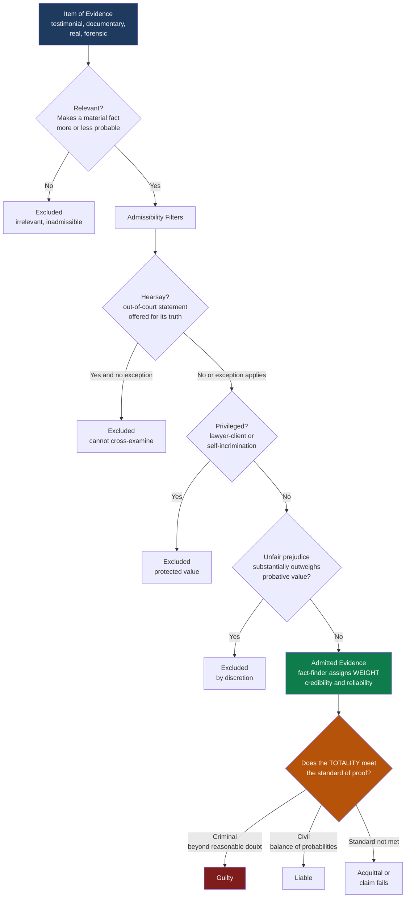

# ⚖️ Evidence and Proof

> [!abstract] TL;DR
> The **law of evidence** is the body of rules deciding *what* information a fact-finder (jury or judge) may hear and *how* facts count as proved. Its two engines are the **burden of proof** — who must persuade, and by default the **prosecution**, because the accused is **presumed innocent** — and the **standard of proof** — how convinced they must be: **beyond reasonable doubt** in criminal cases, **balance of probabilities** in civil ones, with **clear and convincing evidence** as an intermediate. Relevant evidence is the raw material, but it is passed through **exclusionary filters** (hearsay, privilege, prejudice, illegality) before a fact-finder may weigh it. The field's deepest danger zone is **probabilistic and forensic evidence**, where the **prosecutor's fallacy** turns a "one in a million" match into a false claim of near-certain guilt.

---

## Intuition

**Analogy:** A trial is not a search for a photograph of the truth — it is the assembly of a **jigsaw puzzle from a box of mismatched, damaged, and sometimes forged pieces**. Each witness, document, and forensic report is one piece. Some pieces are crisp and lock in cleanly (a signed contract, a fingerprint on the weapon); others are faded, warped, or bent to fit (a nervous eyewitness, a coerced confession, a "statistic" that sounds decisive but is being read backwards). The fact-finder's job is not to find one magic piece but to see whether the *whole assembled picture* is clear enough to act on. Crucially, the law does not let every piece into the box: a **referee at the table** — the judge applying the rules of evidence — throws out pieces that are irrelevant, that come from someone who never showed up to be questioned (**hearsay**), that were stolen from a locked drawer (**privilege**, **illegally obtained evidence**), or that are so lurid they will make the assembler *want* a particular picture rather than see the real one (**unfair prejudice**).

Proof, then, is **belief updated by evidence**, exactly as a detective revises a hunch clue by clue — but constrained by rules about which clues are allowed on the table and by a threshold of confidence the law insists you reach before you may declare the picture complete. Getting the threshold and the direction of reasoning right is the whole game; getting them backwards is how innocent people are convicted.

---

## How It Works

### Core Mechanics

**1. Two burdens, not one.** The **legal (persuasive) burden** is the obligation to prove a fact to the required standard *by the end* of the trial; if it is not met, the party bearing it loses that issue. The **evidential burden** is the lighter task of merely raising enough evidence to put an issue "in play" so the fact-finder may consider it. In a criminal case the prosecution carries the legal burden on every element of the offence — the "golden thread" running through the criminal law (*Woolmington v DPP*, 1935) — because the accused enjoys the **presumption of innocence**. The defendant may carry an *evidential* burden to raise a defence (say, self-defence), after which the prosecution must *disprove* it. A few "reverse-onus" defences (e.g. insanity) shift a *legal* burden onto the accused, but only to the civil standard.

**2. Standards of proof are decision thresholds.** They set how much credence the fact-finder must reach:
- **Balance of probabilities / preponderance of the evidence** (civil) — more likely than not, credence just over 0.5.
- **Clear and convincing evidence** (intermediate, used for fraud, some civil-commitment and deportation matters) — substantially more probable than not.
- **Beyond reasonable doubt** (criminal) — a near-certainty, deliberately asymmetric to protect against wrongful conviction, expressing **Blackstone's ratio**: better ten guilty escape than one innocent suffer.

**3. Relevance is the gate; admissibility is the filter.** Evidence must first be **relevant** — it must make a material fact *more or less probable* than without it (a low bar, "any tendency"). But relevance is necessary, not sufficient: **relevant evidence can still be excluded** when its **probative value is substantially outweighed by unfair prejudice**, confusion, or waste of time. This "probative-vs-prejudicial" balance is the discretionary heart of the field.

**4. The main exclusionary rules.**
- **Hearsay** — an out-of-court statement offered to prove the truth of what it asserts is generally excluded, because the original speaker was not under oath and cannot be **cross-examined** (the rationale: reliability cannot be tested). Numerous **exceptions** exist (business records, dying declarations, excited utterances, admissions by a party).
- **Privilege** — some relevant evidence is protected to serve values outside the trial: **legal professional / attorney-client privilege** (candid legal advice), and the **privilege against self-incrimination** ("right to silence," the Fifth Amendment), which reinforces the prosecution's burden.
- **Character evidence** — proof that the accused is "the kind of person who would do this" is generally barred as more prejudicial than probative, with limited exceptions.
- **Illegally / improperly obtained evidence** — the **exclusionary rule** may suppress evidence gathered in breach of rights (e.g. an unlawful search), to deter misconduct and protect the integrity of the process.

**5. Weight, then verdict.** Once evidence survives the filters, the fact-finder assigns it **weight** — a judgment of credibility and reliability — and asks whether the *totality* meets the standard of proof. Types of evidence differ in character: **testimonial** (witnesses), **documentary**, **real** (physical objects), and the direct/circumstantial distinction — **direct** evidence proves a fact without inference (an eyewitness to the act); **circumstantial** requires an inferential bridge (fingerprints, motive). Contrary to intuition, a strong web of circumstantial evidence can be *more* reliable than a single confident eyewitness.

**6. Expert and probabilistic evidence — the danger zone.** **Expert / forensic** evidence lets specialists give opinion the jury cannot form alone, gatekept for reliability by the **Frye** ("general acceptance") or **Daubert** (testability, error rate, peer review, acceptance) standards. But it invites the **CSI effect** (juror over-trust in forensics), **junk science**, and above all the **prosecutor's fallacy**: confusing the probability of *the evidence given innocence* with the probability of *innocence given the evidence*. A "1 in a million random-match probability" is P(match | innocent), **not** P(innocent | match) — and in a large suspect pool many innocent people can match. This is base-rate neglect, and it convicted **Sally Clark**.

### Flow / Architecture



---

## Key Concepts

**Secondary / High-school level.** In court, the side that *accuses* has to prove it — you do not have to prove you are innocent, because the law **presumes you innocent** until proven guilty. In a criminal trial the prosecution must convince the jury **beyond reasonable doubt** (almost certain). In a private lawsuit the winner only needs to be **more likely right than wrong** (just over half). Not every fact gets heard: a judge throws out "evidence" that is off-topic, gossip from someone who never came to testify (**hearsay**), private lawyer conversations (**privilege**), or things so shocking they would make the jury unfair. Big idea: proof is about building a convincing *whole picture* from clues of different quality — and a scientific-sounding statistic like "one in a million" can be dangerously misleading.

**Undergraduate level.** Distinguish the **legal/persuasive burden** (must prove to the standard or lose) from the **evidential burden** (must merely raise the issue), and know the default allocation flows from the **presumption of innocence** (*Woolmington*). Map the three standards — **preponderance / balance of probabilities**, **clear and convincing**, **beyond reasonable doubt** — as rising credence thresholds justified by **Blackstone's ratio** and the asymmetric cost of error. Master the **relevance vs admissibility** two-step: relevant evidence is admissible *unless* an exclusionary rule or the **probative-vs-prejudicial** balance bars it. Learn the exclusionary rules and their *rationales*: **hearsay** (untested reliability, no cross-examination) and its exceptions; **privilege** (protecting values external to the trial); **character** evidence; and **illegally obtained** evidence and the **exclusionary rule**. Classify **types of evidence** (testimonial, documentary, real; direct vs circumstantial) and the reliability standards for expert science (**Frye** general-acceptance vs **Daubert** multi-factor).

**Graduate / professional level.** Engage the **legal-epistemology** debate: is a verdict a claim about *probability* or about *justified belief*? The **preponderance** standard looks like "posterior > 0.5," yet courts resist convicting on **naked statistical evidence** alone — the **Gatecrasher paradox** (501 of 1,000 rodeo spectators did not pay: may we find any *individual* liable on 0.501 probability?) and the **Blue Bus** hypothetical show that bare base rates feel insufficient even when they clear the numeric threshold, motivating theories of *individualized evidence*, *causal* or *knowledge-based* accounts of proof, and the demand that evidence *track* the truth rather than merely correlate with it. Interrogate **probabilistic forensic evidence**: the **prosecutor's fallacy** transposes the conditional, P(evidence | innocent) &ne; P(innocent | evidence); the **defence attorney's fallacy** under-weights a match by pointing only to the raw number of possible matchers; the **Sally Clark** case compounded this with an *independence error* (squaring dependent SIDS probabilities) and Bayesian base-rate neglect, prompting the Royal Statistical Society's intervention. Situate the **reliability crisis** — DNA exonerations show **eyewitness misidentification** and **false confessions** are leading causes of wrongful conviction, exposing the gap between subjective juror confidence and actual accuracy — and connect it to the **Daubert** gatekeeping response to "junk science" (bite-mark, hair-comparison, some bloodstain analysis). Finally, weigh the **exclusionary rule** debate: deterrence of state misconduct and process integrity versus the social cost of suppressing reliable, probative evidence of guilt.

---

## Python Demo

```python
# The prosecutor's fallacy, made numerical.
# A forensic (e.g. DNA) match has a small RANDOM-MATCH PROBABILITY (RMP):
#   RMP = P(match | innocent) = "1 in a million" style figure.
# The fallacy claims this IS the probability of innocence -> P(guilt) ~ 1 - RMP.
# Bayes says otherwise. In a suspect pool of N people (one of whom is guilty),
# a random member has prior guilt 1/N. Then:
#   P(guilt | match) = P(match|guilt) P(guilt)
#                      -----------------------------------------------
#                      P(match|guilt) P(guilt) + P(match|innocent) P(innocent)
# With P(match|guilt)=1, P(guilt)=1/N, P(match|innocent)=RMP:
#   posterior = 1 / (1 + RMP * (N - 1))
# The point: as the pool N grows, MANY innocents match, and a "1 in a million"
# match is NOT "1 in a million chance of innocence".
import numpy as np
import matplotlib.pyplot as plt

def posterior_guilt(N, rmp):
    """P(guilt | match) for a random matcher in a pool of size N."""
    prior = 1.0 / N
    p_match = 1.0 * prior + rmp * (1.0 - prior)   # law of total probability
    return (1.0 * prior) / p_match

# --- Table for a single, very strong-sounding match: RMP = 1 in a million ---
rmp = 1e-6
pools = [10, 1_000, 100_000, 1_000_000, 10_000_000, 60_000_000]
print("PROSECUTOR'S FALLACY:  RMP = 1 in 1,000,000  (P(match | innocent))")
print("Naive (fallacious) claim: P(guilt) = 1 - RMP = 0.999999 regardless of pool")
print("=" * 70)
print(f"{'Suspect pool N':>16}{'Expected innocent':>20}{'TRUE P(guilt|match)':>22}")
print(f"{'':>16}{'matches (N-1)*RMP':>20}{'':>22}")
print("-" * 70)
for N in pools:
    exp_innocent = (N - 1) * rmp
    print(f"{N:>16,}{exp_innocent:>20.4f}{posterior_guilt(N, rmp):>22.4f}")
print("-" * 70)
print("A '1 in a million' match in a city of a million gives ~50% guilt, not 99.9999%.")

# --- Plot: posterior guilt vs population size, several RMP values ---
N_grid = np.logspace(1, 8, 400)          # pools from 10 to 100 million
rmp_values = [1e-6, 1e-7, 1e-8]
colors = ["#c0392b", "#e67e22", "#2980b9"]

fig, ax = plt.subplots(figsize=(11, 6.5))

for rmp_v, c in zip(rmp_values, colors):
    post = np.array([posterior_guilt(N, rmp_v) for N in N_grid])
    ax.plot(N_grid, post, color=c, linewidth=2.4,
            label=f"Bayesian P(guilt | match), RMP = 1 in {int(1/rmp_v):,}")
    # The fallacy: a flat line asserting P(guilt) = 1 - RMP, independent of N
    ax.axhline(1 - rmp_v, color=c, linestyle=":", linewidth=1.4, alpha=0.8)

ax.axhline(0.5, color="gray", linestyle="--", linewidth=1, alpha=0.7)
ax.text(1.3e1, 0.52, "coin-flip (0.5)", color="gray", fontsize=8)

ax.set_xscale("log")
ax.set_xlabel("Suspect pool / population size N (log scale)", fontsize=11)
ax.set_ylabel("P(guilt | forensic match)", fontsize=11)
ax.set_ylim(-0.03, 1.05)
ax.set_title("The Prosecutor's Fallacy: a 'one in a million' match\n"
             "does NOT mean 'one in a million chance of innocence'",
             fontsize=12, fontweight="bold")
ax.annotate("Dotted flat lines = the FALLACY\n(P(guilt) = 1 - RMP, ignores base rate)",
            xy=(2e2, 0.985), fontsize=9, color="#7f1d1d",
            bbox=dict(boxstyle="round", fc="#fdecea", ec="#c0392b", alpha=0.9))
ax.annotate("Solid curves = the TRUTH (Bayes).\nAs the pool grows, innocent\nmatches pile up and guilt collapses.",
            xy=(2e6, 0.35), xytext=(3e4, 0.18), fontsize=9, color="#1e3a5f",
            arrowprops=dict(arrowstyle="->", color="#1e3a5f"),
            bbox=dict(boxstyle="round", fc="#eaf2fb", ec="#2980b9", alpha=0.9))
ax.legend(loc="center left", fontsize=8.5, framealpha=0.95)
ax.grid(True, which="both", alpha=0.2)

plt.tight_layout()
plt.savefig("prosecutors_fallacy.png", dpi=120, bbox_inches="tight")
print("\nSaved -> prosecutors_fallacy.png")
```

The output makes the fallacy unmissable. With a random-match probability of one in a million, the naive prosecutor asserts a flat 99.9999% chance of guilt regardless of how many people *could* have matched. The Bayesian curves tell the real story: in a pool of 1,000,000 the posterior is only about **0.5**, and in a pool of 10,000,000 it collapses to roughly **0.09**. The match is genuinely strong *evidence* — it multiplies the odds of guilt by a million — but strength of evidence is not the same as probability of guilt, because the **prior** (how many people the match could implicate) matters just as much. This is exactly the transposed-conditional error that wrongful-conviction cases turn on.

---

## Real-World Applications

- **DNA "cold hit" database searches.** When a crime-scene profile is trawled against a database of millions, the relevant question is not the raw random-match probability but the *database-search* posterior — with a large enough database, chance matches to innocent people become likely. Courts and forensic-statistics guidelines (and the National Research Council's DNA reports) now explicitly address this base-rate correction, precisely the calculation in the Python demo.
- **R v Sally Clark (2003, England).** A mother was convicted of murdering two infants after a paediatrician testified the chance of two natural cot deaths was "1 in 73 million" — an *independence* error (squaring a single-death figure) compounded by the *prosecutor's fallacy* of reading it as the probability of innocence. The **Royal Statistical Society** publicly condemned the reasoning; the conviction was quashed. The case is the canonical warning about statistics in court.
- **Daubert gatekeeping and the forensic-science reckoning.** After *Daubert v. Merrell Dow* (1993), U.S. judges must assess reliability (testability, known error rate, peer review, acceptance). The 2009 National Academy of Sciences report and the 2016 PCAST report used this lens to challenge long-trusted "sciences" — bite-mark comparison, microscopic hair analysis, some firearms and bloodstain-pattern testimony — as lacking validated error rates.
- **Eyewitness identification reform.** DNA exonerations (Innocence Project) show mistaken eyewitness identification contributed to roughly **70%** of overturned convictions. This drove reforms: double-blind sequential lineups, confidence statements recorded at first ID, and cautionary jury instructions on the unreliability of confident-but-wrong witnesses.
- **The exclusionary rule in practice.** Evidence from an unlawful search (U.S. Fourth Amendment; *Mapp v. Ohio*) or a confession obtained without proper caution (*Miranda*, PACE in England) can be suppressed even when reliable and probative — a deliberate trade of some accurate outcomes for deterrence of state misconduct and process integrity.
- **Civil litigation and the preponderance standard.** Product-liability, negligence, and contract cases turn on "more likely than not," which is why civil defendants can lose on the same facts that would fail to convict criminally — famously, a defendant acquitted in a criminal trial (beyond reasonable doubt) can still be held liable in the parallel civil suit (balance of probabilities).

---

## Common Pitfalls

- **The prosecutor's fallacy (transposed conditional).** Reading P(match | innocent) as P(innocent | match). "One in a million to match by chance" is *not* "one in a million chance he is innocent." Ignoring the size of the pool that could have matched inflates apparent guilt catastrophically, as the demo shows.
- **The defence attorney's fallacy (its mirror).** Dismissing a match by saying "in a city of 5 million, 5 people match, so the odds he is guilty are only 1 in 5" — this ignores *all other evidence* narrowing the pool. Both fallacies come from refusing to combine the statistic with the priors.
- **Confusing the two burdens.** Treating the accused's *evidential* burden to raise a defence as if it were a *legal* burden to prove innocence. It is not: once a defence is raised, the prosecution must disprove it to the criminal standard. Reversing this quietly erodes the presumption of innocence.
- **Equating "circumstantial" with "weak."** Direct evidence (a confident eyewitness) can be far less reliable than a dense, mutually corroborating web of circumstantial evidence. Juries and commentators routinely overrate direct testimony and underrate convergent circumstantial proof.
- **Admitting relevant-but-prejudicial evidence.** Forgetting that relevance is a floor, not a licence: gruesome photographs, prior convictions, or "he's that kind of person" character evidence can be excluded because unfair prejudice substantially outweighs probative value. Skipping the balancing step is a classic error.
- **Over-trusting confessions and forensics (the CSI effect).** Confessions feel dispositive, yet false confessions (from coercion, vulnerability, or long interrogation) recur in exoneration data; forensic testimony sounds "scientific" even when its error rate is unvalidated. Confidence is not calibration.
- **The independence error in stacking probabilities.** Multiplying probabilities of correlated events as if independent (the Sally Clark "1 in 73 million") wildly overstates rarity. Dependence between events must be modelled, not assumed away.

---

## Related Concepts

- [[Rule_of_Law_and_Due_Process]] — the presumption of innocence, fair notice, and a neutral fact-finder are the due-process foundations the burden and standard of proof operationalise; illegally obtained evidence engages the same process-integrity values.
- [[Legal_Reasoning_and_Interpretation]] — how facts, once proved, are subsumed under legal rules; evidence supplies the "minor premise" that legal reasoning then applies the law to.
- [[Bayesian_Reasoning]] — the formal engine of "belief updated by evidence"; the posterior-guilt calculation and the prosecutor's fallacy are direct applications of Bayes' theorem and base rates.
- [[Cognitive_Biases_and_Heuristics]] — base-rate neglect, the representativeness heuristic, and overconfidence explain *why* jurors (and experts) fall for the prosecutor's fallacy and over-trust confident eyewitnesses.
- [[Probability_Theory]] — conditional probability, the law of total probability, and independence are the mathematical grammar of statistical and forensic evidence.
- [[Bayesian_Statistics]] — priors, likelihoods, and posteriors formalise how a match should update belief and why the suspect-pool prior is indispensable.
- [[Scientific_Reasoning_and_Method]] — the reliability criteria (testability, error rates, replication) behind the Frye/Daubert gatekeeping of expert and forensic evidence.
- [[Statistical_Inference_and_Hypothesis_Testing]] — the transposed-conditional error mirrors the classic misreading of p-values, P(data | null) confused with P(null | data).
- [[Epistemology_and_Theories_of_Knowledge]] — legal epistemology asks whether a verdict is a probability judgment or a claim of justified, truth-tracking belief (the Gatecrasher and Blue Bus paradoxes).
- [[Abductive_Reasoning_and_Inference_to_Best_Explanation]] — fact-finding often proceeds by inference to the best explanation of the whole evidentiary picture, not by mechanical probability alone.

---

## Review Questions

1. **(Recall / conceptual)** Distinguish the **legal (persuasive) burden** from the **evidential burden**, and state which party bears each in a criminal trial where the accused raises self-defence. Then define the three standards of proof and explain why the criminal standard is set so much higher than the civil one — what asymmetry of error costs does *Blackstone's ratio* encode?
2. **(Applied / scenario)** A DNA sample from a crime scene has a random-match probability of 1 in 10 million. Police obtain it via a database "cold hit" against a database of 8 million profiles, with no other evidence linking the matched person to the crime. The prosecutor tells the jury: "The chance this is the wrong man is 1 in 10 million." Using Bayes' theorem, compute the actual posterior probability of guilt for a random matcher, identify the fallacy by name, and explain what *additional* evidence would be needed to legitimately raise the posterior toward the criminal standard.
3. **(Trade-off / critical)** The **exclusionary rule** suppresses reliable, probative evidence of guilt when it was obtained illegally, and the **hearsay rule** excludes relevant statements whose maker cannot be cross-examined. Both sacrifice accurate outcomes for other values. Argue both sides: when is excluding true, relevant evidence justified, and when does it let the guilty go free at unacceptable cost? Relate your answer to the difference between a trial as *truth-finding* and a trial as *legitimate, rights-respecting process*.

---

## Sources

- Legal Information Institute, Cornell Law School — [Federal Rules of Evidence](https://www.law.cornell.edu/rules/fre) (relevance, hearsay, privilege, character, and Rule 403 probative-vs-prejudicial balancing).
- *Daubert v. Merrell Dow Pharmaceuticals, Inc.*, 509 U.S. 579 (1993) — the reliability-based gatekeeping standard for expert and scientific evidence; see also *Frye v. United States*, 293 F. 1013 (D.C. Cir. 1923).
- Royal Statistical Society, ["Royal Statistical Society concerned by issues raised in Sally Clark case"](https://rss.org.uk/RSS/media/File-library/News/2021/SallyClarkRSSstatement.pdf) (2001 statement on statistical evidence and the prosecutor's fallacy).
- Thompson, W. C. & Schumann, E. L. (1987), "Interpretation of Statistical Evidence in Criminal Trials: The Prosecutor's Fallacy and the Defense Attorney's Fallacy," *Law and Human Behavior* 11(3), 167–187 — the canonical naming of both fallacies.
- National Research Council, *Strengthening Forensic Science in the United States: A Path Forward* (National Academies Press, 2009) — landmark critique of forensic reliability and error rates.
- The Innocence Project — [Eyewitness Misidentification](https://innocenceproject.org/eyewitness-identification-reform/) and false-confession data from DNA exonerations.

---

#law #evidence #burden-of-proof #bayes #forensics
