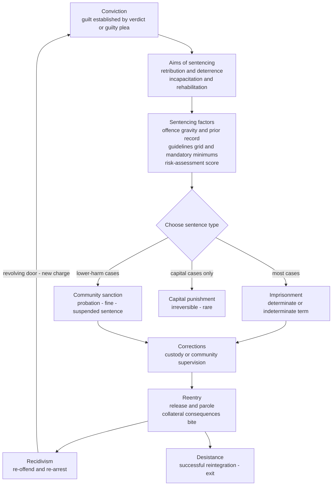

# ⚖️ Sentencing and Criminal Justice

> [!abstract] TL;DR
> **Sentencing** is the moment a criminal-justice system translates a *conviction* into a concrete *consequence* — prison, a fine, probation, a suspended sentence, or, at the extreme, death. Every sentence is an attempt to serve one or more competing **aims of punishment** (retribution, deterrence, incapacitation, rehabilitation), and systems differ enormously in how much they trust the individual judge's **discretion** versus binding **structure** (guidelines, grids, mandatory minimums, three-strikes laws). The stakes are systemic: the US drift toward mandatory, lengthy sentences drove **mass incarceration** and a **recidivism** "revolving door" whose collateral consequences ripple through families and neighbourhoods. Today the frontier controversy is **algorithmic risk assessment** in bail and sentencing (COMPAS), where a mathematical *impossibility result* proves that a risk score cannot be simultaneously **calibrated** across racial groups *and* produce **equal false-positive rates** when base rates differ — so "fairness" itself must be chosen, not merely computed.

---

## Intuition

**Analogy:** A trial answers *"did you do it?"* the way a diagnosis answers *"what disease is this?"*. Sentencing is the *treatment plan* — and just as two doctors can agree on the diagnosis yet prescribe very different regimens, two judges can agree on guilt yet impose wildly different sentences. A good medical system does not let the prescription depend on which doctor you happened to draw or on your skin colour; it wants the treatment to fit *the patient's condition*, consistently. Sentencing faces the identical tension: we want the punishment tailored to *this* offender and *this* offence (individualised justice), but we also want two similar offenders to get similar sentences (equal treatment). Every sentencing reform in history — guidelines, mandatory minimums, risk scores — is a different answer to that one trade-off between the *bespoke* and the *uniform*.

Now sharpen it. A prescription can aim at different goals: *cure* the patient (rehabilitation), *quarantine* them so they cannot infect others (incapacitation), *deter* others from catching the disease through public warning (deterrence), or simply *mark* the seriousness of what happened (retribution). These goals sometimes point the same way and sometimes collide — the sentence that best incapacitates (life in prison) may be the worst for rehabilitation. Sentencing is the arena where a society decides, case by case, which of those goals wins.

---

## How It Works

### Core mechanics

**1. From conviction to consequence.** Sentencing begins only *after* guilt is established — by verdict or, in over 90% of US felony cases, by a **guilty plea** negotiated in **plea bargaining**. This matters: the vast majority of sentences are never the product of a trial at all but of a bargain struck in the "shadow" of the maximum sentence the prosecutor could threaten.

**2. The four aims of punishment.** Judges (and legislatures who set the rules) are pursuing one or more classical justifications, the same ones catalogued in the philosophy of punishment:
- **Retribution** — backward-looking *desert*; the offender deserves proportionate suffering because of what they did ("just deserts").
- **Deterrence** — forward-looking; punish this offender to discourage them (specific) and others (general) from future crime.
- **Incapacitation** — physically prevent crime by removing the offender's capacity to offend (imprisonment, and in the limit, execution).
- **Rehabilitation** — reform the offender so they choose not to reoffend (treatment, education, reentry support).

These aims are not merely academic: an *indeterminate* sentence ("5 years to life, parole board decides") is a rehabilitation/incapacitation instrument, while a fixed *mandatory minimum* is a retribution/deterrence instrument. The chosen aim quietly dictates the machinery.

**3. Types of sentence** (roughly ordered by severity):
- **Imprisonment / custody** — the headline sanction; may be *determinate* (a fixed term) or *indeterminate* (a range with release decided later).
- **Fines and financial penalties** — including restitution to victims; cheap to administer but regressive (a flat fine hurts the poor far more, which some systems fix with *day-fines* scaled to income).
- **Community sanctions / probation** — supervision in the community with conditions (curfews, treatment, work); the workhorse of most systems.
- **Suspended sentence** — a custodial term that is not activated unless the offender reoffends within a period; a conditional threat.
- **Capital punishment (death penalty)** — irreversible, retained by a minority of jurisdictions, abolished in most democracies; dogged by wrongful-conviction and racial-disparity evidence.

**4. Discretion versus structure — the central design axis.** How much should the outcome depend on the individual judge?
- **Indeterminate sentencing** (dominant in the US mid-20th century) gave judges and parole boards wide latitude to individualise, on a rehabilitative ideal — but produced *unwarranted disparity* and, critics charged, hidden racial bias.
- **Determinate / structured sentencing** reacted by constraining discretion with **sentencing guidelines** — often a **grid** whose axes are *offence seriousness* and *criminal history*, yielding a recommended range. The US Federal Sentencing Guidelines (1987) are the canonical example.
- **Mandatory minimums** go further, removing discretion entirely: conviction *requires* at least X years regardless of circumstances.
- **Three-strikes laws** impose dramatically enhanced sentences (up to life) on a third qualifying conviction.

**5. The consequences of structure.** Mandatory minimums and three-strikes laws were sold as consistency and toughness, but they had systemic effects: they *transferred discretion from judges to prosecutors* (who choose the charge, and thus the floor), fuelled long sentences that drove **mass incarceration**, and produced their own grotesque disparities (a life sentence for a third petty theft; the notorious 100:1 crack-versus-powder-cocaine sentencing ratio in US law that fell hardest on Black defendants).

**6. Mass incarceration and the revolving door.** From the 1970s the US incarceration rate quintupled, driven by the **war on drugs**, mandatory minimums, and "tough on crime" politics, making the US the world's largest jailer. The social costs — to families, employment, and disproportionately to poor and minority communities — are a central topic in the sociology of crime. On release, **collateral consequences** (barriers to housing, employment, voting, benefits) push many back toward crime, producing high **recidivism**: the "revolving door" in which corrections feeds itself rather than reducing crime.

**7. The algorithmic frontier.** To make bail, parole, and sentencing decisions more *consistent* and *evidence-based*, courts increasingly use **actuarial risk-assessment tools** (COMPAS, PSA, LSI-R) that output a recidivism-risk score. This promised objectivity but delivered a famous controversy — analysed in detail below and in the Python demo — that turns out to be *mathematically* unavoidable rather than a mere engineering bug.

### Flow / Architecture



---

## Key Concepts

**Secondary / High-school level.** After a court decides you are guilty, it must decide *what happens to you* — that decision is **sentencing**. The choices run from paying a **fine**, to **probation** (staying free but supervised with rules), to **prison**, up to the **death penalty** in a few places. Why punish at all? Four reasons: to give people what they *deserve* (retribution), to *scare* people out of crime (deterrence), to *keep dangerous people away from others* (incapacitation), and to *help them change* (rehabilitation). A big argument is how much freedom a *judge* should have to choose. If judges decide freely, similar crimes can get very different punishments, which feels unfair; if the law fixes the punishment in advance (a **mandatory minimum**), it is consistent but can be harshly unfair in unusual cases. In the United States these fixed, tough sentences helped put a huge number of people in prison — "mass incarceration" — and many come out and reoffend because life after prison is so hard.

**Undergraduate level.** Master the **discretion-versus-structure spectrum**: *indeterminate* sentencing (wide judicial and parole-board latitude, rehabilitative ideal) versus *determinate/structured* sentencing (**sentencing guidelines** and **grids** keyed to offence seriousness and criminal history) versus *mandatory* regimes (**mandatory minimums**, **three-strikes**). Understand the core tension between **individualised justice** (fit the sentence to the person) and **consistency / equal treatment** (like cases alike), and how each reform trades one for the other. Know the empirical story of **mass incarceration**: the post-1970s US quintupling of incarceration, its drivers (**war on drugs**, mandatory minimums, prosecutorial charging power, "tough on crime" politics), and the *disparity* evidence (racial and socioeconomic gaps; the crack/powder ratio). Grasp **recidivism** and **reentry**: the revolving door, and **collateral consequences** (housing, employment, voting, licensing bars) as criminogenic. Distinguish **retributive** (desert-based, backward-looking) from **utilitarian/consequentialist** (deterrence, incapacitation, rehabilitation, forward-looking) justifications, and note that they can recommend opposite sentences in the same case. Finally, learn **procedural justice** (Tom Tyler): people comply with law and accept outcomes more when they experience the *process* as fair — voice, neutrality, respect, trustworthiness — often *more* than they respond to the outcome's favourability, which reframes legitimacy as a resource the system either builds or squanders.

**Graduate / professional level.** Interrogate the hard edges. **The economics and effectiveness of sanctions:** deterrence theory (Becker's model of crime as a rational choice against expected punishment) predicts that the *certainty* of punishment deters far more than its *severity* — a finding that undercuts long mandatory sentences, whose marginal incapacitation benefit falls sharply with age ("ageing out" of crime) while marginal cost stays high. Compare the cost-effectiveness of a prison-year against community treatment, drug courts, and **restorative-justice** conferencing (victim–offender mediation that centres repair over retribution). **The algorithmic-fairness impossibility result:** given a protected attribute and *different base rates* of recidivism across groups, **Chouldechova (2017)** and **Kleinberg et al. (2016)** prove that a risk instrument cannot simultaneously satisfy **predictive parity / calibration** (a given score means the same recidivism probability in every group) and **equalized error rates** (equal false-positive and false-negative rates). The COMPAS debate — ProPublica emphasising unequal FPR, Northpointe emphasising equal calibration — was *not* a factual dispute but two parties selecting incompatible fairness axioms; the choice is normative and political, not technical (see [[AI_Bias_and_Fairness]] and the Python demo). This connects sentencing directly to the AI-governance literature: risk tools also raise **due-process** problems (trade-secret models the defendant cannot inspect, as in *State v. Loomis*), **feedback loops** (arrest-based training labels encode policing bias, not crime), and the danger of *automation bias* (judges over-trusting a number). **Disparity, causation, and reform:** disentangle disparity produced *at sentencing* from disparity accumulated *upstream* (policing, charging, bail, plea leverage) — a sentence-only fix cannot cure a pipeline problem. Weigh **structured discretion** designs (advisory rather than mandatory guidelines, "second-look" resentencing, presumptive parole) as attempts to keep consistency *without* the pathologies of rigid minimums.

---

## Python Demo

```python
# The fairness-impossibility result behind the COMPAS debate.
#
# Setup (numpy + matplotlib only): two groups A and B with the SAME risk-scoring
# process conditional on the true outcome (the score has equal predictive
# validity for both groups) but DIFFERENT base rates of recidivism. We show that
# NO single pair of decision thresholds can make the tool BOTH calibrated
# (equal precision / predictive parity) AND fair on false-positive rate at once.
# This reproduces Chouldechova's (2017) algebraic result the way the ProPublica
# vs Northpointe dispute played out over COMPAS.
import numpy as np
import matplotlib.pyplot as plt

rng = np.random.default_rng(0)

# ---- Simulate two groups -------------------------------------------------
# Score | (recidivist)      ~ Normal(mu1, sigma)   -- SAME for both groups
# Score | (non-recidivist)  ~ Normal(mu0, sigma)   -- SAME for both groups
# Only the BASE RATE (prevalence of true recidivism) differs across groups.
mu0, mu1, sigma = 0.0, 2.2, 1.5
def make_group(n, base_rate):
    y = (rng.random(n) < base_rate).astype(int)          # true recidivism
    score = np.where(y == 1,
                     rng.normal(mu1, sigma, n),
                     rng.normal(mu0, sigma, n))            # equal-validity score
    return y, score

nA, nB = 200_000, 200_000
pA, pB = 0.50, 0.25                                        # DIFFERENT base rates
yA, sA = make_group(nA, pA)
yB, sB = make_group(nB, pB)

def metrics(y, s, t):
    pred = s >= t
    TP = np.sum(pred & (y == 1)); FP = np.sum(pred & (y == 0))
    FN = np.sum(~pred & (y == 1)); TN = np.sum(~pred & (y == 0))
    tpr = TP / (TP + FN)
    fpr = FP / (FP + TN)
    ppv = TP / (TP + FP) if (TP + FP) > 0 else np.nan     # precision = calibration proxy
    return tpr, fpr, ppv

# ---- Group A fixes an operating threshold; we ask what B must do ----------
tA = 1.5
tprA, fprA, ppvA = metrics(yA, sA, tA)

# Sweep group B's threshold and record its precision (PPV) and FPR
tB_grid = np.linspace(-1.0, 4.5, 400)
ppvB = np.array([metrics(yB, sB, t)[2] for t in tB_grid])
fprB = np.array([metrics(yB, sB, t)[1] for t in tB_grid])

# Threshold that makes B CALIBRATED like A (match PPV)  vs  FPR-FAIR like A (match FPR)
t_match_ppv = tB_grid[np.nanargmin(np.abs(ppvB - ppvA))]
t_match_fpr = tB_grid[np.argmin(np.abs(fprB - fprA))]

print("GROUP A operating point (threshold = %.2f):" % tA)
print(f"   base rate = {pA:.2f}   PPV(calibration) = {ppvA:.3f}   FPR = {fprA:.3f}")
print("\nTo copy A's PPV, group B needs threshold  %.2f  -> but then FPR_B = %.3f"
      % (t_match_ppv, metrics(yB, sB, t_match_ppv)[1]))
print("To copy A's FPR, group B needs threshold  %.2f  -> but then PPV_B = %.3f"
      % (t_match_fpr, metrics(yB, sB, t_match_fpr)[2]))
print("\n=> The two required thresholds DIFFER: you cannot equalize calibration")
print("   AND false-positive rate simultaneously when base rates differ.")

# ---- Chouldechova identity check: FPR = (p/(1-p)) * ((1-PPV)/PPV) * TPR ----
tprB, fprB_at, ppvB_at = metrics(yB, sB, tA)              # B at the SAME threshold as A
lhs = fprB_at
rhs = (pB / (1 - pB)) * ((1 - ppvB_at) / ppvB_at) * tprB
print(f"\nChouldechova identity for B at threshold {tA}: FPR={lhs:.3f}  vs  formula={rhs:.3f}")

# ---- Plot the impossibility as a threshold trade-off ---------------------
fig, ax = plt.subplots(figsize=(9, 6))
ax.plot(tB_grid, ppvB, lw=2.2, color="tab:blue",  label="Group B precision  PPV of t  [calibration]")
ax.plot(tB_grid, fprB, lw=2.2, color="tab:red",   label="Group B false-positive rate  FPR of t")
ax.axhline(ppvA, ls="--", color="tab:blue", alpha=0.8, label=f"Group A PPV = {ppvA:.2f}  [target]")
ax.axhline(fprA, ls="--", color="tab:red",  alpha=0.8, label=f"Group A FPR = {fprA:.2f}  [target]")
ax.axvline(t_match_ppv, color="tab:blue", alpha=0.6)
ax.axvline(t_match_fpr, color="tab:red",  alpha=0.6)
ax.axvspan(min(t_match_ppv, t_match_fpr), max(t_match_ppv, t_match_fpr),
           color="grey", alpha=0.15)
ax.text((t_match_ppv + t_match_fpr) / 2, 0.55,
        "no single threshold\nsatisfies BOTH", ha="center", fontsize=10, color="black")
ax.annotate("match A's calibration", xy=(t_match_ppv, ppvA), xytext=(t_match_ppv - 1.7, 0.85),
            arrowprops=dict(arrowstyle="->", color="tab:blue"), color="tab:blue", fontsize=9)
ax.annotate("match A's FPR", xy=(t_match_fpr, fprA), xytext=(t_match_fpr + 0.3, 0.30),
            arrowprops=dict(arrowstyle="->", color="tab:red"), color="tab:red", fontsize=9)
ax.set_xlabel("Group B decision threshold  t")
ax.set_ylabel("Rate")
ax.set_title("Fairness impossibility in risk-based sentencing\ndifferent base rates: calibration and equal FPR pull apart")
ax.legend(loc="upper right", fontsize=8)
ax.grid(True, alpha=0.3)
plt.tight_layout()
plt.savefig("sentencing_fairness_impossibility.png", dpi=120)
print("\nSaved figure -> sentencing_fairness_impossibility.png")
```

Running it prints group A's operating point, then shows that the threshold group B needs to **match A's precision** (calibration / predictive parity) is *different* from the threshold needed to **match A's false-positive rate** — the grey band between the two vertical lines is the region where no choice works. The Chouldechova identity `FPR = [p/(1-p)] * [(1-PPV)/PPV] * TPR` is confirmed numerically: because the prevalence term `p/(1-p)` differs across groups, holding PPV *and* TPR equal *forces* FPR to differ. This is exactly the COMPAS deadlock — Northpointe's "it is calibrated" and ProPublica's "the false-positive rate is higher for Black defendants" were *both true simultaneously*, and no engineering fix can reconcile them. The only way out is a *normative* decision about which notion of fairness the criminal-justice system should honour, which ties directly to [[AI_Bias_and_Fairness]] and the broader problem of encoding contested values into machine decisions.

---

## Real-World Applications

- **US Federal Sentencing Guidelines (1987) and state grids.** The canonical structured-sentencing system: an offence-level axis and a criminal-history axis meet in a grid cell giving a recommended range. After *United States v. Booker* (2005) the federal guidelines became *advisory* rather than mandatory, restoring some judicial discretion — a live case study in the discretion-versus-structure dial.
- **Mandatory minimums and three-strikes.** California's 1994 three-strikes law produced life sentences for minor third felonies until 2012 reforms narrowed it; the federal 100:1 crack/powder disparity (cut to 18:1 by the 2010 Fair Sentencing Act, and made partly retroactive by the 2018 First Step Act) is the textbook example of a facially neutral rule with a severe racial footprint.
- **Actuarial risk tools in bail and sentencing.** COMPAS (Northpointe/Equivant), the Arnold Foundation's Public Safety Assessment (PSA), and LSI-R are used across US jurisdictions to inform pretrial release, sentencing, and parole. *State v. Loomis* (Wisconsin, 2016) upheld using a proprietary COMPAS score at sentencing while cautioning against sole reliance — a due-process flashpoint over unexaminable models.
- **Restorative justice programmes.** New Zealand's youth-justice **family group conferences**, and victim–offender mediation schemes worldwide, divert cases from punitive corrections toward repair and reintegration — an institutional bet on rehabilitation and desistance over retribution.
- **Day-fines (income-scaled fines).** Finland, Germany, and other systems scale fines to the offender's daily income, curing the regressivity of flat fines — occasionally producing headline six-figure speeding tickets for wealthy drivers, and a working example of individualised financial sanction.
- **Reentry and decarceration policy.** "Ban the box" hiring reforms, expungement and record-sealing, and presumptive-parole proposals target the **collateral consequences** that drive recidivism — the applied edge of the mass-incarceration debate.

---

## Common Pitfalls

- **Confusing the aims of punishment.** Retribution (desert, backward-looking) and the utilitarian aims (deterrence, incapacitation, rehabilitation, forward-looking) can recommend *opposite* sentences for the same case. Arguing "this deters, therefore it is deserved" smuggles a consequentialist claim into a retributive one; keep the four aims distinct and name which one a policy actually serves.
- **Assuming severity deters more than certainty.** The strongest empirical finding in deterrence research is that the *probability* of being caught and punished deters far more than the *length* of the sentence. Long mandatory minimums buy little marginal deterrence at enormous cost — a pitfall baked into "tough on crime" intuition.
- **Treating a risk score as objective truth.** Actuarial tools are trained on *arrest* data, which reflects *policing* patterns, not underlying offending; they can launder historical bias into a number that *looks* neutral. Automation bias then leads judges to over-trust it. The score is a *prediction under contested labels*, not a fact about the person.
- **Believing fairness is a solvable engineering problem.** The impossibility result (see the Python demo) means that when base rates differ, *calibration* and *equal error rates* cannot both hold. Demanding "a fair algorithm" without specifying *which* fairness criterion is a category error; the choice is normative and must be made explicitly.
- **Fixing disparity only at sentencing.** Racial and socioeconomic disparity accumulates upstream — in policing, charging, bail, and plea leverage. A sentencing-stage reform (or a "debiased" score) cannot cure disparity manufactured earlier in the pipeline; it may only relocate it.
- **Ignoring collateral consequences.** Treating "the sentence" as ending at release ignores the housing, employment, voting, and licensing bars that follow a conviction for life and are themselves criminogenic. The formal sentence and the *effective* sentence are different things.
- **Mistaking guilty pleas for adjudicated guilt.** Because most sentences follow *plea bargains* negotiated under the threat of the maximum, sentencing outcomes reflect *prosecutorial charging power* as much as judicial judgement — a structural fact obscured if you picture every sentence as flowing from a trial.

---

## Related Concepts

- [[Philosophy_of_Law_Jurisprudence]] — houses the theories of punishment (retributivism vs consequentialism) that supply sentencing its competing *aims*; sentencing is jurisprudence made operational.
- [[Rule_of_Law_and_Due_Process]] — consistency, proportionality, and the right to contest the basis of one's sentence are due-process demands; proprietary risk tools (*State v. Loomis*) test that guarantee.
- [[Tort_Law]] — the civil-wrong counterpart of the criminal sanction: torts *compensate* a private victim on the balance of probabilities, whereas sentencing *punishes* on behalf of the state beyond reasonable doubt; the same act can trigger both.
- [[Constitutional_Law_and_Structure]] — constitutional limits (cruel-and-unusual-punishment clauses, equal protection) constrain what sentences and disparities a system may impose.
- [[AI_Bias_and_Fairness]] — the formal home of the calibration-versus-equalized-odds impossibility result the Python demo reproduces; COMPAS is its flagship case study.
- [[Responsible_AI]] — governance frameworks (model cards, contestability, human oversight) that a high-stakes justice deployment of risk scoring would need.
- [[Calibration]] — the technical meaning of a "calibrated" score, one side of the fairness trade-off at the heart of the COMPAS debate.
- [[Crime_Criminology_and_Criminal_Justice]] — the sociological view of crime, deviance, and the justice system, including the drivers and social costs of mass incarceration.
- [[Law_Deviance_and_Social_Control]] — sentencing as one instrument of *social control*; labelling theory helps explain the recidivism revolving door.
- [[Race_Ethnicity_and_Racism]] — the structural context for racial disparities in charging, bail, and sentencing that risk tools can encode.
- [[Welfare_States_and_Social_Policy]] — the "penal state versus welfare state" trade-off: societies that under-invest in social policy often over-invest in incarceration.
- [[Policy_Analysis_and_the_Policy_Process]] — how "tough on crime" politics, the war on drugs, and later decarceration reforms moved through the policy pipeline.
- [[Technology_AI_and_Politics]] — the political stakes of algorithmic decision-making in public institutions, of which sentencing risk assessment is a leading example.

---

## Review Questions

1. **(Recall / conceptual)** Name the four classical aims of punishment and, for each, give one *type of sentence* that most directly serves it. Explain how an *indeterminate* sentence and a *mandatory minimum* embody different aims, and why the two can recommend opposite outcomes in the same case.
2. **(Applied / scenario)** A state adopts a recidivism risk tool for bail. An audit finds the tool is *calibrated* — a "high risk" label means a 70% reoffend rate for every racial group — yet Black defendants are flagged high-risk at twice the false-positive rate of white defendants. A vendor insists this proves the tool is fair; a civil-rights group insists it proves the opposite. Using the impossibility result, explain why *both* can be right at once, what fact about the groups makes the conflict unavoidable, and what a policymaker must decide that no amount of better engineering can settle.
3. **(Trade-off / critical)** "Sentencing guidelines and mandatory minimums both aim at *consistency*, but only one of them is defensible." Evaluate this claim. Compare how each device trades individualised justice against equal treatment, how each *reallocates discretion* (judge vs prosecutor vs parole board), and what each contributed to mass incarceration. When, if ever, is removing judicial discretion entirely the right design?

---

## Sources

- Chouldechova, A. (2017). *Fair Prediction with Disparate Impact: A Study of Bias in Recidivism Prediction Instruments*. Big Data, 5(2). [https://arxiv.org/abs/1703.00056](https://arxiv.org/abs/1703.00056)
- Kleinberg, J., Mullainathan, S., & Raghavan, M. (2016). *Inherent Trade-Offs in the Fair Determination of Risk Scores*. [https://arxiv.org/abs/1609.05807](https://arxiv.org/abs/1609.05807)
- Angwin, J., Larson, J., Mattu, S., & Kirchner, L. (2016). *Machine Bias* (COMPAS analysis). ProPublica. [https://www.propublica.org/article/machine-bias-risk-assessments-in-criminal-sentencing](https://www.propublica.org/article/machine-bias-risk-assessments-in-criminal-sentencing)
- Alexander, M. (2010). *The New Jim Crow: Mass Incarceration in the Age of Colorblindness*. The New Press.
- Tyler, T. R. (2006). *Why People Obey the Law*. Princeton University Press — the foundational work on procedural justice and legitimacy.
- National Research Council (2014). *The Growth of Incarceration in the United States: Exploring Causes and Consequences*. National Academies Press. [https://nap.nationalacademies.org/catalog/18613](https://nap.nationalacademies.org/catalog/18613)

---

#law #sentencing #criminal-justice #mass-incarceration #algorithmic-fairness
