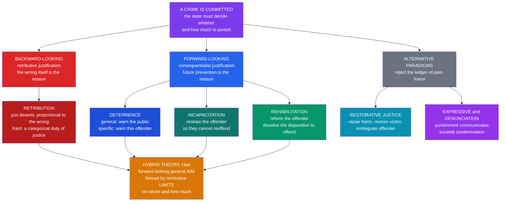

# ⚖️ Theories of Punishment

> [!abstract] TL;DR
> **Punishment** is the state's *deliberate* infliction of hard treatment — loss of liberty, property, or life — on a person for a wrong, imposed in the name of the whole community. Because inflicting suffering on purpose is normally the *paradigm* of wrongdoing, punishment demands a justification, and penology offers two rival families. **Backward-looking retributivism** justifies punishment by the past wrong alone: the offender *deserves* it, in proportion to culpability, whether or not any good comes of it (Kant's categorical view). **Forward-looking consequentialism** justifies punishment only by the future good it produces — **deterrence** (general and specific), **incapacitation** (restraining the dangerous), and **rehabilitation** (reforming the offender). Most real systems are **hybrid** (Hart: a *forward-looking general aim* fenced in by *backward-looking limits* on whom we may punish and how much). Around the edges sit **restorative justice** (repair the harm, not balance a ledger of pain) and **expressive/denunciatory** theories (punishment *communicates* condemnation). The economics of deterrence (Becker) supplies the sharpest empirical lesson: the **certainty** of punishment deters far more reliably than its **severity**.

## Intuition

**Analogy:** Two people can hand you the exact same **bill** for the exact same broken window, yet mean completely different things by it.

The first is a **creditor settling a debt**. You broke the window; you now *owe* its cost; the bill simply makes the books balance. It would be owed even if you will never go near a window again, even if collecting it helps no one — the point is that *you did it and must answer for it*. This is the **backward-looking** logic: punishment as a deserved response to a past wrong. Pay because of what you *did*.

The second is an **insurer pricing a risk**. She has no interest in your past window for its own sake; she is buying down *future* windows. The charge exists to make you (and everyone watching) more careful, to keep the reckless off the ladder, and maybe to send you to a safety course so you stop breaking things. Change the future and the bill changes — halve it if a cheaper deterrent works, waive it if you are already reformed. This is the **forward-looking** logic: punishment as a *tool* for producing good consequences. Pay because of what it will *prevent*.

Every debate in penology is a fight over which bill the state is really handing out — and whether it is even *entitled* to hand out either.

---

## How It Works

The organizing question is **not** "what should the penalty be?" but the prior, harder one: **what makes it permissible for the state to deliberately impose suffering at all?** Outside the courtroom, planning to cause a person pain, to cage them, or to kill them is the very definition of an atrocity. A theory of punishment is an argument for why the *same acts*, performed by the state after due process, are not merely permitted but sometimes obligatory.

### The two families of justification

1. **Retribution (backward-looking, deontological).** Punishment is justified because the offender *deserves* it — it is the fitting response to culpable wrongdoing, owed as a matter of **justice**, not utility. *Negative* retributivism sets a side-constraint (never punish the innocent, never more than deserved); *positive* retributivism makes desert a positive *reason* to punish. **Kant** takes the strongest line: punishment is a **categorical imperative**, owed even by "an island society about to dissolve" which must still execute its last murderer before disbanding, so that "blood-guilt does not cling to the people." Desert is capped by **proportionality** — the penalty must fit the gravity of the crime (an echo of *lex talionis*, "an eye for an eye," now read as *ordinal* proportionality rather than literal mirroring). This family is rooted in [[Deontology_and_Kantian_Ethics]].

2. **Deterrence (forward-looking, consequentialist).** Punishment is justified only by the crime it prevents through fear of the penalty. **General deterrence** aims at the *public* (make an example so others refrain); **specific (special) deterrence** aims at *this* offender (make the experience unpleasant enough that they do not reoffend). This is **Bentham's** felicific calculus applied to crime: the threatened pain must just exceed the expected pleasure of the offense — and no more, since surplus suffering is waste. Rooted in [[Consequentialism_and_Utilitarianism]].

3. **Incapacitation (forward-looking).** Forget persuasion; simply *restrain*. A person in prison cannot burgle houses on the outside. Deterrence works on the *will*; incapacitation works on the *capacity*. **Selective incapacitation** targets the small share of high-rate offenders — but collides with the **age–crime curve** (most offenders "age out," so long sentences increasingly cage people past their criminal peak) and with prediction error (locking up many to catch a few).

4. **Rehabilitation (forward-looking).** Change the *person* so the disposition to offend dissolves — through education, treatment, therapy, or job training. If it works, it is the only theory that reduces crime *and* improves the offender's life. Its credibility cratered after Martinson's 1974 "**nothing works**" survey, then partly recovered with the evidence-based **Risk–Need–Responsivity (RNR)** model and "**what works**" research.

### The mixed theory and the alternatives

**H. L. A. Hart** dissolved the false choice between families by asking *different questions of each*. The **General Justifying Aim** of the *institution* of punishment is forward-looking (crime reduction), but the **distribution** of punishment — *whom* we may punish and *how much* — is governed by backward-looking, retributive limits (only the guilty, only in proportion). Deterrence supplies the *point*; desert supplies the *limits*. This hybrid is the working philosophy of most modern sentencing codes.

Two paradigms sit outside the "how much pain?" frame entirely:

- **Restorative justice** reframes crime as a *rupture in relationships* rather than an offense against the state. Through **victim–offender mediation** and conferencing, it seeks to **repair harm**, restore the victim, and reintegrate the offender — replacing the ledger-of-pain with a ledger of *repair*.
- **Expressive / denunciation theory** (Feinberg, Durkheim) holds that punishment's essential function is **communicative**: it authoritatively *expresses society's condemnation* of the act, reaffirming the violated norm. Antony **Duff's** communicative theory goes further — punishment is a *moral dialogue* addressed to the offender, aiming at repentance and reconciliation.



---

## Key Concepts

### Secondary level

- **The four classic justifications.** *Retribution* (they deserve it), *deterrence* (scare others and them off), *incapacitation* (lock them away so they cannot do it again), *rehabilitation* (fix them). The first looks **backward** at the crime; the other three look **forward** at consequences.
- **General vs specific deterrence.** *General* aims at the watching public ("this could happen to you"); *specific* aims at the individual offender ("you would not want that again").
- **Proportionality.** The punishment must *fit* the crime — jaywalking is not a hanging offense. This is the intuitive limit shared by almost every theory.
- **Just deserts.** The idea that punishment is earned by the wrongdoing, deserved as a matter of fairness, independent of any useful result.

### Undergraduate level

- **Negative vs positive retributivism.** *Negative* retributivism is only a **constraint** — never punish the innocent, never beyond desert — and is compatible with a consequentialist reason to punish. *Positive* retributivism makes desert an affirmative *duty* to punish. Hart's mixed theory adopts the negative version.
- **Kant's categorical view.** Punishment is owed as a demand of justice, never as a *means* to social benefit — to punish someone merely to deter others treats them as a tool, violating the imperative to treat persons as ends (see [[Deontology_and_Kantian_Ethics]]). Hence the "last murderer on the dissolving island" must still be executed.
- **Bentham's utilitarian calculus.** Punishment is itself an evil (it produces pain) and is justified *only* to exclude some greater evil. It should be no greater than needed to outweigh the offense's profit — surplus severity is "mischief" (see [[Consequentialism_and_Utilitarianism]]).
- **Certainty vs severity.** The two dials of deterrence: the **probability** of being punished and the **magnitude** of the punishment. Beccaria's 1764 insight, now heavily confirmed: **certainty deters more than severity**.
- **Restorative justice.** A distinct paradigm — victim–offender mediation, family group conferencing, reparation — that treats crime as harm to be **repaired** rather than a debt of suffering to be paid.
- **Expressive/denunciation theory.** Punishment as the state's authoritative language of **condemnation**; the sentence *says* something about how gravely society weighs the wrong.

### Graduate level

- **Hart's General Justifying Aim vs distribution.** The decisive structural move: ask a *consequentialist* question of the institution ("why have punishment at all?") but *retributive* questions of its application ("who may be punished, and how much?"). This immunizes the theory against the standard objection that utilitarian deterrence licenses framing the innocent.
- **Marginal deterrence.** If robbery and murder carry the *same* penalty, a robber has no extra reason not to kill the witness. Penalties must be *graduated* so that escalating the crime escalates the expected cost — a structural argument for proportionality on *consequentialist* grounds.
- **The economics of crime (Becker, 1968).** The offender is a **rational actor** who commits a crime iff its **expected utility exceeds** the expected utility of legal alternatives: offend iff `g > p·f` (gain vs probability × severity). This yields the **certainty–severity trade-off** and the empirical primacy of certainty (see Python demo and [[Utility_Theory]]).
- **Why certainty beats severity, mechanistically.** (1) **Diminishing marginal disutility** of sentence length — the tenth year is felt as far less than ten times the first. (2) **Present bias / hyperbolic discounting** — a delayed sentence is steeply discounted, while the immediate risk of arrest is not. (3) **Risk attitudes** and the sheer *salience* of getting caught. Nagin's syntheses conclude the *police presence and probability of apprehension*, not sentence length, drive deterrence.
- **The death-penalty deterrence debate.** Ehrlich's 1975 econometric claim of a strong deterrent effect (each execution deters ~8 murders) was rebutted by the 1978 **National Research Council** panel and its 2012 successor, both concluding the evidence is too fragile to establish deterrence — shifting the debate onto **retributive and expressive** grounds and onto irreversibility/error.
- **Communicative theory (Duff).** Punishment as a *secular penance* — a two-way moral address that invites the offender's repentance and reintegration, blending retributive form with a rehabilitative and restorative telos.
- **Mass incarceration and its critiques.** The U.S. incarceration boom is widely read as *severity* (long sentences, three-strikes, truth-in-sentencing) chasing crime control the theory predicts it cannot deliver, at large social cost concentrated in poor and minority communities (see [[Crime_Criminology_and_Criminal_Justice]]). Abolitionist arguments push further, questioning whether the prison can be justified on *any* of the four theories.
- **Recidivism and "what works."** Post-"nothing works," the **RNR model** (match intensity to *risk*, target criminogenic *needs*, use *responsive* cognitive-behavioral methods) shows well-designed rehabilitation *does* cut reoffending — reviving rehabilitation on an evidence base rather than optimism.

---

## Python Demo

We implement **Becker's rational-offender model** and use it to reproduce the field's most robust empirical finding: **certainty of punishment deters far more than severity**, and raising severity alone shows **sharp diminishing returns**.

A risk-neutral offender commits a crime iff the **gain** `g` exceeds the **expected cost** `p·f` (probability of punishment times severity). Two well-documented behavioral facts make severity a weak lever: the *disutility of a sentence is concave in its length* (year 10 hurts far less than 10× year 1), and offenders *discount the delayed sentence* while feeling the *immediate* risk of arrest in full. We fold both into a **perceived deterrence cost** `p · f^gamma` with `gamma < 1`.

```python
# Becker's economic model of crime and deterrence.
# Question: to cut crime, should the state raise CERTAINTY (p) or SEVERITY (f)?
# numpy + matplotlib only.
import numpy as np
import matplotlib.pyplot as plt

# Rational offender: commit crime iff  gain g > expected cost.
#   p = probability of punishment (CERTAINTY),  f = punishment magnitude (SEVERITY)
# Risk-neutral baseline cost = p * f.  We add two behavioral facts that both
# weaken severity relative to certainty, folded into a felt cost:
#       cost(p, f) = p * f**gamma        gamma < 1  ->  severity has diminishing returns
gamma = 0.5                      # concavity of felt severity (strong diminishing returns)

fig, axes = plt.subplots(1, 2, figsize=(13, 5.5))

# ---- Panel 1: iso-deterrence curves --------------------------------------
# All (severity f, certainty p) pairs delivering the SAME expected cost.
f = np.linspace(0.3, 10, 400)                 # sentence length (years)
for c in [0.5, 1.0, 1.5, 2.0]:                # constant felt-cost levels
    p_needed = np.clip(c / (f ** gamma), 0, 1)  # p * f^gamma = c  ->  p = c / f^gamma
    axes[0].plot(f, p_needed, lw=2, label=f"expected cost = {c}")
axes[0].set_title("Iso-deterrence curves: trade certainty against severity")
axes[0].set_xlabel("Severity  f  (sentence length, years)")
axes[0].set_ylabel("Certainty  p  (probability of punishment)")
axes[0].set_ylim(0, 1)
axes[0].legend(fontsize=8)
axes[0].annotate("to hold deterrence fixed while halving p,\n"
                 "you must MORE than double f\n(diminishing returns to severity)",
                 xy=(8, 0.24), xytext=(2.8, 0.62), fontsize=8,
                 arrowprops=dict(arrowstyle="->"))

# ---- Panel 2: which lever actually deters more? --------------------------
# Potential offenders have gains g ~ Uniform(0, gmax); each offends iff g > cost.
# Crime rate = share of the population whose gain still exceeds the felt cost.
gmax = 3.0
def crime_rate(p, f):
    cost = np.clip(p, 0, 1) * (f ** gamma)
    return np.clip(1 - cost / gmax, 0, 1)

p0, f0 = 0.3, 3.0                              # common baseline
mult = np.linspace(1.0, 3.0, 200)             # push ONE lever up to 3x from baseline
axes[1].plot(mult, crime_rate(p0 * mult, f0), lw=2.6,
             label="raise CERTAINTY p (severity fixed)")
axes[1].plot(mult, crime_rate(p0, f0 * mult), lw=2.6, ls="--",
             label="raise SEVERITY f (certainty fixed)")
axes[1].set_title("Same proportional investment, unequal payoff")
axes[1].set_xlabel("Multiplier applied to one lever (from baseline)")
axes[1].set_ylabel("Crime rate  (share still offending)")
axes[1].legend(fontsize=8)

plt.tight_layout()
plt.savefig("becker_deterrence.png", dpi=120)
plt.show()

# --- Numeric comparison: double each lever from the same baseline ---------
base   = crime_rate(p0, f0)
c_cert = crime_rate(min(p0 * 2, 1), f0)        # double certainty
c_sev  = crime_rate(p0, f0 * 2)                # double severity
print(f"baseline crime rate            : {base:.3f}")
print(f"after DOUBLING certainty (p)    : {c_cert:.3f}   (drop {base - c_cert:.3f})")
print(f"after DOUBLING severity  (f)    : {c_sev:.3f}   (drop {base - c_sev:.3f})")
print(f"certainty is {(base - c_cert) / (base - c_sev):.1f}x more effective than severity")
```

Running it prints roughly:

```
baseline crime rate            : 0.827
after DOUBLING certainty (p)    : 0.654   (drop 0.173)
after DOUBLING severity  (f)    : 0.755   (drop 0.072)
certainty is 2.4x more effective than severity
```

**Reading the output.** The **iso-deterrence curves** are hyperbola-like: any target deterrence can be bought with *high-certainty/low-severity* or *low-certainty/high-severity* — but because felt severity grows only as `f^0.5`, the curve flattens hard, so cutting certainty in half demands *quadrupling* severity to compensate. Panel 2 makes the policy punchline concrete: the same *proportional* investment in **certainty** cuts crime about **2.4×** as much as investing in **severity**, and the severity curve visibly *flattens* (diminishing returns) while the certainty curve keeps falling. This is exactly the empirical pattern criminologists find — and the reason "tough on crime" *sentence inflation* buys so little deterrence compared to raising the *odds of being caught*.

---

## Real-World Applications

- **Three-strikes and truth-in-sentencing laws.** Pure **incapacitation + severity** logic: mandatory long terms for repeat offenders. Outcomes track the demo — modest deterrent gains, huge incarceration costs, and much of the sentence served *after* the offender's high-crime years (age–crime curve), i.e. incapacitating past the point of return.
- **Hot-spots and focused-deterrence policing.** Strategies like Boston's *Operation Ceasefire* raise the **certainty** of a response rather than the severity. Consistent with Becker/Nagin, they show real crime reductions — the empirically favored lever in action.
- **Drug courts and restorative conferencing.** Divert offenders into **rehabilitation** (treatment, supervision) or **restorative** processes (victim–offender mediation), lowering recidivism for suitable cases and repairing harm the adversarial trial ignores.
- **Norway's Halden prison and the Nordic model.** Institutionalized **rehabilitation**: normalized conditions, education, and reintegration, paired with recidivism rates far below punitive systems — a live test of the reform theory.
- **The Nuremberg trials.** Often defended in **expressive/denunciatory** terms as much as retributive — the trials existed to *authoritatively condemn* atrocity and inscribe a norm, not merely to deter or incapacitate.
- **Death-penalty jurisprudence.** With the deterrence evidence contested (NRC 2012), U.S. constitutional debate over the death penalty and "cruel and unusual punishment" turns on **retributive proportionality**, **expressive** meaning, and the **irreversibility** of error (see [[Rule_of_Law_and_Due_Process]], [[Rights_Duties_and_Legal_Concepts]]).

---

## Common Pitfalls

- **Confusing the *justification* of punishment with its *definition*.** Whether an act *is* punishment (hard treatment for a wrong, imposed by authority) is separate from whether it is *justified*. Many arguments quietly smuggle a justification into the definition ("punishment just *means* giving what is deserved").
- **Assuming deterrence works through severity.** The single most robust empirical error in "tough on crime" policy. The demo and the criminological consensus both say the effective margin is **certainty**, not sentence length — yet legislatures overwhelmingly adjust severity because it is cheap to enact.
- **Equating retribution with revenge.** Retribution is *principled, proportional, impersonal, and capped by desert*; revenge is *personal, unlimited, and satisfaction-seeking*. Collapsing the two is the standard caricature that makes retributivism sound barbaric.
- **Treating rehabilitation as refuted by "nothing works."** Martinson's 1974 survey was overread and partly recanted by its own author; the RNR and "what works" literature shows *well-targeted* programs reliably cut recidivism. "Nothing works" is a myth, not a finding.
- **Ignoring the age–crime curve in incapacitation.** Because criminal activity peaks in the late teens/early twenties and declines sharply, long sentences increasingly cage people *after* their offending years — spending incapacitation budget on the least dangerous period of the life course.
- **Letting deterrence license punishing the innocent.** A naive act-utilitarian deterrence theory implies it could be right to *frame* an innocent to reassure the public. The standard cure is **Hart's mixed theory**: retributive *distribution limits* forbid it even where the aim is consequentialist.
- **Assuming one theory must win.** Real sentencing is *pluralist* — a single sentence can simultaneously deter, incapacitate, denounce, and (aspire to) reform. The interesting question is how to *weigh and limit* the aims, not which to crown.

---

## Related Concepts

- [[Philosophy_of_Law_Jurisprudence]] — the parent field; whether the *authority* to punish flows from social source or from justice, and the Hart–Devlin dispute over the criminal law enforcing morality.
- [[Deontology_and_Kantian_Ethics]] — the moral engine of retributivism: desert, proportionality, and Kant's rule that persons must never be punished *merely* as a means to deter others.
- [[Consequentialism_and_Utilitarianism]] — the moral engine of deterrence, incapacitation, and rehabilitation: Bentham's calculus that punishment is justified only by the greater evil it prevents.
- [[Utility_Theory]] — the expected-utility machinery behind Becker's rational offender and the certainty–severity trade-off in the demo.
- [[Crime_Criminology_and_Criminal_Justice]] — the sociological complement: strain, labeling, and conflict theories of *why* crime happens, plus mass incarceration and racial-caste critiques of punishment.
- [[Law_Deviance_and_Social_Control]] — Durkheim's view of punishment as a ritual that reaffirms collective norms — the sociological root of the expressive/denunciation theory.
- [[Justice_and_Rawls]] — distributive-justice foundations for asking whether a penal system's *burdens* are fairly allocated across a society.
- [[The_State_and_Political_Authority]] — the prior question of what gives the state the standing to inflict hard treatment on its members at all.
- [[Nash_Equilibrium_Applications]] — strategic modeling of offender–enforcer interaction and the marginal-deterrence problem as a game.
- [[Rule_of_Law_and_Due_Process]] — the procedural limits (fair trial, no cruel and unusual punishment) that constrain *how* the state may punish.
- [[Rights_Duties_and_Legal_Concepts]] — the rights framework limiting *whom* and *how much* the state may punish, central to the death-penalty and proportionality debates.

---

## Review Questions

1. **(Conceptual)** Explain the difference between *backward-looking* and *forward-looking* justifications of punishment, and show why Kant's "last murderer on the dissolving island" is a decisive test case that a *pure deterrence* theory cannot pass and a *pure retributive* theory can. What does the example reveal about treating persons as means versus ends?
2. **(Scenario)** A legislature wants to cut burglary and is choosing between (a) doubling the average sentence and (b) doubling the number of patrol officers so more burglars are caught. Using Becker's model and the certainty-vs-severity finding from the Python demo, predict which policy deters more, explain *why* the severity lever shows diminishing returns, and identify one *non-deterrence* value (retributive, expressive, or fiscal) that might still favor the losing option.
3. **(Trade-off)** Hart's mixed theory uses a *consequentialist general aim* constrained by *retributive limits on distribution*. What problem of pure deterrence theory does this solve, what does it cost in theoretical tidiness, and how would a *restorative-justice* advocate argue that the whole "how much pain?" framing — shared by both families — asks the wrong question?

---

## Sources

- Hart, H. L. A. (1968). *Punishment and Responsibility: Essays in the Philosophy of Law*. Oxford University Press.
- Kant, Immanuel (1797). *The Metaphysics of Morals* (Doctrine of Right, on the right to punish).
- Becker, Gary S. (1968). "Crime and Punishment: An Economic Approach." *Journal of Political Economy*, 76(2), 169–217.
- Nagin, Daniel S. (2013). "Deterrence in the Twenty-First Century." *Crime and Justice*, 42(1), 199–263.
- Duff, R. A. (2001). *Punishment, Communication, and Community*. Oxford University Press.
- von Hirsch, Andrew (1976). *Doing Justice: The Choice of Punishments*. Hill and Wang.

---

#law #punishment #deterrence #retribution #penology
