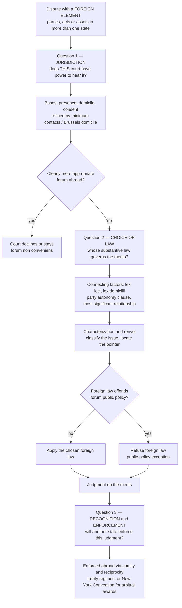

# 🌐 Conflict of Laws (Private International Law)

> [!abstract] TL;DR
> **Conflict of laws — also called private international law — is the branch of a *domestic* legal system that handles disputes with a foreign element**: a contract signed in France and performed in Japan between a US and a German company, a custody fight spanning two countries, a defamation posted from one state and read in another. It answers **three sequential questions**, and only these three. (1) **Jurisdiction** — does *this* court have the power to hear the case at all, and even if it does, should it decline in favour of a more appropriate forum abroad? (2) **Choice of law** — once seised, *whose* substantive law governs the merits: the forum's own, or a foreign law selected by a connecting factor or by the parties' own choice-of-law clause? (3) **Recognition and enforcement** — will a judgment won here actually be enforced against assets sitting in another country? Despite the name, it is **not** public international law: the actors are **private parties and domestic courts**, not states, and the "law" being applied is ordinary contract, tort, or family law — just chosen from a foreign menu. Because the *forum* and the *governing law* can each swing the outcome enormously, sophisticated parties fight over them **ex ante** — through choice-of-forum and choice-of-law clauses, and increasingly by contracting out of national courts entirely into **international arbitration**, whose awards travel the globe under the New York Convention.

---

## Intuition

**Analogy — the traffic controller at a border crossing where several countries' roads meet.**

Imagine a busy interchange where highways from France, Japan, the United States, and Germany all feed into the same junction. A single accident happens right in the middle. Before anyone can ask *who was at fault*, a more basic problem must be solved: **which country's traffic police even have authority to investigate, and once they do, whose road rules — French, Japanese, American, or German — decide who had right of way?** And after a ruling is issued, will the *other* countries honour the ticket, or can the driver simply cross back over the border and ignore it? Conflict of laws is the **traffic controller standing at that junction**. It does not itself decide who was negligent — that is ordinary tort law. It decides the three *meta*-questions that must be settled first: **which court, whose law, and whose enforcement.**

Two features of the analogy do the real work. First, the traffic controller belongs to **one specific country** — there is no world court directing traffic. Each nation has its *own* private-international-law rulebook, so the answer can differ depending on where you file. That asymmetry is exactly why a plaintiff **shops for a forum**: filing in the country whose controller sends you down the most favourable road. Second, the controller can wave a case *through* to another junction it thinks is better placed to handle it — the doctrine of **forum non conveniens** — or refuse to apply a foreign rule it finds repugnant to local values — the **public-policy exception**. Everything below is the elaboration of these two moves across the three questions.

---

## How It Works

### Core mechanics

Conflict of laws is triggered whenever a case has a **foreign element** — a party, an act, an asset, or an event connected to more than one legal system. A purely domestic dispute never engages it. Once triggered, a forum court walks through three questions **in strict order**; failing the first makes the others moot.

**Question 1 — Jurisdiction: does this court have the power to adjudicate?**

Personal (or *in personam*) jurisdiction is the court's authority over the *defendant*. The classic **bases** are:

- **Presence / service** — the defendant is physically served within the territory (the traditional common-law rule; in the US, refined into the constitutional **"minimum contacts"** test of *International Shoe*, so that a court may reach a non-resident who has purposefully directed activity into the forum).
- **Domicile / residence** — the defendant is domiciled in the forum (the primary rule across the EU under the **Brussels regime**, which makes the defendant's domicile the default forum).
- **Consent / submission** — the defendant agreed in advance (a **choice-of-forum / jurisdiction clause**) or appears and defends without objecting.

Even *with* jurisdiction, a common-law court may **decline** it under **forum non conveniens**: if a *clearly more appropriate* forum exists abroad — where the witnesses, evidence, and governing law sit — the court stays its own proceedings so the case is heard where it most naturally belongs. Civil-law systems, and the EU Brussels regime, largely reject this discretion in favour of rigid, predictable rules. The mirror image of all this is **forum shopping**: because different forums offer different procedures, damages, disclosure, and — crucially — different *choice-of-law* rules, a plaintiff rationally files where the expected outcome is best (the phenomenon the Python demo below quantifies).

**Question 2 — Choice of law: whose substantive law governs the merits?**

Having accepted the case, the court must pick the **applicable law**. It does so with **choice-of-law rules** that latch onto a **connecting factor** linking the dispute to a legal system:

- **Lex loci** — the law of the *place of the act*: *lex loci contractus* (place of contracting), *lex loci delicti* (place of the tort/wrong), *lex loci solutionis* (place of performance), *lex situs* (location of property).
- **Lex domicilii** / *lex patriae* — the law of a party's **domicile** or nationality, dominant in family and succession matters.
- **Party autonomy** — in contracts, the parties' **express choice-of-law clause** is generally honoured (codified in the EU's **Rome I Regulation** for contracts and **Rome II** for torts). This is the single most powerful lever in commercial practice.
- **The flexible modern approaches** — where no clause exists, systems increasingly reject mechanical *lex loci* in favour of the **"most significant relationship"** test (US *Second Restatement*) or the **"proper law"** / closest-connection standard: apply the law of the system with the densest real-world links.

Three doctrines complicate the choice. **Characterization** ("classification") asks *which category* the issue falls into — is a limitation period "procedural" (forum law) or "substantive" (the applicable law)? The pigeonhole chosen dictates the rule applied. **Renvoi** is the puzzle of whether "French law" means French *domestic* law or French law *including its own conflict rules* — which might point back to the forum or onward to a third country (an infinite-mirror problem most systems tame by convention). And the **public-policy exception** (*ordre public*) lets the forum **refuse** to apply an otherwise-applicable foreign law when doing so would offend its **fundamental values** — a court will not enforce a foreign rule upholding, say, slavery, a penal confiscation, or a discriminatory marriage bar, however validly it governs.

**Question 3 — Recognition and enforcement of foreign judgments.**

A judgment is only worth the assets it can reach. A plaintiff who wins in Country A but whose defendant's money sits in Country B must have the Country A judgment **recognised and enforced** by a Country B court. There is no automatic global enforcement; it rests on:

- **Comity** — the courtesy one nation extends to another's acts (the US framing since *Hilton v Guyot*).
- **Reciprocity** — many states enforce foreign judgments only from countries that would enforce theirs.
- **Conditions** — the rendering court must have had proper jurisdiction, the defendant must have had **due process** (notice and a fair hearing), the judgment must be final, and enforcement must not violate the enforcing forum's **public policy** or clash with a local judgment.

**Harmonization and the arbitration alternative.** Because divergent national rules breed uncertainty, states harmonize by treaty. The **Hague Conference on Private International Law** produces conventions (child abduction, choice-of-court, the 2019 Judgments Convention); the EU's **Brussels I (Recast)** and **Rome I/II** regimes create a near-uniform intra-EU system. But the most successful escape from the whole tangle is **international commercial arbitration**: parties agree to have private arbitrators, not national courts, decide the dispute — and the resulting **arbitral award** is enforceable in over 170 countries under the **New York Convention (1958)**, which offers *far* more reliable cross-border enforcement than court judgments enjoy. This is why party autonomy — choosing the forum, the law, *and* the dispute-resolution mechanism up front — dominates modern cross-border contracting.

**How this differs from public international law.** Public international law governs relations **between states** (treaties, the law of war, the UN, state responsibility). Conflict of laws is **private**: it operates *inside* a single country's courts, resolving disputes between **private parties**, applying **private** law (contract, tort, family, property). The word "international" describes the *facts*, not the *source* of the rules.

### Flow / architecture



---

## Key Concepts

### Secondary — the core idea

Sometimes a legal problem touches **more than one country** — a deal, a marriage, a car crash, an online post that crosses borders. Before a court can decide *who is right*, it has to answer three earlier questions: **Which country's court should hear this?** **Whose rules should it use to decide?** And **if I win here, will the other country make the loser pay?** The rules that answer those three questions are called **conflict of laws** (or **private international law**). It is *not* about wars or treaties between governments — that is a different subject. It is about ordinary people and companies whose ordinary disputes happen to spill across a national line.

### Undergraduate — the machinery

Learn the **three questions in order** and never merge them: **jurisdiction → choice of law → recognition/enforcement**. For jurisdiction, know the **bases of personal jurisdiction** — presence/service, domicile, consent — and their modern refinements (**minimum contacts** in the US; **domicile** as the default under the EU **Brussels** regime). Understand **forum non conveniens** (a common-law court declining in favour of a more suitable forum) and its opposite number, **forum shopping**. For choice of law, master the **connecting factors** — *lex loci* (contractus, delicti, solutionis, situs), *lex domicilii*, and above all **party autonomy** via choice-of-law clauses (**Rome I** for contracts, **Rome II** for torts) — plus the flexible **"most significant relationship"** / proper-law approach. Know the three complicating doctrines: **characterization** (which category the issue falls in — procedural vs substantive), **renvoi** (does "foreign law" include its conflicts rules?), and the **public-policy exception** (refusing repugnant foreign law). For enforcement, learn **comity**, **reciprocity**, and the **conditions** (proper jurisdiction, due process, finality, no public-policy breach). Finally, distinguish **conflict of laws from public international law**, and know why **international arbitration** plus the **New York Convention** is the commercial world's preferred escape hatch.

### Graduate — theory and contested edges

Interrogate the **methodological wars** in choice of law. The traditional **"jurisdiction-selecting"** approach (Beale's *First Restatement*: mechanically apply *lex loci* whatever the result) collapsed under the **American conflicts revolution** — Currie's **governmental-interest analysis** (ask which state has a real *interest* in applying its policy; distinguish "true" from "false" conflicts), Cavers' **principles of preference**, Leflar's **"better law"**, and the *Second Restatement*'s **"most significant relationship"** — a shift from *territorial certainty* to *result-oriented policy*, at the cost of predictability that the EU's rule-based **Rome/Brussels** codification deliberately restores. Probe the **incommensurability** problem: characterization and renvoi are not neutral mechanics but **outcome-determining choices** dressed as classification. Examine the frontier of **jurisdiction over the internet** — the *Zippo* sliding scale, *Calder* "effects" test, and the collapse of territorial connecting factors when a tort is committed "everywhere and nowhere" (defamation, data breaches, cybercrime). Consider the **public-policy exception** as the site where private international law meets **human rights** and **comparative constitutional values** — a forum refusing a foreign talaq divorce, a discriminatory succession rule, or a punitive-damages award. Finally, weigh the **privatization of dispute resolution**: mandatory arbitration and the New York Convention have built a *transnational commercial legal order* that partly **bypasses the state** — raising legitimacy questions about a system of justice negotiated ex ante by the powerful and enforced with fewer public-policy safeguards than national courts apply.

---

## Python Demo

```python
# Modelling FORUM SHOPPING: why a rational plaintiff (and therefore every
# well-advised party drafting a contract) cares intensely about WHICH court and
# WHOSE law decides a cross-border dispute.  numpy + matplotlib only.
#
# Setup: the SAME underlying claim can be filed in several possible forums.  Each
# forum differs along three axes that conflict-of-laws rules quietly control:
#   * AWARD  -- the damages a win yields, which depends on the *governing law*
#              (e.g. broad US damages incl. punitives vs. capped civil-law damages);
#   * p      -- the probability of success, driven by that forum's procedure,
#              disclosure, and burden of proof;
#   * COSTS  -- litigation cost AND the fee-shifting RULE the forum drags along:
#              "american" (each side bears its own costs, win or lose) vs.
#              "loser_pays" (English/German rule: the loser pays both sides).
#
# The rational plaintiff picks the forum with the highest EXPECTED NET VALUE.
# That single number is why choice-of-forum and choice-of-law clauses are fought
# over ex ante -- the defendant wants the forum that MINIMISES this same figure.

import numpy as np
import matplotlib.pyplot as plt

# ---- Candidate forums for one cross-border commercial claim (money units = USD) ----
forums = [
    dict(name="US Federal\n(New York)",     award=1_800_000, p=0.45,
         c_own=450_000, c_def=450_000, rule="american"),
    dict(name="English High\nCourt",         award=1_100_000, p=0.65,
         c_own=350_000, c_def=350_000, rule="loser_pays"),
    dict(name="German Regional\nCourt",       award=  700_000, p=0.60,
         c_own=120_000, c_def=120_000, rule="loser_pays"),
    dict(name="ICC Arbitration\n(NY Conv.)",  award=1_200_000, p=0.58,
         c_own=500_000, c_def=500_000, rule="american"),
]

def expected_components(award, p, c_own, c_def, rule):
    """Return (expected gross recovery, expected cost, expected NET value)."""
    gross = p * award                       # prob of winning times the damages won
    if rule == "american":
        cost = c_own                        # you pay your own costs whatever happens
    else:                                   # loser_pays: reimbursed if you win,
        cost = (1 - p) * (c_own + c_def)    # pay BOTH sides only if you lose
    return gross, cost, gross - cost

# ---- Evaluate every forum ----
names, gross_v, cost_v, net_v = [], [], [], []
print("EXPECTED NET VALUE OF SUING, BY FORUM")
print("=" * 68)
print(f"{'Forum':22}{'p':>5}{'award':>12}{'E[gross]':>12}{'E[cost]':>11}{'E[net]':>12}")
for f in forums:
    g, c, n = expected_components(f["award"], f["p"], f["c_own"], f["c_def"], f["rule"])
    names.append(f["name"].replace("\n", " "))
    gross_v.append(g); cost_v.append(c); net_v.append(n)
    print(f"{f['name'].replace(chr(10),' '):22}{f['p']:>5.2f}{f['award']:>12,.0f}"
          f"{g:>12,.0f}{c:>11,.0f}{n:>12,.0f}")

net_v = np.array(net_v)
best = int(np.argmax(net_v))
print("-" * 68)
print(f"Rational plaintiff files in:  {names[best]}  "
      f"(E[net] = {net_v[best]:,.0f})")
print("Note: the HIGH-award US forum is NOT the winner -- its low win probability")
print("and 'american' non-reimbursable costs sink its expected value.\n")

# ---- Panel 2 data: sensitivity of E[net] to a SHARED probability of success ----
# Hold each forum's award/costs/rule fixed but sweep a common p to show that the
# OPTIMAL forum flips as the merits strengthen -- i.e. the best forum is case-specific.
p_grid = np.linspace(0.0, 1.0, 400)
net_curves = []
for f in forums:
    if f["rule"] == "american":
        curve = p_grid * f["award"] - f["c_own"]
    else:
        curve = p_grid * f["award"] - (1 - p_grid) * (f["c_own"] + f["c_def"])
    net_curves.append(curve)
net_curves = np.array(net_curves)
best_by_p = np.argmax(net_curves, axis=0)   # index of optimal forum at each p

# ---- Plot ----
fig, (ax1, ax2) = plt.subplots(1, 2, figsize=(15, 6))
palette = ["#dc2626", "#2563eb", "#059669", "#7c3aed"]

# Panel 1: expected gross vs cost vs net, per forum
x = np.arange(len(forums)); w = 0.6
ax1.bar(x, gross_v, w, color="#93c5fd", edgecolor="black", label="E[gross recovery] = p x award")
ax1.bar(x, [-c for c in cost_v], w, color="#fca5a5", edgecolor="black", label="E[cost] (shown below zero)")
ax1.plot(x, net_v, "ko-", lw=2, ms=9, label="E[NET value]")
ax1.axhline(0, color="black", lw=0.8)
ax1.scatter([best], [net_v[best]], s=320, facecolors="none", edgecolors="gold", linewidths=3, zorder=5)
ax1.annotate("rational\nplaintiff's\nchoice", xy=(best, net_v[best]),
             xytext=(best - 0.15, net_v[best] + 300_000), fontsize=9, fontweight="bold",
             ha="center", arrowprops=dict(arrowstyle="->", lw=1.2))
ax1.set_xticks(x); ax1.set_xticklabels([f["name"] for f in forums], fontsize=8)
ax1.set_ylabel("Expected value (USD)")
ax1.set_title("Forum comparison: expected net value of the same claim")
ax1.legend(fontsize=8, loc="upper right")
ax1.yaxis.set_major_formatter(plt.FuncFormatter(lambda v, _: f"{v/1e6:.1f}M"))

# Panel 2: which forum wins as the shared probability of success rises
for i, f in enumerate(forums):
    ax2.plot(p_grid, net_curves[i] / 1e6, color=palette[i], lw=2,
             label=f["name"].replace("\n", " "))
ax2.axhline(0, color="black", lw=0.8)
# shade the region below by the identity of the optimal forum
for i in range(len(forums)):
    ax2.fill_between(p_grid, -1.0, 2.0, where=(best_by_p == i),
                     color=palette[i], alpha=0.06)
ax2.set_xlabel("Probability of success (shared across forums)")
ax2.set_ylabel("Expected net value (USD millions)")
ax2.set_title("The optimal forum FLIPS with the merits\n(loser-pays forums dominate when p is high)")
ax2.set_ylim(-1.0, 1.2)
ax2.legend(fontsize=8, loc="upper left")

fig.tight_layout()
plt.savefig("conflict_of_laws_forum_shopping.png", dpi=120)
print("Saved figure -> conflict_of_laws_forum_shopping.png")
plt.show()
```

**What the demo shows.** The expected net value of suing is `E[net] = p * award - E[cost]`, and the *forum* silently sets all three inputs. Panel 1 makes the counter-intuitive point vivid: the **US forum offers the biggest headline award** (1.8M, reflecting broad damages under US law), yet it is **not** the rational choice — its lower win probability and non-reimbursable "American rule" costs drag its *expected* value below the **English** forum, where a high success probability combines with the **loser-pays** rule to shrink expected costs (you only bear costs in the minority of worlds where you lose). Panel 2 drives home *why forum choice is case-specific*: as the shared probability of success rises, the **optimal forum switches** — loser-pays forums (English, German) become dominant precisely because their downside cost is discounted by the small `(1 - p)` chance of losing, while at low probabilities the American-rule forums that never expose you to the *opponent's* costs look safer. There is no universally "best" court — which is exactly why the plaintiff shops, the defendant resists, and both negotiate **choice-of-forum and choice-of-law clauses ex ante**, before anyone knows how the merits will fall.

---

## Real-World Applications

- **Cross-border commercial contracts.** Virtually every international supply, financing, or M&A agreement contains a **governing-law clause** (frequently English or New York law) *and* a **jurisdiction or arbitration clause**. Parties choose English or New York law for the depth and predictability of their commercial case law — a direct application of **party autonomy** under [[Contract_Law]] and the machinery of [[Commercial_and_Corporate_Law]].
- **International commercial arbitration.** When parties distrust each other's national courts, they arbitrate. The **New York Convention (1958)** makes the resulting award enforceable in 170+ states — a far more reliable route than enforcing a court judgment — which is why arbitration is the default for large cross-border deals and investment disputes.
- **International family law.** Divorce, spousal support, and above all **child custody and abduction** are riddled with conflicts issues: which country's court decides, and whose law? The **Hague Child Abduction Convention (1980)** creates a fast-track return mechanism precisely because *lex domicilii* and jurisdiction fights over children are so damaging — a core theme of [[Family_Law]].
- **Cross-border e-commerce and consumer protection.** When a consumer in one country buys from a seller in another, choice-of-law rules (e.g. EU **Rome I** protections for consumers) decide whether the buyer keeps the protection of *their* home law despite a clause pointing elsewhere — limiting party autonomy to shield the weaker party.
- **Cybercrime and online torts.** Defamation, data breaches, and cyber-fraud are committed "everywhere and nowhere." Courts stretch **effects-based** and **targeting** tests (US *Calder*/*Zippo*, EU *eDate*) to locate jurisdiction when the traditional *lex loci delicti* dissolves — the jurisdictional frontier that a future *Cybercrime and Digital Law* note will develop.
- **Enforcement against foreign assets.** A creditor with a UK judgment chasing a debtor's assets in Dubai, New York, or Singapore lives or dies by **recognition and enforcement** rules — comity, reciprocity, and treaty regimes — the third question in action.

---

## Common Pitfalls

- **Confusing conflict of laws with public international law.** They share the word "international" and nothing else. Conflict of laws is **domestic** law about **private** disputes with a foreign element; public international law governs **states**. Mixing them is the single most common conceptual error.
- **Collapsing the three questions.** Jurisdiction, choice of law, and enforcement are **distinct and sequential**. A court can have jurisdiction yet apply *foreign* law; it can apply its *own* law yet find its judgment **unenforceable** abroad. Never assume "the court that hears it applies its own law."
- **Assuming the forum always applies its own law.** *Forum* and *governing law* are decoupled. An English court routinely decides a case under German or New York law; the *lex fori* governs only **procedure**, not the merits.
- **Ignoring characterization.** How you *classify* an issue (procedural vs substantive, contract vs tort, succession vs matrimonial property) silently selects the choice-of-law rule and can flip the outcome — the least visible, most decisive step.
- **Over-reading party autonomy.** A choice-of-law clause is powerful but **not absolute**: mandatory rules (consumer, employment, competition) and the **public-policy exception** override it, and a clause chosen to evade a mandatory protection may be struck down.
- **Treating a home-country judgment as globally binding.** A judgment is only worth the **enforcement** it can obtain where the assets sit. Winning at home means little if the defendant's money is in a jurisdiction that refuses recognition for lack of reciprocity or due process.
- **Forgetting the public-policy escape hatch.** Even a validly applicable foreign law (or foreign judgment) can be **refused** if it offends the forum's fundamental values — a discretionary safety valve litigants underestimate, especially around punitive damages, discriminatory rules, or penal confiscations.

---

## Related Concepts

- [[Contract_Law]] — the engine room of party autonomy: **choice-of-law** and **choice-of-forum clauses** live inside contracts, and cross-border contract disputes are the commonest trigger of conflict-of-laws analysis.
- [[Commercial_and_Corporate_Law]] — cross-border M&A, financing, and corporate disputes turn on which law governs the deal and which forum (or arbitral tribunal) resolves it; conflicts rules underpin the enforceability of the whole structure.
- [[Family_Law]] — international divorce and **child custody/abduction** are among the hardest conflict-of-laws problems, resolved through *lex domicilii*, jurisdiction rules, and the Hague Conventions.
- [[Common_Law_vs_Civil_Law]] — the two traditions diverge sharply here: common-law systems embrace **forum non conveniens** and flexible "most significant relationship" tests, while civil-law and EU systems prefer **rigid, predictable** jurisdiction and choice-of-law codes (Brussels/Rome).
- [[Rule_of_Law_and_Due_Process]] — a foreign judgment is refused recognition if the losing party lacked **notice and a fair hearing**; due process is a hard precondition of cross-border enforcement.
- [[Judicial_Review_and_the_Courts]] — the institutional backdrop: which courts have competence, how they decline or accept jurisdiction, and how their judgments are reviewed and enforced.

> *Forthcoming sibling notes to cross-link once created: **Public_International_Law** (the state-to-state counterpart — treaties, the law of nations, and how it contrasts with this private field) and **Cybercrime_and_Digital_Law** (jurisdiction over borderless online wrongs, where the connecting factors of conflict of laws are under the most strain).*

---

## Review Questions

1. **(Recall / conceptual)** State the **three questions** conflict of laws answers, in order, and explain why they must be kept separate. Using one sentence each, distinguish (a) *jurisdiction* from *choice of law*, and (b) *conflict of laws* from *public international law*.
2. **(Applied / scenario)** A Delaware company and a Japanese supplier sign a contract *in Singapore* for goods to be delivered *in Germany*. There is no choice-of-law or jurisdiction clause. A dispute arises. Walk through how a court would tackle **jurisdiction** (which bases might reach the Japanese defendant? could *forum non conveniens* apply?) and **choice of law** (which connecting factors compete — *lex loci contractus*, *lex loci solutionis*, most significant relationship?). Then explain what changes if the parties had instead written "*This contract is governed by English law; disputes to be settled by ICC arbitration in London.*"
3. **(Trade-off / critical)** The EU's **Rome/Brussels** regime pursues *rigid predictability* (fixed domicile-based jurisdiction, mechanical choice-of-law rules, no forum non conveniens), while the US **conflicts revolution** embraced *flexible, interest-based* analysis. Argue for one approach over the other for **cross-border commercial disputes**, then identify where your preferred system fails — and explain why **international arbitration under the New York Convention** has become the parties' way of opting out of *both*.

---

## Sources

- Cheshire, North & Fawcett, *Private International Law*, 15th ed. (Oxford University Press, 2017) — the standard English treatise on jurisdiction, choice of law, and enforcement.
- Symeonides, S. C. *Choice of Law* (Oxford University Press, 2016) — a leading modern account of the American conflicts revolution and comparative methodology.
- Currie, B. (1963). *Selected Essays on the Conflict of Laws* (Duke University Press) — the foundational statement of **governmental-interest analysis**.
- Hague Conference on Private International Law, [official conventions and instruments](https://www.hcch.net/en/instruments/conventions) — including the Child Abduction, Choice of Court, and 2019 Judgments Conventions.
- UNCITRAL, [Convention on the Recognition and Enforcement of Foreign Arbitral Awards (New York, 1958)](https://uncitral.un.org/en/texts/arbitration/conventions/foreign_arbitral_awards) — the treaty underpinning global enforcement of arbitral awards.

---

#law #conflict-of-laws #private-international-law #jurisdiction #choice-of-law
