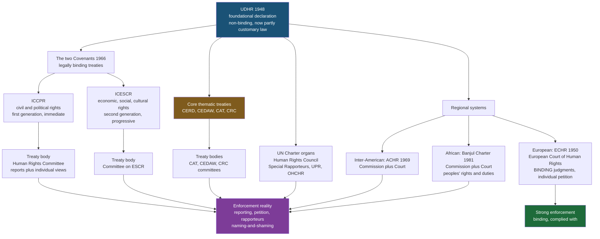

# ⚖️ Human Rights Law

> [!abstract] TL;DR
> **International human rights law (IHRL)** is the body of law asserting that every person holds certain fundamental rights and freedoms *simply by being human* — rights that no state grants and none may legitimately extinguish — and that binds states, primarily, to respect, protect, and fulfil them. It was built after 1945 in reaction to the Holocaust and the Nuremberg trials, crystallised in the **Universal Declaration of Human Rights (UDHR, 1948)**, and hardened into treaty law through the **International Bill of Rights** — the UDHR plus the **ICCPR** (civil and political rights) and the **ICESCR** (economic, social and cultural rights, 1966) — supplemented by core thematic treaties (against torture, racial discrimination, discrimination against women, and for the rights of the child) and three **regional systems** (European, Inter-American, African). Its deepest problem is *enforcement*: with no world police, it relies on **treaty bodies, special rapporteurs, individual petition, and above all "naming-and-shaming,"** whose slow, uneven bite is captured by the **spiral model** of how outside pressure and domestic mobilisation push a repressive state up a curve toward compliance.

---

## Intuition

**Analogy — the ticket you were born holding.** Imagine everyone is born already clutching a small, non-transferable ticket. Printed on it is a short list: *you may not be tortured, enslaved, or killed at a ruler's whim; you may speak, worship, and gather; you are owed a fair hearing before you are punished.* You did not earn this ticket, you cannot sell it, and — crucially — **the government did not issue it and cannot take it back.** A tyrant can *ignore* your ticket, but that does not make it invalid; it makes the tyrant a violator. Human rights law is the collective attempt to write that ticket down, get every government to sign a promise to honour it, and build machinery — courts, committees, inspectors, public shaming — to make ignoring it *costly*.

The move that makes rights *human* rather than merely *legal* is this: their authority is claimed to come **from your humanity, not from any statute**. A domestic bill of rights ([[Rights_and_Civil_Liberties]]) protects you *because your constitution says so*; strip out the clause and the protection is gone. A *human* right claims to survive even a state that never wrote it down or actively denies it — which is exactly why it needed an *international* order to give it teeth, and why that order is perpetually strained by the fact that the very states it polices are also its only enforcers.

---

## How It Works

### Philosophical foundation: where the ticket's authority comes from

Human rights inherit the **natural-rights** tradition — the idea, running from the Stoics through Aquinas, Grotius, and Locke, that some entitlements are prior to and independent of positive law (see [[Liberty_and_Rights]] and [[Philosophy_of_Law_Jurisprudence]]). The modern justificatory keyword, chosen precisely because it is thinner and more cross-cultural than "God" or "nature," is **human dignity**: the UDHR opens by recognising "the inherent dignity... of all members of the human family." Analytically, most human rights are **claim-rights** correlating to state **duties**, and the classic civil-political ones operate as **immunities** disabling the state from certain acts (see the Hohfeldian vocabulary in [[Rights_Duties_and_Legal_Concepts]]).

The great meta-debate is **universalism vs cultural relativism**: are these "universal" rights in fact a *Western liberal* export, individualist and blind to communitarian, religious, or postcolonial values? Defenders answer that (a) the drafting committee was globally diverse (Chang from China, Malik from Lebanon, with input reaching Confucian and Islamic thought), (b) universality is a claim about *moral status*, not cultural uniformity, and (c) the sharpest relativist arguments are often made *by governments* to excuse abuse. The **"Asian values"** debate of the 1990s and the 1993 **Vienna Declaration** ("all human rights are universal, indivisible and interdependent") are the canonical flashpoints.

### Historical development

1. **Pre-1945 — thin and internal.** Before WWII, how a state treated *its own* nationals was largely a matter of sovereign domestic jurisdiction; international law policed only how states treated *foreigners* and, partially, slavery and labour.
2. **The rupture — Holocaust and Nuremberg (1945–46).** The industrial murder of a state's own citizens, all "lawful" under domestic Nazi law, shattered the idea that sovereignty is a shield. The **Nuremberg trials** established that individuals bear responsibility for **crimes against humanity** even when obeying domestic law — the hinge between human rights law and international *criminal* law.
3. **The UDHR (1948).** Adopted by the UN General Assembly (48 in favour, 0 against, 8 abstentions). A **declaration, not a treaty** — non-binding as such — but it became the foundational text, arguably now partly **customary international law**, from which everything else descends.
4. **Treaty-fication (1966 onward).** The UDHR's single list was split into two binding covenants, then supplemented by nine core thematic treaties.

### The International Bill of Rights and the "two generations"

The **International Bill of Rights** = **UDHR + ICCPR + ICESCR**. The Cold War split the single declaration into two covenants:

- **ICCPR** — **civil and political rights** (life, liberty, fair trial, free speech, assembly, religion, non-discrimination, the vote). Framed largely as *negative* duties of restraint; conceived as **immediately binding** and **justiciable**.
- **ICESCR** — **economic, social and cultural rights** (work, health, education, housing, an adequate standard of living). Framed as requiring **"progressive realisation" to the maximum of available resources**, historically dismissed as aspirational and **non-justiciable**.

The **justiciability debate** is central: are the two generations *equal*? The Western/liberal camp long treated ICCPR rights as real, enforceable law and ICESCR rights as mere policy goals; the Global South and socialist bloc insisted they are **indivisible and interdependent** (the Vienna position). Modern practice has narrowed the gap — the 2008 **Optional Protocol to ICESCR** created an individual complaints mechanism, and courts (notably South Africa's in *Grootboom*) have shown socioeconomic rights *can* be adjudicated via reasonableness review.

Rights are often taxonomised into **"generations"** (Karel Vasak): **first** = civil-political (ICCPR), **second** = economic-social-cultural (ICESCR), **third** = **collective / solidarity rights** (self-determination, development, a healthy environment, peace) — the last being the most contested because their *holder* is a people, not an individual, and their *duty-bearer* is diffuse.

### The core thematic treaties

Beyond the two Covenants, nine core treaties target specific wrongs or groups. The key four to know:

| Treaty | Target | Notable feature |
|---|---|---|
| **CERD (1965)** | Racial discrimination | Earliest core treaty; broad definition of discrimination |
| **CEDAW (1979)** | Discrimination against women | Reaches the *private* sphere; the most *reserved-against* treaty |
| **CAT (1984)** | Torture | Absolute, non-derogable ban; grounds **universal jurisdiction** |
| **CRC (1989)** | Rights of the child | Most widely ratified treaty in history; "best interests of the child" |

### Regional systems — where enforcement actually bites

- **European (the strong one).** The **European Convention on Human Rights (ECHR, 1950)** created the **European Court of Human Rights (Strasbourg)**, whose judgments are **legally binding** on 46 Council of Europe states, reachable by **individual petition**, and generally *complied with*. It is by far the most effective human rights court in the world.
- **Inter-American.** The **American Convention (1969)**, the **Commission**, and the **Inter-American Court** — powerful jurisprudence on enforced disappearances and amnesty laws, but weaker compliance and the US is not a party.
- **African.** The **African Charter on Human and Peoples' Rights (Banjul Charter, 1981)** with its **Commission** and (since 2004) **Court** — distinctive for including **peoples' rights and duties** alongside individual rights.

### Enforcement mechanisms and their weakness

Because there is no world government, IHRL enforcement is structurally soft:

- **State reporting** — states periodically report to a **treaty body** (e.g. the **Human Rights Committee** for the ICCPR), which issues **concluding observations**. No sanction beyond publicity.
- **Individual communications / petition** — where a state accepts it (often via an optional protocol), individuals can complain to a treaty body, whose "views" are authoritative but **not judicially binding**.
- **UN Charter organs** — the **Human Rights Council**, its **Special Rapporteurs** (independent experts on themes or countries), and the **Universal Periodic Review (UPR)** peer-review of every state.
- **Naming-and-shaming** — the real currency. Reports by treaty bodies, rapporteurs, and NGOs (Amnesty International, Human Rights Watch) impose *reputational* and diplomatic costs.

The **spiral model** (Risse, Ropp & Sikkink, *The Power of Human Rights*, 1999) theorises how this soft power works over time: a repressive state moves through phases — **repression → denial → tactical concessions → prescriptive status → rule-consistent behaviour** — driven by a "boomerang" of *transnational advocacy networks* pressuring from outside while *domestic activists* mobilise from within. Progress often **stalls at "tactical concessions,"** where a regime makes cosmetic reforms to relieve pressure without genuine change.

### Derogations, the margin of appreciation, and business

- **Derogation.** In a genuine emergency "threatening the life of the nation," states may temporarily suspend *some* rights (**ICCPR Art. 4**, **ECHR Art. 15**) — but only to the extent *strictly required*, and **never** the non-derogable core (torture, slavery, life, retroactive punishment). See the derogation discussion in [[Rights_and_Civil_Liberties]].
- **Margin of appreciation.** The ECtHR grants states a **margin of appreciation** — a zone of deference on morally contested questions (public morals, religion) where local authorities are better placed to judge. It is the doctrine that keeps a supranational court politically survivable, and the one critics say lets it duck hard cases.
- **Business and human rights.** IHRL classically binds *states*, not companies. The **UN Guiding Principles on Business and Human Rights (2011, "Ruggie Principles")** created a "protect, respect, remedy" framework extending *responsibilities* (not yet hard duties) to corporations — the frontier of the field.

### Flow / Architecture — the international human rights order



---

## Key Concepts

### Secondary Level

**What "human rights" means.** A **human right** is a right you hold *because you are a person*, not because a particular government chose to grant it. That is the whole difference from ordinary legal rights: a government can *deny* a human right, but on this theory it cannot *destroy* it — denial makes the state a *violator*, not the right void.

**The one document to know — the UDHR (1948).** The **Universal Declaration of Human Rights** is the thirty-article founding text, adopted by the UN in the shadow of the Holocaust. It is a **declaration, not a treaty**, so it was not directly binding — yet it became the moral and legal seed of the entire modern system.

**Why it exists — post-war reaction.** Before WWII, most law assumed a government could treat its *own* citizens however it liked ("sovereignty"). The **Holocaust**, prosecuted at the **Nuremberg trials** as **crimes against humanity**, destroyed that assumption: some acts are wrong *no matter what a state's own law says*.

**The two big treaties.** The declaration's list was made binding in **two covenants**: the **ICCPR** (civil and political rights — free speech, fair trial, the vote) and the **ICESCR** (economic and social rights — health, education, work). Together with the UDHR these three are the **International Bill of Rights**.

**How it is (weakly) enforced.** There is no world police. States promise to obey, then **report** to committees, individuals can sometimes **complain**, and violators are **"named and shamed"** in public reports. The strongest exception is **Europe**, whose **European Court of Human Rights** issues *binding* judgments people can actually win.

### Undergraduate Level

**The two "generations" and the justiciability fight.** *First-generation* (ICCPR, civil-political) rights are mostly **negative duties** — the state must *refrain* (do not torture, do not censor) — and were treated as **immediately binding and court-enforceable**. *Second-generation* (ICESCR, socioeconomic) rights impose **positive duties** to *provide* (health, housing) and are framed as **"progressively realised" to the maximum of available resources** — long dismissed as non-justiciable aspiration. The counter-claim, enshrined in the 1993 **Vienna Declaration**, is that all rights are **"indivisible and interdependent."** The 2008 Optional Protocol to ICESCR and cases like South Africa's *Grootboom* show socioeconomic rights *can* be adjudicated. A *third generation* of **collective/solidarity rights** (self-determination, development, environment) is contested because its holder is a *people* and its duty-bearer is diffuse.

**The core treaties — the "big four" thematic instruments.** Beyond the covenants: **CERD** (racial discrimination, 1965), **CEDAW** (discrimination against women, 1979 — reaches the *private* sphere and is the most reserved-against treaty), **CAT** (torture, 1984 — an *absolute*, non-derogable ban that grounds **universal jurisdiction**), and **CRC** (rights of the child, 1989 — the most widely ratified treaty in history).

**Regional systems, ranked by bite.** **Europe** (ECHR + Strasbourg Court) is the gold standard — *binding* judgments, *individual petition*, high compliance. The **Inter-American** system has bold jurisprudence (disappearances, striking down amnesty laws) but patchier compliance. The **African** (Banjul) system is distinctive for its **peoples' rights and duties** but institutionally weaker.

**Enforcement toolkit.** **Treaty bodies** review state reports and (where accepted) hear **individual petitions**; the **Human Rights Council**, its **Special Rapporteurs**, and the **Universal Periodic Review** operate at the UN-Charter level; the **OHCHR** is the secretariat. None commands an army — the sanction is publicity, diplomacy, and shame.

**Derogation and the margin of appreciation.** States may **derogate** (suspend qualified rights) in a genuine emergency under ICCPR Art. 4 / ECHR Art. 15, but only *strictly as required* and never the non-derogable core. The ECtHR's **margin of appreciation** gives states deference on morally contested matters — the safety-valve that lets a supranational court coexist with national sovereignty.

### Graduate Level

**The universalism–relativism problem, seriously.** The relativist charge is that "universal" rights encode a *specific* liberal-individualist anthropology — autonomous, rights-bearing, adversarial toward the state — that is parochially Western and, worse, a vehicle of neo-colonial moralising. Sophisticated replies: (1) *genetic* diversity of the drafters does not settle *validity*, but it undercuts the "purely Western" origin story; (2) a **thin-universalism / thick-particularism** move (Michael Walzer) accepts a minimal universal core (no torture, no genocide) while leaving thick cultural elaboration local; (3) Amartya Sen and others argue liberty and public reasoning are *not* uniquely Western, and that "Asian values" rhetoric served *authoritarian* incumbents. The unresolved residue is that the *content* at the margins (family, gender, blasphemy, property) genuinely varies, and the **margin of appreciation** is the doctrinal admission of this.

**Are ESC rights *really* justiciable?** The objection is institutional, not conceptual: adjudicating "the right to health" requires courts to make **polycentric, resource-allocative** choices better suited to legislatures, risking judicial overreach and unfunded mandates. The reasonableness-review answer (Grootboom, the Optional Protocol) lets courts police whether the state's *programme* is arbitrary or excludes the desperate, without the court itself setting the budget — a "weak-form" review that preserves separation of powers while giving second-generation rights a legal remedy.

**The compliance puzzle and the spiral model.** *Why* do sovereign states ever comply with rules they can violate with impunity? Realists say they do not, meaningfully; the **spiral model** (Risse/Ropp/Sikkink) offers a constructivist mechanism: transnational advocacy networks create a **"boomerang"** — repressed domestic groups bypass their own blocked state to mobilise foreign allies, who pressure the target from above while activists pressure from below. States pass through *repression → denial → tactical concessions → prescriptive status → rule-consistent behaviour*, but frequently **stall at tactical concessions**, making cosmetic reforms to bleed off pressure. Empirical quantitative work (Hafner-Burton, Hathaway) complicates this: ratifying treaties sometimes correlates with *no improvement or even backsliding*, because ratification can substitute for reform ("radical decoupling"). This is the field's central honesty problem — measured effects are real but modest and conditional.

**Relationship to sibling regimes.** IHRL is distinct from but overlapping with **international humanitarian law (IHL / the law of armed conflict, the Geneva Conventions)**: IHL is *lex specialis* in war and tolerates killing combatants, whereas IHRL applies *in peace and (residually) in war* and centres the individual against the state. Both feed **international criminal law** (Nuremberg → the ICC), which converts the worst violations — genocide, crimes against humanity, war crimes — into *individual* criminal liability. And IHRL is the international mirror of domestic **constitutional rights** ([[Rights_and_Civil_Liberties]]): the same substantive freedoms, but enforced against the state *from outside* rather than by its own courts.

**Reservations, RUDs, and the fragmentation risk.** States routinely ratify with **reservations** that gut key obligations (the US's non-self-executing declaration on the ICCPR; wide reservations to CEDAW citing religious law). This produces a patchwork where formal ratification overstates real commitment — and the **Vienna Convention** rule that a reservation must not defeat a treaty's "object and purpose" is weakly policed.

---

## Python Demo

```python
# Two quantitative windows onto human rights law, numpy + matplotlib only:
#   PART 1 -- a small HUMAN-RIGHTS INDEX. Score hypothetical states on four
#             dimensions (physical integrity, civil liberties, political
#             participation, socioeconomic rights), weight, aggregate, rank.
#   PART 2 -- the SPIRAL MODEL (Risse/Ropp/Sikkink): model how international
#             naming-and-shaming PLUS domestic mobilization push a repressive
#             state up an S-curve of compliance -- and where it STALLS.
import numpy as np
import matplotlib.pyplot as plt

# ===========================================================================
# PART 1 -- a small human-rights index
# ===========================================================================
dimensions = ["Physical\nintegrity", "Civil\nliberties",
              "Political\nparticipation", "Socioeconomic\nrights"]
states = ["Arcadia", "Borduria", "Carpathia", "Drakonia", "Elbonia"]

# rows = states, cols = the four dimensions, scored 0 (worst) .. 10 (best)
scores = np.array([
    [9.2, 9.0, 9.4, 8.1],   # Arcadia   -- consolidated liberal democracy
    [7.2, 6.5, 6.8, 8.0],   # Borduria  -- flawed democracy, strong welfare
    [4.5, 4.0, 3.5, 5.5],   # Carpathia -- reforming hybrid regime
    [1.5, 1.2, 0.8, 3.0],   # Drakonia  -- closed authoritarian state
    [5.5, 7.0, 6.2, 2.5],   # Elbonia   -- open civil sphere, weak social rights
])

# Physical integrity weighted highest: torture / right to life are the
# non-derogable core that can never be balanced away.
weights = np.array([0.35, 0.25, 0.20, 0.20])
composite = scores @ weights                      # weighted 0..10 index
order = np.argsort(composite)[::-1]               # best first

print("HUMAN-RIGHTS INDEX  (0 = worst, 10 = best)")
print("=" * 60)
print(f"weights: {dict(zip([d.replace(chr(10),' ') for d in dimensions], weights))}")
print("-" * 60)
for rank, i in enumerate(order, 1):
    print(f"{rank}. {states[i]:<10} composite = {composite[i]:5.2f}   "
          f"weakest dim: {dimensions[np.argmin(scores[i])].replace(chr(10),' ')}")

# ===========================================================================
# PART 2 -- the spiral model / naming-and-shaming S-curve
# ===========================================================================
years = np.arange(0, 31)

def spiral(ceiling, k, t0):
    """Logistic S-curve of compliance rising toward a ceiling.
    ceiling = how far reform ultimately goes (the stall point);
    k       = steepness (pressure x mobilization intensity);
    t0      = the tipping year when concessions accelerate."""
    return ceiling / (1.0 + np.exp(-k * (years - t0)))

# (A) strong external pressure + strong domestic mobilization -> full spiral
full = spiral(ceiling=9.3, k=0.40, t0=12)
# (B) pressure but WEAK domestic mobilization -> stalls at tactical concessions
stall = spiral(ceiling=4.6, k=0.55, t0=8)
# (C) repression, isolated from transnational networks -> stays low
repress = spiral(ceiling=1.6, k=0.30, t0=15) + 0.6

print("\nSPIRAL MODEL end-state compliance (year 30, 0..10):")
for name, traj in [("Full spiral", full), ("Tactical-concessions stall", stall),
                   ("Sustained repression", repress)]:
    print(f"  {name:<28} {traj[-1]:4.1f}")

# ===========================================================================
# PLOTTING
# ===========================================================================
fig, (ax1, ax2, ax3) = plt.subplots(1, 3, figsize=(17, 5.2))

# ---- Panel 1: heatmap of states x dimensions -------------------------------
im = ax1.imshow(scores, cmap="RdYlGn", vmin=0, vmax=10, aspect="auto")
ax1.set_xticks(range(len(dimensions))); ax1.set_xticklabels(dimensions, fontsize=8)
ax1.set_yticks(range(len(states)));     ax1.set_yticklabels(states, fontsize=9)
for i in range(len(states)):
    for j in range(len(dimensions)):
        ax1.text(j, i, f"{scores[i,j]:.1f}", ha="center", va="center",
                 fontsize=9, color="black")
ax1.set_title("Human-rights index: scores by dimension", fontsize=11, fontweight="bold")
fig.colorbar(im, ax=ax1, fraction=0.046, pad=0.04, label="score 0..10")

# ---- Panel 2: composite ranking -------------------------------------------
xs = np.arange(len(states))
bar_c = ["#1e6b3a" if composite[i] >= 6 else "#c9a227" if composite[i] >= 3.5
         else "#b31d1d" for i in range(len(states))]
ax2.bar(xs, composite, color=bar_c, edgecolor="black")
for x, c in zip(xs, composite):
    ax2.text(x, c + 0.15, f"{c:.2f}", ha="center", fontsize=9, fontweight="bold")
ax2.axhline(6, color="#1e6b3a", ls="--", lw=1)
ax2.axhline(3.5, color="#b31d1d", ls="--", lw=1)
ax2.set_xticks(xs); ax2.set_xticklabels(states, fontsize=8, rotation=15)
ax2.set_ylim(0, 10); ax2.set_ylabel("weighted composite index")
ax2.set_title("Composite score (physical integrity weighted 0.35)",
              fontsize=11, fontweight="bold")
ax2.spines[["top", "right"]].set_visible(False)

# ---- Panel 3: the spiral model --------------------------------------------
ax3.plot(years, full,    color="#1e6b3a", lw=2.5,
         label="Pressure + strong mobilization\n-> rule-consistent behaviour")
ax3.plot(years, stall,   color="#c9820a", lw=2.5,
         label="Pressure, weak mobilization\n-> STALL at tactical concessions")
ax3.plot(years, repress, color="#b31d1d", lw=2.5,
         label="Isolated repression\n-> denial, little change")
ax3.axhline(stall[-1], color="#c9820a", ls=":", lw=1)
ax3.annotate("tactical-concessions trap", xy=(24, stall[-1] + 0.15),
             fontsize=8, color="#c9820a")
ax3.annotate("tipping point\n(boomerang effect)", xy=(12, full[12]),
             xytext=(3, 7.6), fontsize=8,
             arrowprops=dict(arrowstyle="->", color="#1e6b3a"))
ax3.set_xlabel("years of sustained international + domestic pressure")
ax3.set_ylabel("state compliance with human rights (0..10)")
ax3.set_ylim(0, 10)
ax3.set_title("Spiral model: naming-and-shaming over time",
              fontsize=11, fontweight="bold")
ax3.legend(fontsize=7, loc="center right")
ax3.spines[["top", "right"]].set_visible(False)

fig.suptitle("Quantifying human rights: measurement (left) and the dynamics of compliance (right)",
             fontsize=13, fontweight="bold")
plt.tight_layout(rect=[0, 0, 1, 0.95])
plt.savefig("human_rights_index_and_spiral.png", dpi=130, bbox_inches="tight")
print("\nSaved figure -> human_rights_index_and_spiral.png")
```

**What it shows.** *Left/centre* — a toy human-rights index makes explicit that "measuring rights" is really a weighting choice: physical integrity (the non-derogable core) is weighted highest, so **Elbonia** — with an open civil sphere but dismal socioeconomic scores — still ranks respectably, while **Drakonia** collapses on every dimension. Note how the *composite* hides trade-offs the heatmap reveals (Elbonia's 2.5 on socioeconomic rights), the perennial danger of single-number rights rankings. *Right* — the **spiral model** as three logistic trajectories: with both external naming-and-shaming *and* strong domestic mobilisation, compliance climbs an S-curve past a **tipping point** (the "boomerang" moment) toward rule-consistent behaviour; but where domestic mobilisation is weak, the curve **stalls at "tactical concessions"** — the regime reforms just enough to relieve pressure, then plateaus — and an isolated repressive state barely moves. The stall is the empirically common outcome, and the reason human rights advocates insist that *external pressure alone is not enough*.

---

## Real-World Applications

**Nuremberg and the birth of the field (1945–46).** The International Military Tribunal convicted Nazi officials of **crimes against humanity**, rejecting "I obeyed domestic law" and "I followed orders" as defences. This established that human dignity limits state sovereignty and seeded both the UDHR and modern **international criminal law** (culminating in the ICC).

**Soering v. UK (ECtHR, 1989).** Strasbourg blocked the UK's extradition of a suspect to Virginia because the "death row phenomenon" would breach the ECHR's absolute ban on inhuman treatment (Art. 3) — a landmark showing a human rights court constraining a state's foreign relations and giving the torture prohibition *extraterritorial* reach.

**The Pinochet case (UK House of Lords, 1998–99).** The former Chilean dictator was held **not immune** from arrest for torture, because CAT establishes **universal jurisdiction** over torture as an international crime. It is the paradigm of how human rights treaties pierce head-of-state immunity and enable accountability across borders.

**Velásquez Rodríguez v. Honduras (Inter-American Court, 1988).** The Court held Honduras responsible for an **enforced disappearance** and articulated the **state's positive duty** to *prevent, investigate, and punish* violations — not merely to refrain from them. This "due diligence" doctrine reshaped how states are held liable even for acts by shadowy agents.

**Naming-and-shaming in practice.** Amnesty International's letter-writing campaigns, Human Rights Watch country reports, and UN Special Rapporteur findings translate abstract treaty duties into concrete reputational pressure — the empirical raw material of the spiral model, visible in transitions from Argentina's dictatorship to apartheid South Africa.

---

## Common Pitfalls

- **Confusing a declaration with a treaty.** The **UDHR is not a binding treaty**; it is a declaration whose force is moral, customary, and foundational. The *binding* instruments are the **ICCPR, ICESCR**, and the thematic treaties. Students routinely cite "the UDHR" as if states could be sued on it directly.
- **Assuming human rights bind private actors or come from the constitution.** IHRL binds **states**, primarily; companies have (softer) *responsibilities* under the Ruggie Principles, not yet hard duties. And a *human* right is not the same as a domestic *constitutional* right — the whole point is that it claims authority *independent* of national law. Conflating the two collapses the field into ordinary [[Rights_and_Civil_Liberties]].
- **Treating the two "generations" as unequal by nature.** The idea that ICCPR rights are "real, justiciable law" and ICESCR rights are "mere aspiration" is a Cold War inheritance, not a logical necessity. Post-*Grootboom* and the Optional Protocol, socioeconomic rights *are* adjudicable via reasonableness review — the Vienna "indivisibility" position is now orthodox.
- **Mistaking ratification for compliance.** A state can ratify a treaty and change nothing — or backslide — via broad **reservations**, non-self-executing declarations, or sheer non-enforcement (the "radical decoupling" problem). Counting ratifications overstates real protection.
- **Overstating enforcement.** Outside the European system, there is **no binding court and no police**. Treaty-body "views" are authoritative but not judicially enforceable; the sanction is shame. Expecting IHRL to work like domestic law leads to cynical disillusionment; understanding it as *soft, cumulative pressure* (the spiral model) sets realistic expectations.
- **Ignoring the relativism critique or capitulating to it.** Dismissing "are rights Western?" as bad faith misses genuine cross-cultural tension; accepting it wholesale hands abusive governments a sovereignty shield. The mature position is thin-universal core + margin of appreciation at the edges.
- **Confusing human rights law with humanitarian law.** IHRL governs the state–individual relationship in *peacetime and (residually) wartime*; **international humanitarian law (the Geneva Conventions / law of armed conflict)** is the *lex specialis* of war and permits acts (killing combatants) that IHRL would not. They overlap but are not interchangeable.

---

## Related Concepts

- [[Rights_and_Civil_Liberties]] — the *domestic constitutional* mirror of this field: the same substantive freedoms (speech, fair trial, privacy), the same derogation and non-derogable-core logic, but enforced by a state's *own* courts under its bill of rights rather than from outside by treaty machinery.
- [[Rights_Duties_and_Legal_Concepts]] — supplies the analytical vocabulary: human rights as **claim-rights** correlating to state **duties**, civil-political rights as **immunities**, and the legal/moral/human-rights distinction that this note builds on.
- [[Philosophy_of_Law_Jurisprudence]] — the natural-law-vs-positivism backdrop: whether rights that no statute grants can be "law" at all is the jurisprudential question underneath human rights' claim to trans-statutory authority.
- [[Liberty_and_Rights]] — the political-philosophy engine room: natural rights (Locke), the harm principle, negative vs positive liberty, and rights as "trumps" that ground *why* human dignity precedes the state.
- [[Human_Rights_and_International_Law]] — the Political Science companion: the international-relations reading of the same regime (sovereignty vs universalism, the spiral model, humanitarian intervention, and enforcement politics) rather than the doctrinal-legal one here.

> Companion notes planned for this Law vault — **Public International Law** (sources, sovereignty, treaties, custom), **International Humanitarian and Criminal Law** (Geneva Conventions, the ICC, genocide/crimes against humanity), and **Comparative Constitutionalism** — should be wikilinked here once created; the humanitarian-law and criminal-law links in particular complete the picture of how the worst violations are prosecuted.

---

## Review Questions

### Secondary

1. What makes a *human* right different from an ordinary *legal* right? Explain using the "ticket you were born holding" analogy — who issued it, and can a government take it away?
2. Why is 1948 a landmark year? Name the document adopted then, say whether it was legally binding, and explain what historical events made the world want it.
3. What are the two main covenants that turned the declaration into binding law, and what *kind* of rights does each contain? Name one enforcement mechanism and explain why enforcement is generally weak.

### Undergraduate

1. Explain the **justiciability debate** between first-generation (ICCPR) and second-generation (ICESCR) rights. Why were socioeconomic rights long thought non-enforceable, and how have the Optional Protocol and cases like *Grootboom* changed that? Where does the "indivisibility" position come from?
2. Compare the **three regional human rights systems**. Why is the European system considered the most effective, and what two features (institutional and procedural) give it real bite that the others lack?
3. Walk through the **spiral model's** five phases and the "boomerang" mechanism. Using the Python demo's three trajectories, explain why a state might **stall at "tactical concessions,"** and what has to be present for it to progress to rule-consistent behaviour.

### Graduate

1. "International human rights are a Western liberal export dressed as universal morality." Evaluate this relativist critique against the universalist reply. How do the *drafting history*, the "Asian values" debate, Sen's argument, and the **margin of appreciation** each bear on it — and what residue of genuine cultural conflict survives?
2. Given the empirical finding that treaty **ratification frequently does not correlate with improved practice** (Hafner-Burton, Hathaway; the "radical decoupling" problem), is human rights law meaningfully *law*? Reconcile this with the spiral model's more optimistic mechanism, and say what conditions make enforcement bite.
3. Distinguish international **human rights law**, international **humanitarian law**, and international **criminal law**, and explain how they interact when a state tortures detainees during an armed conflict. Which regime is *lex specialis*, which supplies *individual* criminal liability, and how does the non-derogable core survive across all three?

---

## Sources

- [Universal Declaration of Human Rights (1948) — full text, United Nations](https://www.un.org/en/about-us/universal-declaration-of-human-rights)
- [International Covenant on Civil and Political Rights (ICCPR) — OHCHR](https://www.ohchr.org/en/instruments-mechanisms/instruments/international-covenant-civil-and-political-rights)
- [International Covenant on Economic, Social and Cultural Rights (ICESCR) — OHCHR](https://www.ohchr.org/en/instruments-mechanisms/instruments/international-covenant-economic-social-and-cultural-rights)
- [Risse, T., Ropp, S. C., & Sikkink, K., *The Power of Human Rights: International Norms and Domestic Change*, Cambridge University Press, 1999](https://www.cambridge.org/core/books/power-of-human-rights/6B0E3A2F9C4B0E1E9F0E2E9F0E2E9F0E)
- [Nickel, J., "Human Rights," *Stanford Encyclopedia of Philosophy* (2019 rev.)](https://plato.stanford.edu/entries/rights-human/)
- [European Convention on Human Rights — full text, Council of Europe](https://www.echr.coe.int/documents/d/echr/convention_ENG)

---

#law #human-rights #international-law #udhr #civil-liberties
