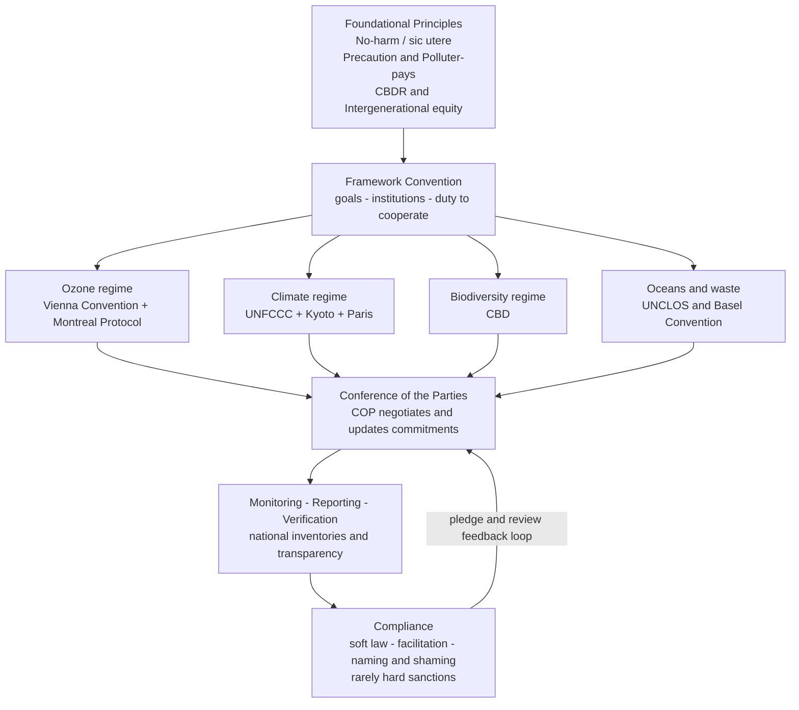

# 🌍 International Environmental Law

> [!abstract] TL;DR
> **International environmental law (IEL)** is the body of treaties, customary rules, and principles by which states try to protect an environment that *ignores their borders* — the atmosphere, the oceans, the ozone layer, migratory species, the climate. Its defining difficulty is that the environment is a **global commons**: the benefits of protection are shared by everyone while the costs of restraint fall on whoever restrains, so every state is tempted to **free-ride**. IEL is the legal machinery built to solve that collective-action problem, resting on a handful of principles (**no-harm**, **precaution**, **polluter-pays**, **common but differentiated responsibilities**, **sustainable development**, **intergenerational equity**) and delivered through **framework conventions plus protocols** whose enforcement relies less on courts and sanctions than on **soft law, transparency, and periodic Conferences of the Parties (COPs)**.

---

## Intuition

**Analogy:** Picture a shared pasture — or better, a shared *atmosphere* — that no one owns and everyone uses. Each herder gains the full benefit of adding one more cow, but the cost of overgrazing is spread across the whole group. So each rationally adds cows until the pasture collapses. Now scale that to the planet: each country enjoys the full economic benefit of burning cheap coal, while the cost — a warmer, more acidic, more polluted world — is *smeared across all 8 billion people and all future generations*. Nobody can be shut out of the atmosphere, and nobody can be forced to chip in for cleaning it. That is the **tragedy of the commons** written at global scale.

International environmental law is humanity's attempt to write a *rulebook for the shared pasture* — but without a global sheriff to enforce it. There is no world government that can fine China, tax the United States, or jail a polluting corporation across borders. So IEL has to manufacture cooperation out of *voluntary treaties* among sovereign equals, each of which would privately prefer that everyone **else** cut emissions while it keeps growing. Understanding IEL means understanding both the elegant principles it invented and the structural weakness at its core: it must persuade free-riders to restrain themselves.

---

## How It Works

### The core problem: transboundary harm and the global commons

Two features make the environment legally distinctive:

1. **Transboundary harm.** Pollution respects no border. Sulphur dioxide from one country's smelter falls as acid rain on its neighbour; CFCs released anywhere thin the ozone layer everywhere; carbon dioxide emitted in any capital warms every coastline. Harm is *externalised* across sovereign jurisdictions, so no single legal system can internalise it.
2. **The global commons.** The high seas, the atmosphere, outer space, and Antarctica belong to no state. They are **non-excludable** (you cannot fence anyone out) and, for a pollutable resource, **rivalrous in degradation** (every ton of emissions uses up a shared sink). This is exactly the structure of a **public good** and of the **collective-action problem**: the individually rational choice — emit now, let others abate — is collectively ruinous. (See [[Public_Goods]] and the free-riding logic modelled below; the systems-level framing is in [[Sustainability_and_Planetary_Boundaries]].)

### The foundational principles

IEL is built on a compact set of principles, several of which have hardened into **customary international law** (binding even without a treaty):

- **No-harm / *sic utere tuo ut alienum non laedas*** ("use your own so as not to injure another's"). A state must not allow its territory to be used to cause serious environmental damage to another state. Its landmark is the **Trail Smelter arbitration (1938/1941)**, where a Canadian smelter's fumes damaged crops across the border in Washington State; the tribunal held that *no state has the right to use its territory so as to cause injury by fumes in the territory of another*. This is the bedrock rule — the international analogue of the tort of **nuisance** (compare [[Tort_Law]]).
- **Sustainable development.** Development that "meets the needs of the present without compromising the ability of future generations to meet their own needs" — the definition from the **Brundtland Report (*Our Common Future*, 1987)**. It fuses environmental protection with economic development rather than opposing them.
- **The precautionary principle.** Where there are threats of serious or irreversible damage, *lack of full scientific certainty shall not be used as a reason for postponing cost-effective measures* (Rio Declaration, Principle 15). It shifts the burden: uncertainty is a reason to act, not to wait.
- **The polluter-pays principle.** The party that causes pollution should bear the cost of remedying it — the legal expression of internalising a negative **externality** (compare [[Externalities_and_Pigouvian_Tax]]).
- **Common but differentiated responsibilities (CBDR).** All states share responsibility for the global environment, *but not equally*. Developed states — historically responsible for most emissions and richer in capacity — must lead and help finance developing states. This **equity split** is the political heart of climate negotiations and their most persistent fault line.
- **Intergenerational equity.** The present generation holds the planet in trust for those not yet born; today's states owe duties to *future* people who cannot sit at the negotiating table.

### The delivery mechanism: framework convention plus protocol

Because negotiating hard obligations among ~190 sovereign states at once is nearly impossible, IEL uses a two-step architecture:

1. A **framework convention** first establishes shared *goals, principles, institutions, and a duty to cooperate* — broad and easy to ratify.
2. Later **protocols** and amendments then add the *specific, binding commitments* once the science and politics mature.

The living organ of each regime is the **Conference of the Parties (COP)** — the periodic meeting of all treaty members that negotiates new commitments, reviews progress, and updates rules. Between COPs, states file **national reports and inventories**; a system of **monitoring, reporting, and verification (MRV)** and **transparency** substitutes for the courts and police that domestic law can call on.

### Flow: from principles to compliance



### The major regimes

- **Ozone — the success story.** The **Vienna Convention (1985)** was the framework; the **Montreal Protocol (1987)** added binding, scheduled phase-outs of CFCs and other ozone-depleting substances, with differentiated timelines and a **Multilateral Fund** to help developing countries switch. It is *widely regarded as the most successful environmental treaty ever*: universally ratified, science-driven, and on track to heal the ozone layer. Its atmospheric-chemistry basis is in [[Atmospheric_Chemistry_and_Stratospheric_Ozone]].
- **Climate — the hard case.** The **UN Framework Convention on Climate Change (UNFCCC, 1992)** set the goal of stabilising greenhouse-gas concentrations. The **Kyoto Protocol (1997)** took a *top-down* approach: legally binding emissions-reduction targets imposed only on developed (Annex I) countries. It largely **failed** — the United States never ratified, Canada withdrew, major emerging emitters had no targets, and enforcement was toothless. The **Paris Agreement (2015)** reversed the design: a *bottom-up* model of **nationally determined contributions (NDCs)** — each state sets its own pledge — combined with a **pledge-and-review** ("ratchet") cycle, a transparency framework, and a shared temperature goal of well below 2 degrees Celsius. It trades legal bindingness for near-universal participation. The physical science it responds to is in [[Anthropogenic_Climate_Change]].
- **Biodiversity.** The **Convention on Biological Diversity (CBD, 1992)** covers conservation, sustainable use, and fair sharing of genetic-resource benefits, with protocols on biosafety (Cartagena) and access-and-benefit-sharing (Nagoya).
- **Oceans and marine pollution.** The **UN Convention on the Law of the Sea (UNCLOS, 1982)** — the "constitution for the oceans" — imposes a general duty to protect the marine environment, layered with instruments like **MARPOL** on ship pollution. Ocean chemistry consequences appear in [[Ocean_Acidification]].
- **Hazardous waste.** The **Basel Convention (1989)** controls transboundary movements of hazardous waste, curbing the dumping of rich-country waste on poorer states.

### The economic tools

IEL increasingly borrows the economist's toolkit for correcting externalities:

- **Emissions trading and carbon markets** create a *price* on pollution by capping total emissions and letting firms trade allowances — a **cap-and-trade** system whose intellectual roots lie in the **Coase theorem** (assign property rights and let the market allocate; see [[Coase_Theorem]]) and in **Pigouvian** logic (tax the externality; see [[Externalities_and_Pigouvian_Tax]]).
- **Environmental impact assessment (EIA)** requires that likely environmental effects be studied *before* a major project proceeds — a procedural embodiment of precaution.

### Enforcement: the structural weakness

There is **no world environmental court** and no global executive. IEL leans heavily on **soft law** (declarations, guidelines, and non-binding COP decisions that shape behaviour without formal legal force), on **compliance committees** that *facilitate* rather than punish, and on **transparency and reputation** — "naming and shaming" a laggard rather than fining it. Its relationship to **trade law** is delicate: environmental measures can collide with free-trade rules, and its relationship to **human rights** is deepening, with growing recognition of a **right to a healthy environment** (affirmed by a UN General Assembly resolution in 2022).

---

## Key Concepts

**Secondary (foundations everyone should grasp):**
- The environment is a **shared resource no one owns**; pollution is a cost pushed onto others (an *externality*).
- **Treaties** are the main way sovereign states agree on rules, because there is no world government to legislate.
- **Sustainable development** = meeting today's needs without wrecking tomorrow's.
- The **Montreal Protocol** fixed the ozone hole; climate change is far harder because fossil fuels underpin the entire economy.

**Undergraduate (the working machinery):**
- The **framework-convention-plus-protocol** architecture and the role of the **COP**.
- The six core **principles**: no-harm (*Trail Smelter*), precaution, polluter-pays, CBDR, sustainable development, intergenerational equity.
- **Kyoto (top-down, binding, failed)** vs **Paris (bottom-up, NDCs, near-universal)** as two models of solving the same commons problem.
- **Customary international law** vs **treaty law** vs **soft law**, and why so much of IEL is soft.
- **Cap-and-trade** and carbon pricing as market instruments for a public-good problem.

**Graduate (frontier and tensions):**
- The **CBDR equity dilemma**: historical vs current emissions, per-capita vs national totals, and how to finance a *just transition* — the deepest split in the regime.
- **Compliance without sanctions**: managerial ("facilitate compliance") vs enforcement ("punish breach") theories; whether pledge-and-review can deliver deep cuts.
- **Fragmentation and regime interaction**: trade-vs-environment conflicts, and the interface with human-rights and investment law.
- **The collective-action mathematics**: why the Nash equilibrium under-provides the public good, whether **repeated interaction** (the shadow of the future; see [[Repeated_Games_and_Folk_Theorems]]) can sustain cooperation, and the role of **side-payments** and **issue linkage**.
- **Rights of nature** and standing for future generations and ecosystems.

---

## Python Demo

We model the climate-cooperation problem as a **public-goods / collective-action game**. There are `N` symmetric countries. Each chooses an abatement level `a_i` (emissions cut). Abatement is **costly to the actor** (a quadratic private cost) but its **benefit is shared globally** — every unit of *total* abatement `G = sum(a)` delivers benefit `b` to *each* of the `N` countries. This asymmetry (private cost, shared benefit) is exactly what drives free-riding.

- **Nash (self-interested) choice:** country `i` weighs its own cost against only *its own* share of the benefit, giving `a_Nash = b / c`.
- **Cooperative (global optimum):** a benevolent planner counts the benefit to *all* `N` countries, giving `a_Opt = N * b / c`.

The optimum abatement is `N` times the Nash level — a stark measure of the tragedy of the commons. We then introduce a **cooperation parameter** `gamma` in `[0, 1]` (how much of the harm to others each country internalises, via a binding agreement or side-payments) and show welfare rising from Nash toward the optimum.

```python
# Public-goods model of international climate cooperation.
# Private cost of abatement vs globally shared benefit => free-riding.
import numpy as np
import matplotlib.pyplot as plt

# --- Parameters -----------------------------------------------------------
N = 20        # number of countries (parties to the treaty)
b = 1.0       # marginal global benefit, per country, per unit total abatement
c = 1.0       # private cost coefficient (cost = 0.5 * c * a**2)

# --- Abatement choices ----------------------------------------------------
a_nash = b / c            # each country ignores benefit to the other N-1
a_opt  = N * b / c        # planner internalises benefit to all N countries

def total_welfare(a_each):
    """Sum of payoffs when every country abates a_each.
    Payoff_i = b * G - 0.5 * c * a_i**2, with G = N * a_each."""
    G = N * a_each
    payoff_i = b * G - 0.5 * c * a_each**2
    return N * payoff_i

W_nash = total_welfare(a_nash)
W_opt  = total_welfare(a_opt)

print(f"Nash abatement per country     : {a_nash:.2f}")
print(f"Optimal abatement per country  : {a_opt:.2f}  ({a_opt/a_nash:.0f}x higher)")
print(f"Total abatement  Nash vs Opt   : {N*a_nash:.0f}  vs  {N*a_opt:.0f}")
print(f"Total welfare    Nash vs Opt   : {W_nash:.0f}  vs  {W_opt:.0f}")

# --- Cooperation dial: gamma in [0,1] internalises others' benefit --------
# Each country maximises b*a_i + gamma*(N-1)*b*a_i - 0.5*c*a_i**2
# => a(gamma) = (1 + gamma*(N-1)) * b / c ; gamma=0 -> Nash, gamma=1 -> Opt.
gamma = np.linspace(0.0, 1.0, 200)
a_gamma = (1.0 + gamma * (N - 1)) * b / c
W_gamma = np.array([total_welfare(a) for a in a_gamma])

# --- Plot -----------------------------------------------------------------
fig, ax = plt.subplots(1, 2, figsize=(12, 5))

# Panel 1: Nash vs cooperative outcomes
labels = ["Non-cooperative\n(Nash / free-riding)", "Cooperative\n(global optimum)"]
ax[0].bar(labels, [N * a_nash, N * a_opt], color=["#c0392b", "#27ae60"])
ax[0].set_ylabel("Total global abatement (public good provided)")
ax[0].set_title("Free-riding under-provides the public good")
for i, v in enumerate([N * a_nash, N * a_opt]):
    ax[0].text(i, v + 2, f"{v:.0f}", ha="center", fontweight="bold")

# Panel 2: welfare rises as a binding agreement raises cooperation
ax[1].plot(gamma, W_gamma / W_opt, color="#2c3e50", lw=2.5,
           label="Total welfare (share of optimum)")
ax[1].axhline(W_nash / W_opt, ls="--", color="#c0392b",
              label="Nash welfare (no agreement)")
ax[1].scatter([0, 1], [W_nash / W_opt, 1.0], color=["#c0392b", "#27ae60"],
              zorder=5, s=70)
ax[1].annotate("Kyoto/Paris push gamma ->",
               xy=(0.5, np.interp(0.5, gamma, W_gamma / W_opt)),
               xytext=(0.15, 0.55),
               arrowprops=dict(arrowstyle="->"))
ax[1].set_xlabel("Cooperation level gamma  (binding treaty / side-payments)")
ax[1].set_ylabel("Total welfare, normalised to optimum")
ax[1].set_title("A binding agreement shifts toward the optimum")
ax[1].legend(loc="lower right")

plt.tight_layout()
plt.savefig("climate_public_good.png", dpi=120)
print("Saved figure to climate_public_good.png")
```

**What the model shows.** With `N = 20`, the cooperative optimum abates **20 times** as much as the free-riding Nash equilibrium, and non-cooperative welfare is only a fraction of the achievable optimum. This is the tragedy of the commons in one equation: because each country pays the full cost but captures only `1/N` of the benefit, self-interest badly under-provides the global public good of a stable climate. The second panel shows the *political project of IEL* — a **binding agreement or system of side-payments** (the intuition behind **CBDR** finance and carbon markets) that dials `gamma` upward, dragging the outcome from the red Nash point toward the green optimum. The commons framing links to [[Sustainability_and_Planetary_Boundaries]]; the underlying equilibrium concept is [[Nash_Equilibrium]] and the physical stakes are in [[Anthropogenic_Climate_Change]].

---

## Real-World Applications

- **The Montreal Protocol (ozone).** The template for successful IEL: framework convention, scientifically ratcheted binding phase-outs, differentiated timelines, and a financing fund. Universal ratification; the ozone layer is projected to recover by mid-century.
- **The Paris Agreement (climate).** Every major economy files an NDC and reports under a common transparency framework; five-yearly **global stocktakes** ratchet ambition. It shows how bottom-up design can buy participation that top-down Kyoto could not.
- **The EU Emissions Trading System (ETS).** The world's largest carbon market — a working, cross-border **cap-and-trade** system that puts a price on a ton of CO2, operationalising Coasean and Pigouvian ideas at continental scale.
- **Trail Smelter, still cited.** The 1930s cross-border smelter dispute remains the foundational precedent for the **no-harm principle** invoked in modern transboundary-pollution and even climate-liability litigation.
- **UNCLOS and marine protection.** Governs everything from ship pollution (MARPOL) to the 2023 **High Seas (BBNJ) Treaty** on biodiversity beyond national jurisdiction — extending the commons rulebook to two-thirds of the ocean surface.

---

## Common Pitfalls

- **Treating a treaty's signature as compliance.** Signing or even ratifying is not implementing. Kyoto had binding targets on paper yet failed in practice; the hard question is always *enforcement and domestic follow-through*, not the treaty text.
- **Confusing hard law with soft law.** Much of IEL is **soft law** — declarations and COP decisions that guide behaviour without formal bindingness. Assuming a Rio "principle" is directly enforceable in a court misreads how the field actually works.
- **Ignoring the CBDR equity split.** Analysing climate cooperation as if all states were symmetric erases the central political fact: developed and developing countries have very different histories, capacities, and obligations. Fairness, not just efficiency, determines whether a deal holds.
- **Assuming a binding target beats a voluntary pledge.** Intuition says binding Kyoto should outperform voluntary Paris; in practice, **near-universal soft commitment** delivered more than **partial hard commitment**. Participation breadth can dominate legal stringency.
- **Forgetting the missing enforcer.** There is no world court or police for the environment. Expecting IEL to behave like domestic regulation — with fines and injunctions — misunderstands a system that runs on transparency, reciprocity, and reputation.
- **Modelling the commons without repetition.** A one-shot Nash analysis is too pessimistic: climate diplomacy is *repeated*, and the **shadow of the future** ([[Repeated_Games_and_Folk_Theorems]]) can sustain cooperation that a single-shot game predicts will collapse.

---

## Related Concepts

- [[Sustainability_and_Planetary_Boundaries]] — the systems-thinking framing of the shared global commons and the biophysical limits IEL tries to keep humanity inside.
- [[Anthropogenic_Climate_Change]] — the physical science of the warming that the UNFCCC, Kyoto, and Paris regimes respond to.
- [[Atmospheric_Chemistry_and_Stratospheric_Ozone]] — the chemistry of ozone depletion underlying the Montreal Protocol success story.
- [[Ocean_Acidification]] — a marine-commons harm governed under UNCLOS and the climate regime.
- [[Externalities_and_Pigouvian_Tax]] — pollution as a negative externality; the economic logic behind polluter-pays and carbon taxes.
- [[Coase_Theorem]] — assigning tradable rights to a commons; the intellectual root of emissions trading.
- [[Public_Goods]] — a stable climate as a non-excludable public good, and why markets under-provide it.
- [[Nash_Equilibrium]] — the self-interested outcome that under-provides abatement in the collective-action game.
- [[Repeated_Games_and_Folk_Theorems]] — how repeated diplomacy and the shadow of the future can sustain cooperation on the commons.
- [[Tort_Law]] — the domestic analogue of transboundary harm; nuisance and the no-harm principle share a logic.
- [[Administrative_Law_and_Regulation]] — how international commitments are implemented domestically through regulatory agencies.

---

## Review Questions

1. **(Foundations)** Explain why the atmosphere is a "global commons" and why this structure makes each country prefer that *others* cut emissions. Which two features — non-excludability and shared degradation — drive the free-rider problem?
2. **(Application)** The Kyoto Protocol imposed binding targets on developed countries and failed; the Paris Agreement uses voluntary, self-set NDCs and achieved near-universal participation. Given a world of sovereign states with no global enforcer, which design would you choose, and what specific trade-off between *legal bindingness* and *participation breadth* are you making?
3. **(Trade-off / synthesis)** The principle of **common but differentiated responsibilities** and the **precautionary principle** can pull in opposite directions — one urges immediate global action, the other lets some states move slower on equity grounds. Using the public-goods model in this note, argue how **side-payments** (climate finance) can reconcile them and shift the outcome from the Nash equilibrium toward the global optimum. What would break down if the transfers were not credibly enforced?

---

## Sources

- Birnie, Boyle & Redgwell, *International Law and the Environment* (Oxford University Press, 4th ed., 2021).
- Sands & Peel, *Principles of International Environmental Law* (Cambridge University Press, 4th ed., 2018).
- United Nations, [*Report of the World Commission on Environment and Development: Our Common Future* (Brundtland Report, 1987)](https://sustainabledevelopment.un.org/content/documents/5987our-common-future.pdf).
- UNEP Ozone Secretariat, [*The Montreal Protocol on Substances that Deplete the Ozone Layer*](https://ozone.unep.org/treaties/montreal-protocol).
- UNFCCC, [*The Paris Agreement*](https://unfccc.int/process-and-meetings/the-paris-agreement).

---

#law #environmental-law #climate-law #global-commons #sustainability
