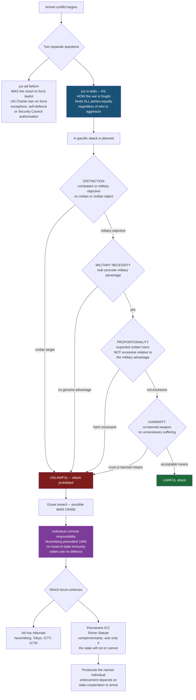

# ⚖️ International Humanitarian Law and International Criminal Law

> [!abstract] TL;DR
> Two connected fields govern the worst of human conduct. **International humanitarian law (IHL)** — the *jus in bello*, the law of armed conflict — regulates *how* wars may be fought once fighting has begun, binding *every* side regardless of who started it, through four cardinal principles: **distinction** (target only combatants and military objectives), **proportionality** (expected civilian harm must not be *excessive* relative to the military advantage), **military necessity**, and **humanity** (no unnecessary suffering). **International criminal law (ICL)** supplies the enforcement teeth that IHL historically lacked: since **Nuremberg (1945)**, *individuals* — not just states — can be personally prosecuted for the gravest crimes (**genocide, crimes against humanity, war crimes, and aggression**), first before ad hoc tribunals (**ICTY, ICTR**) and now the permanent **International Criminal Court** under the **Rome Statute**. Keep two distinctions straight: *jus ad bellum* (was resorting to force lawful?) is separate from *jus in bello* (was the war fought lawfully?), and the field lives in permanent tension between **sovereignty** and **accountability**, and between **peace** and **justice**.

---

## Intuition

**Analogy — a referee's rulebook for the worst game humans play.** Even a brutal contact sport has a referee and a rulebook. Boxing lets you punch — that is the point — but it *still* forbids hitting below the belt, striking a downed opponent, or biting an ear. The rules do not pretend the violence is not happening; they draw a line between the fighting that is permitted and the cruelty that is not. IHL is exactly that: it accepts that armies will try to kill each other's soldiers, but it fences off the wounded, the surrendered, the medic, and above all the **civilian** who is not fighting. War is legalised violence *inside a cage*, and IHL is the cage.

The second, harder intuition is **personal accountability**. For most of history, when a state committed an atrocity, "the state" was blamed — an abstraction that no one could jail. Nuremberg changed the frame: it said that *a specific general, a specific minister, a specific soldier* made a choice, and can be put in a specific dock and sentenced. "I was following orders" and "I was the head of state" stopped being shields. ICL is the referee finally being able to send a *named individual* off the field, not merely penalise the team.

---

## How It Works

### Core mechanics

**Two separate legal questions about war.** The single most important structural idea is that the legality of *going to war* and the legality of *conduct in war* are judged by different bodies of law and never mix:

- ***Jus ad bellum*** — the law on the *resort* to force. The **UN Charter (1945)** makes the use of force between states presumptively **unlawful** (Article 2, paragraph 4). There are only two clean exceptions: **individual or collective self-defence** against an armed attack (Article 51), and force **authorised by the UN Security Council** to maintain international peace (Chapter VII). An aggressor who violates *jus ad bellum* has broken the law by fighting at all.
- ***Jus in bello*** — IHL, the law on *how* force is used. It applies **equally to all parties** — aggressor and defender alike — from the first shot to the last. A soldier defending against an illegal invasion must *still* obey distinction and proportionality; a soldier of the aggressor state who fights cleanly commits no war crime merely because their government's war was illegal. **Separating the two is what makes IHL enforceable in practice**: you cannot make protection of civilians depend on first agreeing whose cause was just.

**The sources of IHL.** IHL is built from three layers:

1. **"Hague law"** (the Hague Conventions of 1899 and 1907) — the law of **means and methods**: what weapons and tactics are permitted, the rules on bombardment, and the principle that "the right of belligerents to adopt means of injuring the enemy is not unlimited."
2. **"Geneva law"** (the four **Geneva Conventions of 1949** and their **Additional Protocols of 1977 and 2005**) — the law protecting **persons** *hors de combat* ("out of the fight"): the wounded and sick on land (GC I) and at sea (GC II), **prisoners of war** (GC III), and **civilians** (GC IV). Additional Protocol I extended protection in international conflicts; Protocol II covers non-international (internal) armed conflicts.
3. **Customary IHL** — binding rules formed by consistent state practice and *opinio juris*, catalogued in the ICRC's 2005 study. Custom matters enormously because it binds states even when they have not ratified a given treaty, and it fills the thin treaty coverage of internal conflicts.

**The four cardinal principles.** Every targeting decision runs a gauntlet:

- **Distinction** — parties must *at all times distinguish* between combatants/military objectives and civilians/civilian objects, and may only direct attacks against the former. Indiscriminate attacks are prohibited.
- **Proportionality** — even a lawful military target may *not* be attacked if the **expected incidental civilian harm** would be **excessive** in relation to the **concrete and direct military advantage anticipated**. This is a comparison of unlike things, deliberately, and it is where most controversy lives.
- **Military necessity** — force is permitted only to the extent needed to achieve a legitimate military aim; it *licenses* violence against valid targets but simultaneously *limits* it. Necessity is never a licence to ignore the other principles.
- **Humanity / unnecessary suffering** — weapons and methods that cause superfluous injury or unnecessary suffering are banned (dum-dum bullets, blinding lasers, chemical weapons); this principle protects even combatants.

**Status and protection.** IHL assigns **status**. A lawful **combatant** may fight and, if captured, becomes a **prisoner of war** entitled to humane treatment and release at the end of hostilities — they cannot be punished merely for having fought. **Civilians** and other **protected persons** (the wounded, medical and religious personnel, detainees) must be treated humanely; the baseline floor is **Common Article 3**, which applies in *all* conflicts and forbids murder, torture, hostage-taking, and humiliating treatment. Fighters who do not qualify for combatant status (e.g., unprivileged belligerents) may be tried for their acts but retain the humane-treatment floor.

**From breach to a person in the dock — the ICL chain.** IHL tells you *what is prohibited*; ICL decides *who personally pays*. A **grave breach** of the Geneva Conventions (wilful killing, torture, targeting civilians) is a **war crime**. ICL recognises four **core crimes**:

- **Genocide** — acts committed with intent to destroy, in whole or in part, a national, ethnic, racial, or religious group.
- **Crimes against humanity** — widespread or systematic attacks against a civilian population (murder, extermination, enslavement, deportation, torture, persecution).
- **War crimes** — serious violations of IHL committed in armed conflict.
- **The crime of aggression** — the planning or waging of a manifestly illegal war by a person in a position to control state action (the *jus ad bellum* crime, activated at the ICC in 2018 with narrow jurisdiction).

Two doctrines make responsibility bite upward and downward: **command (superior) responsibility** holds a commander liable for crimes of subordinates they knew or should have known about and failed to prevent or punish; and the rule that **superior orders are no defence** (a mitigating factor at most) stops the chain of "just following orders" from dissolving accountability. Since Nuremberg, **official capacity** — being a head of state or minister — provides no immunity from the core crimes.

**The forums.** Nuremberg and Tokyo (1945–46) were *ad hoc* military tribunals for the Axis. The 1990s revived the model with the **ICTY** (former Yugoslavia) and **ICTR** (Rwanda), created by the Security Council. The **International Criminal Court (ICC)**, established by the **Rome Statute (1998, in force 2002)**, is the first **permanent** court. It runs on **complementarity**: it acts only when a state is **unwilling or unable** genuinely to investigate or prosecute itself — national courts have priority. Its jurisdiction reaches crimes on the territory of, or by nationals of, states parties, or on a **Security Council referral**. Its central weaknesses are political: it has **no police force** and depends on state cooperation to arrest, and several great powers (the United States, China, Russia, India) are **not parties**, limiting both its reach and its perceived legitimacy.

### Flow / Architecture



---

## Key Concepts

### Secondary Level

**What the laws of war are.** People often assume war is a lawless free-for-all. It is not. The **laws of war** say that even in armed conflict some acts are crimes: deliberately killing civilians, torturing prisoners, shooting a surrendering soldier, bombing a hospital. The core idea is a line between **combatants** (people who fight and may be attacked) and **civilians** (people who do not fight and must be spared).

**The Geneva Conventions.** Four treaties agreed in **1949**, after the horrors of World War II, protect people who are *out of the fight*: wounded soldiers, prisoners of war, and civilians. Almost every country in the world has signed them, which is rare for any treaty. They are guarded and promoted by the **International Committee of the Red Cross (ICRC)**, a neutral organisation.

**War crimes and who is responsible.** When these rules are broken seriously, the acts are **war crimes**. The big shift after WWII was that *individual people* — not just governments — can be put on trial. At the **Nuremberg trials (1945–46)**, Nazi leaders were prosecuted as individuals. "I was only obeying orders" was rejected as an excuse.

**The four core crimes.** International criminal law targets four grave crimes: **genocide** (trying to destroy a whole group of people), **crimes against humanity** (large-scale attacks on civilians), **war crimes** (serious breaches of the rules of war), and **the crime of aggression** (starting an illegal war).

**The International Criminal Court (ICC).** Since **2002** there has been a permanent court in The Hague to try these crimes when national courts will not. It has prosecuted warlords and leaders — but it has no police of its own and depends on countries to arrest suspects, so many accused remain free.

### Undergraduate Level

***Jus ad bellum* vs *jus in bello* — keep them apart.** *Jus ad bellum* asks whether it was lawful to **resort to war** (governed by the **UN Charter**: force is banned except in self-defence or with Security Council authorisation). *Jus in bello* asks whether the war was **fought lawfully** (governed by IHL). The crucial doctrine is the **equality of belligerents**: IHL applies **identically to both sides**, so even a soldier fighting an illegal war of aggression commits no war crime by fighting cleanly, and a soldier resisting that aggression *still* must obey the rules. Protection of civilians cannot be made to depend on first deciding whose cause is just.

**The four cardinal principles, precisely.**

| Principle | The rule | The hard part |
|---|---|---|
| **Distinction** | Attack only combatants and military objectives | Fighters hiding among civilians; "direct participation in hostilities" |
| **Proportionality** | Incidental civilian harm must not be *excessive* vs the *concrete and direct military advantage anticipated* | Comparing lives against advantage; judged *ex ante*, on expectations |
| **Military necessity** | Use only force needed for a legitimate military aim | It both *permits* and *limits*; never overrides the other three |
| **Humanity** | No superfluous injury or unnecessary suffering | Bans specific weapons; protects even combatants |

**Two treaty families.** **Hague law** (1899/1907) governs **means and methods** — what you may do to the enemy. **Geneva law** (1949 + Additional Protocols 1977/2005) governs **victims** — the wounded, POWs, and civilians. **Customary IHL** binds even non-ratifying states and is vital for **non-international armed conflicts** (civil wars), which the treaties cover only thinly — chiefly through **Common Article 3**, the humane-treatment floor that applies in *every* conflict.

**Combatant status and its consequences.** A lawful **combatant** enjoys the **combatant's privilege**: they may lawfully kill enemy soldiers and, if captured, cannot be punished for that — they become **prisoners of war** entitled to protection and repatriation when hostilities end. Losing that status (e.g., fighting out of uniform, perfidy, being an unprivileged belligerent) means one can be **prosecuted** for acts of violence, though the humane-treatment baseline still applies.

**The Nuremberg legacy and the tribunals.** Nuremberg established four pillars ICL still rests on: **individual responsibility**, **no immunity for official capacity**, **superior orders as no defence**, and the criminalisation of aggression ("crimes against peace"). The **ICTY** and **ICTR** (Security Council tribunals of the 1990s) revived and developed the model — convicting for genocide (Rwanda) and command responsibility (Srebrenica) — paving the way for the permanent **ICC**.

### Graduate Level

**The indeterminacy of proportionality.** Proportionality is IHL's most litigated and least determinate rule. It requires weighing **incommensurables** — expected civilian deaths against "concrete and direct military advantage" — with **no fixed exchange rate**, judged **prospectively** on what a "reasonable commander" *anticipated*, not on the outcome with hindsight. This creates a genuine grey zone: two conscientious commanders can disagree, and both can be within the law. The standard is *not* "minimise civilian harm" but "harm not **excessive**," a deliberately high bar. The demo below makes this indeterminacy visible as a *band* of defensible thresholds rather than a single line.

**Complementarity as a sovereignty compromise.** The ICC's **complementarity** principle (Rome Statute, Articles 17–20) is the hinge between accountability and sovereignty. The Court may act **only** when a state is **unwilling or unable** genuinely to prosecute. This deliberately privileges national jurisdiction: the ICC is a **backstop, not a first resort**. It incentivises states to build domestic capacity, but it also generates hard admissibility fights over what counts as a "genuine" national process versus a sham designed to shield the accused.

**Jurisdiction, referral, and the great-power problem.** The ICC's jurisdiction is **not universal**. It reaches (a) crimes on the **territory** of a state party, (b) crimes by **nationals** of a state party, or (c) situations **referred by the UN Security Council**. Because the United States, China, Russia, and India are **not parties**, and because Security Council referral is subject to the **P5 veto**, enforcement is structurally uneven — the Court can more easily reach actors from weaker, ratifying states than from powerful non-parties, feeding the critique of **selectivity** and neo-colonial bias (much litigated over the concentration of early ICC cases in Africa).

**The peace-versus-justice tension.** Prosecution can *obstruct* peace. Indicting a sitting leader (e.g., an arrest warrant during an ongoing conflict) may remove the incentive to negotiate a settlement or step down, prolonging violence — the classic **"peace vs justice"** dilemma. Conversely, **amnesties** that buy peace may entrench impunity and violate victims' rights and (for the gravest crimes) international obligations. Transitional-justice practice (truth commissions, conditional amnesties, hybrid courts) tries to thread this needle, but there is no settled formula.

**Command responsibility as a mode of liability.** Beyond direct perpetration, ICL uses **superior responsibility**: a commander is liable for subordinates' crimes if they (i) had effective **command and control**, (ii) **knew or had reason to know** crimes were being or about to be committed, and (iii) **failed to take necessary and reasonable measures** to prevent or punish them. This is an **omission-based** liability that reaches up the hierarchy to the people who could have stopped atrocities — the doctrinal answer to organised, bureaucratic mass violence where the ones who order rarely pull triggers.

**Enforcement without a sovereign.** IHL and ICL expose the deepest structural fact of international law: there is **no world police**. Compliance rests on **reciprocity**, **reputation**, domestic implementation, third-state pressure, and the slow, contested legitimacy of institutions — not on a monopoly of force. The ICC's dependence on states to **arrest** suspects (it has none of its own) is the sharpest expression of this: warrants against powerful figures can sit unexecuted for years.

---

## Python Demo

```python
# Modelling the IHL PROPORTIONALITY principle as a decision surface.
#
# An attack on a LEGITIMATE military target (distinction already satisfied) is
# lawful only if the expected incidental civilian harm is NOT "excessive" relative
# to the anticipated concrete military advantage.  There is no fixed legal exchange
# rate: the law says "not excessive", not "minimise".  We therefore model the
# lawful/unlawful boundary not as a single line but as a BAND of defensible
# thresholds -- reasonable commanders can disagree inside it.
#
# Axes:  x = anticipated military advantage (0..10)
#        y = expected civilian casualties  (0..10)
# Rule:  harm is excessive when  y > k * x   for the operative ratio k.
#        k_strict (low)  -> harm judged excessive sooner  (protective reading)
#        k_lax    (high) -> harm tolerated longer         (permissive reading)
# The zone between k_strict*x and k_lax*x is the CONTESTED region where the word
# "excessive" does real, indeterminate work.  numpy + matplotlib only.

import numpy as np
import matplotlib.pyplot as plt

# --- the two ends of a defensible "excessive" threshold ----------------------
k_strict = 0.5   # protective: >0.5 civilians per unit advantage = excessive
k_lax    = 1.5   # permissive: tolerate up to 1.5 per unit advantage

# --- build the decision grid -------------------------------------------------
adv = np.linspace(0.01, 10, 400)          # military advantage
cas = np.linspace(0, 10, 400)             # expected civilian casualties
X, Y = np.meshgrid(adv, cas)

ratio = Y / X                             # civilian harm per unit of advantage
# classify every point: 0 = clearly lawful, 1 = contested, 2 = clearly unlawful
region = np.zeros_like(ratio)
region[ratio > k_strict] = 1              # crosses the protective line
region[ratio > k_lax]    = 2              # crosses even the permissive line

# --- plot the shaded decision surface ----------------------------------------
fig, ax = plt.subplots(figsize=(10, 7.5))

cmap = plt.matplotlib.colors.ListedColormap(["#1e6b3a", "#c9a227", "#7f1d1d"])
ax.pcolormesh(X, Y, region, cmap=cmap, shading="auto", alpha=0.85)

# the two boundary lines y = k*x
ax.plot(adv, k_strict * adv, color="white", lw=2.2, ls="--",
        label=f"strict threshold  y = {k_strict} x")
ax.plot(adv, k_lax * adv, color="white", lw=2.2, ls=":",
        label=f"lax threshold  y = {k_lax} x")

# --- concrete example strikes ------------------------------------------------
# (name, military advantage, expected civilian casualties)
strikes = [
    ("Strike on a lone\nartillery piece",        8.0, 1.0),
    ("Bomb a command post\nin a dense suburb",    6.0, 6.5),
    ("Hit a bridge used for\nresupply, few nearby",7.0, 2.5),
    ("Level a block to kill\none sniper",         1.5, 7.0),
    ("Contested: fuel depot\nnear a market",      5.0, 4.5),
]

def classify(a, c):
    r = c / a
    if r > k_lax:    return "UNLAWFUL", "#7f1d1d"
    if r > k_strict: return "CONTESTED", "#8a6d00"
    return "LAWFUL", "#1e6b3a"

print("IHL PROPORTIONALITY REVIEW  (distinction already satisfied)")
print("=" * 66)
for name, a, c in strikes:
    verdict, _ = classify(a, c)
    label = name.replace(chr(10), " ")
    print(f"  advantage={a:4.1f}  civ_cas={c:4.1f}  ratio={c/a:4.2f}  -> {verdict}")
    ax.scatter(a, c, s=120, color="white", edgecolor="black", zorder=5)
    ax.annotate(name, (a, c), textcoords="offset points", xytext=(8, 6),
                fontsize=8, fontweight="bold", color="white",
                bbox=dict(boxstyle="round,pad=0.25", fc="black", alpha=0.55))

ax.set_xlabel("anticipated military advantage  (greater ->)", fontsize=11)
ax.set_ylabel("expected civilian casualties  (greater ->)", fontsize=11)
ax.set_title("IHL proportionality: when is expected civilian harm 'excessive'?\n"
             "green = clearly lawful   amber = CONTESTED   red = clearly unlawful",
             fontsize=12, fontweight="bold")
ax.set_xlim(0, 10); ax.set_ylim(0, 10)
ax.legend(loc="upper left", framealpha=0.9)

fig.text(0.5, -0.02,
         "The amber band is the whole legal problem: the law forbids 'excessive' "
         "harm but fixes no exchange rate,\nso two reasonable commanders can place "
         "the line differently and both stay within the law.",
         ha="center", fontsize=9, style="italic")

plt.tight_layout()
plt.savefig("ihl_proportionality_surface.png", dpi=130, bbox_inches="tight")
print("\nSaved figure -> ihl_proportionality_surface.png")
```

**What it shows.** With distinction already satisfied (the target is a lawful military objective), proportionality is modelled as the ratio of expected civilian casualties to anticipated military advantage. The **green** region is clearly lawful, the **red** region clearly unlawful — but the crucial feature is the **amber contested band** between the strict and lax thresholds. A strike on a lone artillery piece (high advantage, one bystander) is comfortably lawful; levelling a city block to kill a single sniper is comfortably unlawful; but the fuel depot next to a market lands in the amber zone, where the legal word **"excessive"** does all the work and *the law itself does not tell you where the line sits*. That indeterminacy — proportionality has no fixed exchange rate and is judged prospectively on a commander's reasonable anticipation, not on the body count with hindsight — is exactly why proportionality is IHL's hardest, most litigated rule and why targeting-law disputes so rarely resolve cleanly.

---

## Real-World Applications

**The ICRC and the wounded on the battlefield.** The entire Geneva system grew from Henry Dunant witnessing the untended wounded at **Solferino (1859)**. Today the **International Committee of the Red Cross** operates as the neutral guardian of IHL: visiting prisoners of war, tracing the missing, and reminding belligerents of their obligations. Its neutrality is itself a legal construct — the red cross/red crescent emblem is a *protected* symbol under GC I, and misusing it (perfidy) is a war crime.

**Prisoner-of-war status disputes.** After 2001, the classification of detainees at Guantánamo Bay turned on whether captured fighters were **prisoners of war** (GC III), civilians (GC IV), or "unlawful combatants" outside both — a live illustration that combatant status determines everything about lawful treatment, and that Common Article 3's humane-treatment floor applies even when full POW status is denied (confirmed by the US Supreme Court in *Hamdan v. Rumsfeld*, 2006).

**The ICTY and command responsibility — Srebrenica.** The **International Criminal Tribunal for the former Yugoslavia** convicted senior figures for the 1995 Srebrenica massacre as **genocide**, developing the modern law of **command responsibility** and joint criminal enterprise. It showed the ad hoc model could reach the top of a military hierarchy — General Ratko Mladić was ultimately convicted in 2017.

**The ICTR and genocide — Rwanda.** The **International Criminal Tribunal for Rwanda** delivered, in *Prosecutor v. Akayesu* (1998), the first conviction by an international court for the crime of **genocide**, and pioneered the recognition of **rape as an instrument of genocide** — a landmark that reshaped how mass sexual violence is prosecuted.

**The ICC in practice — arrests and their limits.** The ICC has convicted militia leaders (e.g., **Thomas Lubanga**, 2012, for conscripting child soldiers) but has also issued warrants against sitting heads of state that went **unexecuted for years**, exposing its dependence on state cooperation. Warrants against non-party nationals — and the refusal of several great powers to join — illustrate the **enforcement gap** and the selectivity critique that dog the Court's legitimacy.

---

## Common Pitfalls

- **Collapsing *jus ad bellum* into *jus in bello*.** Whether a war is *legal to start* (self-defence, Security Council authorisation) is a **completely separate question** from whether it is *fought lawfully*. IHL binds both sides **equally**; a just cause does not licence war crimes, and an unjust cause does not make clean combat criminal. Mixing them destroys the protection of civilians.
- **Thinking IHL bans killing.** IHL does **not** prohibit killing combatants — that is legalised. It regulates *whom* you may target, *how much* incidental harm is tolerable, and *what means* are forbidden. The line is combatant vs civilian, not violence vs peace.
- **Reading proportionality as "minimise civilian harm."** The legal test is that harm not be **excessive** relative to the anticipated military advantage — a much higher bar — and it is judged **prospectively** on reasonable expectation, not with hindsight on the actual casualty count.
- **Assuming all detainees are prisoners of war.** POW status (GC III) attaches to lawful combatants and carries specific protections; others may be civilians (GC IV) or unprivileged belligerents. But **no one falls outside all protection** — Common Article 3's humane-treatment floor applies in every armed conflict.
- **Believing "I was following orders" is a defence.** Since Nuremberg, **superior orders are not a defence** to the core crimes (a mitigating factor at most), and **official capacity** grants no immunity. Command responsibility reaches *up* to those who could have prevented the crimes.
- **Overstating the ICC's power.** The ICC has **no police force** and only **complementary** jurisdiction — it acts solely when states will not. Because several great powers are **non-parties** and arrests depend on state cooperation, warrants can go unexecuted for years. The Court is a backstop, not a world sheriff.
- **Confusing a war crime with an act of war.** Lawful combat causing lawful casualties is *not* a war crime. A war crime is a **serious violation** of IHL — deliberately targeting civilians, torturing prisoners, using banned weapons — not merely the fact that people died.

---

## Related Concepts

- [[Human_Rights_and_International_Law]] — the parallel body of international law; human rights law applies in peace *and* war and increasingly interacts with IHL (the *lex specialis* debate over which governs conduct in armed conflict).
- [[War_Conflict_and_Security]] — the political-science account of why wars start and how they are fought; IHL/ICL is the legal cage placed around that violence.
- [[The_State_System_and_Sovereignty]] — the sovereignty that ICL's accountability agenda challenges; complementarity is the compromise between sovereign jurisdiction and international justice.
- [[International_Institutions_and_Multilateralism]] — the UN Charter, Security Council, and treaty regimes that create and (partially) enforce these laws.
- [[Global_Security_and_Terrorism]] — the classification of non-state fighters, detention, and targeting debates that stress-test combatant status and distinction.
- [[Nuclear_Strategy_and_Arms_Control]] — weapons law and the humanity principle meet the legality of nuclear weapons (the ICJ's 1996 Advisory Opinion).
- [[The_Holocaust]] — the atrocity that directly produced the Nuremberg trials, the Genocide Convention, and the 1949 Geneva Conventions.
- [[World_War_II]] — the historical crucible of modern IHL and ICL: Nuremberg, Tokyo, and the postwar treaty framework.
- [[Rule_of_Law_and_Due_Process]] — the principle that even the gravest accused receive a fair trial; ICL applies due-process guarantees to the worst crimes.
- [[Rights_and_Civil_Liberties]] — the domestic-rights analogue; both fields limit state power over the individual, one in war, one in peace.
- [[Sources_of_Law]] — treaties, custom, and general principles are the sources of IHL, so understanding how international law is *made* underpins this note.

> [!note] Planned companion notes for this Law vault
> **Public International Law** (the general framework of treaties, custom, statehood, and the sources of international obligation), **Human Rights Law** (the treaty machinery of the UDHR/ICCPR/ICESCR and regional courts), and **Criminal Law Principles** (S04 — *mens rea*, *actus reus*, modes of liability, defences) are the natural siblings of this note and should be wikilinked here once created.

---

## Review Questions

### Secondary

1. Explain, in your own words, the difference between a **combatant** and a **civilian** under IHL, and why the distinction matters for who may be lawfully attacked.
2. What were the **Nuremberg trials**, and what famous excuse did they reject? Why was it significant that *individuals* — not just the German state — were put on trial?
3. Name the four **core crimes** prosecuted under international criminal law and give a one-line description of each.

### Undergraduate

1. A soldier fighting a war that their government started **illegally** shoots at enemy soldiers, obeying all the rules of distinction and proportionality. Have they committed a war crime? Use the distinction between *jus ad bellum* and *jus in bello* and the **equality of belligerents** to justify your answer.
2. Walk through the **four cardinal principles** of IHL for a proposed airstrike on a command post located in a residential area. At which principle is the strike most likely to fail, and why is "excessive" so hard to apply?
3. Explain the ICC's principle of **complementarity**. Why does it privilege national courts, and what problem does it create when a state runs a *sham* investigation to shield its own officials?

### Graduate

1. "Proportionality is not a rule but a licence for post-hoc rationalisation, because it fixes no exchange rate between civilian lives and military advantage and is judged only on what a commander *anticipated*." Evaluate this critique. Does the **reasonable-commander, *ex ante*** standard discipline targeting decisions or merely launder them? Relate your answer to the contested band in the demo.
2. Assess the claim that the ICC's dependence on **state cooperation** and the **non-participation of major powers** (US, China, Russia, India) make it a fundamentally **selective** institution. Does complementarity and Security Council referral mitigate or aggravate the problem of unequal reach?
3. Analyse the **peace-versus-justice** dilemma. When, if ever, is a conditional **amnesty** for grave crimes defensible as the price of ending a conflict, and how do the obligations to prosecute genocide, crimes against humanity, and grave breaches constrain that bargain? Use **command responsibility** to explain why reaching senior leaders is both the point and the difficulty of ICL.

---

## Sources

- [Geneva Conventions of 1949 and their Additional Protocols — International Committee of the Red Cross (ICRC)](https://www.icrc.org/en/law-and-policy/geneva-conventions-and-their-commentaries)
- [Rome Statute of the International Criminal Court (1998, in force 2002) — official text](https://www.icc-cpi.int/sites/default/files/RS-Eng.pdf)
- [Jean-Marie Henckaerts & Louise Doswald-Beck, *Customary International Humanitarian Law*, ICRC / Cambridge University Press, 2005](https://ihl-databases.icrc.org/en/customary-ihl)
- [Antonio Cassese et al., *Cassese's International Criminal Law*, 3rd ed., Oxford University Press, 2013](https://global.oup.com/academic/product/cesss-international-criminal-law-9780199694921)
- [Gary D. Solis, *The Law of Armed Conflict: International Humanitarian Law in War*, 3rd ed., Cambridge University Press, 2021](https://www.cambridge.org/core/books/law-of-armed-conflict/8C4E8C0F4E5B0D0E0B0E0B0E0B0E0B0E)
- [Charter of the United Nations (1945) — Articles 2(4), 51, Chapter VII](https://www.un.org/en/about-us/un-charter/full-text)

---

#law #international-humanitarian-law #war-crimes #icc #laws-of-war
