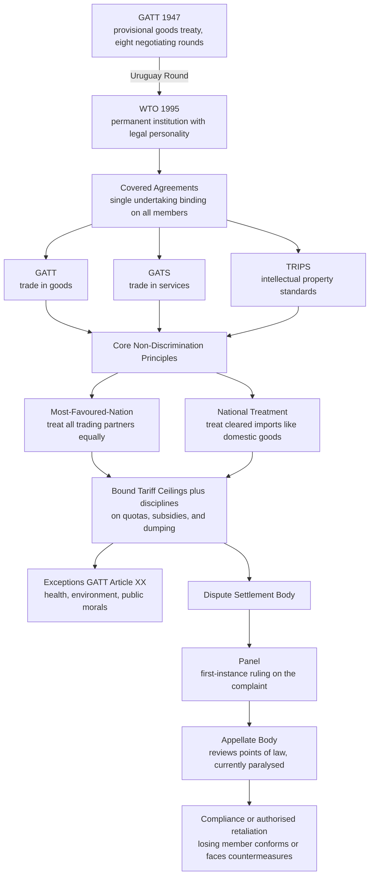

# 🌐 International Trade and Economic Law

> [!abstract] TL;DR
> **International trade and economic law is the body of treaty rules — centred on the WTO — that disciplines how states tax, restrict, and regulate cross-border trade and investment**, so that commercial relations are governed by *stable, negotiated rules* rather than by unilateral tariff wars. Its economic engine is **comparative advantage**: countries that specialise and trade collectively produce more than they could in isolation, and the legal regime exists to protect those **gains from trade** from being clawed back by protectionism. The system rests on two non-discrimination pillars — **Most-Favoured-Nation** (treat every trading partner alike) and **National Treatment** (treat imports like domestic products) — plus **bound tariff ceilings** and disciplines on quotas, subsidies, and dumping. When a member breaks the rules, a quasi-judicial **dispute settlement** process (a first-instance **panel** and, historically, an **Appellate Body**) rules on the complaint and authorises retaliation if the loser does not comply. The regime carves out **exceptions** (GATT Article XX: public health, environment, public morals), overlaps with **regional trade agreements** and **investment treaties**, and lives in permanent tension between free trade and each state's policy space.

---

## Intuition

**Analogy — a rulebook and a referee for the global marketplace.**

Imagine every country selling in one enormous bazaar. Left ungoverned, the bazaar has a nasty failure mode: whenever one nation's factories feel threatened by cheap imports, its government slaps a tariff on foreign goods to protect them. That feels locally sensible, but every other nation reasons the same way and retaliates. Tariffs spiral upward, cross-border trade collapses, and *everyone* ends up poorer — the classic **beggar-thy-neighbour** trap, and exactly what happened after the United States' **Smoot-Hawley Tariff of 1930**, when retaliatory walls went up worldwide and global trade fell by roughly two-thirds during the Depression.

International trade law is the response: a **rulebook** the traders agree to in advance (you may protect *this* much and no more, and you must treat all your partners even-handedly) plus a **referee** — a dispute-settlement tribunal — who decides, by the rules rather than by raw economic muscle, when a country has cheated. The deep move is to convert a self-defeating game, in which each player's individually rational tariff makes the whole worse off, into a **cooperative bargain** in which everyone pre-commits to keep their tariffs down, backed by the credible threat of authorised retaliation if they don't. Trade law is, at bottom, an **institutional escape from a prisoner's dilemma** played by nations (see [[Nash_Equilibrium]] and [[Repeated_Games_and_Folk_Theorems]]).

---

## How It Works

### Core mechanics

**1. The economic rationale — comparative advantage and gains from trade.** The foundational insight, from **David Ricardo (1817)**, is that a country should specialise in the goods it produces at the lowest **opportunity cost** — even if it is *absolutely* worse at making everything. When each country specialises according to comparative advantage and trades, total world output rises and every country can consume *beyond* its own production frontier. This is the surplus the legal regime is built to protect (economics in [[Scarcity_and_Opportunity_Cost]]; the Python demo below makes it concrete).

**2. Why states still protect, and why rules are needed.** Trade creates aggregate gains but produces **losers** — the domestic industries and workers displaced by imports. Those losers are concentrated and politically organised; the diffuse gains to consumers are politically weak. So governments face constant pressure to protect, and each protectionist move invites retaliation. A **rules-based system** solves the collective-action problem: by binding themselves to a treaty, states resist the domestic temptation and lock in mutual restraint.

**3. From GATT 1947 to the WTO 1995.** After Smoot-Hawley and the war, 23 nations signed the **General Agreement on Tariffs and Trade (GATT) in 1947** — a *provisional* treaty, applied for decades, that cut tariffs through eight negotiating **"rounds."** The final **Uruguay Round (1986-1994)** replaced the loose GATT with a permanent institution, the **World Trade Organization (WTO)**, launched **1 January 1995**, with legal personality, a Secretariat in Geneva, and a binding dispute mechanism.

**4. The covered agreements — a "single undertaking."** WTO membership means accepting a bundle of agreements together (no cherry-picking):
- **GATT** — trade in **goods** (the original 1947 text, updated).
- **GATS** (General Agreement on Trade in Services) — **services** such as banking, telecoms, and transport.
- **TRIPS** (Trade-Related Aspects of Intellectual Property Rights) — minimum standards for **patents, copyrights, trademarks**, controversial for its effect on access to medicines in developing countries.

**5. The two non-discrimination pillars.**
- **Most-Favoured-Nation (MFN)** treatment (GATT Art. I): any advantage granted to one trading partner must be extended **immediately and unconditionally to all** WTO members. There is no "most favoured" partner in practice — everyone is treated as well as the best-treated. This makes liberalisation *multilateral* and prevents discriminatory blocs.
- **National Treatment (NT)** (GATT Art. III): once imported goods have cleared the border and paid their tariff, they must be treated **no less favourably than "like" domestic products** in internal taxation and regulation. This stops countries from using internal rules as disguised protection.

**6. Tariff bindings and disciplines on other barriers.** Members negotiate **bound tariff ceilings** — legally committed maximum rates recorded in "schedules of concessions." Applied rates may be lower, but exceeding the binding breaches the treaty. Beyond tariffs the regime disciplines:
- **Quantitative restrictions (quotas)** — generally *prohibited* (GATT Art. XI), because a hard quantity cap is more distorting and less transparent than a tariff.
- **Subsidies** — regulated by the SCM Agreement; actionable subsidies that harm other members can trigger **countervailing duties**.
- **Dumping** — selling exports below "normal value"; an importing state may impose **anti-dumping duties** if dumping causes material injury to its industry. Anti-dumping and countervailing measures are the most heavily used — and abused — trade remedies.

**7. Dispute settlement — the "jewel in the crown."** A member that believes another has broken the rules brings a complaint to the **Dispute Settlement Body (DSB)**. After consultations, a **panel** of experts issues a first-instance ruling; the losing side could appeal on **points of law** to the standing **Appellate Body (AB)**. Rulings are adopted almost automatically ("negative consensus" — they pass unless *everyone*, including the winner, rejects them), and a non-complying member faces **authorised retaliation** (suspension of trade concessions). This made WTO adjudication uniquely binding among international courts. **Its current crisis:** since December 2019 the United States has blocked all appointments of AB judges, leaving the Appellate Body **without a quorum and paralysed**; appeals now go "into the void," undermining enforcement. A stopgap **Multi-Party Interim Appeal Arrangement (MPIA)** covers only participating members.

**8. Exceptions — the trade-versus-values balance.** **GATT Article XX** lets a member depart from its obligations to pursue legitimate non-trade goals — protecting **public morals**, **human/animal/plant life or health**, or **exhaustible natural resources** — *provided* the measure is not a "disguised restriction on trade" or "arbitrary discrimination" (the Art. XX **chapeau**). Landmark disputes (US-Shrimp on sea-turtle protection, EC-Asbestos on public health) define how far environmental and health regulation can go without becoming protectionism (bridges to future **International Environmental Law**).

**9. Regional trade agreements and investment law — the two big overlays.**
- **Regional trade agreements (RTAs)** — **free trade areas** (members drop tariffs among themselves but keep separate external tariffs, e.g., USMCA) and **customs unions** (a common external tariff, e.g., the EU) are a permitted *exception* to MFN under GATT Art. XXIV. Economists distinguish **trade creation** (efficient) from **trade diversion** (shifting imports to a less efficient bloc partner) — see [[Balance_of_Payments]].
- **International investment law** — a separate web of ~2,500 **bilateral investment treaties (BITs)** protects foreign investors against expropriation and unfair treatment, enforced through **Investor-State Dispute Settlement (ISDS)** arbitration. ISDS is deeply controversial: critics argue it lets multinationals sue governments over public-interest regulation ("regulatory chill"), prompting reform toward a standing investment court.

### Flow / architecture



---

## Key Concepts

### Secondary — the core idea

Countries get richer by **specialising** in what they make best and **trading** for the rest — that is the whole point of international trade. But governments are always tempted to **protect** their own factories with **tariffs** (taxes on imports). If everyone does this, trade collapses and everyone loses — as happened in the 1930s. So nations signed a **treaty** creating the **World Trade Organization (WTO)**, with two golden rules: **treat every trading partner the same** (Most-Favoured-Nation) and **treat foreign goods the same as your own once they're inside the country** (National Treatment). If a country cheats, a **referee panel** rules against it, and the winner is allowed to hit back with its own tariffs — so the rules have teeth.

### Undergraduate — the machinery

Master the **GATT-to-WTO history** (1947 provisional treaty → eight rounds → Uruguay Round → WTO 1995) and the **three pillars of covered agreements**: **GATT** (goods), **GATS** (services), **TRIPS** (intellectual property), bound together as a **single undertaking**. Know the two non-discrimination principles cold: **MFN** (Art. I — no discrimination *between* foreign partners) versus **National Treatment** (Art. III — no discrimination *between* foreign and domestic products), and the recurring "**like products**" question that decides whether NT applies. Understand **tariff bindings** and the hierarchy of border measures — why tariffs are tolerated but **quotas** largely banned (Art. XI), and the three trade remedies: **anti-dumping duties**, **countervailing duties** against subsidies, and **safeguards**. Learn the **dispute settlement** flow (consultation → panel → Appellate Body → compliance/retaliation) and the **negative-consensus** rule that makes rulings near-automatic. Grasp **Article XX exceptions** and the two-step chapeau test, plus the two overlays: **RTAs** under Art. XXIV (free trade area vs customs union; trade creation vs diversion) and **BITs/ISDS** in investment law.

### Graduate — theory and contested edges

Interrogate the **constitutional status** of WTO law: is it a self-contained regime or part of general **public international law** (the fragmentation debate, and the role of the VCLT rules of treaty interpretation the Appellate Body applied)? Analyse the **legitimacy crisis**: the US critique that the Appellate Body engaged in "judicial overreach" and "gap-filling," creating obligations members never agreed to, and whether **negative consensus** made the tribunal *too* powerful and unaccountable — the roots of the AB's deliberate paralysis. Examine the **trade-and-... linkage** debates: should trade law incorporate **labour standards**, **environmental** commitments (carbon border adjustments and their MFN/NT tension), and **human rights**, or does that smuggle disguised protectionism into a system meant to be neutral? Probe the **development critique**: TRIPS raised medicine prices for the Global South (the Doha Declaration on TRIPS and public health as partial answer), and "**special and differential treatment**" remains contested. On investment: assess the **ISDS backlash** — regulatory chill, inconsistent arbitral awards, and the shift toward a **Multilateral Investment Court**. Finally, weigh the deepest tension: **free trade versus national policy space** — how much sovereign discretion over industrial policy, public health, and climate must states cede for the gains from trade, and where the political backlash (Brexit, US-China decoupling, "friend-shoring") is redrawing the map.

---

## Python Demo

```python
# Two economic engines beneath international trade law, using numpy + matplotlib only.
#
# PART A -- Comparative advantage (the GAINS the legal regime protects):
#   Two countries, two goods. Even though one country is worse at both in
#   ABSOLUTE terms, specialising by COMPARATIVE advantage and trading raises
#   TOTAL world output. This surplus is what WTO rules exist to safeguard.
#
# PART B -- The welfare cost of a tariff (why the WTO DISCIPLINES tariffs):
#   A small importing country levies a per-unit tariff. We decompose the
#   welfare effect into consumer-surplus loss, producer-surplus gain,
#   government revenue, and the net DEADWEIGHT LOSS -- the pure waste the
#   trade regime tries to minimise. (Surplus machinery: Consumer_and_Producer_Surplus.)

import numpy as np
import matplotlib.pyplot as plt

# ============================================================
# PART A: COMPARATIVE ADVANTAGE
# ============================================================
# Max output if a country devotes ALL labour to one good (a Ricardian PPF endpoint).
# Home is BETTER at Cloth (lower opportunity cost); Foreign is BETTER at Wine.
home_cloth_max,    home_wine_max    = 100.0, 50.0   # Home: 1 Wine costs 2 Cloth
foreign_cloth_max, foreign_wine_max = 40.0,  80.0   # Foreign: 1 Wine costs 0.5 Cloth

# Opportunity cost of one unit of WINE, measured in forgone CLOTH:
oc_wine_home    = home_cloth_max    / home_wine_max      # = 2.0  cloth per wine
oc_wine_foreign = foreign_cloth_max / foreign_wine_max   # = 0.5  cloth per wine
# Foreign has the LOWER opportunity cost of wine -> comparative advantage in Wine.
# Home therefore has comparative advantage in Cloth.

# Autarky (no trade): each country splits its labour 50/50 between the two goods.
home_autarky    = np.array([0.5 * home_cloth_max,    0.5 * home_wine_max])     # [50, 25]
foreign_autarky = np.array([0.5 * foreign_cloth_max, 0.5 * foreign_wine_max])  # [20, 40]
world_autarky   = home_autarky + foreign_autarky                              # [70, 65]

# With trade: each fully specialises in its comparative-advantage good.
home_spec    = np.array([home_cloth_max, 0.0])       # Home -> all Cloth  [100, 0]
foreign_spec = np.array([0.0, foreign_wine_max])     # Foreign -> all Wine [0, 80]
world_spec   = home_spec + foreign_spec              # [100, 80]

gains = world_spec - world_autarky                   # [+30, +15]

print("PART A -- COMPARATIVE ADVANTAGE")
print("=" * 50)
print(f"Opportunity cost of 1 Wine:  Home = {oc_wine_home:.2f} cloth, "
      f"Foreign = {oc_wine_foreign:.2f} cloth")
print(f"World output  (autarky)      : Cloth={world_autarky[0]:.0f}, Wine={world_autarky[1]:.0f}")
print(f"World output  (specialised)  : Cloth={world_spec[0]:.0f}, Wine={world_spec[1]:.0f}")
print(f"GAINS FROM TRADE             : +{gains[0]:.0f} Cloth, +{gains[1]:.0f} Wine\n")

# ============================================================
# PART B: WELFARE EFFECT OF A TARIFF (small open economy)
# ============================================================
# Domestic demand:  P = 100 - Q   ->  Qd(P) = 100 - P
# Domestic supply:  P = 20 + Q    ->  Qs(P) = P - 20
Pw = 40.0     # world price (small country: fixed, this economy imports at Pw)
t  = 10.0     # per-unit tariff
Pt = Pw + t   # domestic price under the tariff = 50

Qd = lambda P: 100.0 - P
Qs = lambda P: P - 20.0

Qd0, Qs0 = Qd(Pw), Qs(Pw)   # free trade: 60 demanded, 20 produced -> imports 40
Qd1, Qs1 = Qd(Pt), Qs(Pt)   # tariff:     50 demanded, 30 produced -> imports 20

# Welfare decomposition (all are AREAS between the two price lines):
CS_loss   = (Pt - Pw) * (Qd0 + Qd1) / 2.0     # trapezoid left of demand   -> 550
PS_gain   = (Pt - Pw) * (Qs0 + Qs1) / 2.0     # trapezoid left of supply   -> 250
Gov_rev   = t * (Qd1 - Qs1)                    # tariff x imports remaining  -> 200
DWL       = CS_loss - PS_gain - Gov_rev        # two triangles b + d         -> 100

print("PART B -- WELFARE EFFECT OF A TARIFF")
print("=" * 50)
print(f"Free trade : price={Pw:.0f}, imports={Qd0 - Qs0:.0f}")
print(f"Tariff t={t:.0f}: price={Pt:.0f}, imports={Qd1 - Qs1:.0f}")
print(f"Consumer surplus LOSS : -{CS_loss:.0f}")
print(f"Producer surplus GAIN : +{PS_gain:.0f}")
print(f"Government revenue     : +{Gov_rev:.0f}")
print(f"NET DEADWEIGHT LOSS    : -{DWL:.0f}  (production + consumption distortion)")

# ============================================================
# PLOTS
# ============================================================
fig, (axA, axB, axC) = plt.subplots(1, 3, figsize=(18, 6))

# ---- Panel A: world output, autarky vs specialisation ----
x = np.arange(2)
w = 0.35
axA.bar(x - w/2, world_autarky, w, label="Autarky (no trade)",
        color="#94a3b8", edgecolor="black")
axA.bar(x + w/2, world_spec, w, label="Specialise + trade",
        color="#2563eb", edgecolor="black")
for i in range(2):
    axA.text(i + w/2, world_spec[i] + 1, f"+{gains[i]:.0f}",
             ha="center", va="bottom", fontweight="bold", color="#059669")
axA.set_xticks(x); axA.set_xticklabels(["Cloth", "Wine"])
axA.set_ylabel("Total WORLD output")
axA.set_title("Part A: Comparative Advantage\nspecialisation raises total output")
axA.legend()

# ---- Panel B: tariff supply-demand diagram with shaded welfare regions ----
Q = np.linspace(0, 100, 400)
axB.plot(Q, 100 - Q, color="#1e3a8a", lw=2, label="Demand  P = 100 - Q")
axB.plot(Q, 20 + Q,  color="#7c2d12", lw=2, label="Supply  P = 20 + Q")
axB.axhline(Pw, color="gray", ls="--", lw=1)
axB.axhline(Pt, color="black", ls="--", lw=1)
axB.text(101, Pw, "world price", va="center", fontsize=8)
axB.text(101, Pt, "world + tariff", va="center", fontsize=8)

# Region a = PS gain; c = govt revenue; b, d = deadweight-loss triangles.
axB.fill([0, 20, 30, 0],   [Pw, Pw, Pt, Pt], color="#7ed321", alpha=0.55)  # a
axB.fill([30, 50, 50, 30], [Pw, Pw, Pt, Pt], color="#f59e0b", alpha=0.55)  # c
axB.fill([20, 30, 30],     [Pw, Pt, Pw],     color="#ef4444", alpha=0.70)  # b
axB.fill([50, 60, 50],     [Pt, Pw, Pw],     color="#ef4444", alpha=0.70)  # d
axB.text(12, 44, "a\nPS gain", fontsize=8, ha="center")
axB.text(40, 44, "c\nrevenue", fontsize=8, ha="center")
axB.text(27, 41, "b", fontsize=9, color="#7f1d1d", fontweight="bold")
axB.text(55, 41, "d", fontsize=9, color="#7f1d1d", fontweight="bold")
axB.set_xlim(0, 100); axB.set_ylim(20, 80)
axB.set_xlabel("Quantity"); axB.set_ylabel("Price")
axB.set_title("Part B: Tariff Welfare\nred triangles b + d are the deadweight loss")
axB.legend(loc="upper right", fontsize=8)

# ---- Panel C: welfare decomposition bars ----
labels = ["Consumer\nsurplus", "Producer\nsurplus", "Govt\nrevenue", "Net\ndeadweight"]
vals   = [-CS_loss, PS_gain, Gov_rev, -DWL]
cols   = ["#1e3a8a", "#7ed321", "#f59e0b", "#ef4444"]
bars = axC.bar(labels, vals, color=cols, edgecolor="black")
axC.axhline(0, color="black", lw=0.8)
for b, v in zip(bars, vals):
    axC.text(b.get_x() + b.get_width()/2, v + (8 if v >= 0 else -20),
             f"{v:+.0f}", ha="center", fontweight="bold")
axC.set_ylabel("Change in surplus (money units)")
axC.set_title("Part B: Who wins, who loses\nsum of all four = -DWL = -100")

fig.tight_layout()
plt.savefig("international_trade_law_demo.png", dpi=120)
print("\nSaved figure -> international_trade_law_demo.png")
plt.show()
```

**What the demo shows.** *Part A* is the Ricardian argument that justifies the whole regime: Home is absolutely better at making *both* goods, yet because Foreign gives up less cloth per unit of wine, letting each country specialise and trade lifts **world output from 70 cloth / 65 wine to 100 cloth / 80 wine** — a free surplus of 30 cloth and 15 wine that appears from *nothing but reallocation*. That surplus is precisely what MFN, national treatment, and tariff bindings are designed to keep from being destroyed. *Part B* shows why a tariff destroys part of it: the tariff transfers **250** to domestic producers and **200** to the treasury, but strips **550** from consumers — leaving a **net deadweight loss of 100** (the two red triangles: a *production distortion* from over-producing at home, and a *consumption distortion* from under-consuming). Because the losses exceed the transfers, the WTO's core project — capping and reducing tariffs — is welfare-improving on standard microeconomic grounds (welfare accounting in [[Consumer_and_Producer_Surplus]]).

---

## Real-World Applications

- **US-China trade war (2018 onward).** The US imposed tariffs on hundreds of billions of dollars of Chinese goods outside the WTO framework; China retaliated. WTO panels found several US measures inconsistent with GATT, but with the **Appellate Body paralysed** the rulings could be appealed "into the void" and went unenforced — a live demonstration of the enforcement crisis.
- **EC-Asbestos and US-Shrimp.** These landmark disputes define the **Article XX** balance: Canada could not force France to import chrysotile asbestos over a public-health ban (EC-Asbestos), and the US could condition shrimp imports on turtle-protection methods *provided* it applied the rule even-handedly (US-Shrimp). Together they map how far health and environmental regulation can go before it becomes disguised protectionism.
- **TRIPS and access to medicines.** TRIPS forced developing countries to grant 20-year pharmaceutical patents, raising prices; the **2001 Doha Declaration** clarified members' right to issue **compulsory licences** for public-health emergencies — a direct trade-law response to the HIV/AIDS crisis.
- **Regional blocs.** The **EU** (a customs union with a common external tariff) and **USMCA** / **CPTPP** (free trade areas) reshape trade flows under GATT Art. XXIV; analysts continually ask whether a given bloc is net **trade-creating** or merely **trade-diverting**.
- **Investor-state arbitration.** Cases such as *Philip Morris v Australia* (challenging plain-packaging tobacco laws) and *Vattenfall v Germany* (challenging the nuclear phase-out) drove the global **ISDS backlash** and the push for a standing investment court.
- **Anti-dumping in practice.** Steel and solar-panel markets see near-constant **anti-dumping and countervailing duty** actions — the most frequently used, and most frequently contested, trade remedies.

---

## Common Pitfalls

- **Confusing Most-Favoured-Nation with National Treatment.** MFN forbids discrimination *among foreign partners* (at the border); National Treatment forbids discrimination *between foreign and domestic goods* (inside the border, after the tariff is paid). They police different stages and are constantly mixed up.
- **Thinking "Most-Favoured-Nation" means special treatment.** It is the opposite: MFN guarantees the **best available** treatment to *everyone*, so no partner is uniquely favoured. The name is a historical misnomer.
- **Treating tariff revenue as a welfare gain.** As the demo shows, the government's revenue and the producers' gain are **transfers**, not net wealth; the tariff still destroys the **deadweight-loss triangles**. Judging a tariff "good" because it raises revenue ignores the larger consumer loss.
- **Assuming the WTO bans all trade barriers.** It does not. It disciplines and *binds* them: tariffs are permitted up to negotiated ceilings, and **Article XX** and safeguard clauses allow real exceptions for health, environment, and injury.
- **Equating comparative advantage with absolute advantage.** A country can be worse at producing everything and still gain from trade — the point of comparative advantage is **opportunity cost**, not raw productivity.
- **Believing WTO rulings are self-enforcing.** There is no world police; enforcement rests on **authorised retaliation** by the winning member, which large economies can absorb and small ones cannot — a structural asymmetry now worsened by the Appellate Body's paralysis.
- **Ignoring the distribution of gains.** Trade raises *aggregate* welfare but creates concentrated losers; a regime that liberalises without domestic **adjustment assistance** breeds the political backlash that undermines it.

---

## Related Concepts

- [[Scarcity_and_Opportunity_Cost]] — comparative advantage is defined by **opportunity cost**; a country specialises where it forgoes the least, not where it is absolutely most productive.
- [[Consumer_and_Producer_Surplus]] — the surplus-and-deadweight-loss machinery used in Part B to quantify exactly why the WTO disciplines tariffs.
- [[Supply_and_Demand]] — the tariff-welfare diagram is a supply-and-demand model with a world-price line and an import wedge.
- [[Elasticity]] — the elasticities of domestic supply and demand determine how large the tariff's deadweight-loss triangles are.
- [[Market_Failures]] — the "infant industry" and strategic-trade arguments for protection are claims of market failure that trade law must weigh against the gains from trade.
- [[Balance_of_Payments]] — trade flows, trade balances, and the trade-creation-vs-diversion effects of regional blocs sit in the balance-of-payments accounts.
- [[Exchange_Rates]] — currency movements act like implicit tariffs/subsidies, and "currency manipulation" claims spill into trade disputes.
- [[Mundell_Fleming_Model]] — the open-economy macro backdrop in which trade policy interacts with capital flows and the exchange-rate regime.
- [[Development_Economics]] — the development critique of TRIPS, special-and-differential treatment, and the trade-versus-industrial-policy debate for the Global South.
- [[Nash_Equilibrium]] — a unilateral tariff war is a bad Nash equilibrium; trade law engineers a better cooperative outcome.
- [[Repeated_Games_and_Folk_Theorems]] — sustained cooperation on low tariffs is a repeated-game outcome supported by the credible threat of retaliation.
- [[Sources_of_Law]] — WTO obligations are **treaty** law; the note connects to how treaties rank among the sources of legal obligation.
- [[Contract_Law]] — cross-border commercial deals ride on choice-of-law contracts operating *within* the public trade-law framework.
- [[Common_Law_vs_Civil_Law]] — international trade adjudication blends both traditions in its treaty-interpretation methods.

> *Forthcoming sibling notes to cross-link once created: **Public_International_Law** (the general treaty-law framework this regime sits inside), **International_Environmental_Law** (the trade-versus-environment interface of Article XX), and **Intellectual_Property** (the substance behind TRIPS).*

---

## Review Questions

1. **(Recall / conceptual)** State the difference between **Most-Favoured-Nation** and **National Treatment**, giving one example of a measure that would violate each. Why does the WTO tolerate tariffs up to a bound ceiling but largely prohibit **quotas**?
2. **(Applied / scenario)** A small country imports steel at a world price of 40. Domestic demand is `Qd = 100 - P` and domestic supply is `Qs = P - 20`. The government imposes a per-unit tariff of 10. Compute the change in consumer surplus, producer surplus, government revenue, and the **deadweight loss**. Then explain, using this result, why a WTO ruling forcing the tariff back down would raise national welfare even though domestic steelmakers lose.
3. **(Trade-off / critical)** The WTO Appellate Body has been **paralysed since 2019** because the United States argued it engaged in "judicial overreach." Argue both sides: what did the standing Appellate Body and the **negative-consensus** rule add that made WTO adjudication uniquely effective, and what is the legitimacy case that a treaty-based tribunal became **too powerful** for states to accept? What does its collapse imply for the choice between a rules-based order and power-based bargaining?

---

## Sources

- World Trade Organization, [*Understanding the WTO*](https://www.wto.org/english/thewto_e/whatis_e/tif_e/tif_e.htm) — the official primer on the covered agreements, MFN/NT, and dispute settlement.
- Ricardo, David (1817). *On the Principles of Political Economy and Taxation* — the original statement of comparative advantage.
- Krugman, P., Obstfeld, M. & Melitz, M. *International Economics: Theory and Policy*, 11th ed. (Pearson, 2018) — comparative advantage, tariff welfare analysis, and trade-agreement economics.
- Van den Bossche, P. & Zdouc, W. *The Law and Policy of the World Trade Organization*, 5th ed. (Cambridge University Press, 2021) — the standard WTO-law treatise.
- Irwin, Douglas A. *Clashing over Commerce: A History of U.S. Trade Policy* (University of Chicago Press, 2017) — Smoot-Hawley and the historical case for a rules-based system.

---

#law #international-trade-law #wto #tariffs #comparative-advantage
