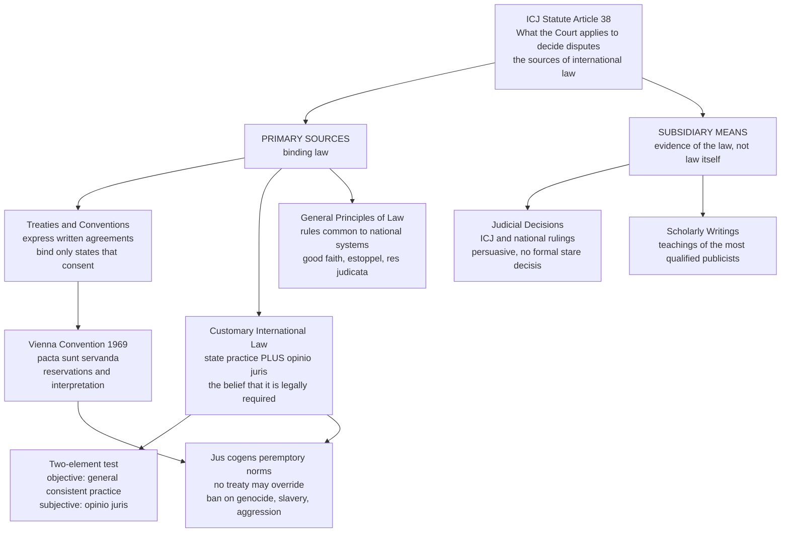

# 🌐 Public International Law

> [!abstract] TL;DR
> **Public international law (PIL)** is the body of rules governing relations between **states** — and, increasingly, between states and international organisations, individuals, and corporations. Unlike domestic law it is **horizontal**: there is no world legislature, no global police, and no court whose jurisdiction is compulsory. Its rules come from the classic list in **Article 38 of the ICJ Statute** — **treaties**, **customary international law** (state practice + *opinio juris*), **general principles of law**, plus **judicial decisions and scholarship** as subsidiary evidence. It works not through top-down coercion but through **consent, reciprocity, reputation, and decentralised enforcement** — which is why it is best understood as a legal order that mostly holds together the way cooperation holds together in a repeated game.

---

## Intuition

**Analogy — a neighbourhood with no city hall.** Imagine a street of homeowners with no mayor, no police force, and no court that can enter any house without the owner's permission. Nothing stops a neighbour from playing loud music at 3 a.m. except this: everyone has to keep living on the same street, indefinitely. If you dump rubbish on my lawn, I stop lending you my ladder, warn the other neighbours, and dump rubbish back. Because we all expect to deal with each other again next year, and the year after, most people keep the peace *without anyone ever calling an authority* — the authority does not exist. Promises get kept, boundaries get respected, and disputes usually settle, all through **reputation and tit-for-tat reciprocity** rather than a boss on top.

That street is the international system. The "homeowners" are **sovereign states**; the missing city hall is the absence of a world government (what International Relations theorists call **anarchy** — see [[The_State_System_and_Sovereignty]]). International law is the shared rulebook the neighbours have written down and mostly follow, enforced not by a superior authority but by the same forces that keep the street quiet: **consent** (you are bound by what you agreed to), **reciprocity** (mistreat my diplomats and yours suffer), and **the shadow of the future** (you will need these neighbours again). The surprise is not that states sometimes break the rules — it is how *routinely* they obey them.

---

## How It Works

### Is it really law? Austin's challenge

The nineteenth-century positivist **John Austin** defined law as the **command of a sovereign backed by a threat of sanction**. By that test, international law fails on both counts: there is no world sovereign above states, and no reliable central sanction. So Austin dismissed it as mere "**positive morality**" — a matter of opinion and etiquette, not real law.

The modern answer, associated with **H. L. A. Hart** (*The Concept of Law*, ch. 10), rejects Austin's premise. Law does not require a commanding sovereign; it requires **rules that officials and subjects treat as binding**. International law is a **horizontal legal system** whose obligations rest on **consent** and whose enforcement is **decentralised** — self-help, countermeasures, sanctions, and adjudication by consent. Hart conceded it lacks a unifying **rule of recognition** and a legislature, so it resembles a *set of rules* more than a fully developed *system* — but it is unmistakably law: it uses legal concepts, generates genuine obligations, and states argue in its terms even when they breach it. The very fact that a state caught violating international law offers a **legal justification** rather than shrugging "so what?" shows the rules are experienced as binding.

### The sources: ICJ Statute Article 38

Where do the rules come from? The canonical answer is **Article 38(1) of the Statute of the International Court of Justice**, which lists what the Court applies:

1. **Treaties and conventions** — express written agreements binding only on the states that **consent** to them (*pacta sunt servanda* — agreements must be kept; *pacta tertiis* — they bind no third party).
2. **Customary international law** — unwritten rules proven by **two elements**: (a) **state practice** that is general, consistent, and uniform, and (b) ***opinio juris sive necessitatis*** — the belief that the practice is followed **out of legal obligation**, not mere habit or courtesy. Custom binds *all* states except a **persistent objector** that dissented while the rule was forming.
3. **General principles of law** recognised by national legal systems — gap-fillers such as **good faith**, **estoppel**, *res judicata*, and no one should be a judge in their own cause.
4. **Judicial decisions and the teachings of the most highly qualified publicists** — **subsidiary means** for *determining* the law. They are **evidence of** the law, not law itself; there is no formal *stare decisis*, though the ICJ follows its own reasoning closely.

Sitting above ordinary rules are **peremptory norms** (*jus cogens*): a small set of non-derogable rules — prohibitions on **genocide, slavery, torture, and aggression** — that **no treaty may override** (Vienna Convention Art. 53), and which generate **obligations *erga omnes*** owed to the whole international community.

### The subjects: who has rights and duties

- **States** — the **primary** subjects, with full legal personality.
- **International organisations** — the UN was held to have its own legal personality in the ICJ's *Reparations* advisory opinion (1949).
- **Individuals** — bearers of **human rights** and, since Nuremberg, of **criminal responsibility** for the gravest crimes.
- **Corporations** — increasingly relevant through investment treaties, sanctions, and business-and-human-rights norms.

### Statehood and sovereignty

A **state** exists, on the classic **Montevideo Convention** (1933) test, if it has (1) a **permanent population**, (2) a **defined territory**, (3) an **effective government**, and (4) the **capacity to enter into relations** with other states. Whether **recognition** by others is *constitutive* (creates the state) or merely *declaratory* (acknowledges a fact) is contested — the declaratory view prevails in theory, but recognition matters enormously in practice.

Sovereignty has two faces: **sovereign equality** (every state is legally equal — UN Charter Art. 2(1)) and **non-intervention** in domestic affairs (Art. 2(7)). Both are eroding under the pressure of **human rights** and doctrines like the **Responsibility to Protect**, producing the central modern tension: when may the "neighbours" breach the gate to stop a state abusing its own people?

### Treaties: the Vienna Convention

The **Vienna Convention on the Law of Treaties** (VCLT, 1969) codifies the treaty life-cycle: **formation** (signature, ratification, entry into force), **reservations** (a state's attempt to exclude or modify a provision for itself, valid unless incompatible with the treaty's object and purpose), **interpretation** (Arts. 31–32: ordinary meaning, in context, in light of object and purpose), and the master rule **pacta sunt servanda**. A treaty conflicting with *jus cogens* is **void**.

### Enforcement without a police force

- **Self-help and countermeasures** — an injured state may take otherwise-unlawful measures (e.g. suspending its own treaty obligations) to induce the wrongdoer back into compliance, subject to **proportionality**.
- **State responsibility** — the ILC's **Articles on State Responsibility** (2001) govern **attribution** of conduct and the consequences of a wrongful act.
- **Sanctions** — collective economic or political pressure, sometimes mandated by the **UN Security Council** under **Chapter VII** (the only genuinely *binding* enforcement organ; its five permanent members hold a **veto**).
- **Adjudication** — the **ICJ** settles disputes, but its **jurisdiction is consent-based**: a state can be sued only if it has accepted the Court's jurisdiction (by treaty clause, special agreement, or the **optional clause** of Art. 36(2)).

### Domestic reception: monism vs dualism

- **Monism** — international and domestic law form one order; a ratified treaty is *automatically* part of domestic law and may be **self-executing** (e.g. the Netherlands).
- **Dualism** — they are separate orders; a treaty binds internationally on ratification but needs **domestic legislation** to have effect in national courts (e.g. the UK).



---

## Key Concepts

### Secondary (foundations)

- **Law among equals.** International law governs how countries treat each other. No world government stands above states, so the rules rest on **agreement** rather than command.
- **Two main kinds of rule.** A **treaty** is a written agreement countries sign; **custom** is a rule that has grown up because states have long behaved that way and believe they *must*.
- **The United Nations.** The main forum for cooperation; its **Security Council** can order binding sanctions or authorise force, but its five permanent members can each **veto**.
- **Sovereignty.** Each state is the highest authority inside its own borders and is legally equal to every other — big or small.

### Undergraduate (structure and doctrine)

- **Article 38** — memorise the source hierarchy: treaties, custom, general principles; then judicial decisions and scholarship as *subsidiary*.
- **The two-element test for custom** — practice **and** *opinio juris*. Practice without the sense of legal obligation is mere usage; belief without practice is aspiration. Watch the **persistent objector** exception.
- **Consent and its limits** — *pacta sunt servanda* (keep your agreements) and *pacta tertiis* (treaties bind no third party) follow from consent; **jus cogens** is the exception where consent cannot override.
- **VCLT mechanics** — formation, **reservations** (object-and-purpose test), interpretation (Arts. 31–32), termination, and material breach.
- **Subjects and personality** — states are primary; the *Reparations* opinion (1949) gave the UN legal personality; individuals bear rights and criminal duties.
- **State responsibility** — attribution of conduct to a state, breach of an obligation, and lawful **countermeasures** in response.
- **Monism vs dualism** — how (and whether) international law enters domestic courts.

### Graduate (theory and frontier)

- **The Austin–Hart debate** — is PIL "really law"? Hart's answer: it is law but lacks secondary rules (no unifying **rule of recognition**, no legislature), so it is a *set* of primary rules rather than a mature *system* — see [[Philosophy_of_Law_Jurisprudence]].
- **The compliance puzzle** — competing theories of *why* states obey without a sovereign: **managerial** (Chayes & Chayes — non-compliance is mostly capacity failure, cured by transparency and assistance), **enforcement** (Downs — deep cooperation needs real punishment), and **rational-choice/reputational** (Guzman — states comply to protect reputation and future reciprocity). The last connects directly to **repeated games** — see the demo and [[Repeated_Games_and_Folk_Theorems]].
- **Fragmentation** — the proliferation of specialised regimes (trade, human rights, environment, investment) governed by *lex specialis*, raising conflict-of-norms and forum-shopping problems.
- **Jus cogens and *erga omnes*** — peremptory norms and obligations owed to all (*Barcelona Traction*, 1970); the tension with the consent principle.
- **Sovereignty vs humanity** — humanitarian intervention and the **Responsibility to Protect** against the Art. 2(4) prohibition on force; when, if ever, may sovereignty be pierced?
- **Sources in flux** — "instant custom," **soft law** (non-binding declarations, guidelines, pledge-and-review regimes like the Paris Agreement), and whether Security Council practice is quasi-legislative.

---

## Python Demo

```python
# The compliance puzzle: why do sovereign states obey international law
# when there is no world police to enforce it?
#
# Model each pair of interacting states as an INFINITELY REPEATED
# prisoner's dilemma. Each period a state chooses:
#     C = Comply with the treaty        D = Defect / renege
#
# Stage-game payoffs (T > R > P > S):
#     R  reward     : both comply
#     T  temptation : you renege while your partner still complies
#     S  sucker     : you comply while your partner reneges
#     P  punishment : both renege  (trade war, tit-for-tat retaliation)
#
# Under a RECIPROCAL strategy (grim trigger / tit-for-tat), permanent
# compliance is a self-enforcing equilibrium iff the discount factor
#       delta >= delta_star = (T - R) / (T - P)
#
# delta is the "shadow of the future": how much tomorrow's payoff and
# reputation are worth today = patience * probability the relationship
# continues. Reputation and reciprocity raise delta; a short horizon
# (a regime about to collapse) lowers it and unravels compliance.
import numpy as np
import matplotlib.pyplot as plt

R, P, S = 3.0, 1.0, 0.0        # reward, punishment, sucker (fixed)

# ---- Panel 1: critical discount factor vs the temptation to renege ----
T_vals = np.linspace(R + 0.05, 8.0, 400)      # temptation must exceed reward
delta_star = (T_vals - R) / (T_vals - P)      # threshold for compliance

# ---- Panel 2: comply-forever vs renege-once, for one fixed game -------
T_fixed = 5.0
delta = np.linspace(0.0, 0.999, 400)
U_comply  = np.full_like(delta, R)                    # R every period
U_deviate = (1 - delta) * T_fixed + delta * P         # grab T once, punished forever
d_star_fixed = (T_fixed - R) / (T_fixed - P)

fig, (ax1, ax2) = plt.subplots(1, 2, figsize=(13, 5.2))

# Panel 1 ---------------------------------------------------------------
ax1.plot(T_vals, delta_star, color="#c62828", lw=2.2,
         label="critical discount factor delta*")
ax1.fill_between(T_vals, delta_star, 1.0, color="#2e7d32", alpha=0.25,
                 label="compliance self-enforcing")
ax1.fill_between(T_vals, 0.0, delta_star, color="#c62828", alpha=0.12,
                 label="treaty breaks down")
ax1.set_xlabel("Temptation to renege  T  (gain from cheating a complier)")
ax1.set_ylabel("Discount factor  delta  (weight on the future)")
ax1.set_title("Higher temptation demands a longer shadow of the future",
              fontsize=10, fontweight="bold")
ax1.set_ylim(0, 1)
ax1.legend(fontsize=8, loc="lower right")
ax1.grid(alpha=0.3)

# Panel 2 ---------------------------------------------------------------
ax2.plot(delta, U_comply,  color="#1565c0", lw=2.2, label="comply forever")
ax2.plot(delta, U_deviate, color="#c62828", lw=2.2, label="renege once, then punished")
ax2.axvline(d_star_fixed, color="#555555", ls="--", lw=1.4)
ax2.annotate(f"delta* = {d_star_fixed:.2f}",
             xy=(d_star_fixed, 2.0), xytext=(d_star_fixed + 0.10, 1.3),
             fontsize=9, arrowprops=dict(arrowstyle="->"))
ax2.fill_between(delta, U_comply, U_deviate,
                 where=(delta >= d_star_fixed), color="#2e7d32", alpha=0.20)
ax2.set_xlabel("Discount factor  delta")
ax2.set_ylabel("Discounted average payoff")
ax2.set_title(f"For T={T_fixed:.0f}: compliance beats cheating once delta >= {d_star_fixed:.2f}",
              fontsize=10, fontweight="bold")
ax2.set_ylim(0, T_fixed + 0.5)
ax2.legend(fontsize=8, loc="center right")
ax2.grid(alpha=0.3)

fig.suptitle("Why states obey international law without a world police: "
             "reciprocity in a repeated game", fontsize=12, fontweight="bold")
plt.tight_layout(rect=[0, 0, 1, 0.95])
plt.savefig("international_law_compliance.png", dpi=120, bbox_inches="tight")
plt.show()

print(f"Fixed game  T={T_fixed}, R={R}, P={P}:")
print(f"  compliance is self-enforcing when delta >= {d_star_fixed:.3f}")
print("  Interpretation: as long as states expect to keep interacting")
print("  (high delta), tit-for-tat retaliation makes treaty compliance")
print("  a stable equilibrium -- no world police required.")
```

**What it shows.** Panel 1 plots the **critical discount factor** `delta* = (T − R)/(T − P)`: the green region above the curve is where **compliance is self-enforcing**, and the boundary *rises* as the temptation to cheat grows — treaties governing high-stakes defections (arms, trade) need a **longer shadow of the future** to hold. Panel 2 fixes one game and shows the discounted payoff from **complying forever** overtaking the payoff from **reneging once and being punished forever** exactly at `delta*`. The economic content of `delta` — patience times the probability the relationship continues — is precisely **reputation and reciprocity**: this is why states honour treaties with partners they expect to deal with indefinitely, and why compliance frays when a state expects the relationship (or its own regime) to end soon.

---

## Real-World Applications

> **Diplomatic immunity — reciprocity in its purest form.** The **Vienna Convention on Diplomatic Relations** (1961) is one of the most obeyed treaties in history, because the enforcement is instant and symmetric: mistreat *their* ambassador and *yours* is mistreated next. No court is needed; the repeated-game logic of the demo enforces it directly.

> **Nicaragua v. United States (ICJ, 1986).** The Court held the US had breached customary rules on the non-use of force and non-intervention by mining Nicaragua's harbours and backing the Contras. The case is the textbook illustration of both **customary international law** (the Court reasoned from state practice and *opinio juris*) and the **limits of consent-based enforcement**: the US withdrew from the proceedings and never paid, showing that a judgment without a police force depends on reputation and political pressure to bite.

> **WTO dispute settlement — legalised countermeasures.** When a member breaks trade rules, the injured member may be **authorised to retaliate** with proportionate tariffs. This institutionalises the tit-for-tat of the demo: sanctioned reciprocity keeps a decentralised regime compliant far more reliably than moral suasion.

> **UN Security Council Chapter VII.** The one place international law has *centralised* binding enforcement: SC Resolution 678 (1990) authorised force to reverse Iraq's invasion of Kuwait; Resolution 1973 (2011) authorised protection of civilians in Libya under Responsibility-to-Protect reasoning. The **veto** is why this enforcement is selective rather than uniform.

> **The Paris Agreement (2015) — soft law and reputation.** With no binding emissions targets and no sanctions, compliance rests almost entirely on **transparency, peer review, and reputational cost** — the "managerial" model of compliance in action, and a live test of whether reputation alone can sustain cooperation when the temptation to free-ride is high.

---

## Common Pitfalls

- **"There's no police, so it isn't real law."** This is Austin's error: it confuses *centralised* enforcement with *law*. International law is a **horizontal** legal system enforced through consent, reciprocity, and self-help — its normativity is shown by the fact that violators offer legal *justifications* rather than denying the rules exist.
- **Treating any state behaviour as custom.** Custom needs **both** consistent practice **and** *opinio juris*. Diplomatic courtesies (like flag salutes) are practised widely but with no sense of legal obligation, so they are *comity*, not law.
- **Assuming treaties bind everyone.** By *pacta tertiis*, a treaty binds only its parties. A state that never ratified a convention is not bound by it (unless the rule has *also* crystallised into custom or *jus cogens*).
- **Assuming the ICJ has compulsory jurisdiction.** It does **not** — a state can be sued only if it has **consented** (by clause, special agreement, or the optional clause). Forgetting this is the single most common student error about enforcement.
- **Confusing recognition with statehood.** Under the declaratory theory, a state exists once it meets the **Montevideo** criteria; recognition by others is politically decisive but not legally constitutive.
- **Assuming a ratified treaty is automatically domestic law.** That is true only in **monist** systems; in **dualist** ones a treaty needs implementing legislation before national courts will apply it.
- **Overstating UN General Assembly resolutions.** They are generally **recommendations**, not binding law (though they can evidence *opinio juris*). Only **Security Council** decisions under Chapter VII bind.

---

## Related Concepts

- [[Sources_of_Law]] — the domestic doctrine of legal pedigree; international sources are one branch of it, and reception via monism/dualism links the two.
- [[Law_and_Legal_Systems_Overview]] — situates the domestic-vs-international divide and the public/private split that PIL sits within.
- [[Philosophy_of_Law_Jurisprudence]] — the Austin-vs-Hart "is it really law?" debate and the positivist theory of legal obligation.
- [[The_State_System_and_Sovereignty]] — the Westphalian foundation of sovereign equality, non-intervention, and international anarchy on which PIL rests.
- [[International_Institutions_and_Multilateralism]] — the UN system, the Security Council, and international organisations as subjects of PIL.
- [[Human_Rights_and_International_Law]] — the human-rights regime that most sharply pressures classical sovereignty.
- [[Repeated_Games_and_Folk_Theorems]] — the formal engine behind the compliance puzzle: reciprocity and the shadow of the future sustaining cooperation.
- [[Nash_Equilibrium]] — compliance modelled as a self-enforcing equilibrium no party can profitably deviate from.

---

## Review Questions

**Secondary.** International law has no world government and no global police. Give one everyday reason why countries usually keep their treaties anyway, and one situation where you would expect a country to break the rules.

**Undergraduate.** A state has practised a certain conduct toward foreign fishing vessels for fifty years. Another state claims this is now a rule of **customary international law** binding on everyone. What **two** elements must be proven, how would you establish each, and what argument could a state that always objected raise to escape the rule?

**Graduate.** "International law is obeyed because it pays to be seen as reliable, not because anyone can be forced." Evaluate this claim using the **repeated-game / reputational** account of compliance. Where does the argument break down — and how do **jus cogens** norms and **humanitarian intervention** sit uneasily with a purely consent-and-reciprocity model?

---

## Sources

- International Court of Justice, [*Statute of the Court*, Article 38](https://www.icj-cij.org/statute) — the authoritative list of the sources of international law.
- United Nations, [*Vienna Convention on the Law of Treaties* (1969)](https://legal.un.org/ilc/texts/instruments/english/conventions/1_1_1969.pdf) — formation, reservations, interpretation, *pacta sunt servanda*, and *jus cogens*.
- Crawford, James. *Brownlie's Principles of Public International Law*, 9th ed. (Oxford University Press, 2019) — the standard treatise on sources, statehood, and responsibility.
- Guzman, Andrew T. *How International Law Works: A Rational Choice Theory* (Oxford University Press, 2008) — reputation, reciprocity, and the compliance puzzle.
- Hart, H. L. A. *The Concept of Law*, 3rd ed. (Oxford University Press, 2012), ch. 10 "International Law" — the reply to Austin's challenge.

---

#law #international-law #sovereignty #treaties #customary-law
