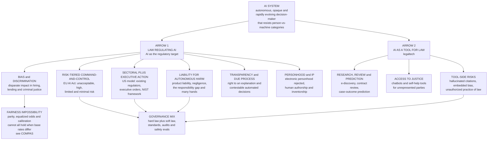

# ⚖️ AI and the Law

> [!abstract] TL;DR
> **AI and the law** describes a *two-way* relationship. Running one way, **law regulates AI**: legal systems must govern a genuinely new kind of actor — **autonomous** (it acts without a human in the loop), **opaque** (even its makers cannot fully explain a given output), and **rapidly evolving** (the technology outpaces the statute). The regulatory response splits into the **EU's risk-tiered command-and-control model** (the **AI Act**: *unacceptable / high / limited / minimal* risk), the **US sectoral-plus-executive-order** approach, and a global layer of **soft law and standards**. Its hardest sub-problems are **liability for autonomous harm** (the *responsibility gap* — who pays when no human was negligent?), **algorithmic bias** (disparate impact in hiring, lending, and criminal justice, where **fairness-impossibility results** prove you cannot satisfy every fairness metric at once), **transparency and the "right to an explanation"**, **automated decision-making and due process**, **legal personhood** (almost universally *rejected* for machines), and **AI and intellectual property** (training-data copyright, machine authorship/inventorship). Running the other way, **AI is a tool for law** (*legaltech*): e-discovery, contract review, legal research, case-outcome prediction, and access-to-justice apps — powerful, but freighted with **hallucination**, **embedded bias**, and the **unauthorized-practice-of-law** question.

---

## Intuition

**Analogy:** Every legal system is a filing cabinet of **categories** built up over centuries — *person* and *thing*, *principal* and *agent*, *manufacturer* and *product*, *author* and *tool*, *the reasonable person* who is the yardstick of care. When something new appears, the law does not invent a fresh drawer; it reaches for the *closest existing folder* and files the newcomer there. A corporation? File it under "person" (a legal fiction that works). A dangerous escaped tiger? File it under "thing your owner is strictly liable for."

Now a self-driving car swerves and injures a pedestrian, and the clerk's hand hovers over the cabinet — and *finds no folder that fits*. It is not quite a **product** (a defective toaster does not *learn* and *choose* mid-toast). It is not quite an **agent** (an agent is a legally responsible person you can sue or jail). It is not quite a **tool** (a hammer does not decide *when* to strike). AI is the first artifact that is simultaneously **autonomous, opaque, and adaptive** — an actor that *makes consequential decisions* yet is *not a person*, whose reasoning *cannot be read off* even by its designers, and whose behavior *changes after deployment*. Law's whole method is analogy to the past; AI is the case where the analogies quietly break.

Hold that image, because it explains *both* directions of this note. When law tries to **regulate** AI, it is struggling to force an unprecedented actor into person-and-machine categories designed for humans and simple tools. When lawyers **use** AI, they are handing that same opaque, non-responsible actor a role — advising, predicting, drafting — that the profession built entirely around *responsible human judgment*. The tension is identical; only the direction of the arrow flips.

---

## How It Works

The subject only makes sense if you keep the **two arrows** separate. Arrow 1: the AI system is the *object* the law acts on (a regulatory target). Arrow 2: the AI system is the *instrument* the law acts *with* (legaltech). The properties that make Arrow 1 hard — autonomy, opacity, adaptivity — are exactly what make Arrow 2 dangerous.

### Arrow 1 — Law regulating AI

**Why AI resists ordinary regulation.** Three features fight the standard legal toolkit. **Autonomy** severs the tight causal chain between a human decision and an outcome that tort and criminal law rely on to assign blame. **Opacity** (the "black box" of a deep network) defeats the law's demand that decisions affecting rights be *reason-giving* and *reviewable*. **Adaptivity / velocity** means a rule written for last year's model regulates a system that no longer exists — the **pacing problem**, where legislation always trails the technology.

**The three regulatory architectures.**

1. **Risk-tiered command-and-control — the EU AI Act (2024).** The world's first comprehensive horizontal AI statute sorts systems into four tiers of *risk* and regulates by tier, not by technology:
   - **Unacceptable risk** — *banned outright* (government social scoring, most real-time public biometric surveillance, manipulative or exploitative systems).
   - **High risk** — *permitted but heavily obligated* (AI in hiring, credit, education, medical devices, critical infrastructure, law enforcement). Duties include risk management, data-governance and bias testing, technical documentation, logging, **human oversight**, transparency, and conformity assessment *before* market entry.
   - **Limited risk** — *transparency duties only* (a chatbot must disclose it is a machine; deepfakes must be labeled).
   - **Minimal risk** — spam filters, game AI — essentially unregulated.
   Plus a bolt-on regime for **general-purpose / foundation models** with systemic-risk thresholds. This is *ex ante*, product-safety-style regulation — an administrative apparatus (see [[Administrative_Law_and_Regulation]]).
2. **Sectoral plus executive action — the US model.** No single federal AI statute. Instead, **existing regulators apply existing law to AI in their sector** — the EEOC to hiring algorithms (Title VII), the CFPB to credit scoring (fair-lending law), the FDA to medical AI, the FTC to deceptive/unfair AI practices — supplemented by **executive orders**, the **NIST AI Risk Management Framework** (voluntary), and a patchwork of **state laws**. Lighter-touch and innovation-friendly, but fragmented and reactive.
3. **Soft law and standards.** Below the statutes sits a thick layer of *non-binding* governance: the OECD AI Principles, UNESCO recommendations, ISO/IEC standards, corporate AI-ethics boards, and audit regimes. Cheap, fast, and global — but unenforceable, and vulnerable to **ethics-washing**.

**Liability for autonomous harm — the responsibility gap.** When an autonomous system injures someone, the law's causal machinery jams. Two classic routes exist. **Product liability** treats the AI as a defective *product* — the maker pays for a *manufacturing*, *design*, or *warning* defect, often on a **strict-liability** basis (no fault needed). But a learning system that behaves unpredictably after sale strains the very idea of a fixed "defect," and manufacturers invoke the *state-of-the-art* defense. **Negligence** asks whether some human (developer, deployer, user) breached a *duty of care* — but here opacity and the **problem of many hands** bite: dozens of actors touch a model, no single one is clearly at fault, and the outcome may have been *no human's* fault at all. That remainder is the **responsibility gap** (Matthias): genuine harm with no blameworthy human. Proposed fixes include **strict liability on the deployer/operator**, mandatory **insurance pools**, and the EU's now-shelved **AI Liability Directive** easing the victim's burden of proof. The doctrinal home for all of this is [[Tort_Law]].

**Algorithmic bias and discrimination.** Models trained on historical data *inherit and launder* historical inequality, producing **disparate impact** (a facially neutral rule that falls harder on a protected group) in hiring, lending, and criminal justice. The most cited example, **COMPAS**, is a recidivism-risk score used in US sentencing and bail; a 2016 ProPublica investigation found it assigned Black defendants higher false-positive (wrongly "high-risk") rates than white defendants — even though the vendor could show the score was *calibrated* equally across groups (see [[Theories_of_Punishment]]). Both claims were *true at once*, which is the whole point: **fairness-impossibility theorems** (Kleinberg–Mullainathan–Raghavan; Chouldechova) prove that when **base rates differ across groups**, no classifier can simultaneously satisfy **calibration**, **equal false-positive/false-negative rates (equalized odds)**, and **demographic parity**, except in trivial cases. Fairness is therefore not a bug to be engineered away but a *value trade-off the law and policy must adjudicate* — connecting directly to [[AI_Bias_and_Fairness]] and the Python demo below.

**Transparency, explainability, and the right to an explanation.** The rule of law demands that decisions affecting rights be *reasoned* and *contestable*; an unexplained algorithmic denial of a loan, a job, or parole offends that demand. The EU **GDPR** grants rights around **solely automated decisions** with legal or similarly significant effects (a contested "right to an explanation"), and the AI Act adds transparency duties. Technically this pulls in **explainable AI** methods ([[Explainable_AI]]) — but a post-hoc explanation of a black box is not the same as a decision that was *actually* made for good reasons.

**Automated decision-making and due process.** When the *state* automates benefits eligibility, fraud detection, or risk scoring, constitutional **due process** ([[Rule_of_Law_and_Due_Process]]) requires notice, a chance to be heard, and a reasoned, reviewable decision. Opaque, unappealable "computer says no" systems — welfare-fraud algorithms wrongly cutting benefits — have been struck down or scandalized precisely for denying these guarantees.

**Legal personhood for AI.** Should an AI or robot be a **legal person** who can hold rights, own property, or bear liability? The idea (floated in a 2017 European Parliament resolution on "electronic personhood") is *overwhelmingly rejected*. Personhood is the law's device for locating a **responsible, rights-bearing subject**; granting it to a machine would create a *liability shield* for the humans behind it without any of personhood's moral basis. Corporations are "persons" only because responsible *humans* stand behind them — see [[Rights_Duties_and_Legal_Concepts]].

**AI and intellectual property.** Two live fronts. **Input:** does training a model on copyrighted text and images *infringe*, or is it **fair use / text-and-data-mining**? (Litigation is ongoing worldwide.) **Output:** can AI-generated work be *owned*? US Copyright Office and courts require **human authorship** (the "monkey selfie" logic — no human author, no copyright), and patent offices have refused to name an AI ("DABUS") as **inventor**. Machines, for now, neither infringe as authors nor qualify as ones.

**Systemic and existential-risk regulation.** A distinct strand targets not individual harms but **catastrophic and systemic risk** from frontier models — misuse (bio/cyber), loss of control, and concentration of power. This is where AI law meets AI **safety** governance ([[Responsible_AI]]): compute thresholds, pre-deployment evaluations, and frontier-model reporting duties.

### Arrow 2 — AI as a tool for law (legaltech)

The same technology is transforming legal *practice*: **e-discovery** (technology-assisted review triaging millions of documents), **contract review and due diligence**, **legal research** (natural-language case search), and **predictive justice** (statistical prediction of case outcomes and judicial behavior). Its most hopeful use is **access to justice** — chatbots and self-help tools for the vast majority of people who cannot afford a lawyer (a core justice-gap problem). But Arrow 2 inherits Arrow 1's pathologies: models **hallucinate** citations (lawyers have been sanctioned for filing fake AI-generated cases), they **embed bias** into predictions, and consumer-facing legal AI collides with the **unauthorized practice of law** (UPL) — the rule that only licensed humans may give legal advice.

### Flow / Architecture



---

## Key Concepts

### Secondary level

- **The two-way street.** AI and law meet in two ways: the law tries to make *rules for* AI, and lawyers *use* AI to do their jobs. Both are hard for the *same* reason — AI decides things on its own and no one can fully explain how.
- **Who is to blame?** If a self-driving car hurts someone, the law does not know whom to point at — the driver? the carmaker? the programmer? No one? That puzzle is the **responsibility gap**.
- **Unfair robots.** An AI that learns from the past can copy the *unfairness* of the past — turning down loans or job applicants from some groups more often. This is **algorithmic bias**.
- **Is a robot a person?** Almost everyone says *no*. Being a "legal person" means you can be responsible and hold rights; a machine cannot really be either.
- **Robots doing lawyer work.** AI can search cases and draft contracts fast, but it sometimes *makes things up* (hallucinates), so a human lawyer must always check it.

### Undergraduate level

- **Autonomy, opacity, velocity.** The three properties that break ordinary legal categories: AI acts without a human deciding each step (autonomy), cannot be fully explained (opacity/black box), and changes faster than laws can be written (the **pacing problem**).
- **The EU AI Act's four risk tiers.** *Unacceptable* (banned), *high* (heavy obligations before market entry — hiring, credit, justice), *limited* (transparency only), *minimal* (unregulated). Regulation is **risk-based** and **ex ante**, like product safety.
- **US sectoral vs EU horizontal.** The EU passes one *horizontal* statute covering all AI; the US applies *existing sector rules* (EEOC, FTC, FDA, CFPB) plus executive orders and the voluntary **NIST AI RMF**. Trade-off: comprehensiveness vs flexibility.
- **Strict vs fault liability for AI.** *Product liability* (often **strict** — pay regardless of fault, focus on a "defect") vs **negligence** (pay only for a breach of a duty of care). Learning systems and the **problem of many hands** strain both.
- **Disparate impact and COMPAS.** A neutral rule with a discriminatory *effect* is disparate impact. **COMPAS** is the canonical criminal-justice case: equal calibration across race yet unequal false-positive rates — a *true* contradiction, not an error (see [[Theories_of_Punishment]]).
- **Right to an explanation and due process.** GDPR rights over *solely automated decisions* and the constitutional demand ([[Rule_of_Law_and_Due_Process]]) that state decisions be reasoned, noticed, and contestable — hard to meet with a black box.
- **Human authorship / inventorship.** IP law currently requires a *human* creator; AI can be neither an *author* (copyright) nor an *inventor* (patents), and training on copyrighted data raises a live fair-use question.
- **Legaltech and UPL.** AI in e-discovery, contract review, research, and access-to-justice apps — bounded by the **unauthorized-practice-of-law** rule and the hallucination problem.

### Graduate level

- **The responsibility gap, precisely (Matthias).** A machine whose behavior is *not fully determined or foreseeable* by any human creates outcomes for which no human satisfies the standard conditions of moral/legal responsibility (control + knowledge). The gap is not a *drafting* failure but a *structural* one; "fill it" proposals (strict operator liability, mandatory insurance, risk pools, an "AI liability directive" reversing the burden of proof) are *allocations* of an inescapable residual loss, not a discovery of the "real" wrongdoer.
- **Fairness impossibility as a jurisprudential result.** Kleinberg–Mullainathan–Raghavan and Chouldechova convert a *values* dispute into a *theorem*: with unequal base rates, **calibration**, **balance for the positive class / equalized odds**, and **statistical (demographic) parity** are mutually exclusive. Consequently *there is no neutral, "unbiased" algorithm* — every deployed model encodes a contestable choice among fairness definitions, which is exactly the kind of value trade-off courts and legislatures, not engineers, are constituted to make. This dissolves the naive "just remove the bias" demand.
- **Ex ante vs ex post regulation.** The EU AI Act is *ex ante* product safety (conformity assessment before harm); tort is *ex post* (compensation after harm). Each has a comparative-institutional profile: ex ante prevents but freezes innovation and struggles with adaptive systems; ex post is flexible but leaves victims uncompensated when the responsibility gap opens. Optimal governance is a *layered* mix, echoing the safety-regulation-vs-liability debate in law and economics.
- **The Collingridge dilemma / pacing problem.** Early on, a technology is easy to steer but its impacts are unknown; by the time impacts are clear, the technology is entrenched and hard to steer. AI regulation is a live instance — and an argument for **adaptive, principles-based, standard-referencing** regulation (co-regulation, regulatory sandboxes) over rigid rules.
- **Explanation vs justification.** A **post-hoc** explanation (LIME/SHAP-style feature attributions, [[Explainable_AI]]) tells you *what correlated with* an output; it does not show the decision was made *for legally adequate reasons*. Administrative law's reason-giving requirement wants the latter. This gap is why "explainability" is necessary but not sufficient for due process.
- **Legal personhood as a functional, not metaphysical, category.** The corporate analogy is misleading: a corporation is a *nexus of responsible humans* with assets to satisfy judgments and principals to be deterred. "Electronic personhood" would provide a *liability shield* and a locus of rights with *none* of those functional preconditions — hence its near-universal rejection ([[Rights_Duties_and_Legal_Concepts]]); the real work is done by rules attributing machine acts to human principals.
- **The generative-AI IP frontier.** *Input* infringement (training on protected works) versus *output* protectability (human-authorship threshold) versus *output* infringement (a model reproducing protected expression) are three distinct questions with different doctrinal tests; conflating them is the field's most common analytic error.
- **Predictive justice and the anchoring risk.** Case-outcome prediction can *entrench* the past (predicting what courts *did*, thereby normalizing it) and can *anchor* human judges to a score (automation bias). France has even *banned* judge-analytics; the deeper worry is a shift from *normative* adjudication (what the law *requires*) to *predictive* adjudication (what a model *forecasts*).

---

## Python Demo

**What this shows.** The single sharpest reason law must *choose* among fairness definitions instead of "removing bias": the **fairness-impossibility result** in a legal decision context (hiring, lending, or a COMPAS-style risk score). Two groups have **different base rates**. We give everyone a **risk/merit score that is perfectly calibrated and calibrated *identically* across groups** — the score genuinely means the same thing for both. Then we apply a threshold classifier and measure the three canonical fairness criteria. The punchline: even with calibration held fixed *by construction*, **demographic parity** (equal selection rate) and **equalized odds** (equal true-/false-positive rates) are *both* violated at every threshold — and forcing parity with group-specific thresholds re-opens the error-rate gap. There is no free lunch; the law must adjudicate the trade-off. Connects to [[AI_Bias_and_Fairness]] and the COMPAS debate in [[Theories_of_Punishment]]. numpy + matplotlib only.

```python
# Fairness impossibility in a legal decision (hiring / lending / risk assessment).
# Two groups differ in BASE RATE. A single risk score is CALIBRATED for both groups
# (score s = P(favorable outcome | s), the SAME calibration map for A and B). We show
# a threshold classifier then cannot also equalize selection rate (demographic parity)
# or error rates (equalized odds) -- the Chouldechova / Kleinberg impossibility that
# law and policy (the COMPAS debate) must adjudicate.
import numpy as np
import matplotlib.pyplot as plt

rng = np.random.default_rng(42)
N = 40_000

# --- Two groups with DIFFERENT base rates -----------------------------------
# Beta gives each applicant a score in [0,1]. Drawing the label as Bernoulli(score)
# makes the score PERFECTLY CALIBRATED with an IDENTICAL map for both groups
# (P(y=1 | s) = s for A and for B). Only the score DISTRIBUTION -- hence the base
# rate -- differs. This isolates the impossibility from any "biased score" confound.
sA = rng.beta(2, 5, N)                       # Group A: lower scores
sB = rng.beta(5, 4, N)                       # Group B: higher scores
yA = (rng.random(N) < sA).astype(int)        # calibrated labels for A
yB = (rng.random(N) < sB).astype(int)        # calibrated labels for B
print(f"Base rate  Group A : {yA.mean():.3f}")
print(f"Base rate  Group B : {yB.mean():.3f}   (base rates differ -> impossibility bites)")

def metrics(s, y, t):
    yhat = (s >= t).astype(int)
    sel = yhat.mean()                                        # selection rate  -> parity
    tpr = yhat[y == 1].mean() if (y == 1).any() else 0.0     # true-positive rate -> odds
    fpr = yhat[y == 0].mean() if (y == 0).any() else 0.0     # false-positive rate -> odds
    ppv = y[yhat == 1].mean() if (yhat == 1).any() else 0.0  # precision -> predictive parity
    return sel, tpr, fpr, ppv

ts = np.linspace(0.02, 0.98, 200)
mA = np.array([metrics(sA, yA, t) for t in ts])
mB = np.array([metrics(sB, yB, t) for t in ts])

fig, ax = plt.subplots(1, 3, figsize=(15, 4.6))

# Panel 1: selection rate -> DEMOGRAPHIC PARITY
ax[0].plot(ts, mA[:, 0], lw=2, label="Group A")
ax[0].plot(ts, mB[:, 0], lw=2, label="Group B")
ax[0].set_title("Demographic parity\nselection rate = P(predict favorable)")
ax[0].set_xlabel("threshold t"); ax[0].set_ylabel("selection rate"); ax[0].legend()

# Panel 2: TPR and FPR -> EQUALIZED ODDS
ax[1].plot(ts, mA[:, 1], lw=2, label="TPR A")
ax[1].plot(ts, mB[:, 1], lw=2, label="TPR B")
ax[1].plot(ts, mA[:, 2], lw=2, ls="--", label="FPR A")
ax[1].plot(ts, mB[:, 2], lw=2, ls="--", label="FPR B")
ax[1].set_title("Equalized odds\nequal TPR and equal FPR across groups")
ax[1].set_xlabel("threshold t"); ax[1].set_ylabel("rate"); ax[1].legend(fontsize=8)

# Panel 3: PPV -> CALIBRATION / PREDICTIVE PARITY
ax[2].plot(ts, mA[:, 3], lw=2, label="PPV A")
ax[2].plot(ts, mB[:, 3], lw=2, label="PPV B")
ax[2].plot(ts, ts, color="gray", ls=":", label="score is calibrated")
ax[2].set_title("Calibration / predictive parity\nprecision at threshold")
ax[2].set_xlabel("threshold t"); ax[2].set_ylabel("PPV"); ax[2].legend(fontsize=8)

plt.tight_layout()
plt.savefig("fairness_impossibility.png", dpi=120)

# --- Single shared threshold: all three criteria cannot hold at once --------
t = 0.5
selA, tprA, fprA, ppvA = metrics(sA, yA, t)
selB, tprB, fprB, ppvB = metrics(sB, yB, t)
print(f"\nAt ONE shared threshold t = {t:.2f} (score calibrated identically for both):")
print(f"  selection rate  A={selA:.3f}  B={selB:.3f}  -> demographic-parity gap {abs(selA-selB):.3f}")
print(f"  false-pos rate  A={fprA:.3f}  B={fprB:.3f}  -> equalized-odds FPR gap  {abs(fprA-fprB):.3f}")
print(f"  true-pos  rate  A={tprA:.3f}  B={tprB:.3f}  -> equalized-odds TPR gap  {abs(tprA-tprB):.3f}")
print("  Calibration holds by construction, yet parity AND equalized odds are BOTH violated.")

# --- Try to FORCE demographic parity with group-specific thresholds ---------
# Pick t_A, t_B so both groups select the same fraction. This 'affirmative' fix now
# treats two applicants with the SAME risk score differently by group -- and STILL
# leaves the error rates unequal. Fixing one metric re-opens another: no free lunch.
target = 0.35
tA = np.quantile(sA, 1 - target)
tB = np.quantile(sB, 1 - target)
_, tprA2, fprA2, _ = metrics(sA, yA, tA)
_, tprB2, fprB2, _ = metrics(sB, yB, tB)
print(f"\nForcing demographic parity (each group selects the top {target:.2f} fraction):")
print(f"  thresholds must differ: t_A={tA:.3f}  vs  t_B={tB:.3f}  (same score, different verdict)")
print(f"  FPR still unequal: A={fprA2:.3f}  B={fprB2:.3f}   TPR: A={tprA2:.3f}  B={tprB2:.3f}")
print("  => Equalizing one fairness metric re-opens another. The LAW must choose which to honor.")
```

**Reading the output.** Panel 1 shows the two selection-rate curves *never coincide* — at any common threshold, the higher-base-rate group is selected more often (demographic parity fails). Panel 2 shows the TPR and FPR curves for A and B *never line up* either (equalized odds fails), and this is *forced* by the differing base rates, not by a biased score. Panel 3 confirms the score is calibrated. The single-threshold snapshot prints non-zero gaps on parity *and* both error rates simultaneously; the final block shows that *engineering* demographic parity requires **different thresholds for the two groups** — treating identical risk scores differently by group — and *still* leaves the error rates unequal. The impossibility is mathematical, so the choice among calibration, equalized odds, and parity is irreducibly **normative** — precisely the kind of value trade-off the legal system, not the model, exists to make.

---

## Real-World Applications

- **The EU AI Act (2024).** The first comprehensive AI statute; its **risk tiers** now shape global product design (the "Brussels effect"), forcing bias testing, human oversight, and conformity assessment on high-risk systems in hiring, credit, and justice.
- **COMPAS and criminal-justice risk scoring.** Recidivism/bail risk tools used across US courts; the 2016 ProPublica/Northpointe dispute is the textbook case that made fairness-impossibility a policy issue (see [[Theories_of_Punishment]]) and drove *Loomis v. Wisconsin* on due-process limits of secret algorithms in sentencing.
- **Automated hiring and the EEOC / NYC Local Law 144.** Resume screeners and video-interview scorers face disparate-impact scrutiny under Title VII; New York City now *mandates independent bias audits* of automated employment decision tools — bias regulation made concrete (links to [[Rights_and_Civil_Liberties]]).
- **Algorithmic welfare and due process.** Systems like Michigan's **MiDAS** (which falsely accused tens of thousands of unemployment fraud) and the Dutch **SyRI**/childcare-benefits scandal — struck down or repudiated for denying reasoned, contestable decisions ([[Rule_of_Law_and_Due_Process]]).
- **Generative-AI copyright litigation.** Suits over training data (authors, artists, and news organizations vs model developers) and Copyright Office refusals to register AI-only works — the live frontier of the human-authorship rule.
- **Self-driving cars and the liability question.** Crashes involving automated driving are the paradigm **responsibility-gap** case, pushing jurisdictions toward operator strict liability and mandatory insurance ([[Tort_Law]]).
- **Legaltech in practice.** E-discovery (technology-assisted review is judicially *endorsed*), contract-review and research tools, and access-to-justice chatbots — alongside sanctions against lawyers who filed **hallucinated** AI citations (*Mata v. Avianca*, 2023).

---

## Common Pitfalls

- **Treating AI as "just software" or "just a product."** The autonomy + opacity + adaptivity combination is what defeats the old categories; analogizing a learning system to a defective toaster hides exactly the features (post-sale behavior change, no readable reasons) that create the legal novelty.
- **Believing bias can be "removed" to yield a neutral algorithm.** The impossibility theorems prove there is *no* fairness-neutral classifier when base rates differ; "de-biasing" always *selects* a fairness definition. Demanding a model that satisfies calibration *and* equalized odds *and* parity is demanding a mathematical impossibility.
- **Conflating an explanation with a justification.** A SHAP/LIME attribution ([[Explainable_AI]]) shows *what correlated* with an output, not that the decision rested on *legally adequate reasons*. Due process wants the second; explainability alone does not deliver it.
- **Assuming legal personhood would "solve" liability.** Granting AI personhood mostly builds a **liability shield** for the humans behind it, without personhood's functional preconditions (assets, deterrable principals, moral agency). The problem is *attributing* machine acts to humans, not inventing a new person.
- **Reading US "no federal AI law" as "AI is unregulated."** Existing sectoral law (Title VII, fair-lending, FTC, FDA) *already* applies to AI; the gap is comprehensiveness and coordination, not the total absence of rules.
- **Ignoring the pacing/Collingridge problem when drafting rules.** Rigid, technology-specific statutes are obsolete on arrival; durable AI law is principles-based and references evolving standards, or it regulates *risk* and *use* rather than a named technique (the AI Act's design choice).
- **Using legaltech output without human verification.** Generative tools **hallucinate** citations and **embed** training-data bias; unsupervised reliance risks sanctions and, for consumer tools, the **unauthorized practice of law**.
- **Confusing prediction with adjudication.** A model that forecasts *what courts did* entrenches the past and can *anchor* judges (automation bias); it is not a substitute for deciding what the law *requires*.

---

## Related Concepts

- [[Tort_Law]] — the doctrinal home of AI-harm liability: product liability vs negligence, strict vs fault liability, and the **problem of many hands** that opens the responsibility gap.
- [[Theories_of_Punishment]] — the sentencing/criminal-justice context for **COMPAS** risk scoring, where fairness-impossibility and automated risk assessment collide with proportionality and desert.
- [[Rights_Duties_and_Legal_Concepts]] — the rights-and-personhood framework behind the (rejected) idea of legal personhood for AI: who can bear rights and duties, and why a machine cannot.
- [[Rule_of_Law_and_Due_Process]] — the constitutional demand for notice, a hearing, and *reasoned, contestable* decisions that opaque automated decision-making offends.
- [[Administrative_Law_and_Regulation]] — the regulatory apparatus (agencies, conformity assessment, rulemaking) through which the EU AI Act and US sectoral regulators actually govern AI.
- [[Rights_and_Civil_Liberties]] — anti-discrimination and equal-protection foundations behind disparate-impact claims against biased hiring, lending, and policing algorithms.
- [[AI_Bias_and_Fairness]] — the technical companion: demographic parity, equalized odds, calibration, and the impossibility results demonstrated in the Python demo.
- [[Responsible_AI]] — the governance/soft-law layer (frameworks, audits, safety evaluations) that complements hard-law regulation of AI systems.
- [[Explainable_AI]] — the interpretability toolkit (LIME, SHAP) invoked by transparency and right-to-explanation duties, and its limits versus genuine legal justification.

---

## Review Questions

1. **(Conceptual)** Explain the **responsibility gap** and why it is a *structural* feature of autonomous systems rather than a mere drafting oversight. Why do neither classic **product liability** nor **negligence** cleanly close it, and what does that imply about proposals for strict operator liability or mandatory insurance — are they *finding* the wrongdoer or *allocating* an unavoidable residual loss?
2. **(Scenario)** A bank deploys a calibrated credit-scoring model. Regulators observe that its **false-positive (wrongful-rejection) rate** is higher for one demographic group, and demand the bank "remove the bias" while keeping the score calibrated and also equalizing approval rates. Using the fairness-impossibility result from the Python demo, explain why the bank *cannot* satisfy all three demands when base rates differ, what each *possible* fix sacrifices, and why this makes the choice a matter for **law and policy** rather than engineering.
3. **(Trade-off)** Compare the EU AI Act's **ex ante, risk-tiered, horizontal** regulation with the US **ex post, sectoral, executive-order** approach. Evaluate each on (a) speed of protection versus innovation cost, (b) ability to handle *adaptive* post-deployment behavior, (c) the **pacing/Collingridge problem**, and (d) who bears the residual loss when harm still occurs. Which mix of *ex ante* regulation and *ex post* liability would you defend, and why?

---

## Sources

- European Union. *Regulation (EU) 2024/1689 laying down harmonised rules on artificial intelligence (Artificial Intelligence Act)* (2024). — the risk-tiered legal framework.
- Kleinberg, Jon; Mullainathan, Sendhil; Raghavan, Manish (2017). "Inherent Trade-Offs in the Fair Determination of Risk Scores." *Innovations in Theoretical Computer Science (ITCS)*. — the fairness-impossibility theorem.
- Chouldechova, Alexandra (2017). "Fair Prediction with Disparate Impact: A Study of Bias in Recidivism Prediction Instruments." *Big Data*, 5(2), 153–163. — the COMPAS impossibility result.
- Angwin, Julia; Larson, Jeff; Mattu, Surya; Kirchner, Lauren (2016). ["Machine Bias."](https://www.propublica.org/article/machine-bias-risk-assessments-in-criminal-sentencing) *ProPublica*. — the COMPAS investigation.
- Matthias, Andreas (2004). "The Responsibility Gap: Ascribing Responsibility for the Actions of Learning Automata." *Ethics and Information Technology*, 6(3), 175–183.
- NIST (2023). *AI Risk Management Framework (AI RMF 1.0)*. — the leading US soft-law standard.

---

#law #ai-law #algorithmic-accountability #ai-regulation #liability
