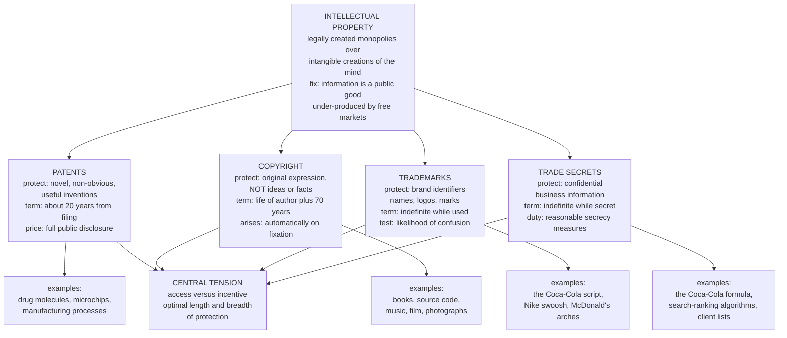

# 🧠 Intellectual Property Law

> [!abstract] TL;DR
> **Intellectual property (IP) law** grants legally protected, usually *temporary*, monopolies over **intangible creations of the mind** — inventions, expression, brand identifiers, and secret know-how. Its whole justification is economic: information is a **public good** (non-rival — my using an idea does not use it up; and hard to exclude — once disclosed, it is cheap to copy), so a pure market **under-produces** it, because creators cannot recoup their costs against free-riding imitators. IP fixes this by *manufacturing* excludability through law: it trades a period of monopoly (the price we pay in **deadweight loss** and restricted access) for the **incentive to create and disclose** things that otherwise would never exist. Four regimes carve up the field — **patents** (inventions, ~20 years, in exchange for public disclosure), **copyright** (original expression, life-plus-70, automatic on fixation), **trademarks** (brand identifiers, indefinite while used, to prevent consumer confusion), and **trade secrets** (confidential business information, indefinite while secret). The central, unresolved tension running through all of it is **access versus incentive**: the *optimal breadth and length* of protection.

---

## Intuition

**Analogy — a temporary toll road the state builds so someone will bother building the road.** Imagine a valley with no road. Building one is enormously expensive, but once it exists *anyone* can drive on it, and one car driving does not stop another (it is **non-rival**). No private company will build it, because the moment it opens, everyone uses it for free and the builder never recoups the cost. So the state strikes a bargain: *build the road, and for twenty years you may put up a tollbooth and charge whoever drives on it; after that, the toll comes down forever and the road belongs to the public.* The toll is annoying — some travellers who would happily have driven for free now stay home, and that lost travel is pure waste (**deadweight loss**). But without the promise of the toll, the road would never have been built at all, and *everyone* would have nothing. That temporary, deliberately-limited tollbooth is exactly what a patent or a copyright is: a state-granted, time-limited monopoly whose entire point is to make an intangible thing get *created* in the first place, after which it falls into the **public domain** for all to use freely.

The deep move is this: physical property (a field, a car) is *naturally* excludable — you can fence it, lock it. An idea, a melody, or a chemical formula is not. IP law's trick is to **create an artificial fence by statute** around something that has no natural walls, precisely because the intangible thing is so valuable to society yet so fatally easy to copy.

---

## How It Works

### The economic problem: information is a public good

Start from the failure IP is designed to cure. A new drug molecule, a novel, a song, a manufacturing process — the *information* content of each has two awkward properties (see [[Public_Goods]]):

1. **Non-rivalry.** One person's use of the idea does not diminish anyone else's. A formula can be used by a billion people simultaneously at zero marginal cost. Economically, the efficient price of a non-rival good is its marginal cost of *copying* — which is essentially zero.
2. **Non-excludability (once disclosed).** The *first* copy of a novel or a drug costs a fortune to produce (years of writing, a billion dollars of trials); every *subsequent* copy is nearly free. Once the work is out, imitators who bore none of the creation cost can undercut the creator.

Put together, these guarantee a **market failure** (see [[Market_Failures]]): a rational creator anticipates that competition will drive price to the near-zero copying cost, meaning they can never recover the huge **fixed cost of creation** — so the socially valuable work is **under-produced**, or not produced at all. This is the same free-rider logic that plagues national defence, applied to knowledge.

### The IP solution: manufacture excludability, and trade a monopoly for an incentive

IP law resolves the failure by *legally* granting the creator the right to **exclude** others from copying for a limited time. This lets the creator charge above the copying cost, earn back the fixed cost, and profit — restoring the incentive to create. But the cure has a side effect: by pricing above marginal cost, the IP holder behaves like a **monopolist** (see [[Monopoly]]), which creates a **deadweight loss** — the surplus destroyed because some people who value the good above its (near-zero) copying cost are priced out. This is the fundamental bargain, and it is a genuine trade-off, not a free lunch:

- **Static cost:** during the protection term, monopoly pricing and restricted access destroy surplus (the deadweight-loss triangle).
- **Dynamic benefit:** the *prospect* of that monopoly profit calls into existence inventions and works that would otherwise never have been created.

Society's job is to set the **length and breadth** of protection to balance these — enough to induce creation, not so much that the monopoly cost swamps the benefit. That optimisation problem is the intellectual heart of the entire field.

### The patent bargain: disclosure in exchange for exclusivity

Patents add a second, often-overlooked half to the deal. In return for the ~20-year monopoly, the inventor must **fully disclose** how the invention works, published for all to read. The alternative — keeping it a **trade secret** forever — would let the knowledge die with the inventor or leak chaotically. The **patent bargain** is therefore: *teach the world how to make your invention now, and in twenty years everyone may; in exchange, for twenty years only you may.* Society buys the disclosure and the eventual public-domain gift by tolerating two decades of monopoly.

### The four regimes

Each of the four IP families protects a different kind of intangible, for a different term, on different conditions:

- **Patents** protect **novel, non-obvious, useful inventions** (machines, molecules, processes). Term: roughly **20 years from filing**. The strongest but hardest-won right: it must be applied for, examined, and granted, and it demands full public disclosure. Live debates concern **patentable subject matter** — should *software*, *isolated genes*, or *business methods* be patentable at all? (US law has narrowed all three: *Alice* on software/abstract ideas, *Myriad* on isolated DNA.)
- **Copyright** protects **original expression fixed in a tangible medium** — books, code, music, film, photographs — but crucially **not the underlying ideas, facts, or methods** (the **idea/expression dichotomy**). It arises **automatically on fixation**, no registration required, and lasts **life of the author plus 70 years**. Its great safety valve is **fair use / fair dealing**, which permits some unlicensed use (criticism, commentary, parody, research). The digital and internet age detonated copyright: perfect, free, instant copying at global scale.
- **Trademarks** protect **brand identifiers** — names, logos, slogans, even colours and sounds — that signal the *source* of goods. The legal test is **likelihood of consumer confusion**: a mark is protected so consumers can trust that a product is genuinely from whom it claims. Term is **indefinite as long as the mark is used**. Its characteristic dangers are **dilution** (blurring a famous mark's distinctiveness) and **genericide** (a mark so successful it becomes the generic word — *aspirin, escalator, thermos* all lost protection this way).
- **Trade secrets** protect **confidential business information** with commercial value — formulas, algorithms, processes, customer lists — for **as long as they stay secret** and the holder takes **reasonable measures** to keep them so. No disclosure, no registration, no fixed term; but no protection at all against independent discovery or reverse engineering.



### The international framework

Because copying is borderless, IP needs international coordination. Two pillars:

- The **Berne Convention** (1886) established that copyright is **automatic** (no formalities), **national treatment** (a foreign author gets the same rights as a domestic one), and set minimum terms — the backbone of global copyright.
- **TRIPS** (the Agreement on Trade-Related Aspects of Intellectual Property Rights, 1994) folded IP into the **World Trade Organization**, obliging every member to enforce minimum patent, copyright, and trademark standards *as a condition of trade access*. This globalised strong Western-style IP — controversially, since it pressed developing countries to grant pharmaceutical patents, igniting the **access-to-medicines** fight.

### The central tension: access versus incentive

Every design choice in IP is a dial between two failures. **Too little** protection (too short, too narrow) under-incentivises creation — back toward the public-goods under-production. **Too much** (too long, too broad) extends monopoly deadweight loss, blocks follow-on innovation, and can produce an **anticommons**: so many overlapping rights (a **patent thicket**) that no one can build anything without infringing dozens of patents and negotiating dozens of licences, and innovation grinds to a halt. Counter-movements push back on the "more is better" default: **open-source software** and **Creative Commons** licences use copyright *against itself* to guarantee openness, and the **access-to-medicines** movement fights for compulsory licences and generics.

---

## Key Concepts

### Secondary (foundations)

- **Intangible property** — IP protects creations you cannot touch; the right is the *legal power to exclude others from copying*, not possession of a physical thing.
- **The four regimes** — patents (inventions), copyright (expression), trademarks (brand identity), trade secrets (confidential know-how); learn which protects what.
- **Idea vs expression** — copyright protects the *specific expression* (this arrangement of words or notes), never the *idea* itself; anyone may write another detective novel, just not copy *this* one.
- **Public domain** — the state that works fall into when protection expires; freely usable by all. The eventual gift the whole system is built to produce.
- **Infringement** — unauthorised copying, use, or confusingly similar imitation that violates the right-holder's exclusive rights.

### Undergraduate (structure and doctrine)

- **Information as a public good** — non-rival plus non-excludable, hence under-produced by markets; IP is the institutional fix that manufactures excludability (link [[Public_Goods]], [[Market_Failures]]).
- **The patent bargain** — 20-year exclusivity *in exchange for* full public disclosure, so knowledge is taught now and freed later, rather than hidden as a trade secret.
- **Patentability requirements** — novelty, non-obviousness (inventive step), utility, and eligible subject matter; the debates over software, genes, and business methods.
- **The idea/expression dichotomy and fair use** — copyright's two great limits: it never reaches ideas, and *fair use* (criticism, parody, research, transformative use) carves out unlicensed room.
- **Likelihood of confusion, dilution, genericide** — the trademark trio: protection turns on consumer confusion; famous marks fear dilution; too-successful marks risk becoming generic and losing all protection.
- **Trade secrets vs patents** — a strategic choice: patent (disclose, get 20 years) or keep secret (no disclosure, potentially forever, but no protection against reverse engineering or independent discovery).
- **Berne and TRIPS** — the international scaffolding: automatic, borderless copyright (Berne) and trade-enforced minimum standards (TRIPS).

### Graduate (theory and frontier)

- **Optimal patent length and breadth** — the Nordhaus (1969) problem: choose the term/scope that maximises social welfare by balancing induced innovation against monopoly deadweight loss; the interior optimum is finite and industry-specific.
- **The anticommons and patent thickets** — Heller and Eisenberg's insight that *too many* fragmented rights can under-use a resource just as a commons over-uses it; overlapping patents can freeze cumulative innovation.
- **Cumulative and sequential innovation** — when today's invention is an *input* to tomorrow's (software, biotech), strong upstream IP taxes all downstream innovators; the optimal design differs sharply from the one-shot model.
- **Justification theories** — the **utilitarian/incentive** account (dominant in the US: IP exists "to promote the Progress of Science and useful Arts"), versus the **natural-rights/labour** (Lockean) and **personality** (Hegelian, strong in European *droit d'auteur* and moral rights) traditions.
- **IP and AI** — is a work generated *by* an AI copyrightable, and by whom (the *Thaler* line says no human author, no copyright)? Is **training** a generative model on copyrighted data infringement or fair use? (link [[Generative_Art_and_AI]], [[Diffusion_Models]]).
- **Valuation and licensing** — IP as a balance-sheet asset: royalty-based valuation, FRAND licensing of standard-essential patents, cross-licensing, patent pools, and the rise of non-practising entities (patent "trolls").

---

## Python Demo

```python
# The fundamental IP trade-off, as a Nordhaus-style optimal-patent-length model.
#
# A patent grants a TEMPORARY MONOPOLY on an invention. Two opposing forces:
#   * DYNAMIC BENEFIT: the prospect of monopoly profit induces R&D that would
#     otherwise never happen -> more socially valuable innovations get created.
#   * STATIC COST: while the patent runs, the holder prices above marginal cost
#     -> a deadweight loss (surplus simply destroyed, access denied).
# A longer / stronger patent induces MORE innovation (good) but extends the
# deadweight-loss window on EVERY innovation (bad). Social welfare therefore has
# an INTERIOR optimum: too little protection under-incentivises creation, too
# much needlessly prolongs monopoly. numpy + matplotlib only.
import numpy as np
import matplotlib.pyplot as plt

# --- Parameters -------------------------------------------------------------
r         = 0.05    # social discount rate (5% per year)
alpha     = 0.80    # appropriability: fraction of an innovation's social value
                    #   the patent-holder can capture as monopoly profit
phi       = 0.40    # distortion: monopoly deadweight loss as a fraction of value
theta_max = 20.0    # spread of R&D-cost-to-value ratios across potential
                    #   innovations (each yields value 1/yr but costs theta_i)

# --- The innovation-inducement mechanism ------------------------------------
# There is a continuum of potential innovations. Innovation i yields social
# value flow 1/yr forever, but costs theta_i (one-off R&D) to develop, with
# theta_i ~ Uniform[0, theta_max]. Given patent term T, innovation i is
# undertaken iff the PV of appropriable monopoly profit covers its R&D cost:
#     alpha * (1 - e^{-rT}) / r  >=  theta_i
# so the marginal induced innovation has cost threshold
#     theta_star(T) = alpha * (1 - e^{-rT}) / r     (longer T -> more induced)
T          = np.linspace(0.5, 80, 600)          # candidate patent terms (years)
beta       = 1.0 - np.exp(-r * T)               # annuity PV factor times r
theta_star = np.minimum(alpha * beta / r, theta_max)

# --- Welfare decomposition (present value, per unit measure of innovations) --
# DYNAMIC BENEFIT: net first-best value of every induced innovation
#   (PV of value 1/r minus its R&D cost theta), integrated over the induced set.
benefit     = (theta_star / r - 0.5 * theta_star**2) / theta_max

# STATIC COST: PV of monopoly deadweight loss (a fraction phi of value, incurred
#   only while the patent runs) summed over every induced innovation.
static_cost = (phi * beta / r) * (theta_star / theta_max)

welfare     = benefit - static_cost

# --- Locate the welfare-maximising term -------------------------------------
i_opt = int(np.argmax(welfare))
T_opt = T[i_opt]
print(f"Welfare-maximising patent term   T* = {T_opt:5.1f} years")
print(f"  fraction of innovations induced   = {theta_star[i_opt] / theta_max:4.2f}")
print(f"  social welfare at the optimum     = {welfare[i_opt]:6.3f}")
print(f"  (real statutory patent term       = 20 years)")

# --- The static picture: a monopoly deadweight-loss triangle ----------------
# Linear demand P = A - Q, marginal (copying) cost c.
#   Competitive / public domain: P = c, Q = A - c, zero deadweight loss.
#   Monopoly / patent:  MR = A - 2Q = c  ->  Qm = (A - c)/2,  Pm = A - Qm.
A, c = 100.0, 20.0
Qc = A - c
Qm = (A - c) / 2.0
Pm = A - Qm

# ============================== Plot ========================================
fig, (ax1, ax2) = plt.subplots(1, 2, figsize=(13, 5.2))

# Panel 1: welfare vs patent term ------------------------------------------
ax1.plot(T, benefit,     color="#2e7d32", lw=2.2, label="Dynamic benefit (innovation induced)")
ax1.plot(T, static_cost, color="#c62828", lw=2.2, label="Static cost (monopoly deadweight loss)")
ax1.plot(T, welfare,     color="#1565c0", lw=2.8, label="Social welfare = benefit - cost")
ax1.axvline(T_opt, color="#1565c0", ls="--", lw=1.4, alpha=0.8)
ax1.axvline(20,    color="#555555", ls=":",  lw=1.4, alpha=0.8)
ax1.annotate(f"optimum  T* ~ {T_opt:.0f} yr",
             xy=(T_opt, welfare[i_opt]),
             xytext=(T_opt + 12, welfare[i_opt] * 0.62),
             arrowprops=dict(arrowstyle="->", color="#1565c0"), color="#1565c0")
ax1.text(21, welfare[i_opt] * 0.10, "statutory\n20 yr", color="#555555", fontsize=9)
ax1.set_xlabel("Patent term / protection strength  T  (years)")
ax1.set_ylabel("Present value of social welfare")
ax1.set_title("The IP trade-off: too little vs too much protection")
ax1.legend(loc="center right", fontsize=9)
ax1.grid(alpha=0.3)

# Panel 2: the static deadweight loss of the monopoly grant ------------------
q = np.linspace(0, A - c + 5, 200)
ax2.plot(q, A - q, color="#333333", lw=2, label="Demand  P = A - Q")
ax2.axhline(c, color="#2e7d32", lw=1.6, ls="--", label="Marginal (copying) cost")
qd = np.linspace(Qm, Qc, 100)
ax2.fill_between(qd, A - qd, c, color="#c62828", alpha=0.35, label="Deadweight loss")
ax2.plot([Qm, Qm], [c, Pm], color="#888888", ls=":", lw=1)
ax2.scatter([Qm, Qc], [Pm, c], color="#1565c0", zorder=5)
ax2.text(Qm - 3, Pm + 4, "monopoly\n(patent)", ha="right", fontsize=9, color="#1565c0")
ax2.text(Qc - 2, c - 7, "competitive\n(public domain)", ha="right", fontsize=9, color="#2e7d32")
ax2.set_xlabel("Quantity")
ax2.set_ylabel("Price")
ax2.set_title("Static cost: the monopoly deadweight-loss triangle")
ax2.legend(loc="upper right", fontsize=9)
ax2.grid(alpha=0.3)

plt.tight_layout()
plt.savefig("ip_optimal_patent_length.png", dpi=120, bbox_inches="tight")
plt.show()
```

The **left panel** is the payoff. The green **dynamic-benefit** curve rises and flattens: longer protection induces ever more innovation, but with diminishing returns (the most valuable inventions are called forth first). The red **static-cost** curve rises steadily: every extra year of protection stacks more monopoly deadweight loss onto every innovation. Their difference — the blue **social-welfare** curve — is a hump with a clear **interior optimum**: near-zero protection produces almost nothing (nobody invents), while very long protection needlessly prolongs monopoly, and the sweet spot sits in between. With these parameters it lands close to the real **20-year** statutory patent term, illustrating exactly what the optimal-patent-length literature (Nordhaus 1969) formalises. The **right panel** anchors the "static cost" concept concretely: a patent lets the holder restrict quantity from the competitive `Qc` to the monopoly `Qm` and charge `Pm` above marginal cost, and the shaded triangle is the surplus destroyed — the price society pays, every year the patent runs, to have bought the invention's existence.

---

## Real-World Applications

> **Pharmaceuticals — the sharpest edge of the trade-off.** A new drug can cost over a billion dollars and a decade of trials to develop, but is trivially cheap to copy once the molecule is known — the public-good problem in its purest form. Patents let originators charge high prices to recoup that R&D, which funds the next drug (dynamic benefit) but prices out patients who need it now (static cost, and a literal life-or-death access problem). The **access-to-medicines** movement, the **TRIPS** flexibilities on compulsory licensing, and the fight over HIV antiretrovirals in the 2000s are this exact tension played out with lives at stake.

> **Software and the open-source counter-move.** Copyright protects source code automatically. **Open-source licences (GPL, MIT, Apache)** ingeniously invert copyright: the author uses their exclusive right not to lock the code up but to *guarantee* it stays free — the GPL's "copyleft" legally requires downstream users to keep derivatives open. **Creative Commons** does the same for text, images, and music. These movements show IP is a tool, not a fixed policy: the same right can enforce enclosure or openness.

> **Trademarks and genericide — the victims of their own success.** *Aspirin, escalator, thermos, cellophane, and yo-yo* were all once protected trademarks that became so synonymous with the product itself that courts declared them **generic** and stripped protection. Companies now police language aggressively — Google runs campaigns against "to google" as a verb, and Xerox begs writers not to say "xerox a document" — precisely to avoid losing the mark.

> **Trade secrets — Coca-Cola's century-long bet.** Coca-Cola never patented its formula. A patent would have granted ~17 years of protection (the term then) and required *publishing the recipe*, after which anyone could make Coke. Instead it chose the **trade-secret** route: keep it confidential indefinitely. The formula has stayed protected for well over a century — far longer than any patent — but only because it has never leaked, and any rival who independently discovered or reverse-engineered it would be free to use it.

> **Generative AI — the live frontier.** Two IP earthquakes at once. First, **authorship**: the US Copyright Office and courts (the *Thaler* line) hold that a work generated autonomously by an AI, with no human creative input, is **not copyrightable** — no human author, no copyright. Second, **training data**: lawsuits (authors, artists, and *NYT v. OpenAI*) ask whether ingesting billions of copyrighted works to train a model is infringement or transformative **fair use**. The answer will reshape both the AI industry and copyright itself (link [[Generative_Art_and_AI]], [[Diffusion_Models]]).

---

## Common Pitfalls

- **Thinking you can copyright an idea.** The single most common misunderstanding. Copyright protects only the *specific expression* — this arrangement of words, notes, or pixels — never the underlying idea, fact, system, or method. You cannot copyright "a story about a boy wizard" or "double-entry bookkeeping"; you can only protect *your particular telling* of it. Ideas are protected, if at all, by patents, not copyright.
- **Confusing the four regimes.** Patents, copyrights, trademarks, and trade secrets protect *different things* on *different terms* and are not interchangeable. You do not "patent a logo" (that is a trademark) or "copyright an invention" (that is a patent). Naming the wrong regime signals a fundamental confusion.
- **Believing IP is natural or permanent property.** Unlike a house, an IP right is a *deliberate policy instrument* with a built-in expiry, engineered to induce creation and then dissolve into the public domain. Copyright-term extensions that keep pushing that expiry back (the "Mickey Mouse" extensions) betray the original bargain — the public was promised the eventual gift.
- **Assuming more protection is always better.** Strong IP maximises *creators'* returns, not *social welfare*. Past the optimum, extra protection only piles on deadweight loss and can *block* the very follow-on innovation it was meant to encourage — the **anticommons** and **patent-thicket** problem. The optimum is interior, not "as much as possible."
- **Ignoring fair use / fair dealing.** Copyright is not absolute. Criticism, commentary, parody, news, teaching, research, and transformative uses may be lawful without permission. Treating every unlicensed use as infringement is both legally wrong and chilling to legitimate speech.
- **Forgetting the disclosure half of the patent bargain.** Beginners see the monopoly and miss that the inventor *pays* for it by publicly teaching the invention. A patent that fails to enable a skilled reader to reproduce the invention is invalid — the disclosure is the consideration society receives.
- **Treating trade secrets as bulletproof.** A trade secret protects only against *misappropriation* (theft, breach of an NDA). It grants **no** protection against **independent discovery or reverse engineering** — a competitor who figures it out honestly owes you nothing. Patents protect against independent invention; secrets do not.

---

## Related Concepts

- [[Property_Law]] — IP is the *intangible* branch of property; both are ultimately about the legally protected **right to exclude**, but IP must *manufacture* that right by statute since ideas have no natural walls.
- [[Public_Goods]] — information is the canonical non-rival, non-excludable good; IP is the institutional device that makes it excludable enough to be privately produced.
- [[Market_Failures]] — the under-production of information goods is a textbook market failure; IP (like Pigouvian taxes elsewhere) is a corrective institution.
- [[Monopoly]] — a patent or copyright *is* a legally granted, time-limited monopoly; the deadweight-loss analysis of the IP trade-off is exactly the monopoly-pricing analysis.
- [[Consumer_and_Producer_Surplus]] — the static cost of IP is measured as the deadweight-loss triangle in surplus, the shaded region in the Python demo.
- [[Price_Discrimination]] — IP holders soften the access cost by charging different prices to different markets (regional drug and software pricing, student editions), recovering more surplus while widening access.
- [[Externalities_and_Pigouvian_Tax]] — knowledge creates positive **spillover externalities**; because inventors cannot capture the full social value, markets under-invest, and IP partially internalises the gap.
- [[Coase_Theorem]] — clearly defined IP rights enable licensing and bargaining; **patent thickets** are the high-transaction-cost case where Coasean bargaining breaks down and innovation stalls.
- [[Contract_Law]] — IP is deployed through licences (which are contracts), and **trade secrets** rest almost entirely on confidentiality agreements and NDAs.
- [[Generative_Art_and_AI]] — the frontier: is AI-generated output copyrightable, and is training a model on copyrighted works infringement or fair use?
- [[Diffusion_Models]] — the generative architectures at the centre of the training-data copyright litigation; understanding *how* they learn from data sharpens the legal question.
- [[Philosophy_of_Law_Jurisprudence]] — IP's competing justifications (utilitarian incentive vs Lockean labour vs Hegelian personality) are questions of legal philosophy.

---

## Review Questions

**Secondary.** Explain, using the toll-road analogy, why a market with *no* IP protection would under-produce new medicines or novels. Then name the four main IP regimes and state, in one line each, what kind of thing each one protects and roughly how long it lasts.

**Undergraduate.** A pharmaceutical company has developed a life-saving drug at a cost of one billion dollars. It can either (a) patent it — disclosing the formula and getting ~20 years of exclusivity — or (b) keep the formula a trade secret. Compare the two strategies from the company's private point of view *and* from society's point of view. Under what conditions would each be the better choice for the firm, and why might society prefer the patent even though it grants a monopoly?

**Graduate.** "The socially optimal patent term is finite and interior — neither zero nor infinite." Using the trade-off between induced innovation (dynamic benefit) and monopoly deadweight loss (static cost), explain why this must be true, and identify the industry-specific factors (R&D cost, imitation ease, whether innovation is cumulative) that shift the optimum longer or shorter. Then argue whether a *single* uniform 20-year term across all industries — from pharmaceuticals to software — can possibly be optimal, and what alternatives the anticommons/patent-thicket literature suggests.

---

## Sources

- Landes, W. M., & Posner, R. A. (2003). *The Economic Structure of Intellectual Property Law*. Harvard University Press.
- Nordhaus, W. D. (1969). *Invention, Growth, and Welfare: A Theoretical Treatment of Technological Change*. MIT Press. (The optimal-patent-length model.)
- Heller, M. A., & Eisenberg, R. S. (1998). "Can Patents Deter Innovation? The Anticommons in Biomedical Research." *Science*, 280(5364), 698–701.
- Lemley, M. A. (2015). "Faith-Based Intellectual Property." *UCLA Law Review*, 62, 1328–1346.
- World Trade Organization, *Agreement on Trade-Related Aspects of Intellectual Property Rights (TRIPS)* (1994); Berne Convention for the Protection of Literary and Artistic Works (1886).

---

#law #intellectual-property #patents #copyright #trademarks
