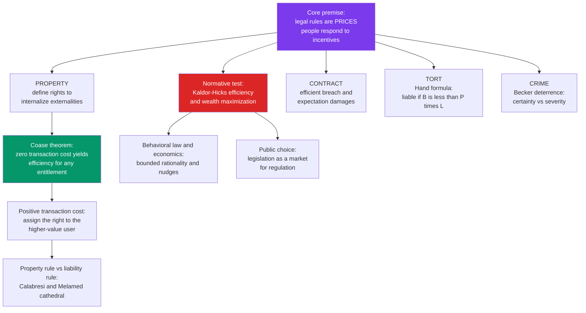

# ⚖️ Law and Economics

> [!abstract] TL;DR
> **Law and economics** applies **microeconomic analysis** to legal rules — treating statutes, doctrines, and remedies not as moral commandments but as **prices** that change the cost of behavior and therefore change how much of it people do. Its *positive* claim is that people respond to legal rules as incentives, so the effects of a rule can be predicted like the effect of a tax; its *normative* claim is that rules should be judged by their **consequences**, especially **efficiency** (Kaldor-Hicks / wealth maximization). The movement's intellectual keystone is the **Coase theorem**: with zero transaction costs, private bargaining reaches the efficient outcome *no matter who the law gives the entitlement to*, so law matters precisely because transaction costs are real — and the law's job becomes assigning rights and choosing remedies that **minimize the friction** between people and the efficient allocation. This single lens has been run across property, contract, tort, and crime, making it the **most influential jurisprudential movement of the last half-century** (Posner) — and its critics answer that *efficiency is not justice*.

## Intuition

**Analogy:** Think of every legal rule as a **price tag the state hangs on a behavior**.

A speed limit with a \$200 fine and a 1-in-10 chance of a ticket is not really a moral prohibition — to the driver it is a *price* of \$20 (expected) per episode of speeding. Raise the fine or the patrol density and you raise the price, and people "buy" less speeding, exactly as they buy less gasoline when it gets dearer. A damages rule in contract is the price of breaking a promise; tort liability is the price of an accident; a prison term is the price of a crime, discounted by the probability of getting caught. Once you see law this way, two questions become answerable with the ordinary toolkit of price theory: *how will people respond* to a rule (positive), and *which rule sets the price so that people do the efficient amount of the activity* (normative). The whole field is the disciplined pursuit of those two questions — treating legal rules as levers on the cost of conduct and asking which setting maximizes the total pie.

---

## How It Works

Law and economics is less a single theory than a **portable analytical toolkit** pointed successively at each corner of the law. Four moves recur everywhere.

1. **Model the actor as a rational maximizer facing a price.** The polluter, the promisor, the injurer, the criminal each weigh private benefit against the expected legal cost the rule imposes. Behavior is where marginal private benefit meets marginal legal price.
2. **Identify the efficient level of the activity.** The social optimum maximizes **joint surplus** (total benefits minus total costs across *everyone*), not one party's private payoff. Externalities — costs a party inflicts but does not bear — are the wedge between private and social optima (see [[Externalities_and_Pigouvian_Tax]], [[Market_Failures]]).
3. **Ask which legal rule sets the price to close that wedge.** A well-designed rule makes the private actor **internalize** the external cost, so private maximization coincides with social maximization.
4. **Score rules by a consequentialist criterion.** The default is **Kaldor-Hicks efficiency**: a change is an improvement if the winners *could* fully compensate the losers and still be better off — whether or not they actually do. Equivalently, **wealth maximization** (Posner): pick the rule that grows the total pie, and treat distribution as a separate problem for the tax-and-transfer system.

### The Coase theorem: why law matters because of transaction costs

Ronald Coase's 1960 argument is the movement's foundation stone. If parties can bargain **without transaction costs**, they will trade the entitlement to whoever values it most, so the **efficient outcome is reached regardless of the initial legal assignment** — the law only decides *who pays whom* (distribution), not *what happens* (efficiency). The corollary is the whole practical program: because transaction costs are almost never zero, the law's real work is to (a) **define clear, tradeable entitlements** so bargaining *can* happen, and (b) where bargaining is blocked, **assign the right to the party who would have bought it anyway** — mimicking the market the friction prevented (see [[Coase_Theorem]]).

### Property rules vs liability rules — the "Cathedral"

Calabresi and Melamed (1972) added a second dimension: *how* is an entitlement protected? A **property rule** lets the holder refuse any transfer except at a price they voluntarily accept (an injunction — you must negotiate). A **liability rule** lets others take the entitlement and pay **court-set damages** (you may take now, pay later). Property rules fit **low transaction costs** (let the parties price it); liability rules fit **high transaction costs** (when holdout or bargaining breakdown would block an efficient transfer, let a court set the price).

### The toolkit across the fields



---

## Key Concepts

### Secondary level

- **Law as incentives.** People respond to legal rules the way they respond to prices: raise the cost of a behavior and you get less of it. Deterrence is demand elasticity in a robe.
- **Efficiency vs justice.** Economists judge a rule by whether it makes the total pie bigger (efficiency); this is *not* the same as whether it is fair (justice) — the central fault line of the whole field.
- **Externality.** A cost (or benefit) one party imposes on another without paying (or being paid) for it — pollution is the textbook case. Efficient law forces the actor to feel the cost.

### Undergraduate level

- **Kaldor-Hicks efficiency / wealth maximization.** A move is "efficient" if the winners *could* compensate the losers and still gain, even if no compensation is paid. This is the field's default normative yardstick — weaker and more usable than **Pareto** efficiency (which requires *no one* be made worse off), but it deliberately ignores who wins and loses.
- **The Coase theorem and its corollary.** Zero transaction costs -> efficiency regardless of entitlement (invariance). Positive transaction costs -> the initial legal assignment *determines* efficiency, so assign entitlements to **minimize transaction-cost barriers** to the efficient allocation.
- **Efficient breach (contract).** Because the standard remedy is **expectation damages** (put the victim where performance would have) rather than forced performance, a promisor who finds a higher-value use for the resource will *breach and pay damages* — and this is socially *good*: the resource moves to its higher value while the promisee is left whole. Damages are the *price* of breach, set so breach happens exactly when it is efficient (see [[Contract_Law]]).
- **The Hand formula (tort).** Judge Learned Hand's negligence test: a defendant is negligent if the **burden of precaution B is less than the probability of harm P times the loss L** (B less than P·L). This makes the legal standard of care track the **economically efficient level of precaution** — take a precaution exactly when it is cheaper than the expected harm it prevents (see [[Tort_Law]]).
- **Becker's economics of crime.** Gary Becker modeled the criminal as a rational actor: commit the crime if expected gain exceeds the **probability of punishment times its severity**. Because catching offenders is costly but raising sentences is cheap, the naive optimum leans on **severity**; but risk-aversion and marginal-deterrence effects push back — the **certainty vs severity** trade-off (see [[Theories_of_Punishment]]).

### Graduate level

- **Property rules, liability rules, inalienability (Calabresi-Melamed).** The "Cathedral" 2x2: entitlement can be assigned to either party and protected by an injunction (property rule), by damages (liability rule), or made non-transferable (inalienability). The choice of *protection* is a transaction-cost calculation independent of *who* holds the right.
- **Positive vs normative L&E.** *Positive* analysis predicts behavior and even claims the common law tends toward efficiency (the "efficiency of the common law" hypothesis — Posner, Rubin, Priest: litigation selectively pressures inefficient rules). *Normative* analysis prescribes which rule a legislature or court *should* adopt. Conflating the two ("the law *is* efficient, therefore it *should* be") is a naturalistic fallacy the field's careful practitioners resist.
- **Behavioral law and economics.** Jolls, Sunstein, and Thaler relax the rational-actor assumption using cognitive biases from [[Behavioral_Economics_Psychology]] — **bounded rationality**, loss aversion, hyperbolic discounting, the endowment effect. The endowment effect alone dents the Coase theorem: if merely *holding* an entitlement raises its subjective value, the initial assignment affects the *final allocation*, not just distribution. Prescriptively it motivates **nudges** and smart defaults over mandates.
- **Public choice.** Economics turned on the *makers* of law: legislators, regulators, and voters are self-interested maximizers too, so statutes are the output of a **political market** shaped by concentrated interest groups, rational voter ignorance, and rent-seeking (Buchanan, Tullock, Stigler's capture theory). This reframes regulation and administrative law as supply-and-demand for favorable rules (see [[Administrative_Law_and_Regulation]]).
- **The critiques.** (1) *Efficiency is not justice* — wealth maximization has no independent moral force (Dworkin: a society is not better merely for being richer). (2) *Distributional blindness* — Kaldor-Hicks counts a dollar to a billionaire equal to a dollar to a pauper, and "let tax handle distribution" assumes a tax system that may not exist. (3) *The commodification critique* — some goods (body parts, votes, intimacy, dignity) are *corrupted* by being priced at all, so an efficiency frame that treats everything as tradeable misdescribes the value at stake (Radin, Sandel).

---

## Python Demo

We make the Coase theorem concrete. A **factory** chooses an activity level `q` (output that produces pollution); the pollution **harms a nearby resident**. Joint surplus `W(q) = factory profit - resident harm` peaks at the *efficient* level `q*` — the level that maximizes the **total** pie, not either party's private optimum. We then compare two legal entitlements — "factory has a right to pollute" vs "resident has a right to clean air" — under rising **transaction costs**, and watch the Coase invariance appear and then break.

```python
# Coase theorem: does the INITIAL legal entitlement affect EFFICIENCY?
# A factory's activity q pollutes; a nearby resident is harmed. numpy + matplotlib only.
import numpy as np
import matplotlib.pyplot as plt

# --- Payoff primitives -------------------------------------------------
a, b, c = 10.0, 1.0, 3.0                  # profit slope, profit curvature, harm curvature
profit  = lambda q: a * q - 0.5 * b * q**2     # factory profit from activity level q
harm    = lambda q: 0.5 * c * q**2             # damage suffered by the resident
welfare = lambda q: profit(q) - harm(q)        # JOINT surplus = what efficiency maximizes

q_star     = a / (b + c)          # efficient activity: maximizes joint surplus
q_factory  = a / b                # factory's PRIVATE optimum (ignores the harm)
q_resident = 0.0                  # resident's PRIVATE optimum (wants zero pollution)

W_star = welfare(q_star)          # first-best joint surplus
W_fac  = welfare(q_factory)       # joint surplus if factory pollutes freely
W_res  = welfare(q_resident)      # joint surplus with zero pollution

# --- Bargaining rule ---------------------------------------------------
# From an entitlement's default, parties move to q_star ONLY IF the surplus
# they unlock exceeds the transaction cost T. Bargaining itself burns T.
def realized(T, default_W):
    gain = W_star - default_W                  # surplus unlocked by reaching q_star
    return (W_star - T) if gain > T else default_W

Ts = np.linspace(0, 130, 400)
factory_right  = np.array([realized(T, W_fac) for T in Ts])   # right to POLLUTE
resident_right = np.array([realized(T, W_res) for T in Ts])   # right to CLEAN AIR

# --- Plot --------------------------------------------------------------
fig, (axL, axR) = plt.subplots(1, 2, figsize=(13, 5.2))

qs = np.linspace(0, 12, 300)
axL.plot(qs, welfare(qs), lw=2, color="black", label="joint surplus  W(q)")
axL.axvline(q_star,     color="green", ls="--", lw=2, label="efficient  q*")
axL.axvline(q_factory,  color="red",   ls=":",  lw=2, label="factory-right default")
axL.axvline(q_resident, color="blue",  ls=":",  lw=2, label="resident-right default")
axL.scatter([q_star], [W_star], color="green", s=90, zorder=3)
axL.set_title("Joint surplus vs activity level\n(efficient q* is a peak, not either corner)")
axL.set_xlabel("factory activity / pollution level  q")
axL.set_ylabel("joint surplus  W(q) = profit - harm")
axL.legend(fontsize=8); axL.grid(alpha=0.3)

axR.plot(Ts, resident_right, lw=2.5, color="blue", label="entitlement: resident (clean air)")
axR.plot(Ts, factory_right,  lw=2.5, color="red",  label="entitlement: factory (right to pollute)")
axR.axhline(W_star, color="green", ls="--", lw=1.5, label="first-best surplus  W*")
axR.axvline(W_star - W_res, color="gray", ls=":", lw=1, label="T that blocks resident-right trade")
axR.set_title("Realized joint surplus vs transaction cost\n(T=0: curves coincide -> Coase invariance)")
axR.set_xlabel("transaction cost  T")
axR.set_ylabel("realized joint surplus")
axR.legend(fontsize=8); axR.grid(alpha=0.3)

plt.tight_layout(); plt.savefig("coase_theorem.png", dpi=120); plt.show()

# --- Numbers that make the point --------------------------------------
print(f"efficient q*       = {q_star:.2f}   ->  max joint surplus W* = {W_star:.1f}")
print(f"factory default  q = {q_factory:.1f}   ->  W = {W_fac:.1f}   (over-pollutes)")
print(f"resident default q = {q_resident:.1f}   ->  W = {W_res:.1f}   (zero pollution)\n")
print(" T   factory-right   resident-right   verdict")
for T in [0, 8, 20, 60]:
    fr, rr = realized(T, W_fac), realized(T, W_res)
    verdict = "SAME  (invariance holds)" if abs(fr - rr) < 1e-9 else "DIFFER (entitlement matters)"
    print(f"{T:>3}   {fr:11.1f}   {rr:13.1f}   {verdict}")
```

**What the output shows.** At **T = 0** both entitlements yield the *same* realized surplus `W* = 12.5` — the Coase **invariance result**: efficiency is reached whoever holds the right; only *who pays whom* differs (under factory-right the resident *pays the factory* to cut back; under resident-right the factory *pays the resident* for permission — same `q*`, opposite wealth transfer). As **T rises but stays small** the curves still coincide (both parties find it worth bargaining to `q*`, minus the toll `T`). Once **T grows past the surplus the resident-right trade would unlock**, that trade collapses and the outcome sticks at the near-efficient default `q = 0`; meanwhile the factory-right default is disastrous (`W = -100`), so the two entitlements now diverge sharply. Positive transaction costs have made the **initial assignment of rights determine efficiency** — which is exactly why the law should assign entitlements where the market would have put them, minimizing the bargaining it must rely on.

---

## Real-World Applications

- **Emissions trading (cap-and-trade).** Direct Coasean policy: define a fixed number of *tradeable* pollution entitlements, keep transaction costs low with an exchange, and let firms bargain the permits to their highest-value use — used in the U.S. Acid Rain Program and the EU ETS.
- **Efficient-breach damages in commercial contracts.** Courts' default preference for **expectation damages over specific performance** is the efficient-breach principle in action: a seller who gets a better offer breaches, pays damages, and the good flows to its higher-value buyer.
- **Products-liability and safety regulation.** The Hand formula's logic drives negligence rulings and agency cost-benefit rules (e.g., an auto-safety standard is required when the burden of the fix is below the expected accident cost it averts). Modern regulatory review (OIRA cost-benefit analysis) is applied L&E.
- **Antitrust.** Post-1970s U.S. antitrust reoriented around **consumer welfare and efficiency** rather than protecting small competitors — a direct import of Chicago-school L&E into doctrine (though now contested by "neo-Brandeisians").
- **Optimal-deterrence policing.** Becker's certainty-vs-severity model informs debates on whether to fund *more patrols* (raise probability of getting caught) or *longer sentences* (raise severity); evidence that certainty deters more than severity is a Beckerian empirical finding.

---

## Common Pitfalls

- **Confusing efficiency with fairness.** Kaldor-Hicks says winners *could* compensate losers, not that they *do*. An "efficient" rule can leave real victims uncompensated and worse off. Never launder a distributive judgment as a neutral efficiency finding.
- **Treating the Coase theorem as "the market fixes everything."** Coase's actual point is the *opposite*: because transaction costs are pervasive, the initial legal assignment usually *does* determine the outcome, so law is indispensable. Reading Coase as an argument for laissez-faire inverts him.
- **Ignoring wealth effects and the endowment effect.** Coasean invariance assumes valuations are independent of who holds the right. Behavioral evidence (endowment effect) shows holding an entitlement can *raise* its subjective value, so the initial assignment shifts the *final* allocation, not just distribution.
- **Assuming rational maximizers everywhere.** Bounded rationality, hyperbolic discounting, and framing mean people under-respond to remote sanctions (weak deterrence from severe-but-rare punishment) and over-respond to salient ones. A model that predicts perfect price-responsiveness will misforecast.
- **Forgetting the lawmaker is also self-interested.** Naive normative L&E asks "what rule is efficient?" as if a benevolent planner will adopt it. Public choice warns the rule that gets enacted is the one interest groups demand — capture, not efficiency, often explains the statute.
- **Over-commodifying.** Pricing everything (organs, votes, intimacy) can *destroy* the value being measured. Where a good's worth is partly constituted by its being outside the market, the efficiency frame misdescribes what is at stake.

---

## Related Concepts

- [[Coase_Theorem]] — the foundational result this note applies to law: zero transaction costs give efficiency for any entitlement, so law matters because of friction.
- [[Externalities_and_Pigouvian_Tax]] — the market failure L&E rules are designed to internalize; the tax (price) alternative to assigning bargainable rights.
- [[Market_Failures]] — the broader taxonomy (externalities, public goods, information) that legal rules are asked to correct.
- [[Philosophy_of_Law_Jurisprudence]] — L&E is a jurisprudential school; it revives Bentham's consequentialism and sits opposite natural-law and Dworkinian rights-based theories.
- [[Contract_Law]] — efficient breach and expectation damages: the economic reading of contract remedies.
- [[Tort_Law]] — the Hand formula and optimal precaution: negligence as efficient care.
- [[Property_Law]] — defining entitlements to internalize externalities; property vs liability rule protection.
- [[Theories_of_Punishment]] — Becker's optimal-deterrence model as the economic theory of criminal sanction alongside retribution and rehabilitation.
- [[Administrative_Law_and_Regulation]] — public-choice economics of legislation, capture, and cost-benefit review of regulation.
- [[Behavioral_Economics_Psychology]] — the cognitive biases behavioral L&E injects into the rational-actor model (endowment effect, loss aversion, nudges).
- [[Nash_Equilibrium]] — the game-theoretic backbone for modeling strategic bargaining, deterrence, and precaution as equilibria.

---

## Review Questions

1. **(Conceptual)** State the Coase theorem precisely and explain its *corollary* — why the theorem, far from showing law is unnecessary, actually shows *why law matters*. Distinguish the effect of the initial entitlement on **efficiency** from its effect on **distribution** under (a) zero and (b) positive transaction costs.
2. **(Scenario)** A chemical plant's runoff harms a downstream fishery; there are two firms, so bargaining costs are low, but the harm is hard to measure. Should the law protect the fishery's entitlement with a **property rule** (injunction) or a **liability rule** (damages), and to *whom* should it assign the entitlement? Walk through the Calabresi-Melamed reasoning and say how your answer changes if there were 5,000 dispersed downstream residents instead of one fishery.
3. **(Trade-off / critique)** "The efficient rule is the just rule." Attack this claim using the three standard critiques of wealth maximization (efficiency-is-not-justice, distributional blindness, commodification), then give the strongest L&E rejoinder to each. Where do you land, and why?

---

## Sources

- Coase, Ronald H. (1960). "The Problem of Social Cost." *Journal of Law and Economics*, 3, 1–44.
- Posner, Richard A. (1973/2014). *Economic Analysis of Law* (9th ed.). Wolters Kluwer / Aspen.
- Calabresi, Guido & Melamed, A. Douglas (1972). "Property Rules, Liability Rules, and Inalienability: One View of the Cathedral." *Harvard Law Review*, 85(6), 1089–1128.
- Becker, Gary S. (1968). "Crime and Punishment: An Economic Approach." *Journal of Political Economy*, 76(2), 169–217.
- Jolls, Christine; Sunstein, Cass R. & Thaler, Richard H. (1998). "A Behavioral Approach to Law and Economics." *Stanford Law Review*, 50(5), 1471–1550.

---

#law #law-and-economics #coase-theorem #efficiency #incentives
