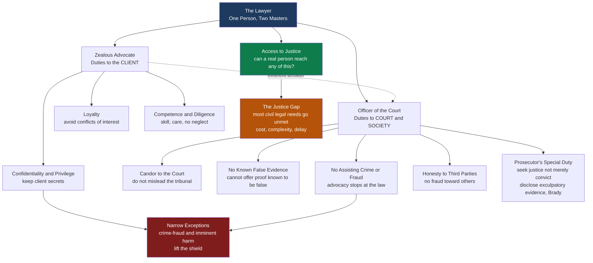

# ⚖️ Legal Ethics and Access to Justice

> [!abstract] TL;DR
> This note joins two problems that the profession usually treats separately but that are really one. **Legal ethics** (professional responsibility) is the body of rules governing how lawyers must behave, built around a permanent tension: the lawyer is at once a **zealous advocate** who owes the client confidentiality, loyalty, and competence, *and* an **officer of the court** who may not mislead the tribunal, offer evidence known to be false, or help a client commit a crime or fraud. The client duties bend to the court duties only at narrow seams — the **crime-fraud** and **imminent-harm** exceptions to confidentiality, and the prosecutor's special duty to **disclose exculpatory evidence** (*Brady*). **Access to justice** is the mirror-image problem: rights are worthless if you cannot actually use them. The **justice gap** — the finding that the large majority of the civil legal needs of low- and middle-income people go unmet for lack of affordable help — means that having a legal right and being able to enforce it are very different things. The criminal system guarantees a lawyer (*Gideon*); the civil system, for the most part, does not. Both halves rest on the same foundation: the [[Rule_of_Law_and_Due_Process|rule of law]] is a promise that dissolves the moment ordinary people cannot reach it.

---

## Intuition

**Analogy 1 — the hired champion who has also sworn an oath to the arena.**

In an old trial by combat you could hire a champion to fight your duel for you. The champion's whole job was to fight *ferociously for you* — that is what you paid for, and a champion who went easy on your opponent was worthless. Now imagine the duel happens inside a courtroom, and the champion, before being allowed to carry a sword at all, had to swear an oath to the court itself: never to cheat the referee, never to plant a false weapon, never to help you murder anyone outside the ring. That is the lawyer. You want maximum ferocity on your behalf; the system demands that the ferocity stay inside rules the lawyer has personally promised to uphold. **Legal ethics is the constant management of that split loyalty** — advocate for the client with everything you have, but not by lying to the judge, and not by becoming an instrument of your client's crimes.

**Analogy 2 — the five-star hospital with a locked front door.**

A society can write a magnificent set of rights — to a fair hearing, to your property, to be free of an unlawful eviction — the legal equivalent of a world-class hospital stocked with every treatment. But if the door is locked and the key costs more than most people earn in a month, the treatment inside is imaginary for them. **A right you cannot afford to enforce is not a right you have; it is a right you are told about.** Access to justice is the study of that locked door: who can reach the law, who cannot, and what it would take to widen the opening. The two analogies meet at a single point — the lawyer is *both* the champion you cannot afford and the person the system trusts to keep the arena honest.

---

## How It Works

### The dual role and its four families of duty

A lawyer's conduct is governed, in the United States, largely by the **ABA Model Rules of Professional Conduct**, adopted in some form by nearly every state bar; England and Wales use the **SRA Standards and Regulations**; most systems converge on the same core. The duties sort into four families, the first three running *to the client* and the last two *outward*.

1. **Confidentiality and legal professional privilege.** The lawyer must keep the client's information secret. Two distinct doctrines overlap here: the ethical **duty of confidentiality** (broad — covers everything relating to the representation) and the evidentiary **attorney-client privilege** (narrower — protects confidential *legal* communications from being compelled in court). The purpose is candor: a client who fears disclosure will not tell the lawyer the truth, and a lawyer who does not know the truth cannot advise well. The privilege is **the client's**, not the lawyer's, so only the client can waive it.
2. **Loyalty and the avoidance of conflicts of interest.** The lawyer must put the client's interests first and may not represent a client whose interests are **directly adverse** to another client, nor let personal or third-party interests compromise the representation, without informed consent. This is why firms run **conflict checks** before taking a matter and build **ethical walls** ("Chinese walls") to screen lawyers who switch sides.
3. **Competence and diligence.** The lawyer must have the skill and knowledge the matter requires and must pursue it with reasonable care and promptness — no missed deadlines, no dabbling in fields they do not understand. Incompetent or neglectful representation is itself an ethical violation, not merely bad service.
4. **Candor to the court and honesty to third parties.** The lawyer is an **officer of the court**: they may not knowingly make a false statement of fact or law to a tribunal, must correct one they later discover, may not offer evidence they **know** to be false, and must disclose adverse controlling authority the other side missed. Outward, they may not defraud third parties or assist a client's crime or fraud. This is where advocacy stops.

### Where the duties collide — the narrow exceptions

The hardest cases are where client duties (secrecy, loyalty) meet court/society duties (honesty, not assisting crime).

- **Crime-fraud exception.** Confidentiality and privilege protect advice about *past* conduct, but not communications made to enable an **ongoing or future** crime or fraud. If the client uses the lawyer's services to plan a fraud, the shield falls away.
- **Imminent harm.** Most rules **permit** (and some require) disclosure to prevent **reasonably certain death or substantial bodily harm** — the classic "the client tells you where the kidnapped victim is." The line is deliberately high, so that the exception does not swallow the confidentiality that makes representation work.
- **False evidence and the perjury dilemma.** A criminal defense lawyer whose client insists on testifying to something the lawyer knows is false faces the sharpest collision in the field: the duty to defend, the duty not to offer false evidence, and the client's right to testify. The rules resolve it toward candor — the lawyer may not knowingly present perjury — but the doctrine is famously uncomfortable.

### "How can you defend someone you think is guilty?"

The adversarial system's ethics answer this directly, and the answer connects straight to [[Criminal_Procedure]]. The defense lawyer's job is **not** to certify innocence; it is to hold the **state to its burden of proof beyond reasonable doubt**. Everyone is entitled to a defense precisely because we do not let the accuser also be the judge of guilt. "Guilty" is a *verdict*, not a fact the lawyer possesses; the presumption of innocence means the lawyer forces the state to prove its case, tests its evidence, and guards against the wrongful conviction that an unchecked prosecution produces. Defending the reviled is not a loophole in the system — it *is* the system.

### The prosecutor is different — the duty to seek justice

The prosecutor is not merely another advocate; their client is the public and their duty is **to seek justice, not merely to convict**. The load-bearing rule is **Brady v. Maryland** (1963): the prosecution must **disclose exculpatory and impeachment evidence** to the defense. A prosecutor who buries evidence that could exonerate the accused commits both an ethical violation and a constitutional one — a recurring cause of wrongful convictions (see [[Evidence_and_Proof]]).

### Regulating the profession

Ethics has teeth only through **self-regulation under judicial supervision**: **bar admission** (character-and-fitness screening plus a professional-responsibility exam), **discipline** (reprimand, suspension, or **disbarment** by a bar or supreme court), and the prohibition on the **unauthorized practice of law (UPL)** — non-lawyers may not give legal advice or represent others. UPL rules protect the public from incompetence, but they are also the central battleground for access to justice, because they can outlaw cheaper non-lawyer help.

### Flow / Architecture



---

## Key Concepts

### Secondary Level

- **Legal ethics.** The rules that say how lawyers must behave — keep the client's secrets, be loyal, be competent, and never lie to the judge.
- **The lawyer's two jobs.** Fight hard *for the client*, but also stay honest *with the court*. When those clash, honesty to the court wins.
- **Confidentiality.** What you tell your lawyer stays private, so you can be truthful with them. There are rare exceptions, like stopping a serious crime.
- **Why defend the guilty?** In a fair system the government has to *prove* guilt. Everyone gets a lawyer so that the state cannot just declare someone guilty. "Guilty" is what a court decides, not what a lawyer assumes.
- **Access to justice.** Having a right on paper is not enough if you cannot afford a lawyer or navigate the courts. The gap between rights and real-world use is the **justice gap**.
- **A free lawyer — sometimes.** If you are charged with a serious crime you get a lawyer even if you cannot pay (*Gideon*). In most *civil* cases (eviction, debt, custody) you do not.

### Undergraduate Level

- **Confidentiality vs. attorney-client privilege.** The ethical duty of confidentiality is broad (all information relating to the representation); the evidentiary privilege is narrower (confidential legal communications, protected from compelled disclosure). The **privilege belongs to the client** and only the client can waive it.
- **Conflicts of interest.** Direct adversity between two current clients, or a material limitation from a former client, personal interest, or third party. Managed by **informed consent**, **conflict checks**, and **ethical walls**; some conflicts are non-consentable.
- **Candor and the perjury problem.** A lawyer may argue any reasonable inference but may not knowingly assert falsehoods to the court or offer evidence they **know** is false. The criminal defendant's right to testify collides with the ban on presenting perjury.
- **Crime-fraud and imminent-harm exceptions.** The shield protects advice about the past, not the furtherance of future crime; disclosure is permitted (sometimes required) to prevent reasonably certain death or serious bodily harm.
- **The adversarial theory of the defense.** The defense enforces the state's **burden of proof** and the **presumption of innocence**; testing the prosecution's case is a structural safeguard against wrongful conviction, linking to [[Criminal_Procedure]].
- **The prosecutor's *Brady* duty.** Duty to seek justice, not conviction; constitutional obligation to disclose exculpatory and impeachment evidence.
- **Regulation and UPL.** Bar admission (character and fitness, the MPRE), discipline up to disbarment, and the unauthorized-practice-of-law bar that reserves legal advice to licensed lawyers.
- **The justice gap and its causes.** Cost, complexity, and delay. The right to counsel is guaranteed in criminal cases but generally **not** in civil ones — the "civil *Gideon*" that never fully arrived.

### Graduate Level

- **The standard conception of advocacy and its critics.** The orthodox model rests on **partisanship** (do everything lawful for the client), **neutrality** (do not judge the client morally), and **non-accountability** (the lawyer is not morally responsible for the client's lawful ends). Critics (William Simon, David Luban) argue this licenses lawyers to help produce unjust-but-lawful outcomes and that lawyers should exercise **moral judgment** rather than hide behind role. Connect to [[Applied_Ethics]] and [[Philosophy_of_Law_Jurisprudence]].
- **Confidentiality as a systemic wager.** The rule sacrifices some truth in individual cases (guilty knowledge stays hidden) to buy candor across all cases. Whether the wager is worth it — and how narrow the harm exceptions must be to keep it honest — is the deep normative question. Compare rule-utilitarian and deontological framings (a promise of secrecy versus aggregate welfare).
- **The access gap as a distributive-justice problem.** Framed through [[Justice_and_Rawls]]: if legal services are a **primary good** required to exercise every other right, does justice-as-fairness demand a floor of legal assistance? The unmet-need model in the demo makes the distributive shape explicit — the gap is steepest exactly where the least-advantaged sit.
- **Legal aid's chronic underfunding and rationing.** Because civil legal aid (in the US, the **Legal Services Corporation**) is funded to serve only a fraction of eligible need, providers must **ration** — triage by case type, turn away the merely eligible, and rely on **pro bono** to fill gaps it never can. Rationing decisions are themselves an ethics-of-scarcity problem.
- **Unbundling, ADR, and de-lawyering.** Responses that widen the door by **shrinking the service**: **limited-scope (unbundled)** representation sells discrete tasks (draft this motion, coach me for this hearing); **mediation and arbitration** move disputes out of court entirely; court **simplification** and **self-help** centers let litigants proceed pro se. Each trades depth of representation for reach.
- **LegalTech and AI as a double-edged access tool.** DIY platforms, document assemblers, and chatbots can collapse the cost of routine legal help toward zero, potentially the largest lever on the justice gap. But they raise the **unauthorized-practice** question (is an AI giving legal advice practicing law?), **quality and bias** risks (a confidently wrong model harming an unrepresented user), and **accountability** gaps (who is liable when the tool errs?). The regulatory reforms loosening UPL (Utah's regulatory sandbox, Arizona's abolition of the ban on non-lawyer ownership) are direct attempts to let these tools reach people.
- **UPL as gatekeeping vs. protection.** The same rule that shields the public from charlatans also **suppresses cheaper competition** (paralegals, navigators, software). The reform debate asks whether protecting consumers from bad help is worth denying them *any* affordable help.

---

## Python Demo

```python
# QUANTIFYING THE JUSTICE GAP  (numpy + matplotlib only).
#
# Question: what fraction of people can realistically afford to enforce a civil
# legal right, and how do access interventions change that?
#
# Model.  A household leaves a civil legal need UNMET when the COST BURDEN
# (price of legal help / annual income) is high relative to a threshold. We use a
# logistic response in the cost-to-income ratio, so the POOR (high burden) leave
# almost everything unmet and the RICH (low burden) leave little unmet. A residual
# floor at high income reflects NON-cost barriers (complexity, time, not knowing
# a problem is "legal" at all). Interventions lower the EFFECTIVE price for some
# households; legal aid also shows the effect of CHRONIC UNDERFUNDING (it reaches
# only a funded fraction of the eligible). All data are synthetic but realistic-styled.

import numpy as np
import matplotlib.pyplot as plt

# --- Synthetic US-style household income by decile (annual USD) ---
decile_income = np.array([14_000, 27_000, 37_000, 48_000, 60_000,
                          74_000, 90_000, 112_000, 148_000, 260_000], dtype=float)
decile_labels = [f"D{i+1}" for i in range(10)]

POVERTY = 15_000.0
LEGAL_AID_ELIGIBILITY = 1.25 * POVERTY     # civil legal aid means-test proxy
FULL_COST = 6_000.0                        # full private-market cost of a typical civil matter

K, B0 = 14.0, 0.13                         # logistic steepness and burden threshold

def unmet_share(cost, income, k=K, b0=B0):
    """Share of legal needs left UNMET given a price and an income."""
    burden = np.asarray(cost, float) / np.asarray(income, float)
    return 1.0 / (1.0 + np.exp(-k * (burden - b0)))

# --- Baseline: every household faces the full private-market price ---
baseline_unmet = unmet_share(FULL_COST, decile_income)

# --- Intervention 1: LEGAL AID (near-free) but only for the eligible, and only
#     funded to reach a fraction of them -> expected unmet blends served + unserved ---
FUNDING_COVERAGE = 0.45
AID_COST = 300.0
def legal_aid_unmet(income):
    eligible = income <= LEGAL_AID_ELIGIBILITY
    served   = unmet_share(AID_COST, income)     # reached: near-free help
    unserved = unmet_share(FULL_COST, income)    # eligible but turned away: full price
    out = unserved.copy()
    out[eligible] = (FUNDING_COVERAGE * served[eligible]
                     + (1 - FUNDING_COVERAGE) * unserved[eligible])
    return out

# --- Intervention 2: UNBUNDLED / limited-scope services (pay for discrete tasks) ---
UNBUNDLED_COST = 0.40 * FULL_COST
# --- Intervention 3: LEGALTECH / DIY tools and chatbots (cheap, available to all) ---
DIY_COST = 0.15 * FULL_COST

la_unmet  = legal_aid_unmet(decile_income)
unb_unmet = unmet_share(UNBUNDLED_COST, decile_income)
diy_unmet = unmet_share(DIY_COST, decile_income)

# --- Combined: each household takes the best (cheapest effective) option available ---
cheapest_self_help = min(UNBUNDLED_COST, DIY_COST)          # DIY here
eligible = decile_income <= LEGAL_AID_ELIGIBILITY
served   = unmet_share(AID_COST, decile_income)
self_help = unmet_share(cheapest_self_help, decile_income)
combined_unmet = self_help.copy()
combined_unmet[eligible] = (FUNDING_COVERAGE * served[eligible]
                            + (1 - FUNDING_COVERAGE) * self_help[eligible])

gap_baseline = baseline_unmet.mean()      # population-weighted (each decile = 10 percent)
gap_combined = combined_unmet.mean()
low_income_gap = baseline_unmet[:3].mean()

print("QUANTIFYING THE JUSTICE GAP")
print("=" * 60)
print(f"{'Decile':<8}{'Income':>10}{'Baseline unmet':>16}{'All interventions':>19}")
for lbl, inc, b, c in zip(decile_labels, decile_income, baseline_unmet, combined_unmet):
    print(f"{lbl:<8}{inc:>10,.0f}{b*100:>15.1f}%{c*100:>18.1f}%")
print("-" * 60)
print(f"Population-weighted justice gap, baseline     : {gap_baseline*100:5.1f}%")
print(f"Population-weighted justice gap, interventions : {gap_combined*100:5.1f}%")
print(f"Bottom-three-decile (low income) gap, baseline: {low_income_gap*100:5.1f}%")

# ---------------- Figure: two panels ----------------
fig, (axA, axB) = plt.subplots(1, 2, figsize=(15, 6))

# Panel A: unmet need by income decile, baseline vs each intervention
x = np.arange(10)
w = 0.20
axA.bar(x - 1.5*w, baseline_unmet*100, w, label="Baseline (private market)", color="#7f1d1d")
axA.bar(x - 0.5*w, la_unmet*100,       w, label="Legal aid (underfunded)",   color="#b45309")
axA.bar(x + 0.5*w, unb_unmet*100,      w, label="Unbundled services",        color="#2563eb")
axA.bar(x + 1.5*w, diy_unmet*100,      w, label="LegalTech / DIY",           color="#0e7c4b")
axA.set_xticks(x); axA.set_xticklabels(decile_labels)
axA.set_xlabel("Household income decile (D1 poorest -> D10 richest)")
axA.set_ylabel("Share of civil legal needs UNMET (%)")
axA.set_title("The Justice Gap Is Steepest for the Poor")
axA.set_ylim(0, 100)
axA.legend(fontsize=8, loc="upper right")
axA.grid(axis="y", alpha=0.25)

# Panel B: the ACCESSIBILITY CURVE (share of needs MET) vs income, continuous
inc = np.linspace(10_000, 280_000, 500)
met_baseline = (1 - unmet_share(FULL_COST, inc)) * 100
met_unb      = (1 - unmet_share(UNBUNDLED_COST, inc)) * 100
met_diy      = (1 - unmet_share(DIY_COST, inc)) * 100
axB.plot(inc/1000, met_baseline, color="#7f1d1d", lw=2.5, label="Baseline (private market)")
axB.plot(inc/1000, met_unb,      color="#2563eb", lw=2,   ls="--", label="Unbundled services")
axB.plot(inc/1000, met_diy,      color="#0e7c4b", lw=2.5, label="LegalTech / DIY (cheapest)")
axB.axvspan(10, LEGAL_AID_ELIGIBILITY/1000, color="#b45309", alpha=0.12)
axB.text(11, 8, "legal-aid\neligible", fontsize=8, color="#b45309")
axB.set_xlabel("Annual household income (thousands USD)")
axB.set_ylabel("Share of civil legal needs MET (%)")
axB.set_title("Cheaper Help Shifts the Accessibility Curve Up and Left")
axB.set_ylim(0, 100)
axB.legend(fontsize=8, loc="lower right")
axB.grid(alpha=0.25)

fig.suptitle(f"Access to Justice  |  baseline gap = {gap_baseline*100:.0f}% of needs unmet, "
             f"low-income gap = {low_income_gap*100:.0f}%",
             fontsize=13, fontweight="bold")
fig.tight_layout()
plt.savefig("justice_gap.png", dpi=120, bbox_inches="tight")
plt.show()
```

**Expected output (approximate):**

```
QUANTIFYING THE JUSTICE GAP
============================================================
Decile      Income  Baseline unmet   All interventions
D1          14,000           98.5%              23.7%
D2          27,000           78.4%              21.5%
D3          37,000           61.2%              25.8%
D4          48,000           51.8%              20.1%
D5          60,000           39.7%              17.9%
D6          74,000           33.5%              16.2%
D7          90,000           29.2%              15.5%
D8         112,000           25.6%              15.0%
D9         148,000           22.2%              14.5%
D10        260,000           18.3%              14.4%
------------------------------------------------------------
Population-weighted justice gap, baseline     :  45.8%
Population-weighted justice gap, interventions :  18.5%
Bottom-three-decile (low income) gap, baseline:  79.4%
```

The numbers tell the whole story. In the **baseline** market, the poorest decile leaves roughly **98 percent** of its civil legal needs unmet, and the bottom third of the income distribution averages nearly **80 percent** unmet — closely tracking the real-world finding that low-income Americans get little or no help for the large majority of their civil legal problems. The **accessibility curve** in Panel B is the key picture: cheaper delivery models do not just help a few people, they **shift the entire curve up and to the left**, so that the income at which "most needs get met" drops dramatically. **LegalTech/DIY** produces the largest shift because it cuts the price for *everyone*, while **legal aid**, though it delivers near-free help, is throttled by **underfunding** — it can only push the poorest decile from about 98 percent unmet to the low-80s on its own, which is exactly why the field leans on unbundling, pro bono, and technology to finish the job. The residual floor of roughly 14–18 percent at every income level is deliberate: it encodes the non-cost barriers (complexity, delay, not recognizing a problem as legal) that money alone never removes.

---

## Real-World Applications

**The Legal Services Corporation "Justice Gap" studies.** The LSC — the largest funder of US civil legal aid — periodically measures unmet need, repeatedly finding that low-income households receive inadequate or no legal help for the great majority of their civil legal problems, and that legal-aid programs turn away enormous volumes of eligible people for lack of resources. This is the empirical backbone of the demo.

**Gideon and the public-defender crisis.** *Gideon v. Wainwright* (1963) guaranteed appointed counsel to indigent criminal defendants, but funding never matched the promise: public defenders routinely carry caseloads far above recommended limits, meaning many defendants meet their lawyer minutes before a plea. The gap between the *right* to counsel and the *reality* of counsel is legal ethics and access to justice colliding in one office (see [[Criminal_Procedure]]).

**Brady disclosure and wrongful convictions.** *Brady v. Maryland* obliges prosecutors to hand over exculpatory evidence. Documented *Brady* violations — suppressed lab reports, hidden informant deals — are a recurring cause in DNA exonerations, showing what happens when the "seek justice" duty fails in practice (see [[Evidence_and_Proof]]).

**Conflict checks and ethical walls in Big Law.** Large firms run automated conflict-of-interest screens before opening any matter and erect information barriers when a lateral hire brings knowledge of a former adversary — the loyalty duty operationalized as software and access controls, because a single undisclosed conflict can disqualify the firm from a case.

**Regulatory sandboxes for legaltech.** **Utah's** regulatory sandbox and **Arizona's** abolition of the ban on non-lawyer ownership of law firms are deliberate experiments in loosening the **unauthorized-practice** rules so that software, chatbots, and non-lawyer "navigators" can deliver cheap legal help — the reform edge of the access-to-justice movement, and the exact frontier where AI legal tools live.

**Court self-help and unbundling.** Family and housing courts increasingly run **self-help centers**, simplified forms, and rules explicitly permitting **limited-scope** representation, acknowledging that a system in which most litigants appear **pro se** must be redesigned around the unrepresented rather than pretending everyone has a lawyer.

---

## Common Pitfalls

- **Confusing confidentiality with attorney-client privilege.** The ethical **duty of confidentiality** is broad and always on; the evidentiary **privilege** is narrower and only blocks *compelled* disclosure of confidential legal communications. Something can be confidential yet not privileged, and the privilege belongs to the **client**, not the lawyer.
- **Thinking "zealous advocacy" means anything goes.** Partisanship is bounded by candor to the court and the ban on assisting crime or fraud. A lawyer may not lie to the judge, offer known-false evidence, or help the client break the law — advocacy stops at those lines, not one inch past them.
- **Treating "defending the guilty" as an ethical loophole.** The defense enforces the state's burden of proof; "guilty" is a verdict, not a fact the lawyer holds. Testing the prosecution's case is the mechanism that prevents wrongful convictions — it is the point of the system, not an abuse of it.
- **Forgetting the prosecutor is not just another advocate.** The prosecutor's duty is to **seek justice**, which includes disclosing evidence that helps the defense (*Brady*). Treating the prosecutor as a win-maximizer is both an ethical and a constitutional error.
- **Equating a legal right with access to it.** A right you cannot afford to enforce is functionally absent. Policy that celebrates new rights while ignoring the cost, complexity, and delay of using them widens the justice gap even as it looks like progress.
- **Assuming the civil system provides a lawyer.** The right to appointed counsel is (mostly) a **criminal** guarantee. In civil matters — eviction, debt, custody, benefits — most people have **no right to a free lawyer**, which is why the "civil *Gideon*" and self-help movements exist.
- **Believing more legal-aid money alone closes the gap.** Underfunding is real, but the residual floor of non-cost barriers (complexity, delay, not recognizing a problem as legal) means funding must be paired with **simplification, unbundling, and technology** to move the accessibility curve meaningfully.
- **Ignoring the double edge of legaltech.** DIY tools and AI can slash cost and reach millions, but a confidently wrong chatbot can harm an unrepresented user, and the **unauthorized-practice** question — is the tool "practicing law"? — is genuinely unsettled. Cheaper is not automatically better if quality and accountability are unmanaged.

---

## Related Concepts

- [[Rule_of_Law_and_Due_Process]] — the rule of law explicitly includes **access to justice** as a load-bearing component; without practical access, formal legality is hollow, and due process presumes a genuine opportunity to be heard.
- [[Criminal_Procedure]] — supplies the criminal-side machinery this note's ethics govern: the right to counsel (*Gideon*), the presumption of innocence, and the burden of proof that justify defending the accused.
- [[Justice_and_Rawls]] — the distributive-justice frame for the access gap: if legal assistance is a primary good required to exercise every other right, justice-as-fairness bears on how it should be allocated.
- [[Applied_Ethics]] — professional responsibility as a field of applied ethics; the debate over role morality, partisanship, and whether lawyers must exercise independent moral judgment.
- [[Philosophy_of_Law_Jurisprudence]] — the deeper theory of law within which the "officer of the court" role and the standard conception of advocacy are situated.
- [[Evidence_and_Proof]] — the *Brady* disclosure duty, false-evidence rules, and privilege all operate through the law of evidence and the standard of proof.
- [[Rights_and_Civil_Liberties]] — the substantive rights (fair trial, property, liberty) that access to justice makes real or leaves theoretical.
- [[Judicial_Review_and_the_Courts]] — courts both supervise the profession (admission, discipline) and are the forum whose accessibility the justice gap measures.
- [[Deontology_and_Kantian_Ethics]] — the duty-based reading of confidentiality and candor as near-categorical professional obligations.
- [[Virtue_Ethics]] — an alternative lens on legal ethics as the character of the good lawyer (integrity, practical wisdom) rather than only rule-compliance.

---

## Review Questions

### Secondary
1. A lawyer has two jobs that can pull in opposite directions. Name them, and explain in your own words what the lawyer must do when being loyal to the client would require lying to the judge.
2. Why does someone accused of a crime get a lawyer even if the lawyer suspects they are guilty? What does "innocent until proven guilty" have to do with your answer?

### Undergraduate
1. Distinguish the **duty of confidentiality** from the **attorney-client privilege**, then describe the **crime-fraud** and **imminent-harm** exceptions. Give one scenario where information is confidential but *not* privileged, and one where the shield is lifted entirely.
2. A prosecutor discovers, mid-trial, a lab report suggesting the defendant may be innocent. Explain what the prosecutor's ethical and constitutional duties require, name the governing doctrine, and describe what goes wrong when this duty is ignored.
3. The criminal system guarantees a lawyer but the civil system generally does not. Using the idea of the **justice gap**, explain why this distinction matters for an ordinary person facing eviction, and identify two responses that try to close the civil gap.

### Graduate
1. The "standard conception" of advocacy rests on partisanship, neutrality, and non-accountability. State the strongest **critique** (e.g., Simon or Luban) and the strongest **defense**, then take a position: should a lawyer refuse to help a client achieve an outcome that is lawful but, in the lawyer's judgment, unjust? Ground your answer in [[Applied_Ethics]].
2. Using the unmet-need model in the demo, explain why increasing **legal-aid funding** alone produces a smaller shift in the accessibility curve than deploying **legaltech/DIY** tools, and why the field nonetheless cannot simply replace lawyers with software. What does the residual "floor" of unmet need represent, and what would actually move it?
3. Regulatory sandboxes (Utah, Arizona) loosen the **unauthorized-practice-of-law** rules to let non-lawyers and AI deliver legal help. Argue both sides: is UPL primarily **consumer protection** or **anticompetitive gatekeeping**? Design one safeguard that would let cheap AI legal tools expand access while managing the quality, bias, and accountability risks.

---

## Sources

- American Bar Association, [*Model Rules of Professional Conduct*](https://www.americanbar.org/groups/professional_responsibility/publications/model_rules_of_professional_conduct/) — the confidentiality, conflicts, competence, and candor rules used throughout this note.
- Legal Services Corporation, [*The Justice Gap: The Unmet Civil Legal Needs of Low-income Americans*](https://justicegap.lsc.gov/) — the empirical basis for the unmet-need and underfunding model in the demo.
- [*Brady v. Maryland*, 373 U.S. 83 (1963)](https://en.wikipedia.org/wiki/Brady_v._Maryland) — the prosecutor's constitutional duty to disclose exculpatory evidence.
- [*Gideon v. Wainwright*, 372 U.S. 335 (1963)](https://en.wikipedia.org/wiki/Gideon_v._Wainwright) — the right to appointed counsel in criminal cases, and the benchmark the civil "justice gap" is measured against.
- Rhode, Deborah L. *Access to Justice* (Oxford University Press, 2004) — the foundational scholarly treatment of the access gap, its causes, and reform strategies including unbundling and de-lawyering.
- Luban, David. *Lawyers and Justice: An Ethical Study* (Princeton University Press, 1988) — the classic critique of the "standard conception" of amoral advocacy.

---

#law #legal-ethics #access-to-justice #professional-responsibility #legal-aid
