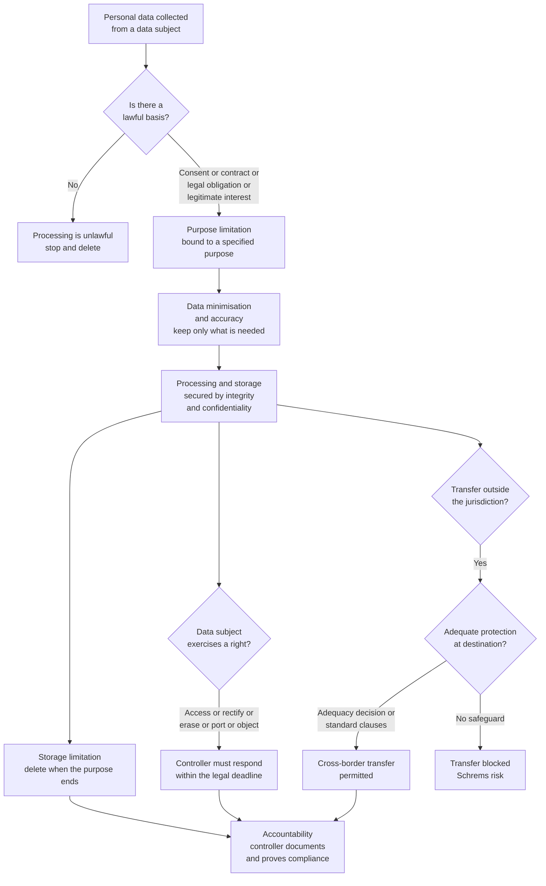

# ⚖️ Privacy and Data Protection

> [!abstract] TL;DR
> **Privacy** is not secrecy — it is *control over the flow of information about yourself*: who learns what about you, and in which context. **Data protection law** operationalises that control by regulating anyone who collects and uses **personal data**. The global reference point is the EU's **GDPR**, built on a handful of principles (lawfulness, purpose limitation, data minimisation, accuracy, storage limitation, integrity/confidentiality, **accountability**), a set of **lawful bases** (consent, contract, legal obligation, vital/public interest, legitimate interest), and enforceable **data-subject rights** (access, rectification, **erasure / "right to be forgotten"**, portability, objection). The US takes the opposite path — a **sectoral patchwork** (HIPAA for health, COPPA for children, CCPA/CPRA in California) rather than one omnibus statute. Underneath the doctrine sits a hard technical truth: **anonymisation routinely fails** (re-identification via quasi-identifiers), and the only rigorous defence — **differential privacy** — forces an explicit, unavoidable **privacy-utility tradeoff** measured by a budget epsilon.

---

## Intuition

**Analogy — the dinner-party conversation.** Imagine telling a friend at dinner that you are worried about a medical diagnosis. That is not a *secret* — you said it out loud — yet you would feel deeply violated if your friend posted it on a billboard, sold it to your insurer, or repeated it to your boss. Nothing about the *fact* changed; what changed is the **flow**: the information moved out of the context in which you shared it, under norms you never agreed to. Privacy is the expectation that information travels along **appropriate paths**, not that it never travels at all.

That is the philosopher Helen Nissenbaum's insight, **contextual integrity**: privacy is violated when information flows *breach the norms of the context* in which it was gathered. Data flowing from your doctor to your pharmacist is fine; the same data flowing from your doctor to an advertiser is a violation — even though in both cases "the data was shared." Data protection law is the machinery that tries to keep each flow inside its proper channel: *collected for a stated purpose, used only for that purpose, held only as long as needed, and moved elsewhere only under safeguards you can see.*

---

## How It Works

### From a philosophical right to a regulatory system

The modern idea begins with **Warren and Brandeis (1890)**, who coined privacy as **"the right to be let alone"** — a shield against intrusion (then, the gossip press and the instant camera). Alan **Westin (1967)** reframed it as **informational self-determination**: the *individual's* claim to decide when, how, and to what extent information about them is communicated. **Nissenbaum (2004+)** completed the arc with **contextual integrity** — privacy as *appropriate information flow* rather than binary secrecy, which is why "you already made it public once" is not a valid defence to every later use.

These are three different objects, and the law treats them differently:

- **Constitutional / fundamental privacy** is a right held *against the state* — protecting against warrantless search, surveillance, and intrusion (US Fourth Amendment and the *Griswold/Roe/Carpenter* penumbra; ECHR Article 8; the EU Charter Articles 7 and 8, which separate "private life" from "protection of personal data"). See [[Rights_and_Civil_Liberties]].
- **Statutory data protection** is a *regulatory* regime binding *everyone who processes personal data* — companies, hospitals, governments — regardless of any constitutional dispute. GDPR is the archetype.

### The GDPR machine: principles, bases, roles, rights

**Seven principles (Article 5).** Every act of processing must satisfy all of them: **lawfulness, fairness and transparency**; **purpose limitation** (collect for a specified purpose, do not silently repurpose); **data minimisation** (collect only what you need); **accuracy**; **storage limitation** (delete when the purpose ends); **integrity and confidentiality** (security); and the meta-principle **accountability** — the controller must not merely comply but be able to *demonstrate* compliance.

**Six lawful bases (Article 6).** Processing is illegal unless it rests on one of: **consent** (freely given, specific, informed, unambiguous — and revocable), **contract**, **legal obligation**, **vital interests**, **public task**, or **legitimate interests** (balanced against the subject's rights). Consent is the most visible but often the weakest and most abused basis (cookie-banner "consent fatigue").

**Roles.** The **data controller** decides *why and how* data is processed and carries legal responsibility; the **data processor** acts only on the controller's instructions (a cloud vendor, a payroll bureau). Certain organisations must appoint a **Data Protection Officer (DPO)** — an internal watchdog with legal independence.

**Data-subject rights.** Access, rectification, **erasure ("right to be forgotten"**, established in *Google Spain v AEPD*, 2014), restriction, **data portability**, objection, and protection against solely **automated decision-making**.

**Teeth.** GDPR is **extraterritorial** (Article 3): it binds any organisation, anywhere, that targets or monitors EU residents. Fines reach **the greater of 20 million euros or 4 percent of global annual turnover** — which is what turned data protection from a compliance footnote into a boardroom issue.

### The US contrast and cross-border transfers

The US has **no omnibus federal privacy law**. Instead it regulates *by sector*: **HIPAA** (health), **COPPA** (children under 13), **GLBA** (financial), and — at state level — **CCPA/CPRA** (California) granting access, deletion, and opt-out-of-sale rights. This patchwork leaves large gaps that GDPR does not.

The two systems collide at the border. GDPR bans transfers to countries lacking **adequate** protection unless safeguards (an **adequacy decision**, **Standard Contractual Clauses**, or **Binding Corporate Rules**) apply. Twice — **Schrems I (2015)** and **Schrems II (2020)** — the EU's top court struck down EU-US transfer frameworks because US **surveillance law** (FISA 702, EO 12333) gave national-security agencies bulk access with no meaningful redress for Europeans. This is the deep tension of the field: **EU privacy as a fundamental right vs US surveillance as national security.**

### Privacy-enhancing technologies and their limits

Law leans on technology, and the technology is treacherous. **Anonymisation** — stripping names — is *not* enough: **quasi-identifiers** (ZIP + birthdate + sex) uniquely pin down most people, and **linkage attacks** (Sweeney's re-identification of the Massachusetts governor's medical record; the Netflix Prize deanonymisation) prove it repeatedly. **k-anonymity** improves this by guaranteeing each record is indistinguishable from at least *k-1* others, but it degrades with high-dimensional data. The only rigorous guarantee is **differential privacy**: mathematically bounded noise added to queries so that *the presence or absence of any single individual cannot be inferred* — at the cost of accuracy, tuned by the **privacy budget epsilon**. Alongside these sit classical **encryption** (see [[Symmetric_Encryption]] and [[DLP_and_Data_Protection]]) and the **going-dark** debate: strong end-to-end encryption protects privacy but frustrates law enforcement, pitting the two goods directly against each other.

### Flow / Architecture



---

## Key Concepts

**Secondary (explain to anyone):**
- **Personal data** — any information relating to an identifiable person (name, email, location, IP address, even a photo).
- **Privacy is control, not secrecy** — you can share something and still expect it not to be resold or exposed elsewhere.
- **Consent** — real consent is *freely given, specific, informed, and revocable*; a pre-ticked box or "agree to use the site" is not consent.
- **Right to be forgotten** — under certain conditions you can demand deletion of your data.

**Undergraduate (needs some legal/CS background):**
- **The seven GDPR principles** and the **six lawful bases** — and the fact that *lawful basis, not consent, is the real gate*: consent is only one of six.
- **Controller vs processor vs DPO** — who bears legal responsibility and who merely follows instructions.
- **Constitutional privacy vs statutory data protection** — a right *against the state* vs a *regulatory duty on everyone who processes data*.
- **US sectoral patchwork** (HIPAA, COPPA, GLBA, CCPA/CPRA) vs the EU **omnibus** model.
- **Re-identification and quasi-identifiers** — why "we anonymised it" is usually false.

**Graduate (system-level / research):**
- **Contextual integrity** as a formal theory of privacy norms (Nissenbaum) vs the **notice-and-choice** paradigm's failure at scale.
- **Differential privacy** — the formal definition: a mechanism M is epsilon-differentially private if for adjacent datasets D and D-prime, the probability ratio of any output is bounded by exp of epsilon; composition theorems and the **privacy budget**.
- **The Schrems problem** — reconciling fundamental-rights adequacy with foreign-intelligence surveillance; SCCs, supplementary measures, and the EU-US Data Privacy Framework.
- **Surveillance capitalism** (Zuboff) — behavioural surplus, prediction products, and why the market structure, not just bad actors, drives privacy erosion.
- **Privacy in the age of AI** — training-data provenance, memorisation and model inversion, the tension between data minimisation and data-hungry models (see [[Responsible_AI]] and [[AI_Bias_and_Fairness]]).

---

## Python Demo

The demo makes the **differential-privacy tradeoff** concrete. A hospital holds a private database; the query is a simple **count** ("how many patients have diagnosis X?"). Because one person changes a count by at most 1, the **L1 sensitivity is 1**. The **Laplace mechanism** adds noise with scale `sensitivity / epsilon`, giving **epsilon-differential privacy**. We sweep epsilon from strongly private (0.01) to barely private (10) and watch accuracy collapse or recover — the fundamental **privacy-utility tradeoff**.

```python
# Differential privacy: the Laplace mechanism on a counting query.
# Shows the privacy-utility tradeoff -- smaller epsilon means more privacy
# but noisier (less accurate) answers. numpy + matplotlib only.
import numpy as np
import matplotlib.pyplot as plt

rng = np.random.default_rng(42)

# --- A private counting query -------------------------------------------------
true_count = 2137          # the sensitive true answer we must protect
sensitivity = 1.0          # a counting query: one person changes the count by <= 1

def laplace_mechanism(true_value, epsilon, sensitivity, size, rng):
    """Release true_value + Laplace(0, sensitivity/epsilon) -> epsilon-DP."""
    scale = sensitivity / epsilon            # smaller epsilon -> larger scale -> more noise
    return true_value + rng.laplace(loc=0.0, scale=scale, size=size)

# --- Sweep the privacy budget epsilon ----------------------------------------
epsilons = np.logspace(-2, 1, 40)            # 0.01 (very private) ... 10 (barely private)
trials = 5000
mae = np.array([
    np.mean(np.abs(laplace_mechanism(true_count, eps, sensitivity, trials, rng) - true_count))
    for eps in epsilons
])
theory_error = sensitivity / epsilons        # E|Laplace| = scale = sensitivity/epsilon

# --- Plot --------------------------------------------------------------------
fig, (ax1, ax2) = plt.subplots(1, 2, figsize=(12, 4.5))

ax1.loglog(epsilons, mae, "o", ms=4, color="#1f77b4", label="empirical mean abs error")
ax1.loglog(epsilons, theory_error, "-", color="#d62728", label="theory  1 / epsilon")
ax1.set_xlabel("privacy budget epsilon   (smaller = more private)")
ax1.set_ylabel("mean absolute error of the released answer")
ax1.set_title("Privacy-Utility Tradeoff (Laplace mechanism)")
ax1.grid(True, which="both", ls=":", alpha=0.5)
ax1.legend()

# What the released answer actually looks like: strong vs weak privacy
for eps, c in [(0.1, "#2ca02c"), (1.0, "#ff7f0e"), (5.0, "#9467bd")]:
    samples = laplace_mechanism(true_count, eps, sensitivity, 200000, rng)
    ax2.hist(samples, bins=300, density=True, histtype="step",
             color=c, label=f"epsilon = {eps}")
ax2.axvline(true_count, color="k", ls="--", lw=1, label="true answer")
ax2.set_xlim(true_count - 40, true_count + 40)
ax2.set_xlabel("released (noisy) answer")
ax2.set_ylabel("probability density")
ax2.set_title("Released answers: strong vs weak privacy")
ax2.legend()

plt.tight_layout()
plt.savefig("differential_privacy_tradeoff.png", dpi=120)
plt.show()

print(f"epsilon = 0.1 -> typical error ~ {1/0.1:>4.0f} counts  (strong privacy, very noisy)")
print(f"epsilon = 1.0 -> typical error ~ {1/1.0:>4.1f} counts  (moderate)")
print(f"epsilon = 5.0 -> typical error ~ {1/5.0:>4.2f} counts  (weak privacy, accurate)")
```

**What you see:** the error curve is a straight line on log-log axes — error scales as **1/epsilon**, so halving epsilon (doubling privacy) *doubles* the expected error. In the histograms, a small epsilon (0.1) spreads released answers over a wide band around the truth (an attacker cannot tell the real count, nor whether any one patient is in the data), while a large epsilon (5.0) hugs the true value tightly (accurate, but the guarantee is nearly worthless). There is **no free lunch**: privacy and accuracy are traded, and epsilon is the price tag.

---

## Real-World Applications

- **The GDPR "Brussels effect".** Because GDPR is extraterritorial and fines are enormous, non-EU firms often adopt its standard globally rather than run two systems — exporting EU privacy norms worldwide. Record fines (over 1.2 billion euros against Meta in 2023 for unlawful US transfers) show the teeth are real.
- **The US Census Bureau adopted differential privacy** for the 2020 Census — the largest production deployment of the technique — precisely because prior "anonymised" tabulations were shown to be reconstructable.
- **Apple and Google use local differential privacy** to gather usage statistics (keyboard suggestions, telemetry) without collecting raw per-user data.
- **Cookie banners and consent management** are the visible front end of the lawful-basis rules; the *ePrivacy Directive* plus GDPR is why every European site asks about tracking.
- **The going-dark debate** — Apple vs FBI (San Bernardino), the EU "chat control" proposals, and client-side scanning — all turn on the same collision between end-to-end **encryption** as a privacy technology and law-enforcement access. See [[Criminal_Law_Principles]] and [[DLP_and_Data_Protection]].
- **Regulators and enforcement** operate as **administrative agencies** (the CNIL, the ICO, the Irish DPC), so the whole field is also a study in [[Administrative_Law_and_Regulation]].

---

## Common Pitfalls

- **"We anonymised it, so it is not personal data."** Removing names is *pseudonymisation*, not anonymisation. Quasi-identifiers and linkage attacks re-identify most records; unless it is *irreversibly* anonymous (or differentially private), it is still regulated personal data.
- **Treating consent as the default lawful basis.** Consent is one of six, is easily invalidated (not "freely given" when bundled or coerced), and is revocable — so basing a critical service on consent is fragile. Often *contract* or *legitimate interest* is the correct and sturdier basis.
- **Confusing privacy with security.** Encryption and access controls (confidentiality) are *one principle* (integrity/confidentiality). A perfectly secure system that repurposes data or over-collects still violates privacy law. Security is necessary, not sufficient.
- **Ignoring purpose limitation when building AI.** Data lawfully collected for one purpose cannot be silently fed into model training — a direct clash between **data minimisation** and data-hungry machine learning.
- **Assuming a large epsilon is "still private."** Differential privacy with epsilon of 5 or more offers a guarantee so weak it is often meaningless; the *number* matters, and vendors quietly inflate it to preserve accuracy.
- **Forgetting extraterritoriality.** A US-only startup with EU users is bound by GDPR; "we are not a European company" is not a defence.

---

## Related Concepts

- [[Rights_and_Civil_Liberties]] — the constitutional side of privacy: the right *against the state* (Fourth Amendment, ECHR Article 8) that sits beneath statutory data protection.
- [[DLP_and_Data_Protection]] — the operational/security enforcement of the same duties: preventing exfiltration and enforcing encryption of personal data at rest and in transit.
- [[Symmetric_Encryption]] — encryption is a core privacy-enhancing technology and the center of the going-dark debate.
- [[Responsible_AI]] — differential privacy, data governance, and the privacy risks (memorisation, model inversion) of training on personal data.
- [[AI_Bias_and_Fairness]] — the paired harm: privacy and fairness are the two pillars of responsible data use, and minimisation vs representativeness pulls against each other.
- [[Administrative_Law_and_Regulation]] — data protection authorities are regulatory agencies; enforcement, fines, and rulemaking are administrative law in action.
- [[Criminal_Law_Principles]] — the encryption-vs-law-enforcement and lawful-access debates, and privacy limits on investigatory powers.

---

## Review Questions

1. **(Conceptual)** Nissenbaum argues that privacy is "appropriate information flow," not secrecy. Using the dinner-party analogy, explain why "you already shared it publicly" is *not* a complete defence to a later, different use of the same information. How does contextual integrity improve on Westin's "informational self-determination"?
2. **(Scenario)** A US health-tech startup with no EU office launches an app that European citizens download. It stores diagnoses, strips names, and calls the dataset "anonymous." A researcher requests the data for a study, and the company wants to transfer it to a US server. Identify *every* GDPR issue: which principles are engaged, whether GDPR even applies, whether "anonymous" holds, what lawful basis is needed, and what the cross-border transfer requires after *Schrems II*.
3. **(Trade-off)** You must publish neighbourhood-level statistics from a sensitive survey. Compare **k-anonymity** and **differential privacy** as protections. What does each guarantee, how does each fail, and how would you choose the differential-privacy budget epsilon knowing that error scales as 1/epsilon? What is the argument that *no* release can be simultaneously fully accurate and fully private?

---

## Sources

- Warren, S. and Brandeis, L. (1890). ["The Right to Privacy," *Harvard Law Review* 4(5)](https://www.jstor.org/stable/1321160).
- Nissenbaum, H. (2004). ["Privacy as Contextual Integrity," *Washington Law Review* 79](https://digitalcommons.law.uw.edu/wlr/vol79/iss1/10/).
- European Union (2016). [General Data Protection Regulation (Regulation EU 2016/679), full text on EUR-Lex](https://eur-lex.europa.eu/eli/reg/2016/679/oj).
- Dwork, C. and Roth, A. (2014). [*The Algorithmic Foundations of Differential Privacy*](https://www.cis.upenn.edu/~aaroth/Papers/privacybook.pdf).
- Sweeney, L. (2002). ["k-Anonymity: A Model for Protecting Privacy," *IJUFKS* 10(5)](https://epic.org/wp-content/uploads/privacy/reidentification/Sweeney_Article.pdf).
- Zuboff, S. (2019). *The Age of Surveillance Capitalism*. [Publisher page](https://www.hachettebookgroup.com/titles/shoshana-zuboff/the-age-of-surveillance-capitalism/9781610395694/).

---

#law #privacy #data-protection #gdpr #differential-privacy
